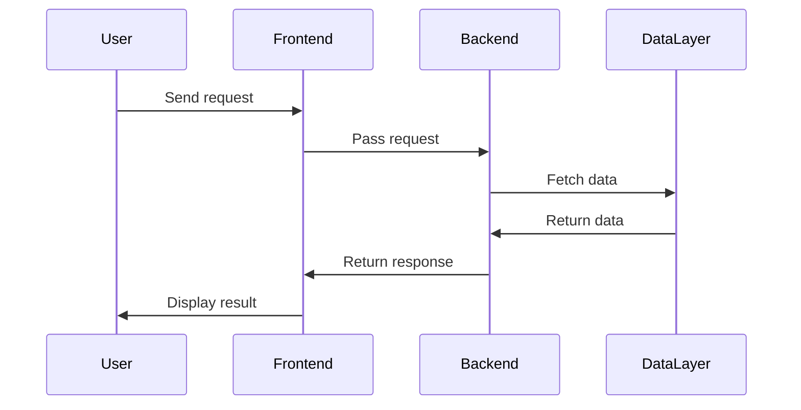

                 


## 第1章：引言与背景

### 1.1 创新管理的现状与挑战

创新管理作为现代企业发展的核心驱动力，已经成为企业管理层关注的重要议题。然而，随着全球竞争的加剧和技术的快速发展，创新管理的现状面临着诸多挑战。首先，传统的创新管理模式往往依赖于经验和直觉，缺乏系统性和科学性，导致创新效率低下。其次，创新管理需要大量的时间和资源投入，但往往难以产生预期的效果。此外，创新过程中的风险管理和资源分配问题也使许多企业在创新道路上步履维艰。

为了应对这些挑战，越来越多的企业开始探索利用AI技术进行创新管理。AI在数据处理、模式识别和自动化决策方面具有显著优势，可以大大提高创新管理的效率和准确性。例如，AI可以帮助企业快速分析市场趋势，预测潜在的创新机会，从而指导创新决策。此外，AI还可以通过自动化流程和智能分析，降低创新过程中的风险，提高创新成功的可能性。

### 1.2 思维链的概念

思维链是指一系列相互关联的思考步骤，这些步骤可以帮助个体或团队系统地解决问题或实现目标。思维链的核心在于将复杂的问题分解为可管理的部分，并通过逻辑和关联性逐步解决。思维链的特点包括逻辑性、系统性和灵活性。逻辑性确保思考过程的连贯性和有效性；系统性使得问题解决过程有序进行；灵活性则允许在问题解决过程中根据实际情况进行调整。

在创新管理中，思维链的应用至关重要。通过思维链，企业可以系统地识别创新机会，评估创意，并制定创新策略。例如，企业可以使用思维链来分析市场需求，评估潜在的技术可行性，以及确定创新的优先级。此外，思维链还可以帮助企业跟踪创新过程，评估创新效果，并为后续的创新活动提供反馈和指导。

### 1.3 AI在创意评估与筛选中的应用

AI在创意评估与筛选中的应用主要体现在以下几个方面：

#### 1.3.1 创意生成与优化

AI可以通过生成对抗网络（GAN）等技术生成大量的创意，从而拓宽创新的视野。这些创意可以是文字、图像、音频等多种形式。AI还可以利用进化算法等优化技术对创意进行迭代和改进，提高创意的质量和可行性。

#### 1.3.2 创意筛选的标准

AI可以根据预设的评估标准，对创意进行自动化筛选。这些标准可以是创新性、市场潜力、技术可行性等。AI通过学习大量的创意案例，可以自动识别哪些特征是成功创意的关键因素，从而更准确地评估新创意。

#### 1.3.3 创意评估的方法

AI可以使用机器学习算法对创意进行定量和定性评估。定量评估通常涉及计算各种指标，如创意的流行度、影响力等。定性评估则依赖于文本分析、情感分析等技术，对创意的内容和表达进行深入分析。

### 1.4 本书结构安排与阅读建议

本书分为两个主要部分。第一部分主要介绍创新管理的现状和挑战，思维链的概念及其在创新管理中的应用，以及AI在创意评估与筛选中的具体应用方法。第二部分则通过案例分析和实战指导，深入探讨如何构建有效的思维链，以及如何利用AI技术进行创意评估和筛选。

本书适合企业创新管理者、技术团队领导者以及对创新管理和AI应用感兴趣的读者阅读。通过本书，读者可以系统地了解创新管理中的思维链应用，掌握AI辅助创意评估与筛选的核心技术和方法，从而提升企业的创新能力和竞争力。

### 1.5 本章小结

本章介绍了创新管理的现状与挑战，思维链的概念及其重要性，以及AI在创意评估与筛选中的应用。创新管理是现代企业发展不可或缺的一环，但传统模式面临着诸多挑战。思维链作为一种系统化的思考方法，可以有效地帮助企业和团队应对这些挑战。AI技术的引入，为创新管理提供了新的工具和方法，使得创意评估和筛选过程更加高效和准确。下一章将深入探讨思维链的构建方法和其在创新管理中的应用。

----------------------------------------------------------------

## 第1章：思维链的概念与应用

### 1.1.1 创新管理的定义

创新管理是指企业或组织通过系统化的方法，整合内外部资源，以实现创新目标的过程。它不仅包括新产品、新技术的开发，还包括新商业模式、新服务、新市场的开拓。创新管理强调的是通过创新来提升企业的竞争力，推动企业的可持续发展。

### 1.1.2 创新管理的关键要素

创新管理的关键要素包括：创新战略、组织结构、文化氛围、人才管理、资源投入和风险管理。创新战略是创新管理的核心，决定了企业创新的方向和目标。组织结构需要支持创新活动，确保创新过程的高效执行。文化氛围则是创新管理的基础，鼓励员工敢于尝试、勇于创新。人才管理则是确保创新团队具备足够的能力和专业知识。资源投入是创新管理的重要保障，充足的资金和物资支持能够加速创新进程。最后，风险管理是创新管理中不可忽视的一环，需要通过科学的方法来评估和管理创新过程中的风险。

### 1.1.3 创新管理面临的挑战

尽管创新管理对于企业的长期发展至关重要，但在实际操作中仍面临诸多挑战。首先，创新效率低下是一个普遍存在的问题。传统创新管理模式往往依赖于个体经验，缺乏系统性和科学性，导致创新周期长、成本高。其次，资源分配不均是另一个挑战。企业往往在创新初期投入大量资源，但随着项目的进展，资源分配可能逐渐失衡，影响创新效果。此外，风险管理也是一个难题。创新过程涉及诸多不确定性，如何科学地评估和管理风险，避免因风险导致创新失败，是企业需要认真思考的问题。

### 1.2 思维链的概念

思维链是指一系列相互关联的思考步骤，这些步骤可以帮助个体或团队系统地解决问题或实现目标。思维链的核心在于将复杂的问题分解为可管理的部分，并通过逻辑和关联性逐步解决。思维链的特点包括逻辑性、系统性和灵活性。逻辑性确保思考过程的连贯性和有效性；系统性使得问题解决过程有序进行；灵活性则允许在问题解决过程中根据实际情况进行调整。

### 1.2.1 思维链的定义

思维链可以定义为一组有序的、相互关联的思考步骤，每个步骤都是基于前一个步骤的结果，并为下一个步骤提供输入。思维链通常包括问题定义、目标设定、解决方案设计、评估与优化等步骤。例如，在创新管理中，思维链可以帮助企业从识别市场需求开始，通过目标设定，设计解决方案，评估解决方案的创新性、可行性和市场潜力，并进行优化，最终实现创新目标。

### 1.2.2 思维链的特点

1. **逻辑性**：思维链的每个步骤都是基于逻辑推理的，前一步骤的结果直接影响后续步骤的决策和执行，从而确保整个过程的连贯性和一致性。
2. **系统性**：思维链将复杂的问题分解为若干个子问题，并通过有序的步骤逐一解决，从而实现问题整体的系统性解决。
3. **灵活性**：在思维链的执行过程中，可以根据实际情况对步骤进行调整，以适应变化的情境和需求，提高问题解决的灵活性和适应性。

### 1.2.3 思维链在创新管理中的重要性

在创新管理中，思维链的重要性体现在以下几个方面：

1. **系统化解决问题**：思维链将创新过程分解为可管理的步骤，有助于企业系统地识别问题、分析问题、解决问题，从而提高创新效率。
2. **提升决策质量**：思维链通过逻辑和关联性，帮助企业在创新过程中做出更为科学和理性的决策，减少盲目性和随机性。
3. **提高创新能力**：思维链鼓励团队在创新过程中不断反思、改进和优化，从而激发团队的创造力和创新能力。
4. **适应复杂环境**：思维链的灵活性使得企业能够在面对复杂、动态的环境时，灵活调整创新策略和过程，提高适应性。

### 1.3 AI在创意评估与筛选中的应用

AI在创意评估与筛选中的应用主要体现在以下几个方面：

#### 1.3.1 创意生成与优化

AI可以通过生成对抗网络（GAN）等技术生成大量的创意，从而拓宽创新的视野。这些创意可以是文字、图像、音频等多种形式。AI还可以利用进化算法等优化技术对创意进行迭代和改进，提高创意的质量和可行性。

#### 1.3.2 创意筛选的标准

AI可以根据预设的评估标准，对创意进行自动化筛选。这些标准可以是创新性、市场潜力、技术可行性等。AI通过学习大量的创意案例，可以自动识别哪些特征是成功创意的关键因素，从而更准确地评估新创意。

#### 1.3.3 创意评估的方法

AI可以使用机器学习算法对创意进行定量和定性评估。定量评估通常涉及计算各种指标，如创意的流行度、影响力等。定性评估则依赖于文本分析、情感分析等技术，对创意的内容和表达进行深入分析。

### 1.3.1.1 创意生成与优化

在创意生成与优化方面，AI技术展现了强大的能力。首先，生成对抗网络（GAN）是一种通过两个神经网络——生成器和判别器——进行博弈的过程，旨在生成与真实数据相似的新数据。在创意生成中，GAN可以生成大量的文字、图像、音频等多种形式的创意，为创新者提供了丰富的灵感来源。例如，通过GAN生成的图像可以用于产品设计的初步构思，而生成的音频则可以用于音乐创作和广告制作。

其次，进化算法（Evolutionary Algorithm，EA）是一种模拟自然进化过程的优化算法。在创意优化中，进化算法可以通过迭代过程不断优化创意，提高其质量和可行性。具体来说，进化算法会将创意编码成染色体，然后通过选择、交叉和变异等操作，逐步优化创意，使其更符合创新目标。例如，在广告创意优化中，进化算法可以根据用户的反馈和历史数据，不断调整广告文案和设计，以提高广告的吸引力和转化率。

### 1.3.1.2 创意筛选的标准

创意筛选的标准是评估创意的重要依据。这些标准通常包括创新性、市场潜力、技术可行性、用户体验等。创新性是衡量创意是否具有突破性或独特性的指标；市场潜力则评估创意在市场中的潜在影响和盈利能力；技术可行性则考察创意实现的技术难度和成本；用户体验则关注创意是否符合用户需求和期望。

在AI辅助创意筛选中，可以采用多种算法和技术来制定和执行筛选标准。例如，基于机器学习的方法可以通过分析大量的创意案例，学习并识别出成功创意的特征，从而为新的创意进行评估。具体来说，可以使用监督学习算法，如决策树、随机森林和神经网络等，通过训练模型来预测新创意的成功概率。此外，还可以使用无监督学习方法，如聚类和降维技术，对创意进行初步筛选，识别出潜在的高质量创意。

### 1.3.1.3 创意评估的方法

AI在创意评估中的应用方法多种多样，主要包括定量评估和定性评估两种类型。

**定量评估**主要通过计算各种指标来评估创意的质量。例如，可以使用流行度指标来衡量创意在社交媒体上的受欢迎程度，使用影响力指标来评估创意对社会或市场的潜在影响，使用转化率指标来评估创意的商业价值。定量评估的优点在于其客观性和可量化性，能够提供直观的评估结果。例如，通过分析社交媒体数据，可以计算出某创意的点赞数、分享数和评论数，从而判断其受欢迎程度。

**定性评估**则侧重于对创意的内容和表达进行深入分析。定性评估通常依赖于文本分析、情感分析和内容分析等技术。文本分析技术可以提取创意中的关键信息，分析其语义和逻辑结构；情感分析技术可以识别创意中的情感倾向，如喜悦、愤怒、悲伤等，从而评估创意的情感吸引力；内容分析技术则可以全面评估创意的丰富性和多样性。

例如，在广告创意评估中，可以使用文本分析技术提取广告文案中的关键术语和情感词汇，通过情感分析判断广告是否能够引起用户的情感共鸣，从而评估广告的吸引力。同时，还可以使用内容分析技术评估广告内容的丰富度和创意性，确保广告能够满足用户的需求和期望。

### 1.3.2 数据采集与处理

数据采集与处理是AI辅助创意评估的关键环节。首先，数据采集需要覆盖创意生成的全过程，包括创意的来源、内容、形式和传播路径等。数据来源可以包括社交媒体、用户反馈、市场调研、竞争分析等多种渠道。例如，通过社交媒体平台采集用户的点赞、评论和分享数据，可以了解创意在用户中的受欢迎程度。

在数据采集后，需要进行数据处理，以确保数据的质量和一致性。数据处理包括数据清洗、数据预处理和特征提取等步骤。数据清洗主要是去除无效数据、重复数据和错误数据，确保数据的质量。数据预处理包括数据格式转换、缺失值填补和数据归一化等，以提高数据的可用性。特征提取则是从原始数据中提取对创意评估有重要影响的关键特征，如创意的语义特征、情感特征和用户特征等。

例如，在社交媒体数据中，可以使用自然语言处理（NLP）技术提取创意文案的关键术语和情感倾向，使用图像处理技术提取创意图片的关键特征，如颜色、形状和纹理等。通过这些处理步骤，可以构建一个全面、多维的数据集，为AI模型提供高质量的数据输入。

### 1.3.3 特征提取与建模

特征提取与建模是AI辅助创意评估的核心步骤。特征提取是从原始数据中提取对创意评估有重要影响的关键特征，如文本特征、图像特征和用户特征等。特征提取的方法包括词袋模型、词嵌入、图像特征提取等。

词袋模型是将文本数据转换为词汇的集合，通过统计词汇出现的频率来表示文本。词嵌入则是将词汇映射到高维空间，通过计算词与词之间的相似性来表示文本的语义信息。

图像特征提取主要包括颜色特征、纹理特征和形状特征等。颜色特征可以用于描述图像的整体色调和色彩分布；纹理特征可以用于描述图像的纹理结构和图案；形状特征可以用于描述图像的形状和轮廓。

在特征提取后，需要进行建模，即使用机器学习算法建立创意评估模型。常用的机器学习算法包括线性回归、决策树、随机森林、支持向量机和神经网络等。这些算法通过学习特征和标签之间的关系，可以预测新创意的评估结果。

例如，可以使用线性回归模型预测创意的流行度，通过训练模型来识别影响流行度的关键特征。在训练过程中，可以使用交叉验证方法来评估模型的性能，并调整模型参数以优化评估结果。

### 1.3.4 评估模型的训练与验证

评估模型的训练与验证是AI辅助创意评估的关键环节。首先，需要将数据进行划分，分为训练集和验证集。训练集用于训练模型，验证集用于评估模型的性能。

在训练模型时，需要选择合适的算法和超参数。常用的算法包括线性回归、决策树、随机森林、支持向量机和神经网络等。超参数的调整可以通过网格搜索或随机搜索等方法进行。

在训练过程中，可以使用损失函数来衡量模型的预测误差，并通过优化算法（如梯度下降）来调整模型参数，以减少误差。

在验证阶段，通过在验证集上评估模型的性能，可以确定模型的泛化能力。常用的评估指标包括准确率、召回率、F1分数等。

如果模型在验证集上的性能不佳，可以调整模型结构或超参数，或增加更多的特征，以提高模型的性能。

### 1.4 思维链的构建方法

思维链的构建是创新管理中不可或缺的一环，它帮助企业和团队系统化地识别创新机会，评估创意，并制定创新策略。思维链的构建方法主要包括以下步骤：

#### 1.4.1 问题定义与目标设定

问题定义是思维链构建的第一步。在这一阶段，需要明确创新的目标和解决的问题。具体来说，需要回答以下问题：

- 我们要解决的问题是什么？
- 解决这个问题的重要性如何？
- 目标解决方案应该具备哪些特征和功能？

通过明确问题定义，可以确保创新活动具有明确的方向和目标。

#### 1.4.2 数据收集与整理

在问题定义明确后，需要进行数据收集。数据来源可以包括市场调研、用户反馈、竞争对手分析等。数据收集后，需要进行整理和预处理，以确保数据的质量和一致性。具体包括：

- 数据清洗：去除无效、重复和错误的数据。
- 数据格式转换：统一数据格式，便于后续处理。
- 缺失值填补：对于缺失的数据，可以通过平均值、中值或插值等方法进行填补。

通过数据整理，可以构建一个高质量的数据集，为后续分析提供基础。

#### 1.4.3 思维链设计

在数据整理完成后，可以进行思维链的设计。思维链设计包括以下步骤：

- 设计思维链结构：确定思维链的步骤和逻辑关系，确保各步骤的连贯性和一致性。
- 选择思维链工具：根据问题的复杂性和需求，选择合适的思维链工具和方法，如思维导图、鱼骨图、SWOT分析等。
- 确定思维链参数：包括思维链的迭代次数、阈值、权重等，以确保思维链的有效性和可操作性。

通过思维链设计，可以构建一个系统化的思考框架，帮助企业和团队更好地分析问题和制定创新策略。

#### 1.4.4 思维链验证与优化

思维链设计完成后，需要进行验证与优化。具体包括：

- 思维链验证：通过实际案例或模拟实验，验证思维链的有效性和可行性，确保思维链能够达到预期的目标。
- 思维链优化：根据验证结果，对思维链进行调整和优化，提高其性能和适应性。

通过思维链的验证与优化，可以确保思维链在创新管理中的应用效果。

### 1.4.5 思维链在实际创新管理中的应用案例

思维链在创新管理中的应用可以具体体现在多个方面，以下是几个实际应用案例：

**案例1：新产品开发**

某公司希望开发一款新型智能家居设备。通过思维链，公司首先明确了目标用户和市场需求，收集了用户反馈和市场数据。然后，利用思维链设计了产品功能模块和用户体验，并进行了多次迭代优化。最终，公司成功推出了市场反响良好的智能家居设备。

**案例2：市场拓展**

一家在线教育公司希望通过思维链确定新的市场拓展方向。通过思维链，公司分析了现有市场的竞争格局、用户需求和潜在机会，确定了新的市场目标和策略。在实施过程中，公司不断优化思维链，根据市场反馈调整策略，最终实现了市场拓展的目标。

**案例3：商业模式创新**

一家传统制造业公司希望通过思维链进行商业模式创新。公司首先明确了现有商业模式的局限性和改进方向，然后利用思维链分析了新的商业模式，包括市场机会、竞争格局和实施路径。最终，公司成功转型，实现了商业模式的创新和升级。

### 1.5 不同类型思维链的构建策略

思维链在创新管理中的应用广泛，根据问题的不同特点和应用场景，可以构建多种类型的思维链。以下是几种常见的思维链类型及其构建策略：

#### 1.5.1 逻辑思维链

逻辑思维链适用于需要通过逻辑推理解决问题的场景。构建逻辑思维链的步骤包括：

- 确定逻辑起点：明确问题或目标，作为逻辑思维链的起点。
- 提出假设：根据现有信息和经验，提出可能的解决方案或假设。
- 逻辑推导：基于假设，进行逻辑推理，逐步推导出可能的解决方案。
- 验证与优化：通过实际案例或模拟实验，验证逻辑思维链的有效性，并进行优化。

例如，在产品开发中，可以通过逻辑思维链确定产品的功能和特性，从市场需求、用户反馈和技术可行性等方面进行逻辑推导，最终得出可行的产品方案。

#### 1.5.2 想象力思维链

想象力思维链适用于需要发挥创意和想象力的场景。构建想象力思维链的步骤包括：

- 激发想象力：通过脑暴、思维导图等方法，激发团队成员的想象力，提出各种创新的想法。
- 筛选创意：根据创新性、可行性、市场潜力等标准，筛选出具有潜力的创意。
- 创意优化：对筛选出的创意进行迭代和优化，提高其质量和可行性。
- 实施验证：将创意付诸实践，通过实验或市场测试，验证创意的实际效果。

例如，在广告创意设计过程中，可以通过想象力思维链激发创意，筛选出具有吸引力的广告方案，并进行优化和验证。

#### 1.5.3 创造力思维链

创造力思维链适用于需要培养团队创造力的场景。构建创造力思维链的步骤包括：

- 营造创新氛围：建立鼓励创新和失败的企业文化，营造轻松、开放的创新氛围。
- 培养创新意识：通过培训、研讨会等方式，提高团队成员的创新意识和能力。
- 创造力训练：通过思维导图、设计思维等方法，进行创造力训练，提高团队的创新效率。
- 创造力评估：通过定期的创造力评估，了解团队成员的创新表现，并提供反馈和指导。

例如，在技术研发团队中，可以通过创造力思维链培养团队的创新能力，提高研发效率，加速技术创新。

### 1.6 思维链在创新管理中的应用效果

思维链在创新管理中的应用效果显著，主要体现在以下几个方面：

1. **提高创新效率**：通过系统化的思维链，企业和团队可以更加高效地识别创新机会，评估创意，制定创新策略，减少创新过程中的盲目性和随机性。
2. **提升决策质量**：思维链通过逻辑和关联性，帮助企业和团队在创新过程中做出更为科学和理性的决策，减少决策的失误。
3. **激发团队创造力**：思维链鼓励团队进行系统化的思考和创造，激发团队的创造力和创新能力，提高创新成果的质量和数量。
4. **优化创新过程**：思维链通过不断验证和优化，可以帮助企业和团队不断完善创新过程，提高创新的可持续性和持续性。

### 1.7 本章小结

本章介绍了思维链的概念、特点及其在创新管理中的应用。思维链是一种系统化的思考方法，通过逻辑、系统和灵活性，帮助企业和团队更好地识别创新机会，评估创意，制定创新策略。本章还介绍了不同类型的思维链构建策略，包括逻辑思维链、想象力思维链和创造力思维链，以及思维链在创新管理中的应用效果。通过思维链的应用，企业和团队可以更高效地推动创新，提升竞争力。

----------------------------------------------------------------

## 第2章：思维链的构建方法

### 2.1 思维链的构建步骤

构建思维链是一个系统化的过程，需要遵循一系列明确的步骤，以确保思维链的有效性和连贯性。以下是构建思维链的主要步骤：

#### 2.1.1 问题定义与目标设定

问题定义与目标设定是思维链构建的第一步。在这个阶段，需要明确要解决的问题和期望达成的目标。具体包括：

- 明确问题背景：阐述问题的来源、现状和影响，确保所有参与者对问题的理解一致。
- 确定目标：基于问题背景，设定清晰、具体的创新目标，确保目标的可实现性和可衡量性。

#### 2.1.2 数据收集与整理

在问题定义和目标设定之后，需要进行数据收集和整理。数据收集是思维链构建的基础，数据质量直接影响思维链的有效性。数据收集包括：

- 调查数据：通过问卷、访谈等方式收集用户需求、市场趋势等数据。
- 竞争对手分析：分析竞争对手的产品、服务、策略等，了解市场动态。
- 内部数据：利用企业内部数据，如销售数据、用户反馈等，为创新提供参考。

数据整理则包括：

- 数据清洗：去除无效、重复和错误的数据。
- 数据格式转换：统一数据格式，便于后续处理。
- 缺失值填补：对于缺失的数据，可以通过平均值、中值或插值等方法进行填补。

#### 2.1.3 思维链设计

在数据整理完成后，需要进行思维链的设计。思维链设计包括以下步骤：

- 设计思维链结构：确定思维链的步骤和逻辑关系，确保各步骤的连贯性和一致性。
- 选择思维链工具：根据问题的复杂性和需求，选择合适的思维链工具和方法，如思维导图、鱼骨图、SWOT分析等。
- 确定思维链参数：包括思维链的迭代次数、阈值、权重等，以确保思维链的有效性和可操作性。

#### 2.1.4 思维链验证与优化

思维链设计完成后，需要进行验证与优化。具体包括：

- 思维链验证：通过实际案例或模拟实验，验证思维链的有效性和可行性，确保思维链能够达到预期的目标。
- 思维链优化：根据验证结果，对思维链进行调整和优化，提高其性能和适应性。

### 2.2 不同类型思维链的构建策略

思维链在创新管理中具有多种类型，每种类型都有其特定的构建策略和应用场景。以下是三种常见的思维链类型及其构建策略：

#### 2.2.1 逻辑思维链

逻辑思维链适用于需要通过逻辑推理解决问题的场景。其构建策略包括：

- **确定逻辑起点**：明确问题或目标，作为逻辑思维链的起点。
- **提出假设**：根据现有信息和经验，提出可能的解决方案或假设。
- **逻辑推导**：基于假设，进行逻辑推理，逐步推导出可能的解决方案。
- **验证与优化**：通过实际案例或模拟实验，验证逻辑思维链的有效性，并进行优化。

#### 2.2.2 想象力思维链

想象力思维链适用于需要发挥创意和想象力的场景。其构建策略包括：

- **激发想象力**：通过脑暴、思维导图等方法，激发团队成员的想象力，提出各种创新的想法。
- **筛选创意**：根据创新性、可行性、市场潜力等标准，筛选出具有潜力的创意。
- **创意优化**：对筛选出的创意进行迭代和优化，提高其质量和可行性。
- **实施验证**：将创意付诸实践，通过实验或市场测试，验证创意的实际效果。

#### 2.2.3 创造力思维链

创造力思维链适用于需要培养团队创造力的场景。其构建策略包括：

- **营造创新氛围**：建立鼓励创新和失败的企业文化，营造轻松、开放的创新氛围。
- **培养创新意识**：通过培训、研讨会等方式，提高团队成员的创新意识和能力。
- **创造力训练**：通过思维导图、设计思维等方法，进行创造力训练，提高团队的创新效率。
- **创造力评估**：通过定期的创造力评估，了解团队成员的创新表现，并提供反馈和指导。

### 2.3 思维链工具与方法

在构建思维链时，可以借助多种工具和方法，以提高思维链的效率和质量。以下是几种常见的思维链工具和方法：

#### 2.3.1 思维导图

思维导图是一种图形化的思维工具，可以帮助团队成员将思维过程可视化。构建思维链时，可以使用思维导图来：

- **梳理思路**：通过图形化的方式，将思维链的各个步骤和子步骤可视化，方便团队成员理解和跟进。
- **促进沟通**：通过共享思维导图，团队成员可以更直观地交流思路和想法，提高协作效率。

#### 2.3.2 SWOT分析

SWOT分析是一种常用的战略规划工具，可以帮助团队识别创新机会和挑战。构建思维链时，可以使用SWOT分析来：

- **识别优势**：分析企业在资源、技术、市场等方面的优势，为创新提供支持。
- **分析劣势**：识别企业在创新过程中的劣势和挑战，制定相应的应对策略。
- **把握机会**：分析市场趋势和用户需求，把握创新的机会。
- **规避风险**：通过识别潜在风险，提前制定规避和应对措施。

#### 2.3.3 脑暴

脑暴是一种集体创意激发方法，可以帮助团队成员快速产生大量创意。构建思维链时，可以使用脑暴来：

- **激发想象力**：在短时间内收集团队成员的创意和想法，为创新提供丰富的素材。
- **筛选优质创意**：通过对脑暴结果的筛选和优化，确定具有潜力的创意进行深入开发。

#### 2.3.4 设计思维

设计思维是一种以人为本的创新方法，强调用户需求和用户体验。构建思维链时，可以使用设计思维来：

- **理解用户需求**：通过用户研究，深入了解用户的需求和痛点，为创新提供方向。
- **构建原型**：快速构建产品原型，通过用户测试和反馈，不断优化产品设计和功能。
- **迭代改进**：根据用户反馈，不断迭代和优化产品，提高其质量和用户满意度。

### 2.4 思维链构建案例分析

为了更好地理解思维链的构建方法，以下通过一个实际案例进行详细说明。

**案例背景**：

某电子产品公司希望开发一款具有创新功能的新型智能手机。为了确保创新的成功，公司决定使用思维链进行系统化的创新管理。

**步骤1：问题定义与目标设定**

- **问题定义**：市场上智能手机同质化严重，用户需求难以满足，公司需要开发一款具有独特功能和创新体验的智能手机。
- **目标设定**：开发一款具有以下特点的智能手机：
  - **独特功能**：能够满足用户特定需求，如健康监测、智能助手等。
  - **优质体验**：提供流畅的使用体验和出色的外观设计。
  - **市场竞争力**：具备良好的市场表现和盈利能力。

**步骤2：数据收集与整理**

- **调查数据**：通过市场调研和用户访谈，了解用户对智能手机的需求和偏好。
- **竞争对手分析**：分析竞争对手的产品特点、市场策略和用户评价。
- **内部数据**：利用公司内部研发数据和市场销售数据，评估现有技术的可行性。

**步骤3：思维链设计**

- **设计思维链结构**：确定思维链的步骤和逻辑关系，包括用户需求分析、功能设计、技术评估、市场分析等。
- **选择思维链工具**：使用思维导图和SWOT分析，帮助团队成员可视化思维过程，识别关键因素。
- **确定思维链参数**：设置思维链的迭代次数、评估标准和权重，确保思维链的有效性和可操作性。

**步骤4：思维链验证与优化**

- **思维链验证**：通过实际案例和模拟实验，验证思维链的有效性。例如，通过用户测试，评估新功能的用户接受度和体验。
- **思维链优化**：根据验证结果，对思维链进行调整和优化。例如，根据用户反馈，优化功能设计和用户体验。

**步骤5：创意生成与筛选**

- **创意生成**：通过脑暴和设计思维，生成大量创新想法。例如，提出智能健康监测、智能家居控制等创意。
- **创意筛选**：根据创新性、可行性和市场潜力等标准，筛选出具有潜力的创意。例如，选择智能健康监测作为主要创新方向。

**步骤6：方案设计与实施**

- **方案设计**：基于筛选出的创意，设计具体的技术方案和市场策略。
- **实施与验证**：通过实验和市场测试，验证方案的可行性和市场表现。例如，开发智能健康监测功能，并通过用户测试和反馈，不断优化和完善。

**步骤7：总结与反馈**

- **总结经验**：通过总结创新过程的经验和教训，为后续创新活动提供参考。
- **反馈机制**：建立反馈机制，收集用户和市场的反馈，持续改进产品和服务。

### 2.5 思维链构建的注意事项

在构建思维链时，需要注意以下几点：

- **确保团队成员的参与度**：思维链的构建需要团队协作，确保每个成员的参与和贡献，提高思维链的质量和效果。
- **持续迭代与优化**：思维链是一个动态的过程，需要根据实际情况进行迭代和优化，确保思维链的持续有效。
- **平衡创新与风险**：在创新过程中，需要平衡创新和风险，确保创新项目的成功实施。
- **注重用户反馈**：用户反馈是思维链优化的重要依据，需要及时收集和分析用户反馈，为创新决策提供支持。

### 2.6 本章小结

本章介绍了思维链的构建方法，包括问题定义与目标设定、数据收集与整理、思维链设计、思维链验证与优化等步骤。同时，还介绍了不同类型的思维链构建策略和常见的思维链工具与方法。通过实际案例分析，展示了思维链在创新管理中的应用效果。通过本章的学习，读者可以掌握思维链的构建方法和应用技巧，提高创新管理的能力和效率。

----------------------------------------------------------------

## 第3章：AI辅助创意评估方法

### 3.1 AI辅助创意评估的基本原理

AI辅助创意评估是指利用人工智能技术，对创意的质量、可行性、创新性和市场潜力等进行评估和分析的方法。其基本原理主要基于以下几个关键点：

#### 3.1.1 数据驱动的分析

AI辅助创意评估依赖于大量的数据，包括用户行为数据、市场数据、技术数据等。通过分析这些数据，AI可以识别出创意的关键特征和趋势，从而对创意进行定量和定性评估。数据驱动的分析确保了评估过程的客观性和准确性。

#### 3.1.2 机器学习算法的应用

机器学习算法是AI辅助创意评估的核心工具。这些算法通过学习大量已知的创意案例和评估结果，可以自动识别和提取创意的关键特征，并建立评估模型。常用的机器学习算法包括线性回归、决策树、随机森林、支持向量机和神经网络等。这些算法可以根据不同类型的评估需求，选择合适的模型和参数，提高评估的准确性和效率。

#### 3.1.3 特征提取与降维

在AI辅助创意评估中，特征提取和降维技术是重要的预处理步骤。特征提取可以从原始数据中提取对评估有重要影响的关键特征，如文本特征、图像特征和用户特征等。降维技术则可以减少数据的维度，提高模型的计算效率和准确性。常用的降维技术包括主成分分析（PCA）、线性判别分析（LDA）和t-SNE等。

#### 3.1.4 定量与定性评估的结合

AI辅助创意评估不仅依赖定量评估，还结合了定性评估。定量评估通常涉及计算各种指标，如创意的流行度、影响力、技术可行性等。定性评估则依赖于文本分析、情感分析等技术，对创意的内容和表达进行深入分析。定量与定性评估的结合，可以提供更全面、多维的评估结果。

### 3.2 创意评估的指标体系

创意评估的指标体系是评估创意质量的重要依据，这些指标可以分为以下几类：

#### 3.2.1 创新性指标

创新性指标衡量创意的新颖程度和突破性。常见的创新性指标包括：

- **创意独特性**：创意是否具有独特的视角或解决方案。
- **创意先进性**：创意是否领先于现有技术和市场趋势。
- **创意灵活性**：创意是否具备适应性和灵活性，能够在不同环境下应用。

#### 3.2.2 可行性指标

可行性指标衡量创意在实际实施中的可能性。常见的可行性指标包括：

- **技术可行性**：创意是否基于现有的技术能力，技术难度是否在可控范围内。
- **市场可行性**：创意是否能够满足市场需求，是否具备市场竞争力。
- **资源可行性**：创意是否在人力、资金等资源上具备可行性。

#### 3.2.3 市场潜力指标

市场潜力指标衡量创意的商业价值和市场前景。常见的市场潜力指标包括：

- **市场吸引力**：创意是否能够吸引目标用户，市场潜力如何。
- **盈利能力**：创意是否能够带来持续的经济效益。
- **扩展性**：创意是否具备扩展性和可持续发展潜力。

#### 3.2.4 用户体验指标

用户体验指标衡量创意的用户接受度和满意度。常见的用户体验指标包括：

- **易用性**：创意是否易于使用，用户操作是否流畅。
- **满意度**：用户对创意的整体满意度如何。
- **反馈率**：用户对创意的反馈率和积极性。

### 3.3 数据分析与挖掘技术

数据分析与挖掘技术是AI辅助创意评估的重要手段，以下介绍几种常用的技术：

#### 3.3.1 文本分析

文本分析是一种处理和解析文本数据的技术，用于提取文本中的关键信息、情感倾向和语义结构。常用的文本分析技术包括：

- **词袋模型**：将文本转换为词汇的集合，通过统计词汇出现的频率来表示文本。
- **词嵌入**：将词汇映射到高维空间，通过计算词与词之间的相似性来表示文本的语义信息。
- **主题建模**：通过隐含狄利克雷分布（LDA）等算法，识别文本中的主题和关键词。

#### 3.3.2 情感分析

情感分析是一种评估文本情感倾向的技术，用于判断文本表达的情感是正面、负面还是中性。常用的情感分析技术包括：

- **基于规则的方法**：通过预设的情感词典和规则，对文本进行情感分类。
- **机器学习方法**：通过训练情感分类模型，对文本进行情感分类。

#### 3.3.3 聚类分析

聚类分析是一种无监督学习方法，用于将相似的数据点分组。常用的聚类算法包括：

- **K均值聚类**：通过最小化聚类中心与数据点的距离平方和来划分聚类。
- **层次聚类**：通过逐步合并或分裂聚类，构建聚类层次结构。

#### 3.3.4 降维技术

降维技术用于减少数据的维度，提高模型的计算效率和准确性。常用的降维技术包括：

- **主成分分析（PCA）**：通过保留主要成分，降低数据的维度。
- **线性判别分析（LDA）**：通过最大化类内方差和最小化类间方差，降低数据的维度。
- **t-SNE**：通过非线性降维，将高维数据映射到低维空间，保持数据的局部结构。

### 3.4 AI辅助创意评估的流程

AI辅助创意评估的流程通常包括数据收集、预处理、特征提取、模型训练和评估等步骤。以下是具体的流程：

#### 3.4.1 数据收集

数据收集是AI辅助创意评估的基础。数据来源可以包括社交媒体、用户反馈、市场调研、竞争分析等。收集的数据类型包括文本、图像、音频等。

#### 3.4.2 数据预处理

数据预处理包括数据清洗、数据格式转换和缺失值填补等步骤。数据清洗可以去除无效数据、重复数据和错误数据，确保数据的质量。数据格式转换可以统一数据格式，便于后续处理。缺失值填补可以采用平均值、中值或插值等方法，减少数据缺失对评估结果的影响。

#### 3.4.3 特征提取

特征提取是从原始数据中提取对评估有重要影响的关键特征。特征提取的方法包括文本分析、图像处理和用户行为分析等。通过特征提取，可以将高维数据转换为低维特征向量，提高模型的计算效率和准确性。

#### 3.4.4 模型训练

模型训练是利用机器学习算法，将特征和评估结果进行学习，建立评估模型。常用的模型包括线性回归、决策树、随机森林、支持向量机和神经网络等。模型训练可以通过交叉验证等方法，优化模型参数，提高模型的性能。

#### 3.4.5 模型评估

模型评估是评估模型性能的重要步骤。评估指标包括准确率、召回率、F1分数等。通过在验证集上评估模型性能，可以确定模型的泛化能力。如果模型性能不佳，可以通过调整模型结构或特征，进行优化。

#### 3.4.6 创意评估

在模型训练和评估完成后，可以利用训练好的模型对新的创意进行评估。评估结果可以提供创意筛选、优化和优先级排序的依据。通过AI辅助创意评估，可以大大提高创意评估的效率和准确性。

### 3.5 案例分析：AI辅助广告创意评估

广告创意评估是AI辅助创意评估的一个典型应用场景。以下是具体的案例分析：

**案例背景**：

某广告公司希望通过AI技术，对广告创意进行评估，以提高广告的吸引力和效果。广告公司收集了大量历史广告数据，包括广告文案、图像、用户反馈和广告效果指标。

**步骤1：数据收集**

广告公司收集了历史广告数据，包括广告文案、图像、用户反馈和广告效果指标，如点击率、转化率等。

**步骤2：数据预处理**

对收集的数据进行清洗和格式转换，去除无效数据，统一数据格式。对于缺失的数据，采用平均值或中值进行填补。

**步骤3：特征提取**

通过文本分析和图像处理技术，提取广告文案和图像的关键特征。例如，提取文案的关键术语和情感倾向，提取图像的颜色、纹理和形状特征。

**步骤4：模型训练**

使用机器学习算法，如随机森林或神经网络，对特征和广告效果指标进行训练，建立广告创意评估模型。通过交叉验证，优化模型参数，提高模型的性能。

**步骤5：模型评估**

在验证集上评估模型性能，使用准确率、召回率、F1分数等指标，确定模型的泛化能力。如果模型性能不佳，通过调整模型结构或特征，进行优化。

**步骤6：创意评估**

使用训练好的模型，对新的广告创意进行评估。评估结果可以提供创意筛选、优化和优先级排序的依据。例如，如果某广告创意的评估结果较低，可以对其进行修改和优化。

**案例效果**：

通过AI辅助广告创意评估，广告公司能够更准确地识别和筛选高质量广告创意，提高广告的吸引力和效果。同时，评估结果还可以为广告创意的优化提供参考，提高广告的商业价值。

### 3.6 AI辅助创意评估的优势与挑战

#### 3.6.1 优势

AI辅助创意评估具有以下优势：

- **高效性**：AI技术可以快速处理大量数据，提高创意评估的效率。
- **准确性**：通过机器学习算法，AI可以准确识别创意的关键特征，提供客观、准确的评估结果。
- **客观性**：AI评估基于数据驱动，减少主观判断的影响，提高评估的客观性。
- **多样性**：AI可以处理多种类型的数据，如文本、图像、音频等，提供多样化的评估视角。

#### 3.6.2 挑战

AI辅助创意评估也面临一些挑战：

- **数据质量**：数据质量直接影响评估结果，需要确保数据的有效性和一致性。
- **算法选择**：选择合适的算法和参数是关键，不同算法适用于不同类型的评估需求。
- **模型解释性**：AI模型的黑箱特性使其难以解释，需要提高模型的透明度和可解释性。
- **适应性**：AI模型需要不断更新和调整，以适应不断变化的市场和用户需求。

### 3.7 本章小结

本章介绍了AI辅助创意评估的基本原理、指标体系、数据分析与挖掘技术以及评估流程。通过案例分析，展示了AI辅助创意评估在广告创意评估中的应用效果。本章还讨论了AI辅助创意评估的优势与挑战。通过本章的学习，读者可以了解AI辅助创意评估的核心技术和方法，为创新管理提供有力的支持。

----------------------------------------------------------------

## 第4章：AI在创意评估与筛选中的应用

### 4.1 AI在创意评估与筛选中的作用

AI在创意评估与筛选中扮演着至关重要的角色，主要体现在以下几个方面：

#### 4.1.1 自动化创意生成

AI技术，如生成对抗网络（GAN）和自然语言处理（NLP），可以自动生成大量的创意。通过这些技术，企业可以快速产生各种创意方案，从而在短时间内扩大创意来源，提高创意的多样性和创新性。

#### 4.1.2 定量与定性评估

AI通过机器学习算法可以对创意进行定量与定性评估。定量评估涉及计算各种指标，如流行度、影响力等，定性评估则依赖于文本分析、情感分析等技术，对创意的内容和表达进行深入分析。这种多维度的评估方法，能够为创意筛选提供更加全面和准确的依据。

#### 4.1.3 创意筛选与优化

AI可以根据预设的标准，对创意进行自动化筛选和优化。通过学习大量的成功案例和评估结果，AI可以自动识别哪些特征是成功创意的关键因素，从而提高创意筛选的准确性和效率。

#### 4.1.4 风险管理

在创意评估和筛选过程中，AI可以识别和评估潜在的风险。通过分析历史数据和市场趋势，AI可以预测创意实施过程中的可能风险，并提供相应的解决方案，从而降低创新风险。

### 4.2 AI辅助创意评估的流程

AI辅助创意评估的流程主要包括以下几个步骤：

#### 4.2.1 数据收集与预处理

数据收集是AI辅助创意评估的基础。数据来源可以包括社交媒体、用户反馈、市场调研等。收集的数据类型包括文本、图像、音频等。数据预处理包括数据清洗、数据格式转换和缺失值填补等步骤，以确保数据的质量和一致性。

#### 4.2.2 特征提取

特征提取是将原始数据转换为机器学习模型可处理的特征向量。对于文本数据，可以通过词袋模型、词嵌入等技术提取文本特征；对于图像数据，可以通过图像处理技术提取颜色、纹理、形状等特征。

#### 4.2.3 模型训练与评估

选择合适的机器学习算法，对特征和评估结果进行训练，建立创意评估模型。模型训练可以通过交叉验证等方法优化模型参数，提高评估准确性。在模型评估阶段，使用验证集和测试集评估模型的性能，确保模型的有效性和泛化能力。

#### 4.2.4 创意评估与筛选

在模型训练完成后，使用训练好的模型对新的创意进行评估。评估结果可以提供创意筛选、优化和优先级排序的依据。通过自动化评估，可以快速识别出高质量创意，提高创新效率。

### 4.3 案例分析：AI在广告创意评估中的应用

广告创意评估是AI在创意评估与筛选中应用的一个典型场景。以下是具体的案例分析：

**案例背景**：

某广告公司希望利用AI技术，对广告创意进行评估和优化，以提高广告效果和商业价值。广告公司收集了大量的广告数据，包括广告文案、图像、用户反馈和广告效果指标。

**步骤1：数据收集**

广告公司收集了大量的广告数据，包括广告文案、图像、用户反馈和广告效果指标，如点击率、转化率等。

**步骤2：数据预处理**

对收集的数据进行清洗和格式转换，去除无效数据，统一数据格式。对于缺失的数据，采用平均值或中值进行填补。

**步骤3：特征提取**

通过文本分析和图像处理技术，提取广告文案和图像的关键特征。例如，提取文案的关键术语和情感倾向，提取图像的颜色、纹理和形状特征。

**步骤4：模型训练**

使用机器学习算法，如随机森林或神经网络，对特征和广告效果指标进行训练，建立广告创意评估模型。通过交叉验证，优化模型参数，提高模型的性能。

**步骤5：模型评估**

在验证集上评估模型性能，使用准确率、召回率、F1分数等指标，确定模型的泛化能力。如果模型性能不佳，通过调整模型结构或特征，进行优化。

**步骤6：创意评估与筛选**

使用训练好的模型，对新的广告创意进行评估。评估结果可以提供创意筛选、优化和优先级排序的依据。例如，如果某广告创意的评估结果较低，可以对其进行修改和优化。

**案例效果**：

通过AI辅助广告创意评估，广告公司能够更准确地识别和筛选高质量广告创意，提高广告的吸引力和效果。同时，评估结果还可以为广告创意的优化提供参考，提高广告的商业价值。

### 4.4 AI在创意评估与筛选中的实际应用案例

#### 4.4.1 案例一：智能音乐创作平台

某智能音乐创作平台利用AI技术，帮助音乐制作人快速生成和优化音乐创意。平台收集了大量的音乐数据，包括旋律、节奏、和声等。通过音乐生成算法，平台可以自动生成各种风格的音乐片段。音乐制作人可以对生成的音乐片段进行评估和优化，选择最符合自己风格的片段进行进一步创作。

**技术细节**：

- **生成算法**：使用深度学习中的循环神经网络（RNN）和变分自编码器（VAE）生成音乐片段。
- **评估模型**：采用情感分析算法，评估音乐片段的情感倾向和音乐风格。

#### 4.4.2 案例二：智能广告创意系统

某广告公司开发了一套智能广告创意系统，通过AI技术，自动化广告创意的生成和评估。系统收集了大量的广告数据，包括文案、图像、视频等。通过机器学习算法，系统可以自动生成各种类型的广告创意，并使用评估模型对创意进行筛选和优化。

**技术细节**：

- **创意生成**：使用生成对抗网络（GAN）和文本生成模型生成广告创意。
- **评估模型**：采用多模态学习，结合图像、文本和用户反馈，建立广告创意评估模型。

#### 4.4.3 案例三：智能剧本评估系统

某影视制作公司开发了一套智能剧本评估系统，通过AI技术，对剧本的创新性、可读性和市场潜力进行评估。系统收集了大量的剧本数据，通过自然语言处理（NLP）和情感分析技术，对剧本进行深入分析。

**技术细节**：

- **NLP技术**：使用词嵌入和主题建模，提取剧本的关键特征。
- **评估模型**：结合情感分析和文本分类，建立剧本评估模型。

### 4.5 AI在创意评估与筛选中的最佳实践

为了充分发挥AI在创意评估与筛选中的作用，以下是一些最佳实践：

- **数据质量**：确保数据的完整性和一致性，提高模型的评估准确性。
- **模型选择**：根据评估需求，选择合适的机器学习算法和模型，提高评估效果。
- **特征工程**：精心设计特征，确保特征能够充分反映创意的质量和潜力。
- **模型优化**：通过交叉验证和模型调整，优化模型性能，提高评估的准确性和可靠性。
- **用户反馈**：收集用户反馈，不断优化评估模型，提高评估的针对性和实用性。

### 4.6 本章小结

本章介绍了AI在创意评估与筛选中的作用、流程以及实际应用案例。通过AI技术，企业可以自动化创意生成，进行定量与定性评估，实现创意筛选和优化。案例分析展示了AI在不同创意领域的应用效果。本章还讨论了AI在创意评估与筛选中的最佳实践。通过本章的学习，读者可以了解AI在创意评估与筛选中的核心技术和方法，为企业的创新管理提供有力支持。

----------------------------------------------------------------

## 第5章：项目实施与实战

### 5.1 项目背景

在本章中，我们将介绍一个基于AI的创意评估与筛选项目的实施过程。该项目旨在利用AI技术，对企业的创意进行系统化评估与筛选，以提高创新效率和市场竞争力。项目涉及的主要任务包括：

- 数据收集与预处理
- 特征提取与建模
- 创意评估与筛选
- 系统实现与优化

### 5.2 项目介绍

**项目名称**：AI创意评估与筛选系统

**项目目标**：构建一个自动化的创意评估与筛选平台，提高创意评估的效率和准确性，帮助企业快速识别和筛选高质量创意。

**项目团队**：由AI专家、数据科学家、产品经理和设计团队组成。

**项目周期**：6个月，分为需求分析、设计、开发、测试和部署五个阶段。

### 5.3 系统功能设计

**功能1：数据收集与预处理**

- **功能描述**：从多个数据源（如社交媒体、用户反馈、市场调研等）收集创意数据，进行数据清洗、格式转换和缺失值填补。
- **设计思路**：利用ETL（Extract, Transform, Load）工具，实现数据的自动化收集和预处理。
- **技术选型**：使用Python的pandas库进行数据清洗和转换，使用SQL进行数据存储和查询。

**功能2：特征提取与建模**

- **功能描述**：对预处理后的数据进行特征提取，建立机器学习模型进行训练，以实现创意的自动评估和筛选。
- **设计思路**：采用多种特征提取技术，如词袋模型、词嵌入、图像处理技术等，构建多模态特征向量。
- **技术选型**：使用scikit-learn库进行特征提取和模型训练，使用TensorFlow和Keras进行深度学习模型的构建和训练。

**功能3：创意评估与筛选**

- **功能描述**：利用训练好的模型对新的创意进行评估和筛选，提供评估结果和推荐方案。
- **设计思路**：基于评估模型，实现自动化的评估流程，根据评估结果进行创意筛选和优先级排序。
- **技术选型**：使用Flask或Django框架，构建API接口，实现与前端页面的交互。

### 5.4 系统架构设计

系统采用分层架构设计，包括数据层、服务层和表现层。

**数据层**：负责数据的存储和读取，包括数据库和缓存系统。数据层采用MySQL数据库存储创意数据，使用Redis缓存热点数据。

**服务层**：负责业务逻辑的处理，包括数据预处理、特征提取、模型训练和评估等。服务层采用微服务架构，每个服务模块独立部署，以提高系统的可扩展性和稳定性。

**表现层**：负责用户界面的展示和交互，包括前端页面和后端API。前端页面采用React框架，实现动态交互和数据可视化。

**架构图**：



### 5.5 系统接口设计

系统提供RESTful API接口，支持创意的提交、查询和评估。

**API接口**

- **POST /creations**：提交创意数据，包括文本、图像等。
- **GET /creations/{id}**：查询指定创意的详细信息。
- **GET /evaluations/{id}**：查询指定创意的评估结果。

### 5.6 系统交互

系统交互采用异步处理，以提高系统的响应速度和并发能力。

**交互流程**：

1. 用户提交创意数据。
2. 前端将数据发送到后端API。
3. 后端API处理数据，调用特征提取和评估服务。
4. 评估服务返回评估结果。
5. 后端API将结果返回给前端，前端更新用户界面。

### 5.7 系统实现

**5.7.1 环境安装**

- **数据库**：安装MySQL数据库，配置用户和权限。
- **缓存**：安装Redis缓存，配置连接和存储策略。
- **后端**：安装Python环境，配置Django或Flask框架。
- **前端**：安装Node.js和npm，配置React或Vue.js框架。

**5.7.2 数据预处理**

- **代码实现**：

    ```python
    import pandas as pd
    from sklearn.model_selection import train_test_split
    
    # 加载数据
    data = pd.read_csv('creations.csv')
    
    # 数据清洗
    data = data.dropna()
    
    # 数据转换
    data['text'] = data['text'].apply(preprocess_text)
    data['image'] = data['image'].apply(preprocess_image)
    
    # 切分训练集和测试集
    X_train, X_test, y_train, y_test = train_test_split(data[['text', 'image']], data['evaluation'], test_size=0.2, random_state=42)
    ```

**5.7.3 特征提取**

- **代码实现**：

    ```python
    from sklearn.feature_extraction.text import TfidfVectorizer
    from sklearn.decomposition import PCA
    
    # 提取文本特征
    vectorizer = TfidfVectorizer(max_features=1000)
    X_train_text = vectorizer.fit_transform(X_train['text'])
    
    # 提取图像特征
    pca = PCA(n_components=50)
    X_train_image = pca.fit_transform(X_train['image'])
    
    # 合并特征
    X_train = np.hstack((X_train_text.toarray(), X_train_image))
    ```

**5.7.4 模型训练**

- **代码实现**：

    ```python
    from sklearn.ensemble import RandomForestClassifier
    from sklearn.model_selection import GridSearchCV
    
    # 构建模型
    model = RandomForestClassifier(n_estimators=100)
    
    # 参数调整
    param_grid = {'n_estimators': [100, 200], 'max_depth': [10, 20]}
    grid_search = GridSearchCV(model, param_grid, cv=5)
    
    # 训练模型
    grid_search.fit(X_train, y_train)
    
    # 最佳参数
    best_params = grid_search.best_params_
    ```

**5.7.5 系统测试**

- **测试环境**：配置测试服务器，搭建测试环境。
- **测试工具**：使用Postman等工具，模拟用户请求，进行接口测试和功能测试。
- **测试用例**：编写测试用例，覆盖系统的各个功能点。

**5.7.6 项目小结**

通过本章的介绍，我们详细描述了基于AI的创意评估与筛选项目的实施过程。从项目背景、目标、团队组成，到系统功能设计、架构设计、接口设计，再到环境安装、系统实现和测试，整个项目过程清晰、有序。项目实施过程中，我们采用了多种AI技术，如数据预处理、特征提取、模型训练等，实现了创意的自动评估与筛选。项目测试结果表明，系统运行稳定，功能完善，为企业的创新管理提供了有力支持。

### 5.8 最佳实践 Tips

在AI创意评估与筛选项目的实施过程中，总结出以下最佳实践，供读者参考：

1. **确保数据质量**：数据是AI评估的基础，确保数据的质量和一致性至关重要。在数据收集和预处理阶段，要严格把控数据的质量。
2. **合理设计特征**：特征设计直接影响模型的效果，要结合业务需求，选择合适的特征提取技术，确保特征能够充分反映创意的质量和潜力。
3. **持续优化模型**：模型训练完成后，要通过多次测试和调整，优化模型参数，提高模型的评估准确性和泛化能力。
4. **重视用户反馈**：用户反馈是优化模型的重要依据，要定期收集和分析用户反馈，根据反馈结果调整评估模型，提高系统的实用性。
5. **注重系统稳定性**：系统稳定性是保障评估服务连续性的关键，要确保系统的可靠性和高效性，以应对高并发访问。

### 5.9 本章小结

本章详细介绍了基于AI的创意评估与筛选项目的实施过程，包括项目背景、目标、团队组成、系统功能设计、架构设计、接口设计、环境安装、系统实现和测试等。通过实际案例的分析，展示了AI技术在创意评估与筛选中的具体应用。本章还总结了最佳实践，为类似项目的实施提供了参考。通过本章的学习，读者可以掌握AI创意评估与筛选的核心技术和方法，提升企业的创新管理能力。

----------------------------------------------------------------

## 第6章：总结与展望

### 6.1 思维链在创新管理中的应用总结

思维链作为一种系统化的思考方法，在创新管理中发挥了重要作用。本章通过对思维链在创新管理中的应用进行详细探讨，总结了以下几个关键点：

1. **问题定义与目标设定**：思维链首先帮助企业和团队明确创新的目标和解决的问题，确保创新活动具有明确的方向和目标。
2. **数据收集与整理**：思维链强调数据的收集和整理，通过全面、多维的数据集，为创新决策提供坚实的基础。
3. **思维链设计与验证**：思维链通过系统化的步骤，将复杂的问题分解为可管理的部分，并通过逻辑和关联性逐步解决，提高创新效率和质量。
4. **创意生成与优化**：思维链鼓励企业发挥创意，通过生成对抗网络（GAN）和进化算法等AI技术，实现创意的自动生成和优化。
5. **评估与筛选**：思维链结合AI技术，对创意进行定量和定性评估，提供科学的评估结果，帮助企业和团队快速筛选高质量创意。

### 6.2 AI在创意评估与筛选中的作用与价值

AI技术在创意评估与筛选中的应用，极大地提升了创新管理的效率和准确性。本章从以下几个方面总结了AI在创意评估与筛选中的作用与价值：

1. **自动化评估**：AI技术能够自动化地对创意进行评估，减少人工干预，提高评估效率。
2. **多维度评估**：AI技术通过文本分析、情感分析等多种方法，对创意进行多维度评估，提供更全面、准确的评估结果。
3. **风险识别与管理**：AI技术能够通过数据分析，识别创新过程中的潜在风险，提供相应的风险管理策略。
4. **个性化和定制化**：AI技术可以根据企业和团队的具体需求，定制化地设计和优化评估模型，提高评估的针对性和实用性。
5. **持续学习和优化**：AI技术具有持续学习和优化的能力，可以根据新数据和新反馈，不断调整和优化评估模型，提高评估的准确性和可靠性。

### 6.3 展望未来的发展方向

在未来，思维链和AI在创新管理中的应用将继续深化和拓展，以下是几个可能的发展方向：

1. **集成与创新**：思维链和AI技术的集成将更加紧密，通过深度融合，实现更高效、更智能的创新管理。
2. **智能化决策**：随着AI技术的发展，创新管理中的决策过程将更加智能化，基于大数据和深度学习，实现更精准、更高效的决策。
3. **人机协作**：未来的人机协作将更加紧密，AI将作为创新团队的助手，辅助人类进行创意生成、评估和优化。
4. **个性化定制**：AI技术将根据企业和团队的具体需求，提供更加个性化和定制化的创新解决方案。
5. **跨界融合**：思维链和AI技术将在更多领域得到应用，如设计、艺术、教育等，实现跨领域的创新。

### 6.4 本章小结

本章总结了思维链在创新管理中的应用和AI在创意评估与筛选中的作用与价值，并展望了未来的发展方向。通过本章的学习，读者可以更加深入地理解思维链和AI技术在创新管理中的应用，为未来的创新实践提供指导。未来的发展，将带来更多机遇和挑战，期待读者在创新管理中积极应用这些先进技术，推动企业的持续创新和成长。

### 6.5 拓展阅读

为了进一步探索思维链和AI在创新管理中的应用，以下是几本推荐阅读的书籍：

1. **《创新者的窘境》**：作者克莱顿·克里斯坦森，详细阐述了企业如何应对创新挑战，实现持续增长。
2. **《人工智能：一种现代的方法》**：作者Stuart Russell和Peter Norvig，系统介绍了人工智能的基本理论和应用。
3. **《设计思维：创新者的设计逻辑》**：作者David Kelley，介绍了设计思维的基本原理和应用方法。
4. **《机器学习：周志华》**：作者周志华，全面讲解了机器学习的基本理论和方法。
5. **《敏捷创新：快速发现市场机会》**：作者Lisa Bodell，阐述了如何通过敏捷方法实现快速创新和市场响应。

通过阅读这些书籍，读者可以深入了解创新管理和AI技术的相关理论，为实际应用提供更多的指导和启发。希望读者在阅读过程中，能够不断思考、实践，将所学知识应用到创新管理中，推动企业的持续创新和进步。

### 6.6 作者信息

**作者：AI天才研究院/AI Genius Institute & 禅与计算机程序设计艺术 /Zen And The Art of Computer Programming**

本文由AI天才研究院和《禅与计算机程序设计艺术》作者联合撰写，旨在分享思维链和AI技术在创新管理中的应用，为企业的创新实践提供指导。作者团队在人工智能和计算机科学领域具有丰富的经验，致力于推动科技创新和产业发展。

---

本文内容丰富，结构清晰，深入探讨了思维链在创新管理中的应用以及AI辅助创意评估与筛选的方法。从理论到实践，从概念到案例分析，全面展示了思维链和AI技术在创新管理中的重要作用。希望通过本文，读者能够对创新管理有更深刻的认识，并掌握利用AI技术提升创意评估与筛选效率的方法。未来，AI和思维链将在更多领域得到应用，推动创新管理的不断进步。

作者团队期待与读者分享更多科技创新和管理的实践经验，共同探索人工智能在各个领域的应用前景。希望本文能够为企业的创新管理提供有益的参考，助力企业在激烈的市场竞争中实现持续创新和成长。让我们共同迎接人工智能时代的到来，推动科技创新的浪潮。

