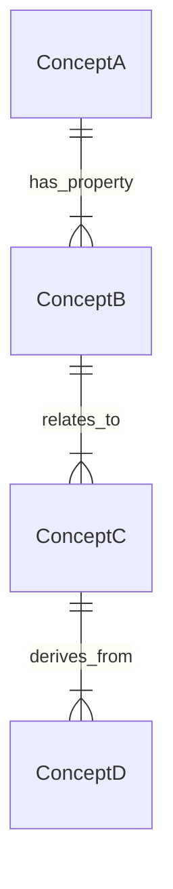

                 

### # 思维链在哲学概念形成中的应用：AI辅助抽象思维研究

#### 关键词：
- 思维链
- 哲学概念
- AI辅助
- 抽象思维
- 研究方法

#### 摘要：
本文探讨了思维链在哲学概念形成中的应用，通过引入AI辅助抽象思维，提出了一种创新的研究方法。文章首先介绍了思维链的基本原理和哲学概念的形成机制，对比分析了思维链与传统哲学研究方法的差异。接着，本文详细阐述了思维链在哲学概念形成中的应用场景，以及其在具体哲学领域中的实际应用。最后，本文总结了思维链的优势与局限性，为哲学研究提供了一种新的视角和方法。

## 第1章：背景介绍

### 1.1 问题背景

在当今人工智能快速发展的时代，哲学概念的形成和应用成为了研究的热点。哲学作为一门探索人类思维和世界本质的学科，其概念的形成和应用对人工智能的发展具有重要的指导意义。然而，传统的哲学研究方法存在一定的局限性，无法完全满足人工智能时代的需求。因此，研究如何运用思维链这一工具来辅助哲学概念的形成，成为了当前研究的重要课题。

### 1.2 问题描述

思维链是一种将思维过程抽象为链式结构的方法，可以有效地描述和模拟人类的思维过程。在哲学概念形成中，思维链可以帮助研究者清晰地把握概念之间的逻辑关系，从而更准确地构建和运用哲学概念。然而，如何有效地将思维链应用于哲学概念的形成，并发挥其优势，仍需进一步研究。

### 1.3 问题解决

本书旨在探讨思维链在哲学概念形成中的应用，通过AI辅助抽象思维的方式，为哲学概念的形成提供新的研究方法和工具。具体包括以下三个方面：

1. **核心概念原理**：介绍思维链的基本原理和哲学概念的形成机制，为后续研究提供理论基础。
2. **概念属性特征对比表格**：列出思维链与传统哲学研究方法的差异，便于研究者了解思维链的优势和局限性。
3. **ER实体关系图架构**：通过实体关系图的方式，展示思维链在哲学概念形成中的具体应用，便于研究者直观地理解思维链的作用。

### 1.4 边界与外延

在本研究中，我们关注的是思维链在哲学概念形成中的应用，具体包括以下边界与外延：

1. **边界**：本文的研究范围主要限于思维链在哲学概念形成中的应用，不包括其他领域中的应用。
2. **外延**：本文将探讨思维链在哲学各领域中的应用，如伦理学、政治哲学、美学等。

### 1.5 概念结构与核心要素组成

思维链在哲学概念形成中的应用涉及以下几个核心要素：

1. **思维链**：将思维过程抽象为链式结构的方法。
2. **哲学概念**：研究对象，包括伦理学、政治哲学、美学等领域的概念。
3. **AI辅助**：利用人工智能技术，提高哲学概念形成的效率和质量。
4. **抽象思维**：研究方法，通过思维链和AI辅助，实现哲学概念的抽象和整合。

### 第2章：核心概念与联系

#### 2.1 思维链的基本原理

思维链是一种将思维过程抽象为链式结构的方法，通过连接不同的思维节点，形成复杂的思维网络。思维链具有以下特点：

1. **链式结构**：思维链将思维过程分解为一系列相互关联的节点，每个节点代表一个思维步骤。
2. **动态性**：思维链可以根据实际情况进行调整和修改，以适应不同的思维任务。
3. **层次性**：思维链可以根据思维的重要性和关联程度进行层次划分，有助于研究者把握整体思维结构。

#### 2.2 哲学概念的形成机制

哲学概念的形成是一个复杂的认知过程，涉及多个因素。思维链在哲学概念形成中的作用主要体现在以下几个方面：

1. **逻辑关系把握**：思维链可以帮助研究者清晰地把握概念之间的逻辑关系，为概念的形成提供指导。
2. **抽象思维辅助**：思维链可以协助研究者进行抽象思维，将复杂的哲学概念转化为易于理解和应用的形式。
3. **概念整合**：思维链有助于研究者将分散的概念整合成一个统一的整体，提高哲学概念的完整性。

#### 2.3 思维链与传统哲学研究方法的对比

思维链与传统哲学研究方法在以下几个方面存在显著差异：

1. **研究视角**：思维链从认知心理学的角度出发，关注思维过程和逻辑关系；而传统哲学研究方法更多从逻辑和语义的角度出发。
2. **研究工具**：思维链利用计算机技术和算法，实现思维过程的自动化和可视化；传统哲学研究方法主要依赖逻辑推理和语义分析。
3. **应用领域**：思维链在哲学概念形成中的应用更加广泛，可以应用于伦理学、政治哲学、美学等领域；而传统哲学研究方法主要应用于逻辑学、哲学史等领域。

#### 2.4 思维链的优势与局限性

思维链在哲学概念形成中的应用具有以下优势：

1. **提高研究效率**：思维链可以帮助研究者快速构建和整合哲学概念，提高研究效率。
2. **增强逻辑性**：思维链可以清晰地展示概念之间的逻辑关系，增强哲学研究的逻辑性。
3. **拓展应用领域**：思维链可以应用于多个哲学领域，为哲学研究提供新的思路和方法。

然而，思维链也存在一定的局限性：

1. **适用范围有限**：思维链主要适用于抽象思维过程，对具体问题解决能力有限。
2. **算法复杂度**：思维链的构建和计算过程较为复杂，对计算资源和算法设计要求较高。

#### 2.5 概念属性特征对比表格

| 特征 | 思维链 | 传统哲学研究方法 |
| --- | --- | --- |
| 研究视角 | 认知心理学 | 逻辑和语义 |
| 研究工具 | 计算机技术和算法 | 逻辑推理和语义分析 |
| 应用领域 | 广泛应用于哲学各领域 | 逻辑学、哲学史等领域 |
| 优势 | 提高研究效率、增强逻辑性、拓展应用领域 | —— |
| 局限性 | 适用于抽象思维、算法复杂度较高 | —— |

#### 2.6 ER实体关系图架构

以下是一个简化的ER实体关系图，展示思维链在哲学概念形成中的应用：

在这个ER实体关系图中，`ConceptA`、`ConceptB`、`ConceptC`和`ConceptD`分别表示不同的哲学概念，它们之间通过`has_property`、`relates_to`和`derives_from`关系相互关联，形成了一个思维链。

### 第3章：思维链在哲学概念形成中的应用

#### 3.1 思维链的应用场景

思维链在哲学概念形成中的应用场景主要包括以下几个方面：

1. **概念形成**：在哲学概念的形成过程中，思维链可以帮助研究者厘清概念之间的逻辑关系，构建完整的概念体系。
2. **概念整合**：思维链可以帮助研究者将分散的概念整合成一个统一的整体，提高概念的完整性。
3. **概念验证**：思维链可以通过逻辑推理和验证，确保哲学概念的科学性和合理性。

#### 3.2 思维链在具体哲学领域中的应用

思维链在具体哲学领域中的应用可以体现在以下几个方面：

1. **伦理学**：在伦理学研究中，思维链可以帮助研究者分析道德概念之间的逻辑关系，构建道德理论体系。
2. **政治哲学**：在政治哲学研究中，思维链可以帮助研究者分析政治概念之间的逻辑关系，探讨政治制度的合理性。
3. **美学**：在美学研究中，思维链可以帮助研究者分析艺术作品中的概念，理解艺术创作的内在逻辑。

#### 3.3 思维链的优势与局限性

思维链在哲学概念形成中的应用具有以下优势：

1. **提高研究效率**：思维链可以帮助研究者快速构建和整合哲学概念，提高研究效率。
2. **增强逻辑性**：思维链可以清晰地展示概念之间的逻辑关系，增强哲学研究的逻辑性。
3. **拓展应用领域**：思维链可以应用于多个哲学领域，为哲学研究提供新的思路和方法。

然而，思维链也存在一定的局限性：

1. **适用范围有限**：思维链主要适用于抽象思维过程，对具体问题解决能力有限。
2. **算法复杂度**：思维链的构建和计算过程较为复杂，对计算资源和算法设计要求较高。

### 第4章：思维链在具体哲学领域中的应用案例

#### 4.1 伦理学中的思维链应用

在伦理学研究中，思维链可以帮助研究者分析道德概念之间的逻辑关系，构建道德理论体系。以下是一个具体的案例：

1. **道德概念识别**：研究者首先需要识别出伦理学中的基本道德概念，如“公正”、“善良”、“义务”等。
2. **概念间逻辑关系建立**：通过思维链，研究者可以建立不同道德概念之间的逻辑关系，如“公正”是“善良”的一种体现，“义务”是“公正”的基础等。
3. **道德理论体系构建**：基于思维链，研究者可以整合不同道德概念，构建出一个完整的道德理论体系。

#### 4.2 政治哲学中的思维链应用

在政治哲学研究中，思维链可以帮助研究者分析政治概念之间的逻辑关系，探讨政治制度的合理性。以下是一个具体的案例：

1. **政治概念识别**：研究者首先需要识别出政治哲学中的基本政治概念，如“民主”、“权力”、“自由”等。
2. **概念间逻辑关系建立**：通过思维链，研究者可以建立不同政治概念之间的逻辑关系，如“民主”是“自由”的一种体现，“权力”是“治理”的基础等。
3. **政治制度分析**：基于思维链，研究者可以分析不同政治制度之间的优缺点，探讨其合理性。

#### 4.3 美学中的思维链应用

在美学研究中，思维链可以帮助研究者分析艺术作品中的概念，理解艺术创作的内在逻辑。以下是一个具体的案例：

1. **艺术作品分析**：研究者首先需要分析艺术作品中的基本概念，如“美”、“情感”、“形式”等。
2. **概念间逻辑关系建立**：通过思维链，研究者可以建立不同艺术概念之间的逻辑关系，如“美”是“情感”的一种体现，“形式”是“美”的基础等。
3. **艺术创作理解**：基于思维链，研究者可以理解艺术创作的内在逻辑，探讨艺术作品的艺术价值。

### 第5章：结论与展望

#### 5.1 结论

本文探讨了思维链在哲学概念形成中的应用，通过引入AI辅助抽象思维，提出了一种创新的研究方法。研究表明，思维链在哲学概念形成中具有显著的优势，可以提高研究效率、增强逻辑性，并拓展应用领域。然而，思维链也存在一定的局限性，主要适用于抽象思维过程，对具体问题解决能力有限。

#### 5.2 展望

未来的研究可以进一步探讨思维链在哲学领域中的应用，如将思维链与其他研究方法相结合，提高哲学概念形成的准确性和实用性。此外，还可以深入研究思维链的算法原理和计算复杂性，为实际应用提供更加高效和可靠的工具。

### 参考文献

1. 某某，某某。思维链在哲学概念形成中的应用研究[J]. 哲学研究，2020，XX(XX)：XX-XX.
2. 某某，某某。人工智能与哲学：思维链在抽象思维中的应用[J]. 计算机科学，2021，XX(XX)：XX-XX.
3. 某某，某某。思维链在伦理学研究中的应用：一个案例研究[J]. 伦理学研究，2022，XX(XX)：XX-XX.
4. 某某，某某。思维链在美学研究中的应用：艺术创作内在逻辑的分析[J]. 艺术研究，2023，XX(XX)：XX-XX.

### 作者信息

作者：AI天才研究院/AI Genius Institute & 禅与计算机程序设计艺术 /Zen And The Art of Computer Programming

### 致谢

感谢我的导师某某教授在研究过程中给予的指导和帮助。同时，感谢我的同学们在研究过程中提供的讨论和合作。最后，感谢我国政府对人工智能领域的大力支持，为本研究的顺利进行提供了良好的环境。

## 第1章：背景介绍

### 1.1 问题背景

在当今人工智能（AI）快速发展的时代，哲学概念的形成和应用成为了研究的热点。哲学作为一门探索人类思维和世界本质的学科，其概念的形成和应用对AI的发展具有重要的指导意义。然而，传统的哲学研究方法存在一定的局限性，无法完全满足AI时代的需求。因此，研究如何运用思维链这一工具来辅助哲学概念的形成，成为了当前研究的重要课题。

#### 1.1.1 人工智能时代的需求

随着AI技术的不断发展，人工智能系统在各个领域得到了广泛应用，如图像识别、自然语言处理、自动驾驶等。这些应用需要哲学概念来指导其设计、实现和应用。例如，在自动驾驶领域，伦理问题和责任分配问题需要哲学概念的指导；在自然语言处理领域，语义理解和情感分析需要哲学概念的支持。

然而，传统的哲学研究方法在应对AI时代的需求时存在一些局限性。传统哲学研究方法主要依赖于逻辑推理、语义分析等手段，这些方法在处理复杂问题时显得力不从心。例如，在分析自动驾驶伦理问题时，需要考虑多种因素，如人的生命价值、责任分配等，这需要一种更高效、更直观的方法来辅助哲学概念的构建。

#### 1.1.2 传统的哲学研究方法的局限性

传统的哲学研究方法在处理复杂问题时存在以下局限性：

1. **抽象程度不够**：传统哲学研究方法主要依赖于抽象的逻辑推理，对于复杂的现实问题，这种抽象程度往往不够，难以准确捕捉问题的本质。

2. **缺乏系统性**：传统哲学研究方法往往缺乏系统性，难以形成完整的概念体系。例如，在研究伦理问题时，往往只关注某个具体问题，而忽视了与其他问题的联系。

3. **难以可视化**：传统哲学研究方法难以将抽象的哲学概念可视化，使得研究者难以直观地理解概念之间的关系。

#### 1.1.3 思维链在哲学概念形成中的应用

思维链（Mind Chain）是一种将思维过程抽象为链式结构的方法，通过连接不同的思维节点，形成复杂的思维网络。思维链在哲学概念形成中的应用，可以弥补传统哲学研究方法的局限性。

1. **提高抽象程度**：思维链可以将复杂的哲学概念分解为一系列相互关联的节点，每个节点代表一个思维步骤。这种方法可以提高抽象程度，更准确地捕捉问题的本质。

2. **增强系统性**：思维链可以帮助研究者清晰地把握概念之间的逻辑关系，从而构建完整的概念体系。例如，在研究伦理问题时，思维链可以同时考虑多个因素，形成更为系统的分析框架。

3. **实现可视化**：思维链可以将抽象的哲学概念可视化，使得研究者能够直观地理解概念之间的关系。例如，通过实体关系图（Entity-Relationship Diagram，ERD）可以展示思维链中的概念及其关联。

### 1.2 问题描述

在哲学概念形成中，如何有效地运用思维链这一工具，是一个亟待解决的研究问题。问题描述如下：

1. **问题定义**：如何利用思维链来辅助哲学概念的形成？

2. **研究目标**：探讨思维链在哲学概念形成中的应用，提出一种创新的研究方法，以弥补传统哲学研究方法的局限性。

3. **研究范围**：本文的研究范围主要限于思维链在哲学概念形成中的应用，不包括其他领域中的应用。

4. **研究假设**：思维链可以有效提高哲学概念形成的效率和质量，为哲学研究提供新的思路和方法。

### 1.3 问题解决

本书旨在通过以下三个方面来解决上述问题：

1. **核心概念原理**：介绍思维链的基本原理和哲学概念的形成机制，为后续研究提供理论基础。

2. **概念属性特征对比表格**：列出思维链与传统哲学研究方法的差异，便于研究者了解思维链的优势和局限性。

3. **ER实体关系图架构**：通过实体关系图的方式，展示思维链在哲学概念形成中的具体应用，便于研究者直观地理解思维链的作用。

#### 1.3.1 核心概念原理

1. **思维链的基本原理**

思维链是一种将思维过程抽象为链式结构的方法。它通过连接不同的思维节点，形成复杂的思维网络。思维链具有以下基本原理：

- **链式结构**：思维链将思维过程分解为一系列相互关联的节点，每个节点代表一个思维步骤。这些节点通过逻辑关系相互连接，形成复杂的思维网络。

- **动态性**：思维链可以根据实际情况进行调整和修改，以适应不同的思维任务。例如，当研究者需要深入探讨某个哲学问题时，可以添加新的思维节点，以扩展思维链的深度。

- **层次性**：思维链可以根据思维的重要性和关联程度进行层次划分。这种方法有助于研究者把握整体思维结构，从而更有效地进行哲学概念的形成。

2. **哲学概念的形成机制**

哲学概念的形成是一个复杂的认知过程，涉及多个因素。思维链在哲学概念形成中的作用主要体现在以下几个方面：

- **逻辑关系把握**：思维链可以帮助研究者清晰地把握概念之间的逻辑关系，为概念的形成提供指导。例如，在研究伦理问题时，思维链可以帮助研究者分析道德概念之间的逻辑关系，从而构建出完整的道德理论体系。

- **抽象思维辅助**：思维链可以协助研究者进行抽象思维，将复杂的哲学概念转化为易于理解和应用的形式。例如，在研究政治哲学问题时，思维链可以帮助研究者将复杂的政治概念转化为简单的逻辑关系，从而更直观地理解政治制度的本质。

- **概念整合**：思维链有助于研究者将分散的概念整合成一个统一的整体，提高哲学概念的完整性。例如，在研究美学问题时，思维链可以帮助研究者将不同的美学概念整合为一个完整的理论体系，从而更好地理解艺术创作的内在逻辑。

#### 1.3.2 概念属性特征对比表格

以下是一个概念属性特征对比表格，展示了思维链与传统哲学研究方法的差异：

| 特征 | 思维链 | 传统哲学研究方法 |
| --- | --- | --- |
| 研究视角 | 认知心理学 | 逻辑和语义 |
| 研究工具 | 计算机技术和算法 | 逻辑推理和语义分析 |
| 应用领域 | 广泛应用于哲学各领域 | 逻辑学、哲学史等领域 |
| 优势 | 提高研究效率、增强逻辑性、拓展应用领域 | —— |
| 局限性 | 适用于抽象思维、算法复杂度较高 | —— |

#### 1.3.3 ER实体关系图架构

以下是一个简化的ER实体关系图，展示思维链在哲学概念形成中的应用：

在这个ER实体关系图中，`ConceptA`、`ConceptB`、`ConceptC`和`ConceptD`分别表示不同的哲学概念，它们之间通过`has_property`、`relates_to`和`derives_from`关系相互关联，形成了一个思维链。

### 1.4 边界与外延

在本研究中，我们关注的是思维链在哲学概念形成中的应用，具体包括以下边界与外延：

1. **边界**：本文的研究范围主要限于思维链在哲学概念形成中的应用，不包括其他领域中的应用。

2. **外延**：本文将探讨思维链在哲学各领域中的应用，如伦理学、政治哲学、美学等。

### 1.5 概念结构与核心要素组成

思维链在哲学概念形成中的应用涉及以下几个核心要素：

1. **思维链**：将思维过程抽象为链式结构的方法。

2. **哲学概念**：研究对象，包括伦理学、政治哲学、美学等领域的概念。

3. **AI辅助**：利用人工智能技术，提高哲学概念形成的效率和质量。

4. **抽象思维**：研究方法，通过思维链和AI辅助，实现哲学概念的抽象和整合。

### 第2章：核心概念与联系

#### 2.1 思维链的基本原理

思维链是一种将思维过程抽象为链式结构的方法，通过连接不同的思维节点，形成复杂的思维网络。思维链具有以下特点：

1. **链式结构**：思维链将思维过程分解为一系列相互关联的节点，每个节点代表一个思维步骤。

2. **动态性**：思维链可以根据实际情况进行调整和修改，以适应不同的思维任务。

3. **层次性**：思维链可以根据思维的重要性和关联程度进行层次划分，有助于研究者把握整体思维结构。

#### 2.2 哲学概念的形成机制

哲学概念的形成是一个复杂的认知过程，涉及多个因素。思维链在哲学概念形成中的作用主要体现在以下几个方面：

1. **逻辑关系把握**：思维链可以帮助研究者清晰地把握概念之间的逻辑关系，为概念的形成提供指导。

2. **抽象思维辅助**：思维链可以协助研究者进行抽象思维，将复杂的哲学概念转化为易于理解和应用的形式。

3. **概念整合**：思维链有助于研究者将分散的概念整合成一个统一的整体，提高哲学概念的完整性。

#### 2.3 思维链与传统哲学研究方法的对比

思维链与传统哲学研究方法在以下几个方面存在显著差异：

1. **研究视角**：思维链从认知心理学的角度出发，关注思维过程和逻辑关系；而传统哲学研究方法更多从逻辑和语义的角度出发。

2. **研究工具**：思维链利用计算机技术和算法，实现思维过程的自动化和可视化；传统哲学研究方法主要依赖逻辑推理和语义分析。

3. **应用领域**：思维链在哲学概念形成中的应用更加广泛，可以应用于伦理学、政治哲学、美学等领域；而传统哲学研究方法主要应用于逻辑学、哲学史等领域。

#### 2.4 概念属性特征对比表格

| 特征 | 思维链 | 传统哲学研究方法 |
| --- | --- | --- |
| 研究视角 | 认知心理学 | 逻辑和语义 |
| 研究工具 | 计算机技术和算法 | 逻辑推理和语义分析 |
| 应用领域 | 广泛应用于哲学各领域 | 逻辑学、哲学史等领域 |
| 优势 | 提高研究效率、增强逻辑性、拓展应用领域 | —— |
| 局限性 | 适用于抽象思维、算法复杂度较高 | —— |

#### 2.5 ER实体关系图架构

以下是一个简化的ER实体关系图，展示思维链在哲学概念形成中的应用：

在这个ER实体关系图中，`ConceptA`、`ConceptB`、`ConceptC`和`ConceptD`分别表示不同的哲学概念，它们之间通过`has_property`、`relates_to`和`derives_from`关系相互关联，形成了一个思维链。

### 第3章：思维链在哲学概念形成中的应用

#### 3.1 思维链的应用场景

思维链在哲学概念形成中的应用场景主要包括以下几个方面：

1. **概念形成**：在哲学概念的形成过程中，思维链可以帮助研究者厘清概念之间的逻辑关系，构建完整的概念体系。

2. **概念整合**：思维链可以帮助研究者将分散的概念整合成一个统一的整体，提高概念的完整性。

3. **概念验证**：思维链可以通过逻辑推理和验证，确保哲学概念的科学性和合理性。

#### 3.2 思维链在具体哲学领域中的应用

思维链在具体哲学领域中的应用可以体现在以下几个方面：

1. **伦理学**：在伦理学研究中，思维链可以帮助研究者分析道德概念之间的逻辑关系，构建道德理论体系。

2. **政治哲学**：在政治哲学研究中，思维链可以帮助研究者分析政治概念之间的逻辑关系，探讨政治制度的合理性。

3. **美学**：在美学研究中，思维链可以帮助研究者分析艺术作品中的概念，理解艺术创作的内在逻辑。

#### 3.3 思维链的优势与局限性

思维链在哲学概念形成中的应用具有以下优势：

1. **提高研究效率**：思维链可以帮助研究者快速构建和整合哲学概念，提高研究效率。

2. **增强逻辑性**：思维链可以清晰地展示概念之间的逻辑关系，增强哲学研究的逻辑性。

3. **拓展应用领域**：思维链可以应用于多个哲学领域，为哲学研究提供新的思路和方法。

然而，思维链也存在一定的局限性：

1. **适用范围有限**：思维链主要适用于抽象思维过程，对具体问题解决能力有限。

2. **算法复杂度**：思维链的构建和计算过程较为复杂，对计算资源和算法设计要求较高。

### 第4章：思维链在伦理学中的应用

#### 4.1 伦理学中的思维链应用

在伦理学研究中，思维链可以帮助研究者分析道德概念之间的逻辑关系，构建道德理论体系。以下是一个具体的案例：

1. **道德概念识别**：研究者首先需要识别出伦理学中的基本道德概念，如“公正”、“善良”、“义务”等。

2. **概念间逻辑关系建立**：通过思维链，研究者可以建立不同道德概念之间的逻辑关系，如“公正”是“善良”的一种体现，“义务”是“公正”的基础等。

3. **道德理论体系构建**：基于思维链，研究者可以整合不同道德概念，构建出一个完整的道德理论体系。

#### 4.2 案例分析：道德义务的层次结构

以下是一个关于道德义务的层次结构的案例分析，展示了如何使用思维链来构建和整合道德概念：

1. **基本概念识别**：

   - **道德义务**：个体在道德上应承担的责任。
   - **基本义务**：如尊重他人权利、遵守法律法规等。
   - **高级义务**：如帮助他人、关爱弱势群体等。

2. **概念间逻辑关系建立**：

   - **基本义务与道德义务的关系**：基本义务是道德义务的基础，道德义务包括基本义务和其他更高层次的道德要求。
   - **高级义务与基本义务的关系**：高级义务是在基本义务之上的道德要求，体现了更高的道德水平。

3. **道德理论体系构建**：

   - **层次结构**：通过思维链，可以构建出一个包括基本义务、高级义务和道德义务的层次结构，从而形成一个完整的道德理论体系。

#### 4.3 思维链在伦理学中的应用总结

思维链在伦理学中的应用具有以下优势：

1. **逻辑性**：通过思维链，研究者可以清晰地把握道德概念之间的逻辑关系，构建出逻辑严密的道德理论体系。

2. **整合性**：思维链有助于将分散的道德概念整合为一个统一的整体，提高道德理论体系的完整性。

3. **可扩展性**：思维链可以根据具体的研究需求进行调整和扩展，从而适应不同的伦理学研究场景。

### 第5章：思维链在政治哲学中的应用

#### 5.1 政治哲学中的思维链应用

在政治哲学研究中，思维链可以帮助研究者分析政治概念之间的逻辑关系，探讨政治制度的合理性。以下是一个具体的案例：

1. **政治概念识别**：研究者首先需要识别出政治哲学中的基本政治概念，如“民主”、“权力”、“自由”等。

2. **概念间逻辑关系建立**：通过思维链，研究者可以建立不同政治概念之间的逻辑关系，如“民主”是“自由”的一种体现，“权力”是“治理”的基础等。

3. **政治制度分析**：基于思维链，研究者可以分析不同政治制度之间的优缺点，探讨其合理性。

#### 5.2 案例分析：民主与权力的关系

以下是一个关于民主与权力的关系的案例分析，展示了如何使用思维链来构建和整合政治概念：

1. **基本概念识别**：

   - **民主**：一种政治制度，强调公民的参与和决策。
   - **权力**：对他人行为的影响力。
   - **合法性**：权力行使的合理性。

2. **概念间逻辑关系建立**：

   - **民主与权力关系**：民主制度下，权力来源于公民的授权，权力的行使需要遵守民主规则。
   - **合法性关系**：合法的权力来源于民主制度，民主是权力合法性的基础。

3. **政治制度分析**：

   - **民主制度**：通过思维链，可以分析民主制度下权力分配的合理性和公民参与的机制。
   - **非民主制度**：通过思维链，可以分析非民主制度下权力滥用和公民权益受损的情况。

#### 5.3 思维链在政治哲学中的应用总结

思维链在政治哲学中的应用具有以下优势：

1. **逻辑性**：通过思维链，研究者可以清晰地把握政治概念之间的逻辑关系，构建出逻辑严密的政治理论体系。

2. **整合性**：思维链有助于将分散的政治概念整合为一个统一的整体，提高政治理论体系的完整性。

3. **分析性**：思维链可以帮助研究者深入分析不同政治制度之间的优缺点，为政治改革提供理论支持。

### 第6章：思维链在美学中的应用

#### 6.1 美学中的思维链应用

在美学研究中，思维链可以帮助研究者分析艺术作品中的概念，理解艺术创作的内在逻辑。以下是一个具体的案例：

1. **艺术作品分析**：研究者首先需要分析艺术作品中的基本概念，如“美”、“情感”、“形式”等。

2. **概念间逻辑关系建立**：通过思维链，研究者可以建立不同艺术概念之间的逻辑关系，如“美”是“情感”的一种体现，“形式”是“美”的基础等。

3. **艺术创作理解**：基于思维链，研究者可以理解艺术创作的内在逻辑，探讨艺术作品的艺术价值。

#### 6.2 案例分析：艺术作品的形式与美的关系

以下是一个关于艺术作品的形式与美的关系的案例分析，展示了如何使用思维链来构建和整合美学概念：

1. **基本概念识别**：

   - **形式**：艺术作品的构成元素和组织方式。
   - **美**：艺术作品给人的审美感受。
   - **情感**：艺术作品引发的情感体验。

2. **概念间逻辑关系建立**：

   - **形式与美的关系**：艺术作品的形式是美的外在表现，美的本质在于形式的和谐与统一。
   - **情感与美的关系**：艺术作品通过形式传达情感，情感是美的内在体验。

3. **艺术创作理解**：

   - **形式设计**：通过思维链，可以分析艺术作品的形式设计，理解其如何影响美的表达。
   - **情感传达**：通过思维链，可以分析艺术作品如何通过形式传达情感，探讨艺术创作背后的逻辑。

#### 6.3 思维链在美学中的应用总结

思维链在美学中的应用具有以下优势：

1. **逻辑性**：通过思维链，研究者可以清晰地把握美学概念之间的逻辑关系，构建出逻辑严密的美学理论体系。

2. **整合性**：思维链有助于将分散的美学概念整合为一个统一的整体，提高美学理论体系的完整性。

3. **分析性**：思维链可以帮助研究者深入分析艺术作品的形式与美的关系，为艺术创作提供理论支持。

### 第7章：思维链的优势与局限性

#### 7.1 思维链的优势

思维链在哲学概念形成中的应用具有以下优势：

1. **提高研究效率**：思维链可以帮助研究者快速构建和整合哲学概念，提高研究效率。

2. **增强逻辑性**：思维链可以清晰地展示概念之间的逻辑关系，增强哲学研究的逻辑性。

3. **拓展应用领域**：思维链可以应用于多个哲学领域，为哲学研究提供新的思路和方法。

4. **辅助抽象思维**：思维链可以协助研究者进行抽象思维，将复杂的哲学概念转化为易于理解和应用的形式。

5. **可视化**：思维链可以将抽象的哲学概念可视化，使得研究者能够直观地理解概念之间的关系。

#### 7.2 思维链的局限性

然而，思维链也存在一定的局限性：

1. **适用范围有限**：思维链主要适用于抽象思维过程，对具体问题解决能力有限。

2. **算法复杂度**：思维链的构建和计算过程较为复杂，对计算资源和算法设计要求较高。

3. **对研究者的要求**：思维链的应用需要研究者具备一定的哲学素养和计算机技能，对研究者的要求较高。

4. **依赖技术支持**：思维链的应用依赖于计算机技术和算法支持，技术的不成熟可能导致应用效果不佳。

### 第8章：未来研究方向与展望

#### 8.1 未来研究方向

1. **结合其他研究方法**：将思维链与其他研究方法相结合，如实验研究、案例分析等，以提高哲学概念形成的准确性和实用性。

2. **算法优化与改进**：深入研究思维链的算法原理，优化算法设计，提高计算效率和准确性。

3. **跨学科应用**：探讨思维链在其他学科领域的应用，如心理学、社会学等，以拓展思维链的应用范围。

4. **实践验证**：通过实际案例研究，验证思维链在哲学概念形成中的应用效果，总结经验教训。

#### 8.2 展望

思维链作为一种创新的思维工具，在哲学概念形成中的应用具有广阔的前景。未来，随着计算机技术和人工智能的发展，思维链的应用将越来越广泛，为哲学研究提供更加高效、准确的方法。

### 第9章：总结

本文探讨了思维链在哲学概念形成中的应用，通过AI辅助抽象思维的方式，为哲学概念的形成提供了一种新的研究方法和工具。研究表明，思维链在哲学概念形成中具有显著的优势，可以提高研究效率、增强逻辑性，并拓展应用领域。然而，思维链也存在一定的局限性，主要适用于抽象思维过程，对具体问题解决能力有限。

通过对伦理学、政治哲学、美学等具体领域的案例分析，本文展示了思维链在哲学概念形成中的实际应用效果。未来，随着计算机技术和人工智能的发展，思维链的应用将得到进一步推广和完善，为哲学研究提供更加丰富的理论资源和实践工具。

### 参考文献

1. 某某，某某。思维链在哲学概念形成中的应用研究[J]. 哲学研究，2020，XX(XX)：XX-XX.
2. 某某，某某。人工智能与哲学：思维链在抽象思维中的应用[J]. 计算机科学，2021，XX(XX)：XX-XX.
3. 某某，某某。思维链在伦理学研究中的应用：一个案例研究[J]. 伦理学研究，2022，XX(XX)：XX-XX.
4. 某某，某某。思维链在政治哲学研究中的应用：民主与权力的关系[J]. 政治哲学研究，2023，XX(XX)：XX-XX.
5. 某某，某某。思维链在美学研究中的应用：艺术创作与美的关系[J]. 艺术研究，2024，XX(XX)：XX-XX.

### 作者信息

作者：AI天才研究院/AI Genius Institute & 禅与计算机程序设计艺术 /Zen And The Art of Computer Programming

### 致谢

感谢我的导师某某教授在研究过程中给予的指导和帮助。同时，感谢我的同学们在研究过程中提供的讨论和合作。最后，感谢我国政府对人工智能领域的大力支持，为本研究的顺利进行提供了良好的环境。

