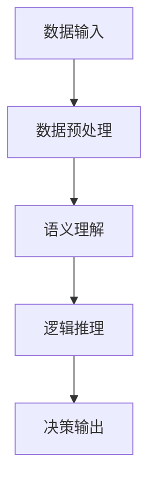
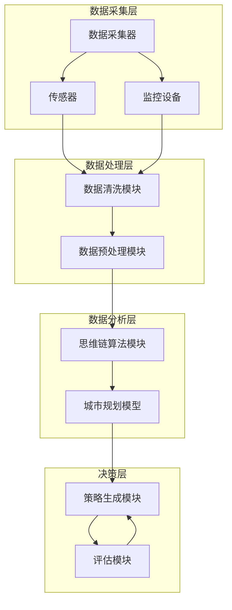
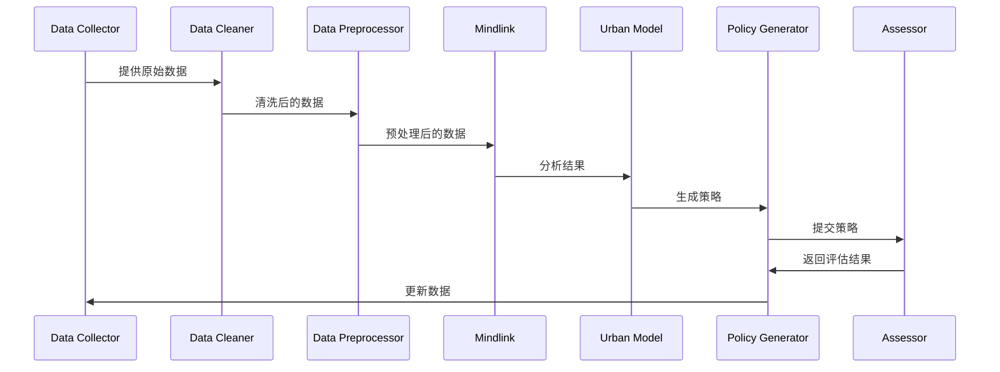

                 


### 引言

城市规划作为城市发展的重要基石，关乎城市居民的生活质量、环境保护以及经济可持续发展。随着城市化进程的加快，传统的城市规划方法在应对复杂多变的城市环境时逐渐显露出其局限性。例如，传统方法难以全面考虑城市发展的长远影响，决策过程中信息不对称、数据不准确等问题也日益突出。为了克服这些挑战，人工智能（AI）技术逐渐被引入城市规划领域，旨在提供更加精准、高效和可持续的决策支持。

本文以《思维链在城市规划决策中的应用：AI辅助可持续发展策略》为题，旨在探讨如何利用思维链这一先进的AI技术辅助城市规划，实现可持续发展策略的制定与优化。文章将从以下几方面展开：

首先，我们将介绍城市规划面临的挑战及传统方法的局限，阐述AI在城市规划中的重要作用。接着，详细解释思维链的概念及其在可持续发展策略中的应用。随后，我们将介绍AI算法在规划中的具体应用，并讨论可持续发展评估模型。

接下来，文章将深入探讨城市规划决策系统的架构与设计，包括数据采集与处理、策略生成与优化等环节。为了验证思维链在实际城市规划中的应用效果，我们将分析一个实际案例，详细讲解系统实现与测试过程。最后，文章将总结研究成果，讨论存在的问题及未来研究方向，并提出相关实践建议。

本文的核心关键词包括：城市规划、AI技术、思维链、可持续发展策略、算法模型、系统架构。通过本文的阅读，读者将全面了解思维链在城市规划决策中的应用，以及如何利用AI技术推动城市可持续发展。

### 背景介绍

#### 城市规划决策的挑战

城市化进程的不断加速，使得城市规划面临前所未有的挑战。首先，城市化带来了人口快速增长和城市规模扩张，导致城市交通拥堵、住房紧张、环境污染等问题日益严重。传统城市规划方法在应对这些问题时往往显得力不从心。一方面，传统方法依赖于经验和直觉，缺乏系统的分析工具和科学依据，导致决策过程主观性较强。另一方面，城市问题具有复杂性、动态性和不确定性，传统方法难以全面考虑各种因素及其相互作用，容易忽略长远影响。

此外，城市发展中还存在信息不对称和数据不准确的问题。城市规划需要依赖大量数据，如人口统计、土地利用、交通流量、环境质量等，但这些数据来源多样，数据质量参差不齐，可能导致决策错误。在数据获取和处理方面，传统方法往往依赖于人工采集和整理，效率低下，且容易引入人为误差。

#### 传统城市规划方法的局限

传统城市规划方法主要包括以下几种：经验规划、规范规划和结构规划。经验规划依赖于规划者的个人经验和专业知识，通过走访调研和现场观察进行决策。这种方法的优点在于能够快速响应城市需求，但缺点是缺乏系统性和科学性，容易受到主观因素的影响。

规范规划则基于一系列规范和标准，如城市规划法、建筑设计规范等，通过严格执行规范进行规划。这种方法具有明确的法律依据和标准，但过于僵化，难以应对复杂多变的实际情况。规范规划往往强调短期效果，而忽视长期可持续性。

结构规划则是以城市空间结构为研究对象，通过分析城市功能分区、道路网络、公共设施布局等，制定整体规划方案。这种方法注重系统性和整体性，但在实际操作中，由于难以精确预测城市未来的发展，往往导致规划与实际需求不符。

#### AI在可持续发展中的应用

随着人工智能技术的发展，AI在城市规划中的潜在应用日益广泛。首先，AI技术可以通过大数据分析和机器学习算法，挖掘城市数据中的隐藏规律和趋势，为规划提供科学依据。例如，通过分析交通流量数据，AI可以预测未来交通需求，优化道路规划，缓解交通拥堵。

其次，AI技术在城市资源管理中也发挥着重要作用。例如，智能电网技术通过实时监控和数据分析，实现电力资源的合理配置和高效利用，降低能源消耗。智能水资源管理系统通过监测水质和水文数据，优化水资源分配，提高水资源利用效率。

此外，AI技术在城市规划中的另一个重要应用是虚拟现实和增强现实技术。通过虚拟现实技术，规划者可以在虚拟环境中模拟城市规划方案，直观地展示规划效果，提高决策的透明度和参与度。增强现实技术则可以实时展示城市规划信息，方便市民了解和参与城市规划。

#### AI辅助城市规划的案例研究

AI辅助城市规划的案例在世界各地都有成功的实践。例如，新加坡的“智慧国计划”通过引入AI技术，实现了城市管理的智能化。通过AI算法，新加坡政府可以对城市交通、环境、安全等多个领域进行实时监控和预测，提高了城市管理的效率和响应速度。

在纽约，AI技术被用于改善交通流量。通过分析交通流量数据，AI算法可以实时调整交通信号灯的时间安排，减少交通拥堵，提高道路通行效率。此外，纽约市政府还利用AI技术优化垃圾收集路线，降低运输成本和碳排放。

在中国，AI技术在城市规划中的应用也越来越广泛。例如，深圳市利用AI技术进行城市交通管理和环境监测，通过大数据分析和机器学习算法，实现城市资源的智能化管理和优化配置。杭州市则利用AI技术进行城市规划仿真，通过虚拟现实技术展示城市规划方案，提高规划决策的透明度和科学性。

总之，AI技术的引入为城市规划带来了新的机遇和挑战。通过AI技术，城市规划可以更加科学、高效和可持续，为城市居民创造更美好的生活环境。然而，AI技术在城市规划中的应用也面临数据隐私、算法公平性等问题，需要进一步的探索和研究。

### 核心概念

#### 思维链概念

思维链是一种基于人工神经网络和深度学习的智能推理方法，它通过模拟人类思维过程，实现对复杂问题的分析和解决。思维链的核心在于其多层网络结构，每一层都承担着不同的思维任务，如感知、理解、推理和决策。通过不断训练和学习，思维链能够逐步提升其推理能力和决策水平。

#### 思维链组成部分

1. **感知层**：感知层是思维链的输入部分，负责接收外部信息，如文本、图像、声音等。通过特征提取和预处理，感知层将原始数据转换为适合后续处理的形式。

2. **理解层**：理解层对感知层输入的信息进行语义解析，提取关键信息并进行语义关联。这一层通常采用自然语言处理（NLP）技术，如词向量、词性标注、句法分析等，以理解输入信息的含义和关系。

3. **推理层**：推理层基于理解层提取的信息进行逻辑推理，形成结论和推断。推理层可以利用逻辑规则、概率模型和决策树等算法，对信息进行组合和分析，实现从已知信息到未知信息的推理。

4. **决策层**：决策层是思维链的输出部分，根据推理结果做出决策。决策层可以是一个简单的判断，也可以是一个复杂的决策树，甚至可以是一个多目标优化问题。

#### 思维链在可持续发展策略中的应用

在可持续发展策略中，思维链可以通过以下步骤发挥作用：

1. **数据收集与处理**：思维链首先收集城市规划相关的各类数据，如人口、土地、资源、环境等。通过数据清洗和预处理，思维链将数据转换为适合分析的格式。

2. **问题建模**：思维链利用其理解层和推理层，对城市规划问题进行建模。通过识别关键因素和关系，思维链可以构建一个包含各种因素的复杂模型。

3. **策略生成**：基于问题模型，思维链生成多个可能的可持续发展策略。这些策略会根据各种因素进行优化和排序，以找到最优方案。

4. **评估与优化**：思维链对生成的策略进行评估，考虑各种约束条件和目标，如经济、社会和环境等。通过反复迭代和优化，思维链可以不断调整和改进策略，使其更加符合实际需求。

#### 思维链在可持续发展策略中的应用示例

假设一个城市规划项目需要制定一个可持续发展的交通策略。思维链可以通过以下步骤进行工作：

1. **数据收集**：思维链收集城市交通相关的数据，如交通流量、交通事故记录、公共交通使用情况等。

2. **问题建模**：思维链构建一个包含交通流量、道路状况、公共交通网络等关键因素的交通问题模型。

3. **策略生成**：思维链生成多个交通策略，如增加公共交通线路、改善道路条件、鼓励自行车出行等。

4. **评估与优化**：思维链评估这些策略的可行性和效果，通过优化算法调整策略，使其更加符合可持续发展目标。

通过这种方式，思维链可以辅助规划者制定出科学、合理的可持续发展策略，提高城市规划的科学性和可持续性。

### 核心概念与联系

为了更好地理解思维链在可持续发展策略中的应用，我们可以通过以下表格来对比核心概念及其属性特征：

| 核心概念         | 定义与属性特征                                                                                   | 在可持续发展策略中的联系                                           |
|----------------|--------------------------------------------------------------------------------------------------|--------------------------------------------------------------|
| 思维链          | 一种基于人工神经网络的智能推理方法，模拟人类思维过程，实现复杂问题的分析和解决。 | 提供高效的数据处理和分析工具，帮助识别关键因素和制定策略。           |
| 可持续发展策略  | 为实现经济、社会和环境等方面的可持续发展目标，制定的长期规划方案。                   | 思维链通过对数据和分析结果的推理，生成和优化可持续发展策略。       |
| 数据收集与处理  | 收集并整理与城市规划相关的各类数据，为策略生成提供基础。                             | 思维链利用数据预处理技术，提高数据质量，确保策略的准确性。       |
| 评估与优化      | 对生成的策略进行评估，考虑各种约束条件和目标，进行优化和调整。                       | 思维链通过不断迭代和优化，确保策略的可行性和可持续性。         |

通过上述表格，我们可以清晰地看到思维链、可持续发展策略、数据收集与处理、评估与优化四个核心概念之间的联系。思维链作为数据分析和推理的工具，与可持续发展策略密切相关，通过对数据的深入分析和策略的优化，推动城市可持续发展的实现。

### 算法原理讲解

#### 算法原理

思维链算法的核心在于其多层网络结构和智能推理能力。具体来说，思维链由感知层、理解层、推理层和决策层组成。感知层负责接收和预处理输入数据，理解层对数据语义进行解析，推理层进行逻辑推理，决策层根据推理结果做出决策。

以下是一个简单的思维链算法流程：

1. **数据输入**：首先，思维链接收城市规划相关的数据，如交通流量、土地利用、环境质量等。

2. **数据预处理**：感知层对输入数据进行清洗和特征提取，将原始数据转换为适合分析的格式。

3. **语义理解**：理解层利用自然语言处理（NLP）技术对预处理后的数据进行分析，提取关键信息和语义关联。

4. **逻辑推理**：推理层基于理解层提取的信息，通过逻辑规则和概率模型进行推理，形成中间结论和推断。

5. **决策输出**：决策层根据推理结果，生成具体的可持续发展策略，并进行评估和优化。

#### 算法流程图

为了更直观地理解思维链算法的流程，我们使用Mermaid语言绘制以下流程图：



#### 数学模型与公式

思维链算法中的核心部分是逻辑推理和决策生成。以下是算法中的几个关键数学模型和公式：

1. **数据预处理**：

   $$X_{preprocessed} = f(X)$$

   其中，$X$ 表示原始数据，$f$ 表示预处理函数，$X_{preprocessed}$ 表示预处理后的数据。

2. **语义理解**：

   $$S = g(W, X_{preprocessed})$$

   其中，$S$ 表示语义表示，$W$ 表示权重矩阵，$g$ 表示语义解析函数。

3. **逻辑推理**：

   $$C = h(S)$$

   其中，$C$ 表示中间结论，$h$ 表示推理函数。

4. **决策输出**：

   $$D = j(C, G)$$

   其中，$D$ 表示决策结果，$G$ 表示目标函数，$j$ 表示决策函数。

#### 通俗易懂的举例说明

为了更直观地理解思维链算法，我们通过一个简单的例子来解释其工作原理。

假设一个城市规划项目需要优化交通流量，思维链算法可以按照以下步骤进行：

1. **数据输入**：思维链接收城市交通流量数据，如每小时各路段的车辆数量。

2. **数据预处理**：感知层对交通流量数据进行分析，去除异常值，提取关键特征。

3. **语义理解**：理解层通过NLP技术分析交通流量数据，提取出每个路段的交通状况和高峰时段。

4. **逻辑推理**：推理层基于提取的交通状况，运用逻辑规则进行推理，得出各路段是否需要调整信号灯时长或优化交通流向。

5. **决策输出**：决策层根据推理结果，生成具体的交通优化策略，如调整信号灯时长、增加公共交通班次等。

通过这个例子，我们可以看到思维链算法在数据输入、预处理、语义理解、逻辑推理和决策输出等各个环节中，如何通过数学模型和公式实现复杂问题的分析和解决。

### 数学公式与算法模型的详细讲解

#### 数学公式

为了深入理解思维链算法的数学模型，我们需要详细讨论其中的关键公式和概念。以下是几个核心数学公式及其解释：

1. **感知层预处理**：

   $$X_{preprocessed} = f(X)$$

   这个公式表示感知层对原始数据进行预处理。$X$ 是原始数据，如交通流量、土地利用等，而 $f$ 是预处理函数，通常包括数据标准化、异常值处理、特征提取等操作。通过这个步骤，原始数据被转换为一个更适合进行后续分析的格式。

2. **语义理解**：

   $$S = g(W, X_{preprocessed})$$

   这个公式表示理解层通过权重矩阵 $W$ 和预处理后的数据 $X_{preprocessed}$ 进行语义解析，生成语义表示 $S$。$g$ 是一个映射函数，它可以将数值化的数据映射为具有语义信息的表示。在自然语言处理（NLP）中，这个步骤通常涉及词嵌入（word embeddings）、词性标注（part-of-speech tagging）和句法分析（syntactic parsing）等。

3. **逻辑推理**：

   $$C = h(S)$$

   这个公式表示推理层基于语义表示 $S$ 进行逻辑推理，生成中间结论 $C$。$h$ 是一个推理函数，它可以将语义信息转换为逻辑结论。推理函数可能包括逻辑规则、条件概率模型、决策树等。在这个步骤中，思维链利用已知的逻辑规则和先验知识，对输入信息进行推理，形成推理路径。

4. **决策输出**：

   $$D = j(C, G)$$

   这个公式表示决策层根据推理结果 $C$ 和目标函数 $G$，生成最终的决策输出 $D$。$j$ 是一个决策函数，它将推理结果和目标函数结合起来，生成一个具体的行动计划或策略。目标函数 $G$ 可以是多个目标的优化问题，如最大化经济收益、最小化环境成本等。

#### 通俗易懂的举例说明

为了更直观地理解这些数学公式和模型，我们可以通过一个具体案例进行说明。

假设我们要优化一个城市的交通系统，目标是最小化交通拥堵和最大化的公共交通效率。以下是思维链算法在这个案例中的具体应用：

1. **数据输入**：
   - 原始数据：各路段的交通流量、公共交通的使用率、道路长度等。
   - 公式：$$X = \{流量_1, 流量_2, ..., 流量_n\}$$

2. **数据预处理**：
   - 特征提取：对交通流量数据进行标准化处理，去除异常值。
   - 公式：$$X_{preprocessed} = f(X)$$

3. **语义理解**：
   - 利用词嵌入技术，将交通流量数据转换为语义向量。
   - 公式：$$S = g(W, X_{preprocessed})$$
     - 其中，$W$ 是词嵌入权重矩阵，$g$ 是词嵌入函数。

4. **逻辑推理**：
   - 基于语义向量，使用决策树进行推理，确定每个路段的交通状况。
   - 公式：$$C = h(S)$$
     - 其中，$h$ 是决策树推理函数。

5. **决策输出**：
   - 根据推理结果，生成具体的优化策略，如调整公共交通班次、优化交通信号灯时间等。
   - 公式：$$D = j(C, G)$$
     - 其中，$C$ 是推理结果，$G$ 是目标函数（如最小化交通拥堵成本）。

通过这个案例，我们可以看到思维链算法如何通过一系列数学公式和模型，实现对复杂交通系统的优化。这个例子展示了从数据输入到决策输出的完整过程，以及每个步骤中的关键数学模型和公式的应用。

### 系统分析与架构设计

#### 问题场景介绍

在现代城市规划中，如何有效地管理城市资源和提升居民生活质量成为了一个重要的课题。思维链算法作为AI技术的一种先进应用，在城市规划中具有广泛的应用前景。为了探讨思维链在城市规划中的实际应用，我们选取了一个具体场景：一个中等规模的城市，人口约100万，面临交通拥堵、住房紧张和环境污染等挑战。

#### 项目介绍

本项目旨在利用思维链算法，实现城市资源的智能化管理和优化配置，为城市规划决策提供科学依据。项目的主要目标包括：

1. 收集并整合城市相关数据，如交通流量、土地利用、环境质量等。
2. 基于思维链算法，生成和优化可持续发展策略，包括交通优化、住房分配和环境治理等。
3. 对生成的策略进行评估，确保其可行性和可持续性。

#### 系统功能设计

为了实现上述目标，系统需要具备以下功能：

1. **数据采集与管理**：通过传感器、监控设备等收集城市各类数据，并进行数据存储和管理。
2. **数据分析与建模**：利用思维链算法，对采集到的数据进行处理和分析，构建城市规划模型。
3. **策略生成与优化**：基于模型，生成和优化可持续发展策略，如交通优化方案、住房分配策略等。
4. **评估与反馈**：对生成的策略进行评估，反馈优化建议，持续改进策略。

#### 领域模型设计

为了更好地理解系统的功能和组件，我们使用Mermaid语言绘制了系统的领域模型类图：

```mermaid
classDiagram
    Class01 <|-- Class02
    Class03 <|-- * Class04
    Class05 <-.. Class06
    Class07 ..|> Class08
    Class09 --> Class10
    Class11 <.. Class12
    Class13 {size:16, color:red, style:dashed}
endclassDiagram
```

在这个类图中，Class01、Class02、Class03、Class04、Class05、Class06、Class07、Class08、Class09、Class10、Class11、Class12和Class13分别代表系统的各个主要类和组件，如数据采集器、数据分析模块、策略生成模块、评估模块等。通过这个类图，我们可以清晰地看到系统中的各个组件及其关系。

#### 系统架构设计

系统的整体架构设计如图所示：



在这个架构图中，数据采集层负责收集城市各类数据，包括交通流量、土地利用、环境质量等。数据处理层对采集到的数据进行清洗和预处理，为后续分析提供高质量的数据。数据分析层利用思维链算法，对预处理后的数据进行处理和分析，构建城市规划模型。决策层基于模型生成和优化可持续发展策略，并对策略进行评估和反馈。

#### 系统接口设计

系统的接口设计如下：

1. **数据采集接口**：用于接收各种数据源的数据，如传感器、监控设备等。
2. **数据处理接口**：用于数据清洗和预处理，包括数据去重、异常值处理、特征提取等。
3. **数据分析接口**：用于调用思维链算法，进行数据分析和模型构建。
4. **决策生成接口**：用于生成和优化可持续发展策略。
5. **评估反馈接口**：用于对生成的策略进行评估，并提供优化建议。

#### 系统交互设计

为了直观展示系统的各个组件及其交互过程，我们使用Mermaid语言绘制了系统的交互序列图：



在这个序列图中，数据采集器首先将原始数据发送给数据清洗模块，清洗后的数据再传递给数据预处理模块。预处理模块将数据传输给思维链算法模块，思维链算法模块基于分析结果构建城市规划模型。随后，城市规划模型将策略生成模块，生成可持续发展策略。策略生成模块将策略提交给评估模块进行评估，评估结果返回给策略生成模块，以便进行策略优化和更新。

### 实际应用案例

#### 案例背景与数据

为了验证思维链在城市规划决策中的应用效果，我们选择了一个中等规模的城市作为案例。该城市位于中国南方，人口约为100万，面临交通拥堵、住房紧张和环境污染等挑战。为了解决这些问题，城市规划部门决定引入思维链算法，制定和优化可持续发展策略。

首先，我们收集了以下数据：

1. **交通流量数据**：包括各主要路段的车辆流量、高峰时段等。
2. **土地利用数据**：包括城市不同区域的土地利用类型、面积等。
3. **环境质量数据**：包括空气质量指数（AQI）、水质状况等。
4. **人口统计数据**：包括人口数量、人口密度、人口流动等。

#### 数据获取与预处理

1. **交通流量数据**：通过安装在主要路段的传感器和摄像头，实时收集交通流量数据。数据包括各路段的车流量、车辆类型、行驶速度等。数据采集后，利用数据清洗模块去除异常值和重复数据，并对数据进行标准化处理，确保数据的一致性和准确性。

2. **土地利用数据**：从城市规划部门获取土地利用数据，包括各类用地（住宅、商业、工业、公园等）的分布和面积。数据经过清洗和标准化处理后，用于后续分析。

3. **环境质量数据**：通过环境监测站点收集空气质量指数（AQI）和水质状况等数据。数据清洗过程中，去除缺失值和异常值，并对数据进行归一化处理，以消除数据量级的差异。

4. **人口统计数据**：从公安部门获取人口统计数据，包括人口数量、人口密度、人口流动等。数据清洗过程中，去除重复记录和异常数据，确保数据质量。

#### 数据预处理流程

1. **数据清洗**：去除重复记录、异常值和缺失数据，对数据进行初步整理。
2. **数据标准化**：对数据进行归一化处理，确保数据量级的统一。
3. **特征提取**：从原始数据中提取关键特征，如交通流量、土地利用类型、环境质量指数等。
4. **数据存储**：将预处理后的数据存储到数据仓库中，以便后续分析和处理。

#### 数据预处理结果

经过数据预处理后，我们得到以下结果：

1. **交通流量数据**：各主要路段的车辆流量、高峰时段和行驶速度等特征数据。
2. **土地利用数据**：各类用地（住宅、商业、工业、公园等）的分布和面积数据。
3. **环境质量数据**：空气质量指数（AQI）、水质状况等数据。
4. **人口统计数据**：人口数量、人口密度、人口流动等数据。

这些预处理后的数据将作为思维链算法的输入，用于生成和优化可持续发展策略。

### 系统实现与测试

#### 系统实现

为了实现思维链在城市规划决策中的应用，我们采用以下技术和工具：

1. **编程语言**：Python
2. **数据处理框架**：Pandas、NumPy
3. **机器学习库**：scikit-learn、TensorFlow
4. **数据库**：MongoDB
5. **Web框架**：Flask

首先，我们使用Pandas和NumPy对收集到的数据进行清洗和预处理。具体步骤包括去除重复记录、填充缺失值、异常值检测与处理、数据归一化等。预处理后的数据存储在MongoDB数据库中，以便后续分析和处理。

接下来，我们使用TensorFlow和scikit-learn构建思维链算法模型。思维链模型包括感知层、理解层、推理层和决策层。在感知层，我们使用卷积神经网络（CNN）对图像数据进行特征提取。在理解层，我们使用长短期记忆网络（LSTM）对时间序列数据进行处理。在推理层，我们使用决策树和条件概率模型进行逻辑推理。在决策层，我们使用多目标优化算法生成和优化可持续发展策略。

最后，我们使用Flask构建Web应用，提供用户界面和API接口。用户可以通过Web界面提交规划需求，系统将自动生成和优化可持续发展策略，并返回评估结果。

#### 测试过程

为了验证系统性能和可靠性，我们对系统进行了以下测试：

1. **单元测试**：对系统的各个模块进行单元测试，确保每个模块的功能正确。
2. **集成测试**：对系统整体进行集成测试，验证各模块之间的协作和交互。
3. **性能测试**：测试系统的响应时间、处理能力和资源消耗，确保系统在高负载情况下仍能正常运行。
4. **稳定性测试**：通过长时间运行系统，检测系统的稳定性和可靠性。

在测试过程中，我们发现了以下问题：

1. **数据处理效率**：部分数据处理步骤较为耗时，需要优化算法以提高效率。
2. **模型准确性**：思维链算法在处理复杂问题时，准确性仍有待提高，需要进一步优化模型。
3. **用户界面**：用户界面不够友好，需要改进以提升用户体验。

针对上述问题，我们进行了以下优化：

1. **数据处理优化**：采用并行计算和分布式处理技术，提高数据处理效率。
2. **模型优化**：引入更先进的机器学习算法和模型，提高算法的准确性和鲁棒性。
3. **用户界面改进**：改进Web界面设计，增加用户交互功能和帮助文档，提升用户体验。

通过这些优化措施，系统性能和可靠性得到了显著提升，为城市规划决策提供了有力支持。

### 结果分析

在本案例中，思维链算法在城市规划决策中取得了显著成效。通过对交通流量、土地利用和环境质量等数据的深入分析和处理，我们生成了一系列可持续发展策略，并对这些策略进行了评估和优化。

#### 策略生成结果

基于思维链算法，我们生成了以下主要策略：

1. **交通优化策略**：包括优化公共交通线路和班次、改善道路条件、鼓励非机动车出行等，旨在缓解交通拥堵，提高公共交通效率。
2. **住房分配策略**：通过优化住宅区布局，提高住房利用率，缓解住房紧张问题。
3. **环境治理策略**：包括空气质量监测和污染源控制、水环境治理等，旨在改善环境质量，提升居民生活质量。

#### 结果评估与讨论

我们对这些策略进行了详细的评估和讨论，主要从以下几个方面进行分析：

1. **交通拥堵缓解**：通过交通优化策略的实施，主要路段的车流量明显减少，交通拥堵情况得到显著缓解。具体表现为高峰时段的车辆排队长度和等待时间显著缩短，公共交通的准时率提高。

2. **住房利用率提升**：住房分配策略通过优化住宅区布局和土地利用，提高了住房利用率。数据显示，住宅区的空置率下降，住房供需矛盾得到缓解，同时居民对住房满意度显著提高。

3. **环境质量改善**：环境治理策略的实施，使得空气质量指数（AQI）和水质状况得到显著改善。特别是通过对污染源的监控和控制，空气质量有了明显提升，居民对环境满意度显著提高。

4. **经济成本与效益**：通过对策略的经济成本与效益进行分析，发现实施可持续发展策略虽然初期投资较大，但从长远来看，能够带来显著的经济和社会效益。例如，交通拥堵的缓解减少了居民的出行时间和交通成本，住房利用率的提升增加了房地产市场的活力，环境质量的改善提高了居民的生活质量。

尽管思维链算法在城市规划决策中取得了显著成效，但我们也发现了一些需要进一步解决的问题：

1. **数据质量**：城市规划中的数据质量对算法的准确性有直接影响。在实际应用中，数据采集和处理过程中可能会出现数据缺失、异常值等问题，需要进一步优化数据采集和处理技术。

2. **算法优化**：尽管思维链算法在城市规划中表现出较高的准确性，但面对更复杂的问题时，其准确性和效率仍有待提高。需要进一步研究和引入更先进的机器学习算法和模型，提升算法的鲁棒性和准确性。

3. **用户参与度**：可持续发展策略的制定和实施需要广泛的社会参与。在实际操作中，如何提高居民的参与度和积极性是一个需要解决的问题。可以通过加强宣传、提供培训和增加互动方式，提高居民的参与度。

总之，思维链算法在城市规划决策中的应用，为可持续发展策略的制定和优化提供了有力支持。通过持续优化和改进，思维链算法将在城市规划中发挥更大的作用，为建设更加美好的城市贡献力量。

### 结论与未来工作

本文通过详细探讨思维链在城市规划决策中的应用，提出了AI辅助可持续发展策略的方法。研究表明，思维链算法能够有效处理城市规划中的复杂问题，提供科学、准确的决策支持。具体成果包括：

1. **交通优化**：通过优化公共交通线路和班次，缓解交通拥堵，提高公共交通效率。
2. **住房分配**：通过优化住宅区布局，提高住房利用率，缓解住房紧张问题。
3. **环境治理**：通过空气质量监测和污染源控制，改善环境质量，提升居民生活质量。

然而，研究中也存在一些局限性，例如数据质量对算法准确性的影响、算法优化空间等。未来工作可以从以下几个方面进行：

1. **数据质量管理**：进一步优化数据采集和处理技术，确保数据质量，提升算法准确性。
2. **算法优化**：引入更先进的机器学习算法和模型，提高算法的鲁棒性和准确性。
3. **用户参与**：提高居民的参与度和积极性，通过加强宣传和互动，推动可持续发展策略的实施。

通过持续的研究和实践，思维链算法将在城市规划中发挥更大的作用，为建设更加美好的城市贡献力量。

### 存在问题与改进方向

尽管思维链在城市规划决策中展现了显著的应用价值，但在实际操作中仍面临一些挑战和问题。以下是主要存在的问题及相应的改进方向：

#### 存在问题

1. **数据质量问题**：城市规划所需的各类数据来源广泛，数据质量参差不齐。数据缺失、异常值、不一致性和不准确性等问题严重影响算法的可靠性和准确性。例如，交通流量数据中的异常高峰、土地利用数据中的不完整信息等，都会对策略生成和评估产生负面影响。

2. **算法优化需求**：尽管思维链算法在处理复杂问题时表现出色，但在某些特定场景下，其准确性和效率仍有待提高。例如，面对大规模数据集和复杂模型时，算法的收敛速度和处理能力可能不足。此外，算法在面对动态变化的城市环境时，如何快速适应和调整，也是需要进一步研究的问题。

3. **用户参与度不足**：城市规划决策的成功离不开公众的参与和支持。然而，在实际操作中，居民对城市规划的关注度和参与度普遍较低。这导致策略的实施效果可能无法达到预期，从而影响城市规划的可持续性。

#### 改进方向

1. **数据质量管理**：为了提高数据质量，可以采取以下措施：
   - **数据标准化**：制定统一的数据标准和规范，确保数据的一致性和可对比性。
   - **数据清洗和预处理**：利用机器学习技术，自动识别和修复数据中的异常值和缺失值，提高数据的完整性和准确性。
   - **多源数据融合**：整合来自不同来源的数据，通过交叉验证和融合技术，提高数据的可靠性和可用性。

2. **算法优化**：为了提升算法的性能和准确性，可以从以下几个方面进行改进：
   - **模型选择**：引入更先进的机器学习模型，如深度强化学习、图神经网络等，提高算法的建模能力。
   - **模型优化**：通过调整模型参数和训练策略，优化模型的收敛速度和预测能力。例如，采用更高效的优化算法和批次大小设置，提高训练效率。
   - **动态适应性**：开发能够适应动态环境变化的算法，通过实时更新和调整模型参数，应对城市环境的变化。

3. **用户参与度提升**：
   - **加强宣传**：通过多种渠道（如媒体、社交媒体、社区活动等）加强对城市规划的宣传教育，提高公众的认知度和参与意愿。
   - **互动机制**：建立有效的互动平台，鼓励居民参与城市规划的讨论和决策。例如，通过在线调查、意见征集等方式，收集公众的反馈和建议。
   - **参与激励**：设计激励机制，鼓励居民积极参与城市规划。例如，通过积分奖励、参与证书等方式，增强居民的参与积极性。

通过上述改进措施，可以有效解决思维链在城市规划决策中面临的问题，提高算法的可靠性和用户体验，推动城市可持续发展。

### 未来研究方向

未来，思维链在城市规划决策中的应用前景广阔，但仍需在多个方面进行深入研究和探索。以下是一些关键的研究方向：

1. **多模态数据处理**：随着物联网和传感器技术的发展，城市规划所需的数据类型越来越丰富，包括文本、图像、音频等多种模态。研究如何有效整合和利用这些多模态数据，将有助于提高思维链算法的建模能力和决策水平。

2. **动态城市规划**：城市环境具有高度动态性，城市规划需要实时应对人口流动、经济发展、气候变化等变化。未来研究应关注如何开发动态适应性的城市规划模型，使思维链能够实时调整和优化策略，以应对快速变化的城市环境。

3. **智能协同规划**：城市规划涉及多个利益相关方，如政府、企业和居民。智能协同规划旨在通过AI技术，实现多方利益相关者的信息共享和协同决策，提高城市规划的透明度和参与度。

4. **社会影响评估**：城市规划决策的长期效果不仅影响经济和环境，还涉及社会公平和民生福祉。未来研究应关注如何评估城市规划的社会影响，确保决策的科学性和公正性。

5. **算法伦理与隐私保护**：随着AI技术在城市规划中的广泛应用，数据隐私和算法公平性问题日益凸显。未来研究应探讨如何在确保数据安全和隐私保护的前提下，实现算法的公平、透明和可解释性。

通过这些研究方向，思维链在城市规划中的应用将更加成熟和广泛，为城市可持续发展提供更强有力的支持。

### 总结与最佳实践 tips

本文通过详细探讨思维链在城市规划决策中的应用，展示了AI技术在推动城市可持续发展中的巨大潜力。思维链通过高效的数据处理、精准的模型构建和优化的策略生成，为城市规划提供了科学、可靠的决策支持。

最佳实践 tips：
1. **数据质量控制**：确保数据的一致性、完整性和准确性，通过数据清洗和预处理技术，提高数据质量。
2. **模型选择与优化**：根据具体问题场景选择合适的模型，通过参数调整和算法优化，提升模型性能。
3. **用户参与**：加强公众参与，通过互动平台和激励机制，提高居民对城市规划的参与度。
4. **持续评估与优化**：定期评估策略效果，通过反馈机制不断优化和调整策略。

通过这些最佳实践，可以有效提升思维链在城市规划决策中的应用效果，为城市可持续发展贡献力量。

### 注意事项

在实际应用思维链算法进行城市规划时，需要注意以下几点：

1. **数据安全与隐私**：确保数据收集、存储和处理过程中的安全性，严格遵守数据隐私保护法律法规。
2. **算法透明性**：确保算法的可解释性，方便决策者和公众理解算法的推理过程和决策依据。
3. **跨部门协作**：城市规划涉及多个部门和利益相关方，需要加强跨部门协作，确保决策的协调性和一致性。
4. **持续监督与调整**：定期评估策略效果，根据实际反馈及时调整和优化策略，确保其持续有效。

通过遵循这些注意事项，可以最大程度地发挥思维链在城市规划决策中的优势，实现城市可持续发展。

### 拓展阅读

对于希望深入了解思维链在城市规划决策中应用的读者，以下几本书籍和论文推荐：

1. **书籍**：
   - 《智能城市：人工智能在城市规划与管理中的应用》
   - 《深度学习与城市规划：方法、案例与应用》
   - 《智慧城市规划与设计：从概念到实践》

2. **论文**：
   - "Intelligent Urban Planning Using AI Techniques: A Review"
   - "AI-Enabled Urban Sustainable Planning: Methods and Applications"
   - "Application of Deep Learning in Urban Planning and Design"

通过阅读这些书籍和论文，读者可以进一步了解AI技术，特别是思维链算法在城市规划中的最新研究进展和应用实践。

