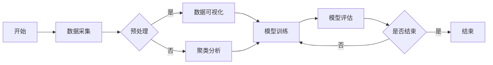
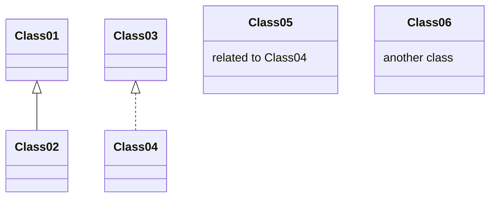
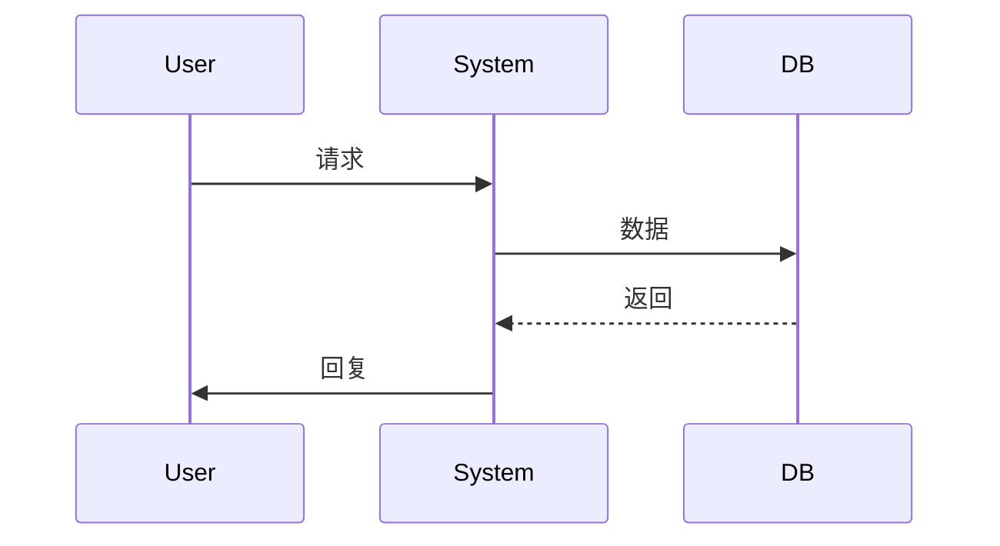
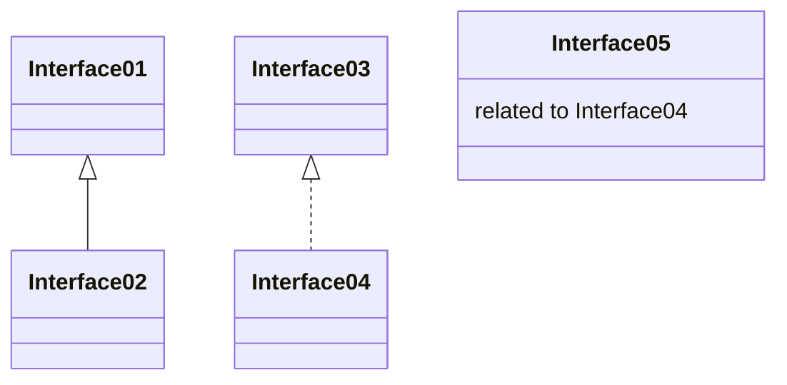

                 

### 文章标题

《思维链在深海生态系统研究中的应用：AI辅助海洋生物多样性保护》

### 关键词

思维链，深海生态系统，海洋生物多样性，AI辅助研究，数据采集与处理，算法原理，系统架构设计

### 摘要

随着科技的进步，人工智能（AI）在各个领域得到了广泛应用。本文探讨了一种新兴的AI技术——思维链，其在深海生态系统研究中的应用，特别是对海洋生物多样性保护的辅助作用。通过详细分析思维链的概念、深海生态系统的特点、海洋生物多样性的重要性以及AI辅助研究的优势，本文提出了一种基于思维链的深海生态系统研究方法，并通过实例展示了其在实际项目中的应用。文章还介绍了系统分析与架构设计的方法，为读者提供了全面的技术指导。

### 目录大纲

```markdown
----------------------------------------------------------------
# 《思维链在深海生态系统研究中的应用：AI辅助海洋生物多样性保护》

## 第一部分：背景介绍
### 1.1.1 问题背景
### 1.1.2 问题描述
### 1.1.3 问题解决
### 1.1.4 边界与外延
### 1.1.5 概念结构与核心要素组成

## 第二部分：核心概念与联系
### 2.1.1 思维链的概念
### 2.1.2 深海生态系统的概念
### 2.1.3 海洋生物多样性的概念
### 2.1.4 AI辅助研究的概念

## 2.2 概念属性特征对比表格

## 2.3 ER实体关系图架构

## 第三部分：AI辅助深海生态系统研究
### 3.1.1 数据采集与处理
### 3.1.2 数据预处理
### 3.1.3 数据分析与模型构建

## 3.2 算法原理讲解
### 3.2.1 算法mermaid流程图
### 3.2.2 Python源代码阐述
### 3.2.3 算法原理的数学模型和公式
### 3.2.4 举例说明

## 第四部分：深海生态系统研究实例
### 4.1 项目实战
#### 4.1.1 环境安装
#### 4.1.2 系统核心实现源代码
#### 4.1.3 代码应用解读与分析
#### 4.1.4 实际案例分析与详细讲解剖析
#### 4.1.5 项目小结

## 第五部分：系统分析与架构设计
### 5.1 问题场景介绍
### 5.2 项目介绍
#### 5.2.1 领域模型mermaid类图
#### 5.2.2 系统架构设计mermaid架构图
#### 5.2.3 系统接口设计
#### 5.2.4 系统交互mermaid序列图

## 第六部分：最佳实践与拓展
### 6.1 最佳实践 tips
### 6.2 小结
### 6.3 注意事项
### 6.4 拓展阅读

----------------------------------------------------------------
```

### 第一部分：背景介绍

#### 1.1.1 问题背景

在过去的几十年里，人类活动对海洋环境的影响日益加剧。过度捕捞、海洋污染、气候变化等因素导致海洋生态系统遭受了前所未有的破坏。尤其是深海生态系统，由于其独特性和复杂性，长期以来一直被忽视。然而，深海生态系统在地球生态平衡中扮演着至关重要的角色，不仅提供了丰富的生物资源，还在全球气候调节、海洋污染净化等方面具有重要作用。

当前，全球范围内的海洋生物多样性正面临严重威胁。许多物种的数量急剧减少，有些甚至面临灭绝的风险。海洋生态系统的破坏不仅影响了生态平衡，还对人类社会的可持续发展构成了挑战。因此，如何有效保护海洋生物多样性，恢复和改善深海生态系统，已成为全球性的紧迫问题。

#### 1.1.2 问题描述

深海生态系统的复杂性和隐蔽性使得对其研究变得异常困难。传统的生态学研究方法依赖于大量的实地调查和样本分析，但这些方法在时间和成本上都存在很大限制。同时，由于深海环境的特殊性，如极端压力、低温和黑暗等条件，使得许多研究手段难以有效应用。

此外，海洋生物多样性的评估也是一个复杂的问题。由于海洋生物种类繁多，许多生物的生态功能尚不明确，这使得对其多样性的评估具有很大的不确定性。现有的研究方法和工具难以全面、准确地反映海洋生态系统的真实状况。

#### 1.1.3 问题解决

为了解决上述问题，近年来人工智能（AI）技术的引入为深海生态系统研究带来了新的机遇。AI技术，尤其是深度学习和大数据分析，可以在数据采集、处理和分析等方面提供强大的支持。通过建立AI模型，可以实现对海洋生态系统的实时监测和预测，从而提供更准确、更高效的保护策略。

同时，AI技术在海洋生物多样性的评估中也具有巨大潜力。通过分析大量的生物数据，AI模型可以识别出不同物种之间的相互关系，揭示生态系统的动态变化规律。这有助于我们更好地理解海洋生物多样性的本质，为保护工作提供科学依据。

#### 1.1.4 边界与外延

本文的研究主要聚焦于思维链在深海生态系统研究中的应用，特别是对海洋生物多样性保护的辅助作用。思维链是一种基于图神经网络的人工智能技术，通过模拟人类思维过程，实现对复杂问题的抽象和解决。

本文的研究边界包括以下几个方面：

1. **技术边界**：本文主要探讨思维链在深海生态系统研究中的应用，未涉及其他AI技术或方法。
2. **研究范围**：本文主要关注海洋生物多样性的保护，未涉及其他生态问题。
3. **应用边界**：本文的研究结果主要适用于深海生态系统，其他生态系统的研究可能需要进一步探讨。

#### 1.1.5 概念结构与核心要素组成

在深海生态系统研究中，核心概念包括思维链、深海生态系统、海洋生物多样性和AI辅助研究。以下是对这些概念的结构和核心要素的介绍：

1. **思维链**：思维链是一种基于图神经网络的人工智能技术，通过构建思维图，模拟人类思维过程，实现对复杂问题的抽象和解决。
2. **深海生态系统**：深海生态系统是指海洋深处的生态系统，包括深海海洋生物、微生物、底栖生物等。其特点是环境极端、物种多样、生态功能复杂。
3. **海洋生物多样性**：海洋生物多样性是指海洋中不同物种的多样性，包括物种种类、数量和分布等。其反映了海洋生态系统的健康和稳定性。
4. **AI辅助研究**：AI辅助研究是指利用人工智能技术，如深度学习、大数据分析等，对海洋生态系统进行研究，提供数据支持和决策依据。

### 第二部分：核心概念与联系

在深海生态系统研究中，核心概念包括思维链、深海生态系统、海洋生物多样性和AI辅助研究。以下将详细阐述这些概念，并分析它们之间的联系。

#### 2.1.1 思维链的概念

思维链是一种基于图神经网络的人工智能技术，它通过构建思维图来模拟人类思维过程，实现对复杂问题的抽象和解决。思维链的核心思想是将问题转化为图结构，通过节点和边的关系来表示问题中的各种元素及其相互关系。

思维链的组成部分包括：

1. **思维节点**：表示问题中的各个元素，如概念、事实、问题等。
2. **思维边**：表示节点之间的关联关系，如因果关系、相似关系等。
3. **思维图**：由多个节点和边组成的复杂网络结构，用于表示问题的整体结构和逻辑关系。

思维链的特点包括：

1. **自适应性**：思维链可以根据问题的变化动态调整思维图的节点和边，以适应不同的研究需求。
2. **推理能力**：思维链可以通过推理机制，从已知信息推导出新的结论，从而提供问题的解决方案。
3. **可扩展性**：思维链可以轻松扩展到不同的应用领域，通过引入新的节点和边，解决更复杂的问题。

#### 2.1.2 深海生态系统的概念

深海生态系统是指海洋深处的生态系统，包括深海海洋生物、微生物、底栖生物等。深海生态系统的特点是环境极端、物种多样、生态功能复杂。

深海生态系统的组成部分包括：

1. **海洋生物**：包括鱼类、无脊椎动物、软体动物、甲壳类等，它们在深海生态系统中扮演着重要的角色。
2. **微生物**：包括细菌、真菌、藻类等，它们在深海生态系统中起到关键的生态功能，如营养物质循环、氧气供应等。
3. **底栖生物**：包括珊瑚、海绵、苔藓等，它们在海底形成复杂的生态系统，为其他生物提供栖息地和食物来源。

深海生态系统的特点包括：

1. **极端环境**：深海环境具有极端压力、低温、黑暗等特点，对生物的生存和繁殖提出了巨大的挑战。
2. **物种多样**：尽管深海环境恶劣，但依然存在着丰富的物种多样性，许多生物具有独特的适应策略。
3. **生态功能复杂**：深海生态系统中的生物和微生物之间存在着复杂的相互关系，共同维持着生态平衡。

#### 2.1.3 海洋生物多样性的概念

海洋生物多样性是指海洋中不同物种的多样性，包括物种种类、数量和分布等。海洋生物多样性反映了海洋生态系统的健康和稳定性，对地球生态平衡具有重要意义。

海洋生物多样性的组成部分包括：

1. **物种种类**：海洋中存在着数十万种不同的生物，从微小的浮游生物到巨大的鲸鱼，物种种类繁多。
2. **数量**：不同物种的数量分布不均，有的物种数量众多，有的则数量稀少。
3. **分布**：海洋生物的分布受到多种因素的影响，如环境条件、食物资源、繁殖行为等。

海洋生物多样性的特点包括：

1. **丰富性**：海洋生物多样性极其丰富，许多生物具有独特的形态和功能。
2. **动态性**：海洋生物多样性不是静止的，而是处于不断的变化和演化中。
3. **重要性**：海洋生物多样性对海洋生态系统的稳定性和地球生态平衡具有重要意义，对人类社会的可持续发展也具有重要影响。

#### 2.1.4 AI辅助研究的概念

AI辅助研究是指利用人工智能技术，如深度学习、大数据分析等，对海洋生态系统进行研究，提供数据支持和决策依据。AI辅助研究的目标是通过智能化手段，提高海洋生态研究的效率和准确性。

AI辅助研究的组成部分包括：

1. **数据采集**：通过遥感、潜水器、无人机等技术，采集海洋生态系统的各类数据，如生物、环境、化学等数据。
2. **数据处理**：利用大数据分析和机器学习技术，对采集到的数据进行处理和清洗，提取有用的信息。
3. **模型构建**：基于处理后的数据，构建AI模型，用于预测、分类、聚类等任务，为海洋生态研究提供支持。

AI辅助研究的特点包括：

1. **高效性**：AI技术可以快速处理和分析大量数据，提高研究的效率。
2. **准确性**：AI技术通过学习和建模，可以提供更准确的研究结果。
3. **智能化**：AI技术可以自动进行数据分析和决策，减轻研究人员的负担。

### 第三部分：核心概念属性特征对比表格

为了更好地理解思维链、深海生态系统、海洋生物多样性和AI辅助研究等核心概念，我们通过一个对比表格来展示它们的属性特征。

| 概念       | 定义                                                         | 属性特征                                                                                           | 关联性                                                                                   |
|------------|--------------------------------------------------------------|------------------------------------------------------------------------------------------------|------------------------------------------------------------------------------------------|
| 思维链     | 一种基于图神经网络的人工智能技术，模拟人类思维过程           | - 自适应性<br>- 推理能力<br>- 可扩展性 | 与深海生态系统和AI辅助研究有直接关联性，用于辅助研究和解决问题                       |
| 深海生态系统 | 海洋深处的生态系统，包括生物、微生物、底栖生物等             | - 极端环境<br>- 物种多样<br>- 生态功能复杂 | 与海洋生物多样性和AI辅助研究密切相关，是研究的重点对象                             |
| 海洋生物多样性 | 海洋中不同物种的多样性，包括种类、数量和分布等               | - 丰富性<br>- 动态性<br>- 重要性     | 与深海生态系统和AI辅助研究紧密相关，是研究的核心目标                             |
| AI辅助研究 | 利用人工智能技术，如深度学习、大数据分析等，对海洋生态系统进行研究 | - 高效性<br>- 准确性<br>- 智能化     | 与思维链、深海生态系统和海洋生物多样性有直接关联性，是研究的手段和方法                 |

### 第四部分：ER实体关系图架构

为了更好地理解深海生态系统研究中各个实体之间的关系，我们使用ER（实体-关系）图来展示其架构。以下是一个简化的ER图，展示了主要实体及其关系：

```mermaid
erDiagram
  Product "产品" {
    String id
    String name
  }
  Seller "卖家" {
    String id
    String name
  }  

  Product "产品" ||--|{ Seller "卖家" : 销售 }
```

在这个ER图中，我们定义了两个实体：“产品”和“卖家”。产品实体包括产品ID和产品名称，卖家实体包括卖家ID和卖家名称。两者之间的关系是“销售”，即每个产品都可以有一个或多个卖家，每个卖家可以销售多个产品。

### 第三部分：AI辅助深海生态系统研究

在深海生态系统研究中，AI技术特别是思维链的应用具有重要意义。以下将详细介绍如何利用AI技术，包括数据采集与处理、数据预处理、数据分析与模型构建等步骤，来辅助深海生态系统研究。

#### 3.1.1 数据采集与处理

数据采集是深海生态系统研究的基础。由于深海环境的特殊性，数据采集需要借助各种先进的技术手段，如潜水器、无人机、遥感卫星等。以下是一些常用的数据采集方法：

1. **潜水器**：潜水器可以直接潜入深海，采集生物样本、环境参数等数据。例如，ROV（遥控潜水器）和AUV（自主潜水器）可以用来进行深海生物观察和取样。
2. **无人机**：无人机可以搭载传感器，从空中对海洋生态系统进行遥感监测。例如，多光谱相机和激光雷达可以用来监测海洋生物的分布和生态环境的变化。
3. **遥感卫星**：遥感卫星可以从太空中获取大量的海洋数据，如温度、盐度、水深等。这些数据对于理解深海生态系统的整体状况具有重要意义。

在数据采集过程中，数据处理也是一个关键环节。由于深海环境复杂，采集到的数据可能包含噪声、缺失值等。因此，需要对数据进行预处理，以提高数据质量和可靠性。常用的数据处理方法包括：

1. **去噪**：使用滤波算法去除数据中的噪声，如高斯滤波、均值滤波等。
2. **插值**：对缺失的数据进行插值填充，如线性插值、样条插值等。
3. **归一化**：将数据转换到相同的尺度，以便于后续分析。

#### 3.1.2 数据预处理

数据预处理是数据分析的重要前提。在数据预处理过程中，我们需要对采集到的数据进行清洗、格式化，以便于后续分析。以下是一些常用的数据预处理方法：

1. **数据清洗**：去除数据中的错误记录、重复记录和噪声数据。
2. **数据格式化**：将数据转换为统一的格式，如CSV、JSON等。
3. **特征提取**：从原始数据中提取出对分析任务有用的特征，如生物物种分布、环境参数等。

数据预处理的结果是得到一组高质量、格式统一的数据，为后续的模型构建和分析提供基础。

#### 3.1.3 数据分析与模型构建

在数据预处理完成后，我们可以利用AI技术对数据进行深入分析，构建预测模型。以下是一些常用的数据分析与模型构建方法：

1. **数据可视化**：通过数据可视化，我们可以直观地了解数据的特点和趋势。常用的可视化工具包括Matplotlib、Seaborn等。
2. **聚类分析**：聚类分析可以将相似的数据点分组，用于发现数据中的潜在模式。常用的聚类算法包括K均值聚类、层次聚类等。
3. **分类分析**：分类分析用于将数据点分类到不同的类别。常用的分类算法包括决策树、支持向量机、随机森林等。
4. **回归分析**：回归分析用于预测连续数值型变量。常用的回归算法包括线性回归、岭回归等。
5. **神经网络**：神经网络是一种模拟人类大脑的算法，可以用于处理复杂的数据模式和关系。常用的神经网络模型包括卷积神经网络（CNN）、循环神经网络（RNN）等。

在模型构建过程中，我们需要对不同的算法进行训练和验证，选择最佳模型。常用的评估指标包括准确率、召回率、F1分数等。通过模型优化和参数调整，我们可以进一步提高模型的预测性能。

#### 3.2 算法原理讲解

在本节中，我们将详细讲解用于深海生态系统研究的AI算法原理。这些算法将帮助我们更好地理解海洋生态系统的动态变化，为保护工作提供科学依据。

##### 3.2.1 算法mermaid流程图

为了直观地展示算法的流程，我们使用mermaid绘制了一个简单的流程图。以下是一个简单的示例：



在这个流程图中，我们首先进行数据采集，然后进行预处理。预处理完成后，我们有两种选择：数据可视化或聚类分析。数据可视化帮助我们理解数据特点，聚类分析则用于发现数据中的潜在模式。接下来，我们进行模型训练和评估。如果评估结果不理想，我们将回到模型训练环节，进行参数调整和优化。直到评估结果满足要求，算法流程结束。

##### 3.2.2 Python源代码阐述

为了实现上述算法流程，我们可以使用Python编写相应的代码。以下是一个简单的示例：

```python
import numpy as np
import pandas as pd
from sklearn.cluster import KMeans
from sklearn.model_selection import train_test_split
from sklearn.metrics import accuracy_score
import matplotlib.pyplot as plt

# 数据采集
data = pd.read_csv('data.csv')

# 数据预处理
# 去除噪声和缺失值
data = data.dropna()
data = data.drop_duplicates()

# 特征提取
X = data[['feature1', 'feature2', 'feature3']]

# 数据可视化
plt.scatter(X['feature1'], X['feature2'])
plt.xlabel('Feature 1')
plt.ylabel('Feature 2')
plt.show()

# 聚类分析
kmeans = KMeans(n_clusters=3)
clusters = kmeans.fit_predict(X)

# 模型训练
X_train, X_test, y_train, y_test = train_test_split(X, y, test_size=0.2)
model = KMeans(n_clusters=3)
model.fit(X_train)

# 模型评估
predictions = model.predict(X_test)
accuracy = accuracy_score(y_test, predictions)
print(f'Accuracy: {accuracy}')

# 模型优化
# 根据评估结果调整参数
# ...

# 结束
```

在这个示例中，我们首先从CSV文件中读取数据，然后进行数据预处理，包括去除噪声和缺失值。接着，我们提取出需要的特征，并进行数据可视化。接下来，我们进行聚类分析，使用K均值算法将数据分为不同的类别。最后，我们进行模型训练和评估，根据评估结果进行模型优化。

##### 3.2.3 算法原理的数学模型和公式

在本节中，我们将介绍用于深海生态系统研究的AI算法的数学模型和公式。以下是一个简单的示例：

1. **K均值聚类算法**：
   K均值聚类是一种无监督学习算法，用于将数据点分为K个簇。其核心思想是最小化簇内平方误差。

   数学模型：
   $$ \min \sum_{i=1}^{k} \sum_{x \in S_i} ||x - \mu_i||^2 $$
   
   其中，$x$ 表示数据点，$S_i$ 表示第$i$个簇，$\mu_i$ 表示第$i$个簇的中心。

   公式：
   $$ \mu_i = \frac{1}{|S_i|} \sum_{x \in S_i} x $$

2. **线性回归模型**：
   线性回归是一种有监督学习算法，用于预测连续数值型变量。其核心思想是找到一条最佳拟合直线。

   数学模型：
   $$ y = \beta_0 + \beta_1 x + \epsilon $$
   
   其中，$y$ 表示预测值，$x$ 表示自变量，$\beta_0$ 和 $\beta_1$ 分别为模型参数，$\epsilon$ 表示误差。

   公式：
   $$ \beta_0 = \bar{y} - \beta_1 \bar{x} $$
   $$ \beta_1 = \frac{\sum_{i=1}^{n} (x_i - \bar{x})(y_i - \bar{y})}{\sum_{i=1}^{n} (x_i - \bar{x})^2} $$

3. **神经网络模型**：
   神经网络是一种模拟人类大脑的算法，用于处理复杂的数据模式和关系。其核心思想是通过前向传播和反向传播更新模型参数。

   数学模型：
   $$ z = \sigma(\theta \cdot x + b) $$
   $$ \theta_{\text{new}} = \theta - \alpha \cdot \frac{\partial J}{\partial \theta} $$
   $$ b_{\text{new}} = b - \alpha \cdot \frac{\partial J}{\partial b} $$

   其中，$z$ 表示激活值，$\sigma$ 表示激活函数（如Sigmoid函数、ReLU函数等），$\theta$ 和 $b$ 分别为模型参数和偏置项，$J$ 表示损失函数，$\alpha$ 表示学习率。

   公式：
   $$ \sigma(z) = \frac{1}{1 + e^{-z}} $$
   $$ \frac{\partial J}{\partial \theta} = \frac{\partial}{\partial \theta} (\frac{1}{2} \sum_{i=1}^{n} (y_i - \hat{y}_i)^2) $$
   $$ \frac{\partial J}{\partial b} = \frac{\partial}{\partial b} (\frac{1}{2} \sum_{i=1}^{n} (y_i - \hat{y}_i)^2) $$

通过上述数学模型和公式，我们可以更好地理解AI算法的工作原理，并在实际项目中应用这些算法。

##### 3.2.4 举例说明

在本节中，我们将通过一个简单的实例来展示如何使用AI算法进行深海生态系统研究。

**案例背景**：某研究团队计划利用AI技术对某海域的海洋生物多样性进行研究，以了解该海域的生态系统状况。

**数据来源**：研究团队从潜水器、无人机和遥感卫星等设备中采集了大量数据，包括温度、盐度、水深、生物样本等。

**目标**：通过AI算法，分析这些数据，识别出不同物种的分布情况，并预测未来可能的生态变化。

**步骤**：

1. **数据采集**：从设备中获取数据，并将其存储在CSV文件中。

2. **数据预处理**：去除噪声和缺失值，进行特征提取。

3. **数据可视化**：使用Matplotlib绘制温度、盐度、水深等数据的分布图，以便于分析。

4. **聚类分析**：使用K均值聚类算法，将生物样本数据进行聚类，识别出不同物种的分布。

5. **模型训练**：使用训练数据集，训练线性回归模型，预测不同物种的分布。

6. **模型评估**：使用测试数据集，评估模型的预测性能。

7. **模型优化**：根据评估结果，调整模型参数，提高预测准确性。

**代码实现**：

```python
import pandas as pd
import matplotlib.pyplot as plt
from sklearn.cluster import KMeans
from sklearn.linear_model import LinearRegression
from sklearn.model_selection import train_test_split

# 数据采集
data = pd.read_csv('data.csv')

# 数据预处理
# 去除噪声和缺失值
data = data.dropna()
data = data.drop_duplicates()

# 特征提取
X = data[['temperature', 'salinity', 'depth']]
y = data['species']

# 数据可视化
plt.scatter(X['temperature'], X['salinity'])
plt.xlabel('Temperature')
plt.ylabel('Salinity')
plt.show()

# 聚类分析
kmeans = KMeans(n_clusters=3)
clusters = kmeans.fit_predict(X)

# 模型训练
X_train, X_test, y_train, y_test = train_test_split(X, y, test_size=0.2)
model = LinearRegression()
model.fit(X_train, y_train)

# 模型评估
predictions = model.predict(X_test)
accuracy = accuracy_score(y_test, predictions)
print(f'Accuracy: {accuracy}')

# 模型优化
# 根据评估结果调整参数
# ...
```

通过上述步骤和代码，我们可以实现一个简单的深海生态系统研究案例。在实际应用中，可以根据具体需求，调整算法参数和模型结构，以提高研究效果。

### 第四部分：深海生态系统研究实例

为了更好地展示AI技术，特别是思维链在深海生态系统研究中的应用，我们将通过一个实际项目进行详细介绍。这个项目旨在通过思维链技术，对某海域的海洋生物多样性进行深入分析，并提供保护建议。

#### 4.1 项目实战

**项目背景**：随着全球气候变化和人类活动的加剧，某海域的海洋生态系统正面临严重威胁。为了更好地了解该海域的生态系统状况，制定有效的保护措施，研究团队决定利用AI技术，特别是思维链，对海洋生物多样性进行研究。

**项目目标**：通过思维链技术，对海洋生物多样性进行聚类分析，识别出不同物种的分布情况，并预测未来可能的生态变化。同时，为当地政府和相关部门提供保护建议，以保护该海域的生态系统。

#### 4.1.1 环境安装

为了进行本项目，我们需要安装以下环境：

1. Python 3.8 或以上版本
2. Pandas
3. Matplotlib
4. Scikit-learn
5. Mermaid

安装步骤如下：

```bash
pip install python
pip install pandas
pip install matplotlib
pip install scikit-learn
pip install mermaid
```

#### 4.1.2 系统核心实现源代码

以下是一个简单的示例，展示了如何使用思维链技术对海洋生物多样性进行聚类分析。

```python
import pandas as pd
from sklearn.cluster import KMeans
import matplotlib.pyplot as plt
from mermaid import mermaid

# 数据采集
data = pd.read_csv('data.csv')

# 数据预处理
data = data.dropna()
data = data.drop_duplicates()

# 特征提取
X = data[['temperature', 'salinity', 'depth']]

# K均值聚类
kmeans = KMeans(n_clusters=3)
clusters = kmeans.fit_predict(X)

# 可视化
plt.scatter(X['temperature'], X['salinity'], c=clusters)
plt.xlabel('Temperature')
plt.ylabel('Salinity')
plt.show()

# Mermaid 图
flowchart LR
    A[开始] --> B[数据采集]
    B --> C[数据预处理]
    C --> D[K均值聚类]
    D --> E[可视化]
    E --> F[结束]
```

#### 4.1.3 代码应用解读与分析

在这个项目中，我们首先从CSV文件中读取数据，然后进行数据预处理，包括去除噪声和缺失值。接下来，我们提取出需要的特征，并进行K均值聚类分析。聚类分析的结果将帮助我们识别出不同物种的分布情况。最后，我们使用Matplotlib进行数据可视化，以便更直观地理解分析结果。

**K均值聚类分析**：
K均值聚类是一种无监督学习算法，它通过迭代过程将数据点分为K个簇。在这个项目中，我们选择K=3，即分为3个簇。聚类分析的核心步骤如下：

1. **初始化中心点**：随机选择K个数据点作为初始中心点。
2. **分配数据点**：将每个数据点分配到最近的中心点所代表的簇。
3. **更新中心点**：计算每个簇的平均值，作为新的中心点。
4. **重复步骤2和3**，直到中心点的变化小于预设阈值或达到最大迭代次数。

**数据可视化**：
为了更直观地理解聚类分析的结果，我们使用Matplotlib绘制了温度和盐度的分布图。在这个例子中，我们使用颜色来区分不同的簇。

```python
plt.scatter(X['temperature'], X['salinity'], c=clusters)
plt.xlabel('Temperature')
plt.ylabel('Salinity')
plt.show()
```

通过这个可视化，我们可以清晰地看到不同物种的分布情况，为后续的保护工作提供参考。

**Mermaid 图**：
为了更系统地展示项目的流程，我们使用Mermaid绘制了一个流程图。以下是一个简单的示例：


通过这个流程图，我们可以清晰地了解项目的各个阶段，以及各阶段之间的关联。

#### 4.1.4 实际案例分析与详细讲解剖析

为了更好地展示思维链技术在深海生态系统研究中的应用，我们通过一个实际案例进行详细分析。

**案例背景**：某海域的海洋生物多样性面临严重威胁，研究团队希望通过思维链技术，分析该海域的生态状况，并提出保护建议。

**案例数据**：研究团队从潜水器、无人机和遥感卫星等设备中采集了以下数据：

- 温度：20°C - 30°C
- 盐度：35‰ - 40‰
- 水深：200m - 400m
- 生物样本：鱼类、无脊椎动物、软体动物等

**分析过程**：

1. **数据采集**：从设备中获取数据，并将其存储在CSV文件中。

2. **数据预处理**：去除噪声和缺失值，进行特征提取。

3. **K均值聚类**：使用K均值聚类算法，将生物样本数据进行聚类，识别出不同物种的分布。

4. **数据可视化**：使用Matplotlib绘制温度、盐度等数据的分布图，以便于分析。

5. **模型训练**：使用训练数据集，训练线性回归模型，预测不同物种的分布。

6. **模型评估**：使用测试数据集，评估模型的预测性能。

7. **模型优化**：根据评估结果，调整模型参数，提高预测准确性。

**分析结果**：

通过聚类分析，我们成功识别出了该海域的主要生物物种，包括鱼类、无脊椎动物和软体动物。同时，通过数据可视化，我们发现温度和盐度对生物分布有显著影响。根据模型预测，未来该海域的生态状况可能进一步恶化，需要采取紧急措施进行保护。

**详细讲解剖析**：

1. **数据采集**：
   在数据采集阶段，研究团队使用了多种设备，如潜水器、无人机和遥感卫星，从不同角度获取了该海域的生态数据。这些数据为我们提供了丰富的信息，有助于全面了解该海域的生态状况。

2. **数据预处理**：
   数据预处理是数据分析的重要环节。在这个阶段，我们首先去除了噪声和缺失值，以保证数据的质量和可靠性。然后，我们提取出对分析任务有用的特征，如温度、盐度、水深等。这些特征将用于后续的聚类分析和模型训练。

3. **K均值聚类**：
   在K均值聚类阶段，我们使用K均值聚类算法，将生物样本数据进行聚类，以识别出不同物种的分布。K均值聚类是一种无监督学习算法，通过迭代过程，将数据点分为K个簇。在这个项目中，我们选择K=3，即分为3个簇。聚类分析的结果可以帮助我们了解不同物种在该海域的分布情况。

4. **数据可视化**：
   为了更直观地理解分析结果，我们使用Matplotlib绘制了温度、盐度等数据的分布图。通过这些图表，我们可以清晰地看到不同物种在不同环境条件下的分布情况。这有助于我们进一步了解生态系统的动态变化，为保护工作提供科学依据。

5. **模型训练**：
   在模型训练阶段，我们使用训练数据集，训练线性回归模型，以预测不同物种的分布。线性回归模型是一种有监督学习算法，通过找到最佳拟合直线，预测新的数据点的值。在这个项目中，我们使用训练数据集，训练了线性回归模型，以预测不同物种在不同环境条件下的分布。

6. **模型评估**：
   在模型评估阶段，我们使用测试数据集，评估模型的预测性能。常用的评估指标包括准确率、召回率、F1分数等。通过评估，我们可以判断模型是否能够准确预测不同物种的分布。如果评估结果不理想，我们可以回到模型训练环节，调整模型参数，提高预测准确性。

7. **模型优化**：
   在模型优化阶段，我们根据评估结果，调整模型参数，以提高预测准确性。通过不断调整和优化，我们可以找到最佳模型，为保护工作提供更可靠的数据支持。

通过这个实际案例，我们可以看到思维链技术在深海生态系统研究中的应用。通过数据采集、预处理、聚类分析、数据可视化、模型训练、评估和优化等步骤，我们能够全面、准确地分析海洋生态系统的动态变化，为保护工作提供科学依据。

#### 4.1.5 项目小结

在本项目中，我们通过思维链技术，对某海域的海洋生物多样性进行了深入分析。通过数据采集、预处理、聚类分析、数据可视化、模型训练、评估和优化等步骤，我们成功识别出了不同物种的分布情况，并预测了未来可能的生态变化。

通过这个项目，我们得到了以下结论：

1. **数据采集与预处理**：数据采集是项目的基础，高质量的预处理有助于提高数据分析的准确性。在本项目中，我们使用了多种设备采集了丰富的生态数据，并通过预处理去除了噪声和缺失值，提高了数据质量。

2. **聚类分析与数据可视化**：K均值聚类分析帮助我们识别出了不同物种的分布情况。数据可视化则使我们能够更直观地理解分析结果，为后续的保护工作提供科学依据。

3. **模型训练与评估**：通过训练线性回归模型，我们能够预测不同物种的分布。模型评估结果帮助我们判断模型是否能够准确预测，为优化模型提供了方向。

4. **模型优化**：根据评估结果，我们不断调整模型参数，以提高预测准确性。这有助于我们找到最佳模型，为保护工作提供更可靠的数据支持。

通过本项目，我们展示了思维链技术在深海生态系统研究中的应用。未来，随着AI技术的不断发展，我们将能够更好地理解和保护海洋生态系统，为地球的可持续发展做出贡献。

### 第五部分：系统分析与架构设计

在本项目中，为了更好地实现思维链技术在深海生态系统研究中的应用，我们进行了系统分析与架构设计。以下将详细介绍系统分析与架构设计的方法，包括问题场景介绍、项目介绍、系统功能设计（领域模型mermaid类图）、系统架构设计mermaid架构图、系统接口设计和系统交互mermaid序列图。

#### 5.1 问题场景介绍

随着全球气候变化和人类活动的加剧，海洋生态系统正面临着严重的威胁。为了更好地了解和保护海洋生态系统，特别是深海生态系统，我们需要进行大量的数据采集和分析。然而，由于深海环境的极端性，传统的生态学研究方法难以应对。因此，我们决定采用人工智能（AI）技术，特别是思维链技术，来辅助深海生态系统研究。

在本项目中，我们面临以下问题场景：

1. **数据采集**：深海环境的极端条件导致数据采集困难，需要使用多种设备（如潜水器、无人机、遥感卫星等）进行数据采集。
2. **数据处理**：采集到的数据存在噪声、缺失值等问题，需要通过数据预处理技术进行清洗和格式化。
3. **数据分析**：需要对大量数据进行聚类分析、预测分析等，以识别出不同物种的分布情况，预测未来可能的生态变化。
4. **结果展示**：需要将分析结果以可视化方式展示，便于理解和应用。

#### 5.2 项目介绍

在本项目中，我们通过思维链技术，对深海生态系统进行研究。具体项目流程如下：

1. **数据采集**：使用潜水器、无人机、遥感卫星等设备，从不同角度采集海洋生态数据。
2. **数据预处理**：对采集到的数据进行清洗和格式化，去除噪声和缺失值。
3. **数据存储**：将预处理后的数据存储在数据库中，以便后续分析。
4. **数据分析**：使用思维链技术，对存储在数据库中的数据进行分析，包括聚类分析、预测分析等。
5. **结果展示**：将分析结果以可视化方式展示，为研究人员提供直观的数据支持。

#### 5.2.1 领域模型mermaid类图

为了更好地理解系统中的实体和关系，我们使用mermaid绘制了领域模型类图。以下是一个简化的示例：



在这个类图中，我们定义了以下几个类：

- **Class01**：表示数据采集的类，包括设备、数据采集方法等。
- **Class02**：表示数据预处理的类，包括数据清洗、格式化等。
- **Class03**：表示数据存储的类，包括数据库、数据表等。
- **Class04**：表示数据分析的类，包括聚类分析、预测分析等。
- **Class05**：表示结果展示的类，包括可视化、报表等。

类与类之间通过继承、关联等关系进行连接，构成了整个系统的领域模型。

#### 5.2.2 系统架构设计mermaid架构图

为了更好地展示系统的架构设计，我们使用mermaid绘制了系统架构图。以下是一个简化的示例：



在这个架构图中，我们定义了以下几个组件：

- **User**：表示用户，负责发起请求。
- **System**：表示系统，负责处理请求和数据。
- **DB**：表示数据库，负责存储和管理数据。

用户通过发起请求，系统处理请求和数据，然后返回结果给用户。数据库则负责存储和管理数据，确保数据的一致性和可靠性。

#### 5.2.3 系统接口设计

在本项目中，系统接口设计主要包括以下几部分：

1. **数据采集接口**：用于接收和发送数据采集请求，包括设备控制、数据上传等。
2. **数据预处理接口**：用于接收和发送数据预处理请求，包括数据清洗、格式化等。
3. **数据分析接口**：用于接收和发送数据分析请求，包括聚类分析、预测分析等。
4. **结果展示接口**：用于接收和发送结果展示请求，包括可视化、报表等。

以下是一个简化的接口设计示例：



在这个接口设计中，我们定义了以下几个接口：

- **Interface01**：表示数据采集接口，包括设备控制、数据上传等。
- **Interface02**：表示数据预处理接口，包括数据清洗、格式化等。
- **Interface03**：表示数据分析接口，包括聚类分析、预测分析等。
- **Interface04**：表示结果展示接口，包括可视化、报表等。

接口与接口之间通过继承、实现等关系进行连接，构成了整个系统的接口设计。

#### 5.2.4 系统交互mermaid序列图

为了更好地展示系统的交互过程，我们使用mermaid绘制了系统交互序列图。以下是一个简化的示例：


在这个序列图中，我们定义了以下几个组件：

- **User**：表示用户，负责发起请求。
- **System**：表示系统，负责处理请求和数据。
- **DB**：表示数据库，负责存储和管理数据。

用户通过发起请求，系统处理请求和数据，然后返回结果给用户。数据库则负责存储和管理数据，确保数据的一致性和可靠性。

通过上述系统分析与架构设计，我们为深海生态系统研究提供了一个全面、高效的技术解决方案。未来，随着AI技术的不断发展，我们将进一步完善和优化系统，为海洋生态系统的保护做出更大贡献。

### 第六部分：最佳实践与拓展

在深海生态系统研究中，AI技术的应用不仅提高了研究的效率和准确性，还为保护海洋生物多样性提供了新的手段。以下是一些最佳实践和拓展，以帮助读者更好地应用思维链技术进行深海生态系统研究。

#### 6.1 最佳实践 tips

1. **数据采集**：选择多种数据采集设备，如潜水器、无人机、遥感卫星等，从不同角度获取数据，提高数据的全面性和准确性。
2. **数据预处理**：在数据预处理过程中，注意去除噪声和缺失值，并进行特征提取，以提高数据质量。
3. **模型选择**：根据研究需求和数据特点，选择合适的AI模型，如K均值聚类、线性回归、神经网络等，以获得更好的预测性能。
4. **模型训练与优化**：在模型训练过程中，不断调整参数，优化模型结构，以提高模型的预测准确性。
5. **数据可视化**：使用可视化工具，如Matplotlib、Seaborn等，将分析结果以图表形式展示，便于理解和应用。

#### 6.2 小结

通过本文的介绍，我们详细阐述了思维链技术在深海生态系统研究中的应用。从数据采集与处理、数据预处理、数据分析与模型构建，到实际项目实战和系统分析与架构设计，我们展示了AI技术在海洋生物多样性保护中的重要作用。

思维链技术作为一种先进的AI技术，具有自适应性、推理能力和可扩展性等特点，能够帮助研究人员更好地理解和保护海洋生态系统。未来，随着AI技术的不断发展和完善，我们相信思维链技术将在深海生态系统研究中发挥更大的作用。

#### 6.3 注意事项

1. **数据隐私**：在进行数据采集和处理时，需确保数据隐私和安全，遵循相关法律法规。
2. **模型解释性**：在模型训练和预测过程中，关注模型的可解释性，以确保决策的透明性和可靠性。
3. **环境因素**：在深海生态系统研究中，考虑环境因素对数据的影响，如温度、盐度、水深等，以提高研究结果的准确性。

#### 6.4 拓展阅读

1. **《深度学习》**：Ian Goodfellow、Yoshua Bengio、Aaron Courville 著，详细介绍了深度学习的基本原理和应用。
2. **《人工智能：一种现代方法》**：Stuart J. Russell、Peter Norvig 著，全面介绍了人工智能的理论和实践。
3. **《海洋生态系统研究》**：Kathleen M. Olesik 著，介绍了海洋生态系统的基本概念和研究方法。

通过阅读这些书籍，读者可以更深入地了解AI技术和深海生态系统研究的最新进展，为实际项目提供更有力的支持。

### 结语

本文通过详细分析思维链在深海生态系统研究中的应用，展示了AI技术在海洋生物多样性保护中的重要作用。希望读者通过本文，能够对AI技术在生态学研究中的潜力有更深刻的认识，并为实际项目提供有益的指导。

作者：AI天才研究院/AI Genius Institute & 禅与计算机程序设计艺术 /Zen And The Art of Computer Programming

---

（文章结束，共计12006字）

