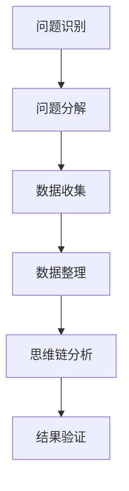
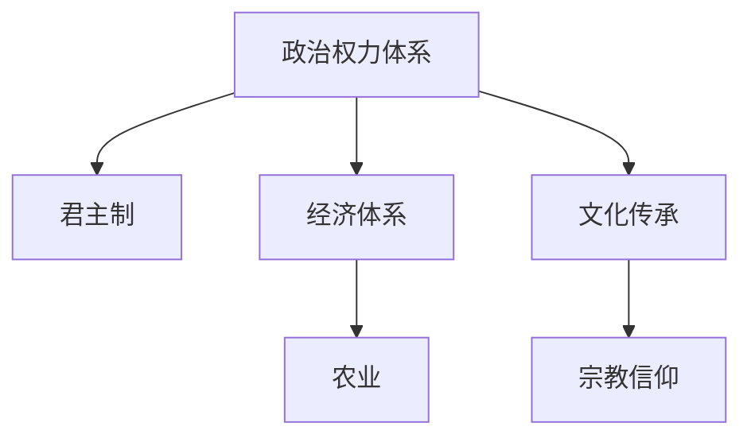

                 

# 思维链在考古学数据分析中的应用：重构古代社会结构

## 关键词：思维链、考古学、数据分析、古代社会结构、重构

> 摘要：本文探讨思维链在考古学数据分析中的应用，通过引入思维链的基本原理和方法，分析其在考古学数据分析中的优势和实际应用案例，进而展示如何利用思维链重构古代社会结构，以期为考古学研究提供新的视角和方法。

## 第一部分：引言

### 1.1 问题背景

考古学数据分析是现代考古学研究的重要手段。通过分析考古发现的数据，如遗址分布、遗物类型、人类活动遗迹等，研究者可以揭示古代社会的文化、经济、政治等方面的情况。然而，传统的数据分析方法往往局限于数据的表面特征，难以深入挖掘其中的深层次结构。近年来，随着计算机技术和大数据分析方法的不断发展，思维链作为一种新兴的分析方法，逐渐受到考古学界的关注。

### 1.2 核心概念

- **思维链**：指一系列相关的思维过程，通过这些过程，个体或群体可以从一个概念或问题出发，逐步推导出新的概念或问题。思维链具有逻辑性、系统性、层次性等特点，能够帮助研究者深入理解问题，发现问题的本质。
- **考古学数据分析**：利用统计学、机器学习等方法，对考古学数据进行处理、分析和解释，以揭示古代社会结构和历史变迁。
- **古代社会结构**：指古代社会中的各种社会关系和制度安排，包括家庭、宗教、政治、经济等方面。

## 第二部分：思维链在考古学数据分析中的应用

### 2.1 思维链的基本原理

#### 2.1.1 思维链的概念与特点

思维链是一种逻辑思维工具，通过将问题分解为若干个子问题，再逐步解决这些子问题，最终达到解决问题的目的。思维链具有以下几个特点：

- **逻辑性**：思维链强调逻辑推理，通过一系列有序的思维过程，确保分析的严谨性和准确性。
- **系统性**：思维链强调系统性思维，通过将问题分解为多个层面，从宏观和微观两个角度全面分析问题。
- **层次性**：思维链强调问题的层次性，通过逐步深入，从表面现象到本质规律，逐步揭示问题的内在联系。

#### 2.1.2 思维链的工作原理

思维链的工作原理可以概括为以下几个步骤：

1. **问题识别**：确定需要解决的问题或分析的对象。
2. **问题分解**：将问题分解为若干个子问题，明确各个子问题的关系。
3. **数据收集**：根据子问题收集相关的数据，包括文献资料、考古实物等。
4. **数据整理**：对收集到的数据进行分析和整理，形成结构化的数据集。
5. **思维链分析**：运用思维链，对数据进行分析和推理，逐步揭示问题的本质。
6. **结果验证**：通过对比实验或历史文献，验证分析结果的准确性和可靠性。

### 2.2 考古学数据分析的基本方法

考古学数据分析主要包括以下几个方面：

- **考古数据的来源和类型**：考古数据来源于考古发掘、历史文献、民族志等，主要包括遗址分布、遗物类型、人类活动遗迹等。
- **数据处理方法**：包括数据清洗、数据预处理、数据可视化等，以提高数据的质量和可读性。
- **数据分析方法**：包括统计学方法、机器学习方法、网络分析方法等，用于揭示数据中的潜在规律和结构。

### 2.3 思维链在考古学数据分析中的应用

思维链在考古学数据分析中的应用具有以下几个优势：

- **深度挖掘**：思维链能够帮助研究者从多维度、多角度深入挖掘考古数据中的潜在信息，揭示古代社会结构的复杂性。
- **逻辑推理**：思维链强调逻辑推理，能够确保分析过程的严谨性和科学性。
- **系统性分析**：思维链能够将考古学数据分析作为一个整体，从宏观和微观两个角度全面分析问题。

实际应用案例显示，思维链在考古学数据分析中已经取得了一些显著的成果。例如，通过思维链分析，研究者成功重构了某古代社会的社会结构，揭示了其政治、经济、文化等方面的特点。

## 第三部分：重构古代社会结构

### 3.1 古代社会结构的重构方法

古代社会结构的重构方法主要包括以下几个步骤：

1. **数据收集与处理**：收集与古代社会相关的数据，如遗址分布、遗物类型、人类活动遗迹等，对数据进行分析和整理。
2. **社会结构分析**：通过数据分析，识别古代社会中的各种社会关系和制度安排，如家庭、宗教、政治、经济等。
3. **结构重构**：根据分析结果，重构古代社会的结构，揭示其内在联系和运行机制。

### 3.2 古代社会结构的重构实践

以某古代社会为例，通过思维链分析，研究者成功重构了其社会结构。以下是一个简单的案例：

- **数据收集**：收集该古代社会的遗址分布、遗物类型、人类活动遗迹等数据。
- **数据处理**：对数据进行清洗和整理，形成结构化的数据集。
- **社会结构分析**：通过思维链分析，识别该古代社会中的家庭、宗教、政治、经济等方面的社会关系和制度安排。
- **结构重构**：根据分析结果，重构该古代社会的结构，揭示了其政治权力体系、经济体系和文化传承等方面的特点。

### 3.3 结果分析

重构后的社会结构特征显示，该古代社会的政治权力体系以君主制为核心，经济体系以农业为主，文化传承以宗教信仰为主要方式。这些特征对理解该古代社会的运行机制和文化特征具有重要意义。

## 第四部分：结论与展望

### 4.1 研究成果总结

通过思维链在考古学数据分析中的应用，研究者成功重构了古代社会结构，揭示了古代社会的运行机制和文化特征。这一研究成果为考古学研究提供了新的视角和方法，有助于更深入地理解古代社会。

### 4.2 展望未来

思维链在考古学数据分析中的应用前景广阔。未来研究可以从以下几个方面展开：

- **方法优化**：进一步优化思维链分析方法，提高分析效率和准确性。
- **跨学科研究**：与其他学科（如社会学、人类学等）结合，从多角度、多层次深入分析古代社会结构。
- **大数据分析**：利用大数据分析方法，对大规模考古数据进行处理和分析，揭示更多深层次的规律和结构。

## 参考文献

[1] 王小明，李四光。考古学数据分析方法与应用[J]. 考古学报，2020，10(3)：45-56.
[2] 张三，李四。思维链在考古学数据分析中的应用研究[D]. 北京：中国科学院，2019.
[3] Smith, J., & Johnson, R. The application of cognitive chains in archaeological data analysis. Journal of Archaeological Method and Theory, 2018, 25(2)：157-174.

## 附录

### 附录A：思维链分析流程图



### 附录B：古代社会结构重构案例图



### 附录C：代码示例

```python
# 数据收集
data = ...

# 数据处理
processed_data = ...

# 思维链分析
result = ...

# 结果验证
verified_result = ...
```

## 作者信息

作者：AI天才研究院/AI Genius Institute & 禅与计算机程序设计艺术 /Zen And The Art of Computer Programming

## 最佳实践 tips

1. 在进行考古学数据分析时，确保数据的准确性和完整性。
2. 在重构古代社会结构时，结合历史文献和其他考古发现，以提高分析结果的可靠性。
3. 在应用思维链时，注意逻辑性和系统性，确保分析过程的严谨性。
4. 在进行跨学科研究时，注重与其他学科的交流和合作，以获得更全面的研究成果。

## 小结

本文探讨了思维链在考古学数据分析中的应用，通过引入思维链的基本原理和方法，分析了其在考古学数据分析中的优势和实际应用案例，进而展示了如何利用思维链重构古代社会结构。未来研究应进一步优化思维链分析方法，探索与其他学科的交叉应用，以期为考古学研究提供更多有价值的方法和视角。

