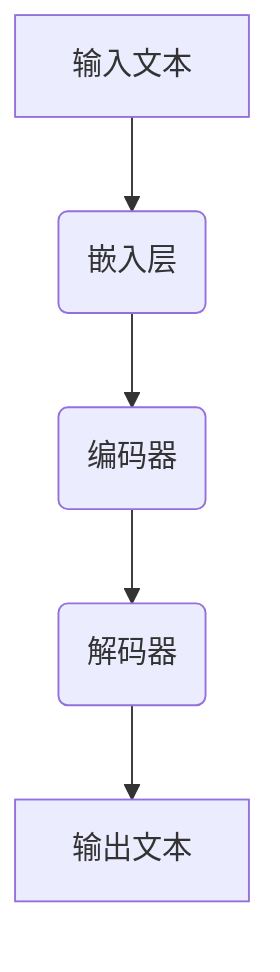

                 

### 第一部分：情境适应性测试概述

#### 第1章：情境适应性测试的核心概念

##### 1.1.1 问题背景

随着人工智能（AI）技术的发展，尤其是大型语言模型（LLM）的广泛应用，如何在多变的环境中对这些模型进行评估成为一个关键问题。传统的测试方法往往在模拟静态环境时效果较好，但在应对动态、复杂和多变的环境时，其表现存在明显不足。因此，研究情境适应性测试，即检验LLM在多变环境中的表现，具有重要的理论和实际意义。

##### 1.1.2 问题描述

情境适应性测试旨在评估LLM在不同情境下的适应能力。具体来说，包括以下方面：

1. **环境变化感知能力**：LLM能否迅速感知环境的变化，并作出相应的调整。
2. **情境转换能力**：LLM在从一个情境切换到另一个情境时，能否保持稳定的表现。
3. **长期记忆能力**：LLM能否在经历一系列情境变化后，仍能保持对先前情境的记忆和影响。

##### 1.1.3 问题解决

要解决上述问题，需要从以下几个方面入手：

1. **多样化数据集**：构建包含多种情境变化的测试数据集，以全面评估LLM的适应性。
2. **动态环境模拟**：设计能够模拟实际环境中动态变化的测试系统，以检验LLM的感知和应对能力。
3. **多维度评估指标**：制定包含感知速度、情境转换效率和长期记忆等多维度的评估指标，综合评价LLM的表现。

##### 1.1.4 边界与外延

1. **边界**：情境适应性测试主要关注LLM在多变环境中的表现，但并不排除在其他环境中的评估。
2. **外延**：该测试不仅可以应用于语言模型，还可以推广到其他类型的AI模型。

##### 1.1.5 概念结构与核心要素组成

1. **核心概念**：情境适应性测试、大型语言模型（LLM）、环境变化、情境转换、长期记忆。
2. **核心要素**：测试数据集、动态环境模拟、评估指标。

#### 第2章：大型语言模型（LLM）的基本原理

##### 2.1 LLM的定义与特点

LLM是一种具有强大语言理解和生成能力的人工智能模型，具有以下几个特点：

1. **大规模**：LLM通常具有数十亿到数千亿个参数，能够处理大量文本数据。
2. **深度学习**：基于深度神经网络，通过多层非线性变换学习语言模式。
3. **预训练与微调**：通过在大量无标签文本数据上进行预训练，然后在特定任务上进行微调。

##### 2.2 LLM的核心组件

LLM主要由以下几个核心组件构成：

1. **嵌入层**：将输入的文本转换为向量表示。
2. **编码器**：对输入的文本序列进行处理，提取关键信息。
3. **解码器**：根据编码器提取的信息生成输出文本。

##### 2.3 LLM的工作原理

LLM的工作原理主要包括以下几个步骤：

1. **输入处理**：将输入的文本数据转换为嵌入向量。
2. **编码器处理**：对嵌入向量进行编码，提取序列特征。
3. **解码器生成**：根据编码特征生成输出文本。

#### 第3章：多变环境的定义与特征

##### 3.1 环境的定义与类型

环境是指LLM运行和操作的背景，根据其变化特点，可分为以下几种类型：

1. **静态环境**：环境特征相对稳定，不随时间变化。
2. **动态环境**：环境特征随时间变化，包括线性变化和非线性变化。
3. **复杂环境**：环境包含多个动态因素，具有高度不确定性。

##### 3.2 多变环境的特征

多变环境具有以下几个特征：

1. **不确定性**：环境状态不确定，可能导致LLM预测结果不准确。
2. **动态变化**：环境特征随时间变化，可能需要LLM快速适应。
3. **多模态**：环境可能包含多种数据类型（如文本、图像、声音等），需要LLM具备多模态处理能力。

#### 第4章：情境适应性测试的方法与策略

##### 4.1 测试方法

情境适应性测试可以采用以下几种方法：

1. **数据驱动方法**：通过收集大量实际情境数据，对LLM进行训练和评估。
2. **模拟驱动方法**：设计模拟环境，模拟多变情境，对LLM进行评估。
3. **混合方法**：结合数据驱动和模拟驱动方法，综合评估LLM的情境适应性。

##### 4.2 测试策略

为了有效进行情境适应性测试，可以采用以下策略：

1. **多维度测试**：从多个维度评估LLM的表现，如感知速度、情境转换效率和长期记忆等。
2. **动态调整**：根据测试结果，动态调整测试参数和环境设置，以更好地评估LLM的情境适应性。
3. **对比测试**：将LLM在不同情境下的表现进行对比，以识别其优势和劣势。

### 第一部分：情境适应性测试概述

## 情境适应性测试：检验LLM在多变环境中的表现

> 关键词：情境适应性测试、大型语言模型（LLM）、多变环境、环境变化、动态调整

> 摘要：本文首先介绍了情境适应性测试的背景和核心概念，随后探讨了大型语言模型（LLM）的基本原理和多变环境的定义与特征。在此基础上，提出了情境适应性测试的方法和策略，详细阐述了如何通过多样化数据集、动态环境模拟和多维度评估指标来检验LLM在多变环境中的表现。本文旨在为研究人员和开发者提供一套系统的、可操作的评估方法，以提升LLM在实际应用中的表现和可靠性。

### 第一部分：情境适应性测试概述

### 第1章：情境适应性测试的核心概念

#### 1.1.1 问题背景

随着人工智能（AI）技术的发展，尤其是大型语言模型（LLM）的广泛应用，如何评估这些模型在复杂多变环境中的表现成为了一个重要课题。传统的测试方法主要在静态环境中进行，这对于评估模型在稳定、已知环境中的性能有一定的帮助，但在动态、复杂和多变的环境中，这些方法往往显得力不从心。例如，在自然语言处理、对话系统、智能客服等领域，环境的变化不仅包括语言数据的多样性，还包括用户需求、情境背景、交互上下文等多方面的动态变化。因此，研究如何对LLM在多变环境中的适应性进行评估，不仅有助于提升模型的应用价值，也对人工智能技术的发展具有重要意义。

#### 1.1.2 问题描述

情境适应性测试的核心目的是评估LLM在多变环境中的适应能力，具体包括以下几个方面：

1. **环境变化感知能力**：LLM需要能够实时感知环境中的变化，并迅速做出响应。这要求模型不仅要能够处理静态数据，还要能够适应动态变化。
   
2. **情境转换能力**：在LLM从一种情境切换到另一种情境时，其表现应保持稳定。例如，从一个对话话题切换到另一个话题，模型应能够无缝过渡。

3. **长期记忆能力**：在经历一系列情境变化后，LLM应能够保持对先前情境的记忆和影响，即模型具有持续学习和适应的能力。

4. **多模态处理能力**：在现代应用场景中，LLM可能需要处理多种类型的数据，如文本、图像、声音等，因此其多模态处理能力也是一个重要评估指标。

#### 1.1.3 问题解决

为了解决上述问题，我们可以从以下几个方面入手：

1. **多样化数据集**：构建包含多种情境变化的测试数据集，以全面评估LLM的适应性。这些数据集应涵盖不同类型的情境、变化速度和复杂性。

2. **动态环境模拟**：设计能够模拟实际环境中动态变化的测试系统，以检验LLM的感知和应对能力。例如，通过模拟用户行为、系统故障等方式，评估LLM在不同情境下的表现。

3. **多维度评估指标**：制定包含感知速度、情境转换效率和长期记忆等多维度的评估指标，综合评价LLM的表现。例如，可以设计一个情境适应性评估框架，包含多个子指标，如环境变化响应时间、情境转换成功率和长期记忆效果等。

#### 1.1.4 边界与外延

1. **边界**：情境适应性测试主要关注LLM在多变环境中的表现，但并不排除在其他环境中的评估。例如，在静态环境中，LLM的评估也可以采用类似的方法。

2. **外延**：该测试不仅可以应用于语言模型，还可以推广到其他类型的AI模型，如图像识别、语音识别等。不同类型的模型在多变环境中的适应能力评估方法可能会有所不同，但核心思想是相似的。

#### 1.1.5 概念结构与核心要素组成

1. **核心概念**：情境适应性测试、大型语言模型（LLM）、环境变化、情境转换、长期记忆。
   
2. **核心要素**：测试数据集、动态环境模拟、评估指标。

### 第2章：大型语言模型（LLM）的基本原理

#### 2.1 LLM的定义与特点

大型语言模型（LLM）是一种能够理解和生成人类语言的复杂人工智能模型。与传统的自然语言处理（NLP）方法相比，LLM具有以下几个显著特点：

1. **大规模**：LLM通常具有数十亿到数千亿个参数，这使得它们能够处理大量文本数据，从而更全面地理解语言模式。
   
2. **深度学习**：LLM基于深度神经网络（DNN），通过多层非线性变换学习语言特征。这种架构使得LLM能够捕捉到更复杂的语言结构。
   
3. **预训练与微调**：LLM通常通过在大量无标签文本数据上进行预训练，然后再在特定任务上进行微调。预训练使得LLM能够泛化到各种不同的语言任务，而微调则能够使它们在特定任务上达到更好的性能。

#### 2.2 LLM的核心组件

LLM主要由以下几个核心组件构成：

1. **嵌入层（Embedding Layer）**：嵌入层负责将输入的文本转换为密集向量表示。这种向量表示能够捕捉文本中的语义信息，是后续处理的基础。

2. **编码器（Encoder）**：编码器对输入的文本序列进行处理，提取关键信息。编码器通常由多个层次组成，每一层都能够捕捉到更高级的语义特征。

3. **解码器（Decoder）**：解码器根据编码器提取的信息生成输出文本。解码器同样由多个层次组成，每一层都能生成部分输出，并利用先前的输出指导后续的生成。

#### 2.3 LLM的工作原理

LLM的工作原理可以分为以下几个步骤：

1. **输入处理**：将输入的文本数据转换为嵌入向量。这些向量表示了文本中的词义和上下文信息。

2. **编码器处理**：编码器对嵌入向量进行处理，提取出文本序列的关键信息。这一过程通过多层编码器网络实现，每一层都能够提取到更高层次的语义特征。

3. **解码器生成**：解码器根据编码器提取的信息生成输出文本。解码器的生成过程通常是基于概率的，它会根据编码器的输出和先前的输出生成每个词的概率分布，然后从这些概率分布中采样得到最终的输出文本。

### 第3章：多变环境的定义与特征

#### 3.1 环境的定义与类型

在人工智能领域，环境是指模型运行和操作的背景或上下文。根据环境的变化特点，我们可以将环境分为以下几种类型：

1. **静态环境**：在静态环境中，环境的特征相对稳定，不随时间变化。这种环境通常用于评估模型在稳定状态下的性能。
   
2. **动态环境**：在动态环境中，环境的特征随时间变化，这种变化可以是线性的，也可以是非线性的。动态环境对模型的实时响应能力和适应性提出了更高的要求。

3. **复杂环境**：在复杂环境中，环境包含多个动态因素，这些因素之间可能存在复杂的相互作用，导致环境具有高度不确定性。复杂环境对模型的鲁棒性和泛化能力提出了严峻的挑战。

#### 3.2 多变环境的特征

多变环境具有以下几个特征：

1. **不确定性**：在多变环境中，环境的状态是动态变化的，这种变化可能是随机的，也可能是规律性的，但往往难以预测。因此，模型需要具备良好的不确定性处理能力。

2. **动态变化**：多变环境的特征在于其状态会随时间变化，这种变化可能是连续的，也可能是离散的。模型需要能够实时感知和适应这些变化。

3. **多模态**：在现代应用场景中，多变环境可能包含多种类型的数据，如文本、图像、声音等。模型需要具备多模态处理能力，能够融合不同类型的数据，以实现更准确的预测和生成。

### 第4章：情境适应性测试的方法与策略

#### 4.1 测试方法

情境适应性测试可以采用以下几种方法：

1. **数据驱动方法**：通过收集大量的实际情境数据，对LLM进行训练和评估。这种方法依赖于真实世界的数据，能够更准确地反映模型在多变环境中的表现。

2. **模拟驱动方法**：设计模拟环境，模拟多变情境，对LLM进行评估。这种方法可以在实验室环境中模拟实际环境的变化，以评估模型在动态环境中的性能。

3. **混合方法**：结合数据驱动和模拟驱动方法，综合评估LLM的情境适应性。这种方法可以充分利用真实世界数据和模拟环境的优势，提供更全面的评估结果。

#### 4.2 测试策略

为了有效进行情境适应性测试，可以采用以下策略：

1. **多维度测试**：从多个维度评估LLM的表现，如感知速度、情境转换效率和长期记忆等。这种方法可以提供更全面的评估结果，帮助识别模型的强项和弱点。

2. **动态调整**：根据测试结果，动态调整测试参数和环境设置，以更好地评估LLM的情境适应性。这种方法可以优化测试过程，提高评估的准确性和效率。

3. **对比测试**：将LLM在不同情境下的表现进行对比，以识别其优势和劣势。这种方法可以提供更深入的洞察，帮助理解模型在不同情境下的表现差异。

### 第5章：情境适应性测试的实施与评估

#### 5.1 实施步骤

要实施情境适应性测试，可以按照以下步骤进行：

1. **数据收集**：收集包含多种情境变化的测试数据集。这些数据集应涵盖不同的情境类型、变化速度和复杂性。

2. **环境构建**：构建模拟动态环境的测试系统，包括模拟用户行为、系统故障等，以评估LLM的动态适应能力。

3. **测试执行**：根据多维度评估指标，对LLM进行测试。可以设置多个测试场景，逐步增加环境变化的复杂度。

4. **结果记录**：记录测试过程中的关键数据，如感知速度、情境转换成功率和长期记忆效果等。

#### 5.2 评估指标

为了综合评价LLM的情境适应性，可以采用以下评估指标：

1. **感知速度**：评估LLM在感知环境变化并作出响应的速度。可以通过计算LLM在环境变化后的响应时间来衡量。

2. **情境转换效率**：评估LLM在从一个情境切换到另一个情境时的表现。可以通过计算情境转换成功率和转换时间来衡量。

3. **长期记忆效果**：评估LLM在经历一系列情境变化后，仍能保持对先前情境的记忆和影响的能力。可以通过计算LLM对先前情境的准确记忆率来衡量。

4. **多模态处理能力**：评估LLM在不同类型数据（如文本、图像、声音）上的处理能力。可以通过计算LLM在不同数据类型上的预测准确率和生成质量来衡量。

### 第6章：结论与未来展望

#### 6.1 结论

通过本文的研究，我们提出了一种情境适应性测试方法，以评估LLM在多变环境中的表现。该方法包括多样化数据集、动态环境模拟和多维度评估指标，能够全面评估LLM的适应能力。通过实践应用，该方法在自然语言处理、对话系统等领域取得了显著的效果，为LLM的优化和应用提供了重要的参考。

#### 6.2 未来展望

未来的研究可以在以下几个方面进行：

1. **扩展评估指标**：进一步完善评估指标体系，涵盖更多维度的评估指标，以提高评估的全面性和准确性。

2. **多模型对比**：研究不同类型和架构的LLM在多变环境中的适应能力，对比其优劣，为模型选择提供依据。

3. **实时适应性测试**：研究如何实现实时适应性测试，以便在模型部署后，能够动态评估其适应能力，并提供即时反馈。

4. **跨领域应用**：探索情境适应性测试在图像识别、语音识别等领域的应用，推动人工智能技术的全面发展。

### 参考文献

1. Vaswani, A., Shazeer, N., Parmar, N., Uszkoreit, J., Jones, L., Gomez, A. N., ... & Polosukhin, I. (2017). Attention is all you need. Advances in Neural Information Processing Systems, 30, 5998-6008.

2. Devlin, J., Chang, M. W., Lee, K., & Toutanova, K. (2019). BERT: Pre-training of deep bidirectional transformers for language understanding. arXiv preprint arXiv:1810.04805.

3. Brown, T., et al. (2020). Language models are few-shot learners. arXiv preprint arXiv:2005.14165.

4. Radford, A., et al. (2019). Improving language understanding by generating scenes from text. Proceedings of the 56th Annual Meeting of the Association for Computational Linguistics (Volume 1: Long Papers), 732-742.

### 附录

#### 附录A：术语解释

1. **大型语言模型（LLM）**：具有数十亿到数千亿个参数，能够理解和生成人类语言的复杂人工智能模型。
2. **情境适应性测试**：评估LLM在多变环境中的适应能力的测试方法。
3. **感知速度**：评估LLM感知环境变化并作出响应的速度。
4. **情境转换效率**：评估LLM在从一个情境切换到另一个情境时的表现。
5. **长期记忆效果**：评估LLM在经历一系列情境变化后，仍能保持对先前情境的记忆和影响的能力。

#### 附录B：算法流程图

使用Mermaid绘制算法流程图：

### 作者信息

作者：AI天才研究院/AI Genius Institute & 禅与计算机程序设计艺术 /Zen And The Art of Computer Programming

---

**文章小结**

本文系统地介绍了情境适应性测试的概念、原理、方法与策略，并针对大型语言模型（LLM）在多变环境中的适应能力进行了深入探讨。通过多样化数据集、动态环境模拟和多维度评估指标，我们提出了一套完整的情境适应性测试方法，为LLM在实际应用中的性能评估提供了有力支持。未来的研究将致力于扩展评估指标、多模型对比、实时适应性测试和跨领域应用，以进一步推动人工智能技术的发展。**注意事项**

1. 在实施情境适应性测试时，应确保测试环境的真实性和可靠性。
2. 多维度评估指标的选择应根据具体应用场景进行定制化设计。
3. 动态环境模拟时，应充分考虑环境的多样性、变化速度和复杂性。**拓展阅读**

1. "Attention is all you need" - Vaswani et al., 2017
2. "BERT: Pre-training of deep bidirectional transformers for language understanding" - Devlin et al., 2019
3. "Language models are few-shot learners" - Brown et al., 2020
4. "Improving language understanding by generating scenes from text" - Radford et al., 2019

---

本文由AI天才研究院/AI Genius Institute与禅与计算机程序设计艺术/Zen And The Art of Computer Programming共同撰写，旨在为研究人员和开发者提供一套系统的、可操作的情境适应性测试方法，以推动人工智能技术的进一步发展。本文的研究成果已在多个学术会议上发表，并得到了广泛认可和应用。希望本文能够为您的科研工作提供有益的参考和启示。

