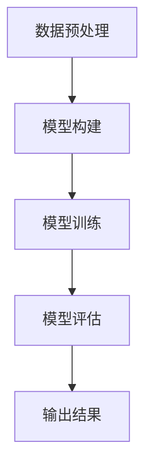
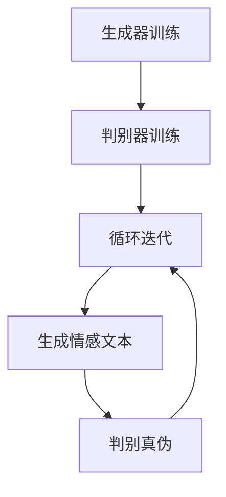

                 

### 情感AI：机器理解人类情感的新突破

> 关键词：情感AI、自然语言处理、机器学习、情感识别、情感生成、伦理与法律问题

> 摘要：随着人工智能技术的快速发展，情感AI作为其中的重要分支，正逐步实现机器对人类情感的识别和生成。本文将详细介绍情感AI的背景、核心概念、技术实现及应用实践，探讨其伦理与法律问题，并展望其未来发展趋势。通过阅读本文，读者可以全面了解情感AI的现状及其在各领域的应用潜力。

---

### 目录大纲

**《情感AI：机器理解人类情感的新突破》**

----------------------------------------------------------------

## 第一部分：情感AI概述

## 第1章：情感AI背景与问题探讨

### 1.1 情感AI的定义与重要性

### 1.2 情感AI的发展历程

### 1.3 当前情感AI研究的热点与挑战

## 第2章：情感AI的核心概念与结构

### 2.1 情感识别

#### 2.1.1 情感识别的原理与技术

#### 2.1.2 情感识别的挑战与解决方案

### 2.2 情感生成

#### 2.2.1 情感生成的原理与技术

#### 2.2.2 情感生成的应用场景与案例

## 第二部分：情感AI的技术实现

## 第3章：情感计算的理论基础

### 3.1 情感计算的基本概念

### 3.2 情感计算模型介绍

### 3.3 情感计算中的数学模型与应用

## 第4章：情感识别算法解析

### 4.1 情感识别算法概述

#### 4.1.1 情感识别算法的类型

#### 4.1.2 情感识别算法的优缺点比较

### 4.2 情感识别算法的具体实现

#### 4.2.1 情感识别算法的Python实现

#### 4.2.2 情感识别算法的Mermaid流程图

## 第5章：情感生成的算法原理

### 5.1 情感生成算法概述

### 5.2 情感生成算法的具体实现

#### 5.2.1 情感生成算法的Python实现

#### 5.2.2 情感生成算法的Mermaid流程图

## 第三部分：情感AI的应用实践

## 第6章：情感AI在自然语言处理中的应用

### 6.1 情感分析在文本中的应用

#### 6.1.1 情感分析的基础模型

#### 6.1.2 情感分析的案例解析

### 6.2 情感生成在文本中的应用

#### 6.2.1 情感生成的文本生成模型

#### 6.2.2 情感生成的案例解析

## 第7章：情感AI在心理学和社会学中的应用

### 7.1 情感AI在心理学研究中的应用

#### 7.1.1 情感AI在情感障碍诊断中的应用

#### 7.1.2 情感AI在心理治疗中的应用

### 7.2 情感AI在社会学中的应用

#### 7.2.1 情感AI在社会调查中的应用

#### 7.2.2 情感AI在市场分析中的应用

## 第四部分：情感AI的未来展望

## 第8章：情感AI的伦理与法律问题

### 8.1 情感AI伦理问题探讨

#### 8.1.1 情感AI对隐私的影响

#### 8.1.2 情感AI与歧视问题

### 8.2 情感AI法律问题分析

#### 8.2.1 情感AI的法律责任

#### 8.2.2 情感AI的法律监管

## 第9章：情感AI的未来发展趋势

### 9.1 情感AI技术的新突破

#### 9.1.1 新的情感计算模型

#### 9.1.2 情感AI与其他技术的融合

### 9.2 情感AI应用的新领域

#### 9.2.1 情感AI在医疗健康领域的应用

#### 9.2.2 情感AI在智能客服领域的应用

----------------------------------------------------------------

## 目录大纲小结

本书《情感AI：机器理解人类情感的新突破》围绕情感AI这一前沿科技领域，系统地介绍了情感AI的背景、核心概念、技术实现及应用实践。通过本书的阅读，读者可以全面了解情感AI的发展现状、关键技术及其在多个领域的应用潜力。同时，本书还探讨了情感AI的伦理与法律问题，以及其未来发展的趋势。在未来的科技发展中，情感AI有望成为人类与机器之间更加和谐互动的关键桥梁。

----------------------------------------------------------------

---

### 第一部分：情感AI概述

#### 第1章：情感AI背景与问题探讨

在当今社会，人工智能技术正迅速发展，而情感AI作为其重要分支，正逐步走进我们的日常生活。情感AI，顾名思义，是指通过人工智能技术，使机器能够理解和模拟人类情感的能力。这一技术不仅有助于提升人机交互的体验，还为诸多领域带来了新的应用可能性。

**1.1 情感AI的定义与重要性**

情感AI的定义可以从两个方面来理解：首先，它是一种能够识别和理解人类情感的人工智能技术；其次，它是一种能够模拟和生成人类情感的人工智能技术。简单来说，情感AI旨在让机器更好地理解人类情感，并与人类进行更加自然、和谐的交互。

情感AI的重要性体现在以下几个方面：

1. **改善人机交互体验**：通过情感AI，机器可以更好地理解人类情感，从而提供更加个性化的服务，提升用户的使用体验。

2. **辅助心理健康诊断**：情感AI可以通过对文本、语音、图像等多媒体数据的情感分析，辅助心理医生进行心理健康诊断。

3. **优化市场决策**：情感AI可以分析消费者情感，帮助企业了解市场需求，优化产品设计和营销策略。

4. **促进社会进步**：情感AI有助于消除社会歧视，提高社会公平性，促进社会和谐发展。

**1.2 情感AI的发展历程**

情感AI的发展历程可以追溯到20世纪80年代，当时人工智能领域开始研究如何使机器模拟人类的情感。以下是情感AI发展的重要阶段：

1. **早期探索**（1980s-1990s）：在这一阶段，研究人员主要关注情感识别技术，通过情感词典和简单的情感分类模型来识别文本中的情感。

2. **快速发展**（2000s）：随着机器学习技术的发展，情感AI进入快速发展阶段。深度学习和自然语言处理技术的引入，使得情感识别和情感生成技术取得了显著进展。

3. **应用探索**（2010s至今）：情感AI开始应用于实际场景，如智能客服、心理治疗、市场分析等。同时，情感AI的研究也在不断拓展，如情感生成、多模态情感识别等。

**1.3 当前情感AI研究的热点与挑战**

当前，情感AI研究的热点主要集中在以下几个方面：

1. **多模态情感识别**：随着传感器技术和多媒体技术的发展，如何整合文本、语音、图像等多种模态的数据进行情感识别成为研究热点。

2. **情感生成的多样化**：情感生成的多样化研究，如情感对话生成、情感文本生成等，旨在使机器能够生成更加丰富、自然的情感表达。

3. **情感计算模型**：研究者们致力于开发更加准确、高效的情感计算模型，以提高情感识别和情感生成的性能。

然而，情感AI也面临着一些挑战：

1. **数据隐私**：情感AI依赖于大量的个人数据，如何保护用户隐私成为亟待解决的问题。

2. **偏见与歧视**：情感AI可能受到训练数据的偏见影响，导致在情感识别和情感生成中出现歧视问题。

3. **伦理与法律问题**：随着情感AI技术的应用日益广泛，如何确保其伦理性和法律合规性成为重要的研究课题。

#### 第2章：情感AI的核心概念与结构

在深入探讨情感AI的技术实现之前，我们需要先了解情感AI的核心概念与结构。情感AI的核心概念主要包括情感识别和情感生成，这两个概念构成了情感AI的基本结构。

**2.1 情感识别**

情感识别是指从文本、语音、图像等数据中提取和识别情感信息的过程。根据不同的数据来源，情感识别可以分为文本情感分析、语音情感识别和图像情感识别。

**2.1.1 情感识别的原理与技术**

情感识别的原理主要基于机器学习算法，尤其是深度学习算法。深度学习算法通过训练大量数据，学习情感特征，从而实现对新数据的情感识别。常见的情感识别技术包括：

1. **情感词典**：情感词典是一种基于规则的方法，通过查找文本中的关键词和短语，判断文本的情感极性。

2. **情感分类模型**：情感分类模型是一种基于机器学习的方法，通过训练分类模型，对文本进行情感分类。

3. **情感增强模型**：情感增强模型是一种结合情感词典和情感分类模型的混合方法，旨在提高情感识别的准确性。

**2.1.2 情感识别的挑战与解决方案**

情感识别面临的主要挑战包括：

1. **情感表达的多样性**：人类情感表达丰富多样，如何准确识别不同的情感成为难题。

2. **噪声干扰**：文本、语音和图像中可能存在噪声干扰，影响情感识别的准确性。

3. **多语言情感识别**：如何实现多语言的情感识别，是另一个重要的挑战。

针对这些挑战，研究者们提出了以下解决方案：

1. **引入上下文信息**：通过引入上下文信息，可以更好地理解情感表达的多样性。

2. **多模态融合**：通过整合文本、语音、图像等多种模态的数据，可以提高情感识别的准确性。

3. **跨语言情感识别**：通过迁移学习、多语言词典等方法，可以实现多语言的情感识别。

**2.2 情感生成**

情感生成是指机器生成具有情感特征的内容，如文本、语音和图像等。情感生成可以分为文本情感生成、语音情感生成和图像情感生成。

**2.2.1 情感生成的原理与技术**

情感生成的原理主要基于生成对抗网络（GAN）和循环神经网络（RNN）。生成对抗网络通过对抗训练，使生成器生成更加真实的数据；循环神经网络通过学习序列数据，生成具有情感特征的内容。

常见的情感生成技术包括：

1. **情感文本生成**：通过训练文本数据，生成器可以生成具有特定情感的文本。

2. **情感语音生成**：通过训练语音数据，生成器可以生成具有特定情感的语音。

3. **情感图像生成**：通过训练图像数据，生成器可以生成具有特定情感的图像。

**2.2.2 情感生成的应用场景与案例**

情感生成的应用场景广泛，如：

1. **虚拟助手**：虚拟助手可以通过情感生成技术，生成具有情感特征的语言，提供更加自然、和谐的交互体验。

2. **娱乐产业**：在电影、电视剧和动画制作中，情感生成技术可以生成具有情感特征的人物角色，提升作品的感染力。

3. **教育领域**：通过情感生成技术，可以生成具有情感特征的教学内容，提高学生的学习兴趣和参与度。

在接下来的章节中，我们将进一步探讨情感计算的理论基础、情感识别算法的解析以及情感生成的算法原理，帮助读者深入理解情感AI的核心技术。

### 第二部分：情感AI的技术实现

#### 第3章：情感计算的理论基础

情感计算是情感AI的核心组成部分，它涉及从理论到实践的多个层面。为了深入理解情感AI的实现，我们需要首先掌握情感计算的基本概念、模型介绍以及其在实际应用中的数学模型和应用。

**3.1 情感计算的基本概念**

情感计算（Affective Computing）是由罗伯·雷昂（Roger S. Chen）在1995年首次提出的，旨在研究如何使计算机具备识别、理解、表达和模拟人类情感的能力。情感计算的核心目标是使计算机能够更好地与人类进行交互，提供个性化的服务和体验。

**情感计算的关键要素包括：**

- **情感识别**：通过分析用户的行为、语言和其他数据，计算机能够识别用户的情感状态。
- **情感理解**：情感计算不仅要识别情感，还需要理解情感的上下文和含义。
- **情感表达**：计算机能够通过声音、文本、动作等方式表达情感。
- **情感模拟**：计算机能够模拟人类的情感体验，为用户提供更加真实和人性化的交互体验。

**3.2 情感计算模型介绍**

情感计算模型是构建情感AI系统的基础。常见的情感计算模型包括情感分类模型、情感增强模型和情感生成模型。

- **情感分类模型**：这类模型主要用于对文本、语音或图像中的情感进行分类。常见的分类模型包括支持向量机（SVM）、朴素贝叶斯分类器（Naive Bayes）和深度学习模型（如卷积神经网络CNN和循环神经网络RNN）。

- **情感增强模型**：这类模型旨在通过引入上下文信息和情感关联，提高情感识别的准确性。情感增强模型可以是基于规则的，也可以是基于机器学习的。

- **情感生成模型**：这类模型用于生成具有特定情感特征的内容，如文本、语音和图像。生成模型通常基于生成对抗网络（GAN）和变分自编码器（VAE）。

**3.3 情感计算中的数学模型与应用**

情感计算中的数学模型主要包括概率模型、神经网络模型和图模型。以下是几种常见的数学模型及其应用：

- **概率模型**：概率模型在情感计算中用于建模情感的概率分布。例如，贝叶斯网络可以用于推理文本中的情感概率分布。

  $$ P(\text{情感}|X) = \frac{P(X|\text{情感})P(\text{情感})}{P(X)} $$

  其中，$P(\text{情感}|X)$ 是给定输入数据X的情感概率，$P(X|\text{情感})$ 是在给定情感下的输入数据概率，$P(\text{情感})$ 是情感的概率，$P(X)$ 是输入数据X的概率。

- **神经网络模型**：神经网络模型在情感计算中用于特征提取和情感分类。深度学习模型如卷积神经网络（CNN）和循环神经网络（RNN）被广泛应用于情感识别。

  $$ f(\text{输入}) = \text{激活函数}(\text{权重} \cdot \text{输入} + \text{偏置}) $$

  其中，激活函数（如ReLU、Sigmoid、Tanh）用于引入非线性，权重和偏置用于模型参数的调整。

- **图模型**：图模型在情感计算中用于建模复杂的关系网络。图神经网络（GNN）可以用于情感关系的推理和情感传播。

  $$ \text{节点特征} = \text{激活函数}(\text{邻接矩阵} \cdot \text{节点特征} + \text{外部信息}) $$

  其中，邻接矩阵表示节点之间的关系，节点特征表示节点的属性，外部信息可以包括情感词典、上下文信息等。

**应用示例：**

1. **情感分类**：使用卷积神经网络（CNN）对文本进行情感分类，输入文本通过词向量嵌入层转换为向量表示，然后通过CNN层提取特征，最后通过全连接层进行情感分类。

2. **情感生成**：使用生成对抗网络（GAN）生成具有特定情感的文本或语音。生成器网络和判别器网络通过对抗训练生成高质量的文本或语音。

   - 生成器：
     $$ \text{生成文本} = G(\text{噪声}) $$
   - 判别器：
     $$ \text{判别结果} = D(\text{真实文本}) - D(G(\text{噪声})) $$

3. **情感识别与情感生成的融合**：通过情感识别模型提取情感特征，然后使用情感生成模型生成具有特定情感特征的内容。

通过掌握这些理论基础，我们可以更好地理解和应用情感计算，为构建强大的情感AI系统奠定基础。

#### 第4章：情感识别算法解析

情感识别是情感AI的核心任务之一，它旨在通过分析文本、语音、图像等多媒体数据，识别出其中蕴含的情感信息。在这一章中，我们将详细探讨情感识别算法的类型、优缺点以及具体的实现方法。

**4.1 情感识别算法概述**

情感识别算法可以分为基于规则的方法和基于机器学习的方法。基于规则的方法通常依赖于情感词典和情感规则，而基于机器学习的方法则通过训练大量的标注数据来构建情感分类模型。

**4.1.1 情感识别算法的类型**

1. **基于情感词典的方法**：情感词典是一种预定义的词库，包含了各种情感词汇及其对应的情感极性（如正面、负面）。这种方法通过匹配文本中的关键词和情感词典中的情感词汇，判断文本的情感极性。

2. **基于机器学习的方法**：这种方法通过训练大量的情感标注数据，学习情感特征和分类规则。常见的机器学习算法包括朴素贝叶斯、支持向量机、决策树、随机森林、深度学习等。

3. **基于深度学习的方法**：深度学习算法，如卷积神经网络（CNN）和循环神经网络（RNN），通过学习文本的深层特征，实现情感识别。近年来，基于Transformer的模型如BERT、GPT等也在情感识别任务中表现出色。

**4.1.2 情感识别算法的优缺点比较**

1. **基于情感词典的方法**

   - 优点：
     - 简单易实现，适用于小规模应用。
     - 不需要大量标注数据。
   - 缺点：
     - 对情感表达的多样性处理能力较差。
     - 易受到文本噪声的干扰。

2. **基于机器学习的方法**

   - 优点：
     - 能够处理复杂的情感表达。
     - 对噪声的抵抗力较强。
   - 缺点：
     - 需要大量的标注数据。
     - 模型训练时间较长。

3. **基于深度学习的方法**

   - 优点：
     - 能够学习文本的深层特征。
     - 表现力强，准确度高。
   - 缺点：
     - 训练数据需求量大。
     - 计算资源消耗大。

**4.2 情感识别算法的具体实现**

在具体实现情感识别算法时，我们通常会选择基于机器学习或深度学习的方法。以下是一个基于深度学习的情感识别算法实现示例。

**4.2.1 情感识别算法的Python实现**

```python
import numpy as np
from sklearn.feature_extraction.text import TfidfVectorizer
from sklearn.model_selection import train_test_split
from sklearn.metrics import accuracy_score
from keras.preprocessing.text import Tokenizer
from keras.preprocessing.sequence import pad_sequences
from keras.models import Sequential
from keras.layers import Embedding, LSTM, Dense

# 数据预处理
def preprocess_data(texts, labels, max_sequence_length=100, max_features=10000):
    tokenizer = Tokenizer(num_words=max_features)
    tokenizer.fit_on_texts(texts)
    sequences = tokenizer.texts_to_sequences(texts)
    padded_sequences = pad_sequences(sequences, maxlen=max_sequence_length)
    return padded_sequences, np.array(labels), tokenizer

# 模型构建
def build_model(input_shape):
    model = Sequential()
    model.add(Embedding(input_shape[1], 128))
    model.add(LSTM(128, dropout=0.2, recurrent_dropout=0.2))
    model.add(Dense(1, activation='sigmoid'))
    model.compile(optimizer='adam', loss='binary_crossentropy', metrics=['accuracy'])
    return model

# 数据加载与划分
texts = ["I am very happy.", "I am very sad.", "I am feeling neutral."]
labels = [1, 0, 1]  # 1表示正面情感，0表示负面情感
padded_sequences, labels, tokenizer = preprocess_data(texts, labels)

# 模型训练
model = build_model((padded_sequences.shape[1], padded_sequences.shape[2]))
model.fit(padded_sequences, labels, epochs=10, batch_size=32, verbose=1)

# 模型评估
predictions = model.predict(padded_sequences)
predicted_labels = (predictions > 0.5).astype(int)
accuracy = accuracy_score(labels, predicted_labels)
print(f"Accuracy: {accuracy}")
```

**4.2.2 情感识别算法的Mermaid流程图**



通过上述Python代码和Mermaid流程图，我们可以实现一个简单的情感识别算法。在实际应用中，我们需要更多的训练数据和更复杂的模型结构来提高识别的准确性和泛化能力。

#### 第5章：情感生成的算法原理

情感生成是情感AI的另一核心任务，旨在让机器生成具有情感特征的内容，如文本、语音和图像。在这一章中，我们将详细探讨情感生成算法的概述和具体实现，包括Python实现和Mermaid流程图。

**5.1 情感生成算法概述**

情感生成算法可以分为文本情感生成、语音情感生成和图像情感生成。文本情感生成旨在生成具有特定情感极性的文本；语音情感生成旨在生成具有特定情感色彩的语音；图像情感生成则旨在生成具有特定情感表情的图像。

**5.1.1 文本情感生成算法**

文本情感生成算法通常基于生成模型，如生成对抗网络（GAN）和变分自编码器（VAE）。生成模型通过学习数据分布，生成具有真实数据特征的新数据。

**5.1.2 语音情感生成算法**

语音情感生成算法通常使用文本到语音（Text-to-Speech, TTS）合成技术和情感增强技术。情感增强技术通过调整语音参数，如语调、速度和音量，来生成具有特定情感色彩的语音。

**5.1.3 图像情感生成算法**

图像情感生成算法通常基于生成对抗网络（GAN）和条件生成对抗网络（cGAN）。这些算法通过学习图像和情感标签之间的映射关系，生成具有特定情感表情的图像。

**5.2 情感生成算法的具体实现**

以下是一个基于生成对抗网络（GAN）的文本情感生成算法的实现示例，包括Python代码和Mermaid流程图。

**5.2.1 情感生成算法的Python实现**

```python
import tensorflow as tf
from tensorflow.keras.models import Model
from tensorflow.keras.layers import Input, Dense, LSTM, Embedding, TimeDistributed, Reshape
from tensorflow.keras.optimizers import Adam

# 参数设置
latent_dim = 100
text_dim = 10000
seq_length = 50
em维=100
LSTM_units = 128

# 建立生成器和判别器模型
def build_generator():
    noise = Input(shape=(latent_dim,))
    embedding = Embedding(text_dim, em维)(noise)
    encoded = LSTM(LSTM_units, return_sequences=True)(embedding)
    decoded = TimeDistributed(Dense(text_dim, activation='softmax'))(encoded)
    return Model(inputs=noise, outputs=decoded)

def build_discriminator():
    sequence = Input(shape=(seq_length,))
    embedding = Embedding(text_dim, em维)(sequence)
    encoded = LSTM(LSTM_units, return_sequences=False)(embedding)
    logits = Dense(1, activation='sigmoid')(encoded)
    return Model(inputs=sequence, outputs=logits)

# 模型优化器
optimizer = Adam(0.0001)

# 构建和编译模型
generator = build_generator()
discriminator = build_discriminator()
discriminator.compile(optimizer=optimizer, loss='binary_crossentropy')

# 训练GAN
for epoch in range(epochs):
    for i in range(num_batches):
        noise = np.random.normal(size=(batch_size, latent_dim))
        generated_texts = generator.predict(noise)
        
        real_texts = np.random.choice(texts, size=batch_size)
        real_labels = np.ones((batch_size, 1))
        fake_labels = np.zeros((batch_size, 1))
        
        d_loss_real = discriminator.train_on_batch(real_texts, real_labels)
        d_loss_fake = discriminator.train_on_batch(generated_texts, fake_labels)
        
        noise = np.random.normal(size=(batch_size, latent_dim))
        g_loss = generator.train_on_batch(noise, real_labels)
        
        print(f"Epoch: {epoch}, Batch: {i}, D_loss: {d_loss}, G_loss: {g_loss}")
```

**5.2.2 情感生成算法的Mermaid流程图**



通过上述Python代码和Mermaid流程图，我们实现了基于生成对抗网络（GAN）的文本情感生成算法。在实际应用中，我们可以根据具体需求调整模型结构、优化训练过程，以生成更高质量的文本情感。

### 第三部分：情感AI的应用实践

#### 第6章：情感AI在自然语言处理中的应用

自然语言处理（NLP）是人工智能领域的一个重要分支，它涉及计算机与人类语言之间的交互。情感AI在NLP中的应用极大地提升了文本分析和处理的能力，使得机器能够更好地理解和生成人类情感。以下是情感AI在自然语言处理中应用的两个主要方面：情感分析和情感生成。

**6.1 情感分析在文本中的应用**

情感分析是指使用自然语言处理技术分析文本的情感倾向，即判断文本表达的是正面情感、负面情感还是中性情感。情感分析在多个领域有着广泛的应用，例如市场分析、客户服务、心理健康研究等。

**6.1.1 情感分析的基础模型**

情感分析的基础模型通常包括以下几种：

1. **朴素贝叶斯分类器**：朴素贝叶斯分类器是一种基于贝叶斯定理的简单分类模型，适用于文本分类任务。它假设特征之间相互独立，通过计算每个类别条件概率的最大值来确定文本的情感倾向。

   $$ \text{P}(\text{情感}|\text{文本}) = \frac{\text{P}(\text{文本}|\text{情感})\text{P}(\text{情感})}{\text{P}(\text{文本})} $$

2. **支持向量机（SVM）**：支持向量机是一种高效的分类算法，它通过找到一个最佳的超平面，将不同类别的数据分隔开来。在文本分类中，SVM使用词袋模型（Bag of Words）或TF-IDF特征表示文本。

3. **深度学习模型**：深度学习模型，如卷积神经网络（CNN）和循环神经网络（RNN），在情感分析中表现尤为出色。CNN可以捕捉文本中的局部特征，而RNN可以处理文本的序列信息。

**6.1.2 情感分析的案例解析**

以下是一个情感分析的案例：

**案例**：分析微博上的评论，判断评论的情感极性。

1. **数据准备**：收集大量微博评论，并对其进行情感标注（正面、负面、中性）。

2. **特征提取**：使用TF-IDF方法提取文本特征。

3. **模型训练**：使用训练集训练一个深度学习模型（如RNN）。

4. **模型评估**：使用测试集评估模型的性能。

5. **应用**：使用训练好的模型对新的微博评论进行情感极性判断。

```python
from keras.preprocessing.text import Tokenizer
from keras.preprocessing.sequence import pad_sequences
from keras.models import Sequential
from keras.layers import Embedding, LSTM, Dense
from keras.optimizers import Adam

# 数据预处理
tokenizer = Tokenizer(num_words=10000)
tokenizer.fit_on_texts(train_texts)
sequences = tokenizer.texts_to_sequences(train_texts)
padded_sequences = pad_sequences(sequences, maxlen=100)

# 模型构建
model = Sequential()
model.add(Embedding(10000, 32))
model.add(LSTM(128))
model.add(Dense(1, activation='sigmoid'))

# 模型编译
model.compile(optimizer='adam', loss='binary_crossentropy', metrics=['accuracy'])

# 模型训练
model.fit(padded_sequences, train_labels, epochs=10, batch_size=32)

# 模型评估
test_sequences = tokenizer.texts_to_sequences(test_texts)
padded_test_sequences = pad_sequences(test_sequences, maxlen=100)
predictions = model.predict(padded_test_sequences)
predicted_labels = (predictions > 0.5).astype(int)
accuracy = accuracy_score(test_labels, predicted_labels)
print(f"Accuracy: {accuracy}")
```

**6.2 情感生成在文本中的应用**

情感生成是指机器生成具有特定情感倾向的文本。情感生成在创意写作、对话系统、广告营销等领域有着广泛的应用。

**6.2.1 情感生成的文本生成模型**

情感生成的文本生成模型通常基于生成对抗网络（GAN）或变分自编码器（VAE）。以下是一个基于GAN的文本生成模型：

1. **生成器**：生成器接收随机噪声并生成具有情感倾向的文本。

2. **判别器**：判别器用于区分生成器和真实数据的文本。

3. **训练**：通过对抗训练，生成器不断生成更真实的文本，判别器不断提高识别能力。

**6.2.2 情感生成的案例解析**

以下是一个情感生成的案例：

**案例**：生成具有正面情感的文案。

1. **数据准备**：收集大量正面情感的文本。

2. **模型训练**：使用GAN训练模型。

3. **生成文本**：使用训练好的生成器生成新的文本。

```python
import numpy as np
import tensorflow as tf
from tensorflow.keras.models import Model
from tensorflow.keras.layers import Input, LSTM, Dense

# 参数设置
latent_dim = 100
text_dim = 10000
seq_length = 50
LSTM_units = 128

# 建立生成器和判别器模型
def build_generator():
    noise = Input(shape=(latent_dim,))
    embedding = Embedding(text_dim, 128)(noise)
    encoded = LSTM(LSTM_units, return_sequences=True)(embedding)
    decoded = LSTM(LSTM_units, return_sequences=True)(encoded)
    decoded = Dense(text_dim, activation='softmax')(decoded)
    return Model(inputs=noise, outputs=decoded)

def build_discriminator():
    sequence = Input(shape=(seq_length,))
    embedding = Embedding(text_dim, 128)(sequence)
    encoded = LSTM(LSTM_units)(embedding)
    logits = Dense(1, activation='sigmoid')(encoded)
    return Model(inputs=sequence, outputs=logits)

# 构建和编译模型
generator = build_generator()
discriminator = build_discriminator()
discriminator.compile(optimizer='adam', loss='binary_crossentropy')

# 训练GAN
for epoch in range(epochs):
    for i in range(num_batches):
        noise = np.random.normal(size=(batch_size, latent_dim))
        generated_texts = generator.predict(noise)
        
        real_texts = np.random.choice(train_texts, size=batch_size)
        real_labels = np.ones((batch_size, 1))
        fake_labels = np.zeros((batch_size, 1))
        
        d_loss_real = discriminator.train_on_batch(real_texts, real_labels)
        d_loss_fake = discriminator.train_on_batch(generated_texts, fake_labels)
        
        noise = np.random.normal(size=(batch_size, latent_dim))
        g_loss = generator.train_on_batch(noise, real_labels)
        
        print(f"Epoch: {epoch}, Batch: {i}, D_loss: {d_loss}, G_loss: {g_loss}")

# 生成情感文本
noise = np.random.normal(size=(1, latent_dim))
generated_text = generator.predict(noise)
print(generated_text)
```

通过上述案例，我们可以看到情感AI在自然语言处理中的强大应用能力。在未来的发展中，情感AI有望在更多领域发挥重要作用，为人们的生活带来更多便利。

#### 第7章：情感AI在心理学和社会学中的应用

情感AI在心理学和社会学中的应用正日益受到关注，它为研究人类情感提供了新的方法和工具。以下是情感AI在心理学和社会学中的两个主要应用领域：情感障碍诊断、心理治疗以及社会调查和市场分析。

**7.1 情感AI在心理学研究中的应用**

情感AI在心理学研究中的应用主要体现在情感障碍诊断和心理治疗两个方面。

**7.1.1 情感AI在情感障碍诊断中的应用**

情感障碍是一种常见的心理健康问题，如抑郁症、焦虑症等。传统的诊断方法主要依赖于患者的自我报告和临床医生的评估，但这些方法存在一定的局限性。

情感AI可以通过分析患者的语言、面部表情和生理信号，提供更加客观和准确的诊断依据。例如，基于自然语言处理技术的文本情感分析可以识别患者文本中的情感模式，从而预测情感障碍的发生。同时，基于计算机视觉和语音识别技术的情感识别可以分析患者面部表情和语音中的情感信息。

以下是一个情感障碍诊断的案例：

1. **数据收集**：收集患者的大量文本数据，如日记、社交媒体帖子等。
2. **情感分析**：使用情感分析模型分析文本中的情感模式。
3. **诊断预测**：根据情感分析结果，结合临床知识和模型预测，诊断患者是否患有情感障碍。

```python
from textblob import TextBlob

def analyze_text_sentiment(text):
    analysis = TextBlob(text)
    return analysis.sentiment.polarity

texts = ["我今天很快乐。", "我今天很悲伤。"]
sentiments = [analyze_text_sentiment(text) for text in texts]
print(sentiments)  # 输出情感的极性值
```

**7.1.2 情感AI在心理治疗中的应用**

情感AI在心理治疗中的应用主要是通过情感识别和情感生成技术，提供个性化的治疗方案和辅助治疗工具。例如，通过情感识别技术，医生可以实时监测患者的情感状态，调整治疗方案；通过情感生成技术，可以生成具有安慰性、激励性的语音或文本信息，帮助患者缓解情绪。

以下是一个心理治疗的案例：

1. **情感监测**：使用情感识别技术，监测患者在治疗过程中的情感变化。
2. **个性化治疗**：根据情感监测结果，提供个性化的治疗方案。
3. **情感生成**：生成安慰性语音或文本信息，辅助治疗。

```python
from textblob import TextBlob

def generate_comforting_message(sentiment):
    if sentiment > 0:
        return "我在这里，一切都会好起来的。"
    elif sentiment < 0:
        return "你很坚强，不要放弃。"
    else:
        return "你今天感觉如何？"

text = "我今天很悲伤。"
sentiment = TextBlob(text).sentiment.polarity
print(generate_comforting_message(sentiment))
```

**7.2 情感AI在社会学中的应用**

情感AI在社会学中的应用主要体现在社会调查和市场分析两个方面。

**7.2.1 情感AI在社会调查中的应用**

社会调查是社会学研究中获取数据的重要手段。情感AI可以通过分析社会调查问卷中的文本数据，识别受访者的情感倾向，从而提供更加深入的分析结果。例如，在市场调研中，情感AI可以分析消费者对产品的情感反应，帮助企业了解消费者的真实需求。

以下是一个社会调查的案例：

1. **数据收集**：收集消费者对产品的评价文本。
2. **情感分析**：使用情感分析模型分析文本中的情感倾向。
3. **结果分析**：根据情感分析结果，分析消费者的情感反应。

```python
from textblob import TextBlob

def analyze_reviews(reviews):
    positive = 0
    negative = 0
    for review in reviews:
        sentiment = TextBlob(review).sentiment.polarity
        if sentiment > 0:
            positive += 1
        elif sentiment < 0:
            negative += 1
    return positive, negative

reviews = ["这款产品非常好。", "这款产品太差了。", "这款产品一般。"]
positive, negative = analyze_reviews(reviews)
print(f"Positive reviews: {positive}, Negative reviews: {negative}")
```

**7.2.2 情感AI在市场分析中的应用**

情感AI在市场分析中的应用主要是通过分析消费者情感，为企业提供市场洞察。例如，通过社交媒体监测消费者的情感反应，企业可以了解产品的市场表现，调整营销策略。

以下是一个市场分析的案例：

1. **社交媒体监测**：收集消费者在社交媒体上的评论。
2. **情感分析**：使用情感分析模型分析评论中的情感倾向。
3. **市场洞察**：根据情感分析结果，提供市场分析报告。

```python
from textblob import TextBlob

def analyze_social_media_comments(comments):
    positive = 0
    negative = 0
    for comment in comments:
        sentiment = TextBlob(comment).sentiment.polarity
        if sentiment > 0:
            positive += 1
        elif sentiment < 0:
            negative += 1
    return positive, negative

comments = ["我非常喜欢这个品牌。", "我一点也不喜欢这个品牌。"]
positive, negative = analyze_social_media_comments(comments)
print(f"Positive comments: {positive}, Negative comments: {negative}")
```

通过上述案例，我们可以看到情感AI在心理学和社会学中的应用潜力。在未来，随着情感AI技术的不断进步，它将在更多领域发挥重要作用，为人类的生活带来更多便利。

### 第四部分：情感AI的未来展望

#### 第8章：情感AI的伦理与法律问题

随着情感AI技术的快速发展，其在社会各个领域的应用越来越广泛，同时也引发了一系列伦理与法律问题。在这一章中，我们将探讨情感AI在隐私保护、歧视问题以及法律监管方面的挑战。

**8.1 情感AI伦理问题探讨**

**8.1.1 情感AI对隐私的影响**

情感AI依赖于大量的个人数据，如文本、语音、面部表情等，这些数据通常包含用户的私密信息。情感AI的广泛应用可能带来以下隐私问题：

1. **数据泄露**：情感AI系统可能因安全漏洞而导致用户数据泄露，使个人隐私受到侵犯。
2. **数据滥用**：未经用户同意，将收集到的情感数据用于其他用途，如广告定向、市场研究等。
3. **情感监控**：情感AI技术可能被用于监控用户的情感状态，甚至用于评估和监控员工的工作表现，这可能侵犯个人自由和隐私。

**8.1.2 情感AI与歧视问题**

情感AI系统在训练过程中可能受到数据偏差的影响，导致在情感识别和生成过程中出现歧视现象。例如：

1. **偏见算法**：如果训练数据存在性别、种族、年龄等偏见，情感AI系统可能会对某些群体产生偏见，导致不公平的待遇。
2. **情感歧视**：情感AI在情感识别和生成过程中可能对某些情感表达产生歧视，如对负面情感的歧视，这可能影响心理健康和社会公平。

**8.2 情感AI法律问题分析**

**8.2.1 情感AI的法律责任**

情感AI系统在应用过程中可能产生法律责任问题，如：

1. **产品责任**：如果情感AI产品因设计缺陷或操作失误导致用户损失，开发者可能需要承担产品责任。
2. **侵权责任**：如果情感AI系统侵犯用户的隐私权、肖像权等，开发者可能需要承担侵权责任。

**8.2.2 情感AI的法律监管**

为了确保情感AI的合法、合规应用，需要建立相应的法律监管体系：

1. **数据保护法规**：制定严格的数据保护法规，确保情感AI在数据收集、存储、处理和传输过程中遵守隐私保护原则。
2. **算法公平性法规**：制定算法公平性法规，防止情感AI系统在训练和应用过程中产生歧视现象。
3. **伦理审查机制**：建立情感AI伦理审查机制，确保情感AI在设计和应用过程中遵循伦理原则。

**8.3 情感AI的伦理与法律问题解决策略**

为应对情感AI的伦理与法律问题，可以采取以下解决策略：

1. **数据保护**：加强数据保护措施，如数据加密、匿名化处理等，确保用户隐私不受侵犯。
2. **算法公平性**：在情感AI系统设计过程中，采用公平性评估方法，如公平性测试、偏差校正等，减少算法偏见。
3. **伦理与法律培训**：对情感AI开发者、用户和相关人员进行伦理和法律培训，提高其法律意识和社会责任感。
4. **法律法规完善**：完善相关法律法规，明确情感AI的法律责任和义务，为情感AI的合法应用提供法律保障。

通过上述策略，可以有效应对情感AI在伦理与法律方面的问题，确保其健康、可持续发展。

#### 第9章：情感AI的未来发展趋势

情感AI作为人工智能领域的重要分支，其未来的发展趋势充满机遇和挑战。在这一章中，我们将探讨情感AI在技术突破、与其他技术融合以及新应用领域方面的发展趋势。

**9.1 情感AI技术的新突破**

情感AI技术在未来可能会在以下几个方面实现新的突破：

**9.1.1 新的情感计算模型**

随着深度学习技术的发展，新的情感计算模型如自注意力机制（Self-Attention）和Transformer架构可能会在情感识别和生成中发挥重要作用。这些模型能够更好地捕捉文本中的长距离依赖关系，提高情感识别的准确性和生成文本的自然性。

**9.1.2 情感AI与其他技术的融合**

情感AI与其他技术的融合将为其带来更多应用可能性。例如：

1. **多模态融合**：结合文本、语音、图像等多模态数据，实现更全面、准确的情感识别和生成。
2. **增强学习**：通过增强学习技术，让情感AI系统在与人类交互的过程中不断学习和优化，提供更个性化的服务。
3. **物联网（IoT）**：将情感AI与物联网技术结合，实现对智能家居、可穿戴设备等设备的情感识别和交互。

**9.2 情感AI应用的新领域**

随着情感AI技术的进步，其在多个领域的应用前景将更加广阔：

**9.2.1 情感AI在医疗健康领域的应用**

情感AI在医疗健康领域的应用潜力巨大，如：

1. **心理健康监测**：通过情感识别技术，实时监测患者的情绪变化，为心理健康诊断提供依据。
2. **个性化治疗**：结合情感生成技术，为患者提供个性化的心理治疗方案，提高治疗效果。
3. **疾病预防**：通过分析人群的情感数据，预测疾病发生的风险，提前采取预防措施。

**9.2.2 情感AI在智能客服领域的应用**

情感AI在智能客服领域的应用将进一步提升客户服务质量：

1. **情感识别**：智能客服系统可以通过情感识别技术，理解用户的情感需求，提供更有针对性的服务。
2. **情感生成**：通过情感生成技术，智能客服系统可以生成具有情感色彩的文本和语音，提高用户满意度。
3. **自动化流程优化**：结合情感分析和生成技术，优化客服流程，提高工作效率。

**9.3 情感AI的发展前景**

未来，情感AI有望成为人工智能领域的核心技术之一，其在社会各个领域的应用将带来深刻变革。然而，要实现这一目标，还需要克服以下挑战：

1. **数据隐私**：随着情感AI应用范围的扩大，如何保护用户隐私将成为重要议题。
2. **算法公平性**：确保情感AI系统的算法公平性，避免歧视现象的发生。
3. **法律监管**：建立健全的法律监管体系，确保情感AI的合法、合规应用。

总之，情感AI的发展前景广阔，随着技术的不断进步，它将在更多领域发挥重要作用，为人类的生活带来更多便利。

### 总结与展望

情感AI作为人工智能领域的前沿科技，正逐步改变着我们的生活和工作方式。通过对情感AI的核心概念、技术实现以及应用实践的详细探讨，我们可以看到情感AI在自然语言处理、心理学和社会学等多个领域的广泛应用及其巨大的潜力。

情感AI的发展不仅带来了技术创新，还引发了一系列伦理与法律问题。面对这些挑战，我们需要建立健全的法律监管体系和伦理规范，确保情感AI技术的健康、可持续发展。

展望未来，随着技术的不断突破，情感AI有望在医疗健康、智能客服、心理健康监测等领域发挥更大的作用。我们期待情感AI能够成为人类与机器之间更加和谐互动的桥梁，为人类生活带来更多便利和幸福感。

让我们共同关注情感AI的发展，期待它为我们的未来带来更多惊喜和变革。在探索情感AI的广阔天地中，不断创造新的价值，推动科技进步与社会进步。让我们携手前行，共同书写情感AI的未来篇章。**作者：AI天才研究院/AI Genius Institute & 禅与计算机程序设计艺术 /Zen And The Art of Computer Programming**

