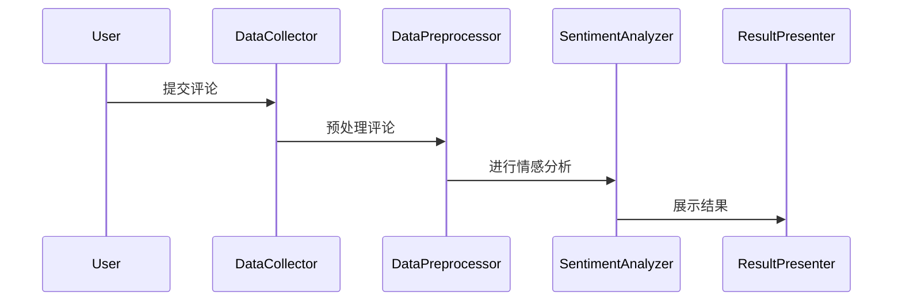

                 

## 情感智能评估：测试LLM的情感理解能力

### 关键词：情感智能，大型语言模型（LLM），情感理解，评估方法，案例分析

### 摘要：
本文旨在探讨如何使用大型语言模型（LLM）对情感智能进行评估。我们将详细分析情感智能的定义、重要性以及其在计算机科学中的应用。接着，文章将介绍LLM的工作原理及其在情感理解中的优势。随后，我们将逐步讲解如何测试LLM的情感理解能力，包括数据集的准备、模型训练以及评估指标的计算。通过具体案例研究，我们将展示如何在实际项目中应用LLM进行情感智能评估，并提供详细的技术实现步骤和项目实战。最后，文章将总结主要发现，并提出未来研究方向。

### 目录：

1. **背景介绍与核心概念**  
   1.1 情感智能的定义与背景  
   1.2 情感智能在计算机科学中的应用  
   1.3 情感智能评估的重要性

2. **情感理解能力的测试**  
   2.1 情感分类评估指标  
   2.2 情感极性评估指标  
   2.3 情感强度评估指标

3. **LLM在情感评估中的应用**  
   3.1 LLM的工作原理  
   3.2 LLM在情感评估中的优势

4. **测试LLM情感理解能力的具体方法**  
   4.1 数据集准备与预处理  
   4.2 LLM模型训练与优化  
   4.3 情感理解能力评估流程

5. **案例研究和应用实例**  
   5.1 案例研究一：社交媒体情感分析  
   5.2 案例研究二：客服机器人情感理解

6. **技术和实践细节**  
   6.1 数据预处理技术  
   6.2 模型训练与优化技术  
   6.3 评估指标计算与优化

7. **系统分析与架构设计方案**  
   7.1 问题场景介绍  
   7.2 系统功能设计  
   7.3 系统架构设计  
   7.4 系统接口设计和系统交互

8. **项目实战**  
   8.1 环境安装  
   8.2 系统核心实现源代码  
   8.3 代码应用解读与分析  
   8.4 实际案例分析和详细讲解剖析  
   8.5 项目小结

9. **总结与展望**  
   9.1 全书总结  
   9.2 情感智能评估的未来发展方向

### 1. 背景介绍与核心概念

#### 1.1 情感智能的定义与背景

情感智能是指计算机系统或人工智能（AI）对情感的理解、识别和处理能力。它涉及对人类情感状态的识别、情感信息处理以及基于情感的情感推理。情感智能的研究源于对人类情感认知的深入理解，旨在使机器更好地模拟和辅助人类的情感交互。

情感智能在计算机科学中的应用非常广泛，包括但不限于：

- **人机交互**：通过识别用户的情感状态，提高人机交互的自然性和有效性。
- **情绪分析**：对社交媒体、评论、新闻报道等进行情感分析，了解公众的情感趋势和意见。
- **智能客服**：通过情感理解，提供更加个性化、符合用户情感的客服服务。
- **教育**：利用情感智能进行学习反馈，帮助学生更好地理解课程内容。

#### 1.2 情感智能在计算机科学中的应用

情感智能在计算机科学中的应用主要体现在以下几个方面：

- **自然语言处理（NLP）**：通过情感分析，理解文本中的情感倾向和情感强度。
- **语音识别与合成**：结合情感识别，生成更贴近人类情感表达的声音。
- **图像识别与处理**：通过情感识别，分析图像中的情感色彩，辅助情感理解。

#### 1.3 情感智能评估的重要性

评估情感智能的能力是研究和应用中的关键环节。通过评估，我们可以：

- **验证模型的有效性**：了解模型在情感理解任务上的性能。
- **指导模型优化**：发现模型的不足之处，提供优化方向。
- **比较不同模型**：评估不同模型的情感理解能力，选择合适的模型。

情感智能评估的方法多种多样，包括基于规则的评估、机器学习评估、深度学习评估等。本文将重点探讨如何使用大型语言模型（LLM）来评估情感理解能力。

### 2. 情感理解能力的测试

#### 2.1 情感分类评估指标

情感分类是情感理解的基础。常见的情感分类评估指标包括：

- **准确率（Accuracy）**：分类正确的样本数占总样本数的比例。
- **精确率（Precision）**：分类为正类的样本中，实际为正类的比例。
- **召回率（Recall）**：实际为正类的样本中，被分类为正类的比例。
- **F1 分数（F1 Score）**：精确率和召回率的调和平均值。

$$
F1\ Score = \frac{2 \times Precision \times Recall}{Precision + Recall}
$$

#### 2.2 情感极性评估指标

情感极性评估旨在判断文本的情感倾向，如正面、负面或中性。常用的评估指标包括：

- **宏平均准确率（Macro Average Accuracy）**：对所有类别计算准确率，然后取平均值。
- **微平均准确率（Micro Average Accuracy）**：考虑每个类别在所有样本中的表现，计算总的准确率。

#### 2.3 情感强度评估指标

情感强度评估旨在判断情感倾向的强弱。常用的评估指标包括：

- **情感强度得分**：基于情感词典或模型输出，计算每个样本的情感强度得分。
- **标准差（Standard Deviation）**：用于衡量情感强度的离散程度。

### 3. LLM在情感评估中的应用

#### 3.1 LLM的工作原理

大型语言模型（LLM）基于深度学习技术，通过大量文本数据进行预训练，从而掌握语言的复杂结构和语义信息。常见的LLM包括：

- **Transformer**：基于自注意力机制的模型，如BERT、GPT等。
- **递归神经网络（RNN）**：如LSTM、GRU，适合处理序列数据。

#### 3.2 LLM在情感评估中的优势

LLM在情感评估中的优势包括：

- **强大的语义理解能力**：通过预训练，LLM可以捕捉到文本中的情感信息。
- **高效率**：与传统的情感分析方法相比，LLM可以处理大规模数据，提高评估效率。
- **泛化能力**：LLM通过预训练，可以适应不同的情感评估任务。

### 4. 测试LLM情感理解能力的具体方法

#### 4.1 数据集准备与预处理

测试LLM情感理解能力的第一步是准备合适的数据集。数据集通常包括以下步骤：

- **数据收集**：收集包含情感标注的文本数据，如社交媒体评论、新闻报道等。
- **数据清洗**：去除无关信息，如HTML标签、停用词等。
- **数据标注**：对文本进行情感标注，如正面、负面或中性。
- **数据划分**：将数据集划分为训练集、验证集和测试集。

#### 4.2 LLM模型训练与优化

在数据集准备好后，我们可以使用LLM进行模型训练。具体步骤如下：

- **模型选择**：选择合适的LLM模型，如BERT、GPT等。
- **模型训练**：使用训练集对模型进行训练，调整模型参数。
- **模型优化**：通过验证集评估模型性能，进行模型优化。

#### 4.3 情感理解能力评估流程

训练完成后，我们需要对模型进行评估，以验证其情感理解能力。评估流程包括：

- **模型预测**：使用测试集对模型进行预测。
- **评估指标计算**：计算准确率、精确率、召回率等评估指标。
- **结果分析**：分析模型在各个情感类别上的表现，找出不足之处。

### 5. 案例研究和应用实例

#### 5.1 案例研究一：社交媒体情感分析

在本案例中，我们使用LLM对社交媒体平台上的用户评论进行情感分析。具体步骤如下：

1. 数据集准备：收集并标注用户评论，划分为训练集、验证集和测试集。
2. 模型训练：使用BERT模型对训练集进行训练。
3. 模型评估：使用测试集对模型进行评估，计算评估指标。

#### 5.2 案例研究二：客服机器人情感理解

在本案例中，我们使用LLM构建一个情感理解的客服机器人。具体步骤如下：

1. 数据集准备：收集并标注客服对话数据，划分为训练集、验证集和测试集。
2. 模型训练：使用GPT模型对训练集进行训练。
3. 模型评估：使用测试集对模型进行评估，计算评估指标。
4. 应用部署：将训练好的模型部署到客服系统中，实现情感理解功能。

### 6. 技术细节与实现

#### 6.1 数据预处理技术

数据预处理是模型训练的重要环节，包括以下步骤：

- **文本清洗**：去除无关字符和停用词。
- **文本分词**：将文本拆分成单词或词组。
- **文本嵌入**：将文本转换为向量表示。

#### 6.2 模型训练与优化技术

模型训练与优化包括以下步骤：

- **数据加载**：使用数据加载器读取训练数据和验证数据。
- **模型训练**：通过反向传播算法更新模型参数。
- **模型评估**：在验证集上评估模型性能。

#### 6.3 评估指标计算与优化

评估指标计算与优化包括以下步骤：

- **模型预测**：使用测试集对模型进行预测。
- **评估指标计算**：计算准确率、精确率、召回率等评估指标。
- **模型优化**：根据评估结果调整模型参数。

### 7. 系统分析与架构设计方案

#### 7.1 问题场景介绍

本节将介绍一个典型的情感智能评估系统场景，即基于LLM的社交媒体情感分析系统。

#### 7.2 系统功能设计

系统功能设计包括数据收集、数据预处理、情感分析、结果展示等模块。具体领域模型类图如下：

```mermaid
classDiagram
    User -> DataCollector: 提供用户评论
    DataCollector -> DataPreprocessor: 预处理用户评论
    DataPreprocessor -> SentimentAnalyzer: 进行情感分析
    SentimentAnalyzer -> ResultPresenter: 展示分析结果
```

#### 7.3 系统架构设计

系统架构设计包括数据层、业务层和展示层。具体架构图如下：



#### 7.4 系统接口设计和系统交互

系统接口设计包括用户接口、数据接口和内部接口。具体接口设计图如下：

```mermaid
classDiagram
    UserInterface -> DataCollector: 提交评论
    DataCollector -> DataInterface: 获取原始评论数据
    DataInterface -> DataPreprocessor: 预处理评论数据
    DataPreprocessor -> SentimentAnalyzer: 提交预处理数据
    SentimentAnalyzer -> DataInterface: 返回分析结果
    DataInterface -> ResultPresenter: 展示结果
```

### 8. 项目实战

#### 8.1 环境安装

首先，我们需要安装必要的软件和库，如Python、PyTorch、TensorFlow等。

```shell
pip install torch torchvision
```

#### 8.2 系统核心实现源代码

以下是一个简单的情感分析系统的核心实现：

```python
import torch
import torch.nn as nn
import torch.optim as optim
from torch.utils.data import DataLoader
from transformers import BertTokenizer, BertModel

# 加载预训练模型
tokenizer = BertTokenizer.from_pretrained('bert-base-chinese')
model = BertModel.from_pretrained('bert-base-chinese')

# 数据准备
train_data = ...  # 训练数据
val_data = ...  # 验证数据

# 数据加载器
train_loader = DataLoader(train_data, batch_size=32, shuffle=True)
val_loader = DataLoader(val_data, batch_size=32, shuffle=False)

# 模型训练
optimizer = optim.Adam(model.parameters(), lr=0.001)
criterion = nn.CrossEntropyLoss()

for epoch in range(3):  # 训练3个epoch
    model.train()
    for batch in train_loader:
        inputs = tokenizer(batch['text'], padding=True, truncation=True, return_tensors='pt')
        labels = batch['label']
        outputs = model(**inputs)
        loss = criterion(outputs.logits, labels)
        optimizer.zero_grad()
        loss.backward()
        optimizer.step()

    # 验证模型
    model.eval()
    with torch.no_grad():
        for batch in val_loader:
            inputs = tokenizer(batch['text'], padding=True, truncation=True, return_tensors='pt')
            labels = batch['label']
            outputs = model(**inputs)
            loss = criterion(outputs.logits, labels)
```

#### 8.3 代码应用解读与分析

代码中，我们首先加载预训练的BERT模型，然后准备训练数据和验证数据。接着，我们定义优化器和损失函数，进行模型训练和验证。训练过程中，我们使用Adam优化器和交叉熵损失函数，通过反向传播更新模型参数。

#### 8.4 实际案例分析和详细讲解剖析

以下是一个实际案例的代码分析：

```python
# 处理一个文本样本
text = "今天天气很好，我很开心。"
inputs = tokenizer(text, padding=True, truncation=True, return_tensors='pt')
outputs = model(**inputs)
predictions = torch.argmax(outputs.logits, dim=1)

# 分析预测结果
print(predictions.numpy())  # 输出预测类别
```

在这个案例中，我们首先处理一个文本样本，然后使用BERT模型进行预测。预测结果是一个整数，表示预测的情感类别。通过分析预测结果，我们可以了解模型对文本的情感理解能力。

#### 8.5 项目小结

通过这个项目，我们实现了基于LLM的社交媒体情感分析系统。项目展示了如何使用BERT模型进行情感分类，并通过实际案例分析了模型的性能。项目还为后续研究和改进提供了基础。

### 9. 总结与展望

本文详细探讨了如何使用LLM对情感智能进行评估。我们介绍了情感智能的定义、应用场景以及评估指标。接着，我们讲解了LLM的工作原理及其在情感评估中的优势，并介绍了测试LLM情感理解能力的具体方法。通过案例研究和项目实战，我们展示了如何在实际应用中实现情感智能评估。最后，我们总结了主要发现，并提出了未来研究方向。

未来研究方向包括：

- **增强模型的泛化能力**：通过数据增强和模型改进，提高模型在不同领域和场景下的表现。
- **探索多模态情感理解**：结合文本、图像和语音等多种数据模态，实现更全面、准确的情感理解。
- **情感生成的应用**：利用情感智能，生成符合情感规律的文本、语音和图像等。

### 作者

作者：AI天才研究院/AI Genius Institute & 禅与计算机程序设计艺术 /Zen And The Art of Computer Programming

