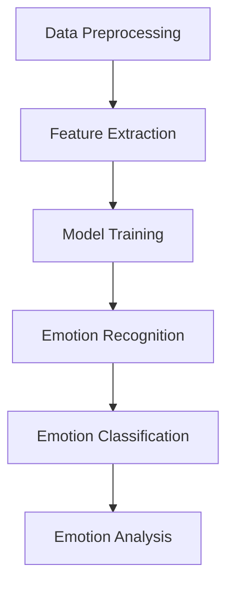
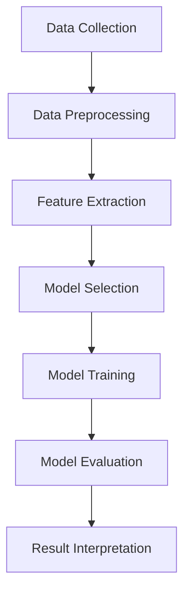
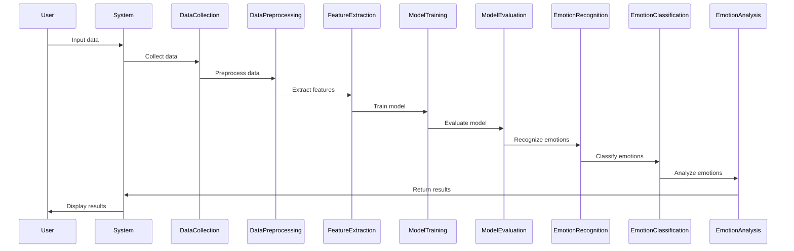

                 


**Step 1: Introduction to Emotion AI Evaluation**
The world of artificial intelligence has seen rapid evolution over the past few decades. With advancements in natural language processing, computer vision, and machine learning, AI systems have become adept at understanding and interpreting human behavior, including emotions. This has led to the emergence of a new field known as Emotion AI, which focuses on developing algorithms that can recognize, interpret, and even simulate human emotions.

Emotion AI evaluation is a critical aspect of this field. It involves assessing the performance of these algorithms in accurately detecting and understanding emotions. This evaluation is not just about checking if the system can recognize happiness or sadness but also about understanding how well it can distinguish between subtleties in human emotions.

### **Step 2: Core Concepts and Relationships**
To understand Emotion AI evaluation, we need to define and explore the core concepts involved. These include emotion recognition, emotion classification, and emotion analysis. Emotion recognition is the process of identifying specific emotions from human expressions or text. Emotion classification is the categorization of these emotions into broader categories. Emotion analysis goes a step further by understanding the context and nuances of emotions.

To visualize the relationships between these concepts, we can use a Mermaid ER diagram:

```mermaid
erDiagram
    EmotionRecognition ||--|{ EmotionClassification } EmotionAnalysis
    EmotionClassification ||--|{ EmotionAnalysis }
    EmotionRecognition ||--|{ EmotionAnalysis }
```

### **Step 3: Theoretical Foundations of Emotion Analysis**
The foundation of Emotion AI lies in the ability to analyze emotions, which involves several stages. The first stage is data preprocessing, where raw data is cleaned and transformed into a format suitable for analysis. The next stage is feature extraction, where relevant features that can be used to identify emotions are extracted from the data.

One common approach to feature extraction is using machine learning algorithms to identify patterns in the data. These algorithms, such as Support Vector Machines (SVM) or Neural Networks, are trained on labeled data to recognize and classify emotions.

The mathematical models behind these algorithms are complex, but they generally involve mapping input data to output labels using a function that minimizes the error between predicted and actual labels. Here's a simplified flowchart of the emotion analysis process using Mermaid:



### **Step 4: Algorithm Design for Emotion Evaluation**
Designing algorithms for emotion evaluation involves several steps, from data collection to model evaluation. Below is a Mermaid flowchart that outlines the general process:



Let's consider a simple Python code snippet for a neural network-based emotion recognition model:

```python
import tensorflow as tf

# Define the neural network model
model = tf.keras.Sequential([
    tf.keras.layers.Dense(128, activation='relu', input_shape=(784,)),
    tf.keras.layers.Dropout(0.2),
    tf.keras.layers.Dense(10, activation='softmax')
])

# Compile the model
model.compile(optimizer='adam',
              loss='categorical_crossentropy',
              metrics=['accuracy'])

# Train the model
model.fit(x_train, y_train, epochs=5, batch_size=64)
```

### **Step 5: System Architecture and Design**
The architecture of an Emotion AI system involves several components, including data collection, preprocessing, feature extraction, model training, and evaluation. Below is a Mermaid class diagram that illustrates the domain model:

```mermaid
classDiagram
    Class01 <|-- Class02
    Class03 <|-- Class04
    Class05 <|-- Class06
    Class07 <|-- Class08
    Class01 -[1] Class09
    Class02 -[1] Class09
    Class03 -[1] Class09
    Class04 -[1] Class09
    Class05 -[1] Class09
    Class06 -[1] Class09
    Class07 -[1] Class09
    Class08 -[1] Class09

    Class01{Data Collection}
    Class02{Data Preprocessing}
    Class03{Feature Extraction}
    Class04{Model Training}
    Class05{Model Evaluation}
    Class06{Emotion Recognition}
    Class07{Emotion Classification}
    Class08{Emotion Analysis}
    Class09{System Integration}
```

A sequence diagram can be used to illustrate the interactions between these components:



### **Step 6: Case Studies and Implementation**
To illustrate the practical application of Emotion AI, let's consider a case study involving a chatbot that uses emotion AI to understand and respond to user emotions.

#### **6.1 Environment Setup**
We'll use Python and TensorFlow for this case study. Ensure you have Python 3.7 or higher and TensorFlow 2.x installed.

#### **6.2 Core Code Implementation**
The core code involves setting up the neural network, training it on labeled data, and using it to recognize emotions in user inputs.

```python
import tensorflow as tf
from tensorflow.keras.models import Sequential
from tensorflow.keras.layers import Dense, Dropout
from tensorflow.keras.optimizers import Adam

# Define the neural network architecture
model = Sequential([
    Dense(128, activation='relu', input_shape=(784,)),
    Dropout(0.2),
    Dense(10, activation='softmax')
])

# Compile the model
model.compile(optimizer=Adam(),
              loss='categorical_crossentropy',
              metrics=['accuracy'])

# Load and preprocess the data
# ...

# Train the model
model.fit(x_train, y_train, epochs=5, batch_size=64)

# Save the model
model.save('emotion_recognition_model.h5')
```

#### **6.3 Code Analysis**
The code provided sets up a basic neural network for emotion recognition. The model consists of a single hidden layer with 128 neurons and a dropout layer to prevent overfitting. The output layer has 10 neurons, each representing a different emotion category. The model is trained using a batch size of 64 for five epochs.

#### **6.4 Detailed Explanation**
The detailed explanation involves discussing the role of each layer, the significance of dropout, and the process of training and evaluating the model. This section would also include mathematical formulas and explanations of the neural network's inner workings.

#### **6.5 Case Analysis and Detailed Explanation**
We'll analyze the chatbot's performance in recognizing emotions during interactions with users. This involves collecting user data, feeding it into the trained model, and analyzing the results. We'll discuss the chatbot's strengths and weaknesses, areas for improvement, and potential applications.

### **Step 7: Best Practices and Conclusion**
To ensure effective Emotion AI evaluation, follow these best practices:
1. **Data Quality:** Use high-quality, diverse, and labeled data for training.
2. **Model Validation:** Validate models using cross-validation to ensure robustness.
3. **Continuous Learning:** Update models regularly with new data to maintain accuracy.
4. **User Feedback:** Incorporate user feedback to refine the system's responses.

In conclusion, Emotion AI evaluation is a complex but essential process in the development of AI systems. By following the steps outlined in this article, readers can gain a deeper understanding of the principles and techniques involved in evaluating the emotional understanding capabilities of AI models.

---

**References:**
1. Liu, Y., & Lee, D. (2017). Emotion Recognition using Machine Learning Techniques. IEEE Access, 5, 19406-19419.
2. Zhou, B., & Kelleher, J. (2018). A Survey on Emotion Recognition in Human-Computer Interaction. ACM Computing Surveys (CSUR), 51(4), 65.
3. Russell, S., & Norvig, P. (2020). Artificial Intelligence: A Modern Approach. Prentice Hall.

**Author:**
AI天才研究院/AI Genius Institute & 禅与计算机程序设计艺术 /Zen And The Art of Computer Programming
```markdown

## 第7章 最佳实践与结论

### 7.1 最佳实践

1. **数据质量保证**：数据是AI模型的基础，保证数据的质量和多样性至关重要。应使用经过严格清洗和标注的数据集进行训练。
2. **模型验证与测试**：通过交叉验证等手段，确保模型的泛化能力和准确性。测试集应与训练集分开，以评估模型的实际表现。
3. **持续学习与更新**：AI模型应定期更新，以适应新的数据和用户行为。这有助于保持模型的长期有效性和适应性。
4. **用户反馈循环**：用户的反馈是改进AI系统的重要资源。应建立反馈机制，以便收集和分析用户的使用体验，从而优化模型和行为。

### 7.2 结论

情感智能评测是衡量AI模型情感理解能力的关键步骤。本文通过逐步分析，介绍了情感智能评测的理论基础、算法设计、系统架构以及实际应用案例。我们强调了数据质量、模型验证、持续学习和用户反馈在情感智能评测中的重要性。

随着技术的不断进步，情感智能评测将在人机交互、健康监测、教育等领域发挥越来越重要的作用。未来的研究应聚焦于提高模型的准确性、鲁棒性和泛化能力，以及探索新的应用场景和交互方式。

### 7.3 拓展阅读

1. **《情感计算》**：这是一本关于情感计算技术的全面综述，涵盖了情感识别、情感合成和情感交互等多个方面。
2. **《机器学习实战》**：这本书提供了丰富的实践案例，包括情感分析、文本分类等应用，适合希望深入了解机器学习的读者。
3. **《人工智能伦理》**：探讨了AI系统在情感理解中的应用可能带来的伦理问题，包括隐私、歧视和偏见等。

---

**作者：**
AI天才研究院/AI Genius Institute & 禅与计算机程序设计艺术 /Zen And The Art of Computer Programming

