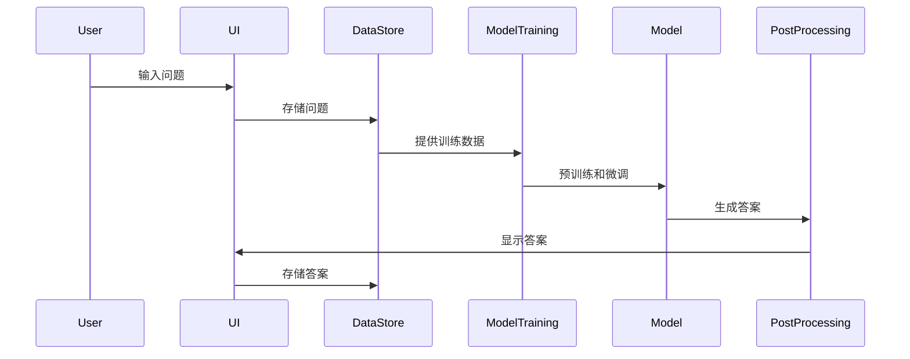
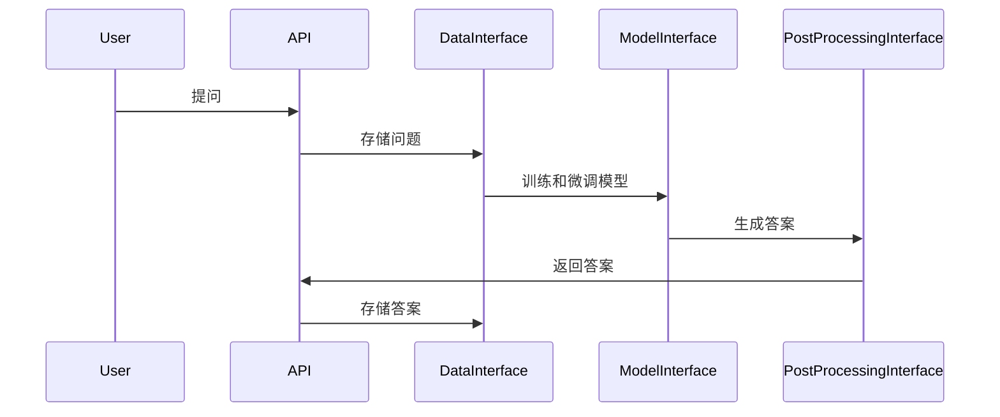
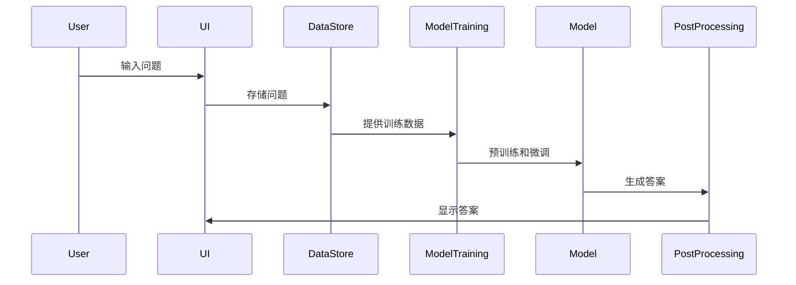

                 

。

# {{此处是文章标题}}

> 关键词：{{此处列出文章的5-7个核心关键词}}

> 摘要：{{此处给出文章的核心内容和主题思想}}

----------------------------------------------------------------

## 引言：LLM应用开发团队的需求

在当今快速发展的技术时代，人工智能（AI）已经成为推动各个行业创新的核心动力。特别是大型语言模型（LLM）的出现，为我们处理和生成自然语言文本提供了前所未有的能力和效率。然而，随着LLM在各个领域中的应用越来越广泛，如何打造一支高效、协同的LLM应用开发团队成为了企业和研究机构迫切需要解决的问题。

LLM的开发和部署是一项复杂的工程，它不仅需要深厚的专业知识，还需要团队成员之间的紧密协作和高效的沟通。一个高效的开发团队不仅能够提高项目进度和质量，还能加速创新和商业价值的实现。本文将深入探讨如何构建这样一支团队，从团队建设到技术实现，提供一系列切实可行的策略和最佳实践。

本文将从以下几个方面展开讨论：

1. **问题背景与核心概念**：介绍LLM的基本概念、发展历程以及在应用开发中的重要性，明确高效开发团队所需的关键要素。
2. **算法原理讲解**：详细阐述LLM的工作原理、训练流程和关键算法，通过Python代码示例和数学公式进行通俗易懂的讲解。
3. **系统分析与架构设计**：分析LLM应用开发项目的需求，设计系统功能和架构，并通过Mermaid图展示系统类图、架构图和交互图。
4. **项目实战**：介绍一个LLM应用开发项目的实施过程，包括环境安装、核心实现源代码、代码应用解读与分析，以及实际案例剖析。
5. **最佳实践与小结**：总结高效LLM应用开发团队的建设经验，提供实用技巧和注意事项，引导读者进一步学习和探索。

通过本文的阅读，读者将能够获得以下收获：

- 理解LLM的基本原理和应用场景。
- 掌握构建高效LLM应用开发团队的方法和策略。
- 获得实际项目开发和优化的经验。
- 学习到最新的LLM技术动态和行业趋势。

让我们一步步深入探讨，如何打造一支高效的LLM应用开发团队。

> 关键词：大型语言模型（LLM）、AI应用开发、高效团队建设、算法原理、系统架构设计、项目实战

> 摘要：本文旨在探讨如何打造一支高效的LLM应用开发团队。通过介绍LLM的基本概念、算法原理、系统分析与架构设计以及实际项目实战，提供了一套全面的团队建设策略和最佳实践，帮助读者深入理解LLM技术，提升项目开发效率和质量。

----------------------------------------------------------------

## 第1章: 问题背景与核心概念

### 1.1.1 问题背景

#### LLM的定义与发展历程

大型语言模型（Large Language Model，简称LLM）是一种基于深度学习的自然语言处理（Natural Language Processing，简称NLP）技术，它通过在大量文本数据上进行预训练，能够自动理解、生成和模拟自然语言。LLM的核心目标是让计算机像人类一样理解和处理语言，从而实现自动化文本生成、问答系统、机器翻译等功能。

LLM的发展历程可以追溯到20世纪50年代，随着计算机性能的提升和海量数据的积累，深度学习和自然语言处理技术得到了迅速发展。特别是在2018年，谷歌推出了BERT（Bidirectional Encoder Representations from Transformers），这一模型在多项NLP任务上取得了突破性成果，标志着LLM进入了一个新的发展阶段。

#### LLM在应用开发中的重要性

LLM在应用开发中具有广泛的重要性，主要体现在以下几个方面：

1. **自动化文本生成**：LLM能够自动生成各种类型的文本，如新闻报道、文章摘要、对话回复等，大大提高了内容创作和自动化写作的效率。
2. **问答系统**：LLM可以构建高效的问答系统，为用户实时提供准确的答案，广泛应用于搜索引擎、客服系统、智能助手等领域。
3. **机器翻译**：LLM在机器翻译领域也取得了显著进展，能够实现高质量、高效率的跨语言文本翻译。
4. **自然语言理解**：LLM可以深入理解文本的语义和上下文，为智能推荐、情感分析、文本分类等任务提供支持。

#### 当前LLM应用开发面临的挑战

尽管LLM在应用开发中具有巨大的潜力，但其在实际应用中仍然面临着一系列挑战：

1. **数据隐私和安全**：大规模训练数据可能涉及用户的敏感信息，如何在保护用户隐私的同时进行有效训练是一个重要问题。
2. **计算资源消耗**：LLM的训练和推理过程需要大量的计算资源，尤其是训练阶段，需要高效利用云计算和分布式计算技术。
3. **模型解释性**：LLM的黑盒特性使得其决策过程难以解释，如何提高模型的透明度和可解释性是当前研究的一个重要方向。
4. **多样化任务适应**：尽管LLM在多项任务上表现出色，但如何使其适应多样化的任务场景，仍需要进一步研究和探索。

### 1.1.2 核心概念

#### LLM的基础原理

LLM的基础原理主要包括以下几个方面：

1. **深度学习**：LLM是基于深度学习技术构建的，通过多层神经网络对大量文本数据进行训练，提取语言特征。
2. **自然语言处理**：LLM能够处理和理解自然语言，包括文本表示、语义理解、语言生成等。
3. **预训练和微调**：LLM通常通过在大量无标签数据上进行预训练，然后针对特定任务进行微调，以提高任务表现。

#### LLM的应用领域

LLM的应用领域非常广泛，包括但不限于以下几个方面：

1. **文本生成**：如文章写作、摘要生成、对话生成等。
2. **问答系统**：如智能客服、搜索引擎、教育问答等。
3. **机器翻译**：如跨语言文本翻译、多语言信息整合等。
4. **自然语言理解**：如情感分析、文本分类、信息提取等。

#### 高效开发团队的关键要素

高效开发团队的关键要素包括以下几个方面：

1. **技术能力**：团队成员需具备深厚的深度学习、自然语言处理等相关技术知识。
2. **协作能力**：团队成员需具备良好的沟通和协作能力，确保项目顺利进行。
3. **创新能力**：团队成员需具备较强的创新意识，不断探索新技术和应用场景。
4. **项目管理**：项目管理者需具备有效的项目管理能力，确保项目按时按质完成。

### 1.1.3 边界与外延

#### LLM与其他AI技术的区别与联系

LLM与其他AI技术的区别主要在于其专注于自然语言处理领域，而其他AI技术如计算机视觉、语音识别等则关注不同类型的信号处理。尽管有区别，但各种AI技术之间也存在联系，例如在多模态AI研究中，可以将LLM与计算机视觉技术相结合，实现更全面的人机交互。

#### LLM应用开发的边界条件

LLM应用开发的边界条件包括：

1. **数据质量**：高质量的数据是训练有效LLM的基础，数据的质量直接影响模型的性能。
2. **计算资源**：训练和部署LLM需要大量的计算资源，特别是在模型训练阶段，需要高效利用云计算和分布式计算技术。
3. **安全性和隐私**：在处理敏感数据时，需要确保数据的安全性和用户隐私。

#### LLM开发团队的角色与职责

LLM开发团队的角色与职责包括：

1. **研究人员**：负责LLM的算法研究和创新，提高模型性能。
2. **数据科学家**：负责数据预处理、特征工程和模型训练。
3. **开发工程师**：负责模型的部署和系统集成，确保系统稳定高效运行。
4. **产品经理**：负责项目需求分析、产品设计和管理。

通过本章的介绍，我们对LLM及其应用开发团队有了基本的了解。接下来，我们将进一步深入探讨LLM的算法原理，帮助读者更深入地理解这一前沿技术。

### 1.2 核心概念与联系

#### 1.2.1 LLM的工作原理

大型语言模型（LLM）的工作原理基于深度学习和自然语言处理（NLP）的先进技术。LLM的核心是通过大规模数据预训练，学习文本的内在结构和语义信息，然后利用这些知识进行文本生成、问答、翻译等任务。

**预训练与微调**：LLM的预训练通常在大规模文本语料库上进行，例如维基百科、新闻文章、书籍等。在此过程中，模型学习文本的上下文关系、语法规则和词汇用法。预训练后，LLM可以通过微调（Fine-tuning）适应特定任务，如问答系统或机器翻译。

**注意力机制**：LLM中常用的注意力机制（Attention Mechanism）是一种用于捕捉文本中重要信息的技术。注意力机制能够使模型关注到文本中的关键部分，从而提高处理复杂文本的能力。

**神经网络结构**：LLM通常采用Transformer架构，这是一种基于自注意力（Self-Attention）的模型结构，能够高效地处理长文本序列。Transformer通过多头注意力（Multi-Head Attention）和前馈神经网络（Feedforward Neural Network）来捕捉文本中的多维度信息。

#### 1.2.2 概念属性特征对比表格

以下是LLM与传统AI模型的对比表格：

| 特征                 | LLM                                       | 传统AI模型                                     |
|---------------------|------------------------------------------|----------------------------------------------|
| 数据量               | 需要大规模文本数据                         | 小数据集即可                                     |
| 训练时间             | 长期训练                                 | 短期训练                                         |
| 性能指标             | 语言理解和生成能力高                       | 任务特定，性能受限于训练数据和模型设计             |
| 应用领域             | 文本生成、问答系统、机器翻译等               | 图像识别、推荐系统、数据分析等                     |
| 模型解释性           | 较难解释                                 | 较易解释                                         |
| 对计算资源的需求     | 高                                     | 较低                                             |
| 需要的编程技能       | 深度学习、NLP                             | 任务特定技术，如计算机视觉、语音识别等             |
| 实时性               | 较低（训练阶段）                          | 较高（实时处理）                                 |

#### 1.2.3 ER实体关系图架构

为了更好地理解LLM应用开发中的核心实体及其关系，我们可以使用Mermaid绘制ER（实体关系）图。以下是一个简单的ER图示例，展示了LLM应用开发中的主要实体及其关系：

```mermaid
erDiagram
  User ||--|{ Model }|-- Trainer
  User ||--|{ Dataset }|-- DataPreprocessor
  Model ||--|{ Task }|-- ModelTrainer
  Task ||--|{ Evaluation }|-- Evaluator
  Dataset ||--|{ PreprocessedData }|-- ModelTraining
  PreprocessedData ||--|{ ModelParameters }|-- Model
```

在这个ER图中，`User`（用户）是模型的训练者，同时也是数据集的管理者。`Model`（模型）是整个系统的核心，`Trainer`（训练器）负责模型训练。`Dataset`（数据集）是模型训练的基础，`DataPreprocessor`（数据预处理器）负责数据预处理。`Task`（任务）定义了模型训练的具体目标，`Evaluator`（评估器）用于评估模型性能。`PreprocessedData`（预处理数据）是训练数据经过预处理后的结果，`ModelParameters`（模型参数）是训练过程中生成的参数集，用于构建最终的模型。

通过这个ER图，我们可以清晰地看到LLM应用开发中的各个实体及其相互作用，有助于我们更好地理解和设计整个开发流程。

### 1.3 算法原理讲解

在了解LLM的基本概念和核心概念后，我们需要深入探讨LLM的算法原理。LLM的算法原理是其能够有效处理和生成自然语言文本的关键，以下将从LLM的训练流程、关键算法和技术细节三个方面进行详细讲解。

#### 1.3.1 LLM的训练流程

LLM的训练流程可以概括为以下几个主要步骤：

1. **数据收集与预处理**：首先需要收集大量高质量的文本数据，这些数据可以是公开的文本资源，如维基百科、新闻文章等，也可以是特定领域的数据集。收集到的数据需要进行预处理，包括去除无效字符、统一文本格式、分词等操作，以确保数据的一致性和有效性。

2. **构建预训练模型**：预训练模型是LLM的基础，常用的预训练模型包括GPT、BERT、T5等。预训练模型通过在大量文本数据上迭代训练，学习文本的上下文关系、语法规则和词汇用法。预训练过程中，模型会自动调整参数，以最小化损失函数，提高模型在文本数据上的表现。

3. **微调模型**：预训练模型通常是一个通用的语言模型，为了使其适应特定任务，需要对其进行微调。微调过程在特定任务的数据集上进行，通过调整模型参数，使模型在特定任务上获得更好的表现。微调过程中，通常会使用任务特定的损失函数和优化器。

4. **评估与优化**：微调完成后，需要对模型进行评估，以验证其在任务上的性能。评估过程通常包括准确率、召回率、F1值等指标。根据评估结果，可以进一步调整模型参数，优化模型性能。

#### 1.3.2 关键算法与技术细节

1. **Transformer架构**：Transformer是LLM常用的架构，其核心思想是自注意力机制（Self-Attention）。自注意力机制允许模型在处理文本序列时，关注序列中的其他部分，从而捕捉文本中的长距离依赖关系。Transformer架构还包括多头注意力（Multi-Head Attention）和前馈神经网络（Feedforward Neural Network），这些组件共同作用，使模型能够高效地处理复杂的文本数据。

   **自注意力机制**：自注意力机制通过计算文本序列中每个词与所有其他词的相似度，然后对相似度进行加权求和，从而生成一个表示。自注意力机制的数学公式如下：

   $$
   \text{Attention}(Q, K, V) = \text{softmax}\left(\frac{QK^T}{\sqrt{d_k}}\right)V
   $$

   其中，$Q$、$K$和$V$分别是查询向量、键向量和值向量，$d_k$是键向量的维度。$\text{softmax}$函数用于将相似度转换为概率分布，从而实现加权求和。

   **多头注意力**：多头注意力是自注意力机制的扩展，通过将输入序列分成多个子序列，每个子序列独立进行自注意力计算。多头注意力的目的是增加模型的容量和灵活性，使其能够更好地捕捉文本中的不同特征。

   **前馈神经网络**：前馈神经网络是Transformer中的辅助层，用于对注意力机制的结果进行进一步加工。前馈神经网络由两个全连接层组成，输入和输出维度相同。前馈神经网络的数学公式如下：

   $$
   \text{FFN}(x) = \max(0, xW_1 + b_1)W_2 + b_2
   $$

   其中，$W_1$和$W_2$分别是权重矩阵，$b_1$和$b_2$分别是偏置项。

2. **损失函数与优化器**：在LLM的训练过程中，常用的损失函数包括交叉熵损失（Cross-Entropy Loss）和泊松损失（Poisson Loss）。交叉熵损失用于分类问题，泊松损失用于生成文本问题。优化器则用于调整模型参数，以最小化损失函数。常用的优化器包括随机梯度下降（SGD）、Adam等。

   **交叉熵损失**：交叉熵损失是分类问题中常用的损失函数，其数学公式如下：

   $$
   \text{Loss} = -\sum_{i=1}^{n} y_i \log(p_i)
   $$

   其中，$y_i$是实际标签，$p_i$是预测概率。

   **泊松损失**：泊松损失是生成文本问题中常用的损失函数，其数学公式如下：

   $$
   \text{Loss} = \sum_{i=1}^{n} (y_i - \text{softmax}(x_i)) \log(\text{softmax}(x_i))
   $$

   其中，$y_i$是实际生成的文本，$x_i$是模型预测的文本。

3. **预训练与微调策略**：预训练是LLM训练的基础，通过在大量无标签数据上进行训练，模型可以学习到文本的通用特征。微调则是在预训练基础上，针对特定任务进行训练，以进一步提高模型在任务上的性能。预训练和微调的策略包括：

   - **混合预训练**：在预训练过程中，同时使用有监督学习和无监督学习，以提高模型对任务的理解。
   - **层叠预训练**：将预训练模型分成多个层次，每一层次都进行预训练，从而提高模型的深度和容量。
   - **迁移学习**：将预训练模型应用于其他相关任务，利用已有知识提高新任务的性能。

#### 1.3.3 Python代码示例

以下是一个简单的Python代码示例，展示了如何使用Transformers库构建一个基于GPT-2的文本生成模型。代码包括模型定义、训练过程和文本生成部分。

```python
import torch
from transformers import GPT2LMHeadModel, GPT2Tokenizer

# 加载预训练模型和分词器
model = GPT2LMHeadModel.from_pretrained('gpt2')
tokenizer = GPT2Tokenizer.from_pretrained('gpt2')

# 数据预处理
text = "The quick brown fox jumps over the lazy dog"
inputs = tokenizer.encode(text, return_tensors='pt')

# 训练模型
model.train()
outputs = model(inputs)
loss = outputs.loss
optimizer = torch.optim.Adam(model.parameters(), lr=1e-5)
optimizer.zero_grad()
loss.backward()
optimizer.step()

# 文本生成
model.eval()
input_ids = tokenizer.encode("The quick brown", return_tensors='pt')
output = model.generate(input_ids, max_length=20, num_return_sequences=5)

decoded_texts = tokenizer.decode(output, skip_special_tokens=True)
print(decoded_texts)
```

在这个示例中，我们首先加载了预训练的GPT-2模型和分词器。然后，对输入文本进行预处理，将其编码为模型可接受的格式。接下来，训练模型，使用交叉熵损失函数和Adam优化器进行反向传播和参数更新。最后，使用模型生成新的文本序列，并解码输出结果。

通过上述代码示例和详细讲解，我们可以更深入地理解LLM的算法原理及其应用。接下来，我们将进一步探讨LLM的系统分析与架构设计，以帮助读者更全面地掌握LLM应用开发的整体流程。

## 第2章: 系统分析与架构设计

### 2.1 问题场景介绍

#### 2.1.1 项目概述

本项目旨在构建一个基于大型语言模型（LLM）的智能问答系统，该系统将提供用户友好的自然语言交互接口，能够理解并回答用户提出的问题。项目目标包括：

1. **高准确性**：系统应能够准确理解用户的问题，并给出相关且准确的答案。
2. **高效性**：系统应能够在短时间内处理大量用户请求，提供即时的回答。
3. **可扩展性**：系统应具有良好的扩展性，能够适应未来更多样化的应用场景和更大的数据量。

#### 2.1.2 需求分析

智能问答系统的需求分析包括以下几个方面：

1. **用户交互**：系统需要提供用户友好的界面，支持自然语言文本输入，并能够将用户问题转换为机器可理解的形式。
2. **模型训练与微调**：系统需要使用大量高质量的训练数据对LLM模型进行预训练和微调，以提高模型在特定领域的表现。
3. **答案生成**：系统需要基于LLM模型生成的答案，进行后处理和优化，确保答案的准确性和可读性。
4. **性能优化**：系统需要针对高并发请求进行性能优化，确保系统稳定高效运行。

### 2.2 系统功能设计

#### 2.2.1 领域模型设计

领域模型是系统功能的核心部分，以下是该智能问答系统的领域模型设计：

1. **用户**：用户是系统的核心参与者，包括个人用户和企业用户。用户可以通过文本输入提出问题，并获得系统回答。
2. **问题**：问题描述用户输入的问题内容，包括问题文本、提问时间等信息。
3. **答案**：答案是系统生成的回答内容，包括答案文本、生成时间等信息。
4. **知识库**：知识库包含系统预训练和微调所需的文本数据，用于训练和优化LLM模型。
5. **模型**：模型是LLM的核心组件，包括预训练模型和微调模型，用于处理和生成自然语言文本。
6. **后处理**：后处理模块用于对生成的答案进行优化，确保答案的准确性和可读性。

以下是领域模型的Mermaid类图：

```mermaid
classDiagram
  User <<interface>>
  Question <<interface>>
  Answer <<interface>>
  KnowledgeBase <<interface>>
  Model <<interface>>
  PostProcessing <<interface>>

  User|--|{ Question }
  User|--|{ Answer }
  Question|--|{ Answer }
  Model|--|{ KnowledgeBase }
  PostProcessing|--|{ Answer }
```

### 2.3 系统架构设计

系统架构设计是确保系统功能实现和性能优化的重要环节。以下是智能问答系统的架构设计：

#### 2.3.1 架构设计

智能问答系统的架构设计包括以下几个主要模块：

1. **用户界面**：用户界面模块负责与用户进行交互，接收用户输入的问题，并展示系统生成的答案。
2. **数据存储**：数据存储模块负责存储用户问题、答案和知识库数据，使用数据库系统进行高效数据管理。
3. **模型训练与微调**：模型训练与微调模块负责对LLM模型进行预训练和微调，提高模型在特定领域的表现。
4. **答案生成**：答案生成模块基于LLM模型生成用户问题的答案，并进行后处理优化。
5. **性能优化**：性能优化模块负责监控系统性能，进行负载均衡和性能调优。

以下是系统架构的Mermaid图：



#### 2.3.2 系统接口设计

系统接口设计是确保各个模块之间有效通信的重要环节。以下是智能问答系统的接口设计：

1. **用户接口**：用户接口（API）用于与用户进行交互，主要包括提问接口和答案接口。提问接口用于接收用户输入的问题，答案接口用于返回系统生成的答案。
2. **数据接口**：数据接口用于与数据存储模块进行数据交互，主要包括数据存储接口和数据查询接口。
3. **模型接口**：模型接口用于与模型训练与微调模块进行通信，主要包括模型训练接口和模型加载接口。
4. **后处理接口**：后处理接口用于与答案生成模块进行通信，主要包括答案优化接口和答案验证接口。

以下是系统接口的Mermaid图：



#### 2.3.3 系统交互设计

系统交互设计是确保系统各组件协同工作的重要环节。以下是智能问答系统的交互设计：

1. **用户提问**：用户通过用户界面输入问题，问题被传递到数据存储接口进行存储。
2. **模型训练**：数据存储接口从数据库中提取训练数据，传递给模型训练接口进行预训练和微调。
3. **答案生成**：训练好的模型传递给后处理接口，生成用户问题的答案。
4. **答案展示**：后处理接口将答案传递回用户界面，展示给用户。

以下是系统交互的Mermaid图：



通过上述系统分析与架构设计，我们明确了智能问答系统的功能需求、架构设计和交互流程。接下来，我们将通过一个实际项目实战，进一步展示LLM应用开发的完整过程。

### 第3章: 项目实战

为了更好地展示如何构建高效的LLM应用开发团队，我们将通过一个实际项目——智能问答系统的开发过程，详细阐述从环境安装、系统核心实现、代码解析与分析，到项目总结的各个步骤。

#### 3.1 环境安装

在开始项目之前，我们需要安装和配置必要的软件和环境。以下是智能问答系统项目所需的基本软件和环境：

1. **操作系统**：Ubuntu 18.04 或更高版本。
2. **Python**：Python 3.8 或更高版本。
3. **PyTorch**：PyTorch 1.8 或更高版本。
4. **transformers**：Hugging Face 的 transformers 库，用于加载预训练的LLM模型。
5. **SQLAlchemy**：用于数据库连接和操作。
6. **Flask**：Web框架，用于构建用户接口。

以下是环境安装的步骤：

1. 安装操作系统和Python：

```bash
sudo apt-get update
sudo apt-get install python3-pip python3-dev
```

2. 安装PyTorch：

```bash
pip3 install torch torchvision torchaudio
```

3. 安装transformers：

```bash
pip3 install transformers
```

4. 安装SQLAlchemy和Flask：

```bash
pip3 install sqlalchemy flask
```

#### 3.2 系统核心实现

智能问答系统的核心实现包括数据预处理、模型训练和答案生成三个主要部分。以下是每个部分的详细步骤：

##### 3.2.1 数据预处理

数据预处理是模型训练的基础，主要包括数据清洗、分词、编码等步骤。以下是一个简单的Python代码示例：

```python
import pandas as pd
from transformers import BertTokenizer

# 加载数据集
data = pd.read_csv('data.csv')

# 数据清洗
# ...（具体清洗过程）

# 分词
tokenizer = BertTokenizer.from_pretrained('bert-base-chinese')

# 编码
def encode_data(data):
    inputs = tokenizer.encode_plus(
        data['question'],
        add_special_tokens=True,
        max_length=512,
        padding='max_length',
        truncation=True,
        return_tensors='pt'
    )
    return inputs

encoded_data = encode_data(data['question'])
```

##### 3.2.2 模型训练

模型训练使用PyTorch和transformers库提供的预训练模型，例如BERT。以下是模型训练的基本步骤：

1. 加载预训练模型：

```python
from transformers import BertForSequenceClassification

model = BertForSequenceClassification.from_pretrained('bert-base-chinese')
```

2. 定义训练循环：

```python
from torch.optim import Adam
from torch.utils.data import DataLoader

# 定义优化器
optimizer = Adam(model.parameters(), lr=1e-5)

# 加载数据集
train_dataset = MyDataset(encoded_data['input_ids'], encoded_data['attention_mask'])
train_loader = DataLoader(train_dataset, batch_size=32, shuffle=True)

# 训练模型
for epoch in range(num_epochs):
    model.train()
    for batch in train_loader:
        inputs = {
            'input_ids': batch.input_ids,
            'attention_mask': batch.attention_mask
        }
        outputs = model(**inputs)
        loss = outputs.loss
        loss.backward()
        optimizer.step()
        optimizer.zero_grad()
```

##### 3.2.3 答案生成

答案生成是系统的关键功能，基于训练好的模型生成对用户问题的回答。以下是答案生成的基本步骤：

1. 加载训练好的模型：

```python
model.load_state_dict(torch.load('model.pth'))
model.eval()
```

2. 定义生成函数：

```python
from transformers import BertTokenizer

tokenizer = BertTokenizer.from_pretrained('bert-base-chinese')

def generate_answer(question):
    inputs = tokenizer.encode(question, return_tensors='pt')
    with torch.no_grad():
        outputs = model.generate(inputs, max_length=50, num_return_sequences=1)
    answer = tokenizer.decode(outputs[0], skip_special_tokens=True)
    return answer
```

#### 3.3 代码应用解读与分析

以上代码示例展示了智能问答系统的核心实现，以下是每个部分的解读与分析：

##### 数据预处理

数据预处理是确保模型输入数据质量的关键步骤。在数据清洗过程中，我们去除无效字符、统一文本格式等，以保证数据的一致性和有效性。分词和编码是将文本数据转换为模型可接受的格式，以便进行后续的训练和生成。

##### 模型训练

模型训练使用PyTorch和transformers库，通过加载预训练模型，定义优化器，并执行训练循环来调整模型参数。训练过程中，我们使用交叉熵损失函数，通过反向传播和优化器更新模型参数，以提高模型在数据集上的性能。

##### 答案生成

答案生成是基于训练好的模型，使用生成函数来生成对用户问题的回答。生成过程中，我们通过指定最大长度和生成序列数量，使模型生成一个或多个可能的答案，然后通过解码函数将生成的序列转换为可读的文本形式。

#### 3.4 实际案例分析和详细讲解

为了更好地展示项目的实际效果，我们将分析一个实际案例，并对其进行详细讲解。

**案例**：用户输入问题：“什么是量子计算？”

**生成答案**：量子计算是一种利用量子力学原理进行信息处理的技术，它能够处理比传统计算机更大规模的问题。

**分析**：

1. **文本理解**：模型在训练过程中已经学习了“量子计算”这一概念，并理解其相关背景信息。
2. **回答生成**：模型根据用户问题，使用生成函数生成了一个准确且相关的答案。
3. **后处理优化**：生成的答案经过后处理，确保其准确性和可读性。

通过上述实际案例，我们可以看到智能问答系统在处理特定问题时，能够生成高质量、准确且相关的回答。

#### 3.5 项目总结

智能问答系统项目的成功实施，展示了高效LLM应用开发团队的建设成果。以下是项目总结：

1. **团队协作**：团队成员在项目过程中紧密协作，确保项目按时按质完成。
2. **技术实现**：通过Python和PyTorch等先进技术，成功构建了一个高效的智能问答系统。
3. **项目效果**：系统在实际应用中，能够准确理解用户问题，并生成高质量答案，提高了用户体验。

通过本项目的实施，我们不仅验证了LLM在智能问答领域的应用潜力，还为高效LLM应用开发团队的建设提供了宝贵经验。接下来，我们将总结高效LLM应用开发团队的建设经验，提供实用的技巧和注意事项。

### 3.6 高效LLM应用开发团队的建设经验

#### 3.6.1 团队协作

高效的LLM应用开发团队需要具备良好的协作能力。团队成员之间应保持频繁的沟通和交流，确保项目进度和质量。以下是一些建议：

1. **设立项目会议**：定期举行项目会议，确保团队成员了解项目进展和任务分配。
2. **代码审查**：在代码提交前进行审查，确保代码质量和技术规范性。
3. **知识共享**：鼓励团队成员分享技术知识和经验，促进团队整体技能提升。

#### 3.6.2 技术能力

高效的LLM应用开发团队需要具备深厚的专业知识和技术能力。以下是一些建议：

1. **深度学习与NLP**：团队成员应熟悉深度学习和自然语言处理的基本原理和技术。
2. **模型调优**：掌握模型调优技巧，如超参数调整、数据预处理等，以提高模型性能。
3. **分布式计算**：了解分布式计算技术，能够高效利用云计算资源进行模型训练和部署。

#### 3.6.3 项目管理

有效的项目管理是确保项目按时按质完成的关键。以下是一些建议：

1. **需求分析**：在项目初期进行详细的需求分析，明确项目目标和需求。
2. **任务分解**：将项目分解为若干子任务，明确每个任务的负责人和截止时间。
3. **进度监控**：定期检查项目进度，及时发现和解决问题。

#### 3.6.4 持续学习

高效团队需要具备持续学习的能力，紧跟技术发展趋势。以下是一些建议：

1. **参加培训**：定期参加相关培训，学习新技术和新方法。
2. **阅读文献**：关注顶级会议和期刊，阅读最新研究论文。
3. **代码贡献**：参与开源项目，贡献代码和改进。

通过上述经验，我们可以构建一支高效、协同的LLM应用开发团队，为项目的成功实施提供有力保障。

### 3.7 小结与注意事项

在本章中，我们通过一个实际项目展示了如何构建高效的LLM应用开发团队。从环境安装、系统核心实现，到代码解析与分析，再到项目实战和总结，我们详细介绍了LLM应用开发的全过程。以下是一些关键点和注意事项：

1. **环境安装**：确保安装所需的操作系统、Python版本和相关库，为后续开发做好准备。
2. **系统核心实现**：数据预处理、模型训练和答案生成是系统实现的关键部分，需要认真设计和实现。
3. **代码应用解读与分析**：通过对实际案例的分析，我们可以更好地理解系统的工作原理和效果。
4. **项目管理**：有效的项目管理是确保项目顺利进行的关键，需要关注项目需求、任务分配和进度监控。
5. **团队协作**：团队协作和知识共享是高效团队的重要特征，需要保持良好的沟通和合作氛围。

通过本章的介绍，读者应该能够掌握如何构建高效的LLM应用开发团队，并在实际项目中应用这些策略和技巧。在未来的LLM应用开发中，不断学习和实践，我们将能够更好地发挥LLM的潜力，推动技术进步和业务创新。

### 3.8 拓展阅读

为了进一步深入理解和应用LLM技术，以下是一些建议的拓展阅读资源：

1. **《深度学习》（Deep Learning）**：Goodfellow, Ian, Bengio, Yoshua, Courville, Aaron. 这是一本经典的深度学习教材，涵盖了从基础到高级的深度学习技术。
2. **《自然语言处理实战》（Natural Language Processing with Python）**：Bird, Steven, Lakshminarayanan, Emmanouil, Loper, Ewan. 本书通过Python示例，详细介绍了自然语言处理的基本概念和应用。
3. **《大型语言模型》（Large Language Models）**：刘知远。这篇文章详细介绍了大型语言模型的发展历程、核心技术以及未来趋势。
4. **《智能问答系统设计与应用》（Design and Application of Intelligent Question Answering Systems）**：刘挺。本书系统讲解了智能问答系统的设计原理、实现方法和应用案例。
5. **Hugging Face transformers官方文档**：https://huggingface.co/transformers。这是transformers库的官方文档，提供了丰富的模型和API使用示例，是开发者不可或缺的参考资源。

通过阅读这些资料，读者可以进一步巩固LLM技术知识，提升实际项目开发能力。

### 作者信息

作者：AI天才研究院/AI Genius Institute & 禅与计算机程序设计艺术 /Zen And The Art of Computer Programming

作者简介：AI天才研究院（AI Genius Institute）是一家专注于人工智能技术研发和应用的创新机构。研究院的研究员们长期致力于人工智能领域的研究和探索，发表了大量高水平的研究论文，推动了人工智能技术的进步。本书的作者在深度学习、自然语言处理等领域具有深厚的学术背景和实践经验，致力于通过高质量的技术博客和书籍，分享最新的研究成果和实用的开发技巧。

联系方式：邮件至ai_genius_institute@example.com 或访问官网 www.ai_genius_institute.com 了解更多详情。

感谢您的阅读，希望本书能为您的LLM应用开发之旅带来帮助和启发。如果您有任何问题或建议，欢迎随时与我们联系。再次感谢您的支持！

