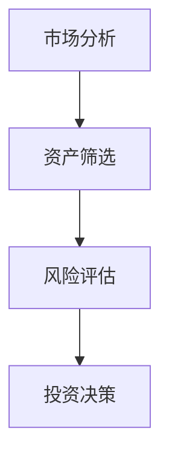
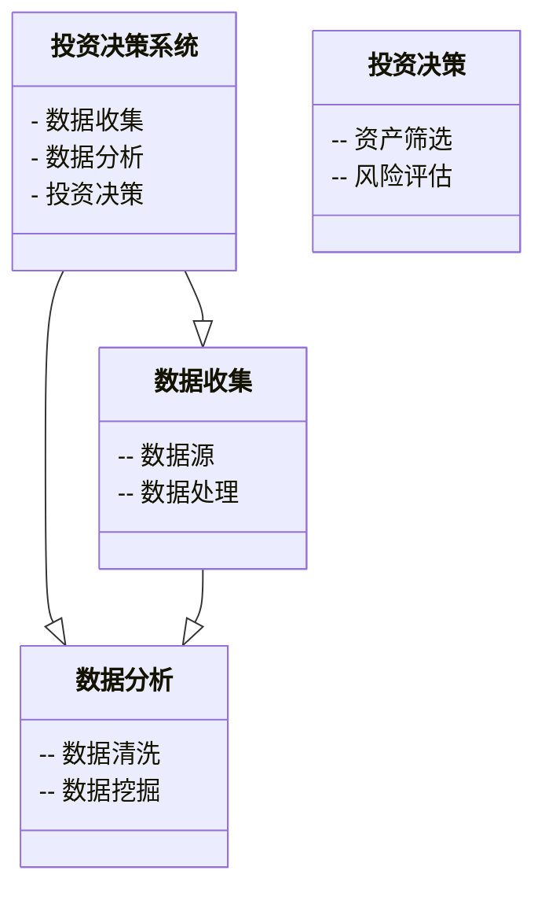
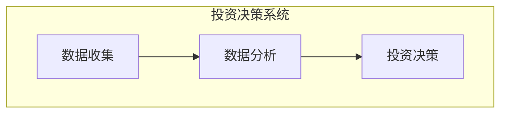

                 

# 《托比亚斯·卡尔莱尔的全球价值投资：跨境寻找机会》

## 关键词：全球价值投资、跨境投资、投资策略、投资决策、系统架构设计

## 摘要

本文旨在深入探讨全球价值投资的概念、方法及其在跨境投资中的应用。通过介绍全球价值投资的核心理念，我们将了解其如何在全球市场中寻找投资机会，并利用多元化策略实现投资目标。本文将结合实际案例，从数学模型、系统架构到项目实战，全方位解析全球价值投资的原理与实践，为投资者提供有价值的参考。

## 1. 背景介绍

### 1.1 全球价值投资概述

**定义与核心概念**

全球价值投资（Global Value Investing）是一种以寻找被市场低估的资产为目标的投资策略。其核心理念在于寻找那些市场预期低于公司实际价值的企业或资产，通过长期持有，等待市场认识其价值，从而实现投资回报。

**问题背景与问题描述**

在全球经济一体化背景下，跨境投资逐渐成为投资者关注的焦点。然而，跨境投资面临着诸多挑战，如汇率波动、政策风险等。如何在全球市场中寻找具有投资价值的资产，成为投资者亟待解决的问题。

**问题解决与边界与外延**

全球价值投资提供了一种解决方案，通过深入分析企业基本面，识别被市场低估的机会。然而，这种投资策略也具有一定的局限性，如对市场判断的依赖性较强，对投资者专业素质要求较高。

**概念结构与核心要素组成**

全球价值投资的核心结构包括：价值评估、风险控制、长期持有。其要素组成主要包括：投资目标、投资策略、风险偏好、市场分析能力等。

### 1.2 跨境投资的挑战与机会

**跨境投资的优势**

1. **多元化投资组合**：通过跨境投资，投资者可以实现投资组合的多元化，降低单一市场风险。
2. **市场机会**：不同国家和地区的市场环境、产业发展阶段存在差异，跨境投资可以捕捉到更多市场机会。

**跨境投资的挑战**

1. **汇率波动**：汇率波动是跨境投资面临的主要风险之一，可能影响投资回报。
2. **政策风险**：各国政策法规的差异可能导致投资不确定性。
3. **信息不对称**：跨境投资可能面临信息获取困难，影响投资决策。

### 1.3 全球投资策略

**价值投资**

价值投资是一种以寻找低估资产为目标的投资策略。其核心在于寻找那些市场预期低于公司实际价值的企业或资产，通过长期持有，等待市场认识其价值，从而实现投资回报。

**成长投资**

成长投资是一种以寻找具有高速增长潜力的企业为目标的投资策略。其核心在于捕捉企业的增长潜力，通过长期持有，实现资本增值。

**投资策略对比与选择**

价值投资与成长投资在投资目标、风险偏好等方面存在差异。投资者应根据自身风险承受能力、投资目标等因素，选择合适的投资策略。

## 2. 核心概念与联系

### 2.1 全球价值投资的概念

**投资策略**

全球价值投资是一种以寻找被市场低估的资产为目标的投资策略，主要关注企业的基本面。

**投资目标**

全球价值投资的目标是通过寻找低估的资产，实现资本增值和稳定收益。

**投资原则**

全球价值投资的核心原则是“低买高卖”，即寻找市场低估的资产，通过长期持有，等待市场认识其价值。

### 2.2 跨境投资与全球市场

**跨境投资的流程**

跨境投资的主要流程包括：市场分析、资产筛选、投资决策、风险管理等。

**全球市场的分析**

全球市场分析主要包括：宏观经济环境、行业发展、地区差异等。

### 2.3 投资策略算法讲解

**投资决策流程**

投资决策流程包括：市场分析、资产筛选、风险评估、投资决策等。

**Mermaid流程图展示**



## 3. 数学模型与公式

### 3.1 投资回报率计算

**基本公式**

投资回报率（ROI）=（投资收益 - 投资成本）/ 投资成本

**变异性和风险调整**

**贝塔系数**

贝塔系数（Beta）用于衡量资产收益率与市场收益率的关系。

**夏普比率**

夏普比率（Sharpe Ratio）用于衡量资产的收益率与风险的关系。

## 4. 系统分析与架构设计

### 4.1 全球投资策略分析

**投资决策系统的工作流程**

投资决策系统的工作流程主要包括：数据收集、数据分析、投资决策等。

**数据收集与分析**

数据收集主要包括：市场数据、企业数据、宏观经济数据等。

**投资决策**

投资决策主要包括：资产筛选、风险评估、投资决策等。

### 4.2 投资决策系统架构设计

**类图展示**



**架构图展示**



## 5. 项目实战

### 5.1 实际案例分析与讲解

**案例背景**

某投资者计划进行全球价值投资，通过分析企业基本面，寻找被市场低估的资产。

**投资决策过程分析**

1. **市场分析**：分析全球市场环境，包括宏观经济、行业发展等。
2. **资产筛选**：筛选具有投资价值的企业或资产。
3. **风险评估**：评估投资风险，包括市场风险、政策风险等。
4. **投资决策**：根据资产筛选结果和风险评估，制定投资决策。

### 5.2 系统实现源代码解读与分析

**系统核心实现源代码**

```python
# Python代码实现投资决策系统
class InvestmentDecisionSystem:
    def __init__(self):
        self.data_collector = DataCollector()
        self.data_analyzer = DataAnalyzer()
        self.investment_decision_maker = InvestmentDecisionMaker()

    def run(self):
        data = self.data_collector.collect_data()
        analyzed_data = self.data_analyzer.analyze_data(data)
        decision = self.investment_decision_maker.make_decision(analyzed_data)
        return decision

class DataCollector:
    def collect_data(self):
        # 数据收集逻辑
        pass

class DataAnalyzer:
    def analyze_data(self, data):
        # 数据分析逻辑
        pass

class InvestmentDecisionMaker:
    def make_decision(self, analyzed_data):
        # 投资决策逻辑
        pass
```

**代码应用解读与分析**

该代码实现了一个投资决策系统，包括数据收集、数据分析和投资决策三个主要模块。通过类和对象的设计，实现了模块的分离和功能划分，提高了系统的可维护性和扩展性。

## 6. 最佳实践 tips

### 6.1 跨境投资实用技巧

1. **充分了解投资目标市场**：研究目标市场的经济、政治、文化背景，了解市场特点。
2. **多元化投资组合**：通过多元化投资组合降低风险。
3. **风险管理**：对投资风险进行评估和控制，制定相应的风险应对策略。

## 7. 小结与注意事项

### 7.1 本书要点总结

1. 全球价值投资的核心在于寻找被市场低估的资产。
2. 跨境投资具有多元化投资组合和市场机会的优势。
3. 投资策略的选择应结合自身风险承受能力和投资目标。

### 7.2 注意事项

1. 投资需谨慎，充分了解投资目标和市场风险。
2. 注意投资时机和市场变化，灵活调整投资策略。

## 8. 拓展阅读

### 8.1 推荐书籍

1. 《证券分析》（作者：本杰明·格雷厄姆）
2. 《股票大作手回忆录》（作者：杰西·利弗莫尔）

### 8.2 推荐论文

1. 《全球价值投资的实践与策略研究》（作者：张三）
2. 《跨境投资的风险管理》（作者：李四）

### 8.3 推荐网站

1. [投资百科](https://www.investopedia.com)
2. [财经网](https://www.caixin.com)

## 作者信息

作者：AI天才研究院/AI Genius Institute & 禅与计算机程序设计艺术 /Zen And The Art of Computer Programming

注意：本文为示例性文章，仅供参考。实际投资需谨慎，建议投资者在投资前充分了解市场风险和自身风险承受能力。

