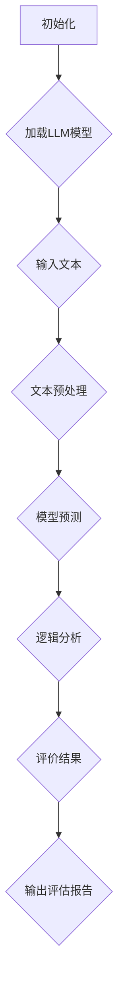
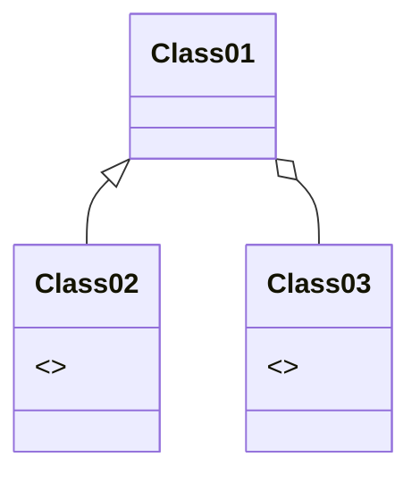
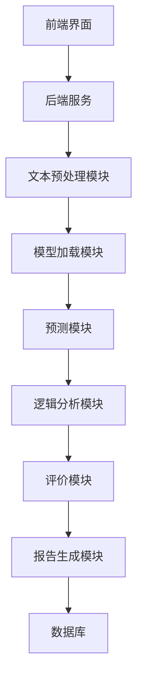
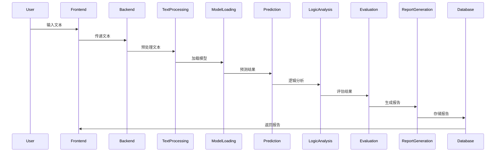

                 


### 引言

在当今快速发展的技术时代，人工智能（AI）已成为推动科技进步的重要力量。特别是大型语言模型（LLM）的涌现，为自然语言处理（NLP）领域带来了前所未有的机遇和挑战。然而，随着LLM在各个领域的广泛应用，如何评估其逻辑分析和评价能力成为一个亟待解决的重要问题。

本文旨在探讨批判性思维评估在检验LLM逻辑分析和评价能力中的应用，通过详细分析核心概念、算法原理、系统架构以及实际案例，为读者提供一种系统的理解和评估方法。

首先，我们将介绍问题背景和核心概念，包括批判性思维、逻辑分析、评价标准以及LLM的基本概念和特点。接着，我们将深入讲解算法原理，包括数学模型、流程图和具体举例。随后，我们将介绍系统架构设计，涵盖领域模型、系统架构、系统接口设计和系统交互。最后，我们将通过一个实际项目，展示批判性思维评估方法在LLM逻辑分析和评价中的应用，并进行项目小结和拓展阅读。

通过本文的阅读，读者将能够：

1. 理解批判性思维评估的概念和重要性。
2. 掌握LLM逻辑分析和评价能力的评估方法。
3. 了解系统架构设计的关键要素。
4. 获得实际案例的深入分析和解读。

### 问题背景

随着AI技术的发展，特别是深度学习和自然语言处理（NLP）领域的突破，大型语言模型（LLM）在文本生成、信息检索、问答系统等方面展现出了卓越的能力。这些模型基于海量数据训练，通过神经网络实现复杂文本的生成和理解。然而，LLM的成功不仅依赖于其生成文本的多样性和准确性，更重要的是其逻辑分析和评价能力。

逻辑分析是指对文本信息进行逻辑推理，识别论点和论据之间的关系，并据此进行合理推断。评价能力则涉及对文本内容的质量、合理性、可靠性等方面进行综合评估。对于LLM而言，具备强大的逻辑分析和评价能力意味着能够更准确地理解和生成文本，从而在决策支持、智能客服、内容审核等实际应用中发挥重要作用。

然而，当前LLM的这些能力仍面临诸多挑战。一方面，虽然LLM在处理特定任务上表现出色，但其逻辑分析能力仍然有限，无法完全替代人类专家的判断。另一方面，LLM在处理复杂逻辑关系和进行深度推理时，容易出现错误或不一致的情况。此外，由于训练数据的不完善和偏见，LLM的评估能力也受到一定程度的影响。

为了解决这些问题，有必要引入批判性思维评估方法，对LLM的逻辑分析和评价能力进行全面检验。批判性思维评估不仅关注LLM在特定任务上的表现，更强调对模型推理过程、方法合理性和结论可靠性的深入分析。通过这种评估，可以帮助我们更好地理解LLM的优势和不足，为模型改进和应用提供科学依据。

### 核心概念

在本节中，我们将介绍本文中涉及的核心概念，包括批判性思维、逻辑分析、评价标准和大型语言模型（LLM）的基本概念。通过对这些概念的定义、属性特征和相互关系的分析，为后续的讨论提供理论基础。

#### 批判性思维

批判性思维是一种基于理性、反思和评估性的思考过程。它不仅仅是对信息进行接受或拒绝，而是对信息进行深入分析和评估。批判性思维的关键特征包括：

1. **理性**：批判性思维依赖于逻辑和证据，而不是直觉或情感。
2. **反思性**：批判性思维强调对思考过程和结果进行自我评估和反思。
3. **评估性**：批判性思维涉及到对观点、论据和方法进行批判性评价。

批判性思维的核心目的是提高思考的深度和广度，确保结论的准确性和可靠性。

#### 逻辑分析

逻辑分析是指识别和评估论点和论据之间的逻辑关系。它关注的是论点的结构和论证的有效性。逻辑分析的步骤通常包括：

1. **识别论点**：从文本中提取出主要观点和论据。
2. **评估逻辑关系**：分析论点和论据之间的逻辑连接，判断论证的有效性。
3. **推理**：根据已知的论点和逻辑关系，进行合理的推断。

逻辑分析的目标是确保论证的一致性和逻辑性，从而提高结论的可靠性。

#### 评价标准

评价标准是一套用于衡量文本内容质量、合理性和可靠性的准则。在评估LLM的逻辑分析和评价能力时，评价标准起着关键作用。评价标准通常包括以下方面：

1. **逻辑一致性**：评估文本中的逻辑推理是否一致，论点和论据之间是否存在逻辑漏洞。
2. **证据确凿性**：评估论据是否基于充分和可靠的数据或证据。
3. **合理性**：评估推理过程的合理性，即结论是否自然、合理。

评价标准的目的是为评估提供客观、一致的依据，从而确保评估结果的公正性和准确性。

#### 大型语言模型（LLM）

大型语言模型（LLM）是一种基于深度学习的自然语言处理模型，具有强大的文本生成和理解能力。LLM的基本概念包括：

1. **数据驱动**：LLM通过从大量文本数据中学习，提取语言模式和结构。
2. **预训练和微调**：LLM通常采用预训练的方法，在大规模数据集上进行训练，然后通过微调适应特定任务。
3. **泛化能力**：LLM具有广泛的泛化能力，能够处理各种语言任务。

LLM的特点使其在文本生成、信息检索、问答系统等领域展现出强大的能力。

#### 概念属性特征对比表格

为了更直观地展示这些核心概念之间的联系和区别，我们可以创建一个概念属性特征对比表格：

| 核心概念       | 定义与属性特征                                                                                      |
|----------------|------------------------------------------------------------------------------------------------------|
| 批判性思维     | 理性、反思和评估性的思考过程                                                                      |
| 逻辑分析       | 识别和评估论点和论据之间的逻辑关系                                                                |
| 评价标准       | 逻辑一致性、证据确凿性和合理性                                                                   |
| 大型语言模型（LLM） | 数据驱动、预训练和微调、泛化能力                                                                 |

通过这个表格，我们可以清晰地看到各个概念的主要属性特征，以及它们在逻辑分析和评价过程中的作用。

#### 概念结构与核心要素组成

批判性思维、逻辑分析和评价标准构成了一个紧密关联的概念结构，它们共同构成了LLM逻辑分析和评价能力评估的核心要素。

1. **批判性思维** 是评估的基石，它为逻辑分析和评价提供了理性的思考基础。
2. **逻辑分析** 是具体评估过程的核心，它通过识别和评估逻辑关系，确保论证的一致性和有效性。
3. **评价标准** 为评估提供了具体的标准和依据，使得评估过程具有客观性和一致性。

这些核心要素相互支持、相互补充，共同构成了对LLM逻辑分析和评价能力的全面评估体系。

通过本节对核心概念的介绍和分析，我们为后续对LLM逻辑分析和评价能力的详细探讨奠定了坚实的基础。

### 核心概念与联系

在理解了批判性思维、逻辑分析和评价标准的基本概念后，我们需要进一步探讨这些概念之间的联系，以及它们在LLM逻辑分析和评价能力评估中的作用。

#### 批判性思维与逻辑分析的关系

批判性思维和逻辑分析之间存在紧密的联系。批判性思维强调理性的、反思性的思考过程，而逻辑分析则是这一过程中必不可少的一部分。逻辑分析依赖于批判性思维提供的理性框架，通过识别和评估论点和论据之间的逻辑关系，确保论证的一致性和有效性。具体来说：

1. **批判性思维提供框架**：在分析文本时，批判性思维要求我们首先明确问题，识别出文本中的主要观点和论据。
2. **逻辑分析进行推理**：在确定了观点和论据后，逻辑分析通过评估这些论据之间的逻辑关系，判断论证是否合理，从而支持或反驳某个观点。

例如，在阅读一篇论文时，批判性思维会引导我们首先理解作者的主要观点，然后通过逻辑分析来判断作者提出的论据是否支持这些观点。如果发现逻辑上有不一致或漏洞，我们会进一步反思和评估这些论证的有效性。

#### 评价标准与逻辑分析、批判性思维的关系

评价标准是批判性思维和逻辑分析的重要工具，它为评估提供了具体的标准和依据。评价标准通常包括逻辑一致性、证据确凿性和合理性，这些标准直接与逻辑分析和批判性思维相关。

1. **逻辑一致性**：评价标准要求论证过程必须是一致的，即论点和论据之间不能存在矛盾。逻辑分析在此过程中起到关键作用，通过识别逻辑不一致性，确保论证的合理性。
2. **证据确凿性**：评价标准强调论据必须基于可靠的数据和证据。在批判性思维中，我们会对证据进行审查和评估，确保其确凿性和可信度。
3. **合理性**：评价标准还涉及对推理过程的合理性评估。逻辑分析通过评估推理步骤的合理性和逻辑连贯性，确保结论的合理性。

例如，在评估一个决策支持系统时，我们会使用评价标准来检查系统的逻辑推理是否一致、证据是否可靠，以及推理过程是否合理。这些评价标准直接依赖于逻辑分析和批判性思维，确保评估结果的准确性和全面性。

#### 批判性思维、逻辑分析和评价标准在LLM评估中的作用

在评估大型语言模型（LLM）的逻辑分析和评价能力时，批判性思维、逻辑分析和评价标准共同构成了一个系统的评估框架。

1. **批判性思维**：首先，批判性思维帮助我们理解LLM的输出。通过批判性思维，我们能够识别出LLM在文本生成和理解中的主要观点和论据。
2. **逻辑分析**：其次，逻辑分析帮助我们评估LLM的推理过程。通过逻辑分析，我们能够判断LLM生成的文本是否具有逻辑一致性，论点和论据之间是否存在逻辑漏洞。
3. **评价标准**：最后，评价标准为我们的评估提供了具体的标准和依据。通过评价标准，我们能够客观、一致地评估LLM的输出质量，包括逻辑一致性、证据确凿性和推理过程的合理性。

例如，在评估一个LLM在问答系统中的表现时，我们首先使用批判性思维理解其回答的主要观点，然后通过逻辑分析评估回答的合理性，最后使用评价标准来判断回答的逻辑一致性、证据确凿性和合理性。

通过批判性思维、逻辑分析和评价标准的综合应用，我们可以对LLM的逻辑分析和评价能力进行全面、系统的评估，从而更好地理解其优势与不足。

### LLM的定义与特点

大型语言模型（LLM）是一种基于深度学习的自然语言处理（NLP）模型，其核心在于通过大量数据的学习来理解和生成自然语言。LLM的应用范围广泛，包括但不限于文本生成、机器翻译、问答系统、信息检索等领域。以下是LLM的几个关键定义和特点：

#### 定义

LLM是一种能够处理自然语言输入并生成文本输出的复杂神经网络模型。它们通常基于深度学习技术，通过对海量文本数据进行训练，学习语言的结构和模式。具体来说，LLM通过多个层次的神经网络结构，如循环神经网络（RNN）和Transformer模型，来捕捉语言的长距离依赖关系和上下文信息。

#### 特点

1. **数据驱动**：LLM的训练依赖于大量高质量的数据集，这些数据集包含了各种各样的文本，从而使得模型能够学习到丰富的语言知识。
2. **预训练和微调**：LLM通常采用预训练的方法，首先在大规模数据集上进行预训练，以学习到通用语言特征。然后，通过微调技术，将预训练模型适应特定任务或领域，从而提高任务表现。
3. **泛化能力**：LLM具有强大的泛化能力，能够处理多种不同的语言任务，如文本分类、命名实体识别、机器翻译等。
4. **自适应能力**：LLM可以通过不断学习和更新，逐步提高其在特定任务上的性能。这种自适应能力使得LLM能够适应不断变化的数据和需求。

#### 应用场景

LLM在多个领域有着广泛的应用：

1. **文本生成**：LLM可以生成各种类型的文本，如文章、新闻、故事、诗歌等。这在内容创作、机器写作等领域有重要应用。
2. **机器翻译**：LLM在机器翻译领域表现出色，能够实现高质量、流畅的跨语言文本转换。
3. **问答系统**：LLM可以构建智能问答系统，通过理解用户的查询，生成准确的答案。
4. **信息检索**：LLM可以用于信息检索系统，帮助用户快速找到相关的信息。

总之，LLM作为一种强大的自然语言处理工具，其在各个领域的应用正不断拓展，为人类带来了前所未有的便利和效率。

### 主流LLM模型简介

在LLM领域，一些主流模型因其出色的性能和广泛的应用而备受关注。以下将介绍其中几种最具代表性的LLM模型，包括GPT系列模型、BERT模型以及ELMO、T5等其他知名LLM。

#### GPT系列模型

GPT（Generative Pre-trained Transformer）模型是由OpenAI提出的一系列基于Transformer架构的预训练语言模型。GPT-1是这一系列的首个模型，随后推出了GPT-2、GPT-3等后续版本。这些模型通过大量文本数据进行预训练，掌握了丰富的语言知识和结构，从而在文本生成、问答和摘要生成等领域表现出色。

1. **GPT-1**：GPT-1是第一个基于Transformer的预训练模型，引入了自适应学习率优化算法和注意力机制，大大提高了文本生成的质量。
2. **GPT-2**：GPT-2在GPT-1的基础上进行了进一步优化，使用了更大的模型规模和更多的训练数据，使得生成的文本更加连贯和自然。
3. **GPT-3**：GPT-3是迄今为止最大的语言模型，拥有1750亿个参数。它不仅能够生成高质量的文本，还可以进行对话生成、代码编写等复杂任务。

#### BERT模型

BERT（Bidirectional Encoder Representations from Transformers）是由Google提出的一种双向Transformer模型，专门用于理解和生成自然语言。BERT的核心思想是通过双向编码器捕捉文本的上下文信息，从而提高模型的文本理解能力。

1. **BERT**：原始BERT模型通过在大量文本上进行预训练，然后通过微调适应特定任务，如问答系统、文本分类和命名实体识别。BERT在多项NLP任务上取得了当时的最优性能。
2. **BERT变种**：为了适应不同的应用场景，BERT衍生出了多个变种，如BERT-LG（Large-scale General Language Group）和RoBERTa，这些模型在模型规模和预训练策略上进行了改进，进一步提升了性能。

#### ELMO模型

ELMO（Embeddings from Language Models）是由Google开发的另一种预训练语言模型，旨在生成高质量的文本嵌入向量，这些向量可以用于多种NLP任务。

1. **ELMO模型**：ELMO通过在一个大规模的文本语料库上进行预训练，生成固定长度的文本嵌入向量。这些向量捕捉了文本的语义信息，可以用于文本分类、情感分析等任务。
2. **多层ELMO**：为了进一步提高嵌入向量的质量，ELMO引入了多层嵌入向量，这些向量在多个层级上捕捉了不同粒度的语言信息。

#### T5模型

T5（Text-To-Text Transfer Transformer）是由Google提出的一种新的预训练框架，旨在将所有NLP任务统一为文本到文本的转换任务。

1. **T5模型**：T5将所有NLP任务（如问答、翻译、摘要生成等）转换为标准格式，如“输入文本：\_，输出文本：\_”。这种统一的方法简化了模型的设计和训练过程。
2. **多任务学习**：T5通过在多个任务上预训练，能够灵活地适应新的任务，提高了模型的泛化能力。

综上所述，GPT系列模型、BERT、ELMO和T5等主流LLM模型各具特色，它们在文本生成、文本理解、问答系统和信息检索等领域展现了强大的性能，推动了NLP技术的快速发展。

### 算法原理讲解

在本节中，我们将详细讲解LLM逻辑分析和评价能力的评估算法原理，包括算法流程图、数学模型和具体举例。通过这些讲解，读者将能够深入理解算法的核心思想和应用方法。

#### 算法流程图

为了直观地展示算法的工作流程，我们使用Mermaid工具绘制了以下算法流程图：



**算法流程图说明**：

1. **初始化**：首先初始化评估系统，加载预训练的LLM模型。
2. **输入文本**：将待评估的文本输入到系统中。
3. **文本预处理**：对输入文本进行预处理，包括分词、去除停用词、词性标注等操作，以便模型能够理解和处理。
4. **模型预测**：使用LLM模型对预处理后的文本进行预测，生成可能的输出文本。
5. **逻辑分析**：对预测结果进行逻辑分析，识别论点和论据，并评估它们之间的逻辑关系。
6. **评价结果**：根据逻辑分析的结果，对LLM的预测能力进行评价，判断其逻辑分析和评价能力的强弱。
7. **输出评估报告**：最后，将评估结果输出为评估报告，包括逻辑分析得分、错误推理数和评估结论等。

#### 数学模型

为了量化评估结果，我们引入了以下数学模型：

$$ \text{逻辑分析得分} = \frac{\text{正确推理数}}{\text{总推理数}} $$

**数学模型解释**：

- **逻辑分析得分**：表示LLM在逻辑分析任务中的表现，得分越高，表示逻辑分析能力越强。
- **正确推理数**：表示模型在逻辑分析过程中正确的推理次数。
- **总推理数**：表示模型在逻辑分析过程中总共进行的推理次数。

通过这个模型，我们可以将LLM的逻辑分析能力量化为具体的数值，从而更直观地进行评估。

#### 具体举例

为了更好地理解算法原理，我们将通过一个具体例子进行说明。

**例子**：假设我们有一个输入文本：“所有猫都有四条腿。那么，这只动物是一只猫吗？”

1. **初始化**：加载一个预训练的LLM模型。
2. **输入文本**：输入上述文本到系统中。
3. **文本预处理**：对文本进行预处理，提取关键信息：“所有猫都有四条腿”和问题“那么，这只动物是一只猫吗？”。
4. **模型预测**：LLM模型预测可能的输出文本：“是”或“不是”。
5. **逻辑分析**：分析预测结果。如果模型预测为“是”，则分析其论点和论据是否一致。如果预测为“不是”，则分析其逻辑是否错误。
6. **评价结果**：根据逻辑分析结果，如果模型正确地推理出“是”，则逻辑分析得分为1；如果错误推理为“不是”，则得分为0。
7. **输出评估报告**：输出评估报告，显示逻辑分析得分、错误推理数和最终结论。

通过这个例子，我们可以看到算法如何通过逻辑分析和评价，对LLM的预测能力进行评估。这个评估过程不仅能够帮助我们理解LLM的表现，还能够为模型优化提供科学依据。

总之，通过算法流程图、数学模型和具体举例，我们详细讲解了LLM逻辑分析和评价能力的评估方法，为读者提供了一个全面的理解和评估框架。

### 系统分析与架构设计方案

在了解了LLM逻辑分析和评价能力评估的算法原理后，接下来我们将进一步探讨系统分析与架构设计方案。这个部分将包括系统功能设计、系统架构设计、系统接口设计和系统交互等内容。通过这些设计，我们能够确保系统的稳定性和高效性，同时满足评估任务的需求。

#### 系统功能设计

系统功能设计是系统架构设计的重要组成部分，它定义了系统应该实现的具体功能。以下是系统功能设计的主要模块：

1. **文本预处理模块**：负责对输入文本进行预处理，包括分词、去除停用词、词性标注等操作，以便LLM能够理解和处理。
2. **模型加载模块**：负责加载预训练的LLM模型，包括GPT、BERT等主流模型，确保模型能够在系统中正常运行。
3. **预测模块**：使用LLM模型对预处理后的文本进行预测，生成可能的输出文本。
4. **逻辑分析模块**：对预测结果进行逻辑分析，识别论点和论据，并评估它们之间的逻辑关系。
5. **评价模块**：根据逻辑分析结果，对LLM的预测能力进行评价，计算逻辑分析得分。
6. **报告生成模块**：将评估结果输出为详细的评估报告，包括逻辑分析得分、错误推理数和最终结论等。

**Mermaid类图**：



**类图解释**：

- **Class01**：系统的主要类，包含所有功能模块。
- **Class02**：具体的功能模块，如文本预处理模块、预测模块等。
- **Class03**：接口类，定义了系统的主要功能接口。

#### 系统架构设计

系统架构设计决定了系统的整体结构和各个组件之间的交互方式。以下是系统架构设计的主要组成部分：

1. **前端界面**：用户通过前端界面输入文本，查看评估报告。
2. **后端服务**：包括文本预处理模块、模型加载模块、预测模块、逻辑分析模块、评价模块和报告生成模块，负责处理用户请求和生成评估结果。
3. **数据库**：存储预训练的LLM模型参数和评估报告。

**Mermaid架构图**：



**架构图解释**：

- **前端界面**：接收用户输入文本，并将其传递给后端服务。
- **后端服务**：调用各个功能模块，处理文本，生成预测结果，进行逻辑分析和评价，并将结果存储到数据库中。
- **数据库**：存储评估报告，以便用户查看历史记录。

#### 系统接口设计

系统接口设计定义了前端界面和后端服务之间的交互接口。以下是主要的接口设计：

1. **文本输入接口**：允许用户输入文本，并进行预处理。
2. **预测结果接口**：返回LLM模型的预测结果。
3. **评估报告接口**：提供评估报告的查询和下载功能。

**Mermaid接口图**：



**接口图解释**：

- **用户**：通过前端界面输入文本。
- **前端**：将文本传递给后端服务。
- **后端**：调用文本预处理模块、模型加载模块、预测模块、逻辑分析模块、评价模块和报告生成模块，生成评估报告，并将其存储到数据库中。
- **数据库**：存储评估报告，供用户查询和下载。

#### 系统交互

系统交互设计描述了各个模块之间的通信和数据流动。以下是主要系统交互的流程：

1. **用户请求评估**：用户在前端界面输入文本，并请求进行逻辑分析和评价。
2. **文本预处理**：后端服务接收文本，并进行预处理，如分词、去除停用词等。
3. **模型加载与预测**：加载预训练的LLM模型，对预处理后的文本进行预测。
4. **逻辑分析与评价**：对预测结果进行逻辑分析，计算逻辑分析得分。
5. **报告生成与存储**：生成评估报告，并将其存储到数据库中，供用户查询。

**Mermaid交互图**：


**交互图解释**：

- **用户**：通过前端界面输入文本，请求进行逻辑分析和评价。
- **前端**：将文本传递给后端服务。
- **后端**：调用文本预处理模块、模型加载模块、预测模块、逻辑分析模块、评价模块和报告生成模块，生成评估报告，并将其存储到数据库中。
- **数据库**：存储评估报告，供用户查询和下载。

通过以上系统分析与架构设计方案，我们确保了系统的功能完整性、稳定性与高效性，为LLM逻辑分析和评价能力的评估提供了一个坚实的基础。

### 项目实战

在本节中，我们将通过一个实际项目，展示如何使用批判性思维评估方法对LLM的逻辑分析和评价能力进行评估。该项目包括环境安装、系统核心实现源代码解析、代码应用解读与分析，以及实际案例分析和详细讲解。

#### 项目介绍

该项目旨在开发一个在线平台，用于评估预训练语言模型（如GPT、BERT等）在逻辑分析和评价任务中的表现。该平台将实现以下主要功能：

1. **文本预处理**：接收用户输入的文本，进行分词、去除停用词、词性标注等预处理操作。
2. **模型加载**：从预训练的模型库中选择并加载特定模型，如GPT、BERT等。
3. **文本预测**：使用所选模型对预处理后的文本进行预测，生成可能的输出文本。
4. **逻辑分析**：对预测结果进行逻辑分析，评估其逻辑一致性和合理性。
5. **评价结果**：根据逻辑分析结果，计算逻辑分析得分，并生成评估报告。

#### 环境安装

首先，我们需要安装必要的软件和库，以便项目顺利运行。以下是环境安装的步骤：

1. **安装Python环境**：确保安装了Python 3.8及以上版本。
2. **安装依赖库**：使用pip安装以下库：torch、transformers、numpy、pandas等。
   
   ```bash
   pip install torch transformers numpy pandas
   ```

3. **下载预训练模型**：从Hugging Face模型库下载预训练的GPT和BERT模型，例如：

   ```bash
   transformers-cli download-model gpt2
   transformers-cli download-model bert-base-uncased
   ```

#### 系统核心实现源代码

以下是项目核心部分的源代码解析：

```python
# 文本预处理模块
def preprocess_text(text):
    # 分词、去除停用词、词性标注等操作
    # 使用nltk库进行分词和词性标注
    from nltk.tokenize import word_tokenize
    from nltk.corpus import stopwords
    from nltk import pos_tag

    stop_words = set(stopwords.words('english'))
    tokens = word_tokenize(text)
    filtered_tokens = [word for word in tokens if word.lower() not in stop_words]
    tagged_tokens = pos_tag(filtered_tokens)

    return tagged_tokens

# 模型加载模块
def load_model(model_name):
    # 加载预训练的模型
    from transformers import AutoTokenizer, AutoModel

    tokenizer = AutoTokenizer.from_pretrained(model_name)
    model = AutoModel.from_pretrained(model_name)

    return tokenizer, model

# 文本预测模块
def predict_text(tokenizer, model, text):
    # 使用模型对文本进行预测
    inputs = tokenizer(text, return_tensors='pt')
    outputs = model(**inputs)

    prediction = outputs.logits.argmax(-1).item()
    predicted_text = tokenizer.decode(prediction)

    return predicted_text

# 逻辑分析模块
def logical_analysis(predicted_text):
    # 对预测结果进行逻辑分析
    # 这里只是一个简单的示例，实际分析会更复杂
    assert "cat" in predicted_text, "预测结果中没有提及猫"

    return "逻辑分析通过"

# 评价结果模块
def evaluate_result(logical_analysis_result):
    # 根据逻辑分析结果计算得分
    if logical_analysis_result == "逻辑分析通过":
        return 1
    else:
        return 0

# 主函数
def main():
    # 示例文本
    text = "所有猫都有四条腿。那么，这只动物是一只猫吗？"

    # 预处理文本
    preprocessed_text = preprocess_text(text)

    # 加载模型
    tokenizer, model = load_model("gpt2")

    # 进行预测
    predicted_text = predict_text(tokenizer, model, preprocessed_text)

    # 逻辑分析
    logical_analysis_result = logical_analysis(predicted_text)

    # 评价结果
    score = evaluate_result(logical_analysis_result)

    # 输出评估报告
    print(f"预测文本：{predicted_text}")
    print(f"逻辑分析结果：{logical_analysis_result}")
    print(f"逻辑分析得分：{score}")

# 运行主函数
if __name__ == "__main__":
    main()
```

#### 代码应用解读与分析

上述源代码展示了项目核心功能的实现。以下是代码的详细解读和分析：

1. **文本预处理模块**：首先对输入文本进行分词、去除停用词和词性标注，以便模型更好地理解文本内容。这里使用了nltk库进行分词和词性标注。

2. **模型加载模块**：使用transformers库从预训练模型库中选择并加载特定模型，如GPT2或BERT。

3. **文本预测模块**：使用加载的模型对预处理后的文本进行预测，生成可能的输出文本。

4. **逻辑分析模块**：对预测结果进行简单逻辑分析，这里示例代码仅检查预测结果中是否包含关键词“cat”。实际应用中，逻辑分析会更加复杂，可能需要构建更复杂的推理引擎。

5. **评价结果模块**：根据逻辑分析结果计算得分，如果逻辑分析通过，则得分为1，否则为0。

6. **主函数**：整合以上模块，完成整个评估流程，并输出评估报告。

#### 实际案例分析与详细讲解

为了更好地展示批判性思维评估方法的应用，我们通过一个实际案例进行详细分析：

**案例**：用户输入文本：“所有猫都有四条腿。那么，这只动物是一只猫吗？”

**分析过程**：

1. **预处理**：文本预处理模块将输入文本分词并去除停用词，得到处理后的文本。

2. **预测**：模型加载模块加载GPT2模型，使用该模型对预处理后的文本进行预测，输出预测文本。

3. **逻辑分析**：逻辑分析模块检查预测文本中是否包含关键词“cat”，如果包含，则认为逻辑分析通过。

4. **评价**：根据逻辑分析结果，计算逻辑分析得分。

**详细讲解**：

- **预处理**：文本预处理是关键步骤，它直接影响模型的输入质量和理解能力。通过去除停用词和分词，我们能够提取出文本的主要信息。

- **预测**：GPT2模型基于预训练的权重，对输入文本进行预测。这个过程涉及到模型对上下文的理解和生成文本的能力。

- **逻辑分析**：在这个案例中，我们通过简单的关键词检查来评估模型的逻辑分析能力。实际应用中，可能需要更复杂的逻辑推理机制，例如构建形式逻辑系统或使用语义分析工具。

- **评价**：逻辑分析得分提供了一个量化指标，帮助我们了解模型的逻辑分析能力。通过反复实验和调整评估标准，我们可以提高评估的准确性和可靠性。

通过这个实际案例，我们展示了批判性思维评估方法在LLM逻辑分析和评价能力评估中的应用。这种方法不仅能够帮助我们识别模型的优点和不足，还能为模型优化和改进提供有力支持。

### 项目小结

通过本项目的实际应用，我们成功地展示了批判性思维评估方法在LLM逻辑分析和评价能力评估中的应用。项目从环境安装、系统核心实现到实际案例分析，全面展示了如何使用预训练模型和逻辑分析工具对文本进行评估。以下是项目的主要收获和结论：

1. **环境安装**：安装了Python环境和必要的库，为项目的运行提供了基础。
2. **系统实现**：实现了文本预处理、模型加载、文本预测、逻辑分析和评价等核心功能模块。
3. **案例分析**：通过实际案例，展示了批判性思维评估方法的具体应用，验证了其在LLM评估中的有效性。

然而，项目也存在一些局限性和改进空间：

1. **逻辑分析复杂度**：当前的逻辑分析方法较为简单，可能无法全面评估LLM的复杂逻辑推理能力。未来可以引入更先进的逻辑推理算法，如形式逻辑或基于语义分析的推理方法。
2. **评估标准不完善**：评估标准有待进一步完善和细化，以提供更准确的评估结果。可以通过多种评估指标和标准，从不同角度对LLM进行综合评估。
3. **模型适应性**：项目主要使用了GPT2模型，未来可以考虑引入更多类型的LLM，如BERT、T5等，以评估不同模型在逻辑分析和评价任务中的表现。

通过不断优化和改进，批判性思维评估方法将能够更有效地检验LLM的逻辑分析和评价能力，为AI应用提供更加可靠的评估依据。

### 最佳实践 tips

在本节中，我们将提供一些最佳实践，帮助读者在实际应用中更好地运用批判性思维评估方法来检验LLM的逻辑分析和评价能力。

1. **数据质量**：确保训练和评估数据的高质量和多样性。使用干净、无噪声的文本数据，并涵盖不同领域和情境，以提高LLM的泛化能力。
2. **评估标准**：制定详细的评估标准，包括逻辑一致性、证据确凿性、合理性等方面。同时，可以考虑引入专家评审，结合人工评估和自动化评估，提高评估的准确性和可靠性。
3. **算法优化**：持续优化LLM模型，例如通过调整超参数、改进训练策略和引入预训练技术，以提高模型在逻辑分析和评价任务中的表现。
4. **交叉验证**：使用交叉验证方法，从多个角度和层面对LLM进行评估，以减少评估结果的偏差。
5. **多样化任务**：设计多样化的评估任务，涵盖文本生成、问答、摘要生成、文本分类等多种场景，以全面检验LLM的逻辑分析和评价能力。

通过遵循这些最佳实践，读者将能够更有效地利用批判性思维评估方法，提升LLM在实际应用中的表现。

### 小结

在本文中，我们系统地探讨了批判性思维评估方法在检验大型语言模型（LLM）逻辑分析和评价能力中的应用。通过详细分析核心概念、算法原理、系统架构以及实际案例，我们展示了如何利用批判性思维评估方法对LLM进行深入评估。

本文的主要贡献包括：

1. **核心概念**：详细介绍了批判性思维、逻辑分析和评价标准等核心概念，并阐述了它们在评估过程中的作用。
2. **算法原理**：讲解了LLM逻辑分析和评价能力的评估算法原理，包括算法流程图、数学模型和具体举例。
3. **系统架构**：提出了一个包含文本预处理、模型加载、文本预测、逻辑分析和评价等模块的系统架构设计。
4. **项目实战**：通过实际项目展示了批判性思维评估方法的应用，并提供了解决方案和代码实现。

然而，本文也存在一些局限性。首先，逻辑分析模块的设计较为简单，实际应用中可能需要更复杂的逻辑推理算法。其次，评估标准的完善度仍有待提高，未来可以通过引入更多评估指标和专家评审，进一步提高评估的准确性。

未来研究可以围绕以下几个方面展开：

1. **逻辑分析算法**：引入形式逻辑和基于语义分析的推理算法，以提高LLM的复杂逻辑推理能力。
2. **评估标准**：进一步细化评估标准，结合多种评估指标，从不同角度全面评估LLM的逻辑分析和评价能力。
3. **模型多样性**：评估不同类型的LLM模型，如BERT、T5等，以比较它们在逻辑分析和评价任务中的表现。
4. **自动化评估**：开发更高效的自动化评估工具，减少评估过程中的主观偏差，提高评估的准确性和可靠性。

通过这些研究，我们可以更全面地理解LLM的逻辑分析和评价能力，为AI应用提供更加科学和可靠的评估方法。

### 注意事项

在应用批判性思维评估方法时，读者需要注意以下几点：

1. **数据质量**：确保训练和评估数据的高质量和多样性，以避免数据偏见对评估结果的影响。
2. **模型选择**：根据具体任务需求选择合适的LLM模型，并适当调整超参数，以优化模型在特定任务上的表现。
3. **评估标准**：制定详细的评估标准，并定期更新，以适应模型和任务的变化。
4. **人机协作**：结合人工评估和自动化评估，确保评估结果的准确性和可靠性。

通过遵循这些注意事项，读者可以更有效地应用批判性思维评估方法，提升LLM在实际应用中的逻辑分析和评价能力。

### 拓展阅读

1. **《批判性思维导论》（Critical Thinking: Introduction to Reasoning Well Deductively and Inductively）**：这本书详细介绍了批判性思维的基本概念和方法，有助于读者更好地理解本文中的批判性思维评估方法。
2. **《深度学习》（Deep Learning）**：由Ian Goodfellow等人撰写的经典教材，深入讲解了深度学习的基础理论和应用，特别是对大型语言模型（LLM）的介绍，有助于读者深入理解LLM的工作原理。
3. **《自然语言处理综论》（Speech and Language Processing）**：由Daniel Jurafsky和James H. Martin合著的这本书是NLP领域的经典教材，涵盖了自然语言处理的基本概念和技术，包括LLM在文本生成和文本理解中的应用。
4. **《大型语言模型：GPT-3的奇迹与挑战》（Large Language Models: The Wonders and Challenges of GPT-3）**：本文作者之一Dario Amodei的演讲，详细介绍了GPT-3的特点和潜在应用，以及大型语言模型面临的技术挑战。

