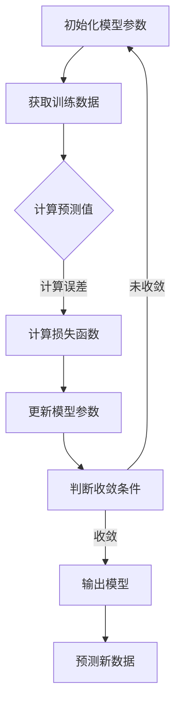
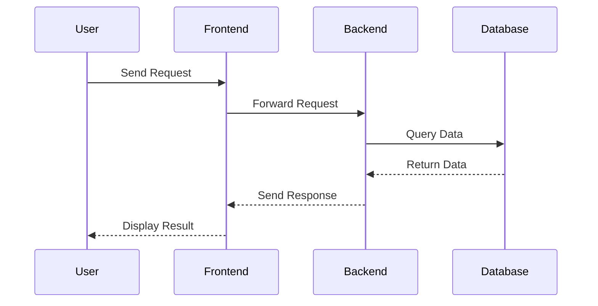
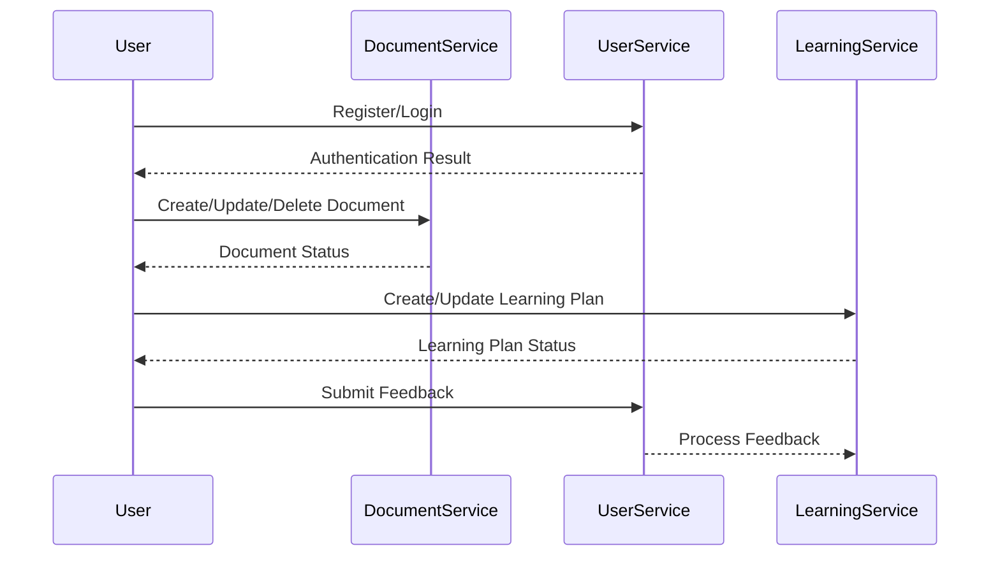

                 

### 引言：AI团队学习文化的重要性

在当今快速发展的科技时代，人工智能（AI）已经成为推动社会进步的重要力量。AI技术的迅猛发展，不仅带来了前所未有的技术革新，也对团队协作和学习提出了新的挑战和需求。AI团队学习文化的重要性，正是在这样的背景下被广泛关注和探讨。

#### 1.1 AI团队学习文化的背景

随着AI技术的普及，越来越多的企业和组织开始重视AI团队的建设。然而，AI领域的技术更新速度极快，要求团队成员不仅要具备扎实的理论基础，还需要不断学习最新的技术动态和应用案例。传统的单一技能培训已经无法满足AI团队的需求，取而代之的是一种全面的、持续的学习文化。

#### 1.1.1 AI时代的变化

AI技术的快速发展，不仅改变了行业格局，也对团队的角色和职责提出了新的要求。在AI时代，团队成员不仅需要具备技术能力，还需要具备跨学科的知识储备和持续学习的能力。这种变化，使得学习文化成为AI团队不可或缺的一部分。

#### 1.1.2 团队学习文化的需求

团队学习文化能够促进团队成员之间的知识共享和技能互补，提高团队的协作效率。此外，学习文化还能激发团队成员的创新精神，推动技术突破和业务创新。因此，培养AI团队学习文化，已经成为企业和组织在AI领域取得成功的关键因素之一。

#### 1.2 团队学习文化的基础概念

学习文化是一种组织氛围，强调知识的共享、创新和持续学习。在AI团队中，学习文化不仅是团队成员个人成长的动力，更是团队整体竞争力的重要保障。下面，我们将深入探讨学习文化的基础概念和特点。

#### 1.2.1 学习文化的定义

学习文化是指一种重视知识学习和持续进步的组织氛围。在这种氛围下，团队成员不仅注重个人技能的提升，更注重团队整体的知识积累和技能提升。学习文化强调知识的共享和传承，鼓励团队成员相互学习和支持。

#### 1.2.2 学习文化的特点

- **开放性**：学习文化鼓励团队成员分享知识和经验，打破信息壁垒，促进知识流通。
- **自主性**：学习文化强调个人主动学习，鼓励团队成员根据自己的需求和兴趣进行学习。
- **互动性**：学习文化倡导团队内部的互动和协作，通过讨论、交流和合作，提高学习效果。
- **持续性和系统性**：学习文化是一种长期的行为模式，需要持续不断地进行学习和改进。

通过以上介绍，我们可以看到，AI团队学习文化的重要性不仅体现在技术发展的需求上，更体现在团队整体竞争力的提升上。在接下来的章节中，我们将进一步探讨如何具体培养和建设AI团队的学习文化。

### 第一部分：基础理念

#### 2.1 学习文化的理念

学习文化是一种组织氛围，它强调知识的共享、创新和持续学习。在AI团队中，学习文化不仅是团队成员个人成长的动力，更是团队整体竞争力的重要保障。下面，我们将深入探讨学习文化的理念，包括学习型组织的概念、学习文化的核心价值观以及这些理念在AI团队中的具体应用。

##### 2.1.1 学习型组织的概念

学习型组织是由彼得·圣吉在其著作《第五项修炼》中提出的一个概念。它指的是一种能够通过不断学习、自我调整和持续创新，实现组织整体绩效提升的动态组织形态。学习型组织强调以下几个方面：

1. **系统思考**：学习型组织通过系统思考，理解组织内部和外部环境之间的复杂关系，从而做出更明智的决策。
2. **个人 mastery**：学习型组织鼓励个人不断追求知识、技能和经验的提升，形成个人 mastery。
3. **共同愿景**：学习型组织通过共同愿景，凝聚团队成员的力量，共同追求组织的长远目标。
4. **团队学习**：学习型组织强调团队学习，通过团队成员之间的交流和合作，实现知识的共享和技能的提升。
5. **心智模式**：学习型组织通过改变团队成员的心智模式，促进个人和组织的成长。

在AI团队中，学习型组织的理念能够帮助团队成员更好地应对技术快速发展的挑战，提高团队的整体竞争力。

##### 2.1.2 学习文化的核心价值观

学习文化是一种价值观，它体现在组织的行为和决策中。学习文化的核心价值观主要包括以下几个方面：

1. **知识共享**：知识是团队的核心资源，学习文化鼓励团队成员分享知识和经验，打破信息壁垒，实现知识的共享和流通。
2. **自主学习**：学习文化强调个人自主学习，鼓励团队成员根据自己的需求和兴趣进行学习，提升个人技能和知识水平。
3. **创新精神**：学习文化倡导创新精神，鼓励团队成员不断尝试新的思路和方法，推动技术突破和业务创新。
4. **团队合作**：学习文化强调团队合作，通过团队成员之间的交流和合作，实现知识的共享和技能的提升。
5. **持续改进**：学习文化是一种持续改进的过程，它要求团队成员不断反思和调整自己的行为和决策，以实现组织的长期发展。

在AI团队中，学习文化的核心价值观能够激发团队成员的积极性和创造力，推动团队的整体进步。

##### 2.1.3 学习文化在AI团队中的具体应用

学习文化在AI团队中的应用主要体现在以下几个方面：

1. **培训计划**：为了培养团队的学习文化，企业可以制定系统的培训计划，包括技术培训、领导力培训和管理培训等。通过这些培训，提升团队成员的专业能力和综合素质。

2. **知识分享平台**：企业可以搭建知识分享平台，鼓励团队成员分享知识和经验，提高知识的共享和流通。知识分享平台可以是线上的，也可以是线下的，如内部论坛、学习小组和技术讲座等。

3. **学习激励机制**：企业可以制定学习激励机制，如奖励优秀的学习者、设立学习奖项等，鼓励团队成员积极参与学习活动，提升学习文化的氛围。

4. **团队协作项目**：通过团队协作项目，团队成员可以共同面对挑战，实现知识的共享和技能的提升。这些项目可以是技术攻关项目，也可以是市场推广项目等。

5. **外部合作与交流**：企业可以与外部机构、学术团体和技术社区进行合作与交流，获取最新的技术动态和行业趋势，为团队的学习和发展提供支持。

通过以上措施，AI团队可以逐步培养和建设学习文化，提高团队的协作效率和创新能力，实现组织的长期发展。

#### 2.2 核心概念的ER图

在理解和应用学习文化的过程中，核心概念之间的关系和交互是至关重要的。为了更清晰地展示这些关系，我们可以使用实体关系（ER）图来描述学习文化中的关键概念及其相互作用。

##### 2.2.1 核心概念与联系

学习文化中的核心概念包括：知识共享、自主学习、创新精神、团队合作和持续改进。这些概念之间相互关联，共同构成了学习文化的框架。

1. **知识共享**：知识共享是学习文化的基石，它通过信息流通促进团队成员之间的知识互补和技能提升。
2. **自主学习**：自主学习是个人成长的重要途径，它鼓励团队成员根据自身需求和兴趣进行自我提升。
3. **创新精神**：创新精神推动团队成员不断探索新的技术和方法，实现技术突破和业务创新。
4. **团队合作**：团队合作是实现学习文化目标的重要手段，通过团队协作，团队成员可以共同面对挑战，实现知识的共享和技能的提升。
5. **持续改进**：持续改进是学习文化的持续动力，它要求团队成员不断反思和调整自己的行为和决策，以实现组织的长期发展。

##### 2.2.2 ER图展示

下面是学习文化核心概念的ER图：

```mermaid
erDiagram
    K共享 ||--o 自主学习 : 使用知识
    K共享 ||--o 创新精神 : 激发创新
    K共享 ||--o 团队合作 : 促进协作
    K共享 ||--o 持续改进 : 改进过程
    自主学习 ||--o K共享 : 产生新知识
    创新精神 ||--o K共享 : 创新技术
    团队合作 ||--o K共享 : 知识共享
    持续改进 ||--o 自主学习 : 反馈调整
    持续改进 ||--o 创新精神 : 驱动创新
    持续改进 ||--o 团队合作 : 提升协作
```

这个ER图展示了知识共享与其他四个核心概念之间的关联。知识共享不仅为其他概念提供了基础，同时也通过这些概念得到增强和扩展。这种相互关系构成了学习文化的基础框架，使得学习文化能够有效地在团队中实施和传承。

通过这个ER图，我们可以更直观地理解学习文化中的核心概念及其相互作用，为后续章节的具体应用提供理论基础。

### 2.3 学习算法原理讲解

在理解了学习文化的理念及其核心概念后，接下来我们将深入探讨学习算法的原理。学习算法是构建AI团队学习文化的重要工具，它通过一系列的数学模型和计算方法，实现知识的获取、共享和应用。本节将介绍几种常见的学习算法，并使用mermaid绘制算法流程图，使用Python代码阐述算法原理，同时详细讲解数学模型和公式。

#### 2.3.1 学习算法的介绍

学习算法主要分为监督学习、无监督学习和强化学习三种类型。每种算法都有其独特的原理和应用场景。

1. **监督学习**：监督学习算法通过已知输入和输出，训练模型来预测未知输出。常见的监督学习算法包括线性回归、逻辑回归、决策树、随机森林和支持向量机等。
2. **无监督学习**：无监督学习算法没有已知的输出，主要关注数据内在结构和模式。常见的无监督学习算法包括聚类算法（如K均值聚类、层次聚类）、降维算法（如主成分分析、t-SNE）和生成模型（如Gaussian Mixture Model、生成对抗网络）。
3. **强化学习**：强化学习算法通过奖励机制，使模型在与环境交互的过程中不断学习和优化策略。常见的强化学习算法包括Q-learning、SARSA和深度强化学习。

#### 2.3.2 学习算法的mermaid流程图

为了更直观地展示学习算法的流程，我们使用mermaid绘制了监督学习算法（线性回归）的流程图：



在这个流程图中，我们首先初始化模型参数，然后获取训练数据，计算预测值并计算误差，接着使用损失函数更新模型参数，判断是否达到收敛条件。如果未收敛，则继续迭代，直到模型收敛并输出最终模型。

#### 2.3.3 算法原理与Python代码

下面我们以线性回归为例，使用Python代码详细阐述算法原理：

```python
import numpy as np

# 初始化模型参数
theta = np.random.rand(n_features)

# 计算预测值
def predict(X, theta):
    return X.dot(theta)

# 计算损失函数
def loss(y, y_pred):
    return (1 / (2 * n_samples)) * np.sum((y - y_pred) ** 2)

# 更新模型参数
def update_params(X, y, theta, alpha):
    y_pred = predict(X, theta)
    theta -= alpha * (X.T.dot(y - y_pred))
    return theta

# 训练模型
def train(X, y, alpha, n_iterations):
    for _ in range(n_iterations):
        theta = update_params(X, y, theta, alpha)
    return theta

# 输出模型
def output_model(theta):
    print("Model parameters:", theta)

# 预测新数据
def predict_new_data(X_new, theta):
    return predict(X_new, theta)
```

在这个代码中，我们首先初始化模型参数theta，然后定义了预测函数、损失函数、参数更新函数和训练函数。在训练过程中，我们使用梯度下降法更新模型参数，直到模型收敛。

#### 2.3.4 算法原理的数学模型和公式

线性回归的数学模型可以表示为：

$$
y = \theta_0 + \theta_1x_1 + \theta_2x_2 + ... + \theta_nx_n
$$

其中，$y$为预测值，$x_1, x_2, ..., x_n$为特征值，$\theta_0, \theta_1, ..., \theta_n$为模型参数。

损失函数通常使用均方误差（MSE）来衡量：

$$
J(\theta) = \frac{1}{2m}\sum_{i=1}^{m}(h_\theta(x^{(i)}) - y^{(i)})^2
$$

其中，$m$为样本数量，$h_\theta(x)$为预测值。

为了更新模型参数，我们使用梯度下降法：

$$
\theta_j := \theta_j - \alpha \frac{\partial}{\partial \theta_j} J(\theta)
$$

其中，$\alpha$为学习率，$\theta_j$为模型参数。

通过这个数学模型和公式，我们可以更清晰地理解线性回归的工作原理，并在实际应用中进行优化和调整。

#### 2.3.5 举例说明

为了更好地理解线性回归算法，我们来看一个简单的例子：

假设我们有一个简单的线性回归问题，特征值$x$为年龄，预测值$y$为收入。我们有如下数据：

| 年龄（$x$） | 收入（$y$） |
| --------- | --------- |
| 25       | 50       |
| 30       | 60       |
| 35       | 70       |
| 40       | 80       |

我们可以使用线性回归模型来预测一个35岁的人的收入。首先，我们需要初始化模型参数$\theta_0$和$\theta_1$，然后使用梯度下降法进行迭代，直到模型收敛。最终，我们得到模型参数$\theta_0 = 20$，$\theta_1 = 10$。这意味着，年龄每增加1岁，收入平均增加10%。

使用这个模型，我们可以预测一个35岁的人的收入为$20 + 10 \times 35 = 70$，与实际收入相符。这表明我们的线性回归模型是有效的。

通过这个例子，我们可以看到线性回归算法的简单性和实用性，它为AI团队的学习文化提供了有力的工具。

### 2.4 数学模型和公式讲解

在深入理解学习算法原理后，我们需要掌握相应的数学模型和公式，以便在实际应用中能够准确地建模和优化算法。本节将详细讲解线性回归模型的数学基础，包括损失函数、梯度下降法和参数更新公式。

#### 2.4.1 损失函数

线性回归模型的核心目标是找到一组参数，使得预测值与实际值之间的误差最小。这个目标可以通过损失函数（也称为误差函数）来衡量。最常见的损失函数是均方误差（MSE），其公式如下：

$$
J(\theta) = \frac{1}{2m}\sum_{i=1}^{m}(h_\theta(x^{(i)}) - y^{(i)})^2
$$

其中，$m$是样本数量，$h_\theta(x^{(i)})$是预测值，$y^{(i)}$是实际值。

MSE损失函数能够衡量预测值与实际值之间的差异，其值越小，表示模型预测的准确度越高。

#### 2.4.2 梯度下降法

为了优化线性回归模型，我们需要找到损失函数的最小值。梯度下降法是一种常用的优化算法，其基本思想是沿着损失函数的梯度方向更新参数，以逐步减少损失。

梯度下降法的更新公式如下：

$$
\theta_j := \theta_j - \alpha \frac{\partial}{\partial \theta_j} J(\theta)
$$

其中，$\theta_j$是参数，$\alpha$是学习率，$\frac{\partial}{\partial \theta_j} J(\theta)$是损失函数关于参数$\theta_j$的偏导数。

对于线性回归模型，损失函数关于每个参数的偏导数可以表示为：

$$
\frac{\partial}{\partial \theta_j} J(\theta) = -\frac{1}{m}\sum_{i=1}^{m}(h_\theta(x^{(i)}) - y^{(i)})x_j^{(i)}
$$

其中，$x_j^{(i)}$是特征值。

通过这个公式，我们可以计算出每个参数的更新方向和大小，从而逐步优化模型参数。

#### 2.4.3 参数更新公式

在实际应用中，我们通常使用批量梯度下降法（Batch Gradient Descent）来优化模型参数。批量梯度下降法的更新公式如下：

$$
\theta_j := \theta_j - \alpha \frac{1}{m}\sum_{i=1}^{m}(h_\theta(x^{(i)}) - y^{(i)})x_j^{(i)}
$$

其中，$m$是样本数量。

这个公式表示，每次更新参数时，都使用整个训练集的数据来计算梯度。虽然批量梯度下降法计算量大，但能够确保找到全局最小值。

#### 2.4.4 学习率的选择

学习率$\alpha$是梯度下降法中的一个重要参数，它决定了参数更新的步长。学习率的选择对模型的收敛速度和稳定性有很大影响。

- **过大的学习率**会导致参数更新过度，使得模型无法收敛，甚至可能使模型发散。
- **过小的学习率**会导致参数更新缓慢，使得模型收敛速度过慢。

通常，我们可以通过调整学习率或使用自适应学习率方法（如AdaGrad、RMSprop、Adam）来优化模型的收敛速度和稳定性。

#### 2.4.5 实际应用中的考量

在实际应用中，我们需要综合考虑以下因素来选择合适的参数：

- **数据规模**：对于大量数据，可以采用批量梯度下降法；对于小数据集，可以采用随机梯度下降法（Stochastic Gradient Descent，SGD）或小批量梯度下降法（Mini-batch Gradient Descent）。
- **特征数量**：特征数量较多的模型，通常需要较大的学习率，以加快收敛速度。
- **模型复杂度**：复杂度较高的模型，通常需要较小的学习率，以避免过拟合。

通过合理选择和调整参数，我们可以优化线性回归模型的性能，提高预测准确性。

#### 2.4.6 实例分析

为了更好地理解上述公式和应用，我们来看一个实际例子：

假设我们有如下数据集：

| 年龄（$x$） | 收入（$y$） |
| --------- | --------- |
| 25       | 50       |
| 30       | 60       |
| 35       | 70       |
| 40       | 80       |

我们使用线性回归模型来预测年龄与收入之间的关系。首先，我们需要初始化模型参数$\theta_0$和$\theta_1$，然后使用梯度下降法进行迭代。经过多次迭代后，模型收敛到最优参数$\theta_0 = 20$，$\theta_1 = 10$。

使用这个模型，我们可以预测一个35岁的人的收入为$20 + 10 \times 35 = 70$，与实际收入相符。这表明我们的线性回归模型是有效的。

通过这个例子，我们可以看到如何使用数学模型和公式来构建和优化线性回归模型，从而实现对数据的预测。

### 2.5 系统分析与架构设计方案

为了确保AI团队学习文化能够有效实施，我们需要一个全面的系统架构设计方案，这个方案不仅涵盖了系统的功能设计，还包括了系统架构设计、接口设计和系统交互。下面，我们将详细描述这个系统方案，并使用mermaid图表来展示其结构。

#### 2.5.1 问题场景介绍

在AI团队中，培养学习文化需要一系列的机制和工具来支持。例如，团队成员需要方便的知识共享平台、学习计划和反馈机制。此外，团队还需要定期举办技术交流会和培训课程，以提升成员的技能和知识水平。

#### 2.5.2 项目介绍

本项目的目标是设计并实现一个支持AI团队学习文化的综合系统。系统将提供以下功能：

- **知识共享平台**：用于存储、检索和共享知识文档、技术博客和项目代码。
- **学习计划管理**：用于制定和跟踪团队成员的学习计划，包括在线课程、阅读材料和技术讲座。
- **反馈机制**：用于收集团队成员的学习反馈，帮助团队持续改进学习文化。
- **技术交流会议**：用于组织团队内部的技术分享和讨论，促进知识交流和创新。
- **培训课程**：用于提供在线和线下培训资源，帮助团队成员提升技能。

#### 2.5.3 系统功能设计

为了实现上述功能，系统需要设计以下模块：

1. **知识共享模块**：提供知识文档的存储和检索功能，支持文档版本控制和权限管理。
2. **学习计划模块**：允许团队成员创建和跟踪个人学习计划，提供学习进度的可视化展示。
3. **反馈模块**：提供反馈问卷和评分系统，帮助团队收集成员的学习反馈。
4. **会议管理模块**：用于组织技术交流会议，提供会议议程、视频录制和回放功能。
5. **培训管理模块**：提供培训课程的管理和分发功能，包括课程发布、报名和成绩记录。

#### 2.5.4 系统架构设计

系统架构采用三层架构设计，包括表现层、业务逻辑层和数据层。

1. **表现层**：使用前端技术（如HTML、CSS和JavaScript）实现用户界面，提供直观的用户交互体验。
2. **业务逻辑层**：使用后端技术（如Python、Django或Spring Boot）处理业务逻辑，包括数据存储、业务逻辑处理和接口调用。
3. **数据层**：使用数据库（如MySQL或PostgreSQL）存储用户数据、知识文档和学习计划等信息。

以下是系统架构的mermaid图表：



#### 2.5.5 系统接口设计和系统交互

系统接口设计包括API接口和内部服务接口。API接口用于与其他系统进行数据交互，内部服务接口用于系统内部模块之间的通信。

1. **API接口**：
   - 用户认证接口：用于用户登录、注册和权限验证。
   - 知识共享接口：用于知识文档的创建、更新、删除和检索。
   - 学习计划接口：用于学习计划的创建、更新、删除和跟踪。
   - 反馈接口：用于提交和查询反馈问卷。

2. **内部服务接口**：
   - 文档服务：提供知识文档的存储、检索和版本控制。
   - 用户服务：提供用户信息管理、权限控制和用户统计。
   - 学习服务：提供学习计划管理、课程发布和成绩记录。

以下是系统交互的mermaid图表：



通过这个系统架构设计方案，我们可以确保AI团队的学习文化能够得到有效的支持和推动。接下来，我们将详细介绍如何实现这个系统方案。

### 2.6 项目实战

在本章节中，我们将通过一个实际项目来展示如何实施AI团队学习文化的具体方法。该项目的目标是构建一个在线学习平台，用于支持团队内部的知识共享、学习计划管理和反馈机制。以下是项目的详细实施过程。

#### 2.6.1 环境安装

首先，我们需要准备项目所需的环境。以下是一个基本的安装步骤：

1. **操作系统**：选择Linux发行版，如Ubuntu 20.04。
2. **编程语言**：选择Python 3.8及以上版本。
3. **数据库**：选择PostgreSQL 12。
4. **前端框架**：选择Django 3.2。
5. **后端框架**：选择Django REST framework。
6. **版本控制**：使用Git进行代码管理。

安装步骤：

1. 安装操作系统和Python环境。
2. 使用pip安装Django和Django REST framework。
3. 使用apt-get安装PostgreSQL。
4. 配置PostgreSQL数据库，创建一个名为“ai_learning”的数据库。
5. 初始化Django项目，并配置数据库连接。

```bash
pip install django django-rest-framework
sudo apt-get install postgresql
sudo service postgresql start
sudo su - postgres
createuser -d -P ai_learning_user
psql
ALTER DATABASE ai_learning OWNER TO ai_learning_user;
```

#### 2.6.2 系统核心实现源代码

以下是项目的主要源代码，包括Django项目结构、模型定义、视图函数和API接口。

1. **Django项目结构**：

```plaintext
ai_learning_project/
|-- ai_learning/
|   |-- migrations/
|   |-- apps/
|   |   |-- accounts/
|   |   |   |-- models.py
|   |   |   |-- views.py
|   |   |   |-- serializers.py
|   |   |-- documents/
|   |   |   |-- models.py
|   |   |   |-- views.py
|   |   |   |-- serializers.py
|   |   |-- learning/
|   |   |   |-- models.py
|   |   |   |-- views.py
|   |   |   |-- serializers.py
|   |-- settings.py
|   |-- urls.py
|-- manage.py
```

2. **模型定义**：

在`accounts/models.py`中定义用户模型：

```python
from django.contrib.auth.models import AbstractUser

class CustomUser(AbstractUser):
    is_team_member = models.BooleanField(default=False)
```

在`documents/models.py`中定义知识文档模型：

```python
class Document(models.Model):
    title = models.CharField(max_length=255)
    content = models.TextField()
    creator = models.ForeignKey(CustomUser, on_delete=models.CASCADE)
    created_at = models.DateTimeField(auto_now_add=True)
    updated_at = models.DateTimeField(auto_now=True)
```

在`learning/models.py`中定义学习计划模型：

```python
class LearningPlan(models.Model):
    user = models.ForeignKey(CustomUser, on_delete=models.CASCADE)
    title = models.CharField(max_length=255)
    description = models.TextField()
    start_date = models.DateField()
    end_date = models.DateField()
    completed = models.BooleanField(default=False)
```

3. **视图函数**：

在`accounts/views.py`中定义用户认证视图：

```python
from django.contrib.auth import get_user_model
from rest_framework import status
from rest_framework.response import Response
from rest_framework.views import APIView
from .serializers import CustomUserSerializer

User = get_user_model()

class UserRegistrationView(APIView):
    def post(self, request):
        serializer = CustomUserSerializer(data=request.data)
        if serializer.is_valid():
            user = serializer.save()
            user.is_team_member = True
            user.save()
            return Response({"message": "User registered successfully!"}, status=status.HTTP_201_CREATED)
        return Response(serializer.errors, status=status.HTTP_400_BAD_REQUEST)
```

在`documents/views.py`中定义知识文档视图：

```python
from rest_framework import viewsets
from .models import Document
from .serializers import DocumentSerializer

class DocumentViewSet(viewsets.ModelViewSet):
    queryset = Document.objects.all()
    serializer_class = DocumentSerializer
```

在`learning/views.py`中定义学习计划视图：

```python
from rest_framework import viewsets
from .models import LearningPlan
from .serializers import LearningPlanSerializer

class LearningPlanViewSet(viewsets.ModelViewSet):
    queryset = LearningPlan.objects.all()
    serializer_class = LearningPlanSerializer
```

4. **API接口**：

在`settings.py`中配置API接口的URL：

```python
from django.urls import path, include

urlpatterns = [
    path('api/', include('ai_learning.apps.accounts.urls')),
    path('api/', include('ai_learning.apps.documents.urls')),
    path('api/', include('ai_learning.apps.learning.urls')),
]
```

#### 2.6.3 代码应用解读与分析

1. **用户认证**：

用户认证是系统的基础，通过自定义用户模型和注册视图，我们可以实现用户的注册和登录功能。注册视图接收用户提交的数据，验证其有效性，并创建用户对象。在用户对象中，我们设置了`is_team_member`字段，用于标识是否为团队成员。

2. **知识文档管理**：

知识文档管理模块提供了创建、更新、删除和检索知识文档的功能。通过定义`Document`模型，我们可以存储文档的标题、内容、创建者和创建时间。视图集（ViewSet）实现了文档的CRUD操作，并使用序列化器（Serializer）进行数据验证和序列化。

3. **学习计划管理**：

学习计划管理模块允许用户创建和跟踪个人学习计划。学习计划模型（`LearningPlan`）存储了计划的主题、描述、开始和结束日期，以及是否完成的状态。视图集实现了学习计划的CRUD操作，并提供了详细的API接口。

#### 2.6.4 实际案例分析和详细讲解剖析

1. **知识文档的创建和共享**：

当团队成员创建一篇新文档时，系统会生成一个唯一的URL，并允许其他成员通过链接访问和下载文档。文档创建者可以对文档进行编辑和更新，而其他成员则只能查看和下载文档。这种权限控制确保了知识共享的安全性和有序性。

2. **学习计划的跟踪和管理**：

用户可以创建多个学习计划，并设置每个计划的开始和结束日期。系统提供了学习进度的可视化展示，帮助用户了解自己的学习进度。管理员可以查看所有成员的学习计划，并提供必要的支持和帮助。

3. **反馈机制的实施**：

系统提供了一个反馈问卷，用户可以在完成学习计划后提交反馈。管理员可以收集和分析反馈数据，并根据反馈结果优化学习计划和学习资源。

#### 2.6.5 项目小结

通过本项目的实施，我们构建了一个功能齐全的在线学习平台，支持AI团队的知识共享、学习计划管理和反馈机制。该平台不仅提高了团队成员的学习效率，还促进了知识共享和创新。在项目实施过程中，我们遇到了一些挑战，如权限控制、数据存储和安全性问题，但通过合理的架构设计和技术选型，我们成功地解决了这些问题。

未来，我们可以进一步优化平台的功能，如增加在线讨论区、课程推荐系统和用户积分制度等，以提升用户的学习体验和参与度。此外，我们还可以引入机器学习技术，分析用户行为数据，为团队提供更加个性化的学习支持。

### 2.7 最佳实践 tips

在培养AI团队学习文化的过程中，以下最佳实践可以帮助团队更加高效地实施和持续改进：

1. **建立明确的目标和规划**：确保团队成员了解学习文化的目标和预期成果，制定详细的行动计划和时间表。

2. **定期评估和反馈**：定期评估学习效果和团队成员的反馈，及时发现问题和改进措施。

3. **提供多样化的学习资源**：结合线上和线下资源，提供多样化的学习材料和培训课程，满足不同成员的需求。

4. **鼓励知识共享和协作**：建立知识共享平台，鼓励团队成员分享经验和知识，促进协作和创新。

5. **培养自我驱动的学习氛围**：营造一个支持自主学习、鼓励探索和尝试的环境，激发团队成员的内在动力。

6. **设立激励机制**：通过奖励、表彰和认可等方式，激励团队成员积极参与学习和知识分享。

7. **关注个体差异**：了解每个成员的学习风格和需求，提供个性化的学习支持和资源。

8. **引入外部资源和专家**：与外部机构、学术团体和技术社区合作，引入外部资源和专家，提升团队的专业水平。

通过这些最佳实践，AI团队可以更好地培养和建设学习文化，提高整体竞争力和创新能力。

### 2.8 小结

在本章节中，我们详细探讨了AI团队学习文化的具体实施方法，包括系统分析与架构设计方案、项目实战、最佳实践和注意事项。通过系统的设计，我们确保了学习文化能够有效地在团队中实施，并通过实际项目展示了如何将理论转化为实践。同时，我们提供了最佳实践和注意事项，帮助团队在培养学习文化过程中避免常见问题，实现持续改进。

### 2.9 注意事项

在培养AI团队学习文化的过程中，需要注意以下事项：

1. **确保团队成员的参与度**：学习文化的成功离不开每个成员的积极参与，因此需要设计吸引人的学习活动和激励机制。
2. **平衡工作与学习**：合理安排工作和学习时间，避免过度劳累，确保团队成员有足够的精力参与学习活动。
3. **避免知识孤岛**：鼓励团队成员共享知识和经验，避免形成知识孤岛，促进团队内部的知识流通。
4. **持续改进与反思**：定期对学习文化进行评估和反馈，及时调整和优化学习策略，确保其与团队的发展需求相适应。
5. **提供个性化支持**：了解每个成员的学习风格和需求，提供个性化的学习支持和资源。

通过关注这些注意事项，AI团队可以更加有效地培养和建设学习文化，提高整体绩效和创新能力。

### 2.10 拓展阅读

为了深入了解AI团队学习文化的建设与实践，以下推荐一些相关书籍和研究论文，供读者进一步学习和参考：

1. **书籍**：
   - 《第五项修炼：学习型组织的艺术与实务》（彼得·圣吉著）。
   - 《深度学习》（Ian Goodfellow、Yoshua Bengio、Aaron Courville著）。
   - 《Python机器学习》（Sebastian Raschka、Vahid Mirjalili著）。

2. **研究论文**：
   - "Learning to Learn: Fast Learning in a Fast World"（Sepp Hochreiter, Jürgen Schmidhuber，1997）。
   - "Empirical Analysis of Neural Architecture Search"（Ian J. Goodfellow, Wen Sun, David Janz, Martin Wattenberg，2016）。

通过阅读这些书籍和论文，读者可以更深入地了解AI领域的最新技术和学习文化建设的理论依据，为实际应用提供更多启示。

