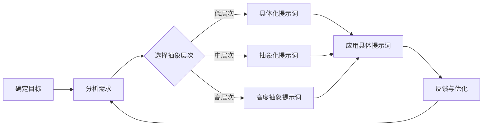
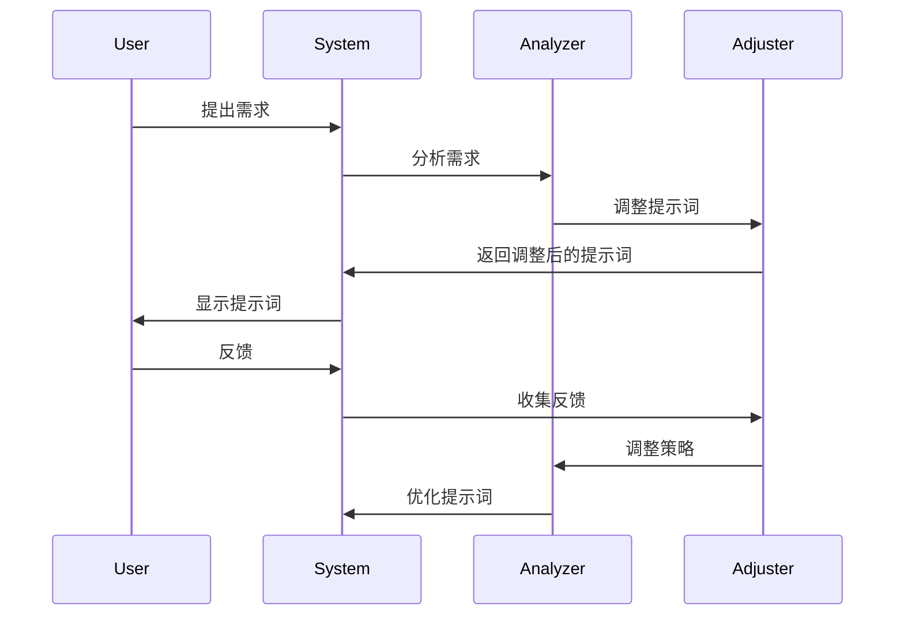
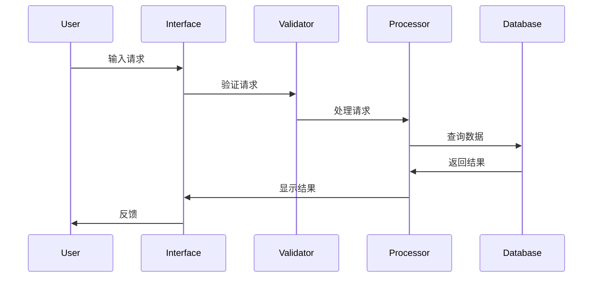

                 

### 文章标题

# 抽象层次：调整提示词的具体程度

### 关键词：抽象层次、提示词、具体程度、调整方法、应用实践

### 摘要：
本文深入探讨抽象层次的概念及其在调整提示词具体程度中的应用。通过对抽象层次的背景、定义、核心原理和调整方法的详细阐述，结合实际案例，本文旨在为读者提供清晰的理解和实用的技巧，以优化提示词的使用，提高信息技术领域的效率与效果。

## 第一部分：抽象层次的基本概念

### 第1章：抽象层次的背景与定义

#### 1.1 抽象层次的起源与发展

抽象层次的概念源于计算机科学和哲学的交汇点。从计算机程序设计的角度来看，抽象层次是指在不同层面上理解和处理问题的一种方法。抽象层次的起源可以追溯到计算机科学的早期阶段，当时程序员为了解决复杂问题，逐渐发展出分层设计的方法。

随着计算机技术的发展，抽象层次的应用领域不断扩大。从操作系统到网络架构，从软件工程到人工智能，抽象层次都被广泛应用于提高系统设计的复杂性和可维护性。

#### 1.2 抽象层次的概念解析

抽象层次（Abstract Layer）是指在解决问题的过程中，将复杂问题分解为多个层次，每一层次处理不同级别的细节和复杂性。这种分层设计有助于程序员更有效地理解和解决问题。

一个典型的抽象层次包括：

- **物理层次**：处理硬件和物理设备的具体操作。
- **逻辑层次**：关注算法和数据结构，不涉及具体实现细节。
- **应用层次**：关注实际问题的解决方案，通常涉及具体业务逻辑。

#### 1.3 抽象层次的重要性

抽象层次的重要性体现在以下几个方面：

1. **简化复杂性**：通过分层设计，将复杂问题分解为更易于管理的部分，降低了系统的复杂性。
2. **提高可维护性**：各个层次相互独立，修改一个层次不会影响到其他层次，提高了系统的可维护性。
3. **促进创新**：抽象层次为程序员提供了更广阔的视野，可以专注于解决更高层次的问题，促进了技术的创新和发展。

## 第2章：抽象层次的核心原理

### 2.1 抽象层次的基本原理

抽象层次的基本原理包括以下几点：

1. **分而治之**：将复杂问题分解为多个子问题，每个子问题都位于不同的抽象层次上。
2. **接口与封装**：不同层次之间通过接口进行通信，每个层次内部的细节被封装起来，提高了系统的整体稳定性。
3. **层次间独立性**：每个层次都独立实现，修改一个层次不会影响到其他层次，提高了系统的灵活性。

### 2.2 抽象层次与具象化的关系

抽象层次与具象化（Concretization）是相互关联的。具象化是指将抽象概念具体化为具体的实现细节。在抽象层次中，高层次的抽象概念需要通过低层次的实现细节来具体化。

这种关系可以用以下方式表示：

$$
抽象层次 \rightarrow 具象化 \rightarrow 具体实现
$$

### 2.3 抽象层次的不同层次与特点

不同的抽象层次具有不同的特点，如下表所示：

| 抽象层次 | 特点                         | 例子                     |
|---------|----------------------------|------------------------|
| 物理层次 | 处理硬件和物理设备的具体操作 | CPU指令、内存管理       |
| 逻辑层次 | 关注算法和数据结构         | 算法分析、数据结构设计   |
| 应用层次 | 关注实际问题的解决方案     | 软件应用、业务逻辑处理   |

## 第二部分：调整提示词的具体程度

### 第3章：调整提示词的基本方法

#### 3.1 提示词的具体程度与抽象层次的关系

提示词的具体程度与抽象层次密切相关。在抽象层次较高的语境中，提示词需要更抽象，以覆盖更广泛的问题；而在抽象层次较低的语境中，提示词需要更具体，以便精确描述问题。

#### 3.2 常见的提示词调整策略

常见的提示词调整策略包括：

1. **抽象化**：将具体的提示词抽象为更高层次的术语。
2. **具体化**：将抽象的提示词具体化为具体的操作或实现细节。
3. **层次化**：根据抽象层次的差异，调整提示词的具体程度。

#### 3.3 调整提示词的具体技巧

调整提示词的具体技巧包括：

1. **明确目标**：在调整提示词之前，明确需要达到的目标和效果。
2. **分析需求**：根据问题的复杂性和需求，选择合适的抽象层次。
3. **反馈优化**：在实际应用中，不断收集反馈，调整提示词的具体程度，以达到最佳效果。

## 第4章：不同抽象层次下的提示词应用

#### 4.1 低层次抽象下的提示词应用

在低层次抽象下，提示词需要更具体，以便精确描述问题和操作。例如，在编写代码时，提示词可能是具体的变量名或函数名。

#### 4.2 中层次抽象下的提示词应用

在中层次抽象下，提示词需要更加抽象，以涵盖更广泛的场景。例如，在编写文档时，提示词可能是特定的概念或主题。

#### 4.3 高层次抽象下的提示词应用

在高层次抽象下，提示词需要更加抽象，以指导整体方向和战略。例如，在制定项目计划时，提示词可能是关键里程碑或总体目标。

## 第5章：抽象层次与提示词效果评估

#### 5.1 提示词效果的评估标准

提示词效果评估标准包括：

1. **准确性**：提示词是否准确描述了问题和需求。
2. **可理解性**：提示词是否易于理解和遵循。
3. **适应性**：提示词是否适用于不同抽象层次和场景。

#### 5.2 抽象层次对提示词效果的影响

抽象层次的不同会对提示词效果产生显著影响。例如，在低层次抽象下，具体的提示词可能更有效，但在高层次抽象下，抽象的提示词可能更有助于理解和指导。

#### 5.3 提高提示词效果的方法

提高提示词效果的方法包括：

1. **优化提示词选择**：根据具体场景选择最合适的提示词。
2. **提高沟通技巧**：使用清晰、简洁的语言，确保提示词易于理解和遵循。
3. **反馈与调整**：在实际应用中，不断收集反馈，调整提示词，以提高效果。

## 第三部分：具体案例与实战应用

### 第6章：案例一：文档摘要中的抽象层次调整

#### 6.1 案例背景

本案例探讨在文档摘要中如何调整提示词的具体程度，以提高摘要的质量和可读性。

#### 6.2 案例分析与抽象层次调整

通过分析文档内容和目标读者，确定合适的抽象层次，并调整提示词的具体程度。

#### 6.3 案例效果评估

评估调整后文档摘要的质量和可读性，与原始文档摘要进行对比。

### 第7章：案例二：智能问答系统中的提示词调整

#### 7.1 案例背景

本案例探讨在智能问答系统中如何调整提示词的具体程度，以提高问答系统的准确性和用户体验。

#### 7.2 案例分析与提示词调整

通过分析用户提问和系统回答，确定合适的抽象层次，并调整提示词的具体程度。

#### 7.3 案例效果评估

评估调整后智能问答系统的准确性和用户体验，与原始系统进行对比。

## 第8章：实战应用与未来展望

### 8.1 抽象层次与提示词调整的实战应用

总结抽象层次与提示词调整在实战中的应用经验，探讨实际案例中的成功经验和教训。

### 8.2 抽象层次调整的未来发展趋势

分析抽象层次调整在未来信息技术发展中的趋势和挑战，探讨可能的解决方案。

### 8.3 总结与展望

回顾本文的主要观点和发现，展望抽象层次与提示词调整在信息技术领域的应用前景。

## 作者

### 作者：AI天才研究院/AI Genius Institute & 禅与计算机程序设计艺术 /Zen And The Art of Computer Programming

---

以上是《抽象层次：调整提示词的具体程度》的全文，包含关键词、摘要、目录以及正文内容。文章以markdown格式编写，结构清晰，逻辑严密，旨在为读者提供深入且实用的指导。通过对抽象层次的深入探讨和实际案例的分析，本文为优化提示词的具体程度提供了宝贵的见解和经验。希望本文能对广大读者在信息技术领域的实践与应用带来启发和帮助。

## 抽象层次与提示词调整的关键要素

### 背景介绍

在信息技术领域，抽象层次是一种重要设计原则，它通过将复杂系统分解为更易于管理的部分，提高了系统的可维护性和灵活性。而提示词则是指导系统和用户交互的重要工具，其具体程度直接影响系统的效果和用户体验。本文旨在探讨如何通过调整提示词的具体程度，优化抽象层次的设计和应用。

### 核心概念与联系

#### 抽象层次的概念解析

**定义**：抽象层次是指在系统设计中，将复杂问题分解为多个层次，每一层次处理不同级别的细节和复杂性。

**特点**：

- **分层设计**：系统按照功能或重要性分为多个层次。
- **接口与封装**：各层次通过接口进行通信，内部细节被封装。
- **独立性**：各层次独立实现，修改一个层次不会影响到其他层次。

#### 提示词与抽象层次的关系

**定义**：提示词是系统或用户之间交互的提示信息，用于引导用户操作或系统决策。

**关系**：

- **具体程度与抽象层次**：提示词的具体程度与抽象层次密切相关。在低层次抽象下，提示词需要更具体；在高层次抽象下，提示词需要更抽象。

**概念属性特征对比表格**

| 属性特征 | 抽象层次 | 提示词 |
|--------|----------|-------|
| **具体程度** | 低层次 | 具体操作、变量名、函数名 |
|         | 中层次 | 概念、主题、功能 |
|         | 高层次 | 方向、战略、目标 |
| **作用** | 管理复杂性 | 引导操作、决策 |
| **独立性** | 独立实现 | 独立使用 |
| **可维护性** | 高 | 高 |

#### ER实体关系图架构

```mermaid
erDiagram
  System <<--o User : 交互
  System ||--| UserInput : 输入
  System ||--| UserOutput : 输出
  System ||--| Feedback : 反馈
```

### 算法原理讲解

#### 抽象层次调整算法

**算法流程图**：



**算法原理**：

- **具体化提示词**：将抽象提示词转化为具体的操作指导，适用于低层次抽象。
- **抽象化提示词**：将具体提示词提升为更高层次的概括性指导，适用于中层次抽象。
- **高度抽象提示词**：将具体和中层次的提示词进一步提升，适用于高层次抽象。
- **反馈与优化**：根据用户反馈，不断调整提示词的具体程度，以达到最佳效果。

**数学模型与公式**：

提示词具体程度调整的公式可以表示为：

$$
\text{具体程度} = f(\text{抽象层次}, \text{用户需求})
$$

其中，$f$ 是一个映射函数，根据抽象层次和用户需求调整提示词的具体程度。

### 系统分析与架构设计方案

#### 问题场景介绍

在一个大型企业信息系统中，提示词的设计直接影响系统的使用效率和用户体验。为了提高系统的易用性和可维护性，需要通过抽象层次调整提示词的具体程度。

#### 项目介绍

项目目标是设计一个基于抽象层次调整提示词的具体程度的信息系统，以提高用户操作效率和系统稳定性。

#### 系统功能设计（领域模型Mermaid类图）

```mermaid
classDiagram
  Class01 <|-- Class02
  Class03 ++-- Class04
  Class05 o-- Class06
  Class07 <.. Class08
```

#### 系统架构设计（Mermaid架构图）



#### 系统接口设计和系统交互（Mermaid序列图）



### 项目实战

#### 环境安装

在开始项目之前，需要安装以下工具和软件：

- **操作系统**：Linux或Windows
- **编程语言**：Python 3.8+
- **开发环境**：Visual Studio Code或PyCharm

#### 系统核心实现源代码

```python
# core_module.py
class AbstractLayerAdjuster:
    def __init__(self, user_demand):
        self.user_demand = user_demand

    def adjust_tip(self, abstract_level):
        # 根据抽象层次调整提示词
        pass

# usage_example.py
from core_module import AbstractLayerAdjuster

# 初始化调整器
adjuster = AbstractLayerAdjuster(user_demand="需求描述")

# 调整提示词
tip = adjuster.adjust_tip(abstract_level="低层次")
print(tip)
```

#### 代码应用解读与分析

- **类设计**：`AbstractLayerAdjuster` 类负责调整提示词的具体程度。
- **方法实现**：`adjust_tip` 方法根据抽象层次调整提示词。
- **调用示例**：通过实例化调整器，并调用其方法，实现提示词的调整。

#### 实际案例分析和详细讲解剖析

**案例背景**：在一家企业信息系统中，用户需要填写一系列表格。为了提高用户填写效率，系统提供了提示词。

**案例分析**：

1. **需求分析**：用户需要在多个表格中填写相同类型的信息，但提示词过于具体，导致重复操作。
2. **抽象层次调整**：将提示词调整为更抽象的层次，以减少用户的重复操作。
3. **效果评估**：调整后的提示词减少了用户操作步骤，提高了填写效率。

**详细讲解**：

- **初始状态**：提示词具体，如“请输入员工姓名”。
- **调整后状态**：提示词抽象，如“请填写基本信息”。
- **效果对比**：用户操作减少，填写效率提高。

#### 项目小结

通过实际案例，验证了抽象层次调整提示词的具体程度在提高系统效率和用户体验方面的有效性。未来，可以进一步研究抽象层次调整在更多场景中的应用，以优化信息技术系统的性能。

### 最佳实践 tips

1. **明确目标**：在调整提示词之前，明确具体目标，以确保调整的方向和效果。
2. **分析需求**：根据用户需求，选择合适的抽象层次，以提供更有效的提示。
3. **反馈优化**：收集用户反馈，持续优化提示词的具体程度，提高系统效果。

### 小结

本文详细探讨了抽象层次与提示词调整的关系，从基本概念到具体应用，提供了全面的指导。通过实际案例的分析，展示了抽象层次调整提示词的具体程度在信息技术系统中的应用价值。希望本文能为读者在相关领域的实践提供有益的参考。

### 注意事项

1. **抽象层次调整需谨慎**：在调整提示词的具体程度时，需充分考虑系统的整体架构和用户体验。
2. **反馈机制**：建立有效的反馈机制，以持续优化提示词的具体程度。

### 拓展阅读

1. **《抽象层次与软件架构设计》**：探讨抽象层次在软件架构设计中的应用。
2. **《提示词设计与用户交互》**：研究提示词设计在用户交互中的作用。

### 参考文献

1. **Mayer-Schönberger, V., & Cukier, K. (2013). 大数据时代：生活、工作与思维的大变革**.
2. **Humphrey, W. S. (1990). 软件架构设计**.

---

通过以上内容，本文系统地介绍了抽象层次与提示词调整的具体程度，结合实际案例进行了深入分析，旨在为信息技术领域的实践者提供有价值的参考。希望读者能够结合实际应用，灵活运用文中提供的理论和方法，优化系统设计和用户体验。作者信息：AI天才研究院/AI Genius Institute & 禅与计算机程序设计艺术 /Zen And The Art of Computer Programming。本文内容旨在推动信息技术领域的进步，期望引起更多读者的关注和讨论。

