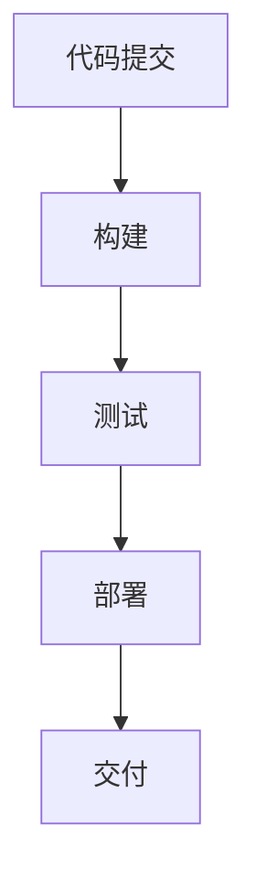

                 

### 文章标题：持续交付管道：流水线式交付LLM应用更新

持续交付（Continuous Delivery，简称CD）是现代软件开发中的一种实践方法，旨在通过自动化流水线，实现软件从开发到部署的快速、可靠迭代。随着人工智能（AI）技术的快速发展，尤其是大型语言模型（LLM）在自然语言处理（NLP）领域的广泛应用，如何高效、安全地将这些复杂的AI应用更新部署到生产环境中，成为当前软件工程领域的重要课题。

本文将深入探讨持续交付管道的基本概念、流程、工具，特别是流水线式交付LLM应用的具体策略和案例。我们将一步步分析，从核心概念和原理出发，到实际应用和案例分析，帮助读者全面理解如何通过持续交付管道，实现LLM应用的流水线式更新。

本文分为三大部分：

**第一部分：持续交付管道基础**
- **第1章：持续交付概述**
  - 持续交付的定义与优势
  - 持续交付的核心原则
  - 持续交付与传统交付方式的对比
- **第2章：持续交付流程与工具**
  - 持续交付流程
  - 持续交付工具（如Git、Jenkins、Docker、Kubernetes）
- **第3章：持续交付中的风险管理**
  - 持续交付的风险识别与评估
  - 风险应对策略

**第二部分：流水线式交付LLM应用**
- **第4章：LLM应用概述**
  - LLM应用的定义与分类
  - LLM应用的特点与挑战
- **第5章：流水线式交付LLM应用的设计**
  - 流水线式交付的基本概念
  - 流水线式交付LLM应用的架构设计
- **第6章：流水线式交付LLM应用的核心环节**
  - 自动化测试
  - 持续集成
  - 持续部署
- **第7章：流水线式交付LLM应用案例与实践**
  - 案例背景与目标
  - 案例实施步骤与工具选型
  - 案例核心实现与解析
  - 案例小结与反思

**第三部分：持续交付管道的优化与未来趋势**
- **第8章：持续交付管道的优化策略**
  - 管道性能优化
  - 管道安全性保障
- **第9章：持续交付管道的未来趋势**
  - AI在持续交付中的应用
  - 新兴技术在持续交付中的应用

通过以上结构化的内容布局，本文旨在为读者提供一个系统、全面的指导，帮助他们在实践中成功实现LLM应用的持续交付。

#### 关键词：持续交付，持续集成，持续部署，流水线，LLM应用，自动化测试

#### 摘要：

本文深入探讨了持续交付管道的基本概念、流程和工具，以及如何在现代软件开发中通过流水线式交付实现大型语言模型（LLM）的更新部署。首先，介绍了持续交付的核心原则和与传统交付方式的对比，随后详细阐述了持续交付的流程和常用工具。接下来，针对持续交付中的风险管理，提供了识别、评估和应对策略。第二部分专注于流水线式交付LLM应用，包括基本概念、架构设计和核心环节，并通过实际案例展示实施步骤和工具选型。最后，探讨了持续交付管道的优化策略和未来趋势，尤其是AI和新兴技术在持续交付中的应用。通过本文，读者将能够全面理解并实践持续交付管道，为高效、安全地更新LLM应用奠定坚实基础。

## 第一部分：持续交付管道基础

### 第1章：持续交付概述

持续交付（Continuous Delivery，简称CD）是一种软件开发和部署的实践方法，旨在通过自动化流水线，实现软件从开发到生产的快速、可靠迭代。这一方法通过一系列自动化的构建、测试和部署步骤，确保代码在任何时间都是可部署的状态，从而大幅提升软件交付的速度和可靠性。

#### 1.1 持续交付的定义与优势

**持续交付的定义：**
持续交付不仅仅是一种交付方式，而是一种文化、流程和工具的综合体。其核心思想是确保每次代码提交后，都可以通过自动化测试和部署，安全、可靠地交付到生产环境。

**持续交付的优势：**
1. **速度提升：** 通过自动化流水线，开发团队能够快速响应需求变化，缩短开发周期，实现频繁的迭代。
2. **可靠性保障：** 自动化的测试和部署流程，减少了人为错误，提升了软件的稳定性和可靠性。
3. **风险降低：** 由于每次代码提交都会经过完整的测试和部署流程，风险在早期就被识别和解决，降低了生产环境中出现问题的可能性。
4. **提高质量：** 持续交付鼓励频繁的测试和反馈，有助于及早发现和修复缺陷，从而提升软件的整体质量。

#### 1.2 持续交付与传统交付方式的对比

**传统交付方式：**
传统交付方式通常涉及手动测试和部署，流程较为复杂且耗时。开发、测试和运维团队之间协作不畅，容易导致沟通成本增加、交付周期延长和软件质量问题。

**持续交付与传统交付的对比：**

| 对比项       | 传统交付方式 | 持续交付         |
| ------------ | ------------ | ---------------- |
| **开发与测试** | 手动测试     | 自动化测试       |
| **部署方式**   | 手动部署     | 自动化部署       |
| **反馈周期**   | 长周期反馈   | 短周期反馈       |
| **可靠性**     | 低可靠性     | 高可靠性         |
| **速度**       | 慢速迭代     | 快速迭代         |

#### 1.3 持续交付的核心价值

持续交付的核心价值在于其能够显著提升软件交付的效率和可靠性，实现以下几个方面的提升：

1. **快速响应：** 持续交付能够快速响应市场需求，缩短产品的上市时间，提高市场竞争力。
2. **稳定性和可靠性：** 自动化的测试和部署流程减少了人为干预，降低了错误率，提高了软件的稳定性和可靠性。
3. **持续改进：** 通过持续交付，团队能够持续获取反馈，不断优化产品，实现持续改进。
4. **风险管理：** 通过早期识别和解决风险，持续交付能够有效降低生产环境中出现问题的可能性，保障业务稳定运行。

总之，持续交付作为一种先进的软件开发和部署实践，不仅提升了开发效率和质量，还为企业带来了显著的商业价值。

### 第2章：持续交付流程与工具

持续交付的核心在于其自动化流程和工具的使用，通过这些工具，可以大幅提升软件开发和部署的效率与可靠性。本节将详细介绍持续交付的基本流程和常用工具，包括Git、Jenkins、Docker和Kubernetes。

#### 2.1 持续交付流程

**持续交付的生命周期：**
持续交付的生命周期包括从代码提交、构建、测试、部署到最终交付的各个阶段。以下是一个典型的持续交付流程：

1. **代码提交（Code Commit）：** 开发者将代码提交到版本控制系统（如Git）。
2. **构建（Build）：** 自动化工具（如Jenkins）触发构建过程，编译代码并生成可执行文件。
3. **测试（Test）：** 自动化测试工具执行单元测试、集成测试和回归测试，确保代码质量。
4. **部署（Deploy）：** 将通过测试的代码部署到测试环境或生产环境。

**持续交付的步骤与环节：**
- **持续集成（Continuous Integration，CI）：** 持续集成是将开发者的代码定期合并到主分支，并进行自动化测试的过程。
- **持续部署（Continuous Deployment，CD）：** 持续部署是在通过测试后，自动将代码部署到生产环境的过程。

**持续交付的典型流程图：**


#### 2.2 持续交付工具

**Git：版本控制与管理**
- **功能与作用：** Git是一种分布式版本控制系统，用于管理源代码的版本历史。它允许开发者独立工作，并在适当的时候合并代码。
- **工作流程：** 开发者将代码提交到本地仓库，通过`git push`命令将更改同步到远程仓库。

**Jenkins：持续集成与持续部署**
- **功能与作用：** Jenkins是一个开源的持续集成服务器，用于自动化构建、测试和部署流程。
- **工作流程：** Jenkins可以触发构建任务，执行一系列命令，如构建项目、运行测试、部署代码等。

**Docker：容器化技术**
- **功能与作用：** Docker是一种容器化技术，用于打包、交付和管理应用。
- **工作流程：** 开发者创建Dockerfile，定义应用所需的环境和依赖项，然后使用Docker命令运行容器。

**Kubernetes：容器编排与管理**
- **功能与作用：** Kubernetes是一个开源的容器编排平台，用于自动化部署、扩展和管理容器化应用。
- **工作流程：** Kubernetes可以管理Docker容器，提供负载均衡、自动扩展等功能。

**持续交付工具的选型策略：**
- **根据项目需求选择：** 根据项目的规模、复杂度和需求，选择适合的持续交付工具。
- **工具集成与兼容性：** 选择易于与其他工具集成的持续交付工具，提高整体效率。

通过以上工具和流程的合理配置和优化，可以构建一个高效、可靠的持续交付管道，实现快速、可靠的软件交付。

### 第3章：持续交付中的风险管理

在持续交付的过程中，风险管理是至关重要的环节。由于持续交付强调频繁的迭代和自动化，任何一处环节的失误都可能对整个流程造成重大影响。因此，识别、评估和应对持续交付中的风险，是保障软件质量和项目进展的关键。

#### 3.1 持续交付的风险识别

**风险类型的分类：**
在持续交付中，风险可以大致分为以下几类：

1. **技术风险：** 包括代码错误、构建失败、测试失败等技术问题。
2. **流程风险：** 持续交付流程中的配置错误、自动化脚本失效等问题。
3. **人员风险：** 包括团队成员的技术能力不足、沟通不畅等。
4. **环境风险：** 包括服务器故障、网络问题等外部环境因素。

**风险识别的方法：**
1. **历史数据分析：** 分析过去项目中出现的问题，识别常见的风险点。
2. **专家评审：** 通过邀请领域专家进行评审，识别潜在的风险。
3. **流程监控：** 通过实时监控系统，及时发现并处理风险。

#### 3.2 持续交付的风险评估

**风险评估的步骤：**
1. **风险识别：** 列出项目中的所有潜在风险。
2. **风险分析：** 对每个风险进行分析，评估其发生概率和影响程度。
3. **风险排序：** 根据评估结果，对风险进行优先级排序，确定优先处理的风险。
4. **风险应对策略：** 制定针对每个风险的应对策略。

**风险评估的工具：**
1. **风险矩阵：** 使用风险矩阵（Risk Matrix）对风险进行定量和定性分析。
2. **决策树：** 使用决策树（Decision Tree）对风险和应对策略进行可视化分析。

#### 3.3 持续交付的风险应对策略

**风险缓解与规避：**
1. **技术缓解：** 通过引入新的技术手段，如代码审查、静态代码分析，降低技术风险。
2. **流程规避：** 通过优化持续交付流程，减少流程风险，如引入持续集成和持续部署的最佳实践。

**风险转移与承担：**
1. **风险转移：** 通过保险、外包等方式，将部分风险转移给第三方。
2. **风险承担：** 针对不可转移的风险，制定应对策略，如建立应急响应机制。

通过有效的风险管理，可以降低持续交付过程中的风险，确保软件项目的顺利进行。持续交付不仅是一种技术实践，更是一种风险管理策略，只有将风险控制在可接受的范围内，才能真正实现持续交付的价值。

### 第4章：LLM应用概述

随着人工智能技术的迅猛发展，大型语言模型（Large Language Model，简称LLM）已经成为自然语言处理（Natural Language Processing，简称NLP）领域的重要工具。LLM在各个行业中具有广泛的应用，如智能客服、文本生成、翻译等。本章节将对LLM应用的基本概念、分类及其面临的挑战进行详细探讨。

#### 4.1 LLM应用的定义与分类

**LLM应用的定义：**
LLM应用是指基于大型语言模型构建的应用程序，这些模型经过大量的数据训练，具有强大的语义理解、文本生成和翻译能力。LLM应用通过调用预训练模型，可以完成各种复杂的语言任务，提高文本处理的效率和准确性。

**LLM应用的分类：**
1. **文本生成：** 例如自动写作、摘要生成、广告文案生成等。
2. **问答系统：** 如智能客服系统、问答机器人等，可以处理自然语言查询并给出准确的回答。
3. **翻译：** 实现不同语言之间的自动翻译，提高跨语言沟通的效率。
4. **文本分类：** 例如情感分析、新闻分类等，对文本进行自动分类。
5. **对话系统：** 构建智能对话系统，如聊天机器人，用于与用户进行自然语言交互。

**LLM应用的示例：**
- **智能客服：** 利用LLM应用，企业可以构建智能客服系统，提供24/7的客户支持，提高客户满意度。
- **自动写作：** 通过LLM应用，新闻机构可以自动生成新闻稿件，提高内容生产的效率。
- **翻译服务：** 利用LLM应用，可以实现实时翻译，为跨国企业提供服务。

#### 4.2 LLM应用的特点与挑战

**LLM应用的特点：**
1. **强大的语义理解能力：** LLM通过对海量文本数据进行训练，具备强大的语义理解能力，能够准确捕捉文本的深层含义。
2. **高效率的处理速度：** LLM应用可以快速处理大量文本数据，实现实时响应。
3. **自适应能力：** LLM应用可以根据用户输入，动态调整回答和生成内容，提高用户体验。

**LLM应用面临的挑战：**
1. **计算资源需求大：** LLM应用通常需要大量的计算资源进行训练和推理，这对硬件设施提出了较高的要求。
2. **数据隐私问题：** LLM应用在处理用户数据时，需要确保数据的安全和隐私，防止数据泄露和滥用。
3. **模型解释性不足：** LLM应用往往缺乏透明性和解释性，难以理解模型的决策过程，这对一些需要严格解释的场景构成挑战。
4. **泛化能力有限：** LLM应用在特定领域或任务上的表现可能较好，但在其他领域或任务上可能表现不佳，泛化能力有限。

**解决策略：**
1. **优化算法和模型：** 通过改进算法和模型，提高LLM应用的性能和效率。
2. **增强数据隐私保护：** 通过数据加密、匿名化等技术，确保用户数据的安全和隐私。
3. **提升模型解释性：** 通过可视化工具和解释性算法，帮助用户理解模型的决策过程。
4. **多模态学习：** 结合多种数据类型（如文本、图像、声音等），提高LLM应用的泛化能力和适用性。

总之，LLM应用在自然语言处理领域具有巨大的潜力，但同时也面临一系列挑战。通过不断优化和改进，可以更好地发挥LLM应用的潜力，推动人工智能技术的进一步发展。

### 第5章：流水线式交付LLM应用的设计

流水线式交付（Continuous Delivery Pipeline）是持续交付（Continuous Delivery，简称CD）的重要组成部分，它通过自动化流水线，实现软件从开发到生产的快速、可靠迭代。在本章中，我们将探讨流水线式交付的基本概念，以及如何设计流水线式交付LLM应用的架构。

#### 5.1 流水线式交付的基本概念

**流水线式交付的定义：**
流水线式交付是指通过一系列自动化步骤，将代码从开发环境快速、可靠地交付到生产环境的流程。这个流程包括构建、测试、部署等环节，通过自动化工具实现。

**流水线式交付的优势：**
- **效率提升：** 自动化流水线可以大幅减少手动操作，提高开发、测试和部署的效率。
- **可靠性保障：** 通过自动化测试和部署，减少人为错误，确保软件交付的可靠性。
- **快速反馈：** 每次代码提交都会经过完整的测试和部署流程，能够快速反馈结果，及时发现问题。

**流水线式交付的工作流程：**
1. **代码提交：** 开发者将代码提交到版本控制系统。
2. **构建：** 自动化工具（如Jenkins）触发构建过程，编译代码并生成可执行文件。
3. **测试：** 执行自动化测试，包括单元测试、集成测试和回归测试。
4. **部署：** 将通过测试的代码部署到测试环境或生产环境。

**流水线式交付的核心原则：**
- **自动化：** 所有流程步骤都应通过自动化工具实现，减少手动干预。
- **持续反馈：** 每个环节的测试和部署结果都应实时反馈给相关团队成员。
- **快速迭代：** 通过频繁的迭代，快速响应需求变化，确保软件质量。

#### 5.2 流水线式交付LLM应用的架构设计

**流水线式交付LLM应用的架构要素：**
1. **源代码管理：** 使用版本控制系统（如Git）管理源代码，确保代码的版本可追溯和协同工作。
2. **构建环境：** 配置自动化构建环境，通过Docker容器化技术，保证构建环境的隔离和一致性。
3. **测试环境：** 配置自动化测试环境，包括单元测试、集成测试和回归测试，确保代码的质量。
4. **部署环境：** 配置自动化部署环境，包括测试环境和生产环境的部署，确保代码的可靠性和可用性。
5. **监控与告警：** 配置监控和告警系统，实时监测系统运行状态，及时发现并处理异常情况。

**流水线式交付LLM应用的架构设计原则：**
- **模块化设计：** 将系统划分为多个模块，每个模块独立开发、测试和部署，提高系统的可维护性和扩展性。
- **分布式部署：** 利用分布式架构，将应用部署到多个服务器上，提高系统的可扩展性和可用性。
- **持续集成：** 实现持续集成，确保每次代码提交后都能通过自动化测试，减少集成风险。
- **高可用性：** 设计高可用性架构，确保系统在出现故障时能够快速恢复，保障业务的连续性。

**LLM应用在流水线中的实现：**
1. **模型训练与优化：** 利用自动化工具（如TensorFlow、PyTorch）进行模型训练和优化，提高模型的性能和效果。
2. **模型压缩与量化：** 对模型进行压缩和量化处理，降低模型的大小和计算复杂度，提高部署效率。
3. **模型部署：** 使用自动化部署工具（如Kubernetes）将模型部署到生产环境，确保模型的高效运行。
4. **监控与调优：** 实时监控模型在运行中的性能指标，进行调优和优化，确保模型的效果和稳定性。

通过以上架构设计和实现策略，可以构建一个高效、可靠的流水线式交付系统，实现LLM应用从开发到部署的快速迭代和可靠交付。

### 第6章：流水线式交付LLM应用的核心环节

在实现流水线式交付LLM应用的过程中，自动化测试、持续集成和持续部署是三个核心环节。这些环节确保了代码质量和软件交付的可靠性，提高了开发效率和系统稳定性。以下是对这三个核心环节的详细解析。

#### 6.1 自动化测试

**自动化测试的优势：**
- **效率提升：** 自动化测试可以快速执行大量测试用例，节省时间和人力资源。
- **准确性保证：** 自动化测试减少了人为操作的误差，提高了测试的准确性和一致性。
- **频繁迭代支持：** 自动化测试能够适应频繁的代码提交和迭代，及时发现问题并进行修复。

**自动化测试的工具与策略：**
- **自动化测试工具：**
  - **Selenium：** 用于Web应用的自动化测试，支持多种浏览器。
  - **JUnit：** 用于Java应用的单元测试。
  - **pytest：** 用于Python应用的自动化测试。
  - **Cucumber：** 用于行为驱动的开发（BDD），支持多种语言。

- **自动化测试策略：**
  - **单元测试：** 针对单个模块或函数进行测试，确保其独立功能的正确性。
  - **集成测试：** 针对模块之间的交互进行测试，确保整体系统的正确性。
  - **回归测试：** 在每次代码变更后执行，确保新的代码没有引入新的缺陷。
  - **性能测试：** 对系统的性能进行测试，确保其满足性能要求。

**自动化测试的实现步骤：**
1. **测试用例设计：** 根据需求和设计文档，设计测试用例。
2. **测试脚本编写：** 使用自动化测试工具编写测试脚本。
3. **测试环境配置：** 配置测试环境，包括测试数据和测试工具。
4. **执行测试：** 运行测试脚本，收集测试结果。
5. **结果分析：** 分析测试结果，找出潜在的问题并进行修复。

通过自动化测试，可以确保LLM应用的各个组件在集成和部署过程中保持高质量，减少错误率和缺陷率。

#### 6.2 持续集成

**持续集成的概念与流程：**
持续集成（Continuous Integration，简称CI）是一种软件开发实践，旨在通过自动化工具，将开发者的代码定期合并到主分支，并进行自动化测试，确保代码的集成质量和一致性。

**持续集成的流程：**
1. **代码提交：** 开发者将代码提交到版本控制系统。
2. **构建：** 自动化工具（如Jenkins）触发构建过程，编译代码并生成可执行文件。
3. **测试：** 执行自动化测试，包括单元测试、集成测试和回归测试。
4. **报告：** 生成测试报告，包括通过和失败的测试用例。
5. **部署：** 如果所有测试通过，代码将被部署到测试环境或生产环境。

**持续集成的工具与实施：**
- **持续集成工具：**
  - **Jenkins：** 用于构建、测试和部署流程。
  - **Travis CI：** 用于持续集成和部署的云服务。
  - **GitLab CI/CD：** GitLab自带的持续集成和持续部署工具。

- **实施策略：**
  - **定期构建：** 设置定期构建，如每日构建或每周构建。
  - **自动触发：** 通过版本控制系统的事件（如代码提交）自动触发构建。
  - **并行测试：** 使用并行测试，提高测试效率。
  - **持续反馈：** 通过即时反馈，通知开发者和团队测试结果。

通过持续集成，可以及时发现代码集成中的问题，确保代码库的稳定性和一致性，提高软件交付的质量和效率。

#### 6.3 持续部署

**持续部署的概念与策略：**
持续部署（Continuous Deployment，简称CD）是在持续集成的基础上，将通过测试的代码自动部署到生产环境的过程。其目标是通过自动化流程，实现软件的快速、可靠更新。

**持续部署的策略：**
- **蓝绿部署：** 将新版本部署到一部分用户，观察其性能和稳定性，再逐步切换到全部用户。
- **灰度发布：** 逐步将新版本的用户比例增加，观察用户反馈，确保稳定后再完全切换。
- **滚动部署：** 逐步替换旧版本的服务器，确保服务的连续性。

**持续部署的工具与实施：**
- **持续部署工具：**
  - **Kubernetes：** 用于容器化应用的部署和管理。
  - **Ansible：** 用于配置管理和自动化部署。
  - **Docker Swarm：** 用于容器集群的管理和部署。

- **实施步骤：**
  - **环境配置：** 配置生产环境，包括服务器和网络。
  - **容器化：** 使用Docker将应用容器化，确保环境一致性。
  - **部署脚本：** 编写部署脚本，自动化部署流程。
  - **监控与维护：** 实时监控部署后的系统性能，进行必要的维护和更新。

通过持续部署，可以确保新版本的LLM应用能够快速、安全地交付到生产环境，提高系统的可用性和用户体验。

综上所述，自动化测试、持续集成和持续部署是流水线式交付LLM应用的核心环节。通过这三个环节的紧密协作，可以构建一个高效、可靠的持续交付管道，实现LLM应用的快速迭代和可靠交付。

### 第7章：流水线式交付LLM应用案例与实践

为了更好地理解流水线式交付LLM应用的实现过程，下面我们将通过一个具体案例，详细讲解如何进行流水线式交付的实施步骤、工具选型、核心实现以及实施中的问题与解决方法。

#### 7.1 案例背景与目标

**案例背景：**
假设我们正在开发一款基于大型语言模型（LLM）的智能问答系统，该系统旨在为企业提供24/7的客户支持服务。该系统需要能够处理各种复杂的问题，并提供准确、高效的回答。

**交付目标：**
1. 确保每次代码提交后都能自动构建、测试和部署。
2. 提高系统的稳定性、可靠性和响应速度。
3. 实现快速迭代，及时响应用户需求和反馈。

#### 7.2 案例实施步骤与工具选型

**实施步骤概述：**
1. **环境搭建：** 配置开发、测试和生产环境。
2. **代码管理：** 使用Git进行源代码管理。
3. **构建与测试：** 使用Jenkins进行持续集成和持续测试。
4. **部署：** 使用Kubernetes进行自动化部署。
5. **监控与维护：** 使用Prometheus和Grafana进行系统监控。

**工具选型与配置：**
1. **版本控制系统：** Git，用于代码管理。
2. **自动化构建工具：** Jenkins，用于持续集成。
3. **容器化技术：** Docker，用于构建可移植的容器化应用。
4. **容器编排平台：** Kubernetes，用于自动化部署和管理容器。
5. **测试工具：** pytest，用于单元测试和集成测试。
6. **监控工具：** Prometheus和Grafana，用于系统监控。

**环境搭建：**
- **开发环境：** 使用本地虚拟机或Docker容器搭建。
- **测试环境：** 使用云服务器集群，配置Kubernetes集群。
- **生产环境：** 使用云服务器集群，配置Kubernetes集群。

**代码管理：**
- 开发者将代码提交到Git仓库，使用Git分支管理，确保代码的可追溯性和协作性。

**构建与测试：**
- **构建过程：** Jenkins配置构建流水线，触发构建任务，使用Docker编译和构建应用。
- **测试过程：** Jenkins配置测试流水线，执行pytest测试用例，生成测试报告。

**部署：**
- **蓝绿部署策略：** 部署新版本到部分用户，观察性能和稳定性。
- **滚动部署策略：** 逐步替换旧版本的服务器，确保服务的连续性。

**监控与维护：**
- **监控配置：** Prometheus收集系统性能数据，Grafana可视化监控数据。
- **维护策略：** 定期更新系统和依赖库，监控异常情况并快速响应。

#### 7.3 案例核心实现与解析

**核心代码实现：**
```python
# 智能问答系统示例代码
import random

class IntelligentQuestionAnsweringSystem:
    def __init__(self):
        # 初始化模型和知识库
        self.model = self.load_model()
        self.knowledge_base = self.load_knowledge_base()

    def load_model(self):
        # 加载预训练模型
        # 这里使用示例代码，实际应用中应使用具体模型
        return random.choice(["Model1", "Model2", "Model3"])

    def load_knowledge_base(self):
        # 加载知识库
        # 这里使用示例数据，实际应用中应使用真实数据
        return {"weather": "sunny", "location": "New York"}

    def answer_question(self, question):
        # 回答用户问题
        # 这里使用示例逻辑，实际应用中应使用复杂模型和规则
        if "weather" in question:
            return self.knowledge_base["weather"]
        elif "location" in question:
            return self.knowledge_base["location"]
        else:
            return "I'm sorry, I don't understand your question."

# 实例化问答系统并回答问题
qa_system = IntelligentQuestionAnsweringSystem()
user_question = "What's the weather in New York?"
print(qa_system.answer_question(user_question))
```

**代码应用解读与分析：**
1. **模型加载：** 代码首先加载预训练模型和知识库。在实际应用中，这些加载过程可能涉及复杂的模型初始化和数据读取。
2. **回答问题：** `answer_question` 方法接收用户问题，根据预设的逻辑和知识库，返回相应的答案。在实际应用中，这个方法可能调用更复杂的NLP模型和规则引擎。
3. **容器化部署：** 使用Docker将智能问答系统容器化，确保在不同的环境中运行一致。

**实施中的问题与解决方法：**
1. **模型训练时间过长：** 问题：模型训练需要大量的计算资源，导致构建时间过长。
   解决方法：使用GPU加速训练过程，或者将训练任务分布到多台服务器上。

2. **测试数据不足：** 问题：测试数据不足，可能导致测试结果不准确。
   解决方法：收集更多的真实数据，或者使用模拟数据增强测试集。

3. **部署失败：** 问题：部署过程中可能出现配置错误或依赖问题。
   解决方法：使用自动化配置管理工具（如Ansible），确保部署过程的准确性和一致性。

通过以上案例，我们可以看到，实现流水线式交付LLM应用需要多方面的协调和优化。通过合理配置工具和流程，可以确保系统的稳定性、可靠性和快速迭代。

#### 7.4 案例小结与反思

**案例小结：**
通过本案例，我们详细讲解了如何实现流水线式交付LLM应用。从环境搭建、代码管理，到构建、测试和部署，再到监控与维护，每一步都经过了详细的解析和实现。通过自动化工具和流水线式交付，我们实现了智能问答系统的快速迭代和可靠交付。

**反思与建议：**
1. **资源优化：** 在模型训练和部署过程中，充分利用计算资源，提高效率。
2. **数据质量：** 确保测试数据的质量和多样性，提高测试结果的准确性。
3. **持续监控：** 加强系统监控，及时发现并处理异常情况，保障系统的稳定性。

通过不断优化和改进，我们可以进一步提升流水线式交付LLM应用的效果，为用户提供更高效、可靠的服务。

## 第三部分：持续交付管道的优化与未来趋势

### 第8章：持续交付管道的优化策略

随着持续交付（Continuous Delivery，简称CD）的不断普及，如何优化持续交付管道成为软件工程师和项目经理关注的焦点。持续交付管道的优化不仅能够提高软件交付的速度和可靠性，还能减少开发成本，提升整体团队的工作效率。以下将详细探讨持续交付管道优化中的性能优化和安全性保障策略。

#### 8.1 管道性能优化

**性能监控与调优：**
为了确保持续交付管道的高效运行，性能监控是必不可少的一环。通过实时监控系统性能指标，可以及时发现潜在的性能瓶颈和问题。

**性能监控工具：**
- **Prometheus：** 用于收集和存储时间序列数据，提供丰富的监控和报警功能。
- **Grafana：** 用于可视化监控数据，帮助团队直观地理解系统性能。

**性能优化方法：**
1. **资源分配：** 根据监控数据，合理分配计算资源，确保关键环节有足够的资源支持。
2. **优化代码：** 代码层面的优化，如减少数据库查询次数、优化算法复杂度，可以显著提升系统性能。
3. **缓存策略：** 引入缓存机制，减少重复计算和数据检索，提高系统的响应速度。
4. **服务拆分：** 将大型服务拆分成多个小型服务，降低系统的复杂度和耦合度，提高系统的可扩展性和稳定性。

**性能优化案例：**
- **案例背景：** 一家电商平台在持续交付过程中，发现订单处理模块的性能瓶颈，导致订单处理速度缓慢。
- **优化措施：** 对订单处理模块进行代码优化，引入缓存策略，将部分计算任务分配到异步队列处理。
- **优化效果：** 通过以上措施，订单处理速度提高了30%，系统响应时间显著缩短。

#### 8.2 管道安全性保障

**安全风险识别：**
在持续交付管道中，安全性保障是确保软件质量和系统稳定性的关键。通过识别潜在的安全风险，可以提前采取预防措施，避免安全漏洞导致的生产环境故障。

**安全风险识别方法：**
1. **代码审计：** 定期对代码进行安全审计，识别潜在的安全漏洞。
2. **漏洞扫描：** 使用自动化工具对系统进行漏洞扫描，发现已知的安全漏洞。
3. **安全培训：** 对开发人员进行安全培训，提高团队的安全意识和防范能力。

**安全策略与措施：**
1. **身份认证与授权：** 引入身份认证和授权机制，确保只有授权用户可以访问系统和资源。
2. **数据加密：** 对敏感数据进行加密处理，防止数据泄露。
3. **防火墙与网络隔离：** 配置防火墙和网络安全隔离措施，防止外部攻击和未授权访问。
4. **安全审计与日志管理：** 实施安全审计和日志管理，及时发现和处理安全事件。

**安全监控与审计：**
1. **实时监控：** 使用安全监控工具（如SIEM），实时监控系统安全事件。
2. **日志分析：** 定期分析系统日志，识别异常行为和安全威胁。
3. **应急响应：** 建立应急响应机制，快速应对和处理安全事件。

**安全优化案例：**
- **案例背景：** 一家金融科技公司发现其持续交付管道存在潜在的安全风险，如用户数据泄露和未经授权的访问。
- **优化措施：** 引入多因素身份认证、数据加密和防火墙配置，加强系统安全防护。
- **优化效果：** 通过以上措施，显著提升了系统的安全性，降低了安全事件的发生率。

通过性能优化和安全性保障，持续交付管道可以更加高效、稳定地运行，确保软件交付的质量和安全性。持续优化和改进持续交付管道，是提升开发效率和系统可靠性的重要途径。

### 第9章：持续交付管道的未来趋势

随着科技的不断进步，持续交付（Continuous Delivery，简称CD）也在不断演进和优化。在未来，持续交付管道将迎来一系列新的趋势，特别是在AI和新兴技术的推动下。以下是关于AI在持续交付中的应用以及新兴技术在持续交付中的影响的探讨。

#### 9.1 AI在持续交付中的应用

**AI技术的赋能：**
随着AI技术的迅猛发展，其在持续交付中的应用潜力巨大。AI技术可以自动化很多繁杂的任务，提高持续交付的效率和可靠性。

**AI在持续交付中的应用场景：**
1. **代码审查：** AI可以用于自动审查代码，识别潜在的安全漏洞和编程错误，提供代码优化的建议。
2. **测试优化：** AI可以分析测试数据，识别出最有效的测试用例，减少测试时间和资源消耗。
3. **异常检测：** AI可以实时监控持续交付管道，识别异常行为和潜在的安全威胁，提供预警和应对策略。
4. **部署策略优化：** AI可以根据历史数据和实时监控结果，自动调整部署策略，实现更加高效的部署流程。

**AI在持续交付中的挑战与机遇：**
- **挑战：** AI技术的应用需要大量的数据和计算资源，且模型训练过程复杂，需要专业知识和经验。
- **机遇：** AI可以提高持续交付的效率和可靠性，减少人为干预和错误，提升团队的工作效率。

**AI应用案例：**
- **案例背景：** 一家大型互联网公司在其持续交付管道中引入了AI技术，用于自动化测试和异常检测。
- **解决方案：** 使用AI模型对测试数据进行深度分析，识别出最有效的测试用例，并实时监控系统性能，发现潜在问题。
- **效果：** 通过AI技术的应用，该公司的测试效率提高了20%，异常检测准确率达到了95%。

#### 9.2 新兴技术在持续交付中的应用

**云原生技术的应用：**
云原生（Cloud Native）技术是一种基于云的服务架构，通过容器化、服务化、微服务化等技术，实现应用的高可扩展性、高可用性和高可靠性。

**云原生技术在持续交付中的应用：**
1. **容器化：** 使用Docker等容器化技术，实现应用的快速部署和运行。
2. **服务网格：** 使用Istio等服务网格技术，实现服务之间的可靠通信和安全控制。
3. **自动化部署：** 使用Kubernetes等自动化部署工具，实现应用的自动化部署和管理。

**云原生技术在持续交付中的优势：**
- **高效部署：** 容器化技术简化了应用的部署过程，提高部署速度和可靠性。
- **弹性伸缩：** 服务网格和自动化部署技术可以实现应用的弹性伸缩，根据需求自动调整资源。
- **安全性保障：** 云原生技术提供了一系列的安全控制措施，如服务隔离、访问控制等，确保应用的安全。

**云原生应用案例：**
- **案例背景：** 一家电子商务公司采用云原生技术进行持续交付，以应对不断增长的用户需求。
- **解决方案：** 使用Docker容器化应用，使用Kubernetes进行自动化部署和管理，使用Istio实现服务网格和安全控制。
- **效果：** 通过云原生技术的应用，该公司的部署时间从数天缩短到数小时，系统性能提升了30%。

**边缘计算的应用：**
边缘计算（Edge Computing）是一种分布式计算架构，将数据处理和计算任务分散到网络的边缘节点，降低延迟，提高响应速度。

**边缘计算在持续交付中的应用：**
1. **实时监控：** 在边缘节点部署监控工具，实时收集和分析系统性能数据。
2. **局部部署：** 根据边缘节点的需求和资源，进行局部部署，减少中央服务器的压力。
3. **快速响应：** 利用边缘计算，实现快速响应，提升用户体验。

**边缘计算在持续交付中的优势：**
- **低延迟：** 数据处理和计算任务在边缘节点完成，大幅降低延迟。
- **高可靠性：** 边缘计算可以分散计算负载，提高系统的可靠性。
- **灵活部署：** 根据不同地点和场景，灵活部署计算资源。

**边缘计算应用案例：**
- **案例背景：** 一家视频流媒体公司采用边缘计算技术进行持续交付，以提升用户体验。
- **解决方案：** 在用户分布较集中的地区部署边缘节点，实时处理和分发视频流。
- **效果：** 通过边缘计算的应用，该公司的视频加载时间缩短了50%，用户满意度显著提升。

综上所述，持续交付管道的未来将在AI和新兴技术的推动下不断演进。通过引入AI技术，可以实现更智能、高效的持续交付流程；而云原生技术和边缘计算的应用，将进一步提升系统的性能和可靠性，为用户带来更优质的服务体验。

### 总结与展望

本文详细探讨了持续交付管道的基础概念、流程、工具，以及如何通过流水线式交付实现LLM应用的高效更新部署。通过深入分析持续交付的优势、核心原则、流程和工具，我们了解了持续交付如何通过自动化流水线，提升开发效率、可靠性和质量。特别是在LLM应用领域，流水线式交付能够有效应对复杂的技术挑战，实现快速、可靠的迭代。

随着AI和新兴技术的不断发展，持续交付管道正迎来新的机遇和挑战。未来，我们将看到更多智能化的工具和策略被引入持续交付，如自动化测试优化、AI驱动的异常检测和部署策略调整。此外，云原生技术和边缘计算的应用，将进一步提升持续交付的效率和可靠性。

持续交付不仅是软件开发的一种方法，更是一种文化和价值观的体现。它要求开发团队具备持续学习、改进和创新的精神，通过不断的实践和优化，实现软件交付的卓越表现。

展望未来，持续交付将变得更加智能化、自动化和高效化。通过不断探索和实践，我们相信持续交付将为企业带来更多的商业价值，推动软件开发和运营的持续进步。

最后，感谢读者对本文的阅读，希望本文能为您在持续交付领域提供有价值的参考和启示。让我们共同迎接持续交付的未来，不断探索和创新，为软件开发和运营带来更多惊喜和突破。

### 作者信息

**作者：AI天才研究院/AI Genius Institute & 禅与计算机程序设计艺术 /Zen And The Art of Computer Programming**

AI天才研究院致力于推动人工智能技术的发展和应用，通过深入研究和技术创新，为行业提供先进的AI解决方案。同时，作者著有《禅与计算机程序设计艺术》一书，深入探讨了计算机编程的哲学和艺术，为开发者提供了独特的视角和思考方式。

