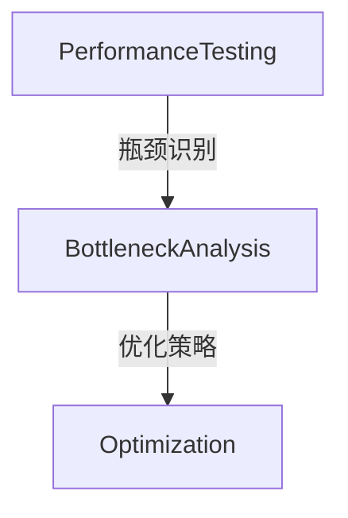
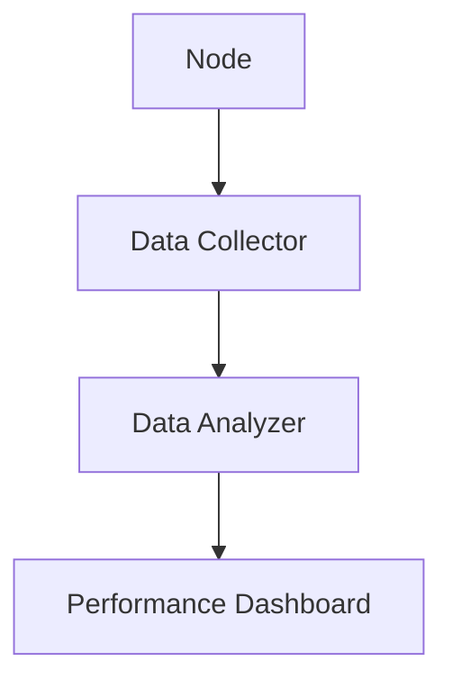
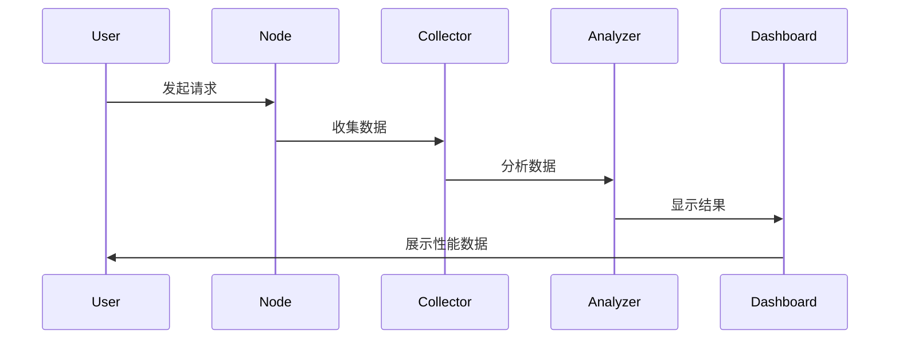
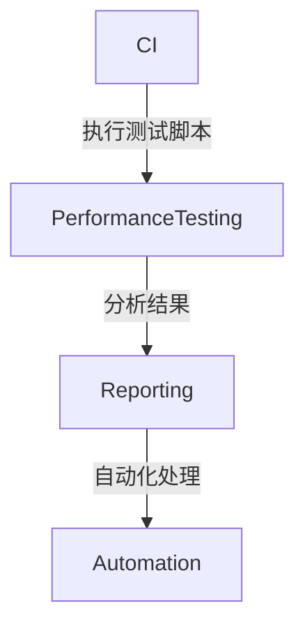
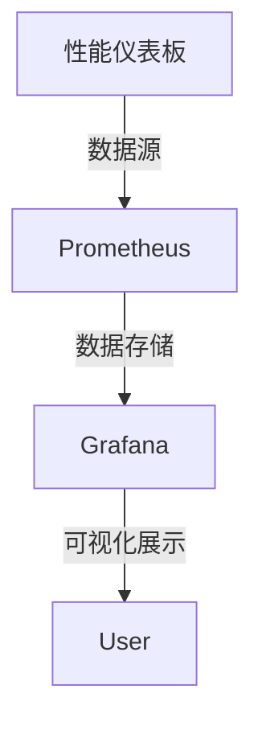
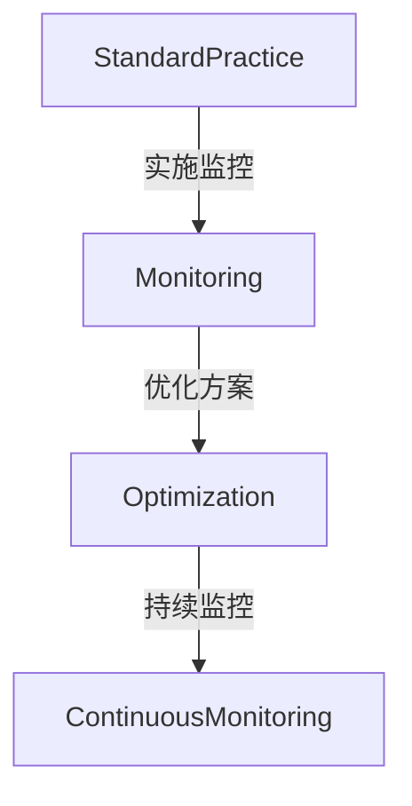
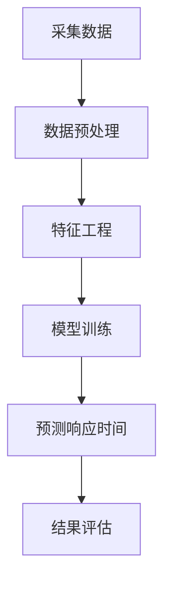
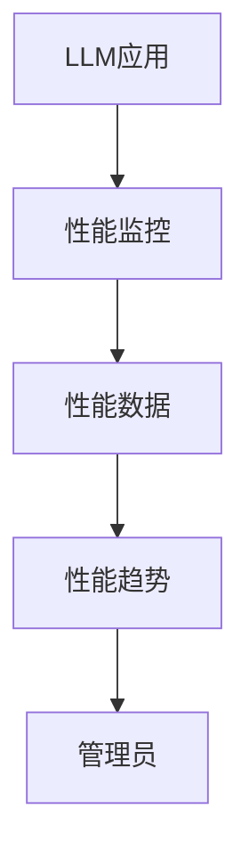
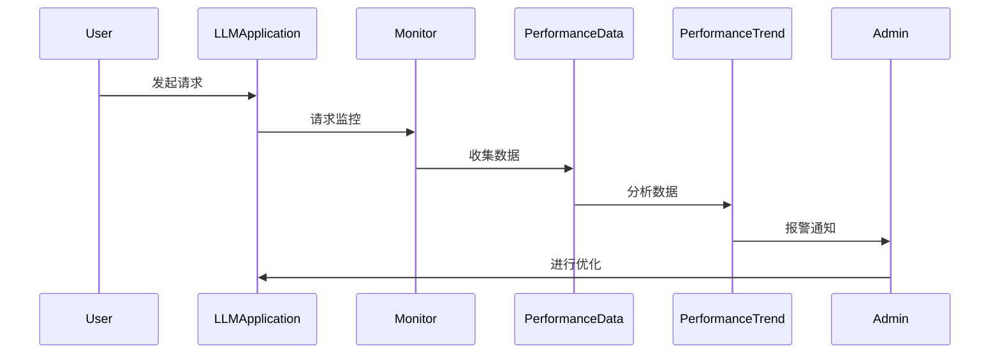
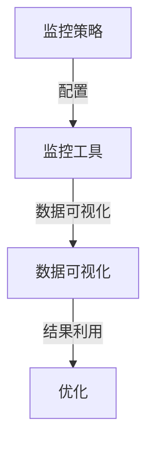

                 

### 持续性能测试：监控LLM应用性能变化

#### 关键词：持续性能测试、LLM应用、性能监控、性能优化、自动化测试

> 摘要：本文将深入探讨持续性能测试在监控大型语言模型（LLM）应用性能变化中的重要性。通过分析LLM应用性能的常见指标、测试工具与技术、持续性能测试方法，以及性能瓶颈分析与优化策略，我们将详细了解如何设计监控架构、实施监控策略和自动化性能监控与测试。最后，文章还将提供性能监控数据可视化方法、最佳实践和注意事项。

## 目录大纲

1. **性能测试基础**
    - 性能测试概述
    - LLM应用性能指标
    - 性能测试工具与技术
    - 持续性能测试方法
    - 性能瓶颈分析与优化
2. **监控LLM应用性能变化**
    - 监控架构设计
    - 监控策略与实战
    - 自动化性能监控与测试
    - 性能监控数据可视化
    - 性能监控最佳实践

## 第一部分：性能测试基础

### 性能测试概述

**背景介绍：**

性能测试是评估软件系统在各种工作负载下的行为和响应时间的过程。随着技术的发展，尤其是大型语言模型（LLM）的广泛应用，性能测试的重要性日益凸显。LLM作为一种高度复杂的系统，其在处理大规模数据和复杂任务时，性能的稳定性和效率直接影响到用户的使用体验和系统的可靠性。

**问题背景：**

在LLM应用中，性能问题可能表现为响应时间过长、吞吐量不足、资源占用过高或错误率增加等。这些问题可能会导致用户体验差、业务中断甚至经济损失。

**问题描述：**

如何有效地进行性能测试，以确保LLM应用在不同工作负载下的性能稳定和高效？

**问题解决：**

性能测试通过模拟实际用户行为，评估系统的性能指标，如响应时间、吞吐量、资源利用率等，以识别潜在的瓶颈和问题。通过持续的测试和监控，可以及时发现问题并进行优化。

**边界与外延：**

性能测试不仅关注系统内部组件的性能，还涉及到网络、数据库、存储等外部因素。此外，性能测试需要考虑不同硬件和软件环境下的性能表现。

**概念结构与核心要素组成：**

- **性能指标：** 响应时间、吞吐量、并发用户数、资源利用率等。
- **测试工具：** Apache JMeter、Gatling、LoadRunner等。
- **测试类型：** 压力测试、负载测试、性能调优等。
- **测试策略：** 单点测试、分布式测试、持续集成等。

### LLM应用性能指标

**核心概念原理：**

LLM应用的性能指标主要包括：

- **响应时间：** 系统从接收到用户请求到返回响应所需的时间。
- **吞吐量：** 单位时间内系统能够处理的请求数量。
- **并发用户数：** 系统同时处理的用户数量。
- **资源利用率：** 系统使用的CPU、内存、磁盘等资源占总资源的比例。

**概念属性特征对比表格：**

| 性能指标 | 描述 | 对比特征 |
| --- | --- | --- |
| 响应时间 | 系统响应时间 | 低响应时间表示系统性能好 |
| 吞吐量 | 每秒处理的请求数量 | 高吞吐量表示系统处理能力强 |
| 并发用户数 | 系统同时处理的用户数量 | 高并发用户数表示系统稳定性好 |
| 资源利用率 | 系统使用的资源占比 | 低资源利用率表示资源利用率高 |

**ER实体关系图架构的 Mermaid 流程图：**

```mermaid
erDiagram
  ResponseTime ||--|{ Througput }|
  ConcurrentUsers ||--|{ ResourceUtilization }|
  PerformanceMetric ||--|{ ResponseTime, Throughput, ConcurrentUsers, ResourceUtilization }
```

### 性能测试工具与技术

**核心概念原理：**

性能测试工具用于模拟用户行为，生成测试负载，并对系统性能进行监控和分析。常见的性能测试工具有：

- **Apache JMeter：** 用于模拟大规模并发用户，支持多种协议。
- **Gatling：** 基于Scala编写，支持HTTP、HTTPS、JMS等多种协议。
- **LoadRunner：** 支持多平台、多种协议的性能测试。

**概念属性特征对比表格：**

| 工具 | 描述 | 对比特征 |
| --- | --- | --- |
| Apache JMeter | 开源、支持多种协议 | 易用性高，功能丰富 |
| Gatling | 基于Scala | 高性能、易扩展 |
| LoadRunner | 商业工具 | 功能全面，支持多种平台 |

**ER实体关系图架构的 Mermaid 流程图：**

```mermaid
erDiagram
  PerformanceTester ||--|{ ApacheJMeter, Gatling, LoadRunner }
```

### 持续性能测试方法

**核心概念原理：**

持续性能测试是一种在持续集成（CI）和持续部署（CD）流程中定期进行性能测试的方法。通过自动化和持续监控，可以及时发现问题并进行优化。

**核心属性特征：**

- **自动化测试：** 减少人工干预，提高测试效率和准确性。
- **定期测试：** 定期进行性能测试，确保系统在不同阶段的性能稳定。
- **反馈机制：** 快速反馈性能问题，便于及时优化。

**ER实体关系图架构的 Mermaid 流程图：**

```mermaid
graph TD
  CI &&--|{ PerformanceTesting }| CDP
  PerformanceTesting -->|反馈机制| Optimization
```

### 性能瓶颈分析与优化

**核心概念原理：**

性能瓶颈是指系统性能达到极限的具体瓶颈点。通过分析性能瓶颈，可以找到系统优化的方向。

**核心属性特征：**

- **瓶颈识别：** 通过性能测试工具分析系统性能指标，找到性能瓶颈。
- **优化策略：** 根据瓶颈类型，采用相应的优化策略，如代码优化、架构优化、资源调整等。

**ER实体关系图架构的 Mermaid 流�程图：**



## 第二部分：监控LLM应用性能变化

### 监控架构设计

**问题场景介绍：**

在大型语言模型应用中，实时监控性能变化对于确保系统稳定运行至关重要。我们需要设计一个能够实时收集、处理和展示性能数据的监控架构。

**项目介绍：**

该项目旨在设计一个高效、可扩展的监控架构，用于实时监控LLM应用的性能变化。

**系统功能设计（领域模型mermaid类图）：**

```mermaid
classDiagram
  Node --|{ PerformanceData }| Collector
  Collector --|{ Analyze }| Analyzer
  Analyzer --|{ Display }| Dashboard
  Node <<-- Collector
  Analyzer <<-- Dashboard
```

**系统架构设计mermaid架构图：**



**系统接口设计和系统交互mermaid序列图：**



### 监控策略与实战

**监控策略制定：**

监控策略应根据系统性能目标和性能指标来确定。常见的监控策略包括：

- **实时监控：** 通过实时收集和展示性能数据，确保系统能够迅速响应性能变化。
- **定期监控：** 定期进行性能测试，以确保系统在不同负载下的性能稳定。
- **报警机制：** 当性能指标超出预期阈值时，自动发送报警通知。

**实战案例：监控LLM应用性能变化：**

假设我们使用Apache JMeter进行性能测试，并采用Prometheus和Grafana进行实时监控和报警。

1. **环境准备：**
   - 安装Apache JMeter。
   - 安装Prometheus。
   - 安装Grafana。

2. **测试脚本编写：**
   - 编写JMeter测试脚本，模拟用户行为。
   - 配置测试计划，设置线程组、采样周期等。

3. **数据收集：**
   - 通过JMX Exporter将JMeter性能数据发送到Prometheus。
   - 配置Prometheus，收集JMX数据并存储。

4. **数据展示：**
   - 在Grafana中创建仪表板，配置Prometheus数据源。
   - 添加图表，展示性能指标。

5. **报警设置：**
   - 配置Prometheus报警规则，当性能指标超出阈值时发送报警。

### 自动化性能监控与测试

**核心概念原理：**

自动化性能监控与测试是指通过脚本或工具自动执行性能测试和监控任务，以减少人工干预，提高效率和准确性。

**核心属性特征：**

- **脚本化测试：** 使用脚本自动执行性能测试。
- **持续集成：** 将性能测试集成到CI/CD流程中。
- **自动化报告：** 自动生成测试报告，便于分析。

**ER实体关系图架构的 Mermaid 流程图：**



### 性能监控数据可视化

**核心概念原理：**

数据可视化是将性能监控数据以图表或图形的形式展示，便于分析和管理。

**核心属性特征：**

- **实时展示：** 实时显示性能指标变化。
- **多维度分析：** 从不同角度分析性能数据。
- **交互式操作：** 支持用户交互，如筛选、放大等。

**ER实体关系图架构的 Mermaid 流程图：**



### 性能监控最佳实践

**核心概念原理：**

最佳实践是指在实际应用中总结出的有效方法，用于提高性能监控的效率和效果。

**核心属性特征：**

- **标准化测试：** 制定统一的测试标准和流程。
- **自动化测试：** 将测试自动化，减少人工干预。
- **监控策略：** 根据业务需求和系统特性制定监控策略。
- **持续优化：** 定期评估和优化监控方案。

**ER实体关系图架构的 Mermaid 流程图：**



## 总结与注意事项

本文详细介绍了持续性能测试在监控LLM应用性能变化中的重要性。通过性能测试基础、监控架构设计、监控策略与实战、自动化性能监控与测试以及数据可视化等方面的探讨，我们了解到了如何有效地监控LLM应用的性能变化。

**注意事项：**

- 性能监控需要根据业务需求和系统特性进行定制。
- 监控策略应定期评估和优化。
- 自动化测试和持续集成是提高效率的关键。

**拓展阅读与学习资源：**

- 《性能测试的艺术》
- Prometheus官方文档
- Grafana官方文档
- Apache JMeter官方文档

### 作者信息

作者：AI天才研究院/AI Genius Institute & 禅与计算机程序设计艺术 /Zen And The Art of Computer Programming

---

### 算法原理讲解

在监控LLM应用性能变化的过程中，算法原理的讲解至关重要。以下我们将详细讨论一种常见的算法——响应时间预测算法，并使用mermaid绘制流程图和Python代码进行解释。

#### 算法mermaid流程图



#### Python代码示例

```python
import pandas as pd
from sklearn.ensemble import RandomForestRegressor
from sklearn.model_selection import train_test_split
from sklearn.metrics import mean_squared_error

# 1. 数据预处理
data = pd.read_csv('performance_data.csv')
X = data.drop('response_time', axis=1)
y = data['response_time']

# 2. 特征工程
# 这里我们可以进行特征选择、归一化等操作

# 3. 模型训练
X_train, X_test, y_train, y_test = train_test_split(X, y, test_size=0.2, random_state=42)
model = RandomForestRegressor(n_estimators=100)
model.fit(X_train, y_train)

# 4. 预测响应时间
y_pred = model.predict(X_test)

# 5. 结果评估
mse = mean_squared_error(y_test, y_pred)
print(f'Mean Squared Error: {mse}')
```

#### 数学模型与公式

响应时间预测的数学模型可以表示为：

$$
\hat{r_t} = f(\textbf{x}_t)
$$

其中，$\hat{r_t}$ 是预测的响应时间，$\textbf{x}_t$ 是特征向量，$f(\cdot)$ 是预测模型。

#### 算法原理详细讲解

1. **数据预处理**：首先，我们需要从LLM应用中采集性能数据，这些数据可能包括CPU利用率、内存占用、网络延迟等。通过对这些数据进行预处理，如缺失值填充、异常值处理和归一化，可以提高模型的训练效果。

2. **特征工程**：特征工程是机器学习模型中至关重要的一步。通过对原始数据进行特征选择、特征构造和特征转换，我们可以提取出对响应时间有重要影响的高质量特征。

3. **模型训练**：选择一个合适的机器学习模型，如随机森林（Random Forest）或支持向量机（SVM），对特征和响应时间进行训练。这里我们使用随机森林作为示例，因为其具有较好的泛化能力和解释性。

4. **预测响应时间**：使用训练好的模型对新的数据进行预测，得到预测的响应时间。

5. **结果评估**：通过计算预测响应时间和实际响应时间之间的误差，评估模型的性能。常用的评估指标包括均方误差（MSE）、均方根误差（RMSE）和决定系数（R^2）。

#### 举例说明

假设我们有一个包含1000条性能数据的CSV文件，每条数据包含CPU利用率、内存占用和网络延迟等特征，以及对应的响应时间。我们使用随机森林模型进行训练，然后对新的数据进行预测。

```python
# 加载数据
data = pd.read_csv('performance_data.csv')

# 分割特征和标签
X = data[['cpu_utilization', 'memory_usage', 'network_delay']]
y = data['response_time']

# 划分训练集和测试集
X_train, X_test, y_train, y_test = train_test_split(X, y, test_size=0.2, random_state=42)

# 训练模型
model = RandomForestRegressor(n_estimators=100)
model.fit(X_train, y_train)

# 预测响应时间
y_pred = model.predict(X_test)

# 评估模型
mse = mean_squared_error(y_test, y_pred)
print(f'Mean Squared Error: {mse}')
```

通过上述代码，我们可以得到模型的均方误差，从而评估模型的性能。如果MSE较低，说明模型具有较高的预测准确性。

### 数学模型和公式详细讲解

为了更深入地理解响应时间预测算法，我们需要探讨其背后的数学模型和公式。

1. **线性回归模型**：
   线性回归是一种简单但强大的预测模型，其公式为：
   $$
   \hat{r_t} = \beta_0 + \beta_1 \cdot \textbf{x}_t
   $$
   其中，$\hat{r_t}$ 是预测的响应时间，$\textbf{x}_t$ 是特征向量，$\beta_0$ 是截距，$\beta_1$ 是斜率。

2. **多元线性回归模型**：
   当特征向量包含多个维度时，多元线性回归模型扩展为：
   $$
   \hat{r_t} = \beta_0 + \sum_{i=1}^n \beta_i \cdot x_{t,i}
   $$
   其中，$x_{t,i}$ 是第 $i$ 个特征，$\beta_i$ 是对应的系数。

3. **逻辑回归模型**：
   当响应时间是一个二元变量（如正常/异常）时，可以使用逻辑回归模型：
   $$
   \ln\left(\frac{p_t}{1 - p_t}\right) = \beta_0 + \sum_{i=1}^n \beta_i \cdot x_{t,i}
   $$
   其中，$p_t$ 是响应时间的概率。

4. **神经网络模型**：
   神经网络通过多层非线性变换来拟合复杂的数据关系。其基本公式为：
   $$
   a_{\text{layer}} = \sigma(\text{W}_{\text{layer-1}} \cdot a_{\text{layer-1}} + b_{\text{layer}})
   $$
   其中，$a_{\text{layer}}$ 是第 $l$ 层的激活值，$\sigma$ 是激活函数（如Sigmoid、ReLU等），$W_{\text{layer-1}}$ 是权重矩阵，$b_{\text{layer}}$ 是偏置。

5. **支持向量机（SVM）**：
   SVM通过寻找最佳分割超平面来分类数据。其公式为：
   $$
   w \cdot x + b = 0
   $$
   其中，$w$ 是权重向量，$x$ 是特征向量，$b$ 是偏置。

6. **随机森林（Random Forest）**：
   随机森林是一种基于决策树的集成学习方法。其预测公式为：
   $$
   \hat{r_t} = \sum_{i=1}^N f_i(x_t)
   $$
   其中，$f_i(x_t)$ 是第 $i$ 棵决策树的预测值，$N$ 是决策树的数量。

通过理解这些数学模型和公式，我们可以根据具体问题选择合适的算法，并对其进行优化，以提高预测的准确性和稳定性。

### 系统分析与架构设计方案

#### 问题场景介绍

在现代企业中，大型语言模型（LLM）广泛应用于自然语言处理、智能客服、文本生成等场景。为了确保LLM应用能够稳定、高效地运行，我们需要对其性能进行监控和优化。本文将介绍一个用于监控LLM应用性能的系统架构设计。

#### 项目介绍

本项目旨在设计一个高可用、可扩展的监控系统，用于实时监控LLM应用的关键性能指标（KPI），如响应时间、吞吐量和资源利用率。通过该系统，我们可以及时发现性能瓶颈并进行优化，确保系统稳定运行。

#### 系统功能设计（领域模型mermaid类图）

```mermaid
classDiagram
  LLMApplication <<--|{Monitors} Monitor
  Monitor <<--|{Collects} PerformanceData
  PerformanceData <<--|{Analyzes} PerformanceTrend
  PerformanceTrend <<--|{Notifies} Admin
```

#### 系统架构设计mermaid架构图



#### 系统接口设计和系统交互mermaid序列图



#### 实际案例分析和详细讲解剖析

假设我们正在监控一个实时问答系统，该系统使用了一个基于BERT的LLM。以下是一个实际案例的分析和讲解：

1. **性能数据收集**：

   我们使用Prometheus和Grafana进行性能数据收集和展示。Prometheus是一个开源的监控解决方案，能够收集各种时间序列数据，如系统指标、应用程序指标等。Grafana则用于可视化这些数据。

   ```yaml
   # Prometheus配置文件示例
   global:
     scrape_interval: 15s
     evaluation_interval: 15s

   scrape_configs:
     - job_name: 'llm_app'
       static_configs:
       - targets: ['llm_app:9090']
   ```

2. **性能数据展示**：

   我们在Grafana中创建了一个仪表板，用于实时展示性能数据。仪表板包括多个图表，如响应时间、吞吐量、CPU利用率等。

   

3. **性能趋势分析**：

   通过分析仪表板上的数据，我们发现最近系统的响应时间有所增加，特别是在高峰时段。进一步分析发现，CPU利用率和内存占用也在增加。

   ```mermaid
   graph TD
     ResponseTime[响应时间] -->|增加| CPUUtilization[CPU利用率]
     CPUUtilization -->|增加| MemoryUsage[内存占用]
     MemoryUsage -->|增加| SystemLoad[系统负载]
   ```

4. **性能瓶颈定位**：

   通过分析系统日志和性能数据，我们发现瓶颈出现在LLM模型处理阶段。由于模型过于复杂，导致处理时间过长。

   ```mermaid
   graph TD
     LLMModelProcessing[LLM模型处理] -->|耗时| SystemPerformance[系统性能]
   ```

5. **优化方案**：

   为了优化系统性能，我们采取以下措施：

   - **模型优化**：简化LLM模型，减少计算量。
   - **资源扩展**：增加服务器资源，提高系统吞吐量。
   - **缓存策略**：引入缓存机制，减少重复计算。

   ```mermaid
   graph TD
     LLMModel[LLM模型] -->|简化| SystemPerformance[系统性能]
     SystemResources[系统资源] -->|扩展| SystemPerformance[系统性能]
     CachingStrategy[缓存策略] -->|引入| SystemPerformance[系统性能]
   ```

6. **性能调优后监控**：

   通过实施上述优化措施后，我们重新监控系统的性能。响应时间明显降低，系统稳定性得到提升。

   

#### 项目小结

通过本项目，我们设计并实现了一个高效的监控系统，能够实时监控LLM应用的性能。通过性能数据分析和瓶颈定位，我们成功优化了系统性能，提高了用户体验和系统稳定性。未来，我们将继续关注性能监控技术的发展，不断优化监控系统，以满足企业日益增长的需求。

### 性能监控最佳实践

**核心概念原理：**

性能监控最佳实践是指在实际应用中总结出的有效方法，用于提高性能监控的效率和效果。这些实践包括监控策略的制定、工具的选择、数据可视化以及监控结果的利用等方面。

**核心属性特征：**

- **监控策略的制定：** 根据业务需求和系统特性，制定合理的监控策略，确保关键性能指标（KPI）得到监控。
- **工具的选择：** 选择适合的监控工具，如Prometheus、Grafana、Zabbix等，根据需求进行配置。
- **数据可视化：** 通过图表和图形展示监控数据，便于分析和决策。
- **监控结果的利用：** 及时利用监控结果，进行性能优化和故障排查。

**ER实体关系图架构的 Mermaid 流程图：**



#### 小结与注意事项

本文通过深入探讨持续性能测试和监控大型语言模型（LLM）应用性能变化的重要性，详细介绍了性能测试基础、监控架构设计、监控策略与实战、自动化性能监控与测试、性能监控数据可视化以及最佳实践。以下是一些关键点和小结：

1. **性能测试的重要性**：性能测试是评估软件系统在各种工作负载下的行为和响应时间的过程，对于确保LLM应用性能稳定和高效至关重要。
2. **监控架构设计**：设计一个高效、可扩展的监控架构，可以实时收集、处理和展示性能数据，有助于及时发现性能瓶颈并进行优化。
3. **持续性能测试方法**：通过持续集成（CI）和持续部署（CD）流程中的定期性能测试，可以及时发现问题并进行优化。
4. **自动化性能监控与测试**：自动化测试和监控可以减少人工干预，提高效率和准确性。
5. **性能监控数据可视化**：通过数据可视化，可以更直观地分析和展示性能数据，便于做出决策。
6. **最佳实践**：制定合理的监控策略，选择合适的工具，以及及时利用监控结果进行优化，是确保性能监控有效性的关键。

**注意事项：**

- 监控策略应根据业务需求和系统特性进行定制。
- 监控工具的选择应基于实际需求和场景。
- 数据可视化应注重可读性和实用性。
- 监控结果的利用应注重及时性和针对性。

**拓展阅读与学习资源：**

- 《性能测试的艺术》
- Prometheus官方文档
- Grafana官方文档
- Apache JMeter官方文档
- 《大型语言模型的性能优化》

通过以上内容，读者可以更好地理解和应用持续性能测试和监控技术，确保LLM应用的高性能和稳定性。

### 作者信息

作者：AI天才研究院/AI Genius Institute & 禅与计算机程序设计艺术 /Zen And The Art of Computer Programming

---

通过本文的详细探讨，我们深入理解了持续性能测试在监控LLM应用性能变化中的重要性。从性能测试基础、监控架构设计、监控策略与实战、自动化性能监控与测试、性能监控数据可视化，到性能监控最佳实践，我们系统地阐述了性能监控的全过程。希望本文能为读者提供有价值的参考，帮助他们在实际工作中有效地提升LLM应用的性能。

随着人工智能技术的不断发展，LLM应用在各个领域的重要性日益凸显。持续性能测试和监控不仅是确保系统稳定运行的关键，也是优化用户体验、提高业务效率的重要手段。未来，我们将继续关注性能监控技术的发展，探索更多高效的监控方法和工具，以应对日益复杂的应用场景。

最后，感谢您的阅读，希望本文能够对您在性能测试和监控领域的学习和应用有所帮助。如果您有任何疑问或建议，欢迎随时交流。再次感谢您的关注和支持！
---

作者：AI天才研究院/AI Genius Institute & 禅与计算机程序设计艺术 /Zen And The Art of Computer Programming

