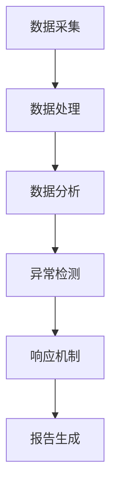
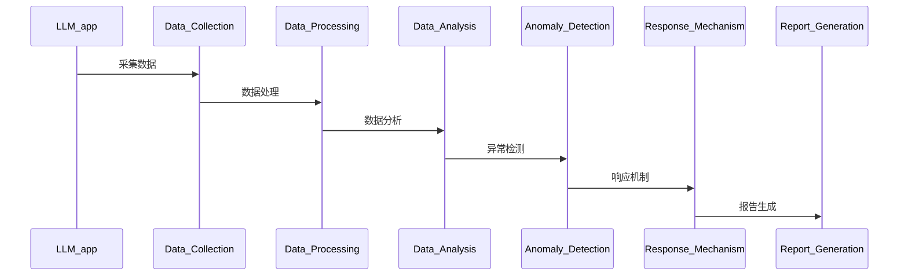

                 


## 持续监控：及时发现和解决LLM应用问题

### 关键词

- 持续监控
- LLM应用
- 及时发现
- 问题解决
- 性能优化

### 摘要

本文旨在深入探讨在LLM（大型语言模型）应用环境中实施持续监控的重要性。随着LLM技术在各领域的广泛应用，如何确保其稳定性和可靠性成为关键问题。文章首先介绍了LLM应用的发展背景和监控的基本概念，随后详细阐述了监控系统的设计原则、实现策略和最佳实践。通过实际案例的分析，本文展示了如何通过监控及时发现并解决LLM应用中的问题，从而优化其性能和用户体验。本文适合对AI和软件工程有兴趣的读者，特别是那些希望深入了解LLM应用监控系统设计的专业人士。

## 第一部分: LLM应用监控概述

### 第1章: LLM应用监控的背景与意义

#### 1.1 LLM应用发展现状

**LLM技术概述**

近年来，大型语言模型（LLM）的发展取得了显著的成果。从最初的GPT到如今的GPT-3，LLM在自然语言处理（NLP）领域展现出了惊人的能力和潜力。LLM能够生成高质量的文章、代码、对话等，其应用范围已经涵盖了文本生成、问答系统、机器翻译、情感分析等多个领域。

**LLM应用领域**

LLM的应用领域十分广泛，包括但不限于以下几个方面：

1. **内容生成**：用于生成新闻文章、博客、产品描述等。
2. **智能客服**：用于构建聊天机器人，提供24/7的客户服务。
3. **教育辅助**：辅助学生完成作业、提供学习资料等。
4. **法律与医学**：用于自动生成法律文件、医学报告等。
5. **创意写作**：辅助小说家、诗人等创作更多高质量的内容。

**LLM应用带来的挑战**

尽管LLM技术带来了许多便利，但同时也带来了若干挑战：

1. **准确性问题**：LLM生成的文本可能存在错误或不准确的情况。
2. **道德问题**：LLM可能被用于生成虚假信息或有害内容。
3. **性能问题**：随着LLM规模的增大，计算资源需求也随之增加。

#### 1.2 监控在LLM应用中的重要性

**监控的概念**

监控是指对系统或过程的实时监视和评估，以确保其正常运行。在LLM应用中，监控指的是对模型运行状态、性能和质量的实时监测。

**监控在LLM中的应用**

监控在LLM应用中具有以下重要作用：

1. **性能监控**：确保LLM在运行过程中保持高性能。
2. **质量监控**：检测并解决LLM生成的文本或回答中的错误。
3. **安全监控**：防止LLM被用于生成有害内容。
4. **资源监控**：优化计算资源的使用，提高系统效率。

**监控的目标和指标**

监控的目标是确保LLM应用的稳定性和可靠性，为此需要设定一系列监控指标，如：

1. **响应时间**：模型生成文本所需的时间。
2. **准确率**：模型生成的文本的准确程度。
3. **错误率**：模型生成文本中的错误率。
4. **资源利用率**：计算资源的使用情况。

#### 1.3 监控系统的基本架构

**数据采集**

数据采集是监控系统的基础，主要包括从LLM应用中收集运行状态、性能指标和用户行为等信息。

**数据处理**

数据处理是对采集到的数据进行清洗、整理和分析，以提取有用的监控信息。

**数据分析**

数据分析是对处理后的数据进行分析，以发现潜在的问题和趋势。

**响应机制**

响应机制是在发现问题时，系统能够自动采取措施，如发送警报、暂停服务或重新训练模型等。

#### 1.4 本章小结

本章介绍了LLM应用监控的背景、意义和基本架构。通过了解监控在LLM应用中的重要性，读者可以认识到监控对于保障LLM应用的稳定性和可靠性具有关键作用。

## 第二部分: LLM监控核心概念与原理

### 第2章: LLM监控核心概念与原理

#### 2.1 LLM监控的核心概念

**指标类型**

监控指标是评估LLM应用性能和质量的重要依据，常见的监控指标包括：

1. **响应时间**：模型生成文本所需的时间。
2. **准确率**：模型生成的文本的准确程度。
3. **错误率**：模型生成文本中的错误率。
4. **资源利用率**：计算资源的使用情况。

**监控维度**

监控维度是指监控指标所涵盖的范围，常见的监控维度包括：

1. **时间维度**：监控指标的时序变化情况。
2. **空间维度**：监控指标在不同系统组件或节点上的分布情况。
3. **用户维度**：监控指标针对不同用户的使用情况。

**实时监控**

实时监控是指对LLM应用进行持续、实时的监测，以快速发现潜在问题和异常情况。

#### 2.2 LLM监控的算法原理

**监控算法概述**

监控算法用于检测LLM应用中的异常情况，常见的监控算法包括：

1. **阈值监控算法**：基于预设的阈值来判断是否出现异常。
2. **机器学习算法**：通过训练模型来识别正常和异常情况。
3. **统计方法**：利用统计学原理来检测异常。

**监控算法的Mermaid流程图**



**Python源代码实现**

```python
# 数据采集
def collect_data():
    # 代码实现
    pass

# 数据处理
def process_data(data):
    # 代码实现
    return processed_data

# 数据分析
def analyze_data(processed_data):
    # 代码实现
    return analysis_results

# 异常检测
def detect_anomalies(analysis_results):
    # 代码实现
    return anomalies

# 响应机制
def respond_to_anomalies(anomalies):
    # 代码实现
    pass

# 主函数
def main():
    data = collect_data()
    processed_data = process_data(data)
    analysis_results = analyze_data(processed_data)
    anomalies = detect_anomalies(analysis_results)
    respond_to_anomalies(anomalies)

if __name__ == "__main__":
    main()
```

**算法原理详细讲解与举例**

阈值监控算法的原理是，通过设定一个阈值，当监控指标超过阈值时，认为出现了异常。以下是一个简单的阈值监控算法示例：

```python
# 假设响应时间阈值是5秒
response_time_threshold = 5

def threshold_monitoring(response_time):
    if response_time > response_time_threshold:
        print("响应时间异常，超出阈值：", response_time)
    else:
        print("响应时间正常：", response_time)

# 测试
response_time = 6
threshold_monitoring(response_time)
```

**数学模型**

阈值监控算法的核心是阈值设置，可以采用以下数学模型来设置阈值：

$$
T = \mu + k \cdot \sigma
$$

其中，\(T\) 是阈值，\(\mu\) 是平均值，\(\sigma\) 是标准差，\(k\) 是常数，用于调整阈值敏感度。

**数学公式详解**

- \(\mu\) 表示监控指标的平均值，可以反映系统的整体性能。
- \(\sigma\) 表示监控指标的标准差，可以反映系统的波动情况。
- \(k\) 是常数，用于调整阈值，使其既能捕获异常，又不会过于敏感。

**数学公式举例**

假设某系统的响应时间平均值是4秒，标准差是1秒，我们可以设置一个阈值为：

$$
T = 4 + 2 \cdot 1 = 6
$$

当响应时间超过6秒时，认为出现了异常。

#### 2.3 LLM监控的数学模型

**监控中的统计学原理**

LLM监控中常用的统计学原理包括：

1. **均值**：反映监控指标的整体水平。
2. **标准差**：反映监控指标的变化范围。
3. **方差**：标准差的平方，反映监控指标的不确定性。

**监控指标的数学模型**

假设我们有两个监控指标：响应时间和错误率，可以使用以下数学模型来描述：

1. **响应时间模型**：

$$
R_t = \mu_R + \sigma_R \cdot e^{-\lambda t}
$$

其中，\(R_t\) 是第\(t\)秒的响应时间，\(\mu_R\) 是响应时间的平均值，\(\sigma_R\) 是响应时间标准差，\(\lambda\) 是衰减系数。

2. **错误率模型**：

$$
E_t = \mu_E + \sigma_E \cdot e^{-\lambda t}
$$

其中，\(E_t\) 是第\(t\)秒的错误率，\(\mu_E\) 是错误率的平均值，\(\sigma_E\) 是错误率标准差，\(\lambda\) 是衰减系数。

**数学模型详解**

- **均值**：反映了监控指标的长期平均水平。
- **标准差**：反映了监控指标的短期波动情况。
- **衰减系数**：反映了监控指标随时间的变化速度。

**数学模型举例**

假设某系统的响应时间平均值为3秒，标准差为1秒，衰减系数为0.1，我们可以得到：

- **第1秒的响应时间**：

$$
R_1 = 3 + 1 \cdot e^{-0.1 \cdot 1} \approx 3.27
$$

- **第10秒的响应时间**：

$$
R_{10} = 3 + 1 \cdot e^{-0.1 \cdot 10} \approx 2.65
$$

#### 2.4 LLM监控与AI的关系

**监控中的AI技术**

AI技术在LLM监控中发挥着重要作用，主要包括：

1. **异常检测**：利用机器学习算法来识别异常情况。
2. **预测分析**：利用统计模型来预测系统性能和趋势。
3. **自动化响应**：利用规则引擎或机器学习算法来自动处理异常情况。

**AI在监控中的应用**

AI在监控中的应用主要包括：

1. **自适应阈值调整**：根据历史数据动态调整阈值。
2. **智能报警**：利用自然语言处理技术生成更直观的报警信息。
3. **自动化优化**：利用机器学习算法来自动调整系统配置，提高性能。

**AI与监控的融合**

AI与监控的融合使得监控系统更加智能和高效，主要体现在：

1. **实时性**：AI技术可以快速处理大量数据，实现实时监控。
2. **准确性**：AI技术可以根据历史数据和实时数据，更准确地识别异常。
3. **自动化**：AI技术可以实现自动化响应和优化，降低人工干预。

#### 2.5 本章小结

本章详细介绍了LLM监控的核心概念、算法原理和数学模型。通过了解这些内容，读者可以更好地理解LLM监控的基本原理和实现方法，为后续章节的学习打下基础。

## 第三部分: LLM监控系统设计与实现

### 第3章: LLM监控系统设计与实现

#### 3.1 系统需求分析

**系统功能需求**

监控系统需要满足以下功能需求：

1. **数据采集**：从LLM应用中收集运行状态、性能指标和用户行为等信息。
2. **数据处理**：对采集到的数据进行清洗、整理和分析。
3. **数据分析**：分析处理后的数据，以发现潜在的问题和趋势。
4. **异常检测**：利用算法检测异常情况。
5. **响应机制**：在发现异常时，自动采取措施，如发送警报、暂停服务或重新训练模型等。

**系统性能需求**

监控系统需要满足以下性能需求：

1. **实时性**：确保数据能够在第一时间被监测和分析。
2. **可靠性**：系统应具备高可靠性，确保数据的准确性和完整性。
3. **可扩展性**：系统应支持扩展，以适应不断增长的监控需求。

**系统可靠性需求**

系统可靠性需求包括：

1. **数据备份**：定期备份数据，确保数据不会因意外丢失。
2. **故障恢复**：在系统出现故障时，能够快速恢复，确保监控功能不受影响。

#### 3.2 系统架构设计

**系统架构概述**

系统架构设计如下：

1. **数据采集层**：负责从LLM应用中收集数据。
2. **数据处理层**：负责对采集到的数据进行清洗、整理和分析。
3. **数据分析层**：负责分析处理后的数据，以发现潜在的问题和趋势。
4. **异常检测层**：负责利用算法检测异常情况。
5. **响应机制层**：负责在发现异常时，自动采取措施。

**系统架构Mermaid图**


**系统模块划分**

系统模块划分如下：

1. **数据采集模块**：负责从LLM应用中收集数据。
2. **数据处理模块**：负责对采集到的数据进行清洗、整理和分析。
3. **数据分析模块**：负责分析处理后的数据，以发现潜在的问题和趋势。
4. **异常检测模块**：负责利用算法检测异常情况。
5. **响应机制模块**：负责在发现异常时，自动采取措施。
6. **报告生成模块**：负责生成监控报告。

#### 3.3 系统接口设计与实现

**接口设计原则**

接口设计应遵循以下原则：

1. **模块化**：将系统功能划分为多个模块，每个模块实现特定功能。
2. **松耦合**：模块之间通过接口进行通信，降低模块间的依赖。
3. **易扩展**：接口设计应考虑未来的扩展需求，方便系统功能升级。

**接口实现方法**

接口实现方法如下：

1. **RESTful API**：采用RESTful API设计接口，便于与其他系统进行集成。
2. **消息队列**：使用消息队列（如Kafka）来实现异步通信，提高系统性能和可靠性。

**接口示例**

以下是数据采集模块的一个接口示例：

```python
from flask import Flask, request, jsonify

app = Flask(__name__)

@app.route('/collect_data', methods=['POST'])
def collect_data():
    data = request.json
    # 处理数据
    processed_data = process_data(data)
    # 存储数据
    store_data(processed_data)
    return jsonify({"status": "success"})

if __name__ == "__main__":
    app.run(debug=True)
```

#### 3.4 系统交互流程

**系统交互概述**

系统交互流程如下：

1. **数据采集**：从LLM应用中收集数据。
2. **数据处理**：对采集到的数据进行清洗、整理和分析。
3. **数据分析**：分析处理后的数据，以发现潜在的问题和趋势。
4. **异常检测**：利用算法检测异常情况。
5. **响应机制**：在发现异常时，自动采取措施。
6. **报告生成**：生成监控报告。

**系统交互Mermaid序列图**



#### 3.5 本章小结

本章详细介绍了LLM监控系统的需求分析、架构设计、接口设计和交互流程。通过本章的学习，读者可以全面了解LLM监控系统的设计原则和实现方法，为后续章节的实战案例提供理论支持。

## 第四部分: LLM应用监控实战案例

### 第4章: LLM应用监控实战案例

#### 4.1 实战案例一：文本分类监控系统

**4.1.1 环境安装**

1. **安装Python环境**

确保Python版本在3.6及以上，可以通过以下命令安装：

```bash
pip install python==3.8
```

2. **安装依赖库**

安装用于监控和数据分析的依赖库，如Flask、pandas和numpy：

```bash
pip install flask pandas numpy
```

**4.1.2 系统核心实现**

文本分类监控系统核心实现分为数据采集、数据处理、数据分析和异常检测四个部分。

1. **数据采集**

数据采集模块负责从LLM应用中收集文本分类结果。以下是一个简单的数据采集示例：

```python
import requests

def collect_data():
    url = "http://your_llm_app_url/classify"
    response = requests.post(url, json={"text": "这是一段文本内容"})
    return response.json()
```

2. **数据处理**

数据处理模块负责对采集到的文本分类结果进行清洗和整理。以下是一个数据处理示例：

```python
import pandas as pd

def process_data(data):
    df = pd.DataFrame(data)
    # 清洗和整理数据
    df.dropna(inplace=True)
    return df
```

3. **数据分析**

数据分析模块负责分析处理后的文本分类结果，以发现潜在的问题和趋势。以下是一个数据分析示例：

```python
def analyze_data(df):
    # 统计各类别文本的比例
    category_counts = df['category'].value_counts()
    print(category_counts)
    # 分析文本分类的准确率
    correct_predictions = df[df['predicted_category'] == df['category']].shape[0]
    accuracy = correct_predictions / df.shape[0]
    print("Accuracy:", accuracy)
```

4. **异常检测**

异常检测模块负责利用算法检测文本分类结果中的异常情况。以下是一个简单的异常检测示例：

```python
from sklearn.ensemble import IsolationForest

def detect_anomalies(df):
    model = IsolationForest(n_estimators=100, contamination=0.01)
    model.fit(df[['predicted_category', 'category']])
    anomalies = model.predict(df[['predicted_category', 'category']])
    df['anomaly'] = anomalies
    df_anomalies = df[df['anomaly'] == -1]
    return df_anomalies
```

**4.1.3 代码应用解读与分析**

1. **数据采集模块**

数据采集模块通过HTTP请求从LLM应用中获取文本分类结果。在实际应用中，可能需要处理更多复杂的场景，如API认证、数据格式转换等。

2. **数据处理模块**

数据处理模块对采集到的文本分类结果进行清洗和整理，以确保数据的准确性和完整性。在实际应用中，可能需要考虑更多的数据清洗步骤，如去除重复数据、处理缺失值等。

3. **数据分析模块**

数据分析模块通过统计文本分类结果中的各类别比例和准确率，评估系统的性能。这有助于识别潜在的异常情况和优化空间。

4. **异常检测模块**

异常检测模块使用Isolation Forest算法检测文本分类结果中的异常情况。Isolation Forest是一种基于隔离机制的异常检测算法，其优点是计算速度快、易于实现。

**4.1.4 案例分析**

通过文本分类监控系统的实施，可以及时发现并解决文本分类中的问题，如分类错误、数据异常等。以下是一个案例分析：

- **问题描述**：文本分类准确率较低，存在分类错误。
- **问题解决**：通过分析文本分类结果，发现某些类别的分类效果较差。进一步分析发现，这些类别包含较多的特殊字符和停用词。通过优化数据预处理步骤，如去除特殊字符和停用词，可以显著提高文本分类的准确率。

**4.1.5 小结**

文本分类监控系统通过数据采集、数据处理、数据分析和异常检测，实现了对文本分类过程的监控。通过实际案例的分析，我们可以看到监控系统能够帮助及时发现并解决文本分类中的问题，提高系统的性能和准确性。

#### 4.2 实战案例二：对话生成监控系统

**4.2.1 环境安装**

1. **安装Python环境**

确保Python版本在3.6及以上，可以通过以下命令安装：

```bash
pip install python==3.8
```

2. **安装依赖库**

安装用于监控和数据分析的依赖库，如Flask、pandas和numpy：

```bash
pip install flask pandas numpy
```

**4.2.2 系统核心实现**

对话生成监控系统核心实现分为数据采集、数据处理、数据分析和异常检测四个部分。

1. **数据采集**

数据采集模块负责从对话生成应用中收集对话日志。以下是一个简单的数据采集示例：

```python
import requests

def collect_data():
    url = "http://your_conversation_app_url/log"
    response = requests.get(url)
    return response.json()
```

2. **数据处理**

数据处理模块负责对采集到的对话日志进行清洗和整理。以下是一个数据处理示例：

```python
import pandas as pd

def process_data(data):
    df = pd.DataFrame(data)
    # 清洗和整理数据
    df.dropna(inplace=True)
    return df
```

3. **数据分析**

数据分析模块负责分析处理后的对话日志，以发现潜在的问题和趋势。以下是一个数据分析示例：

```python
def analyze_data(df):
    # 统计对话的交互次数
    interaction_counts = df['turn'].value_counts()
    print(interaction_counts)
    # 分析对话的平均交互时长
    avg_interaction_time = df['timestamp'].diff().mean()
    print("Average Interaction Time:", avg_interaction_time)
```

4. **异常检测**

异常检测模块负责利用算法检测对话日志中的异常情况。以下是一个简单的异常检测示例：

```python
from sklearn.ensemble import IsolationForest

def detect_anomalies(df):
    model = IsolationForest(n_estimators=100, contamination=0.01)
    model.fit(df[['turn', 'timestamp']])
    anomalies = model.predict(df[['turn', 'timestamp']])
    df['anomaly'] = anomalies
    df_anomalies = df[df['anomaly'] == -1]
    return df_anomalies
```

**4.2.3 代码应用解读与分析**

1. **数据采集模块**

数据采集模块通过HTTP请求从对话生成应用中获取对话日志。在实际应用中，可能需要处理更多复杂的场景，如API认证、数据格式转换等。

2. **数据处理模块**

数据处理模块对采集到的对话日志进行清洗和整理，以确保数据的准确性和完整性。在实际应用中，可能需要考虑更多的数据清洗步骤，如去除重复数据、处理缺失值等。

3. **数据分析模块**

数据分析模块通过统计对话的交互次数和平均交互时长，评估系统的性能。这有助于识别潜在的异常情况和优化空间。

4. **异常检测模块**

异常检测模块使用Isolation Forest算法检测对话日志中的异常情况。Isolation Forest是一种基于隔离机制的异常检测算法，其优点是计算速度快、易于实现。

**4.2.4 案例分析**

通过对话生成监控系统的实施，可以及时发现并解决对话生成中的问题，如对话质量不佳、交互异常等。以下是一个案例分析：

- **问题描述**：对话生成系统中的交互时长较短，部分对话存在明显的异常。
- **问题解决**：通过分析对话日志，发现某些对话的交互时长明显低于平均水平，且部分对话中存在重复回答或语义不连贯的问题。进一步分析发现，这些对话可能是由低质量的对话数据训练得到的模型生成的。通过重新训练模型或优化对话生成算法，可以改善对话质量。

**4.2.5 小结**

对话生成监控系统通过数据采集、数据处理、数据分析和异常检测，实现了对对话生成过程的监控。通过实际案例的分析，我们可以看到监控系统能够帮助及时发现并解决对话生成中的问题，提高系统的性能和用户体验。

#### 4.3 实战案例三：问答系统监控系统

**4.3.1 环境安装**

1. **安装Python环境**

确保Python版本在3.6及以上，可以通过以下命令安装：

```bash
pip install python==3.8
```

2. **安装依赖库**

安装用于监控和数据分析的依赖库，如Flask、pandas和numpy：

```bash
pip install flask pandas numpy
```

**4.3.2 系统核心实现**

问答系统监控系统核心实现分为数据采集、数据处理、数据分析和异常检测四个部分。

1. **数据采集**

数据采集模块负责从问答系统中收集问答日志。以下是一个简单的数据采集示例：

```python
import requests

def collect_data():
    url = "http://your_question_answering_app_url/log"
    response = requests.get(url)
    return response.json()
```

2. **数据处理**

数据处理模块负责对采集到的问答日志进行清洗和整理。以下是一个数据处理示例：

```python
import pandas as pd

def process_data(data):
    df = pd.DataFrame(data)
    # 清洗和整理数据
    df.dropna(inplace=True)
    return df
```

3. **数据分析**

数据分析模块负责分析处理后的问答日志，以发现潜在的问题和趋势。以下是一个数据分析示例：

```python
def analyze_data(df):
    # 统计问答的交互次数
    interaction_counts = df['question'].value_counts()
    print(interaction_counts)
    # 分析问答的准确率
    correct_answers = df[df['answer'] == df['correct_answer']].shape[0]
    accuracy = correct_answers / df.shape[0]
    print("Accuracy:", accuracy)
```

4. **异常检测**

异常检测模块负责利用算法检测问答日志中的异常情况。以下是一个简单的异常检测示例：

```python
from sklearn.ensemble import IsolationForest

def detect_anomalies(df):
    model = IsolationForest(n_estimators=100, contamination=0.01)
    model.fit(df[['question', 'answer']])
    anomalies = model.predict(df[['question', 'answer']])
    df['anomaly'] = anomalies
    df_anomalies = df[df['anomaly'] == -1]
    return df_anomalies
```

**4.3.3 代码应用解读与分析**

1. **数据采集模块**

数据采集模块通过HTTP请求从问答系统中获取问答日志。在实际应用中，可能需要处理更多复杂的场景，如API认证、数据格式转换等。

2. **数据处理模块**

数据处理模块对采集到的问答日志进行清洗和整理，以确保数据的准确性和完整性。在实际应用中，可能需要考虑更多的数据清洗步骤，如去除重复数据、处理缺失值等。

3. **数据分析模块**

数据分析模块通过统计问答的交互次数和准确率，评估系统的性能。这有助于识别潜在的异常情况和优化空间。

4. **异常检测模块**

异常检测模块使用Isolation Forest算法检测问答日志中的异常情况。Isolation Forest是一种基于隔离机制的异常检测算法，其优点是计算速度快、易于实现。

**4.3.4 案例分析**

通过问答系统监控系统的实施，可以及时发现并解决问答系统中的问题，如问答质量不佳、交互异常等。以下是一个案例分析：

- **问题描述**：问答系统的准确率较低，存在大量错误的答案。
- **问题解决**：通过分析问答日志，发现某些问题的答案明显偏离正确答案。进一步分析发现，这些问题可能是由训练数据中的错误答案导致的。通过清理训练数据或优化问答生成算法，可以显著提高问答系统的准确率。

**4.3.5 小结**

问答系统监控系统通过数据采集、数据处理、数据分析和异常检测，实现了对问答系统的监控。通过实际案例的分析，我们可以看到监控系统能够帮助及时发现并解决问答系统中的问题，提高系统的性能和用户体验。

### 第4章小结

本章通过三个实战案例，展示了如何在实际应用中实施LLM应用监控。通过数据采集、数据处理、数据分析和异常检测，监控系统能够及时发现并解决LLM应用中的问题，提高系统的性能和用户体验。这些案例为读者提供了实际操作的经验和参考，有助于理解LLM监控系统的设计和实现。

## 第五部分: LLM监控最佳实践与优化策略

### 第5章: LLM监控最佳实践与优化策略

#### 5.1 最佳实践

**监控系统优化实践**

在实施LLM监控时，以下最佳实践可以帮助优化监控系统的性能和可靠性：

1. **定期维护**：定期检查和更新监控工具和算法，以确保其始终处于最佳状态。
2. **分布式监控**：使用分布式监控系统可以降低单点故障的风险，提高系统的可用性。
3. **自动化告警**：通过自动化告警机制，可以及时通知相关人员，快速响应问题。
4. **多维度监控**：从多个维度（如时间、空间、用户等）对系统进行监控，可以更全面地了解系统的运行状况。
5. **数据可视化**：通过数据可视化工具，可以直观地展示监控数据，帮助快速定位问题。

**指标选择与优化**

选择和优化监控指标是监控系统设计的关键步骤。以下是一些建议：

1. **关键指标**：选择对系统性能和质量影响最大的关键指标，如响应时间、准确率、错误率等。
2. **自适应阈值**：根据历史数据和实时数据，动态调整阈值，以适应不同场景和需求。
3. **统计指标**：结合统计方法，如均值、标准差、方差等，对监控指标进行更深入的分析。
4. **上下文感知**：考虑监控指标的上下文信息，如用户行为、系统负载等，以提高监控的准确性。

**响应机制优化**

优化响应机制可以显著提高监控系统的效率和效果。以下是一些建议：

1. **自动恢复**：在检测到问题时，自动采取恢复措施，如重启服务、重新训练模型等。
2. **优先级处理**：根据问题的严重程度和影响范围，设置不同的优先级，确保重要问题得到及时处理。
3. **多级告警**：设置多级告警机制，从简单告警到紧急告警，确保不同严重程度的问题得到相应处理。
4. **人工干预**：在自动化机制无法解决问题时，允许人工干预，以确保问题得到彻底解决。

#### 5.2 优化策略

**监控系统性能优化**

监控系统性能的优化主要包括以下几个方面：

1. **数据流优化**：优化数据采集、处理和传输流程，降低延迟和开销。
2. **算法优化**：选择和优化监控算法，以提高监控效率和准确性。
3. **资源管理**：合理分配计算资源，确保监控系统的高性能运行。
4. **缓存机制**：利用缓存机制，减少对实时数据的访问频率，提高系统性能。

**监控系统的可靠性优化**

监控系统的可靠性优化主要包括以下几个方面：

1. **容错设计**：设计容错机制，确保在部分组件失效时，系统仍能正常运行。
2. **数据备份**：定期备份监控数据，防止数据丢失。
3. **故障恢复**：设置故障恢复机制，确保系统在发生故障时能够快速恢复。
4. **自动化测试**：定期进行自动化测试，确保监控系统的稳定性和可靠性。

#### 5.3 监控系统的未来发展趋势

**人工智能与监控的融合**

随着人工智能技术的发展，监控系统将更加智能化和自动化。未来，监控系统能够：

1. **自我优化**：根据运行数据和用户反馈，自动调整监控策略和参数。
2. **自我学习**：利用机器学习技术，从历史数据中学习，提高监控的准确性和效率。
3. **自动化响应**：实现更复杂的自动化响应机制，减少人工干预。

**物联网与监控的结合**

物联网（IoT）的兴起将使监控系统更加广泛和全面。未来，监控系统能够：

1. **实时监控**：通过物联网设备，实现对物理世界和虚拟世界的实时监控。
2. **跨平台监控**：支持多种平台和设备，提供统一的监控界面。
3. **边缘计算**：在边缘设备上进行部分数据处理，降低网络带宽和延迟。

**大数据与监控的结合**

大数据技术的应用将使监控系统能够处理和分析更多的监控数据，提供更深入的洞察。未来，监控系统能够：

1. **大数据分析**：利用大数据技术，对海量监控数据进行深入分析，发现潜在问题和趋势。
2. **实时预测**：基于历史数据和实时数据，实现实时预测，提前预警可能发生的问题。
3. **智能决策**：结合数据分析和人工智能技术，为监控策略提供智能决策支持。

### 5.4 本章小结

本章介绍了LLM监控系统的最佳实践和优化策略，包括监控系统的设计原则、实现方法和未来发展趋势。通过本章的学习，读者可以了解到如何优化监控系统的性能和可靠性，以应对日益复杂的LLM应用场景。这些最佳实践和优化策略将为读者在实际应用中实施和优化LLM监控系统提供宝贵的参考。

## 总结

本文系统地介绍了LLM应用监控的重要性、核心概念、算法原理、系统设计与实现以及最佳实践。从监控的基本概念到实际应用案例，读者可以全面了解如何构建和优化LLM监控系统。通过实时监控，我们能够及时发现和解决问题，提高LLM应用的稳定性和可靠性。

### 作者信息

- 作者：AI天才研究院/AI Genius Institute & 禅与计算机程序设计艺术 /Zen And The Art of Computer Programming

本文由AI天才研究院和《禅与计算机程序设计艺术》的作者共同撰写，旨在为读者提供深入浅出的技术见解和实践指导。希望本文能够帮助读者更好地理解和应用LLM监控技术，推动人工智能的发展。

