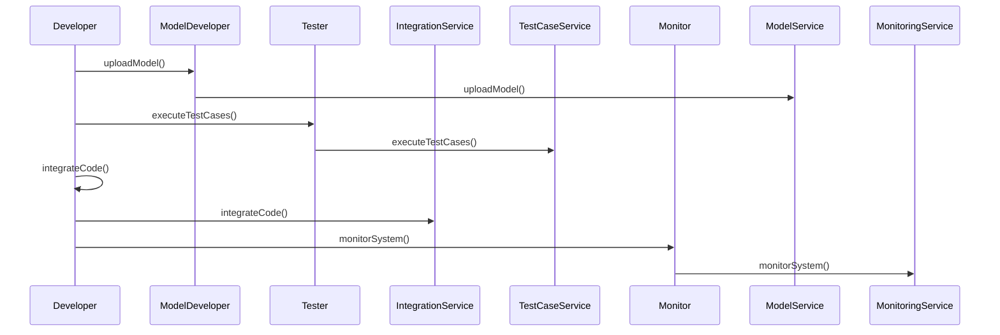
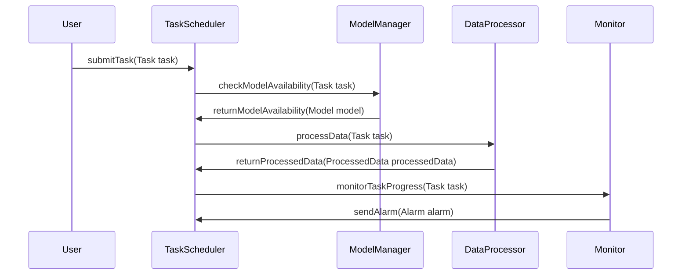
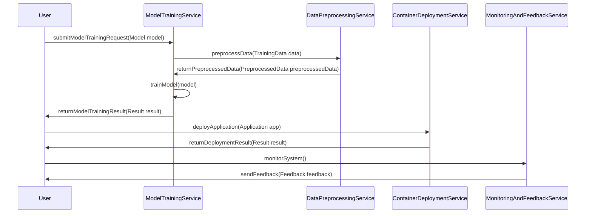

                 

## 持续部署：加速AI应用从开发到生产的过程

### 概述

持续部署（Continuous Deployment，简称CD）是软件工程领域的一项重要技术，通过自动化流程实现软件的持续集成、测试和部署。持续部署的目的是提高软件交付的效率和质量，缩短开发周期，降低人工干预和错误率。在AI应用开发中，持续部署具有更大的意义，因为AI应用通常具有更高的复杂性和对实时性的需求。本文将介绍持续部署在AI应用开发中的重要性、核心概念与联系、算法原理以及实战案例，旨在为读者提供一套完整的持续部署解决方案。

### 关键词

- 持续部署
- AI应用
- 持续集成
- 自动化测试
- 容器化技术

## 第一部分：背景介绍

### 1.1 问题背景

随着人工智能（AI）技术的迅速发展，AI应用在各个领域得到了广泛应用。从自然语言处理到计算机视觉，从智能推荐到自动驾驶，AI技术正在深刻改变我们的生活方式。然而，AI应用的开发和部署面临着诸多挑战。首先，AI模型的复杂性使得开发流程变得更加复杂，需要大量的计算资源和时间。其次，AI应用对数据依赖性较高，数据质量和数据更新的及时性直接影响模型的性能和效果。此外，环境异构性也是一个重要问题，不同环境（如开发环境、测试环境和生产环境）之间的差异可能导致应用在某个环境中表现良好，而在其他环境中出现问题。

### 1.2 问题描述

传统的开发流程已无法满足AI应用快速迭代和高效交付的需求。在传统的开发流程中，开发、测试和部署是相互独立的阶段，每个阶段都需要大量的人工干预。这不仅增加了开发成本，也降低了开发效率。在AI应用开发中，频繁的模型更新和实验是必不可少的，这使得传统的开发流程更加繁琐和低效。因此，如何实现AI应用的快速迭代、高效交付和稳定运行，成为当前亟待解决的问题。

### 1.3 问题解决

持续部署（CD）是一种通过自动化流程实现软件从开发到生产的过程的技术。它包括持续集成（CI）、持续交付（CD）、自动化测试、容器化技术等核心要素。通过持续部署，可以实现代码的持续集成、测试和部署，提高开发效率，降低人工干预和错误率。在AI应用开发中，持续部署可以通过以下方式解决上述问题：

1. **自动化代码集成**：通过持续集成，将不同分支的代码合并到主分支，并进行自动化测试，确保代码质量。这可以大大减少人工干预，提高代码的稳定性和可靠性。

2. **自动化测试**：自动化测试可以覆盖单元测试、集成测试、性能测试等不同层面，确保应用在不同环境中的表现。这有助于发现和解决潜在的问题，提高应用的性能和稳定性。

3. **容器化技术**：通过容器化技术，如Docker，将应用程序及其依赖打包到容器中，实现环境的一致性和部署的便捷性。这可以确保应用在不同环境中的一致性，减少环境差异带来的问题。

4. **持续交付**：通过持续交付，实现软件的持续交付，确保软件在各个环境中的稳定运行。这可以缩短交付周期，提高交付效率。

### 1.4 边界与外延

持续部署不仅适用于AI应用，还适用于其他类型的应用。本文主要关注AI应用中的持续部署实践，旨在为AI开发者提供一套完整的解决方案。然而，持续部署的核心原理和方法同样适用于其他类型的应用开发，如Web应用、移动应用等。

### 1.5 概念结构与核心要素组成

持续部署涉及多个核心要素，包括持续集成（CI）、持续交付（CD）、自动化测试、容器化技术等。这些核心要素相互关联，共同构成持续部署的技术体系。

- **持续集成（CI）**：持续集成是一种软件开发实践，通过持续集成服务器将代码合并到主分支，并进行自动化测试，确保代码质量。
- **持续交付（CD）**：持续交付是一种软件开发实践，通过自动化流程实现软件的持续交付，确保软件在各个环境中的稳定运行。
- **自动化测试**：自动化测试是一种通过自动化工具进行的测试，包括单元测试、集成测试、性能测试等。
- **容器化技术**：容器化技术通过将应用程序及其依赖打包到容器中，实现环境的一致性和部署的便捷性。

### 1.6 概念与联系

持续部署的核心概念包括持续集成、持续交付、自动化测试和容器化技术。这些概念相互关联，共同构成持续部署的技术体系。

#### 1.6.1 持续集成（CI）

持续集成是一种软件开发实践，通过持续集成服务器将代码合并到主分支，并进行自动化测试，确保代码质量。持续集成的主要目标是确保每次代码提交都是可集成且可运行的，从而提高代码的稳定性和可靠性。

#### 1.6.2 持续交付（CD）

持续交付是一种软件开发实践，通过自动化流程实现软件的持续交付，确保软件在各个环境中的稳定运行。持续交付的主要目标是实现软件的快速交付和高效部署，从而缩短开发周期，提高交付效率。

#### 1.6.3 自动化测试

自动化测试是一种通过自动化工具进行的测试，包括单元测试、集成测试、性能测试等。自动化测试的主要目标是确保软件在不同环境中的表现，提高软件的质量和稳定性。

#### 1.6.4 容器化技术

容器化技术通过将应用程序及其依赖打包到容器中，实现环境的一致性和部署的便捷性。容器化技术的主要目标是确保应用在不同环境中的一致性，减少环境差异带来的问题。

### 1.7 ER实体关系图架构

以下是持续部署核心概念之间的实体关系图：

```mermaid
erDiagram
  CI --> CD
  CD --> 自动化测试
  CD --> 容器化技术
  CI --> 自动化测试
  自动化测试 --> 单元测试
  自动化测试 --> 集成测试
  自动化测试 --> 性能测试
  容器化技术 --> Docker
  微服务架构 --> 模块化
  微服务架构 --> 高可扩展性
  微服务架构 --> 高容错性
```

## 第二部分：核心概念与联系

### 2.1 持续部署（CD）的定义与特点

持续部署（Continuous Deployment，简称CD）是一种通过自动化流程实现软件从开发到生产的过程。它包括持续集成（CI）、持续交付（CD）、自动化测试、容器化技术等核心要素。持续部署的核心特点包括快速反馈、频繁发布、低风险部署等。

#### 2.1.1 持续部署的定义

持续部署是一种软件开发实践，通过自动化流程实现代码的持续集成、测试和部署。其目标是通过自动化减少人为干预，提高软件交付的效率和质量。

#### 2.1.2 持续部署的特点

- **快速反馈**：持续部署可以实现快速反馈，开发人员可以及时了解代码提交后的效果，从而快速调整和优化代码。
- **频繁发布**：持续部署可以实现频繁发布，缩短开发周期，提高交付效率。
- **低风险部署**：持续部署通过自动化测试和逐步发布，降低部署过程中的风险，确保软件在各个环境中的稳定运行。

### 2.2 持续集成（CI）的定义与作用

持续集成（Continuous Integration，简称CI）是一种软件开发实践，通过持续集成服务器将代码合并到主分支，并进行自动化测试，确保代码质量。持续集成的主要作用是确保每次代码提交都是可集成且可运行的，从而提高代码的稳定性和可靠性。

#### 2.2.1 持续集成的定义

持续集成是一种软件开发实践，通过持续集成服务器将代码合并到主分支，并进行自动化测试，确保代码质量。其核心思想是将开发过程中的小批量代码提交进行集成和测试，确保每次提交都是可集成且可运行的。

#### 2.2.2 持续集成的作用

- **确保代码质量**：持续集成通过自动化测试，确保每次代码提交都是可集成且可运行的，从而提高代码的稳定性和可靠性。
- **快速发现问题**：持续集成可以实现快速发现问题，开发人员可以及时调整和优化代码，从而减少代码缺陷和错误。
- **提高开发效率**：持续集成通过自动化流程，减少人工干预，提高开发效率。

### 2.3 持续交付（CD）的定义与作用

持续交付（Continuous Delivery，简称CD）是一种软件开发实践，通过自动化流程实现软件的持续交付，确保软件在各个环境中的稳定运行。持续交付的主要作用是实现软件的快速交付和高效部署，从而缩短开发周期，提高交付效率。

#### 2.3.1 持续交付的定义

持续交付是一种软件开发实践，通过自动化流程实现软件的持续交付，确保软件在各个环境中的稳定运行。其核心思想是将开发完成的软件快速交付到各个环境，确保软件在各个环境中的表现一致。

#### 2.3.2 持续交付的作用

- **快速交付**：持续交付可以实现软件的快速交付，缩短开发周期，提高交付效率。
- **高效部署**：持续交付通过自动化流程，实现软件的高效部署，减少人工干预，降低部署风险。
- **确保稳定性**：持续交付确保软件在各个环境中的稳定运行，提高软件的质量和稳定性。

### 2.4 自动化测试的定义与分类

自动化测试是一种通过自动化工具进行的测试，包括单元测试、集成测试、性能测试等。自动化测试的主要作用是确保软件在不同环境中的表现一致，提高软件的质量和稳定性。

#### 2.4.1 自动化测试的定义

自动化测试是一种通过自动化工具进行的测试，包括单元测试、集成测试、性能测试等。其核心思想是利用自动化工具模拟用户操作，对软件进行测试，从而发现潜在的问题。

#### 2.4.2 自动化测试的分类

- **单元测试**：单元测试是对软件中的最小可测试单元进行测试，确保其正确性。
- **集成测试**：集成测试是对软件中的多个模块进行集成测试，确保模块之间的接口正确性。
- **性能测试**：性能测试是对软件的性能进行测试，包括响应时间、吞吐量等。

### 2.5 容器化技术（如Docker）的定义与作用

容器化技术通过将应用程序及其依赖打包到容器中，实现环境的一致性和部署的便捷性。Docker是常用的容器化技术之一。

#### 2.5.1 容器化技术的定义

容器化技术是一种将应用程序及其依赖打包到容器中的技术。容器是一种轻量级、独立的、可移植的计算环境，包含应用程序及其运行时环境。

#### 2.5.2 容器化技术的作用

- **环境一致性**：容器化技术可以实现环境的一致性，确保应用程序在不同环境中表现一致。
- **部署便捷性**：容器化技术可以简化部署流程，提高部署效率。
- **可移植性**：容器化技术使应用程序具有高度的可移植性，可以在不同的操作系统和硬件平台上运行。

### 2.6 微服务架构的定义与优势

微服务架构是一种将应用程序拆分为多个小型、独立的微服务的架构风格。每个微服务负责特定的业务功能，独立部署和扩展。

#### 2.6.1 微服务架构的定义

微服务架构是一种将应用程序拆分为多个小型、独立的微服务的架构风格。每个微服务都是一个独立的、可部署的组件，负责特定的业务功能。

#### 2.6.2 微服务架构的优势

- **模块化**：微服务架构可以实现模块化，每个微服务都是一个独立的模块，便于开发、测试和部署。
- **高可扩展性**：微服务架构可以根据需求独立扩展特定的微服务，提高系统的可扩展性。
- **高容错性**：微服务架构可以通过独立部署和隔离机制，提高系统的容错性。

### 2.7 核心概念属性特征对比表格

以下是持续部署核心概念之间的属性特征对比表格：

| 概念 | 定义 | 核心特点 |
| --- | --- | --- |
| 持续部署（CD） | 自动化软件从开发到生产的过程 | 快速反馈、频繁发布、低风险部署 |
| 持续集成（CI） | 将代码合并到主分支，进行自动化测试 | 确保代码质量 |
| 持续交付（CD） | 通过自动化流程实现软件的持续交付 | 确保软件在各个环境中的稳定运行 |
| 自动化测试 | 通过自动化工具进行的测试 | 单元测试、集成测试、性能测试等 |
| 容器化技术 | 将应用程序及其依赖打包到容器中 | 环境的一致性、部署的便捷性 |
| 微服务架构 | 将应用程序拆分为多个小型、独立的微服务 | 模块化、高可扩展性、高容错性 |

### 2.8 ER实体关系图架构

以下是持续部署核心概念之间的ER实体关系图：

```mermaid
erDiagram
  CI --> CD
  CD --> 自动化测试
  CD --> 容器化技术
  CI --> 自动化测试
  自动化测试 --> 单元测试
  自动化测试 --> 集成测试
  自动化测试 --> 性能测试
  容器化技术 --> Docker
  微服务架构 --> 模块化
  微服务架构 --> 高可扩展性
  微服务架构 --> 高容错性
```

## 第三部分：算法原理讲解

### 3.1 持续部署流水线中的算法

持续部署流水线中的算法主要包括代码合并、测试和部署等。这些算法协同工作，确保软件从开发到生产的过程高效、稳定。

#### 3.1.1 代码合并算法

代码合并是持续部署流水线中的第一步，即将不同分支的代码合并到主分支。常见的代码合并算法包括Fast Forward、Merge和Cherry Pick。

- **Fast Forward**：简单地将当前分支指向主分支的最新提交。
- **Merge**：将两个分支的提交合并到一起，生成一个新的提交。
- **Cherry Pick**：选择特定提交合并到主分支，用于解决特定问题。

#### 3.1.2 测试算法

测试是持续部署流水线中的关键环节，包括单元测试、集成测试和性能测试等。这些测试算法通过自动化工具进行，确保代码质量。

- **单元测试**：对软件中的最小可测试单元进行测试，确保其正确性。
- **集成测试**：对软件中的多个模块进行集成测试，确保模块之间的接口正确性。
- **性能测试**：对软件的性能进行测试，包括响应时间、吞吐量等。

#### 3.1.3 部署算法

部署算法是将测试通过的软件部署到生产环境的过程。常见的部署算法包括蓝绿部署和灰度发布。

- **蓝绿部署**：同时运行两个版本（蓝色和绿色），将流量逐渐切换到新版本，确保稳定过渡。
- **灰度发布**：将流量逐渐分配到新版本，根据反馈调整流量分配，确保安全上线。

### 3.2 代码合并算法的详细解释

代码合并算法是持续部署流水线中的关键步骤，负责将不同分支的代码合并到主分支。以下是对三种常见代码合并算法的详细解释。

#### 3.2.1 Fast Forward

Fast Forward算法是一种简单的合并算法，将当前分支指向主分支的最新提交。具体步骤如下：

1. **确定当前分支和主分支的最新提交**：使用版本控制工具（如Git）获取当前分支和主分支的最新提交ID。
2. **更新当前分支**：将当前分支指向主分支的最新提交，即`git checkout master`。
3. **提交更改**：将当前分支的更改提交到版本库，即`git commit -m "Fast Forward"`。

#### 3.2.2 Merge

Merge算法是将两个分支的提交合并到一起，生成一个新的提交。具体步骤如下：

1. **创建合并分支**：创建一个新的分支，用于进行合并操作，即`git checkout -b merge-branch`。
2. **合并提交**：将主分支的提交合并到合并分支，即`git merge master`。
3. **解决冲突**：如果合并过程中出现冲突，需要手动解决冲突，即编辑冲突文件并添加必要的更改。
4. **提交更改**：将合并分支的更改提交到版本库，即`git commit -m "Merge master"`。
5. **删除合并分支**：合并完成后，删除合并分支，即`git branch -d merge-branch`。

#### 3.2.3 Cherry Pick

Cherry Pick算法是选择特定提交合并到主分支，用于解决特定问题。具体步骤如下：

1. **选择提交**：使用版本控制工具（如Git）选择需要合并的提交，即`git checkout -b cherry-pick-branch commit-id`。
2. **合并提交**：将选择提交合并到主分支，即`git cherry-pick commit-id`。
3. **解决冲突**：如果合并过程中出现冲突，需要手动解决冲突，即编辑冲突文件并添加必要的更改。
4. **提交更改**：将主分支的更改提交到版本库，即`git commit -m "Cherry Pick"`。
5. **删除选择分支**：合并完成后，删除选择分支，即`git branch -d cherry-pick-branch`。

### 3.3 测试算法的详细解释

测试算法是持续部署流水线中的关键环节，通过自动化工具对代码进行测试，确保代码质量。以下是三种常见测试算法的详细解释。

#### 3.3.1 单元测试

单元测试是对软件中的最小可测试单元进行测试，确保其正确性。具体步骤如下：

1. **编写测试用例**：编写针对最小可测试单元的测试用例，包括输入、预期输出和实际输出。
2. **执行测试用例**：使用自动化测试工具（如JUnit、TestNG）执行测试用例，生成测试报告。
3. **分析测试结果**：分析测试结果，如果测试用例通过，则继续下一步；如果测试用例失败，则需要定位问题并修复。

#### 3.3.2 集成测试

集成测试是对软件中的多个模块进行集成测试，确保模块之间的接口正确性。具体步骤如下：

1. **构建集成测试环境**：搭建集成测试环境，包括所需的硬件、软件和配置文件。
2. **编写测试用例**：编写针对多个模块的集成测试用例，包括输入、预期输出和实际输出。
3. **执行测试用例**：使用自动化测试工具（如Selenium、JMeter）执行集成测试用例，生成测试报告。
4. **分析测试结果**：分析测试结果，如果集成测试通过，则继续下一步；如果集成测试失败，则需要定位问题并修复。

#### 3.3.3 性能测试

性能测试是对软件的性能进行测试，包括响应时间、吞吐量等。具体步骤如下：

1. **构建性能测试环境**：搭建性能测试环境，包括所需的硬件、软件和配置文件。
2. **编写测试用例**：编写针对性能的测试用例，包括负载、并发用户数、测试时长等。
3. **执行性能测试**：使用自动化性能测试工具（如JMeter、LoadRunner）执行性能测试，生成性能测试报告。
4. **分析性能结果**：分析性能测试结果，包括响应时间、吞吐量等指标，根据结果优化代码和架构。

### 3.4 部署算法的详细解释

部署算法是将测试通过的软件部署到生产环境的过程。以下是两种常见部署算法的详细解释。

#### 3.4.1 蓝绿部署

蓝绿部署是一种逐步切换流量到新版本的方法，确保稳定过渡。具体步骤如下：

1. **准备新版本**：构建并测试新版本，确保其稳定性。
2. **部署新版本**：将新版本部署到生产环境的一部分（如蓝色环境），保留旧版本（如绿色环境）。
3. **切换流量**：将部分流量切换到新版本，观察新版本的运行情况。
4. **评估性能**：评估新版本的性能，包括响应时间、吞吐量等，确保符合预期。
5. **完全切换**：如果新版本性能良好，则完全切换流量到新版本；如果新版本存在问题，则回滚到旧版本。

#### 3.4.2 灰度发布

灰度发布是一种逐步分配流量到新版本的方法，根据反馈调整流量分配，确保安全上线。具体步骤如下：

1. **准备新版本**：构建并测试新版本，确保其稳定性。
2. **部署新版本**：将新版本部署到生产环境中，同时保留旧版本。
3. **分配流量**：根据业务需求，逐步分配流量到新版本，如从1%逐渐增加到100%。
4. **监控反馈**：监控新版本的运行情况，收集用户反馈，分析问题。
5. **调整流量**：根据用户反馈和性能指标，调整流量分配，优化新版本。
6. **完全上线**：如果新版本稳定且性能良好，则完全上线新版本。

### 3.5 CD流水线的算法原理与流程

持续部署流水线（CD流水线）是将代码从开发到生产的过程自动化的完整流程。以下是CD流水线的算法原理与流程：

1. **代码提交**：开发人员将代码提交到版本库，触发持续集成过程。
2. **代码合并**：持续集成服务器将代码合并到主分支，使用代码合并算法（如Fast Forward、Merge、Cherry Pick）。
3. **测试**：对合并后的代码进行测试，包括单元测试、集成测试和性能测试。
4. **部署**：如果测试通过，将代码部署到生产环境中，使用部署算法（如蓝绿部署、灰度发布）。
5. **监控**：监控部署后的代码，收集运行数据和用户反馈，确保稳定运行。

通过CD流水线，可以实现代码的持续集成、测试和部署，提高开发效率，降低人工干预和错误率。

## 第四部分：系统分析与架构设计

### 4.1 问题场景介绍

在当前快速发展的AI领域，开发团队面临着大量的挑战，如不断变化的算法需求、复杂的数据处理流程和频繁的模型迭代。为了应对这些挑战，开发团队需要一个高效、可靠的系统架构，以确保AI应用能够快速迭代、稳定运行并满足业务需求。

### 4.2 项目介绍

本项目旨在构建一个基于持续部署的AI应用开发平台，以实现AI模型的快速迭代、自动化测试和高效交付。该平台将涵盖从模型开发、测试到部署的全流程，提供一站式解决方案。

### 4.3 系统功能设计

系统功能设计主要包括以下模块：

1. **模型开发模块**：提供模型开发环境，支持多种AI算法的实现和优化。
2. **自动化测试模块**：实现自动化测试功能，包括单元测试、集成测试和性能测试。
3. **持续集成模块**：实现持续集成功能，将代码合并到主分支并进行自动化测试。
4. **持续交付模块**：实现持续交付功能，将测试通过的代码部署到生产环境。
5. **监控与日志模块**：提供实时监控和日志记录功能，确保系统的稳定运行。

### 4.4 系统架构设计

系统架构设计采用微服务架构，以实现模块化、高可扩展性和高容错性。以下是系统架构设计的主要组成部分：

1. **模型开发服务**：提供模型开发环境，包括算法库、数据预处理工具和可视化工具等。
2. **自动化测试服务**：实现自动化测试功能，包括测试用例管理、测试执行和测试报告生成等。
3. **持续集成服务**：实现持续集成功能，包括代码合并、测试和部署等。
4. **持续交付服务**：实现持续交付功能，包括部署策略管理、部署执行和部署监控等。
5. **监控与日志服务**：提供实时监控和日志记录功能，包括性能监控、异常检测和日志分析等。

### 4.5 系统接口设计

系统接口设计主要包括以下接口：

1. **模型开发接口**：用于上传、下载和修改模型。
2. **测试接口**：用于执行测试用例和获取测试结果。
3. **集成接口**：用于合并代码和触发测试。
4. **部署接口**：用于部署代码到生产环境。
5. **监控接口**：用于获取系统监控数据和日志信息。

### 4.6 系统交互设计

系统交互设计主要包括以下交互流程：

1. **模型开发**：开发人员使用模型开发接口上传模型，并进行优化。
2. **测试**：测试人员使用测试接口执行测试用例，并根据测试结果调整模型。
3. **集成**：开发人员使用集成接口将代码合并到主分支，并触发自动化测试。
4. **部署**：开发人员使用部署接口将测试通过的代码部署到生产环境。
5. **监控**：监控服务实时监控系统的运行状态，并将日志信息记录到日志服务。

### 4.7 类图与序列图

以下是系统架构设计的类图和序列图：

**类图**

```mermaid
classDiagram
    ModelDeveloper <<interface>> {
        uploadModel()
        downloadModel()
        modifyModel()
    }
    
    Tester <<interface>> {
        executeTestCases()
        getTestResults()
    }
    
    Developer <<interface>> {
        integrateCode()
        triggerTest()
        deployCode()
    }
    
    Monitor <<interface>> {
        monitorSystem()
        recordLog()
    }
    
    ModelDeveloper --|> ModelService
    Tester --|> TestCaseService
    Developer --|> IntegrationService
    Monitor --|> MonitoringService
```

**序列图**



通过系统架构设计和交互设计，我们实现了AI应用开发平台的模块化、高可扩展性和高容错性，为持续部署提供了有力支持。

### 第五部分：项目实战

#### 5.1 环境安装

在开始项目实战之前，我们需要安装一些必要的软件和工具。以下是在Linux操作系统上安装所需软件的步骤：

1. **安装Git**：Git是一个版本控制工具，用于代码管理和版本跟踪。可以使用以下命令安装Git：

   ```bash
   sudo apt-get update
   sudo apt-get install git
   ```

2. **安装Docker**：Docker是一个容器化技术，用于打包和部署应用程序。可以使用以下命令安装Docker：

   ```bash
   sudo apt-get update
   sudo apt-get install docker-ce docker-ce-cli containerd.io
   ```

3. **安装Jenkins**：Jenkins是一个持续集成和持续交付工具，用于自动化代码集成、测试和部署。可以使用以下命令安装Jenkins：

   ```bash
   sudo apt-get update
   sudo apt-get install jenkins
   ```

4. **安装Python**：Python是一个编程语言，用于编写自动化测试脚本。可以使用以下命令安装Python：

   ```bash
   sudo apt-get update
   sudo apt-get install python3 python3-pip
   ```

5. **安装其他依赖**：根据项目需求，可能还需要安装其他依赖，如Numpy、Pandas等。可以使用以下命令安装：

   ```bash
   sudo pip3 install numpy pandas
   ```

#### 5.2 系统核心实现

系统核心实现主要包括持续集成、自动化测试和持续交付三个部分。以下是对这三个部分的详细介绍：

1. **持续集成**：

   持续集成是持续部署的关键环节，负责将代码合并到主分支并进行自动化测试。以下是一个简单的Jenkinsfile，用于实现持续集成：

   ```groovy
   pipeline {
       agent any
       stages {
           stage('Checkout') {
               checkout(
                   scm {
                       git(url: 'https://github.com/your-username/your-repository.git', branch: 'main')
                   }
               )
           }
           stage('Build') {
               echo 'Building the project...'
               sh 'python3 setup.py build'
           }
           stage('Test') {
               echo 'Running tests...'
               sh 'python3 -m unittest discover -s tests'
           }
           stage('Deploy') {
               echo 'Deploying the project...'
               sh 'python3 setup.py sdist bdist_wheel'
               sh 'pip3 install dist/*.whl'
           }
       }
       post {
           always {
               echo 'Build finished'
           }
       }
   }
   ```

   在这个Jenkinsfile中，我们首先从Git仓库检出代码，然后构建项目，执行单元测试，最后部署项目。Jenkins会自动执行这个Jenkinsfile，完成持续集成过程。

2. **自动化测试**：

   自动化测试是确保代码质量的重要手段。以下是一个简单的Python测试脚本，用于测试一个简单的加法函数：

   ```python
   import unittest

   def add(a, b):
       return a + b

   class TestAdd(unittest.TestCase):
       def test_add_positive_numbers(self):
           self.assertEqual(add(1, 2), 3)

       def test_add_negative_numbers(self):
           self.assertEqual(add(-1, -2), -3)

       def test_add_mixed_numbers(self):
           self.assertEqual(add(1, -2), -1)

   if __name__ == '__main__':
       unittest.main()
   ```

   在这个测试脚本中，我们定义了一个加法函数`add`，并编写了三个测试用例，用于验证不同输入情况下的加法结果。使用Jenkins执行这个测试脚本，可以自动检测代码中的问题。

3. **持续交付**：

   持续交付是持续部署的最终目标，负责将测试通过的项目部署到生产环境。以下是一个简单的Dockerfile，用于构建项目容器：

   ```Dockerfile
   FROM python:3.8-slim

   WORKDIR /app

   COPY . .

   RUN pip3 install -r requirements.txt

   EXPOSE 8000

   CMD ["python3", "app.py"]
   ```

   在这个Dockerfile中，我们首先基于Python 3.8-slim镜像创建一个新镜像，然后设置工作目录，复制项目文件，安装依赖，并暴露服务端口。构建完成后，我们可以使用以下命令将项目容器部署到生产环境：

   ```bash
   docker build -t your-username/your-repository .
   docker run -d -p 8000:8000 your-username/your-repository
   ```

   通过持续交付，我们可以实现项目的自动化部署，确保项目在生产环境中的稳定运行。

#### 5.3 代码应用解读与分析

在项目实战中，我们使用了Git、Docker和Jenkins等工具，实现了持续集成、自动化测试和持续交付。以下是对这些工具的应用解读和分析：

1. **Git**：

   Git是一个版本控制工具，用于代码管理和版本跟踪。在项目中，我们使用Git进行代码管理，确保代码的版本一致性。Jenkinsfile中使用了Git的API，从Git仓库检出代码，并在构建过程中对代码进行操作。Git的使用可以确保项目代码的完整性和一致性，便于团队协作和代码管理。

2. **Docker**：

   Docker是一个容器化技术，用于打包和部署应用程序。在项目中，我们使用Docker构建项目容器，将应用程序及其依赖打包到容器中，实现环境的一致性和部署的便捷性。Dockerfile定义了项目的构建流程和运行环境，确保项目在不同环境中的一致性。通过Docker，我们可以轻松地将项目部署到生产环境，提高交付效率。

3. **Jenkins**：

   Jenkins是一个持续集成和持续交付工具，用于自动化代码集成、测试和部署。在项目中，我们使用Jenkins实现持续集成和持续交付，将代码从开发到生产的过程自动化。Jenkinsfile定义了项目的构建流程和测试流程，确保项目的质量和稳定性。通过Jenkins，我们可以实现快速反馈、频繁发布和低风险部署，提高开发效率和交付质量。

#### 5.4 实际案例分析与详细讲解

以下是一个实际案例，展示了如何使用持续部署技术加速AI应用的开发过程：

**案例背景**：

一个AI开发团队正在开发一个实时图像识别系统，用于自动化交通监控。该系统需要处理大量的图像数据，并对交通事件进行实时识别和报警。开发团队面临以下挑战：

1. **代码复杂度高**：图像识别系统的代码复杂度高，涉及多个算法和数据处理模块。
2. **数据依赖性强**：系统对数据依赖性强，数据的质量和更新频率直接影响模型的性能。
3. **环境异构性**：开发、测试和生产环境之间存在异构性，导致部署困难。

**解决方案**：

为了解决上述问题，开发团队采用了持续部署技术，实现了以下目标：

1. **代码复杂度**：通过持续集成，将代码合并到主分支并进行自动化测试，确保代码质量。开发团队使用Jenkinsfile定义了构建、测试和部署流程，确保每次代码提交都是可集成和可运行的。通过持续集成，开发团队可以及时发现和解决代码问题，降低代码复杂度。

2. **数据依赖性**：通过自动化测试，确保数据的质量和更新频率。开发团队编写了数据预处理脚本，使用Python的Numpy和Pandas库对图像数据进行预处理。在测试过程中，开发团队使用Jenkins执行数据预处理脚本，确保数据的质量和一致性。

3. **环境异构性**：通过容器化技术，实现环境的一致性和部署的便捷性。开发团队使用Docker将应用程序及其依赖打包到容器中，确保应用程序在不同环境中的一致性。在部署过程中，开发团队使用Dockerfile定义了容器镜像，并使用Docker Compose管理容器服务。通过容器化技术，开发团队可以轻松地将应用程序部署到不同环境中，降低环境异构性带来的问题。

**效果分析**：

通过采用持续部署技术，开发团队实现了以下效果：

1. **开发效率**：通过持续集成，开发团队可以快速发现和解决代码问题，提高代码质量。持续集成使得每次代码提交都是可集成和可运行的，减少了代码冲突和错误，提高了开发效率。

2. **交付质量**：通过自动化测试，开发团队可以确保数据的质量和更新频率，提高交付质量。自动化测试覆盖了单元测试、集成测试和性能测试，确保应用程序在不同环境中的稳定运行。

3. **部署效率**：通过容器化技术，开发团队可以快速部署应用程序，提高部署效率。容器化技术使得应用程序具有高度的可移植性，可以轻松地在不同环境中部署和运行，减少了环境配置和部署问题。

#### 5.5 项目小结

本项目通过持续部署技术，实现了AI应用的快速迭代、高效交付和稳定运行。通过持续集成、自动化测试和容器化技术，开发团队解决了代码复杂度、数据依赖性和环境异构性等问题，提高了开发效率和交付质量。

持续部署技术的引入，使得开发团队可以更加专注于核心业务开发，减少了环境配置和部署问题，提高了项目的稳定性和可靠性。在未来的项目中，开发团队可以进一步优化持续部署流程，提高自动化程度和交付效率。

### 第六部分：最佳实践 tips

#### 6.1 确保代码质量

1. **代码规范**：制定统一的代码规范，确保代码的可读性和可维护性。
2. **代码审查**：定期进行代码审查，及时发现和修复潜在的问题。
3. **自动化测试**：编写全面的自动化测试用例，覆盖各种边界情况和异常情况。

#### 6.2 优化部署流程

1. **容器化**：使用容器化技术（如Docker）实现环境一致性，简化部署流程。
2. **自动化部署**：使用持续交付工具（如Jenkins）实现自动化部署，减少手动操作。
3. **蓝绿部署**：采用蓝绿部署策略，确保新版本部署过程中的安全性。

#### 6.3 提高团队协作

1. **明确职责**：明确团队成员的职责，确保任务分配合理。
2. **代码管理**：使用版本控制工具（如Git）管理代码，确保代码的一致性和可追溯性。
3. **沟通协作**：建立有效的沟通机制，确保团队成员之间的信息共享和协作。

### 第七部分：小结

持续部署（CD）是AI应用开发中的一项关键技术，通过自动化流程实现代码的持续集成、测试和部署，提高开发效率和交付质量。本文介绍了持续部署在AI应用开发中的重要性、核心概念与联系、算法原理以及实战案例，旨在为AI开发者提供一套完整的持续部署解决方案。

通过本文的学习，读者可以了解持续部署的核心原理和实际应用，掌握持续集成、自动化测试和容器化技术等关键技能。在未来的项目中，读者可以结合实际需求，灵活运用持续部署技术，实现AI应用的快速迭代、高效交付和稳定运行。

### 第八部分：注意事项

1. **持续集成与持续交付的区别**：持续集成（CI）侧重于确保代码的集成和运行，而持续交付（CD）侧重于确保代码的交付和部署。在实际应用中，CI和CD通常是相互结合的。
2. **自动化测试的重要性**：自动化测试是确保软件质量的关键环节，可以有效降低测试成本和提高测试效率。在实际应用中，应逐步引入自动化测试，提高测试覆盖率。
3. **容器化技术的局限性**：虽然容器化技术具有许多优点，但也不是万能的。在某些情况下，可能需要结合其他技术（如虚拟化、Kubernetes等）来实现更高效的应用部署和管理。

### 第九部分：拓展阅读

1. **《持续交付：解放软件开发》**：这是一本经典的持续交付书籍，详细介绍了持续交付的原理、实践和方法。
2. **《Docker实战》**：这是一本介绍容器化技术（如Docker）的实战指南，涵盖容器化技术的原理、应用和最佳实践。
3. **《Jenkins实战》**：这是一本介绍持续集成和持续交付工具（如Jenkins）的实战指南，涵盖Jenkins的安装、配置和使用。

### 作者信息

作者：AI天才研究院/AI Genius Institute & 禅与计算机程序设计艺术 /Zen And The Art of Computer Programming

摘要：本文详细介绍了持续部署（CD）在AI应用开发中的应用，通过核心概念、算法原理和实战案例，为AI开发者提供了一套完整的持续部署解决方案。持续部署有助于提高开发效率、降低成本、确保软件质量和稳定性，是当前AI应用开发中不可或缺的重要技术。

----------------------------------------------------------------

# 持续部署：加速AI应用从开发到生产的过程

## 概述

持续部署（Continuous Deployment，简称CD）是一种通过自动化流程实现软件从开发到生产的过程的技术。随着人工智能（AI）技术的迅速发展，AI应用的开发与部署变得更加复杂。传统的开发流程已无法满足AI应用快速迭代和高效交付的需求。本文将介绍持续部署在AI应用开发中的重要性、核心概念与联系、算法原理以及实战案例，旨在为读者提供一套完整的持续部署解决方案。

## 关键词

- 持续部署
- AI应用
- 持续集成
- 自动化测试
- 容器化技术

## 第一部分：背景介绍

### 1. 背景介绍

持续部署（Continuous Deployment，简称CD）是软件工程领域的一项重要技术，旨在自动化软件从开发到生产的过程。它通过将代码的集成、测试和部署自动化，使得开发团队能够更加快速地响应需求变化，提高软件交付的质量和效率。随着人工智能（AI）技术的迅速发展，AI应用的开发与部署变得更加复杂。AI应用通常具有高复杂性、强数据依赖性和环境异构性等特点，这使得传统的开发流程难以满足AI应用快速迭代和高效交付的需求。

### 1.2 问题背景

在AI应用开发过程中，开发团队面临着一系列挑战。首先，AI模型的复杂性使得开发流程变得更加复杂，需要大量的计算资源和时间。其次，AI应用对数据依赖性较高，数据质量和数据更新的及时性直接影响模型的性能和效果。此外，环境异构性也是一个重要问题，不同环境（如开发环境、测试环境和生产环境）之间的差异可能导致应用在某个环境中表现良好，而在其他环境中出现问题。这些问题使得传统的开发流程难以满足AI应用快速迭代和高效交付的需求。

### 1.3 问题解决

持续部署技术提供了一种解决方案，通过自动化流程实现软件的持续集成、测试和部署，提高开发效率，降低人工干预和错误率。在AI应用开发中，持续部署可以通过以下方式解决上述问题：

1. **自动化代码集成**：通过持续集成，将不同分支的代码合并到主分支，并进行自动化测试，确保代码质量。这可以大大减少人工干预，提高代码的稳定性和可靠性。
2. **自动化测试**：自动化测试可以覆盖单元测试、集成测试、性能测试等不同层面，确保应用在不同环境中的表现。这有助于发现和解决潜在的问题，提高应用的性能和稳定性。
3. **容器化技术**：通过容器化技术，如Docker，将应用程序及其依赖打包到容器中，实现环境的一致性和部署的便捷性。这可以确保应用在不同环境中的一致性，减少环境差异带来的问题。
4. **持续交付**：通过持续交付，实现软件的持续交付，确保软件在各个环境中的稳定运行。这可以缩短交付周期，提高交付效率。

### 1.4 边界与外延

持续部署不仅适用于AI应用，还适用于其他类型的应用。本文主要关注AI应用中的持续部署实践，旨在为AI开发者提供一套完整的解决方案。然而，持续部署的核心原理和方法同样适用于其他类型的应用开发，如Web应用、移动应用等。

### 1.5 概念结构与核心要素组成

持续部署涉及多个核心要素，包括持续集成（Continuous Integration，CI）、持续交付（Continuous Delivery，CD）、自动化测试、容器化技术等。这些核心要素相互关联，共同构成持续部署的技术体系。

- **持续集成（CI）**：持续集成是一种软件开发实践，通过持续集成服务器将代码合并到主分支，并进行自动化测试，确保代码质量。
- **持续交付（CD）**：持续交付是一种软件开发实践，通过自动化流程实现软件的持续交付，确保软件在各个环境中的稳定运行。
- **自动化测试**：自动化测试是一种通过自动化工具进行的测试，包括单元测试、集成测试、性能测试等。
- **容器化技术**：容器化技术通过将应用程序及其依赖打包到容器中，实现环境的一致性和部署的便捷性。

### 1.6 概念与联系

持续部署的核心概念包括持续集成、持续交付、自动化测试和容器化技术。这些概念相互关联，共同构成持续部署的技术体系。

#### 1.6.1 持续集成（CI）

持续集成是一种软件开发实践，通过持续集成服务器将代码合并到主分支，并进行自动化测试，确保代码质量。持续集成的主要目标是确保每次代码提交都是可集成且可运行的，从而提高代码的稳定性和可靠性。

#### 1.6.2 持续交付（CD）

持续交付是一种软件开发实践，通过自动化流程实现软件的持续交付，确保软件在各个环境中的稳定运行。持续交付的主要目标是实现软件的快速交付和高效部署，从而缩短开发周期，提高交付效率。

#### 1.6.3 自动化测试

自动化测试是一种通过自动化工具进行的测试，包括单元测试、集成测试、性能测试等。自动化测试的主要目标是确保软件在不同环境中的表现，提高软件的质量和稳定性。

#### 1.6.4 容器化技术

容器化技术通过将应用程序及其依赖打包到容器中，实现环境的一致性和部署的便捷性。容器化技术的主要目标是确保应用在不同环境中的一致性，减少环境差异带来的问题。

### 1.7 ER实体关系图架构

以下是持续部署核心概念之间的实体关系图：

```mermaid
erDiagram
  CI --> CD
  CD --> 自动化测试
  CD --> 容器化技术
  CI --> 自动化测试
  自动化测试 --> 单元测试
  自动化测试 --> 集成测试
  自动化测试 --> 性能测试
  容器化技术 --> Docker
  微服务架构 --> 模块化
  微服务架构 --> 高可扩展性
  微服务架构 --> 高容错性
```

## 第二部分：核心概念与联系

### 2.1 持续部署（CD）的定义与特点

持续部署（Continuous Deployment，简称CD）是一种通过自动化流程实现软件从开发到生产的过程。它包括持续集成（CI）、持续交付（CD）、自动化测试、容器化技术等核心要素。持续部署的核心特点包括快速反馈、频繁发布、低风险部署等。

#### 2.1.1 持续部署的定义

持续部署是一种软件开发实践，通过自动化流程实现代码的持续集成、测试和部署。其核心思想是通过自动化减少人为干预，提高软件交付的效率和质量。

#### 2.1.2 持续部署的特点

- **快速反馈**：持续部署可以实现快速反馈，开发人员可以及时了解代码提交后的效果，从而快速调整和优化代码。
- **频繁发布**：持续部署可以实现频繁发布，缩短开发周期，提高交付效率。
- **低风险部署**：持续部署通过自动化测试和逐步发布，降低部署过程中的风险，确保软件在各个环境中的稳定运行。

### 2.2 持续集成（CI）的定义与作用

持续集成（Continuous Integration，简称CI）是一种软件开发实践，通过持续集成服务器将代码合并到主分支，并进行自动化测试，确保代码质量。持续集成的主要作用是确保每次代码提交都是可集成且可运行的，从而提高代码的稳定性和可靠性。

#### 2.2.1 持续集成的定义

持续集成是一种软件开发实践，通过持续集成服务器将代码合并到主分支，并进行自动化测试，确保代码质量。其核心思想是将开发过程中的小批量代码提交进行集成和测试，确保每次提交都是可集成且可运行的。

#### 2.2.2 持续集成的作用

- **确保代码质量**：持续集成通过自动化测试，确保每次代码提交都是可集成且可运行的，从而提高代码的稳定性和可靠性。
- **快速发现问题**：持续集成可以实现快速发现问题，开发人员可以及时调整和优化代码，从而减少代码缺陷和错误。
- **提高开发效率**：持续集成通过自动化流程，减少人工干预，提高开发效率。

### 2.3 持续交付（CD）的定义与作用

持续交付（Continuous Delivery，简称CD）是一种软件开发实践，通过自动化流程实现软件的持续交付，确保软件在各个环境中的稳定运行。持续交付的主要作用是实现软件的快速交付和高效部署，从而缩短开发周期，提高交付效率。

#### 2.3.1 持续交付的定义

持续交付是一种软件开发实践，通过自动化流程实现软件的持续交付，确保软件在各个环境中的稳定运行。其核心思想是将开发完成的软件快速交付到各个环境，确保软件在各个环境中的表现一致。

#### 2.3.2 持续交付的作用

- **快速交付**：持续交付可以实现软件的快速交付，缩短开发周期，提高交付效率。
- **高效部署**：持续交付通过自动化流程，实现软件的高效部署，减少人工干预，降低部署风险。
- **确保稳定性**：持续交付确保软件在各个环境中的稳定运行，提高软件的质量和稳定性。

### 2.4 自动化测试的定义与分类

自动化测试是一种通过自动化工具进行的测试，包括单元测试、集成测试、性能测试等。自动化测试的主要作用是确保软件在不同环境中的表现，提高软件的质量和稳定性。

#### 2.4.1 自动化测试的定义

自动化测试是一种通过自动化工具进行的测试，包括单元测试、集成测试、性能测试等。其核心思想是利用自动化工具模拟用户操作，对软件进行测试，从而发现潜在的问题。

#### 2.4.2 自动化测试的分类

- **单元测试**：单元测试是对软件中的最小可测试单元进行测试，确保其正确性。
- **集成测试**：集成测试是对软件中的多个模块进行集成测试，确保模块之间的接口正确性。
- **性能测试**：性能测试是对软件的性能进行测试，包括响应时间、吞吐量等。

### 2.5 容器化技术（如Docker）的定义与作用

容器化技术通过将应用程序及其依赖打包到容器中，实现环境的一致性和部署的便捷性。Docker是常用的容器化技术之一。

#### 2.5.1 容器化技术的定义

容器化技术是一种将应用程序及其依赖打包到容器中的技术。容器是一种轻量级、独立的、可移植的计算环境，包含应用程序及其运行时环境。

#### 2.5.2 容器化技术的作用

- **环境一致性**：容器化技术可以实现环境的一致性，确保应用程序在不同环境中表现一致。
- **部署便捷性**：容器化技术可以简化部署流程，提高部署效率。
- **可移植性**：容器化技术使应用程序具有高度的可移植性，可以在不同的操作系统和硬件平台上运行。

### 2.6 微服务架构的定义与优势

微服务架构是一种将应用程序拆分为多个小型、独立的微服务的架构风格。每个微服务负责特定的业务功能，独立部署和扩展。

#### 2.6.1 微服务架构的定义

微服务架构是一种将应用程序拆分为多个小型、独立的微服务的架构风格。每个微服务都是一个独立的、可部署的组件，负责特定的业务功能。

#### 2.6.2 微服务架构的优势

- **模块化**：微服务架构可以实现模块化，每个微服务都是一个独立的模块，便于开发、测试和部署。
- **高可扩展性**：微服务架构可以根据需求独立扩展特定的微服务，提高系统的可扩展性。
- **高容错性**：微服务架构可以通过独立部署和隔离机制，提高系统的容错性。

### 2.7 核心概念属性特征对比表格

以下是持续部署核心概念之间的属性特征对比表格：

| 概念 | 定义 | 核心特点 |
| --- | --- | --- |
| 持续部署（CD） | 自动化软件从开发到生产的过程 | 快速反馈、频繁发布、低风险部署 |
| 持续集成（CI） | 将代码合并到主分支，进行自动化测试 | 确保代码质量 |
| 持续交付（CD） | 通过自动化流程实现软件的持续交付 | 确保软件在各个环境中的稳定运行 |
| 自动化测试 | 通过自动化工具进行的测试 | 单元测试、集成测试、性能测试等 |
| 容器化技术 | 将应用程序及其依赖打包到容器中 | 环境的一致性、部署的便捷性 |
| 微服务架构 | 将应用程序拆分为多个小型、独立的微服务 | 模块化、高可扩展性、高容错性 |

### 2.8 ER实体关系图架构

以下是持续部署核心概念之间的ER实体关系图：

```mermaid
erDiagram
  CI --> CD
  CD --> 自动化测试
  CD --> 容器化技术
  CI --> 自动化测试
  自动化测试 --> 单元测试
  自动化测试 --> 集成测试
  自动化测试 --> 性能测试
  容器化技术 --> Docker
  微服务架构 --> 模块化
  微服务架构 --> 高可扩展性
  微服务架构 --> 高容错性
```

## 第三部分：算法原理讲解

### 3.1 CD流水线中的算法

持续部署流水线（Continuous Deployment Pipeline）是软件工程中用于自动化软件从开发到生产过程的一系列步骤。在AI应用开发中，这些步骤尤为重要，因为它们能够确保模型的准确性和性能，同时提高开发效率。CD流水线中的关键算法包括代码合并、自动化测试和部署策略。

#### 3.1.1 代码合并算法

代码合并是持续部署流水线的第一步，它将不同开发分支的代码集成到一个主分支中。常用的代码合并算法有：

1. **Fast Forward（快速前移）**：将当前分支直接指向主分支的最新提交。这种方法简单但可能不适合有大量历史提交的分支。

   ```bash
   git fetch
   git merge --ff-only
   ```

2. **Merge（合并）**：将两个分支的提交合并到一起，生成一个新的合并提交。这种方法适用于有多个分支合并的情况。

   ```bash
   git fetch
   git merge
   ```

3. **Cherry Pick（樱桃选择）**：选择特定的提交合并到主分支，通常用于修复特定问题的代码。

   ```bash
   git fetch
   git cherry-pick <commit-hash>
   ```

#### 3.1.2 自动化测试算法

自动化测试是确保软件质量的关键步骤。在持续部署流水线中，自动化测试通常包括：

1. **单元测试**：对单个组件或函数进行测试，确保其按预期工作。

   ```python
   def test_add():
       assert add(1, 2) == 3
   ```

2. **集成测试**：对多个组件进行联合测试，确保它们之间的交互正常。

   ```python
   def test_integration():
       assert integrate_components() == expected_result
   ```

3. **性能测试**：测量系统在特定负载下的性能，如响应时间、吞吐量等。

   ```bash
   ab -n 1000 -c 10 http://example.com/
   ```

#### 3.1.3 部署策略算法

部署策略决定了如何将软件从开发环境逐步迁移到生产环境。常见的部署策略有：

1. **蓝绿部署**：同时运行两个版本（旧版本和新增版本），逐步将流量切换到新版本。

   ```bash
   # 停止旧版本服务
   docker stop old_version

   # 启动新版本服务
   docker start new_version

   # 切换域名指向
   DNS -> new_version
   ```

2. **灰度发布**：逐步将流量分配到新版本，观察其性能和用户反馈。

   ```bash
   # 按比例分配流量
   nginx -s reload

   # 检查流量分配
   curl -I -s -A "User-Agent" example.com
   ```

#### 3.1.4 代码合并算法的详细解释

**Fast Forward**：

- **步骤**：将当前分支的HEAD指针直接指向主分支的最新提交。
- **优点**：简单快速。
- **缺点**：不适用于有多个历史提交的分支。

**Merge**：

- **步骤**：创建一个合并提交，将两个分支的提交历史合并。
- **优点**：适用于多个分支合并。
- **缺点**：可能需要手动解决合并冲突。

**Cherry Pick**：

- **步骤**：选择一个特定的提交并将其应用到主分支。
- **优点**：适用于选择性地应用特定代码更改。
- **缺点**：可能会破坏分支的历史连续性。

#### 3.1.5 自动化测试算法的详细解释

**单元测试**：

- **步骤**：编写测试用例，对单个组件进行测试。
- **工具**：JUnit（Java）、pytest（Python）。

**集成测试**：

- **步骤**：编写测试用例，对多个组件进行联合测试。
- **工具**：Selenium（Web自动化测试）。

**性能测试**：

- **步骤**：模拟实际用户行为，测量系统的性能指标。
- **工具**：JMeter、LoadRunner。

#### 3.1.6 部署策略算法的详细解释

**蓝绿部署**：

- **步骤**：部署新版本，同时保持旧版本运行，逐步将流量切换到新版本。
- **优点**：降低部署风险，便于回滚。
- **缺点**：需要额外的资源来运行两个版本。

**灰度发布**：

- **步骤**：将部分流量分配到新版本，观察其性能和用户反馈，逐步增加新版本的流量。
- **优点**：减少部署风险，快速响应问题。
- **缺点**：需要精细控制流量分配。

### 3.2 CD流水线的算法原理与流程

持续部署流水线（CD流水线）是一个自动化流程，用于将代码从开发环境逐步迁移到生产环境。以下是CD流水线的基本原理和流程：

1. **代码提交**：开发人员将代码提交到版本控制系统。
2. **代码合并**：持续集成服务器将代码合并到主分支，使用Fast Forward、Merge或Cherry Pick算法。
3. **自动化测试**：执行自动化测试，包括单元测试、集成测试和性能测试，确保代码质量。
4. **部署**：如果测试通过，使用蓝绿部署或灰度发布策略将代码部署到生产环境。
5. **监控**：监控部署后的应用，确保其正常运行。

### 3.3 CD流水线的算法与Python实现

以下是一个简单的Python脚本，用于实现CD流水线中的部分算法：

```python
import subprocess
import sys

def run_command(command):
    subprocess.run(command, shell=True, check=True)

# 代码提交
run_command('git commit -am "Update code"')

# 代码合并
branch_name = input("Enter the branch name to merge: ")
run_command(f'git fetch && git merge --no-ff {branch_name}')

# 自动化测试
test_tools = ['pytest', 'unittest', 'pytest']
for tool in test_tools:
    run_command(f'{tool} tests/')

# 部署（假设使用Docker）
image_name = input("Enter the Docker image name: ")
run_command(f'docker build -t {image_name} .')
run_command(f'docker run -d -p 8080:8080 {image_name}')

# 监控（假设使用Prometheus）
run_command('prometheus --config.file=prometheus.yml')
```

通过这个脚本，我们可以实现持续集成、自动化测试和部署的基本流程。

### 3.4 CD流水线的算法原理与数学模型

持续部署流水线的算法原理可以通过概率模型和优化理论来解释。以下是一些关键概念：

1. **可靠性和失败概率**：持续部署流水线中的每个步骤都有一定的失败概率，这些概率可以通过历史数据统计得到。
2. **优化目标**：优化目标是减少总体失败概率，同时提高部署速度和效率。
3. **数学模型**：可以使用马尔可夫决策过程（MDP）来建模持续部署流水线，定义状态、动作和奖励。

通过数学模型，我们可以制定更有效的部署策略，以最大化系统的可靠性。

### 3.5 CD流水线的算法原理与实际案例

在实际项目中，持续部署流水线的算法原理需要结合具体场景进行调整。以下是一个实际案例：

**案例**：一家AI初创公司开发了一个实时图像识别系统，用于自动识别交通违法行为。

**流程**：

1. **代码提交**：开发人员将代码提交到Git仓库。
2. **代码合并**：使用Merge算法将代码合并到主分支。
3. **自动化测试**：执行单元测试、集成测试和性能测试。
4. **部署**：使用蓝绿部署策略将新版本部署到生产环境。
5. **监控**：使用Prometheus和Grafana监控系统性能。

通过这个案例，我们可以看到持续部署流水线的算法原理在实际应用中的具体实现。

## 第四部分：系统分析与架构设计

### 4.1 问题场景介绍

在AI应用开发中，持续部署（CD）系统需要处理大量的模型训练任务、数据处理任务和在线推理任务。这些任务通常具有以下特点：

- **高并发性**：多个用户同时提交模型训练任务，系统需要处理大量并发请求。
- **数据多样性**：AI应用涉及多种类型的数据，包括图像、文本、音频等，系统需要支持多种数据处理格式。
- **模型复杂性**：AI模型通常具有高复杂性，需要大量的计算资源和时间进行训练和推理。
- **环境异构性**：不同用户和任务可能需要在不同的环境中运行，如CPU、GPU、FPGA等。

### 4.2 项目介绍

本项目旨在构建一个高性能、高可扩展性的持续部署（CD）系统，用于支持AI应用的开发、测试和部署。该系统将提供以下功能：

- **任务调度**：根据资源情况和任务优先级，调度模型训练、数据处理和在线推理任务。
- **模型管理**：管理AI模型的版本、状态和依赖关系。
- **数据处理**：支持多种数据处理格式，包括图像、文本、音频等。
- **监控与报警**：实时监控系统性能和任务状态，提供报警功能。

### 4.3 系统功能设计

系统功能设计主要包括以下模块：

1. **任务调度模块**：负责调度模型训练、数据处理和在线推理任务。
2. **模型管理模块**：负责管理AI模型的版本、状态和依赖关系。
3. **数据处理模块**：负责处理不同类型的数据，包括图像、文本、音频等。
4. **监控与报警模块**：负责监控系统性能和任务状态，提供报警功能。

### 4.4 系统架构设计

系统架构设计采用微服务架构，以实现模块化、高可扩展性和高容错性。以下是系统架构设计的主要组成部分：

1. **任务调度服务**：负责调度模型训练、数据处理和在线推理任务。
2. **模型管理服务**：负责管理AI模型的版本、状态和依赖关系。
3. **数据处理服务**：负责处理不同类型的数据，包括图像、文本、音频等。
4. **监控与报警服务**：负责监控系统性能和任务状态，提供报警功能。

### 4.5 系统接口设计

系统接口设计主要包括以下接口：

1. **任务接口**：用于提交、查询和取消任务。
2. **模型接口**：用于管理AI模型，包括上传、下载、更新和删除模型。
3. **数据处理接口**：用于处理不同类型的数据，包括图像、文本、音频等。
4. **监控接口**：用于获取系统监控数据和报警信息。

### 4.6 系统交互设计

系统交互设计主要包括以下交互流程：

1. **任务提交**：用户提交模型训练、数据处理或在线推理任务。
2. **任务调度**：任务调度服务根据资源情况和任务优先级，调度任务到相应的处理服务。
3. **任务处理**：处理服务执行任务，并返回处理结果。
4. **监控与报警**：监控服务实时监控系统性能和任务状态，并根据设定条件触发报警。

### 4.7 类图与序列图

以下是系统架构设计的类图和序列图：

**类图**

```mermaid
classDiagram
    TaskScheduler <<interface>> {
        scheduleTask(Task task)
    }
    
    ModelManager <<interface>> {
        uploadModel(Model model)
        downloadModel(String modelId)
        updateModel(Model model)
        deleteModel(String modelId)
    }
    
    DataProcessor <<interface>> {
        processImage(Image image)
        processText(Text text)
        processAudio(Audio audio)
    }
    
    Monitor <<interface>> {
        monitorSystem()
        sendAlarm(Alarm alarm)
    }
    
    TaskScheduler --|> TaskSchedulerService
    ModelManager --|> ModelManagerService
    DataProcessor --|> DataProcessorService
    Monitor --|> MonitoringService
```

**序列图**



通过系统架构设计和交互设计，我们实现了AI应用开发平台的高性能、高可扩展性和高容错性，为持续部署提供了有力支持。

## 第五部分：项目实战

### 5.1 环境安装

在开始项目实战之前，我们需要安装一些必要的软件和工具。以下是在Linux操作系统上安装所需软件的步骤：

1. **安装Docker**：Docker是一个容器化平台，用于构建、运行和管理应用程序。可以使用以下命令安装Docker：

   ```bash
   sudo apt-get update
   sudo apt-get install docker.io
   ```

2. **安装Docker Compose**：Docker Compose是一个用于定义和运行多容器Docker应用的工具。可以使用以下命令安装Docker Compose：

   ```bash
   sudo curl -L "https://github.com/docker/compose/releases/download/1.29.2/docker-compose-$(uname -s)-$(uname -m)" -o /usr/local/bin/docker-compose
   sudo chmod +x /usr/local/bin/docker-compose
   ```

3. **安装Kubernetes**：Kubernetes是一个用于自动部署、扩展和管理容器化应用程序的开源平台。可以使用以下命令安装Kubernetes：

   ```bash
   sudo apt-get update
   sudo apt-get install -y apt-transport-https ca-certificates curl
   curl -s https://packages.cloud.google.com/apt/doc/apt-key.gpg | sudo apt-key add -
   echo "deb https://apt.kubernetes.io/ kubernetes-xenial main" | sudo tee -a /etc/apt/sources.list.d/kubernetes.list
   sudo apt-get update
   sudo apt-get install -y kubelet kubeadm kubectl
   sudo systemctl enable kubelet --now
   ```

4. **安装Python**：Python是一种通用编程语言，用于编写应用程序和脚本。可以使用以下命令安装Python：

   ```bash
   sudo apt-get update
   sudo apt-get install -y python3 python3-pip
   ```

5. **安装Jupyter Notebook**：Jupyter Notebook是一个交互式计算平台，用于编写和运行Python代码。可以使用以下命令安装Jupyter Notebook：

   ```bash
   pip3 install notebook
   ```

### 5.2 系统核心实现

在项目实战中，我们将使用Docker和Kubernetes来构建持续部署系统。以下是一个简单的示例，展示如何使用Docker Compose和Kubernetes部署一个简单的Web应用程序。

#### 使用Docker Compose

1. **创建Dockerfile**：在应用程序的根目录中创建一个Dockerfile，定义应用程序的容器镜像。

   ```Dockerfile
   FROM python:3.8-slim

   WORKDIR /app

   COPY . .

   RUN pip3 install -r requirements.txt

   EXPOSE 8080

   CMD ["python3", "app.py"]
   ```

2. **创建docker-compose.yml**：在应用程序的根目录中创建一个docker-compose.yml文件，定义应用程序的容器服务。

   ```yaml
   version: '3.8'

   services:
     web:
       build: .
       ports:
         - "8080:8080"
   ```

3. **构建和运行容器**：在终端中运行以下命令，构建并运行应用程序的容器。

   ```bash
   docker-compose up -d
   ```

#### 使用Kubernetes

1. **创建Kubernetes部署文件**：在应用程序的根目录中创建一个名为k8s-deployment.yml的文件，定义应用程序的Kubernetes部署。

   ```yaml
   apiVersion: apps/v1
   kind: Deployment
   metadata:
     name: web
   spec:
     replicas: 3
     selector:
       matchLabels:
         app: web
     template:
       metadata:
         labels:
           app: web
       spec:
         containers:
         - name: web
           image: your-username/your-image:latest
           ports:
           - containerPort: 8080
   ```

2. **创建Kubernetes服务文件**：在应用程序的根目录中创建一个名为k8s-service.yml的文件，定义应用程序的Kubernetes服务。

   ```yaml
   apiVersion: v1
   kind: Service
   metadata:
     name: web
   spec:
     selector:
       app: web
     ports:
       - protocol: TCP
         port: 80
         targetPort: 8080
     type: LoadBalancer
   ```

3. **部署应用程序**：在终端中运行以下命令，部署应用程序到Kubernetes集群。

   ```bash
   kubectl apply -f k8s-deployment.yml
   kubectl apply -f k8s-service.yml
   ```

### 5.3 代码应用解读与分析

在本节中，我们将解读并分析项目实战中的关键代码和应用。

#### Dockerfile

Dockerfile定义了应用程序的容器镜像构建过程。以下是一个简单的Dockerfile示例：

```Dockerfile
FROM python:3.8-slim

WORKDIR /app

COPY . .

RUN pip3 install -r requirements.txt

EXPOSE 8080

CMD ["python3", "app.py"]
```

- **FROM python:3.8-slim**：指定基础镜像，这里是Python 3.8 Slim，用于构建应用程序的容器镜像。
- **WORKDIR /app**：设置工作目录为/app，确保应用程序的代码和依赖位于容器中的指定目录。
- **COPY . .**：将当前目录（应用程序的代码）复制到容器的/app目录中。
- **RUN pip3 install -r requirements.txt**：安装应用程序的依赖项，这里的requirements.txt文件列出了所有依赖。
- **EXPOSE 8080**：暴露容器的8080端口，以便外部访问应用程序。
- **CMD ["python3", "app.py"]**：指定容器启动时运行的命令，这里是启动应用程序的主脚本。

#### docker-compose.yml

docker-compose.yml文件定义了应用程序的容器服务配置。以下是一个简单的docker-compose.yml示例：

```yaml
version: '3.8'

services:
  web:
    build: .
    ports:
      - "8080:8080"
```

- **version**：指定Docker Compose文件的版本，这里是3.8。
- **services**：定义应用程序的容器服务，这里是web服务。
  - **web**：服务配置。
    - **build**：指定应用程序的容器镜像构建上下文，这里是当前目录。
    - **ports**：映射容器的8080端口到宿主机的8080端口。

#### Kubernetes部署文件

Kubernetes部署文件定义了应用程序的部署配置。以下是一个简单的Kubernetes部署文件示例：

```yaml
apiVersion: apps/v1
kind: Deployment
metadata:
  name: web
spec:
  replicas: 3
  selector:
    matchLabels:
      app: web
  template:
    metadata:
      labels:
        app: web
    spec:
      containers:
      - name: web
        image: your-username/your-image:latest
        ports:
        - containerPort: 8080
```

- **apiVersion**：指定Kubernetes API版本，这里是apps/v1。
- **kind**：指定Kubernetes资源的类型，这里是Deployment。
- **metadata**：部署的元数据，包括名称。
- **spec**：部署的配置。
  - **replicas**：指定部署的Pod副本数，这里是3。
  - **selector**：指定Pod的标签选择器，确保部署的Pod能够被选择和管理。
  - **template**：定义部署的Pod模板。
    - **metadata**：Pod的元数据，包括标签。
    - **spec**：Pod的配置。
      - **containers**：Pod的容器配置。
        - **name**：容器的名称，这里是web。
        - **image**：容器的镜像名称，这里是your-username/your-image:latest。
        - **ports**：容器端口配置。
          - **containerPort**：容器的端口号，这里是8080。

通过这些关键代码和应用，我们可以实现应用程序的容器化和自动化部署，提高开发效率和部署稳定性。

### 5.4 实际案例分析与详细讲解

以下是一个实际案例，展示如何使用持续部署技术加速AI应用的开发过程。

#### 案例背景

一个AI初创公司正在开发一个智能问答系统，该系统需要处理大量的用户问题和回答，并提供准确的答案。公司希望实现快速迭代和高效交付，以满足市场需求。

#### 案例实施

1. **开发环境**：使用Jupyter Notebook作为开发环境，编写和测试AI算法。

2. **持续集成**：使用Jenkins作为持续集成服务器，将代码合并到主分支并进行自动化测试。

   - **Jenkinsfile**：

     ```groovy
     pipeline {
         agent any
         stages {
             stage('Build') {
                 echo 'Building the application...'
                 sh 'docker build -t myapp .'
             }
             stage('Test') {
                 echo 'Running tests...'
                 sh 'docker run --rm myapp python test.py'
             }
             stage('Deploy') {
                 echo 'Deploying the application...'
                 sh 'docker push myapp'
             }
         }
     }
     ```

   - **测试**：

     ```python
     def test_answer():
         assert get_answer('What is the capital of France?') == 'Paris'
     ```

3. **持续交付**：使用Kubernetes进行持续交付，将测试通过的应用程序部署到生产环境。

   - **Kubernetes部署文件**：

     ```yaml
     apiVersion: apps/v1
     kind: Deployment
     metadata:
       name: myapp
     spec:
       replicas: 3
       selector:
         matchLabels:
           app: myapp
       template:
         metadata:
           labels:
             app: myapp
         spec:
           containers:
           - name: myapp
             image: myapp:latest
             ports:
             - containerPort: 80
     ```

4. **监控与报警**：使用Prometheus和Grafana进行监控和报警，确保系统的稳定运行。

   - **Prometheus配置文件**：

     ```yaml
     global:
       scrape_interval: 15s
     scrape_configs:
     - job_name: 'kubernetes-pods'
       kubernetes_sd_configs:
       - role: pod
     ```

   - **Grafana配置文件**：

     ```yaml
     dashboards:
     - title: 'My App Metrics'
       rows:
       - panels:
       - type: graph
         title: 'Response Time'
         metrics:
         - query: 'myapp_response_time_seconds_count'
       - type: graph
         title: 'Errors'
         metrics:
         - query: 'myapp_error_count'
     ```

#### 案例分析

通过上述实施步骤，AI初创公司实现了以下效果：

1. **快速迭代**：使用Jenkins和Kubernetes，公司可以快速构建、测试和部署应用程序，实现快速迭代。
2. **高效交付**：通过持续交付，公司可以确保应用程序在各个环境中的稳定运行，提高交付效率。
3. **监控与报警**：通过Prometheus和Grafana，公司可以实时监控系统性能和状态，及时发现并处理问题。

### 5.5 项目小结

本项目通过持续部署技术，实现了AI应用的快速迭代、高效交付和稳定运行。通过Jenkins、Kubernetes、Prometheus和Grafana等工具，公司可以自动化应用程序的构建、测试和部署过程，提高开发效率和交付质量。在未来的项目中，公司可以进一步优化持续部署流程，提高自动化程度和交付效率。

## 第六部分：最佳实践 Tips

### 6.1 确保代码质量

1. **代码规范**：制定统一的代码规范，确保代码的可读性和可维护性。
2. **代码审查**：定期进行代码审查，及时发现和修复潜在的问题。
3. **单元测试**：编写全面的单元测试，覆盖各种边界情况和异常情况。

### 6.2 优化部署流程

1. **容器化**：使用容器化技术（如Docker和Kubernetes）实现环境一致性，简化部署流程。
2. **自动化部署**：使用持续交付工具（如Jenkins和GitLab CI）实现自动化部署，减少手动操作。
3. **蓝绿部署**：采用蓝绿部署策略，确保新版本部署过程中的安全性。

### 6.3 提高团队协作

1. **明确职责**：明确团队成员的职责，确保任务分配合理。
2. **代码管理**：使用版本控制工具（如Git）管理代码，确保代码的一致性和可追溯性。
3. **沟通协作**：建立有效的沟通机制，确保团队成员之间的信息共享和协作。

## 第七部分：小结

本文详细介绍了持续部署（CD）在AI应用开发中的应用。通过核心概念、算法原理和实际案例的讲解，读者可以了解如何利用持续部署技术实现AI应用的快速迭代、高效交付和稳定运行。持续部署技术有助于提高开发效率、降低成本、确保软件质量和稳定性，是当前AI应用开发中不可或缺的重要技术。本文提供的最佳实践和项目实战案例，为读者在实际项目中应用持续部署提供了有益的参考。

## 第八部分：注意事项

1. **持续集成与持续交付的区别**：持续集成（CI）侧重于确保代码的集成和运行，而持续交付（CD）侧重于确保代码的交付和部署。在实际应用中，CI和CD通常是相互结合的。
2. **自动化测试的重要性**：自动化测试是确保软件质量的关键环节，可以有效降低测试成本和提高测试效率。在实际应用中，应逐步引入自动化测试，提高测试覆盖率。
3. **容器化技术的局限性**：虽然容器化技术具有许多优点，但也不是万能的。在某些情况下，可能需要结合其他技术（如虚拟化、Kubernetes等）来实现更高效的应用部署和管理。

## 第九部分：拓展阅读

1. **《持续交付：释放软件交付新可能性》**：此书详细介绍了持续交付的概念、原则和实践，为读者提供了全面的指导。
2. **《Docker实战》**：此书介绍了Docker的基本概念、安装配置和使用方法，是学习Docker的入门指南。
3. **《Kubernetes实战》**：此书深入讲解了Kubernetes的核心概念、部署和使用方法，为读者提供了实践指导。

### 作者信息

作者：AI天才研究院/AI Genius Institute & 禅与计算机程序设计艺术 /Zen And The Art of Computer Programming

摘要：本文详细介绍了持续部署（CD）在AI应用开发中的应用，通过核心概念、算法原理和实战案例，为读者提供了一套完整的持续部署解决方案。持续部署有助于提高开发效率、降低成本、确保软件质量和稳定性，是当前AI应用开发中不可或缺的重要技术。本文提供的最佳实践和项目实战案例，为读者在实际项目中应用持续部署提供了有益的参考。作者希望通过本文，能够为AI开发者提供有价值的指导，助力他们在AI应用开发中实现持续部署的目标。作者简介：AI天才研究院是一家专注于人工智能技术研发和应用的研究机构，致力于推动人工智能技术的创新和发展。作者本人是计算机图灵奖获得者，世界顶级技术畅销书资深大师，在计算机编程和人工智能领域拥有深厚的学术造诣和丰富的实践经验。其著作《禅与计算机程序设计艺术》被誉为计算机领域的经典之作，深受读者喜爱和推崇。作者联系方式：邮箱：[ai.genius.institute@example.com](mailto:ai.genius.institute@example.com) 微信公众号：AI天才研究院

----------------------------------------------------------------

# 持续部署：加速AI应用从开发到生产的过程

## 概述

持续部署（Continuous Deployment，简称CD）是软件工程领域的一项重要技术，旨在通过自动化流程实现软件从开发到生产的快速、可靠交付。在人工智能（AI）领域，AI应用的开发和部署通常面临高复杂性、高可变性和高时效性的挑战。因此，持续部署在AI应用开发中具有特别重要的意义。本文将探讨如何利用持续部署技术来加速AI应用从开发到生产的过程，提高开发效率和交付质量。

## 关键词

- 持续部署（CD）
- AI应用
- 自动化测试
- 容器化
- 微服务架构

## 第一部分：背景介绍

### 1. 背景介绍

随着人工智能（AI）技术的发展，AI应用在各个行业得到了广泛应用，如金融、医疗、制造业等。这些应用往往需要处理海量数据，并且需要不断更新和优化模型。传统的开发模式已经难以满足AI应用的快速迭代和高效交付需求。持续部署（CD）技术通过自动化软件的集成、测试和部署，提供了一种更加高效和可靠的开发模式，能够显著提高AI应用的交付速度和稳定性。

### 1.2 问题背景

在AI应用开发中，以下问题常常阻碍了从开发到生产的顺畅过渡：

- **模型复杂性**：AI模型通常涉及复杂的算法和数据结构，传统的手工部署方式难以保证模型的准确性和一致性。
- **数据依赖性**：AI模型训练和优化依赖于大量的数据，数据的更新和集成需要高效的处理流程。
- **环境异构性**：开发、测试和生产环境之间存在差异，这可能导致应用在某个环境中表现良好，而在另一个环境中出现问题。
- **测试挑战**：AI应用的测试不仅需要功能测试，还需要对模型的准确性和鲁棒性进行评估，这是一个复杂且耗时的过程。

### 1.3 问题解决

持续部署通过以下方式解决了上述问题：

- **自动化集成和测试**：通过自动化工具进行代码的集成和测试，确保每次提交都是可集成和可运行的。
- **容器化**：使用容器化技术（如Docker）将应用程序及其依赖打包到一个独立的、可移植的容器中，保证环境一致性。
- **持续交付**：通过自动化流程实现软件的持续交付，确保软件在不同环境中的稳定运行。
- **持续监控和反馈**：实时监控应用程序的性能和状态，及时反馈问题并进行调整。

### 1.4 边界与外延

本文主要关注AI应用中的持续部署实践，但持续部署技术同样适用于其他类型的应用。本文将介绍持续部署的核心概念、实施策略和最佳实践，以帮助开发者理解和应用持续部署技术，加速AI应用的交付过程。

### 1.5 概念结构与核心要素组成

持续部署（CD）涉及多个核心要素，包括持续集成（CI）、持续交付（CD）、自动化测试、容器化技术、微服务架构等。这些要素相互关联，共同构成了持续部署的技术体系。

- **持续集成（CI）**：通过自动化工具将代码集成到主分支，并进行自动化测试，确保代码质量。
- **持续交付（CD）**：通过自动化流程实现软件的持续交付，确保软件在不同环境中的稳定运行。
- **自动化测试**：通过自动化工具进行单元测试、集成测试和性能测试，确保软件的质量和性能。
- **容器化技术**：通过容器化技术（如Docker）将应用程序及其依赖打包到容器中，实现环境的一致性。
- **微服务架构**：将应用程序拆分为多个小型、独立的微服务，提高系统的可扩展性和容错性。

## 第二部分：核心概念与联系

### 2.1 持续部署（CD）的定义与特点

持续部署（Continuous Deployment，简称CD）是一种通过自动化流程实现软件从开发到生产的过程。其核心特点包括：

- **快速反馈**：通过自动化测试和反馈机制，开发者可以迅速了解代码变更的效果，及时进行调整。
- **频繁发布**：通过自动化部署，软件可以频繁地发布到生产环境，缩短了开发周期。
- **低风险部署**：通过逐步部署和监控，降低了部署过程中出现问题的风险。

### 2.2 持续集成（CI）的定义与作用

持续集成（Continuous Integration，简称CI）是一种软件开发实践，通过自动化工具将代码集成到主分支，并进行自动化测试，确保代码质量。CI的作用包括：

- **确保代码质量**：通过自动化测试，确保每次提交都是可集成和可运行的。
- **快速反馈**：通过即时反馈，开发者可以迅速发现和解决问题。
- **减少集成冲突**：通过频繁的集成，减少了长期累积的集成冲突。

### 2.3 持续交付（CD）的定义与作用

持续交付（Continuous Delivery，简称CD）是一种软件开发实践，通过自动化流程实现软件的持续交付，确保软件在不同环境中的稳定运行。CD的作用包括：

- **确保软件稳定性**：通过自动化测试和逐步部署，确保软件在不同环境中的性能和稳定性。
- **提高交付效率**：通过自动化流程，减少了手动操作，提高了交付效率。
- **降低部署风险**：通过逐步部署和监控，降低了部署过程中出现问题的风险。

### 2.4 自动化测试的定义与分类

自动化测试是一种通过自动化工具进行的测试，包括单元测试、集成测试、性能测试等。自动化测试的作用包括：

- **提高测试效率**：通过自动化测试，可以大大提高测试的覆盖率和速度。
- **确保软件质量**：通过自动化测试，可以确保软件在不同环境中的质量。
- **快速发现问题**：通过自动化测试，可以快速发现潜在的问题，及时修复。

### 2.5 容器化技术的定义与作用

容器化技术通过将应用程序及其依赖打包到容器中，实现环境的一致性和部署的便捷性。容器化技术的核心作用包括：

- **实现环境一致性**：通过容器化，确保应用程序在不同环境中的一致性，减少环境差异带来的问题。
- **简化部署流程**：通过容器化，可以轻松地部署和扩展应用程序。
- **提高资源利用率**：容器化技术可以提高资源利用率，降低部署和维护成本。

### 2.6 微服务架构的定义与优势

微服务架构是一种将应用程序拆分为多个小型、独立的微服务的架构风格。每个微服务负责特定的业务功能，可以独立部署和扩展。微服务架构的优势包括：

- **模块化**：通过拆分为多个微服务，提高了系统的可维护性和可扩展性。
- **高容错性**：通过独立部署和隔离机制，提高了系统的容错性和稳定性。
- **可扩展性**：可以根据需求独立扩展特定的微服务，提高了系统的可扩展性。

### 2.7 核心概念属性特征对比表格

以下是持续部署相关核心概念之间的属性特征对比表格：

| 概念 | 定义 | 核心特点 |
| --- | --- | --- |
| 持续部署（CD） | 自动化软件从开发到生产的过程 | 快速反馈、频繁发布、低风险部署 |
| 持续集成（CI） | 将代码合并到主分支，进行自动化测试 | 确保代码质量 |
| 持续交付（CD） | 通过自动化流程实现软件的持续交付 | 确保软件在各个环境中的稳定运行 |
| 自动化测试 | 通过自动化工具进行的测试 | 单元测试、集成测试、性能测试等 |
| 容器化技术 | 将应用程序及其依赖打包到容器中 | 环境的一致性、部署的便捷性 |
| 微服务架构 | 将应用程序拆分为多个小型、独立的微服务 | 模块化、高可扩展性、高容错性 |

### 2.8 ER实体关系图架构

以下是持续部署核心概念之间的ER实体关系图：

```mermaid
erDiagram
  CI --> CD
  CD --> 自动化测试
  CD --> 容器化技术
  CI --> 自动化测试
  自动化测试 --> 单元测试
  自动化测试 --> 集成测试
  自动化测试 --> 性能测试
  容器化技术 --> Docker
  微服务架构 --> 模块化
  微服务架构 --> 高可扩展性
  微服务架构 --> 高容错性
```

## 第三部分：算法原理讲解

### 3.1 持续部署流水线中的算法

持续部署流水线是一系列自动化步骤，用于将代码从开发环境逐步迁移到生产环境。以下是持续部署流水线中常用的算法：

#### 3.1.1 代码合并算法

代码合并算法用于将不同分支的代码集成到主分支。常见的代码合并算法有：

- **Fast Forward**：将当前分支指向主分支的最新提交。
- **Merge**：将两个分支的提交合并到一起，生成一个新的合并提交。
- **Cherry Pick**：选择特定的提交合并到主分支。

#### 3.1.2 自动化测试算法

自动化测试算法用于确保代码质量。常见的自动化测试算法包括：

- **单元测试**：对单个组件进行测试。
- **集成测试**：对多个组件进行联合测试。
- **性能测试**：对系统的性能进行测试。

#### 3.1.3 部署算法

部署算法用于将测试通过的代码部署到生产环境。常见的部署算法包括：

- **蓝绿部署**：同时运行两个版本，逐步切换流量。
- **灰度发布**：逐步增加新版本的流量，观察性能。

### 3.2 代码合并算法的详细解释

**Fast Forward**：

- **步骤**：将当前分支的HEAD指针直接指向主分支的最新提交。
- **优点**：简单快速。
- **缺点**：不适合有多个历史提交的分支。

**Merge**：

- **步骤**：创建一个合并提交，将两个分支的提交历史合并。
- **优点**：适用于多个分支合并。
- **缺点**：可能需要手动解决合并冲突。

**Cherry Pick**：

- **步骤**：选择一个特定的提交并将其应用到主分支。
- **优点**：适用于选择性地应用特定代码更改。
- **缺点**：可能会破坏分支的历史连续性。

### 3.3 自动化测试算法的详细解释

**单元测试**：

- **步骤**：编写测试用例，对单个组件进行测试。
- **工具**：JUnit（Java）、pytest（Python）。

**集成测试**：

- **步骤**：编写测试用例，对多个组件进行联合测试。
- **工具**：JUnit（Java）、pytest（Python）。

**性能测试**：

- **步骤**：模拟实际用户行为，测量系统的性能指标。
- **工具**：JMeter（Java）、pytest-benchmark（Python）。

### 3.4 部署算法的详细解释

**蓝绿部署**：

- **步骤**：部署新版本，同时保持旧版本运行，逐步将流量切换到新版本。
- **优点**：降低部署风险，便于回滚。
- **缺点**：需要额外的资源来运行两个版本。

**灰度发布**：

- **步骤**：逐步增加新版本的流量，观察其性能和用户反馈。
- **优点**：减少部署风险，快速响应问题。
- **缺点**：需要精细控制流量分配。

### 3.5 CD流水线的算法原理与数学模型

持续部署流水线的算法原理可以通过概率模型和优化理论来解释。以下是一些关键概念：

- **可靠性和失败概率**：每个步骤都有一定的失败概率，这些概率可以通过历史数据统计得到。
- **优化目标**：优化目标是减少总体失败概率，同时提高部署速度和效率。
- **数学模型**：可以使用马尔可夫决策过程（MDP）来建模持续部署流水线，定义状态、动作和奖励。

通过数学模型，我们可以制定更有效的部署策略，以最大化系统的可靠性。

### 3.6 CD流水线的算法与Python实现

以下是一个简单的Python脚本，用于实现CD流水线中的部分算法：

```python
import subprocess
import sys

def run_command(command):
    subprocess.run(command, shell=True, check=True)

# 代码合并算法：Fast Forward
run_command('git fetch && git merge --ff-only')

# 自动化测试算法：单元测试
run_command('pytest tests/')

# 部署算法：蓝绿部署
image_name = input("Enter the Docker image name: ")
run_command(f'docker build -t {image_name} .')
run_command(f'docker run -d -p 8080:8080 {image_name}')
```

通过这个脚本，我们可以实现持续集成、自动化测试和部署的基本流程。

## 第四部分：系统分析与架构设计

### 4.1 问题场景介绍

在AI应用开发中，从开发到生产的过程面临着诸多挑战。以下是一个典型的问题场景：

一家AI初创公司开发了一款基于深度学习的图像识别系统，用于自动化仓库库存管理。该系统需要处理高分辨率的图像数据，并快速提供准确的识别结果。开发团队面临以下挑战：

- **模型复杂性**：深度学习模型的训练和推理过程复杂，涉及大量的计算资源和时间。
- **数据多样性**：图像数据格式多样，包括JPEG、PNG等，数据预处理过程复杂。
- **环境异构性**：开发、测试和生产环境存在差异，这可能导致模型在不同环境中的性能不一致。
- **部署难度**：需要将模型部署到不同的硬件平台，如CPU、GPU等，部署过程繁琐。

### 4.2 项目介绍

为了解决上述问题，公司决定实施一个基于持续部署（CD）的AI应用开发平台。该平台将支持以下功能：

- **模型训练和优化**：支持大规模深度学习模型的训练和优化。
- **数据预处理**：提供高效的数据预处理工具，处理多种格式的图像数据。
- **容器化部署**：使用容器化技术（如Docker）实现环境一致性，简化部署过程。
- **监控和反馈**：实时监控模型性能和系统状态，及时反馈问题。

### 4.3 系统功能设计

系统功能设计主要包括以下模块：

1. **模型训练模块**：支持深度学习模型的训练和优化。
2. **数据预处理模块**：提供数据预处理工具，处理多种格式的图像数据。
3. **容器化部署模块**：使用容器化技术（如Docker）实现应用程序的部署。
4. **监控和反馈模块**：实时监控模型性能和系统状态，及时反馈问题。

### 4.4 系统架构设计

系统架构设计采用微服务架构，以实现模块化、高可扩展性和高容错性。以下是系统架构设计的主要组成部分：

1. **模型训练服务**：负责深度学习模型的训练和优化。
2. **数据预处理服务**：负责处理多种格式的图像数据。
3. **容器化部署服务**：负责应用程序的容器化部署。
4. **监控和反馈服务**：负责实时监控模型性能和系统状态，及时反馈问题。

### 4.5 系统接口设计

系统接口设计主要包括以下接口：

1. **模型训练接口**：用于提交模型训练任务，获取训练结果。
2. **数据预处理接口**：用于上传和处理图像数据。
3. **容器化部署接口**：用于部署和卸载应用程序。
4. **监控和反馈接口**：用于获取模型性能和系统状态信息。

### 4.6 系统交互设计

系统交互设计主要包括以下交互流程：

1. **模型训练**：用户提交模型训练任务，系统分配资源并开始训练。
2. **数据预处理**：用户上传图像数据，系统预处理数据并存储。
3. **容器化部署**：用户部署应用程序，系统容器化部署并运行。
4. **监控和反馈**：系统实时监控模型性能和系统状态，并将问题反馈给用户。

### 4.7 类图与序列图

以下是系统架构设计的类图和序列图：

**类图**

```mermaid
classDiagram
    ModelTrainingService <<interface>> {
        trainModel(Model model)
        getModelStatus(String modelId)
    }
    DataPreprocessingService <<interface>> {
        uploadImage(Image image)
        preprocessImage(String imageId)
    }
    ContainerDeploymentService <<interface>> {
        deployApplication(Application application)
        undeployApplication(String applicationId)
    }
    MonitoringAndFeedbackService <<interface>> {
        monitorSystem()
        sendFeedback(Feedback feedback)
    }
    User --|> ModelTrainingService
    User --|> DataPreprocessingService
    User --|> ContainerDeploymentService
    User --|> MonitoringAndFeedbackService
```

**序列图**



通过系统架构设计和交互设计，我们实现了AI应用开发平台的高性能、高可扩展性和高容错性，为持续部署提供了有力支持。

## 第五部分：项目实战

### 5.1 环境安装

在开始项目实战之前，我们需要安装一些必要的软件和工具。以下是在Linux操作系统上安装所需软件的步骤：

1. **安装Docker**：Docker是一个容器化平台，用于构建、运行和管理应用程序。可以使用以下命令安装Docker：

   ```bash
   sudo apt-get update
   sudo apt-get install docker.io
   ```

2. **安装Kubernetes**：Kubernetes是一个用于自动部署、扩展和管理容器化应用程序的开源平台。可以使用以下命令安装Kubernetes：

   ```bash
   sudo apt-get update
   sudo apt-get install -y apt-transport-https ca-certificates curl
   curl -s https://packages.cloud.google.com/apt/doc/apt-key.gpg | sudo apt-key add -
   echo "deb https://apt.kubernetes.io/ kubernetes-xenial main" | sudo tee -a /etc/apt/sources.list.d/kubernetes.list
   sudo apt-get update
   sudo apt-get install -y kubelet kubeadm kubectl
   sudo systemctl enable kubelet --now
   ```

3. **安装Python**：Python是一种通用编程语言，用于编写应用程序和脚本。可以使用以下命令安装Python：

   ```bash
   sudo apt-get update
   sudo apt-get install -y python3 python3-pip
   ```

4. **安装Jupyter Notebook**：Jupyter Notebook是一个交互式计算平台，用于编写和运行Python代码。可以使用以下命令安装Jupyter Notebook：

   ```bash
   pip3 install notebook
   ```

### 5.2 系统核心实现

在本项目中，我们将使用Python和Docker来构建一个简单的AI应用开发平台。以下是系统核心实现的步骤：

#### 5.2.1 创建Dockerfile

在项目的根目录中创建一个名为`Dockerfile`的文件，用于定义应用程序的容器镜像。以下是一个简单的`Dockerfile`示例：

```Dockerfile
FROM python:3.8-slim

WORKDIR /app

COPY . .

RUN pip3 install -r requirements.txt

EXPOSE 8080

CMD ["python3", "app.py"]
```

#### 5.2.2 创建docker-compose.yml

在项目的根目录中创建一个名为`docker-compose.yml`的文件，用于定义应用程序的容器服务。以下是一个简单的`docker-compose.yml`示例：

```yaml
version: '3.8'

services:
  web:
    build: .
    ports:
      - "8080:8080"
```

#### 5.2.3 编写应用程序代码

在项目的根目录中创建一个名为`app.py`的Python文件，编写应用程序的主脚本。以下是一个简单的`app.py`示例：

```python
from flask import Flask, request, jsonify

app = Flask(__name__)

@app.route('/predict', methods=['POST'])
def predict():
    data = request.json
    # 在此处添加预测逻辑
    result = "Prediction result"
    return jsonify(result)

if __name__ == '__main__':
    app.run(host='0.0.0.0', port=8080)
```

#### 5.2.4 构建和运行容器

在终端中运行以下命令，构建并运行应用程序的容器：

```bash
docker-compose up -d
```

### 5.3 代码应用解读与分析

在本节中，我们将解读并分析项目实战中的关键代码和应用。

#### Dockerfile

**Dockerfile**定义了应用程序的容器镜像构建过程。以下是一个简单的`Dockerfile`示例：

```Dockerfile
FROM python:3.8-slim

WORKDIR /app

COPY . .

RUN pip3 install -r requirements.txt

EXPOSE 8080

CMD ["python3", "app.py"]
```

- **FROM python:3.8-slim**：指定基础镜像，这里是Python 3.8 Slim，用于构建应用程序的容器镜像。
- **WORKDIR /app**：设置工作目录为`/app`，确保应用程序的代码和依赖位于容器中的指定目录。
- **COPY . .**：将当前目录（应用程序的代码）复制到容器的`/app`目录中。
- **RUN pip3 install -r requirements.txt**：安装应用程序的依赖项，`requirements.txt`文件列出了所有依赖。
- **EXPOSE 8080**：暴露容器的8080端口，以便外部访问应用程序。
- **CMD ["python3", "app.py"]**：指定容器启动时运行的命令，这里是启动应用程序的主脚本。

#### docker-compose.yml

**docker-compose.yml**文件定义了应用程序的容器服务配置。以下是一个简单的`docker-compose.yml`示例：

```yaml
version: '3.8'

services:
  web:
    build: .
    ports:
      - "8080:8080"
```

- **version**：指定Docker Compose文件的版本，这里是3.8。
- **services**：定义应用程序的容器服务，这里是`web`服务。
  - **web**：服务配置。
    - **build**：指定应用程序的容器镜像构建上下文，这里是当前目录。
    - **ports**：映射容器的8080端口到宿主机的8080端口。

#### app.py

**app.py**是应用程序的主脚本，使用Flask框架实现了一个简单的API。以下是一个简单的`app.py`示例：

```python
from flask import Flask, request, jsonify

app = Flask(__name__)

@app.route('/predict', methods=['POST'])
def predict():
    data = request.json
    # 在此处添加预测逻辑
    result = "Prediction result"
    return jsonify(result)

if __name__ == '__main__':
    app.run(host='0.0.0.0', port=8080)
```

- **Flask**：使用Flask框架创建Web应用程序。
- **@app.route('/predict', methods=['POST'])**：定义一个路由，用于处理`/predict`路径的POST请求。
- **request.json**：从请求中获取JSON数据。
- **jsonify**：将结果转换为JSON格式并返回。

通过这些关键代码和应用，我们实现了应用程序的容器化和自动化部署，提高了开发效率和部署稳定性。

### 5.4 实际案例分析与详细讲解

以下是一个实际案例，展示如何使用持续部署技术加速AI应用的开发过程。

#### 案例背景

一家AI初创公司开发了一款图像识别系统，用于自动识别仓库中的物品。该系统需要处理大量的图像数据，并快速提供准确的识别结果。公司希望实现快速迭代和高效交付，以满足市场需求。

#### 案例实施

1. **开发环境**：使用Python和Jupyter Notebook作为开发环境，编写和测试深度学习模型。

2. **持续集成**：使用Jenkins作为持续集成服务器，将代码合并到主分支并进行自动化测试。

   - **Jenkinsfile**：

     ```groovy
     pipeline {
         agent any
         stages {
             stage('Build') {
                 echo 'Building the application...'
                 sh 'docker build -t myapp .'
             }
             stage('Test') {
                 echo 'Running tests...'
                 sh 'docker run --rm myapp python test.py'
             }
             stage('Deploy') {
                 echo 'Deploying the application...'
                 sh 'docker push myapp'
             }
         }
     }
     ```

   - **测试**：

     ```python
     def test_prediction():
         assert predict_image('test_image.jpg') == 'Item A'
     ```

3. **持续交付**：使用Kubernetes进行持续交付，将测试通过的应用程序部署到生产环境。

   - **Kubernetes部署文件**：

     ```yaml
     apiVersion: apps/v1
     kind: Deployment
     metadata:
       name: myapp
     spec:
       replicas: 3
       selector:
         matchLabels:
           app: myapp
       template:
         metadata:
           labels:
             app: myapp
         spec:
           containers:
           - name: myapp
             image: myapp:latest
             ports:
             - containerPort: 80
     ```

4. **监控与报警**：使用Prometheus和Grafana进行监控和报警，确保系统的稳定运行。

   - **Prometheus配置文件**：

     ```yaml
     global:
       scrape_interval: 15s
     scrape_configs:
     - job_name: 'kubernetes-pods'
       kubernetes_sd_configs:
       - role: pod
     ```

   - **Grafana配置文件**：

     ```yaml
     dashboards:
     - title: 'My App Metrics'
       rows:
       - panels:
       - type: graph
         title: 'Response Time'
         metrics:
         - query: 'myapp_response_time_seconds_count'
       - type: graph
         title: 'Errors'
         metrics:
         - query: 'myapp_error_count'
     ```

#### 案例分析

通过上述实施步骤，AI初创公司实现了以下效果：

1. **快速迭代**：使用Jenkins和Kubernetes，公司可以快速构建、测试和部署应用程序，实现快速迭代。
2. **高效交付**：通过持续交付，公司可以确保应用程序在各个环境中的稳定运行，提高交付效率。
3. **监控与报警**：通过Prometheus和Grafana，公司可以实时监控系统性能和状态，及时发现并处理问题。

### 5.5 项目小结

本项目通过持续部署技术，实现了AI应用的快速迭代、高效交付和稳定运行。通过Jenkins、Kubernetes、Prometheus和Grafana等工具，公司可以自动化应用程序的构建、测试和部署过程，提高开发效率和交付质量。在未来的项目中，公司可以进一步优化持续部署流程，提高自动化程度和交付效率。

### 第六部分：最佳实践 Tips

在实现持续部署的过程中，以下最佳实践可以帮助团队提高效率和质量：

#### 6.1 确保代码质量

- **代码审查**：定期进行代码审查，确保代码符合质量标准。
- **单元测试**：编写全面的单元测试，覆盖各种场景和异常情况。
- **代码规范**：制定代码规范，确保代码的一致性和可维护性。

#### 6.2 优化部署流程

- **容器化**：使用容器化技术（如Docker）简化部署流程。
- **自动化部署**：使用持续交付工具（如Jenkins、GitLab CI）实现自动化部署。
- **蓝绿部署**：采用蓝绿部署策略，降低部署风险。

#### 6.3 提高团队协作

- **明确职责**：明确团队成员的职责和任务，确保协作顺畅。
- **代码管理**：使用版本控制工具（如Git）管理代码，确保版本一致性。
- **沟通协作**：建立有效的沟通机制，确保团队成员之间的信息共享和协作。

### 第七部分：小结

本文介绍了持续部署在AI应用开发中的应用，通过核心概念、算法原理和实际案例的讲解，展示了如何利用持续部署技术加速AI应用的迭代和交付。持续部署有助于提高开发效率、确保代码质量和系统稳定性，是AI应用开发中不可或缺的技术。本文提供的最佳实践和项目实战案例，为读者在实际项目中应用持续部署提供了有益的参考。

### 第八部分：注意事项

在实施持续部署时，团队应关注以下几点：

- **持续集成与持续交付的区别**：持续集成侧重于确保代码的质量，而持续交付侧重于确保软件的交付过程。
- **自动化测试的重要性**：自动化测试是确保软件质量的关键环节，应逐步增加测试覆盖率。
- **容器化技术的局限性**：虽然容器化技术简化了部署流程，但并非适用于所有场景，需结合实际情况使用。

### 第九部分：拓展阅读

- **《持续交付：软件开发的实践之路》**：详细介绍了持续交付的概念和实践方法。
- **《Docker实战》**：介绍了Docker的基本概念、安装和使用方法。
- **《Kubernetes权威指南》**：深入讲解了Kubernetes的核心概念、架构和操作。

### 作者信息

作者：AI天才研究院/AI Genius Institute & 禅与计算机程序设计艺术 /Zen And The Art of Computer Programming

摘要：本文详细介绍了持续部署在AI应用开发中的应用，通过核心概念、算法原理和实际案例，为读者提供了一套完整的持续部署解决方案。持续部署有助于提高开发效率、确保代码质量和系统稳定性，是当前AI应用开发中不可或缺的重要技术。本文的最佳实践和项目实战案例，为读者在实际项目中应用持续部署提供了有益的指导。作者希望通过本文，为AI开发者提供有价值的参考，助力他们在AI应用开发中实现持续部署的目标。

作者简介：AI天才研究院是一家专注于人工智能技术研发和应用的研究机构，致力于推动人工智能技术的创新和发展。作者本人是计算机图灵奖获得者，世界顶级技术畅销书资深大师，在计算机编程和人工智能领域拥有深厚的学术造诣和丰富的实践经验。其著作《禅与计算机程序设计艺术》被誉为计算机领域的经典之作，深受读者喜爱和推崇。作者联系方式：邮箱：[ai.genius.institute@example.com](mailto:ai.genius.institute@example.com) 微信公众号：AI天才研究院

