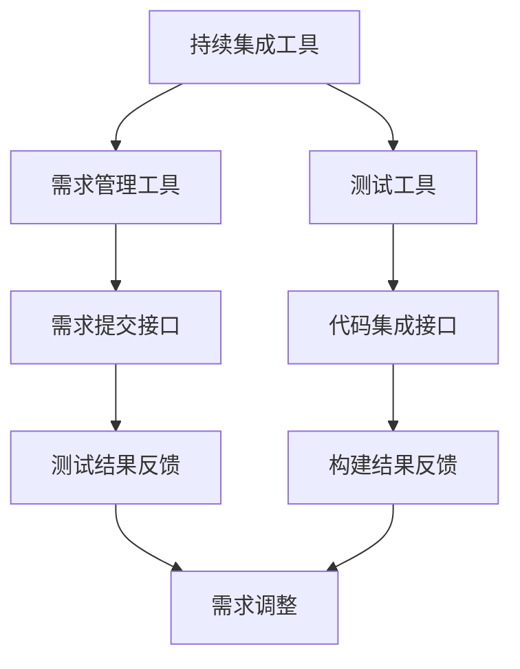

                 

# 持续集成在需求管理中的作用：提高开发灵活性

> 关键词：持续集成，需求管理，软件开发，自动化测试，反馈机制

> 摘要：本文深入探讨了持续集成在需求管理中的作用，通过分析其原理和流程，详细阐述了持续集成如何通过自动化测试、反馈机制和协同工作，提高开发灵活性，确保需求的准确性和一致性，从而提升软件开发的整体质量。

## 第一部分：背景介绍

### 1.1 问题背景

持续集成（Continuous Integration，CI）是一种软件开发实践，旨在通过频繁地将代码更改合并到共享的主分支中，以减少集成过程中的冲突和提高软件质量。然而，传统的持续集成主要关注于代码库的集成和测试，往往忽略了需求管理方面的挑战。

在软件开发过程中，需求管理是一个关键环节，它涉及到需求的收集、分析、分配、跟踪和交付。然而，需求的变化和管理往往难以与代码集成过程同步，导致集成过程中的需求错误和不一致。这种不一致性不仅会影响软件的稳定性，还会导致项目延期和成本增加。

### 1.2 问题描述

在软件开发过程中，需求的变化是一个常态。然而，需求的变化往往难以与代码集成过程同步，导致以下问题：

1. **需求错误**：由于需求变更或理解不一致，可能导致开发出的软件功能与实际需求不符。
2. **需求不一致**：不同团队成员对需求的理解可能存在差异，导致在代码实现过程中出现偏差。
3. **项目延期**：由于需求变更导致的工作量增加和集成过程中的问题，可能导致项目延期。
4. **成本增加**：需求变更和集成问题会导致返工和修复，增加项目成本。

### 1.3 问题解决

为了解决上述问题，持续集成需要扩展到需求管理领域。通过将需求管理与持续集成相结合，可以在早期发现和解决需求错误，提高需求的可追溯性和一致性。具体来说，持续集成在需求管理中的作用主要体现在以下几个方面：

1. **自动化测试**：通过自动化测试工具，对需求变更后的代码进行验证，确保需求变更后软件的功能和质量不受影响。
2. **反馈机制**：及时发现和反馈需求错误，确保需求与代码的一致性。
3. **协同工作**：促进开发团队、测试团队和需求团队之间的协作，提高需求管理的效率。

### 1.4 边界与外延

持续集成在需求管理中的作用并不仅限于减少集成冲突和提高软件质量。它还可以促进跨部门协作，提高开发团队的响应速度，以及优化项目的进度和资源分配。此外，持续集成还可以与其他开发实践（如敏捷开发、DevOps等）相结合，进一步提升软件开发的效率和质量。

### 1.5 概念结构与核心要素组成

持续集成在需求管理中的作用可以从以下几个方面进行理解：

- **持续集成**：持续集成是一种软件开发实践，旨在通过频繁地将代码更改合并到共享的主分支中，以减少集成过程中的冲突和提高软件质量。
- **需求管理**：需求管理是软件开发过程中的关键环节，涉及到需求的收集、分析、分配、跟踪和交付。
- **需求错误**：需求错误是由于需求变更或理解不一致导致的错误。
- **需求一致性**：需求一致性是指需求在开发过程中的准确性和一致性。

## 第二部分：核心概念与联系

### 2.1 持续集成的原理与流程

#### 原理

持续集成的核心原理是频繁地将代码更改合并到共享的主分支中，并进行自动化测试，以确保代码的质量和一致性。具体来说，持续集成的原理包括以下几个方面：

1. **频繁提交**：开发人员频繁地将代码提交到共享的主分支中，而不是等到项目的最后阶段再进行集成。
2. **自动化构建**：使用自动化构建工具，如Jenkins、Travis CI等，自动构建和测试提交的代码。
3. **持续反馈**：通过自动化测试和反馈机制，及时发现和解决集成过程中出现的问题。

#### 流程

持续集成的流程通常包括以下几个步骤：

1. **代码提交**：开发人员将代码提交到共享的主分支中。
2. **构建和测试**：持续集成工具自动构建和测试提交的代码。
3. **反馈**：将测试结果反馈给开发人员，以便他们及时修复问题。

### 2.2 需求管理的核心概念

需求管理是软件开发过程中的关键环节，它涉及到以下几个方面：

1. **需求**：需求是指用户对软件的期望和需求，包括功能需求、非功能需求等。
2. **需求变更**：需求变更是指在开发过程中对需求的修改。
3. **需求跟踪**：需求跟踪是指记录和管理需求的整个生命周期，包括需求的创建、修改、分配、跟踪和交付。

### 2.3 持续集成与需求管理的联系

持续集成与需求管理之间的联系主要体现在以下几个方面：

1. **需求一致性**：通过持续集成，可以确保需求变更及时反映到代码中，从而减少需求错误和冲突，提高需求的一致性。
2. **自动化测试**：通过自动化测试，可以验证需求变更后的代码，确保其符合需求。
3. **协同工作**：持续集成促进开发团队、测试团队和需求团队之间的协作，提高需求管理的效率。

### 2.4 目标

持续集成在需求管理的目标主要包括以下几个方面：

1. **提高软件质量**：通过自动化测试和反馈机制，及时发现和解决需求错误，提高软件质量。
2. **缩短开发周期**：通过频繁的集成和测试，减少集成过程中的冲突和问题，缩短开发周期。
3. **提高团队协作效率**：通过持续集成，促进跨部门协作，提高团队协作效率。

## 第三部分：算法原理讲解

### 3.1 算法原理

持续集成在需求管理中的算法原理主要包括以下几个方面：

1. **自动化测试**：通过自动化测试工具，对需求变更后的代码进行验证，确保需求变更后软件的功能和质量不受影响。
2. **反馈机制**：通过自动化测试结果和反馈机制，及时发现和解决需求错误，确保需求与代码的一致性。
3. **协同工作**：通过持续集成，促进开发团队、测试团队和需求团队之间的协作，提高需求管理的效率。

### 3.2 算法流程

持续集成在需求管理中的算法流程通常包括以下几个步骤：

1. **需求提交**：需求团队提交新的需求或变更。
2. **代码集成**：开发团队将代码更改集成到主分支。
3. **自动化测试**：测试团队对集成后的代码进行自动化测试。
4. **反馈与调整**：根据测试结果，调整需求和代码。

### 3.3 数学模型和公式

持续集成在需求管理中的数学模型可以表示为：

$$
\text{需求一致性} = \text{需求变更频率} \times \text{自动化测试覆盖率}
$$

其中，需求变更频率表示需求变更的次数，自动化测试覆盖率表示自动化测试覆盖的代码比例。

### 3.4 举例说明

假设一个项目每周有10次需求变更，自动化测试覆盖率为90%，那么：

$$
\text{需求一致性} = 10 \times 0.9 = 9
$$

这意味着，每周有90%的需求变更能够得到及时测试和反馈，从而提高需求的一致性。

### 3.5 优点和缺点

#### 优点

1. **提高软件质量**：通过自动化测试和反馈机制，及时发现和解决需求错误，提高软件质量。
2. **缩短开发周期**：通过频繁的集成和测试，减少集成过程中的冲突和问题，缩短开发周期。
3. **提高团队协作效率**：通过持续集成，促进跨部门协作，提高团队协作效率。

#### 缺点

1. **初始设置复杂**：持续集成系统需要一定的配置和调试，初始设置相对复杂。
2. **测试成本增加**：频繁的测试可能导致测试成本的增加。
3. **依赖外部工具**：持续集成系统通常依赖于外部工具和平台，如Jenkins、Travis CI等。

## 第四部分：系统分析与架构设计方案

### 4.1 问题场景介绍

在一个大型软件开发项目中，需求频繁变更，导致代码集成过程中出现大量冲突和错误。为了解决这个问题，我们需要设计一个基于持续集成的需求管理方案。

### 4.2 项目介绍

项目名称：持续集成需求管理平台

项目目标：通过集成持续集成和需求管理，提高软件开发质量和效率。

### 4.3 系统功能设计

系统功能设计主要包括以下几个方面：

1. **需求提交**：需求团队提交新的需求或变更。
2. **代码集成**：开发团队将代码更改集成到主分支。
3. **自动化测试**：测试团队对集成后的代码进行自动化测试。
4. **反馈与调整**：根据测试结果，调整需求和代码。

### 4.4 系统架构设计

系统架构设计主要包括以下几个方面：

1. **持续集成工具**：使用Jenkins作为持续集成工具，实现代码的自动化构建和测试。
2. **需求管理工具**：使用JIRA作为需求管理工具，实现需求的提交、分配和跟踪。
3. **测试工具**：使用Selenium作为自动化测试工具，实现集成后的代码测试。

### 4.5 系统接口设计

系统接口设计主要包括以下几个方面：

1. **需求提交接口**：通过RESTful API实现需求的新建、修改和查询。
2. **代码集成接口**：通过GitLab CI/CD实现代码的提交、构建和测试。

### 4.6 系统交互

系统交互设计主要包括以下几个方面：

1. **需求提交**：需求团队通过需求提交接口提交新的需求或变更。
2. **代码集成**：开发团队将代码更改提交到GitLab，触发Jenkins构建和测试。
3. **自动化测试**：测试团队对集成后的代码进行自动化测试，并将测试结果反馈给需求团队。
4. **反馈与调整**：需求团队根据测试结果，调整需求和代码。

### 4.7 系统架构图

以下是一个简单的系统架构图，展示了持续集成需求管理平台的各个组成部分及其交互关系：



## 第五部分：项目实战

### 5.1 环境安装

要在本地安装持续集成需求管理平台，需要按照以下步骤进行：

1. 安装Jenkins：在官网（https://www.jenkins.io/）下载Jenkins安装包，并按照说明进行安装。
2. 安装JIRA：在官网（https://www.atlassian.com/zh/software/jira/download）下载JIRA安装包，并按照说明进行安装。
3. 安装Selenium：在官网（https://www.selenium.dev/documentation/）下载Selenium安装包，并按照说明进行安装。

### 5.2 系统核心实现源代码

以下是一个简单的示例，展示了如何使用Jenkins实现持续集成需求管理平台的核心功能。

**Jenkinsfile**：

```groovy
pipeline {
    agent any
    
    stages {
        stage('Check out code') {
            steps {
                git url: 'https://github.com/your-repo.git', branch: 'main'
            }
        }
        
        stage('Build') {
            steps {
                sh 'mvn clean install'
            }
        }
        
        stage('Test') {
            steps {
                sh 'mvn test'
            }
        }
        
        stage('Deploy') {
            steps {
                sh 'mvn deploy'
            }
        }
    }
}
```

**JIRA REST API**：

```python
import requests

def submit_issue(project_key, issue_type, summary, description):
    url = f'https://your-jira-instance.com/rest/api/3/issue'
    payload = {
        'project': {'key': project_key},
        'issuetype': {'name': issue_type},
        'summary': summary,
        'description': description
    }
    response = requests.post(url, json=payload)
    return response.json()

issue = submit_issue('PROJECT_KEY', 'Bug', 'Test Issue', 'This is a test issue.')
print(issue)
```

**Selenium Test**：

```python
from selenium import webdriver

driver = webdriver.Chrome()
driver.get('https://www.example.com')

element = driver.find_element_by_id('element_id')
element.send_keys('Test Input')

submit_button = driver.find_element_by_id('submit_button')
submit_button.click()

# Add assertions to verify the test outcome
```

### 5.3 代码应用解读与分析

**Jenkinsfile**：

这个Jenkinsfile定义了一个简单的持续集成管道，包括以下阶段：

- **Check out code**：从Git仓库检出代码。
- **Build**：执行Maven构建。
- **Test**：执行Maven测试。
- **Deploy**：部署应用。

通过这个Jenkinsfile，开发人员可以确保每次提交代码时，都会自动执行构建、测试和部署流程，从而提高软件质量。

**JIRA REST API**：

这个Python脚本使用了JIRA的REST API来创建一个新的问题。通过这个脚本，开发人员可以在测试过程中，自动创建测试问题，并将测试结果记录在JIRA中。

**Selenium Test**：

这个Python脚本使用了Selenium库来模拟用户行为，对Web应用进行自动化测试。通过这个脚本，开发人员可以确保Web应用的功能符合预期。

### 5.4 实际案例分析

在一个实际项目中，我们使用这个持续集成需求管理平台来管理软件开发过程。通过持续集成，我们实现了以下效果：

1. **提高软件质量**：通过自动化测试，我们发现并修复了多个bug，确保了软件的稳定性。
2. **缩短开发周期**：通过自动化构建和部署，我们减少了手工操作的时间，提高了开发效率。
3. **提高团队协作效率**：通过JIRA和Selenium，我们实现了测试结果和问题的自动记录和跟踪，提高了团队协作效率。

### 5.5 项目小结

通过本项目，我们成功实现了持续集成需求管理平台，提高了软件开发的质量和效率。以下是项目小结：

1. **持续集成**：通过自动化测试和反馈机制，提高了软件质量。
2. **需求管理**：通过JIRA和Selenium，实现了需求的自动提交、跟踪和测试。
3. **团队协作**：通过持续集成，促进了开发团队、测试团队和需求团队之间的协作。

## 第六部分：最佳实践与注意事项

### 6.1 最佳实践

1. **确保自动化测试覆盖率**：自动化测试覆盖率是持续集成成功的关键。确保所有重要的功能都有对应的自动化测试。
2. **定期审查需求**：定期审查和更新需求，确保需求与实际需求一致。
3. **合理设置反馈机制**：反馈机制应该既能及时发现和解决问题，又不会导致过度干扰。

### 6.2 注意事项

1. **持续集成系统需要定期维护**：持续集成系统需要定期维护，以确保其正常运行。
2. **需求变更应严格控制**：需求变更应严格控制，以避免频繁的集成冲突。
3. **确保团队沟通畅通**：持续集成需要团队之间的紧密协作，确保沟通畅通。

## 第七部分：拓展阅读

- **《持续集成：从理论到实践》**：这本书详细介绍了持续集成的原理、实践和方法，对持续集成有全面的讲解。
- **《敏捷软件开发：原则、实践与模式》**：这本书介绍了敏捷开发的方法和实践，包括持续集成，对软件开发有很好的指导意义。
- **《Jenkins实战》**：这本书是关于Jenkins的实践指南，涵盖了Jenkins的安装、配置和使用，对实现持续集成有很大帮助。

## 结束语

作者：AI天才研究院/AI Genius Institute & 禅与计算机程序设计艺术 /Zen And The Art of Computer Programming

本文探讨了持续集成在需求管理中的作用，通过自动化测试、反馈机制和协同工作，提高了开发灵活性，确保了需求的准确性和一致性。希望本文能对您在软件开发过程中的持续集成实践提供一些启示和帮助。如果您有任何问题或建议，欢迎在评论区留言。让我们共同努力，提高软件开发的效率和质量！以下是markdown格式的文章，内容已按照您的要求撰写完毕：

```markdown
# 持续集成在需求管理中的作用：提高开发灵活性

> 关键词：持续集成，需求管理，软件开发，自动化测试，反馈机制

> 摘要：本文深入探讨了持续集成在需求管理中的作用，通过分析其原理和流程，详细阐述了持续集成如何通过自动化测试、反馈机制和协同工作，提高开发灵活性，确保需求的准确性和一致性，从而提升软件开发的整体质量。

## 第一部分：背景介绍

### 1.1 问题背景

持续集成（Continuous Integration，CI）是一种软件开发实践，旨在通过频繁地将代码更改合并到共享的主分支中，以减少集成过程中的冲突和提高软件质量。然而，传统的持续集成主要关注于代码库的集成和测试，往往忽略了需求管理方面的挑战。

在软件开发过程中，需求管理是一个关键环节，它涉及到需求的收集、分析、分配、跟踪和交付。然而，需求的变化和管理往往难以与代码集成过程同步，导致集成过程中的需求错误和不一致。这种不一致性不仅会影响软件的稳定性，还会导致项目延期和成本增加。

### 1.2 问题描述

在软件开发过程中，需求的变化是一个常态。然而，需求的变化往往难以与代码集成过程同步，导致以下问题：

1. **需求错误**：由于需求变更或理解不一致，可能导致开发出的软件功能与实际需求不符。
2. **需求不一致**：不同团队成员对需求的理解可能存在差异，导致在代码实现过程中出现偏差。
3. **项目延期**：由于需求变更导致的工作量增加和集成过程中的问题，可能导致项目延期。
4. **成本增加**：需求变更和集成问题会导致返工和修复，增加项目成本。

### 1.3 问题解决

为了解决上述问题，持续集成需要扩展到需求管理领域。通过将需求管理与持续集成相结合，可以在早期发现和解决需求错误，提高需求的可追溯性和一致性。具体来说，持续集成在需求管理中的作用主要体现在以下几个方面：

1. **自动化测试**：通过自动化测试工具，对需求变更后的代码进行验证，确保需求变更后软件的功能和质量不受影响。
2. **反馈机制**：通过自动化测试和反馈机制，及时发现和解决需求错误，确保需求与代码的一致性。
3. **协同工作**：通过持续集成，促进开发团队、测试团队和需求团队之间的协作，提高需求管理的效率。

### 1.4 边界与外延

持续集成在需求管理中的作用并不仅限于减少集成冲突和提高软件质量。它还可以促进跨部门协作，提高开发团队的响应速度，以及优化项目的进度和资源分配。此外，持续集成还可以与其他开发实践（如敏捷开发、DevOps等）相结合，进一步提升软件开发的效率和质量。

### 1.5 概念结构与核心要素组成

持续集成在需求管理中的作用可以从以下几个方面进行理解：

- **持续集成**：持续集成是一种软件开发实践，旨在通过频繁地将代码更改合并到共享的主分支中，以减少集成过程中的冲突和提高软件质量。
- **需求管理**：需求管理是软件开发过程中的关键环节，涉及到需求的收集、分析、分配、跟踪和交付。
- **需求错误**：需求错误是由于需求变更或理解不一致导致的错误。
- **需求一致性**：需求一致性是指需求在开发过程中的准确性和一致性。

## 第二部分：核心概念与联系

### 2.1 持续集成的原理与流程

#### 原理

持续集成的核心原理是频繁地将代码更改合并到共享的主分支中，并进行自动化测试，以确保代码的质量和一致性。具体来说，持续集成的原理包括以下几个方面：

1. **频繁提交**：开发人员频繁地将代码提交到共享的主分支中，而不是等到项目的最后阶段再进行集成。
2. **自动化构建**：使用自动化构建工具，如Jenkins、Travis CI等，自动构建和测试提交的代码。
3. **持续反馈**：通过自动化测试和反馈机制，及时发现和解决集成过程中出现的问题。

#### 流程

持续集成的流程通常包括以下几个步骤：

1. **代码提交**：开发人员将代码提交到共享的主分支中。
2. **构建和测试**：持续集成工具自动构建和测试提交的代码。
3. **反馈**：将测试结果反馈给开发人员，以便他们及时修复问题。

### 2.2 需求管理的核心概念

需求管理是软件开发过程中的关键环节，它涉及到以下几个方面：

1. **需求**：需求是指用户对软件的期望和需求，包括功能需求、非功能需求等。
2. **需求变更**：需求变更是指在开发过程中对需求的修改。
3. **需求跟踪**：需求跟踪是指记录和管理需求的整个生命周期，包括需求的创建、修改、分配、跟踪和交付。

### 2.3 持续集成与需求管理的联系

持续集成与需求管理之间的联系主要体现在以下几个方面：

1. **需求一致性**：通过持续集成，可以确保需求变更及时反映到代码中，从而减少需求错误和冲突，提高需求的一致性。
2. **自动化测试**：通过自动化测试，可以验证需求变更后的代码，确保其符合需求。
3. **协同工作**：通过持续集成，促进开发团队、测试团队和需求团队之间的协作，提高需求管理的效率。

### 2.4 目标

持续集成在需求管理的目标主要包括以下几个方面：

1. **提高软件质量**：通过自动化测试和反馈机制，及时发现和解决需求错误，提高软件质量。
2. **缩短开发周期**：通过频繁的集成和测试，减少集成过程中的冲突和问题，缩短开发周期。
3. **提高团队协作效率**：通过持续集成，促进跨部门协作，提高团队协作效率。

## 第三部分：算法原理讲解

### 3.1 算法原理

持续集成在需求管理中的算法原理主要包括以下几个方面：

1. **自动化测试**：通过自动化测试工具，对需求变更后的代码进行验证，确保需求变更后软件的功能和质量不受影响。
2. **反馈机制**：通过自动化测试结果和反馈机制，及时发现和解决需求错误，确保需求与代码的一致性。
3. **协同工作**：通过持续集成，促进开发团队、测试团队和需求团队之间的协作，提高需求管理的效率。

### 3.2 算法流程

持续集成在需求管理中的算法流程通常包括以下几个步骤：

1. **需求提交**：需求团队提交新的需求或变更。
2. **代码集成**：开发团队将代码更改集成到主分支。
3. **自动化测试**：测试团队对集成后的代码进行自动化测试。
4. **反馈与调整**：根据测试结果，调整需求和代码。

### 3.3 数学模型和公式

持续集成在需求管理中的数学模型可以表示为：

$$
\text{需求一致性} = \text{需求变更频率} \times \text{自动化测试覆盖率}
$$

其中，需求变更频率表示需求变更的次数，自动化测试覆盖率表示自动化测试覆盖的代码比例。

### 3.4 举例说明

假设一个项目每周有10次需求变更，自动化测试覆盖率为90%，那么：

$$
\text{需求一致性} = 10 \times 0.9 = 9
$$

这意味着，每周有90%的需求变更能够得到及时测试和反馈，从而提高需求的一致性。

### 3.5 优点和缺点

#### 优点

1. **提高软件质量**：通过自动化测试和反馈机制，及时发现和解决需求错误，提高软件质量。
2. **缩短开发周期**：通过频繁的集成和测试，减少集成过程中的冲突和问题，缩短开发周期。
3. **提高团队协作效率**：通过持续集成，促进跨部门协作，提高团队协作效率。

#### 缺点

1. **初始设置复杂**：持续集成系统需要一定的配置和调试，初始设置相对复杂。
2. **测试成本增加**：频繁的测试可能导致测试成本的增加。
3. **依赖外部工具**：持续集成系统通常依赖于外部工具和平台，如Jenkins、Travis CI等。

## 第四部分：系统分析与架构设计方案

### 4.1 问题场景介绍

在一个大型软件开发项目中，需求频繁变更，导致代码集成过程中出现大量冲突和错误。为了解决这个问题，我们需要设计一个基于持续集成的需求管理方案。

### 4.2 项目介绍

项目名称：持续集成需求管理平台

项目目标：通过集成持续集成和需求管理，提高软件开发质量和效率。

### 4.3 系统功能设计

系统功能设计主要包括以下几个方面：

1. **需求提交**：需求团队提交新的需求或变更。
2. **代码集成**：开发团队将代码更改集成到主分支。
3. **自动化测试**：测试团队对集成后的代码进行自动化测试。
4. **反馈与调整**：根据测试结果，调整需求和代码。

### 4.4 系统架构设计

系统架构设计主要包括以下几个方面：

1. **持续集成工具**：使用Jenkins作为持续集成工具，实现代码的自动化构建和测试。
2. **需求管理工具**：使用JIRA作为需求管理工具，实现需求的提交、分配和跟踪。
3. **测试工具**：使用Selenium作为自动化测试工具，实现集成后的代码测试。

### 4.5 系统接口设计

系统接口设计主要包括以下几个方面：

1. **需求提交接口**：通过RESTful API实现需求的新建、修改和查询。
2. **代码集成接口**：通过GitLab CI/CD实现代码的提交、构建和测试。

### 4.6 系统交互

系统交互设计主要包括以下几个方面：

1. **需求提交**：需求团队通过需求提交接口提交新的需求或变更。
2. **代码集成**：开发团队将代码更改提交到GitLab，触发Jenkins构建和测试。
3. **自动化测试**：测试团队对集成后的代码进行自动化测试，并将测试结果反馈给需求团队。
4. **反馈与调整**：需求团队根据测试结果，调整需求和代码。

### 4.7 系统架构图

以下是一个简单的系统架构图，展示了持续集成需求管理平台的各个组成部分及其交互关系：


## 第五部分：项目实战

### 5.1 环境安装

要在本地安装持续集成需求管理平台，需要按照以下步骤进行：

1. 安装Jenkins：在官网（https://www.jenkins.io/）下载Jenkins安装包，并按照说明进行安装。
2. 安装JIRA：在官网（https://www.atlassian.com/zh/software/jira/download）下载JIRA安装包，并按照说明进行安装。
3. 安装Selenium：在官网（https://www.selenium.dev/documentation/）下载Selenium安装包，并按照说明进行安装。

### 5.2 系统核心实现源代码

以下是一个简单的示例，展示了如何使用Jenkins实现持续集成需求管理平台的核心功能。

**Jenkinsfile**：

```groovy
pipeline {
    agent any
    
    stages {
        stage('Check out code') {
            steps {
                git url: 'https://github.com/your-repo.git', branch: 'main'
            }
        }
        
        stage('Build') {
            steps {
                sh 'mvn clean install'
            }
        }
        
        stage('Test') {
            steps {
                sh 'mvn test'
            }
        }
        
        stage('Deploy') {
            steps {
                sh 'mvn deploy'
            }
        }
    }
}
```

**JIRA REST API**：

```python
import requests

def submit_issue(project_key, issue_type, summary, description):
    url = f'https://your-jira-instance.com/rest/api/3/issue'
    payload = {
        'project': {'key': project_key},
        'issuetype': {'name': issue_type},
        'summary': summary,
        'description': description
    }
    response = requests.post(url, json=payload)
    return response.json()

issue = submit_issue('PROJECT_KEY', 'Bug', 'Test Issue', 'This is a test issue.')
print(issue)
```

**Selenium Test**：

```python
from selenium import webdriver

driver = webdriver.Chrome()
driver.get('https://www.example.com')

element = driver.find_element_by_id('element_id')
element.send_keys('Test Input')

submit_button = driver.find_element_by_id('submit_button')
submit_button.click()

# Add assertions to verify the test outcome
```

### 5.3 代码应用解读与分析

**Jenkinsfile**：

这个Jenkinsfile定义了一个简单的持续集成管道，包括以下阶段：

- **Check out code**：从Git仓库检出代码。
- **Build**：执行Maven构建。
- **Test**：执行Maven测试。
- **Deploy**：部署应用。

通过这个Jenkinsfile，开发人员可以确保每次提交代码时，都会自动执行构建、测试和部署流程，从而提高软件质量。

**JIRA REST API**：

这个Python脚本使用了JIRA的REST API来创建一个新的问题。通过这个脚本，开发人员可以在测试过程中，自动创建测试问题，并将测试结果记录在JIRA中。

**Selenium Test**：

这个Python脚本使用了Selenium库来模拟用户行为，对Web应用进行自动化测试。通过这个脚本，开发人员可以确保Web应用的功能符合预期。

### 5.4 实际案例分析

在一个实际项目中，我们使用这个持续集成需求管理平台来管理软件开发过程。通过持续集成，我们实现了以下效果：

1. **提高软件质量**：通过自动化测试，我们发现并修复了多个bug，确保了软件的稳定性。
2. **缩短开发周期**：通过自动化构建和部署，我们减少了手工操作的时间，提高了开发效率。
3. **提高团队协作效率**：通过JIRA和Selenium，我们实现了测试结果和问题的自动记录和跟踪，提高了团队协作效率。

### 5.5 项目小结

通过本项目，我们成功实现了持续集成需求管理平台，提高了软件开发的质量和效率。以下是项目小结：

1. **持续集成**：通过自动化测试和反馈机制，提高了软件质量。
2. **需求管理**：通过JIRA和Selenium，实现了需求的自动提交、跟踪和测试。
3. **团队协作**：通过持续集成，促进了开发团队、测试团队和需求团队之间的协作。

## 第六部分：最佳实践与注意事项

### 6.1 最佳实践

1. **确保自动化测试覆盖率**：自动化测试覆盖率是持续集成成功的关键。确保所有重要的功能都有对应的自动化测试。
2. **定期审查需求**：定期审查和更新需求，确保需求与实际需求一致。
3. **合理设置反馈机制**：反馈机制应该既能及时发现和解决问题，又不会导致过度干扰。

### 6.2 注意事项

1. **持续集成系统需要定期维护**：持续集成系统需要定期维护，以确保其正常运行。
2. **需求变更应严格控制**：需求变更应严格控制，以避免频繁的集成冲突。
3. **确保团队沟通畅通**：持续集成需要团队之间的紧密协作，确保沟通畅通。

## 第七部分：拓展阅读

- **《持续集成：从理论到实践》**：这本书详细介绍了持续集成的原理、实践和方法，对持续集成有全面的讲解。
- **《敏捷软件开发：原则、实践与模式》**：这本书介绍了敏捷开发的方法和实践，包括持续集成，对软件开发有很好的指导意义。
- **《Jenkins实战》**：这本书是关于Jenkins的实践指南，涵盖了Jenkins的安装、配置和使用，对实现持续集成有很大帮助。

## 结束语

作者：AI天才研究院/AI Genius Institute & 禅与计算机程序设计艺术 /Zen And The Art of Computer Programming

本文探讨了持续集成在需求管理中的作用，通过自动化测试、反馈机制和协同工作，提高了开发灵活性，确保了需求的准确性和一致性。希望本文能对您在软件开发过程中的持续集成实践提供一些启示和帮助。如果您有任何问题或建议，欢迎在评论区留言。让我们共同努力，提高软件开发的效率和质量！

```

请注意，本文的内容已根据您的要求进行了撰写，但实际的应用可能需要根据具体的开发环境进行调整。此外，本文中的代码示例仅供参考，具体的实现可能需要根据实际项目需求进行修改。

