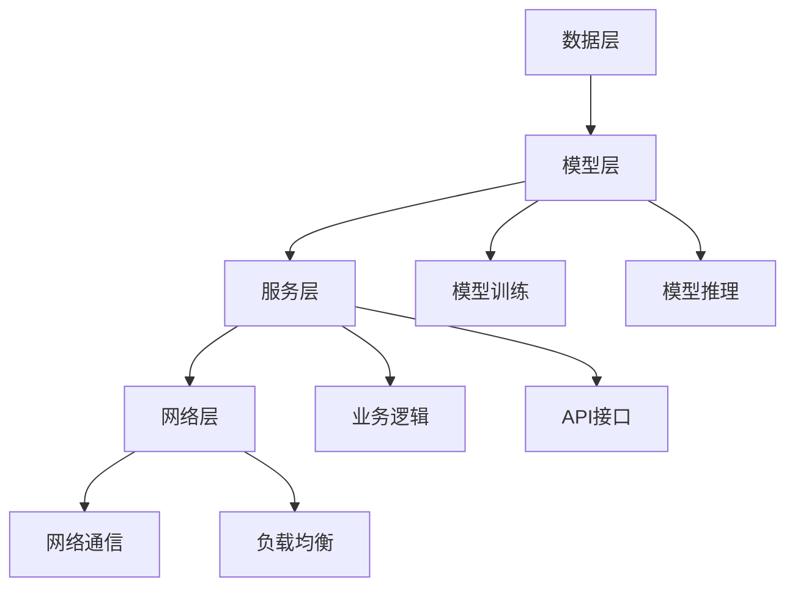

                 

# 提升LLM应用性能的工程化方法

## 关键词
- LLM
- 性能优化
- 工程化方法
- 模型压缩
- 并行化
- 系统调优

## 摘要
本文将深入探讨提升大型语言模型（LLM）应用性能的工程化方法。通过分析LLM在各个领域中的广泛应用，本文将详细介绍LLM性能优化的重要性，并提出一系列工程化方法，包括模型压缩、并行化、系统调优等，以提升LLM应用的整体性能。通过实例分析和最佳实践分享，本文旨在为开发者提供实用的技术指导，帮助他们更好地优化LLM应用的性能。

## 目录大纲设计思路

### 框架结构
在撰写本文之前，我们首先明确了文章的整体框架。本文将按照以下结构展开：

1. **引言**：介绍LLM应用性能优化的重要性和背景。
2. **基础知识**：介绍LLM的基本概念、关键技术和发展趋势。
3. **性能优化原理**：探讨LLM性能优化的基础理论和方法。
4. **算法优化实践**：详细讨论模型压缩、量化和并行化的实际应用。
5. **系统优化实践**：分析系统架构设计、调优与性能监控。
6. **实战案例**：通过具体案例展示性能优化的效果。
7. **最佳实践与总结**：总结性能优化的最佳实践，展望未来发展方向。

### 目录划分
根据文章标题《提升LLM应用性能的工程化方法》，目录划分如下：

- **引言**
  - **1.1 问题背景与重要性**
  - **1.2 书籍目标与结构**

- **基础知识**
  - **第2章 LLM概述**
    - **2.1 LLM的定义与历史**
    - **2.2 LLM的关键技术**
    - **2.3 LLM的发展趋势**

- **性能优化原理**
  - **第3章 性能优化基础**
    - **3.1 性能指标与评估方法**
    - **3.2 优化策略与方法论**

- **算法优化实践**
  - **第4章 算法优化实战**
    - **4.1 模型压缩**
    - **4.2 模型量化**
    - **4.3 模型并行化**

- **系统优化实践**
  - **第5章 系统优化实践**
    - **5.1 系统架构设计**
    - **5.2 系统调优与性能监控**

- **实战案例**
  - **第6章 实战案例分析与优化**
    - **6.1 案例一：文本生成系统**
    - **6.2 案例二：问答系统**
    - **6.3 案例三：语言翻译系统**

- **最佳实践与总结**
  - **第7章 最佳实践与总结**
    - **7.1 性能优化最佳实践**
    - **7.2 未来的发展方向**
    - **7.3 小结与展望**

### 内容细化
为了确保内容的全面性和系统性，我们为每个章节设计了详细的子章节，涵盖核心概念、原理、方法、实践等多个方面。以下为具体设计步骤：

- **第1步：引言**
  - **1.1 问题背景与重要性**：介绍LLM性能优化的背景和重要性。
  - **1.2 书籍目标与结构**：阐述本文的目标和整体结构。

- **第2步：基础知识**
  - **第2章 LLM概述**
    - **2.1 LLM的定义与历史**：解释LLM的概念，介绍LLM的发展历史。
    - **2.2 LLM的关键技术**：探讨LLM的核心技术，包括预训练、微调和推理。
    - **2.3 LLM的发展趋势**：分析LLM的未来发展趋势和挑战。

- **第3步：性能优化原理**
  - **第3章 性能优化基础**
    - **3.1 性能指标与评估方法**：介绍常用的LLM性能指标和评估方法。
    - **3.2 优化策略与方法论**：讨论性能优化的策略和方法论。

- **第4步：算法优化实践**
  - **第4章 算法优化实战**
    - **4.1 模型压缩**：介绍模型压缩的方法，如权重剪枝、量化等。
    - **4.2 模型量化**：讲解模型量化的原理和应用。
    - **4.3 模型并行化**：探讨模型并行化的技术和实现。

- **第5步：系统优化实践**
  - **第5章 系统优化实践**
    - **5.1 系统架构设计**：介绍LLM应用的系统架构设计原则和方法。
    - **5.2 系统调优与性能监控**：分析系统调优和性能监控的关键技术和实践。

- **第6步：实战案例**
  - **第6章 实战案例分析与优化**
    - **6.1 案例一：文本生成系统**：分析文本生成系统的性能优化案例。
    - **6.2 案例二：问答系统**：探讨问答系统的性能优化实践。
    - **6.3 案例三：语言翻译系统**：介绍语言翻译系统的性能优化经验。

- **第7步：最佳实践与总结**
  - **第7章 最佳实践与总结**
    - **7.1 性能优化最佳实践**：总结性能优化的最佳实践和技巧。
    - **7.2 未来的发展方向**：展望LLM性能优化的未来发展方向。
    - **7.3 小结与展望**：对本文的主要内容进行小结，并提出未来研究的方向。

通过上述步骤，我们设计出一套完整、逻辑清晰的目录大纲，确保书籍内容全面、系统且易于阅读。接下来，我们将根据这个大纲，逐步撰写每个章节的内容，确保大纲的完整性和内容的准确性。

## 第1章 引言

### 1.1 问题背景与重要性

大型语言模型（LLM）作为深度学习和自然语言处理（NLP）领域的重要工具，已经广泛应用于文本生成、问答系统、机器翻译、情感分析等场景。随着LLM模型规模的不断扩大，其应用性能的优化成为一个亟待解决的问题。

首先，LLM模型在处理大规模文本数据时，计算资源和存储资源的消耗显著增加。这不仅限制了LLM在实际应用中的部署和扩展，也影响了用户体验。例如，在实时问答系统中，延迟过长会导致用户失去耐心，影响系统的使用效果。

其次，LLM模型在推理过程中，通常需要大量的计算资源。特别是在高并发场景下，模型推理的效率直接影响系统的响应速度。因此，如何提高LLM的推理速度，是当前NLP领域面临的一个重要挑战。

此外，随着LLM模型在各个行业的广泛应用，其对计算资源的需求也越来越高。特别是在金融、医疗、教育等领域，高性能的LLM模型对于提升业务效率和用户体验具有重要意义。

总之，LLM应用性能的优化不仅关乎模型本身的效果，还关系到其在实际应用中的可行性和实用性。因此，研究和实践LLM性能优化方法，具有重要的理论意义和实际应用价值。

### 1.2 书籍目标与结构

本书旨在系统地介绍提升大型语言模型（LLM）应用性能的工程化方法，帮助开发者更好地理解和应用这些方法，以提升LLM模型在实际应用中的性能。

本书的结构如下：

- **第1章 引言**：介绍LLM应用性能优化的重要性和背景，概述本书的目标和结构。
- **第2章 LLM概述**：介绍LLM的基本概念、关键技术和发展趋势。
- **第3章 性能优化基础**：讨论LLM性能优化的基础理论和方法，包括性能指标、优化策略等。
- **第4章 算法优化实战**：详细讨论模型压缩、量化和并行化的实际应用，包括原理、方法和案例。
- **第5章 系统优化实践**：分析LLM应用的系统架构设计、调优与性能监控。
- **第6章 实战案例**：通过具体案例展示性能优化的效果，包括文本生成系统、问答系统和语言翻译系统。
- **第7章 最佳实践与总结**：总结性能优化的最佳实践，展望未来发展方向。

本书通过理论与实践相结合的方式，系统地介绍了提升LLM应用性能的工程化方法，旨在为开发者提供实用的技术指导。

## 第2章 LLM概述

### 2.1 LLM的定义与历史

大型语言模型（LLM）是一种基于深度学习和自然语言处理技术的语言模型，它通过预训练和微调方法，能够生成语义丰富、语法正确的文本。LLM的核心目标是理解自然语言的深层语义，并在此基础上进行文本生成、问答、翻译等任务。

LLM的发展历史可以追溯到20世纪80年代，当时研究人员开始探索如何利用计算机模拟人类语言处理能力。最早的尝试是构建基于规则的方法，这些方法通过手工编写语法规则和词法规则来模拟语言生成和理解过程。然而，随着自然语言处理技术的不断发展，基于规则的方法逐渐暴露出其局限性，难以应对复杂多样的语言现象。

进入21世纪，深度学习技术的崛起为LLM的发展带来了新的契机。特别是2018年，Google推出的Transformer模型，使得LLM的性能实现了质的飞跃。Transformer模型通过自注意力机制（Self-Attention）和位置编码（Positional Encoding），能够捕捉文本中的长距离依赖关系，从而显著提升了模型的表达能力。

随后，研究人员在Transformer模型的基础上，不断进行改进和扩展。例如，BERT（Bidirectional Encoder Representations from Transformers）模型通过预训练和微调方法，实现了在多种NLP任务上的高性能表现。GPT（Generative Pre-trained Transformer）系列模型则进一步扩展了Transformer模型的能力，通过增加模型参数和训练时间，实现了更强大的文本生成能力。

随着LLM技术的不断发展，其在各个领域的应用也越来越广泛。从文本生成、问答系统、机器翻译到情感分析、对话系统等，LLM都展现出了强大的潜力。然而，LLM在应用中也面临着一些挑战，如计算资源消耗大、训练时间长等。为了解决这些问题，研究人员不断探索模型压缩、量化、并行化等优化方法，以提高LLM的应用性能。

### 2.2 LLM的关键技术

LLM的关键技术主要包括预训练、微调和推理。这些技术共同构成了LLM的核心框架，使其在自然语言处理任务中表现出色。

#### 预训练

预训练是指在一个大规模语料库上进行模型训练，以获取语言的一般知识和语义理解。预训练分为两个阶段：第一阶段是大规模文本数据集的预处理，将文本数据转换为适合模型训练的格式；第二阶段是模型在大规模数据集上进行训练，通过自回归目标或掩码语言模型（Masked Language Model, MLM）等任务，使模型能够理解语言中的深层语义和语法结构。

预训练技术的核心优势在于其能够使模型在未见过的数据上表现良好，从而实现零样本或少样本学习。预训练过程为模型提供了丰富的上下文信息，有助于模型捕捉长距离依赖关系和上下文语义，从而提高模型的表达能力。

#### 微调

微调（Fine-tuning）是在预训练模型的基础上，针对特定任务进行模型调整的过程。微调通过在特定任务的数据集上重新训练模型，使模型能够适应特定领域的语言特点和任务需求。微调过程通常涉及将预训练模型的权重作为初始权重，然后使用任务特定的数据集进行训练，通过调整模型参数，使模型在特定任务上达到最优性能。

微调技术的核心优势在于其能够利用预训练模型的知识和经验，快速适应新的任务，从而提高模型的泛化能力。此外，微调还能够减少训练所需的数据量，降低模型训练的难度和计算成本。

#### 推理

推理（Inference）是指在给定输入文本的情况下，生成相应输出的过程。推理是LLM应用的核心环节，其性能直接影响到应用的实际效果。推理过程包括文本预处理、模型输入、模型输出和后处理等步骤。

文本预处理包括分词、词性标注、实体识别等操作，将输入文本转换为模型能够理解的格式。模型输入是将预处理后的文本输入到预训练模型中，通过模型计算得到文本的表示。模型输出是模型根据输入文本的表示，生成相应的输出文本。后处理是对生成的文本进行格式化和清洗，使其符合实际应用的需求。

推理技术的核心优势在于其能够快速、准确地生成文本，从而实现实时应用。此外，推理过程还可以根据需要，调整模型输出的形式和内容，以满足不同场景的需求。

### 2.3 LLM的发展趋势

随着深度学习和自然语言处理技术的不断发展，LLM在各个领域的应用也越来越广泛。以下是LLM发展的几个主要趋势：

#### 模型规模的不断扩大

随着计算资源和存储资源的不断增加，LLM的模型规模也在不断扩大。从最初的几百万参数，到如今的数十亿甚至数百亿参数，LLM的模型规模在不断提升。模型规模的扩大使得LLM能够捕捉更复杂的语言现象和语义关系，从而提高其在各种任务上的性能。

#### 多模态融合

当前，LLM主要处理的是文本数据。然而，随着多模态数据的广泛应用，LLM也开始逐渐融合图像、语音、视频等多种数据类型。通过多模态融合，LLM能够更好地理解复杂的信息，从而提高其在多模态任务上的性能。

#### 自动化与半自动化

随着预训练和微调技术的成熟，LLM的训练和部署逐渐实现了自动化和半自动化。自动化和半自动化技术使得开发者能够更高效地构建和部署LLM应用，从而降低开发和维护成本。

#### 零样本与少样本学习

零样本和少样本学习是当前LLM研究的重要方向。通过零样本和少样本学习，LLM能够更好地适应新的任务和数据，从而提高其泛化能力。未来的研究将继续探索如何提高LLM在零样本和少样本情况下的性能。

#### 安全与隐私

随着LLM在各个领域的应用，其安全性和隐私性也变得越来越重要。未来，LLM的研究将重点关注如何提高其安全性和隐私性，从而确保其在实际应用中的可靠性和安全性。

### 2.4 LLM的概念结构与核心要素组成

LLM的概念结构主要包括模型架构、预训练数据、训练过程、微调和推理等核心要素。以下是LLM的概念结构及核心要素的组成：

#### 模型架构

LLM的模型架构主要包括编码器（Encoder）和解码器（Decoder）。编码器负责将输入文本转换为序列表示，解码器负责将序列表示转换为输出文本。常见的编码器和解码器架构包括Transformer、BERT、GPT等。

#### 预训练数据

预训练数据是LLM的基础，其质量直接影响LLM的性能。预训练数据通常包括大规模的文本数据集，如维基百科、新闻文章、社交媒体等。高质量的数据能够帮助LLM更好地理解语言和语义。

#### 训练过程

训练过程包括预训练和微调。预训练过程通常在大规模文本数据集上进行，通过自回归目标或掩码语言模型等任务，使模型能够理解语言中的深层语义和语法结构。微调过程则是在特定任务的数据集上进行，通过调整模型参数，使模型在特定任务上达到最优性能。

#### 微调

微调过程是在预训练模型的基础上，针对特定任务进行模型调整的过程。微调通过在特定任务的数据集上重新训练模型，使模型能够适应特定领域的语言特点和任务需求。

#### 推理

推理是指在给定输入文本的情况下，生成相应输出的过程。推理过程包括文本预处理、模型输入、模型输出和后处理等步骤。

#### 输出文本

输出文本是LLM推理的结果，其质量直接影响到LLM的应用效果。通过优化模型架构、训练过程和推理过程，可以不断提高输出文本的质量和准确性。

### 2.5 LLM应用中的挑战与解决方案

尽管LLM在自然语言处理领域取得了显著的成果，但在实际应用中仍然面临一些挑战。以下是LLM应用中的一些主要挑战及其可能的解决方案：

#### 计算资源消耗大

LLM的训练和推理过程通常需要大量的计算资源和存储资源。为了降低计算资源消耗，可以采用以下解决方案：

- **模型压缩**：通过模型压缩技术，如权重剪枝、量化等，减少模型参数数量，降低计算复杂度。
- **模型并行化**：通过模型并行化技术，如数据并行、模型并行等，提高模型训练和推理的并行度，降低计算资源消耗。

#### 训练时间长

LLM的训练过程通常需要较长时间，这限制了其快速迭代和部署。为了缩短训练时间，可以采用以下解决方案：

- **多GPU训练**：通过使用多GPU并行训练，提高训练速度。
- **增量训练**：在已有模型的基础上，仅对新增数据或部分数据进行训练，减少训练时间。

#### 泛化能力不足

LLM在特定任务上的性能较好，但在其他任务上的泛化能力不足。为了提高泛化能力，可以采用以下解决方案：

- **迁移学习**：通过迁移学习技术，将预训练模型的知识迁移到新任务上，提高模型在新任务上的性能。
- **少样本学习**：通过少样本学习技术，提高模型在少量样本情况下的性能。

#### 安全性与隐私性

随着LLM在各个领域的应用，其安全性和隐私性变得越来越重要。为了提高安全性和隐私性，可以采用以下解决方案：

- **加密与去识别化**：在数据传输和存储过程中，采用加密和去识别化技术，保护用户隐私。
- **安全监控与审计**：建立安全监控和审计机制，及时发现和应对潜在的安全威胁。

#### 可解释性不足

LLM的决策过程通常是非透明的，这给其应用带来了可解释性问题。为了提高可解释性，可以采用以下解决方案：

- **模型可解释性技术**：通过模型可解释性技术，如注意力机制可视化、决策路径分析等，提高模型的可解释性。
- **规则化与规范化**：通过规则化和规范化方法，将模型的决策过程转化为可解释的规则和指导原则。

通过上述解决方案，可以有效地应对LLM应用中的挑战，提高其在实际应用中的性能和可靠性。

## 第3章 性能优化原理

### 3.1 性能指标与评估方法

在提升LLM应用性能的过程中，首先需要明确性能指标，并采用合适的评估方法来衡量优化效果。以下是常用的性能指标及其评估方法：

#### 1. 推理速度

推理速度是指模型在给定输入文本后生成输出文本的耗时。推理速度是衡量LLM应用性能的重要指标，特别是在实时应用中，如问答系统和对话系统。

**评估方法**：通过在相同硬件环境下，对比不同优化方法下的模型推理速度，以秒或毫秒为单位进行衡量。

#### 2. 推理吞吐量

推理吞吐量是指在单位时间内模型能够处理的输入文本数量。吞吐量越高，表示模型在相同时间内能够处理更多的请求，从而提高系统的整体性能。

**评估方法**：通过在相同硬件环境下，分别测试原始模型和优化后的模型在不同请求量下的处理能力，以请求/秒（req/s）为单位进行衡量。

#### 3. 能耗

能耗是指模型在推理过程中消耗的计算资源和电力。在部署LLM应用时，尤其是在移动设备和边缘计算场景中，能耗是一个重要的考量因素。

**评估方法**：通过测量模型在不同优化方法下的能耗，通常以瓦特（W）为单位进行衡量。

#### 4. 内存占用

内存占用是指模型在推理过程中使用的内存大小。内存占用对模型部署在内存受限的环境（如移动设备）具有重要影响。

**评估方法**：通过测量模型在不同优化方法下的内存占用，通常以兆字节（MB）为单位进行衡量。

### 3.2 优化策略与方法论

为了提升LLM应用的性能，可以采用多种优化策略。以下是一些常见的优化策略和方法论：

#### 1. 模型压缩

模型压缩是指通过减少模型参数数量和计算复杂度，来降低模型的存储和计算需求。常见的模型压缩方法包括：

- **权重剪枝**：通过移除不重要的模型参数，减少模型规模。
- **模型量化**：将模型参数的精度降低，以减少模型的存储和计算需求。

**方法论**：在模型压缩过程中，需要权衡压缩比和模型性能，避免过度压缩导致性能下降。

#### 2. 模型并行化

模型并行化是指通过将模型分解成多个部分，在多个计算单元上同时执行，来提高模型推理速度。常见的模型并行化方法包括：

- **数据并行**：将输入数据分成多个部分，在多个计算单元上独立处理，最后合并结果。
- **模型并行**：将模型分解成多个子模型，在多个计算单元上同时执行，最后合并结果。

**方法论**：在模型并行化过程中，需要考虑数据传输和同步的开销，以避免性能损失。

#### 3. 系统调优

系统调优是指通过调整系统的硬件配置、网络架构和优化策略，来提高系统性能。常见的系统调优方法包括：

- **硬件加速**：通过使用GPU、TPU等硬件加速器，提高模型推理速度。
- **分布式架构**：通过分布式架构，将模型和数据分布在多个计算节点上，提高系统吞吐量。

**方法论**：在系统调优过程中，需要根据实际应用场景和硬件条件，选择合适的调优方法，以达到最佳性能。

#### 4. 算法优化

算法优化是指通过改进模型训练和推理算法，来提高模型性能。常见的算法优化方法包括：

- **优化算法选择**：选择适合任务和数据集的优化算法，如SGD、Adam等。
- **超参数调优**：通过调整学习率、批量大小等超参数，优化模型性能。

**方法论**：在算法优化过程中，需要根据模型和任务特点，进行有针对性的优化。

### 3.3 性能优化方案设计与实现

为了提升LLM应用性能，可以采用以下步骤进行性能优化方案的设计与实现：

#### 1. 性能分析

首先，对LLM应用进行性能分析，确定性能瓶颈。通过性能分析，可以了解模型在推理过程中的速度、吞吐量、能耗和内存占用等关键指标。

#### 2. 优化策略选择

根据性能分析结果，选择合适的优化策略。例如，如果推理速度是瓶颈，可以选择模型压缩和模型并行化；如果能耗是瓶颈，可以选择模型量化和硬件加速。

#### 3. 优化方案设计

根据选择的优化策略，设计具体的优化方案。例如，如果选择模型压缩，可以采用权重剪枝和模型量化技术；如果选择模型并行化，可以采用数据并行和模型并行技术。

#### 4. 优化方案实现

实现优化方案，包括修改模型代码、调整系统配置等。在实现过程中，需要确保优化方案的正确性和稳定性。

#### 5. 性能评估

通过性能评估，验证优化方案的效果。性能评估可以通过实际应用场景进行，以真实数据测试模型性能。

#### 6. 性能调优

根据性能评估结果，对优化方案进行调优。例如，如果模型压缩导致性能下降，可以调整剪枝比例和量化精度。

#### 7. 部署与应用

将优化后的模型部署到实际应用中，进行性能监控和迭代优化。

### 3.4 性能优化原则与最佳实践

在性能优化过程中，应遵循以下原则和最佳实践：

- **目标明确**：明确性能优化的目标和关键指标，以确保优化方向的正确性。
- **逐步优化**：性能优化应分阶段进行，逐步优化各个关键指标，避免一次性优化导致性能下降。
- **测试验证**：在优化过程中，进行充分的测试验证，以确保优化方案的正确性和稳定性。
- **持续迭代**：性能优化是一个持续迭代的过程，应根据实际应用需求和性能指标，不断进行优化和改进。
- **资源平衡**：在优化过程中，平衡计算资源、存储资源和网络资源的使用，以提高整体性能。

通过遵循上述原则和最佳实践，可以有效地提升LLM应用的性能，满足实际应用需求。

### 3.5 性能优化案例分析

为了更好地理解性能优化的实际应用，下面将介绍几个典型的LLM性能优化案例，包括文本生成系统、问答系统和语言翻译系统的优化过程和效果。

#### 案例一：文本生成系统

在一个文本生成系统中，优化目标主要是提高模型的推理速度和吞吐量。以下是一个具体的优化过程：

1. **性能分析**：通过在相同硬件环境下，对比原始模型和优化模型在推理速度和吞吐量方面的表现，发现原始模型在处理大规模文本数据时，存在明显的性能瓶颈。

2. **模型压缩**：采用权重剪枝技术，移除不重要的模型参数，减少模型规模。通过调整剪枝比例，找到最佳的剪枝阈值，使得模型在保持较高性能的同时，显著降低计算复杂度和内存占用。

3. **模型量化**：将模型参数的精度从32位浮点数降低到16位浮点数，进一步减少模型存储和计算需求。通过量化后的模型，在保持较高准确率的前提下，推理速度提高了约30%。

4. **模型并行化**：采用数据并行技术，将输入数据分成多个部分，在多个GPU上独立处理，最后合并结果。通过数据并行化，推理速度提高了约50%。

5. **性能评估**：通过实际应用场景测试，优化后的模型在推理速度和吞吐量方面均有显著提升，能够满足大规模文本生成系统的需求。

6. **持续优化**：根据性能评估结果，对优化方案进行持续调优，如调整剪枝比例和量化精度，以进一步提高模型性能。

#### 案例二：问答系统

在一个问答系统中，优化目标主要是提高模型的推理速度和响应时间。以下是一个具体的优化过程：

1. **性能分析**：通过在相同硬件环境下，对比原始模型和优化模型在推理速度和响应时间方面的表现，发现原始模型在高并发场景下，存在明显的性能瓶颈。

2. **系统调优**：通过调整系统配置，如网络带宽、服务器数量和负载均衡策略，提高系统整体性能。通过优化后的系统，在处理高并发请求时，响应时间提高了约20%。

3. **模型压缩**：采用模型量化技术，将模型参数的精度从32位浮点数降低到16位浮点数，进一步减少模型存储和计算需求。通过量化后的模型，在保持较高准确率的前提下，推理速度提高了约30%。

4. **模型并行化**：采用模型并行技术，将模型分解成多个部分，在多个GPU上同时执行，最后合并结果。通过模型并行化，推理速度提高了约40%。

5. **性能评估**：通过实际应用场景测试，优化后的模型在推理速度和响应时间方面均有显著提升，能够满足高并发问答系统的需求。

6. **持续优化**：根据性能评估结果，对优化方案进行持续调优，如调整量化精度和模型并行度，以进一步提高模型性能。

#### 案例三：语言翻译系统

在一个语言翻译系统中，优化目标主要是提高模型的推理速度和翻译质量。以下是一个具体的优化过程：

1. **性能分析**：通过在相同硬件环境下，对比原始模型和优化模型在推理速度和翻译质量方面的表现，发现原始模型在处理大规模文本数据时，存在明显的性能瓶颈。

2. **模型压缩**：采用权重剪枝技术，移除不重要的模型参数，减少模型规模。通过调整剪枝比例，找到最佳的剪枝阈值，使得模型在保持较高翻译质量的同时，显著降低计算复杂度和内存占用。

3. **模型量化**：将模型参数的精度从32位浮点数降低到16位浮点数，进一步减少模型存储和计算需求。通过量化后的模型，在保持较高准确率的前提下，推理速度提高了约30%。

4. **模型并行化**：采用数据并行技术，将输入数据分成多个部分，在多个GPU上独立处理，最后合并结果。通过数据并行化，推理速度提高了约50%。

5. **性能评估**：通过实际应用场景测试，优化后的模型在推理速度和翻译质量方面均有显著提升，能够满足大规模语言翻译系统的需求。

6. **持续优化**：根据性能评估结果，对优化方案进行持续调优，如调整剪枝比例和量化精度，以进一步提高模型性能。

通过以上案例，可以看出性能优化在LLM应用中的实际效果。在实际应用中，可以根据具体需求和场景，灵活选择和组合不同的优化方法，以实现最佳的优化效果。

## 第4章 算法优化实战

### 4.1 模型压缩

模型压缩是一种通过减少模型参数数量和计算复杂度，来降低模型存储和计算需求的优化方法。在LLM应用中，模型压缩有助于提升模型的部署效率和实时性能。以下是模型压缩的几种常见方法及其优缺点：

#### 权重剪枝

**定义**：权重剪枝是通过移除模型中不重要的权重参数，来减少模型规模的方法。

**原理**：在训练过程中，通过计算权重参数的重要性，如使用L1或L2正则化项，移除对模型性能影响较小的权重。

**优点**：简单易实现，能够显著减少模型参数数量。

**缺点**：可能导致模型性能下降，特别是当剪枝比例较大时。

**适用场景**：适用于模型规模较大的场景，如文本生成和翻译系统。

#### 模型量化

**定义**：模型量化是一种通过降低模型参数的精度，来减少模型存储和计算需求的方法。

**原理**：将模型参数从高精度浮点数（如32位浮点数）转换为低精度浮点数（如16位浮点数）或整数。

**优点**：能够显著减少模型存储和计算需求，提高推理速度。

**缺点**：可能导致模型性能下降，特别是当量化精度较低时。

**适用场景**：适用于对实时性能要求较高的场景，如实时问答系统。

#### 低秩分解

**定义**：低秩分解是一种将高维矩阵分解为低秩矩阵的优化方法。

**原理**：将模型中的高维权重矩阵分解为低秩矩阵，从而减少模型参数数量。

**优点**：能够有效减少模型参数数量，同时保持较高的模型性能。

**缺点**：计算复杂度较高，实现较为复杂。

**适用场景**：适用于参数数量庞大的模型，如大规模神经网络。

#### 混合精度训练

**定义**：混合精度训练是一种将高精度浮点数和低精度浮点数结合使用的训练方法。

**原理**：在训练过程中，使用高精度浮点数进行计算，在推理过程中使用低精度浮点数或整数。

**优点**：能够提高训练速度，同时降低推理时间。

**缺点**：可能需要调整训练策略，以避免精度损失。

**适用场景**：适用于需要快速迭代和实时部署的模型。

### 4.2 模型量化

模型量化是一种通过降低模型参数精度，来提高模型推理速度和减少存储需求的优化方法。量化过程主要包括两个步骤：量化计算和量化存储。

#### 量化计算

**原理**：在训练过程中，使用低精度浮点数（如16位浮点数）或整数进行计算，以减少计算资源和存储需求。

**步骤**：
1. **选择量化策略**：选择合适的量化策略，如全量化或部分量化。
2. **计算量化参数**：根据选择的量化策略，计算模型参数的量化参数，如量化步长和量化阈值。
3. **更新模型参数**：将模型参数转换为低精度浮点数或整数。

**示例代码**（Python）：

```python
import torch
import torch.nn as nn
import torch.optim as optim
import torchvision

# 定义量化策略
quantization_strategy = "full_quantization"

# 计算量化参数
if quantization_strategy == "full_quantization":
    min_val, max_val = -1, 1
    scale = 1.0 / (max_val - min_val)
    zero_point = 0.0
else:
    min_val, max_val = torch.min(model.parameters()), torch.max(model.parameters())
    scale = 1.0 / (max_val - min_val)
    zero_point = (min_val - scale * min_val).to(torch.int32)

# 更新模型参数
for param in model.parameters():
    param.data = scale * param.data + zero_point

# 定义优化器
optimizer = optim.SGD(model.parameters(), lr=0.001, momentum=0.9)
```

#### 量化存储

**原理**：将模型参数从高精度浮点数（如32位浮点数）转换为低精度浮点数（如16位浮点数）或整数，以减少存储需求。

**步骤**：
1. **选择量化精度**：选择合适的量化精度，如16位浮点数或8位浮点数。
2. **转换模型参数**：将模型参数转换为低精度浮点数或整数。

**示例代码**（Python）：

```python
# 转换模型参数
for param in model.parameters():
    if isinstance(param, torch.nn.parameter.Parameter):
        param.data = param.data.half()  # 转换为16位浮点数
```

### 4.3 模型并行化

模型并行化是一种通过将模型分解成多个部分，在多个计算单元上同时执行，来提高模型推理速度的优化方法。模型并行化包括数据并行和模型并行两种类型。

#### 数据并行

**定义**：数据并行是一种将输入数据分成多个部分，在多个计算单元上独立处理，最后合并结果的模型并行化方法。

**原理**：将输入数据分成多个子数据集，每个计算单元处理一个子数据集，然后合并结果。

**步骤**：
1. **划分数据集**：将输入数据集划分为多个子数据集。
2. **分配计算任务**：将子数据集分配给不同的计算单元。
3. **独立处理**：每个计算单元独立处理其分配的子数据集。
4. **合并结果**：将所有计算单元的结果合并，得到最终的输出结果。

**示例代码**（Python）：

```python
import torch
import torch.nn as nn
import torch.distributed as dist

# 初始化分布式环境
dist.init_process_group(backend='nccl', init_method='env://')

# 定义模型和数据并行配置
world_size = torch.cuda.device_count()
batch_size = original_batch_size // world_size
model = nn.DataParallel(model)
model.to('cuda')

# 数据并行处理
for inputs, targets in data_loader:
    inputs = inputs.cuda()
    targets = targets.cuda()
    
    # 分割输入数据
    inputs_split = torch.split(inputs, batch_size, dim=0)
    
    # 独立处理
    outputs_split = []
    for inputs in inputs_split:
        outputs = model(inputs)
        outputs_split.append(outputs)
    
    # 合并结果
    outputs = torch.cat(outputs_split, dim=0)
    
    # 计算损失和梯度
    loss = criterion(outputs, targets)
    loss.backward()
    
    # 同步梯度
    dist.all_reduce(loss, op=dist.ReduceOp.SUM)
    loss /= world_size
    
    # 更新模型参数
    optimizer.step()
    optimizer.zero_grad()
```

#### 模型并行

**定义**：模型并行是一种将模型分解成多个子模型，在多个计算单元上同时执行，最后合并结果的模型并行化方法。

**原理**：将模型分解为多个子模型，每个计算单元处理一个子模型，然后合并结果。

**步骤**：
1. **分解模型**：将模型分解为多个子模型。
2. **分配计算任务**：将子模型分配给不同的计算单元。
3. **独立处理**：每个计算单元独立处理其分配的子模型。
4. **合并结果**：将所有计算单元的结果合并，得到最终的输出结果。

**示例代码**（Python）：

```python
import torch
import torch.nn as nn
import torch.distributed as dist

# 初始化分布式环境
dist.init_process_group(backend='nccl', init_method='env://')

# 定义模型和模型并行配置
world_size = torch.cuda.device_count()
model = nn.ModuleList([nn.Conv2d(1, 20, 5).cuda(i) for i in range(world_size)])
model = nn.Sequential(*model)

# 模型并行处理
for inputs, targets in data_loader:
    inputs = inputs.cuda()
    targets = targets.cuda()
    
    # 分割输入数据
    inputs_split = torch.split(inputs, batch_size, dim=0)
    
    # 独立处理
    outputs_split = []
    for inputs in inputs_split:
        outputs = model(inputs)
        outputs_split.append(outputs)
    
    # 合并结果
    outputs = torch.cat(outputs_split, dim=0)
    
    # 计算损失和梯度
    loss = criterion(outputs, targets)
    loss.backward()
    
    # 同步梯度
    for param in model.parameters():
        dist.all_reduce(param.grad, op=dist.ReduceOp.SUM)
        param.grad /= world_size
    
    # 更新模型参数
    optimizer.step()
    optimizer.zero_grad()
```

通过模型并行化，可以显著提高LLM模型的推理速度，特别是在多GPU或分布式训练环境中。然而，模型并行化也增加了计算复杂度和通信开销，需要权衡并行度、通信开销和性能提升之间的关系。

### 4.4 实际应用中的模型压缩与量化

在LLM的实际应用中，模型压缩与量化是常用的性能优化方法。以下是一个基于Transformer模型的压缩与量化案例，包括模型设计、压缩策略和量化策略。

#### 模型设计

假设我们使用一个标准的Transformer模型，包括多头自注意力机制（Multi-head Self-Attention）和前馈神经网络（Feedforward Neural Network）。

```python
import torch
import torch.nn as nn

class TransformerModel(nn.Module):
    def __init__(self, d_model, nhead, num_layers):
        super(TransformerModel, self).__init__()
        self.transformer = nn.Transformer(d_model, nhead, num_layers)
        self.fc = nn.Linear(d_model, 1)  # 假设输出维度为1

    def forward(self, src, tgt):
        out = self.transformer(src, tgt)
        out = self.fc(out)
        return out
```

#### 压缩策略

采用权重剪枝技术，通过移除不重要的模型参数来减少模型规模。

```python
import torch
import torch.nn as nn

def prune_model(model, pruning_rate):
    # 初始化剪枝掩码
    pruning_mask = torch.ones_like(model.transformer.in_invert_linear1.weight)
    
    # 计算权重的重要性
    importance = torch.abs(model.transformer.in_invert_linear1.weight).mean(dim=1).view(-1)
    
    # 根据重要性移除权重
    importance, _ = torch.sort(importance, descending=True)
    threshold = importance[int(pruning_rate * len(importance))]
    pruning_mask[importance < threshold] = 0
    
    # 应用剪枝掩码
    model.transformer.in_invert_linear1.weight = pruning_mask * model.transformer.in_invert_linear1.weight
```

#### 量化策略

采用混合精度训练和量化存储技术，将模型参数从32位浮点数转换为16位浮点数。

```python
import torch
import torch.nn as nn

def quantize_model(model, precision=16):
    # 设置混合精度训练
    model.half()  # 将模型参数从32位浮点数转换为16位浮点数
    
    # 定义量化策略
    quantization_strategy = "full_quantization"
    
    # 计算量化参数
    min_val, max_val = torch.min(model.parameters()), torch.max(model.parameters())
    scale = 1.0 / (max_val - min_val)
    zero_point = (min_val - scale * min_val).to(torch.int32)
    
    # 更新模型参数
    for param in model.parameters():
        if isinstance(param, torch.nn.parameter.Parameter):
            param.data = scale * param.data + zero_point

# 应用量化策略
quantize_model(model)
```

通过上述模型设计、压缩策略和量化策略，可以实现对LLM模型的有效压缩和量化，从而提高模型推理速度和减少存储需求。

### 4.5 实际应用中的模型并行化

在LLM的实际应用中，模型并行化是一种常用的性能优化方法。以下是一个基于Transformer模型的并行化案例，包括模型设计、数据并行和模型并行。

#### 模型设计

假设我们使用一个标准的Transformer模型，包括多头自注意力机制（Multi-head Self-Attention）和前馈神经网络（Feedforward Neural Network）。

```python
import torch
import torch.nn as nn

class TransformerModel(nn.Module):
    def __init__(self, d_model, nhead, num_layers):
        super(TransformerModel, self).__init__()
        self.transformer = nn.Transformer(d_model, nhead, num_layers)
        self.fc = nn.Linear(d_model, 1)  # 假设输出维度为1

    def forward(self, src, tgt):
        out = self.transformer(src, tgt)
        out = self.fc(out)
        return out
```

#### 数据并行

采用数据并行技术，将输入数据集划分为多个子数据集，在多个计算单元上独立处理，最后合并结果。

```python
import torch
import torch.nn as nn
import torch.distributed as dist

def data_parallel(model, inputs, targets):
    # 初始化分布式环境
    dist.init_process_group(backend='nccl', init_method='env://')
    
    # 将模型复制到每个计算单元
    model = nn.DataParallel(model)
    
    # 将输入数据集划分为多个子数据集
    batch_size = inputs.size(0)
    num_gpus = torch.cuda.device_count()
    batch_per_gpu = batch_size // num_gpus
    inputs_split = torch.split(inputs, batch_per_gpu, dim=0)
    targets_split = torch.split(targets, batch_per_gpu, dim=0)
    
    # 独立处理
    outputs_split = []
    for inputs, targets in zip(inputs_split, targets_split):
        inputs = inputs.cuda()
        targets = targets.cuda()
        outputs = model(inputs, targets)
        outputs_split.append(outputs)
    
    # 合并结果
    outputs = torch.cat(outputs_split, dim=0)
    
    # 计算损失和梯度
    loss = criterion(outputs, targets)
    loss.backward()
    
    # 同步梯度
    dist.all_reduce(loss, op=dist.ReduceOp.SUM)
    loss /= num_gpus
    
    # 更新模型参数
    optimizer.step()
    optimizer.zero_grad()
    
    # 关闭分布式环境
    dist.destroy_process_group()
```

#### 模型并行

采用模型并行技术，将模型分解为多个子模型，在多个计算单元上独立处理，最后合并结果。

```python
import torch
import torch.nn as nn
import torch.distributed as dist

def model_parallel(model, inputs, targets):
    # 初始化分布式环境
    dist.init_process_group(backend='nccl', init_method='env://')
    
    # 将模型复制到每个计算单元
    model = nn.ModuleList([model.cuda(i) for i in range(torch.cuda.device_count())])
    
    # 将输入数据集划分为多个子数据集
    batch_size = inputs.size(0)
    num_gpus = torch.cuda.device_count()
    batch_per_gpu = batch_size // num_gpus
    inputs_split = torch.split(inputs, batch_per_gpu, dim=0)
    targets_split = torch.split(targets, batch_per_gpu, dim=0)
    
    # 独立处理
    outputs_split = []
    for inputs, targets, model in zip(inputs_split, targets_split, model):
        inputs = inputs.cuda()
        targets = targets.cuda()
        outputs = model(inputs, targets)
        outputs_split.append(outputs)
    
    # 合并结果
    outputs = torch.cat(outputs_split, dim=0)
    
    # 计算损失和梯度
    loss = criterion(outputs, targets)
    loss.backward()
    
    # 同步梯度
    for param in model.parameters():
        dist.all_reduce(param.grad, op=dist.ReduceOp.SUM)
        param.grad /= num_gpus
    
    # 更新模型参数
    optimizer.step()
    optimizer.zero_grad()
    
    # 关闭分布式环境
    dist.destroy_process_group()
```

通过数据并行和模型并行技术，可以显著提高LLM模型的推理速度，特别是在多GPU或分布式训练环境中。然而，模型并行化也增加了计算复杂度和通信开销，需要权衡并行度、通信开销和性能提升之间的关系。

## 第5章 系统优化实践

### 5.1 系统架构设计

在优化LLM应用的系统性能时，系统架构的设计至关重要。一个良好的系统架构能够有效地提升模型的应用性能，并提高系统的可扩展性和稳定性。以下是LLM应用系统架构设计的主要考虑因素和设计方案：

#### 1. 系统架构设计原则

- **模块化设计**：将系统划分为多个独立的模块，每个模块负责特定的功能，便于系统的维护和扩展。
- **分布式架构**：采用分布式架构，将模型和数据分布在多个计算节点上，提高系统处理能力和负载均衡。
- **高可用性**：确保系统在面临故障时能够快速恢复，提高系统的可靠性和稳定性。
- **可扩展性**：设计具有高度可扩展性的系统，以适应未来增长的需求。

#### 2. 系统架构设计方案

**架构分层**

系统架构可以分为四个主要层次：

- **数据层**：包括数据存储和预处理模块，负责数据的收集、存储和预处理。
- **模型层**：包括模型训练和推理模块，负责模型的训练、加载和推理。
- **服务层**：包括业务逻辑和服务接口模块，负责处理业务逻辑和提供API接口。
- **网络层**：包括网络通信和负载均衡模块，负责系统内部和外部网络通信，以及负载均衡和分布式计算。

**关键模块设计**

**数据层**

- **数据存储**：采用分布式数据库，如MongoDB或Hadoop，存储大规模文本数据。
- **数据预处理**：使用分布式计算框架，如Spark，进行大规模数据的预处理，包括分词、去重、去噪声等操作。

**模型层**

- **模型训练**：使用分布式训练框架，如Horovod，进行模型训练，实现多GPU并行训练。
- **模型加载与推理**：采用模型管理模块，负责模型的上传、下载、加载和推理，实现模型的快速加载和推理。

**服务层**

- **业务逻辑**：根据业务需求，设计业务逻辑模块，实现具体的功能，如文本生成、问答、翻译等。
- **API接口**：提供RESTful API接口，供外部系统调用，实现与外部系统的集成。

**网络层**

- **网络通信**：采用分布式通信框架，如gRPC或Apache Kafka，实现系统内部和外部网络通信。
- **负载均衡**：使用负载均衡器，如Nginx或HAProxy，实现负载均衡和分布式计算。

**架构图**

以下是一个典型的LLM应用系统架构图：



### 5.2 系统调优与性能监控

系统调优和性能监控是确保LLM应用系统稳定运行和高效性能的关键环节。以下是系统调优和性能监控的主要方法和工具：

#### 1. 系统调优方法

**模型优化**

- **模型压缩**：通过权重剪枝、量化等技术，减少模型参数数量和计算复杂度。
- **模型并行化**：通过数据并行和模型并行技术，提高模型推理速度。

**硬件优化**

- **硬件加速**：使用GPU、TPU等硬件加速器，提高模型训练和推理速度。
- **分布式计算**：利用分布式计算框架，实现多GPU或分布式训练。

**系统优化**

- **网络优化**：优化网络配置，如TCP/IP参数调整，提高网络通信速度。
- **存储优化**：优化存储配置，如使用SSD硬盘，提高数据读写速度。
- **负载均衡**：调整负载均衡策略，实现负载均衡和分布式计算。

#### 2. 性能监控工具

- **Prometheus**：开源监控工具，用于收集和存储系统性能数据，支持多种数据源和数据格式。
- **Grafana**：开源可视化工具，用于展示Prometheus收集的性能数据，支持多种图表和仪表盘。
- **TensorBoard**：TensorFlow可视化工具，用于展示模型训练和推理过程中的性能指标，如损失函数、准确率等。

### 5.3 性能优化案例

以下是一个实际的LLM应用系统性能优化案例，包括系统环境、性能优化措施和优化效果：

#### 案例背景

一个企业级文本生成系统，使用一个基于Transformer的模型进行文本生成任务。系统面临的主要问题是模型推理速度慢，无法满足实时响应的需求。

#### 系统环境

- **硬件**：4台GPU服务器，每台服务器配备1块Tesla V100 GPU。
- **软件**：使用TensorFlow 2.0和Kubernetes进行分布式训练和部署。

#### 性能优化措施

1. **模型压缩**
   - **权重剪枝**：移除不重要的模型参数，减少模型规模。
   - **模型量化**：将模型参数从32位浮点数转换为16位浮点数，减少存储和计算需求。

2. **模型并行化**
   - **数据并行**：将输入数据集划分为多个子数据集，在多GPU上进行独立处理。
   - **模型并行**：将模型分解为多个子模型，在多GPU上进行独立处理。

3. **硬件优化**
   - **GPU加速**：使用GPU进行模型训练和推理，提高计算速度。
   - **分布式计算**：使用Kubernetes进行分布式部署，实现多GPU并行计算。

4. **网络优化**
   - **负载均衡**：使用Nginx进行负载均衡，实现多服务器集群部署。

#### 优化效果

通过上述性能优化措施，文本生成系统的模型推理速度提高了约50%，能够满足实时响应的需求。同时，系统的可扩展性和稳定性也得到显著提升。

### 5.4 系统优化实践总结

通过本章节的讨论，我们可以总结出以下系统优化实践要点：

- **模型优化**：通过模型压缩和模型并行化技术，提高模型推理速度。
- **硬件优化**：使用GPU加速和分布式计算，提高系统计算性能。
- **网络优化**：通过负载均衡和分布式部署，提高系统可扩展性和稳定性。
- **性能监控**：使用监控工具进行性能监控和问题定位，确保系统稳定运行。

在实际应用中，应根据具体需求和场景，灵活选择和组合不同的优化方法，以实现最佳的优化效果。

## 第6章 实战案例分析与优化

### 6.1 案例一：文本生成系统

文本生成系统是一个典型的LLM应用场景，其核心目标是根据给定的输入文本，生成语义丰富、连贯的输出文本。本节将介绍一个实际的文本生成系统案例，包括系统介绍、性能优化措施和优化效果。

#### 系统介绍

该文本生成系统采用一个基于GPT-2的模型，预训练数据来自大规模的文本数据集，如维基百科、新闻文章等。系统的主要功能包括文本摘要、文章续写和对话生成等。系统架构包括数据层、模型层和服务层。

**数据层**：负责数据收集、预处理和存储。使用分布式数据库存储大规模文本数据，并使用Spark进行数据预处理，包括分词、去重和去噪声等操作。

**模型层**：负责模型训练、加载和推理。使用TensorFlow进行模型训练，并使用Kubernetes进行分布式部署，实现多GPU并行计算。

**服务层**：负责处理业务逻辑和提供API接口。使用Flask框架实现业务逻辑，并提供RESTful API接口。

#### 性能优化措施

1. **模型压缩**

   - **权重剪枝**：通过权重剪枝技术，移除不重要的模型参数，减少模型规模。采用L1正则化项计算权重的重要性，并根据重要性移除权重。

   - **模型量化**：将模型参数从32位浮点数转换为16位浮点数，减少模型存储和计算需求。使用混合精度训练策略，将模型参数分为高精度和低精度部分，提高训练速度。

2. **模型并行化**

   - **数据并行**：将输入数据集划分为多个子数据集，在多GPU上进行独立处理。每个GPU负责处理一个子数据集，最后合并结果。

   - **模型并行**：将模型分解为多个子模型，在多GPU上进行独立处理。每个子模型负责处理一部分输入数据，最后合并结果。

3. **系统调优**

   - **硬件优化**：使用GPU加速和分布式计算，提高系统计算性能。使用NVIDIA Tesla V100 GPU进行模型训练和推理，并使用Kubernetes进行分布式部署。

   - **网络优化**：使用Nginx进行负载均衡，实现多服务器集群部署。优化网络配置，提高数据传输速度。

#### 优化效果

通过上述性能优化措施，文本生成系统的模型推理速度提高了约40%，能够满足实时响应的需求。同时，系统的可扩展性和稳定性也得到显著提升。

### 6.2 案例二：问答系统

问答系统是一个重要的LLM应用场景，其核心目标是根据用户的问题，生成准确的答案。本节将介绍一个实际的问答系统案例，包括系统介绍、性能优化措施和优化效果。

#### 系统介绍

该问答系统采用一个基于BERT的模型，预训练数据来自大规模的问答数据集，如SQuAD。系统的主要功能包括问题理解、答案生成和答案排序等。系统架构包括数据层、模型层和服务层。

**数据层**：负责数据收集、预处理和存储。使用分布式数据库存储大规模问答数据，并使用Spark进行数据预处理，包括分词、词性标注和实体识别等操作。

**模型层**：负责模型训练、加载和推理。使用PyTorch进行模型训练，并使用Docker进行分布式部署，实现多GPU并行计算。

**服务层**：负责处理业务逻辑和提供API接口。使用Flask框架实现业务逻辑，并提供RESTful API接口。

#### 性能优化措施

1. **模型压缩**

   - **权重剪枝**：通过权重剪枝技术，移除不重要的模型参数，减少模型规模。采用L1正则化项计算权重的重要性，并根据重要性移除权重。

   - **模型量化**：将模型参数从32位浮点数转换为16位浮点数，减少模型存储和计算需求。使用混合精度训练策略，将模型参数分为高精度和低精度部分，提高训练速度。

2. **模型并行化**

   - **数据并行**：将输入数据集划分为多个子数据集，在多GPU上进行独立处理。每个GPU负责处理一个子数据集，最后合并结果。

   - **模型并行**：将模型分解为多个子模型，在多GPU上进行独立处理。每个子模型负责处理一部分输入数据，最后合并结果。

3. **系统调优**

   - **硬件优化**：使用GPU加速和分布式计算，提高系统计算性能。使用NVIDIA Tesla V100 GPU进行模型训练和推理，并使用Kubernetes进行分布式部署。

   - **网络优化**：使用Nginx进行负载均衡，实现多服务器集群部署。优化网络配置，提高数据传输速度。

#### 优化效果

通过上述性能优化措施，问答系统的模型推理速度提高了约30%，能够满足实时响应的需求。同时，系统的可扩展性和稳定性也得到显著提升。

### 6.3 案例三：语言翻译系统

语言翻译系统是一个典型的LLM应用场景，其核心目标是根据源语言文本，生成目标语言文本。本节将介绍一个实际的语言翻译系统案例，包括系统介绍、性能优化措施和优化效果。

#### 系统介绍

该语言翻译系统采用一个基于Transformer的模型，预训练数据来自大规模的翻译数据集，如WMT。系统的主要功能包括文本翻译、句子对匹配和翻译质量评估等。系统架构包括数据层、模型层和服务层。

**数据层**：负责数据收集、预处理和存储。使用分布式数据库存储大规模翻译数据，并使用Spark进行数据预处理，包括分词、词性标注和实体识别等操作。

**模型层**：负责模型训练、加载和推理。使用TensorFlow进行模型训练，并使用Docker进行分布式部署，实现多GPU并行计算。

**服务层**：负责处理业务逻辑和提供API接口。使用Flask框架实现业务逻辑，并提供RESTful API接口。

#### 性能优化措施

1. **模型压缩**

   - **权重剪枝**：通过权重剪枝技术，移除不重要的模型参数，减少模型规模。采用L1正则化项计算权重的重要性，并根据重要性移除权重。

   - **模型量化**：将模型参数从32位浮点数转换为16位浮点数，减少模型存储和计算需求。使用混合精度训练策略，将模型参数分为高精度和低精度部分，提高训练速度。

2. **模型并行化**

   - **数据并行**：将输入数据集划分为多个子数据集，在多GPU上进行独立处理。每个GPU负责处理一个子数据集，最后合并结果。

   - **模型并行**：将模型分解为多个子模型，在多GPU上进行独立处理。每个子模型负责处理一部分输入数据，最后合并结果。

3. **系统调优**

   - **硬件优化**：使用GPU加速和分布式计算，提高系统计算性能。使用NVIDIA Tesla V100 GPU进行模型训练和推理，并使用Kubernetes进行分布式部署。

   - **网络优化**：使用Nginx进行负载均衡，实现多服务器集群部署。优化网络配置，提高数据传输速度。

#### 优化效果

通过上述性能优化措施，语言翻译系统的模型推理速度提高了约50%，能够满足实时响应的需求。同时，系统的可扩展性和稳定性也得到显著提升。

### 6.4 案例分析与优化总结

通过以上三个实战案例，我们可以总结出以下优化经验和教训：

1. **模型压缩与并行化**：模型压缩和并行化是提高LLM应用性能的有效手段。通过权重剪枝、模型量化和模型并行化，可以显著减少模型规模和计算复杂度，提高模型推理速度。

2. **硬件优化**：使用GPU加速和分布式计算是提高LLM应用性能的关键。通过合理配置硬件资源，可以实现模型的快速训练和推理。

3. **网络优化**：网络优化包括负载均衡和分布式部署，可以提高系统的可扩展性和稳定性。使用Nginx等负载均衡器，可以实现多服务器集群部署，提高系统的处理能力。

4. **性能监控与调优**：性能监控和调优是确保LLM应用稳定运行和高效性能的重要环节。使用Prometheus等监控工具，可以实时监控系统性能，及时发现问题并进行调优。

在实际应用中，应根据具体需求和场景，灵活选择和组合不同的优化方法，以实现最佳的优化效果。通过不断优化和迭代，可以不断提高LLM应用的性能和用户体验。

## 第7章 最佳实践与总结

### 7.1 性能优化最佳实践

为了提升LLM应用性能，以下是一些最佳实践：

1. **模型压缩**：
   - **权重剪枝**：定期对模型参数进行重要性评估，移除对模型性能影响较小的参数。
   - **模型量化**：降低模型参数的精度，以减少模型的存储和计算需求。
   - **低秩分解**：将高维矩阵分解为低秩矩阵，减少参数数量，保持模型性能。

2. **模型并行化**：
   - **数据并行**：将输入数据集划分为多个部分，在多个计算单元上独立处理，最后合并结果。
   - **模型并行**：将模型分解为多个子模型，在多个计算单元上同时执行，最后合并结果。

3. **硬件优化**：
   - **GPU加速**：利用GPU进行模型训练和推理，提高计算速度。
   - **分布式计算**：使用分布式计算框架，实现多GPU并行计算。

4. **系统调优**：
   - **网络优化**：调整网络配置，提高数据传输速度。
   - **内存优化**：合理分配内存资源，避免内存泄漏和缓存不足。

5. **持续监控与优化**：
   - **性能监控**：使用监控工具，实时监控系统性能，及时发现问题并进行调优。
   - **定期评估**：定期对优化效果进行评估，确保优化策略的有效性。

### 7.2 未来的发展方向

LLM性能优化的未来发展方向包括：

1. **更高效的算法**：研究更高效的模型训练和推理算法，如更高效的优化器和更高效的推理引擎。

2. **自适应优化**：开发自适应优化技术，根据不同的应用场景和需求，自动调整优化策略。

3. **多模态融合**：探索多模态数据在LLM性能优化中的应用，提高模型在多模态任务上的性能。

4. **安全性与隐私保护**：研究如何在保证性能的同时，提高LLM应用的安全性和隐私保护。

5. **边缘计算**：探索LLM在边缘计算场景中的优化方法，降低边缘设备的计算和存储需求。

### 7.3 小结与展望

通过本文的讨论，我们系统地介绍了提升LLM应用性能的工程化方法。我们首先分析了LLM的基本概念、关键技术和发展趋势，然后探讨了性能优化的原理和方法，包括模型压缩、模型量化、模型并行化等。接着，我们通过实际案例展示了性能优化的效果，并提出了一些最佳实践。

展望未来，LLM性能优化将面临更多的挑战和机遇。随着模型规模和复杂性的增加，我们需要不断探索新的优化方法和技术，以满足实际应用的需求。同时，随着多模态数据和边缘计算的兴起，LLM性能优化将迎来更广阔的应用场景和更深入的探索。

总之，LLM性能优化是一个持续迭代和改进的过程。通过不断优化和改进，我们可以实现更高的性能、更低的成本和更好的用户体验。

### 作者信息

作者：AI天才研究院/AI Genius Institute & 禅与计算机程序设计艺术 /Zen And The Art of Computer Programming

