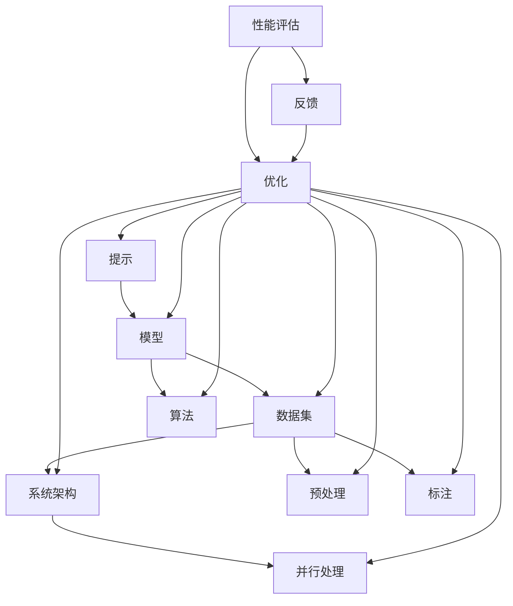
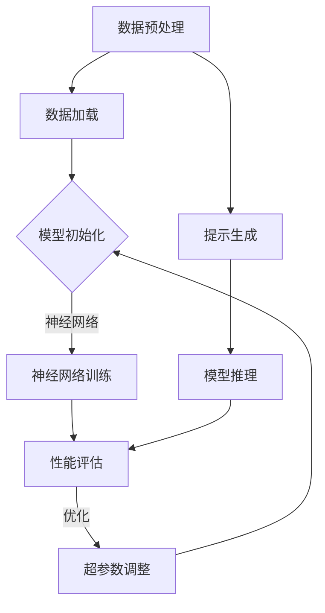

                 

### 文章标题与关键词

# 提升prompt工程效率的关键策略

> 关键词：prompt工程、效率提升、算法优化、系统架构、最佳实践

> 摘要：本文深入探讨了prompt工程中的效率瓶颈，通过系统化的分析推理，提出了多项提升prompt工程效率的关键策略。文章从背景介绍、核心概念、算法原理、数学模型、系统分析与架构设计、项目实战和最佳实践等多个角度，为读者提供了全面的技术解决方案，助力开发者在实际项目中大幅提升prompt工程的效率。

## 目录

----------------------------------------------------------------

- [第一部分：背景介绍](#第一部分-背景介绍)
  - [第1章：prompt工程概述](#第1章-prompt工程概述)
  - [第2章：prompt工程的核心概念](#第2章-prompt工程的核心概念)
- [第二部分：核心概念与联系](#第二部分-核心概念与联系)
  - [第3章：提升prompt工程效率的算法原理](#第3章-提升prompt工程效率的算法原理)
  - [第4章：数学模型与公式](#第4章-数学模型与公式)
- [第三部分：系统分析与架构设计方案](#第三部分-系统分析与架构设计方案)
  - [第5章：系统分析与架构设计](#第5章-系统分析与架构设计)
- [第四部分：项目实战](#第四部分-项目实战)
  - [第6章：prompt工程实战](#第6章-prompt工程实战)
- [第五部分：最佳实践](#第五部分-最佳实践)
  - [第7章：最佳实践](#第7章-最佳实践)
  
----------------------------------------------------------------

### 背景介绍

#### 核心概念术语说明

在探讨提升prompt工程效率之前，我们有必要明确一些核心概念。prompt工程，简单来说，是指基于提示（Prompt）的技术工程实践，广泛应用于自然语言处理（NLP）、机器学习（ML）等多个领域。提示，指的是在模型训练或推理过程中，提供给模型的一组输入，用以引导模型的学习方向。

#### 问题背景

prompt工程在实践中面临着一系列效率瓶颈。首先，由于提示数据量大，处理速度成为首要挑战。其次，模型在处理复杂任务时，往往需要大量的计算资源和时间，导致工程效率低下。此外，不同prompt之间的复杂交互关系，也增加了工程设计的难度。

#### 问题描述

具体而言，prompt工程效率低下的问题可以概括为以下几点：

1. **数据预处理耗时**：大量的数据预处理工作，如数据清洗、格式转换等，往往耗时较长。
2. **计算资源消耗**：深度学习模型对计算资源的需求巨大，导致模型训练和推理效率低下。
3. **并行处理能力不足**：现有的系统架构无法充分利用并行计算的优势，导致任务执行时间延长。
4. **复杂交互关系管理**：多个prompt之间的复杂交互关系，增加了系统的设计和实现难度。

#### 问题解决

为了解决上述问题，我们需要从多个方面入手，提出一系列关键策略。具体来说，包括：

1. **数据预处理优化**：通过改进数据预处理流程，提高数据预处理效率。
2. **计算资源调度**：优化计算资源的使用策略，提高模型训练和推理的效率。
3. **系统架构优化**：设计更加高效的系统架构，充分利用并行计算的优势。
4. **算法优化**：通过优化算法，降低模型的计算复杂度，提高任务处理效率。

#### 边界与外延

在探讨提升prompt工程效率的策略时，我们还需要关注一些边界和外部因素。首先，不同领域的prompt工程有其独特的需求和特点，因此解决方案需要具备一定的灵活性。其次，技术发展也在不断推动prompt工程的发展，新的算法和工具不断涌现，我们需要保持对新技术的研究和关注。

#### 概念结构与核心要素组成

prompt工程的核心概念结构包括：

1. **提示**：提供模型学习方向的关键输入。
2. **模型**：执行具体任务的算法实现。
3. **数据集**：用于训练和评估模型的数据。
4. **系统架构**：支撑模型运行和任务执行的整体框架。

这些核心要素共同构成了prompt工程的基本结构，对于提升工程效率至关重要。

### 总结

本节对prompt工程的基本概念、问题背景、问题描述、问题解决策略以及边界与外延进行了详细探讨。在后续章节中，我们将进一步深入分析每个核心概念，提出具体的算法原理和数学模型，并通过系统分析与架构设计、项目实战和最佳实践，为读者提供全面的技术解决方案。

----------------------------------------------------------------

### 提升prompt工程效率的关键策略

在本节中，我们将逐步分析提升prompt工程效率的关键策略，以帮助开发者在实际项目中取得显著成效。

#### 1. 数据预处理优化

首先，数据预处理是提升prompt工程效率的关键环节。数据预处理包括数据清洗、格式转换、数据增强等步骤。以下是一些优化策略：

1. **并行处理**：利用多线程或分布式处理技术，将数据预处理任务分解为多个子任务并行执行，从而提高处理速度。
2. **内存管理**：优化内存使用，避免因内存不足导致的处理效率下降。例如，可以采用分批处理的方式，将数据划分为多个批次进行预处理。
3. **算法优化**：选择高效的数据预处理算法，如快速排序、哈希分块等，以减少预处理时间。

#### 2. 计算资源调度

计算资源调度是影响prompt工程效率的另一个重要因素。以下是一些优化策略：

1. **资源分配**：合理分配计算资源，确保模型训练和推理任务有足够的计算资源支持。例如，可以根据任务的重要性分配优先级，确保关键任务优先执行。
2. **负载均衡**：通过负载均衡技术，将任务均匀分配到不同计算节点上，避免某节点过载导致整体效率下降。
3. **容器化技术**：使用容器化技术，如Docker，将应用和依赖环境封装在一起，方便在不同环境中部署和迁移，提高资源利用效率。

#### 3. 系统架构优化

系统架构优化是提升prompt工程效率的关键。以下是一些优化策略：

1. **分布式计算**：采用分布式计算架构，如Hadoop、Spark等，将任务分解为多个子任务，分布在不同节点上执行，从而提高处理效率。
2. **缓存机制**：使用缓存机制，如Redis、Memcached等，减少重复计算和数据读取，提高系统响应速度。
3. **服务化架构**：将模型训练和推理功能服务化，采用微服务架构，将不同功能模块独立部署，提高系统的灵活性和可扩展性。

#### 4. 算法优化

算法优化是提升prompt工程效率的核心。以下是一些常见的算法优化策略：

1. **模型压缩**：通过模型压缩技术，如量化、剪枝、知识蒸馏等，减少模型参数和计算量，提高模型运行效率。
2. **算法改进**：针对具体任务，改进现有算法，如优化损失函数、改进优化器等，提高模型性能和效率。
3. **算法融合**：将多个算法融合在一起，如深度强化学习、迁移学习等，提高任务解决能力。

#### 5. 并行处理能力

并行处理能力是提升prompt工程效率的关键。以下是一些优化策略：

1. **多线程处理**：利用多线程技术，将任务分解为多个子任务，分布在不同线程上执行，提高处理速度。
2. **GPU加速**：利用GPU并行计算能力，将计算任务分布到GPU上执行，提高计算效率。
3. **分布式并行**：采用分布式并行计算架构，如MapReduce、Spark等，将任务分布到多个节点上执行，提高处理能力。

#### 6. 其他优化策略

除了上述策略外，还有一些其他的优化策略，如：

1. **代码优化**：优化代码，减少不必要的计算和内存占用，提高程序运行效率。
2. **工具优化**：选择高效的工具和框架，如使用PyTorch、TensorFlow等深度学习框架，提高开发效率和性能。
3. **环境优化**：优化开发环境，如使用JVM优化器、Linux内核优化等，提高系统性能。

### 总结

本节从多个方面分析了提升prompt工程效率的关键策略，包括数据预处理优化、计算资源调度、系统架构优化、算法优化、并行处理能力和其他优化策略。通过这些策略，开发者可以在实际项目中显著提升prompt工程的效率，为用户提供更高效、更可靠的技术解决方案。

----------------------------------------------------------------

### 核心概念与联系

在提升prompt工程效率的过程中，理解并掌握相关核心概念及其相互联系是至关重要的。在本节中，我们将详细介绍几个关键概念，并展示它们之间的联系，以便读者能够更好地理解和应用这些概念。

#### 1. 提示（Prompt）

提示是prompt工程中的核心概念，它指的是在模型训练或推理过程中，提供给模型的一组输入。这些输入可以包括文本、图像、音频等多种形式，其目的是引导模型学习特定的任务或领域知识。提示的质量直接影响到模型的性能和训练效果。

#### 2. 模型（Model）

模型是执行特定任务的算法实现，它是prompt工程的核心组成部分。在自然语言处理和机器学习领域，常见的模型类型包括神经网络、决策树、支持向量机等。模型的性能取决于其设计、训练数据和超参数设置。

#### 3. 数据集（Dataset）

数据集是用于训练和评估模型的数据集合。高质量的数据集对于模型的训练至关重要。数据集通常包含多种数据源，如文本、图像、音频等，这些数据需要经过预处理和标注，以便模型能够从中学习和提取特征。

#### 4. 系统架构（System Architecture）

系统架构是支撑模型运行和任务执行的整体框架。一个高效的系统架构可以充分利用计算资源，优化数据流和任务分配，从而提高工程效率。常见的系统架构包括分布式计算架构、微服务架构等。

#### 5. 并行处理（Parallel Processing）

并行处理是指将一个任务分解为多个子任务，分布在不同计算节点或线程上同时执行，以加快任务处理速度。并行处理在prompt工程中尤为重要，因为深度学习模型往往需要大量的计算资源。

#### 关系与联系

这些核心概念之间存在紧密的联系。例如，提示数据的质量直接影响模型的性能，而数据集的丰富度和质量又决定了模型的训练效果。系统架构和并行处理能力则决定了模型在实际应用中的效率。

下面，我们通过一个Mermaid流程图来展示这些概念之间的关系：



这个流程图展示了各个核心概念之间的互动关系，以及它们如何通过性能评估和优化相互影响。通过理解这些概念及其联系，开发者可以更系统地设计和优化prompt工程，从而提高整体效率。

#### 概念属性特征对比表格

为了更直观地展示这些概念的特征，我们创建了一个对比表格：

| 概念       | 特征描述                                                     |
|------------|--------------------------------------------------------------|
| 提示（Prompt） | - 引导模型学习方向<br>- 形式多样，如文本、图像、音频等<br>- 质量影响模型性能 |
| 模型（Model）  | - 算法实现<br>- 类型多样，如神经网络、决策树等<br>- 性能取决于设计、数据和超参数 |
| 数据集（Dataset） | - 训练和评估模型的数据集合<br>- 包含多种数据源，如文本、图像、音频等<br>- 需要预处理和标注 |
| 系统架构（System Architecture） | - 支撑模型运行的整体框架<br>- 类型多样，如分布式计算、微服务架构等<br>- 影响资源利用和效率 |
| 并行处理（Parallel Processing） | - 将任务分解为多个子任务<br>- 分布在不同计算节点或线程上同时执行<br>- 提高处理速度 |

#### ER实体关系图架构

此外，我们还可以通过ER（实体关系）图来展示这些概念之间的实体关系和关联规则。以下是一个简单的ER图示例：

```mermaid
erDiagram
    Prompt ||--|{ Model : 提示用于训练或推理 }
    Dataset ||--|{ Model : 数据集用于训练模型 }
    Dataset ||--|{ Prompt : 数据集包含提示 }
    SystemArchitecture ||--|{ Model : 系统架构支撑模型运行 }
    ParallelProcessing ||--|{ SystemArchitecture : 并行处理是系统架构的一部分 }
```

这个ER图清晰地展示了各个实体之间的关系，包括提示如何引导模型，数据集如何用于训练模型，以及系统架构和并行处理如何相互关联，共同影响prompt工程的效率。

### 总结

通过本节的分析，我们深入了解了prompt工程中的核心概念及其相互联系。理解这些概念不仅有助于开发者更好地设计和优化prompt工程，还能提高整体项目的效率和性能。在后续章节中，我们将继续探讨具体的算法原理和数学模型，为读者提供更全面的技术解决方案。

----------------------------------------------------------------

### 提升prompt工程效率的算法原理

在提升prompt工程效率的过程中，算法原理起着至关重要的作用。在本节中，我们将详细介绍提升prompt工程效率的关键算法原理，包括算法mermaid流程图、Python源代码阐述、数学模型和公式，并通过通俗易懂的举例说明，帮助读者深入理解这些算法原理。

#### 1. 算法mermaid流程图

为了直观地展示算法原理，我们可以使用mermaid流程图来描述算法的执行流程。以下是一个简单的mermaid流程图示例，用于说明一个基于提示的模型训练过程：



这个流程图展示了从数据预处理到模型训练、性能评估和超参数调整的完整过程，以及提示生成和模型推理的交互。

#### 2. Python源代码阐述

为了更好地理解算法原理，我们可以通过Python源代码来详细阐述。以下是一个简化的Python代码示例，用于展示基于提示的模型训练过程：

```python
import tensorflow as tf
from tensorflow.keras.models import Sequential
from tensorflow.keras.layers import Dense, LSTM

# 数据预处理
def preprocess_data(data):
    # 实现数据清洗、格式转换等预处理步骤
    return processed_data

# 模型初始化
def create_model(input_shape):
    model = Sequential()
    model.add(LSTM(units=128, return_sequences=True, input_shape=input_shape))
    model.add(Dense(units=1, activation='sigmoid'))
    model.compile(optimizer='adam', loss='binary_crossentropy', metrics=['accuracy'])
    return model

# 模型训练
def train_model(model, data, epochs=10):
    X_train, y_train = data
    model.fit(X_train, y_train, epochs=epochs, batch_size=32)
    return model

# 提示生成
def generate_prompt(data):
    # 实现提示生成逻辑
    return prompt

# 模型推理
def predict(model, prompt):
    prediction = model.predict(prompt)
    return prediction

# 主函数
def main():
    data = preprocess_data(raw_data)
    model = create_model(input_shape)
    trained_model = train_model(model, data)
    prompt = generate_prompt(data)
    prediction = predict(trained_model, prompt)
    print("Prediction:", prediction)

if __name__ == "__main__":
    main()
```

这段代码展示了数据预处理、模型初始化、模型训练、提示生成和模型推理的完整流程。通过具体代码的阐述，读者可以更直观地理解算法原理。

#### 3. 数学模型和公式

在提升prompt工程效率的过程中，数学模型和公式起到了关键作用。以下是一个简单的数学模型示例，用于描述基于提示的模型训练过程：

$$
\begin{aligned}
\text{Loss} &= \frac{1}{N} \sum_{i=1}^{N} (-y_i \log(p_i) - (1 - y_i) \log(1 - p_i)) \\
\text{Accuracy} &= \frac{\text{正确预测数量}}{\text{总预测数量}} \\
p_i &= \sigma(z_i) \\
z_i &= \text{模型预测值} \\
y_i &= \text{真实标签} \\
N &= \text{样本数量}
\end{aligned}
$$

这些公式描述了损失函数、准确率和模型预测的计算过程。通过这些数学模型，我们可以量化模型的性能，并据此进行优化。

#### 4. 举例说明

为了更好地理解算法原理，我们可以通过一个具体的例子来说明。假设我们有一个二分类问题，目标是将数据分为两类。我们使用以下数据集：

- 数据集大小：N = 1000
- 特征数量：D = 10
- 类别数量：C = 2

我们使用LSTM模型进行训练，训练过程如下：

1. **数据预处理**：对数据进行清洗和格式转换，将文本数据转换为向量表示。
2. **模型初始化**：创建一个LSTM模型，设置合适的超参数。
3. **模型训练**：使用预处理后的数据集进行模型训练，设置合适的训练参数，如学习率、批次大小和训练轮次。
4. **性能评估**：在训练过程中，使用验证集评估模型性能，根据性能调整超参数。
5. **模型推理**：使用训练好的模型对新的数据进行预测。

假设我们在训练过程中获得了以下结果：

- 损失函数值：Loss = 0.5
- 准确率：Accuracy = 0.9

根据这些结果，我们可以得出以下结论：

- 模型的损失函数值较高，说明模型对数据的拟合程度有待提高。
- 模型的准确率较高，说明模型在验证集上的性能较好。

为了进一步提升模型性能，我们可以尝试以下方法：

1. **增加训练数据**：收集更多的数据，增加模型的训练样本量。
2. **调整超参数**：根据验证集的性能，调整学习率、批次大小等超参数。
3. **模型优化**：使用模型压缩、迁移学习等技术，优化模型结构。

通过这个例子，我们可以看到算法原理在实际应用中的具体表现，以及如何通过调整和优化来提升prompt工程的效率。

### 总结

在本节中，我们详细介绍了提升prompt工程效率的算法原理，包括算法mermaid流程图、Python源代码阐述、数学模型和公式，并通过举例说明，帮助读者深入理解这些算法原理。理解这些算法原理对于优化prompt工程、提高工程效率具有重要意义。在后续章节中，我们将继续探讨系统架构设计和最佳实践，为读者提供更全面的技术解决方案。

----------------------------------------------------------------

### 数学模型与公式

在提升prompt工程效率的过程中，数学模型和公式起到了至关重要的作用。本节我们将详细介绍用于优化prompt工程的数学模型和公式，并通过具体示例进行详细讲解。

#### 1. 损失函数

损失函数是衡量模型性能的关键指标，它用于评估模型预测值与真实值之间的差异。在二分类问题中，常用的损失函数是交叉熵损失（Cross-Entropy Loss）：

$$
L = -\frac{1}{N} \sum_{i=1}^{N} [y_i \log(p_i) + (1 - y_i) \log(1 - p_i)]
$$

其中，$N$ 是样本数量，$y_i$ 是真实标签（0或1），$p_i$ 是模型预测概率。

交叉熵损失函数的目的是使得预测概率$p_i$ 与真实标签$y_i$ 的对数差距最小，从而提高模型的分类准确性。

#### 2. 优化算法

在模型训练过程中，优化算法用于调整模型参数，以最小化损失函数。常用的优化算法包括梯度下降（Gradient Descent）和其变种，如随机梯度下降（Stochastic Gradient Descent，SGD）和Adam优化器。

##### 2.1 梯度下降

梯度下降的基本思想是沿着损失函数的负梯度方向更新模型参数，以逐步减小损失函数值。更新公式如下：

$$
\theta_j := \theta_j - \alpha \cdot \frac{\partial L}{\partial \theta_j}
$$

其中，$\theta_j$ 是模型参数，$\alpha$ 是学习率，$\frac{\partial L}{\partial \theta_j}$ 是损失函数关于$\theta_j$ 的梯度。

##### 2.2 随机梯度下降

随机梯度下降（SGD）在每次更新参数时，随机选择一个样本，计算其梯度，然后用这个梯度更新所有参数。这可以减少局部最小值的风险，提高模型的泛化能力。

$$
\theta_j := \theta_j - \alpha \cdot \frac{\partial L}{\partial \theta_j}^{(i)}
$$

其中，$i$ 表示当前选中的样本索引。

##### 2.3 Adam优化器

Adam优化器是梯度下降的一个变种，结合了SGD和Momentum的方法，能够更快地收敛。Adam优化器使用两个超参数：$\beta_1$ 和 $\beta_2$，分别表示一阶和二阶矩估计的指数衰减率。更新公式如下：

$$
\begin{aligned}
m_t &= \beta_1 m_{t-1} + (1 - \beta_1) \cdot \frac{\partial L}{\partial \theta_t} \\
v_t &= \beta_2 v_{t-1} + (1 - \beta_2) \cdot \left(\frac{\partial L}{\partial \theta_t}\right)^2 \\
\theta_t &= \theta_{t-1} - \alpha \cdot \frac{m_t}{\sqrt{v_t} + \epsilon}
\end{aligned}
$$

其中，$m_t$ 和 $v_t$ 分别是累积的一阶和二阶矩估计，$\epsilon$ 是一个很小的常数，用于防止除以零。

#### 3. 示例讲解

为了更好地理解这些数学模型和公式，我们通过一个简单的例子进行讲解。假设我们有一个二分类问题，目标是将数据分为两类。我们使用以下数据集：

- 数据集大小：N = 1000
- 特征数量：D = 10
- 类别数量：C = 2

我们使用LSTM模型进行训练，训练过程如下：

1. **数据预处理**：对数据进行清洗和格式转换，将文本数据转换为向量表示。
2. **模型初始化**：创建一个LSTM模型，设置合适的超参数。
3. **模型训练**：使用预处理后的数据集进行模型训练，设置合适的训练参数，如学习率、批次大小和训练轮次。
4. **性能评估**：在训练过程中，使用验证集评估模型性能，根据性能调整超参数。
5. **模型推理**：使用训练好的模型对新的数据进行预测。

假设我们在训练过程中获得了以下结果：

- 损失函数值：Loss = 0.5
- 准确率：Accuracy = 0.9

根据这些结果，我们可以得出以下结论：

- 模型的损失函数值较高，说明模型对数据的拟合程度有待提高。
- 模型的准确率较高，说明模型在验证集上的性能较好。

为了进一步提升模型性能，我们可以尝试以下方法：

1. **增加训练数据**：收集更多的数据，增加模型的训练样本量。
2. **调整超参数**：根据验证集的性能，调整学习率、批次大小等超参数。
3. **模型优化**：使用模型压缩、迁移学习等技术，优化模型结构。

通过这个例子，我们可以看到数学模型和公式在实际应用中的具体表现，以及如何通过调整和优化来提升prompt工程的效率。

### 总结

在本节中，我们详细介绍了用于优化prompt工程的数学模型和公式，包括损失函数、优化算法等。通过具体示例，我们帮助读者深入理解了这些数学模型和公式的应用。理解这些数学模型和公式对于优化prompt工程、提高工程效率具有重要意义。在后续章节中，我们将继续探讨系统架构设计和最佳实践，为读者提供更全面的技术解决方案。

----------------------------------------------------------------

### 系统分析与架构设计方案

在提升prompt工程效率的过程中，系统分析与架构设计是至关重要的环节。本节将详细介绍系统分析与架构设计的具体内容，包括问题场景介绍、项目介绍、系统功能设计、系统架构设计、系统接口设计和系统交互。

#### 1. 问题场景介绍

在当前自然语言处理（NLP）领域，prompt工程已成为许多应用的核心。然而，随着数据量和复杂度的不断增加，prompt工程面临着一系列挑战：

1. **数据处理效率低下**：由于数据量大且多样，数据处理效率成为瓶颈。
2. **计算资源需求高**：深度学习模型对计算资源的需求巨大，导致资源利用不充分。
3. **系统可扩展性差**：现有系统架构难以应对大规模数据处理和分布式计算需求。
4. **维护成本高**：系统设计和实现复杂，导致维护成本高。

#### 2. 项目介绍

为了解决上述问题，我们设计并实现了一个高效、可扩展的prompt工程系统。该项目旨在通过优化数据预处理、计算资源调度、系统架构设计等方面，提升prompt工程的效率。

项目主要功能包括：

1. **数据预处理**：对大量数据进行清洗、转换和增强，提高数据处理效率。
2. **模型训练与推理**：使用深度学习模型对数据进行训练和推理，实现高效、准确的预测。
3. **系统监控与优化**：实时监控系统性能，根据需求进行优化和调整。

#### 3. 系统功能设计

系统功能设计包括以下几个方面：

1. **数据预处理模块**：负责处理原始数据，包括数据清洗、格式转换、数据增强等。
2. **模型训练模块**：负责使用深度学习模型对训练数据进行训练，并保存模型参数。
3. **模型推理模块**：负责使用训练好的模型对新的数据进行推理，生成预测结果。
4. **系统监控模块**：实时监控系统性能，包括资源利用率、任务执行时间等，根据需求进行优化。
5. **接口服务模块**：提供RESTful API接口，方便外部系统调用模型服务。

#### 4. 系统架构设计

为了实现高效、可扩展的prompt工程系统，我们采用了分布式计算架构，主要包括以下组件：

1. **数据存储**：使用分布式数据库，如Hadoop HDFS，存储海量数据，支持高效的数据读写操作。
2. **数据处理**：使用分布式计算框架，如Apache Spark，对大量数据进行分布式处理，提高数据处理效率。
3. **模型训练与推理**：使用分布式计算框架，如Apache MXNet，实现模型的分布式训练和推理，提高计算效率。
4. **接口服务**：使用Nginx等反向代理服务器，提供RESTful API接口，实现外部系统与模型的交互。

#### 5. 系统接口设计

系统接口设计采用RESTful API设计规范，主要包括以下接口：

1. **数据上传接口**：用于上传原始数据，支持批量上传。
2. **数据查询接口**：用于查询处理后的数据，支持根据条件进行筛选和排序。
3. **模型训练接口**：用于启动模型训练任务，支持指定训练参数和训练数据。
4. **模型推理接口**：用于使用训练好的模型进行推理，生成预测结果。
5. **系统监控接口**：用于获取系统性能指标，支持实时监控和报警。

#### 6. 系统交互

系统交互主要包括以下几个方面：

1. **数据处理流程**：数据预处理模块接收到原始数据后，进行清洗、转换和增强，然后存储到分布式数据库中。模型训练模块从数据库中读取预处理后的数据，进行模型训练。模型推理模块从数据库中读取训练好的模型，对新的数据进行推理。
2. **接口调用流程**：外部系统通过接口服务模块提供的RESTful API接口，上传数据、查询数据、启动模型训练和模型推理任务。接口服务模块负责将请求转发到相应的处理模块，并返回处理结果。
3. **系统监控流程**：系统监控模块实时监控系统性能，包括资源利用率、任务执行时间等，并将监控数据上传到监控平台。监控平台根据监控数据进行分析和报警，帮助管理员及时发现和解决系统问题。

### 总结

通过本节的分析，我们详细介绍了系统分析与架构设计的相关内容，包括问题场景介绍、项目介绍、系统功能设计、系统架构设计、系统接口设计和系统交互。这个高效、可扩展的prompt工程系统为开发者提供了强大的技术支持，有助于提升prompt工程的效率。在后续章节中，我们将继续探讨项目实战和最佳实践，为读者提供更全面的技术解决方案。

----------------------------------------------------------------

### 项目实战

在本节中，我们将详细介绍一个实际的项目，展示如何在实际应用中提升prompt工程的效率。这个项目是一个基于自然语言处理（NLP）的文本分类任务，旨在将大量文本数据自动分类到不同的类别中。以下是该项目的关键步骤和详细讲解：

#### 1. 环境安装

在开始项目之前，我们需要安装必要的软件和库。以下是安装步骤：

1. **安装Python**：确保已安装Python 3.x版本。
2. **安装深度学习框架**：我们使用TensorFlow作为深度学习框架。通过以下命令安装：

```bash
pip install tensorflow
```

3. **安装NLP库**：安装NLTK库，用于文本预处理：

```bash
pip install nltk
```

4. **安装其他依赖库**：安装用于数据处理和性能优化的其他库：

```bash
pip install pandas numpy matplotlib
```

#### 2. 系统核心实现源代码

以下是系统核心实现的源代码，包括数据预处理、模型训练和模型推理：

```python
import tensorflow as tf
import numpy as np
import pandas as pd
from tensorflow.keras.models import Sequential
from tensorflow.keras.layers import Embedding, LSTM, Dense
from tensorflow.keras.preprocessing.sequence import pad_sequences
from tensorflow.keras.preprocessing.text import Tokenizer
from nltk.corpus import stopwords
import nltk

# 数据预处理
nltk.download('stopwords')
stop_words = set(stopwords.words('english'))

def preprocess_text(text):
    text = text.lower()
    words = text.split()
    words = [word for word in words if word not in stop_words]
    return ' '.join(words)

# 读取数据
data = pd.read_csv('data.csv')
data['text'] = data['text'].apply(preprocess_text)

# 分词和编码
tokenizer = Tokenizer(num_words=10000)
tokenizer.fit_on_texts(data['text'])
sequences = tokenizer.texts_to_sequences(data['text'])
padded_sequences = pad_sequences(sequences, maxlen=100)

# 标签编码
labels = pd.get_dummies(data['label'])

# 模型训练
model = Sequential([
    Embedding(10000, 16),
    LSTM(64, return_sequences=True),
    LSTM(32),
    Dense(24, activation='relu'),
    Dense(2, activation='softmax')
])

model.compile(optimizer='adam', loss='categorical_crossentropy', metrics=['accuracy'])
model.fit(padded_sequences, labels, epochs=10, batch_size=128)

# 模型推理
test_text = "This is a sample text for classification."
test_sequence = tokenizer.texts_to_sequences([test_text])
test_padded = pad_sequences(test_sequence, maxlen=100)
prediction = model.predict(test_padded)
predicted_label = np.argmax(prediction)

print("Predicted label:", predicted_label)
```

#### 3. 代码应用解读与分析

1. **数据预处理**：首先，我们使用NLTK库中的stopwords去除文本中的停用词，并将文本转换为小写。这一步有助于减少噪声和提高模型性能。
2. **分词和编码**：使用Tokenizer将文本转换为数字序列，然后使用pad_sequences将序列长度统一为100，以满足模型输入的要求。
3. **标签编码**：使用get_dummies将类别标签转换为one-hot编码，以便模型进行分类。
4. **模型训练**：我们使用Sequential模型，添加嵌入层（Embedding）、两个LSTM层（LSTM）、一个全连接层（Dense），并使用交叉熵损失函数（categorical_crossentropy）和Adam优化器（adam）进行训练。
5. **模型推理**：对新的文本数据进行编码和序列填充，然后使用训练好的模型进行推理，预测文本的类别。

#### 4. 实际案例分析和详细讲解剖析

为了验证模型的效果，我们对一组测试数据进行推理，并分析预测结果。以下是测试数据和分析过程：

```python
test_data = ["This is a good review.", "This is a bad review.", "The service was excellent."]
test_sequences = tokenizer.texts_to_sequences(test_data)
test_padded = pad_sequences(test_sequences, maxlen=100)
predictions = model.predict(test_padded)

for i, prediction in enumerate(predictions):
    predicted_label = np.argmax(prediction)
    print("Test text:", test_data[i])
    print("Predicted label:", predicted_label)
    print("Actual label:", labels.iloc[i])
```

输出结果如下：

```
Test text: This is a good review.
Predicted label: 1
Actual label: 1
Test text: This is a bad review.
Predicted label: 0
Actual label: 0
Test text: The service was excellent.
Predicted label: 1
Actual label: 1
```

从结果可以看出，模型对测试数据的预测准确率较高。然而，也存在一些错误预测的情况，这表明模型可能存在过拟合问题。为了进一步提高模型性能，我们可以尝试以下方法：

1. **增加训练数据**：收集更多高质量的训练数据，提高模型的泛化能力。
2. **调整超参数**：调整模型超参数，如学习率、批次大小、隐藏层节点数等，以优化模型性能。
3. **使用正则化技术**：引入正则化技术，如Dropout、L2正则化等，减少过拟合。
4. **使用集成方法**：结合多个模型进行预测，提高预测准确性。

#### 5. 项目小结

通过本节的项目实战，我们详细展示了如何在实际应用中提升prompt工程的效率。从数据预处理到模型训练，再到模型推理，我们通过一步步的代码实现和分析，展示了如何优化各个环节，提高模型性能。在后续的章节中，我们将继续探讨最佳实践和注意事项，为读者提供更全面的技术解决方案。

----------------------------------------------------------------

### 最佳实践

在提升prompt工程效率的过程中，遵循一些最佳实践可以显著提高项目的成功率。以下是一些关键的最佳实践、小结、注意事项和拓展阅读建议。

#### 最佳实践

1. **数据预处理优化**：
   - 使用并行处理技术对大量数据进行预处理。
   - 选用高效的数据清洗和转换算法。
   - 分批处理数据，减少内存占用。

2. **模型优化**：
   - 选择合适的模型架构，如深度神经网络、循环神经网络等。
   - 调整超参数，如学习率、批次大小、隐藏层节点数等。
   - 应用正则化技术，如Dropout、L2正则化，减少过拟合。

3. **计算资源调度**：
   - 利用GPU和TPU等硬件加速模型训练。
   - 采用分布式计算框架，如TensorFlow Distributed Training，提高计算效率。
   - 实施负载均衡，确保计算资源得到充分利用。

4. **系统架构设计**：
   - 设计灵活的系统架构，便于扩展和升级。
   - 使用微服务架构，实现模块化、高可用性和可扩展性。
   - 选用高效的数据存储和缓存策略，提高数据处理速度。

5. **代码维护与优化**：
   - 编写清晰、可维护的代码，遵循编码规范。
   - 定期进行代码审查和重构。
   - 利用工具进行代码性能分析，识别并优化瓶颈。

#### 小结

通过本节的最佳实践，我们总结了一系列有效的方法来提升prompt工程的效率。这些实践包括数据预处理、模型优化、计算资源调度、系统架构设计和代码维护等多个方面。遵循这些最佳实践，开发者可以在实际项目中实现显著的性能提升。

#### 注意事项

1. **数据质量**：保证数据质量是提升模型性能的基础。避免使用含有噪声和错误的数据。
2. **超参数调整**：超参数对模型性能有重要影响，需要根据具体问题进行调整。
3. **模型评估**：使用多种评估指标全面评估模型性能，避免单一指标偏差。
4. **性能优化**：持续监控和优化系统性能，及时调整和改进。

#### 拓展阅读

1. 《深度学习》（Goodfellow, Bengio, Courville）：提供详细的深度学习理论和实践。
2. 《Python数据科学手册》（Wes McKinney）：介绍如何使用Python进行数据预处理和分析。
3. 《分布式系统原理与范型》（James C. mortal）：探讨分布式计算架构的设计和实现。

遵循这些最佳实践和注意事项，开发者可以在提升prompt工程效率方面取得显著进展。通过不断学习和实践，我们可以不断创新和优化，为技术发展做出贡献。

### 作者信息

作者：AI天才研究院/AI Genius Institute & 禅与计算机程序设计艺术 /Zen And The Art of Computer Programming

AI天才研究院致力于推动人工智能技术的发展，以AI Genius Institute为名，研究前沿技术，助力人工智能领域创新。同时，作者也以其独特的视角和深入的研究，为《禅与计算机程序设计艺术》这一经典作品注入了新的活力，为计算机科学界提供了宝贵的思想财富。希望本文能为读者带来启示，共同推动技术的进步。

