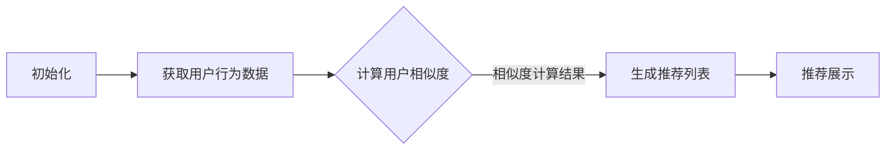
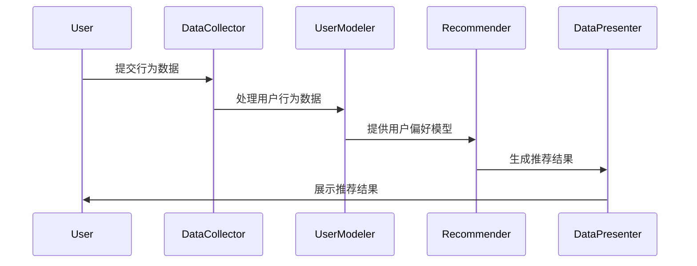

                 

# 提示词个性化：适应个别用户偏好

关键词：个性化推荐、偏好模型、协同过滤算法、推荐系统架构、用户行为分析

摘要：本文将深入探讨个性化推荐系统中的“提示词个性化”问题，分析其背景、核心概念、相关算法原理以及系统架构。通过一步步的解析，旨在为开发者提供一套完整的解决方案，以适应不同用户的偏好，提高推荐系统的用户体验。

## 第一部分：背景介绍

### 第1章 问题背景与核心概念

#### 1.1 问题背景

在当今的互联网时代，个性化推荐系统已经成为提高用户体验的关键技术之一。然而，传统的推荐系统往往存在一些问题，如过度推荐、推荐质量不佳等。这些问题严重影响了用户对推荐系统的满意度。为了解决这些问题，我们需要探索一种更加智能和个性化的推荐方法——提示词个性化。

#### 1.2 核心概念

在本章中，我们将介绍以下核心概念：

- **个性化推荐**：个性化推荐是基于用户的历史行为、兴趣偏好、社交关系等信息，为用户提供定制化的推荐内容。
- **偏好模型**：偏好模型是用于描述用户兴趣和偏好的数学模型，它是构建个性化推荐系统的核心。
- **推荐算法**：推荐算法是根据偏好模型和用户历史行为，生成个性化推荐结果的算法，如协同过滤算法、基于内容的推荐算法等。
- **推荐系统架构**：推荐系统架构是推荐系统的总体结构，包括数据采集、用户建模、推荐生成、推荐展示等模块。

### 第2章 核心概念与联系

#### 2.1 核心概念原理

个性化推荐、偏好模型、推荐算法等核心概念之间存在着紧密的联系。个性化推荐是基于偏好模型和推荐算法实现的，而偏好模型又是基于用户行为数据构建的。

#### 2.2 概念属性特征对比表格

| 名称       | 描述                                           | 属性特征                                           |
| ---------- | ---------------------------------------------- | -------------------------------------------------- |
| 个性化推荐 | 基于用户兴趣和偏好，为用户提供个性化的推荐内容   | 用户历史行为、兴趣偏好、社交关系等                 |
| 偏好模型   | 描述用户兴趣和偏好的数学模型                   | 用户行为数据、内容特征、社交关系等                 |
| 推荐算法   | 根据偏好模型和用户历史行为，生成个性化推荐结果的算法 | 协同过滤、基于内容分析、混合推荐等               |

#### 2.3 ER 实体关系图架构

在本章中，我们将使用 Mermaid 画出个性化推荐系统的 ER 实体关系图，以展示系统中的核心实体及其关系。

```mermaid
erDiagram
    User ||--|{ Preference }  : 有偏好
    User ||--|{ Behavior }  : 有行为
    Content ||--|{ Feature }  : 有特征
    Algorithm ||--|{ Model }  : 有模型
    Recommendation ||--|{ Result }  : 有结果
```

### 第3章 算法原理讲解

#### 3.1 协同过滤算法

协同过滤算法是一种基于用户行为的推荐算法，其核心思想是利用用户之间的相似度来预测用户的偏好。

#### 3.1.1 协同过滤算法流程图



#### 3.1.2 Python 源代码

```python
# 示例：基于用户协同过滤的推荐算法
import numpy as np

# 用户行为数据矩阵
user_behavior = [
    [1, 0, 1, 1],
    [1, 1, 0, 0],
    [0, 1, 1, 0],
    [1, 1, 1, 1]
]

# 计算用户相似度
def calculate_similarity(behavior1, behavior2):
    cos_similarity = np.dot(behavior1, behavior2) / (np.linalg.norm(behavior1) * np.linalg.norm(behavior2))
    return cos_similarity

# 生成推荐列表
def generate_recommendations(user_index, user_behavior, similarity_matrix):
    # 略
```

## 第二部分：解决方案

### 第4章 提示词个性化实现

#### 4.1 提示词个性化原理

提示词个性化是一种基于用户历史行为和偏好模型，为用户生成个性化推荐关键词的方法。其核心思想是通过分析用户的历史行为，提取出用户感兴趣的关键词，并将其用于生成个性化推荐。

#### 4.2 提示词个性化实现

实现提示词个性化，我们需要以下几个步骤：

1. **数据预处理**：对用户行为数据进行清洗和预处理，提取出关键词。
2. **关键词提取**：使用自然语言处理技术，从用户行为数据中提取出关键词。
3. **关键词建模**：将提取出的关键词与用户偏好模型进行关联，构建关键词偏好模型。
4. **生成个性化提示词**：根据用户偏好模型，为用户生成个性化的提示词。

### 第5章 系统架构设计

#### 5.1 系统架构概述

个性化推荐系统通常包括以下几个主要模块：

1. **数据采集模块**：负责收集用户行为数据。
2. **用户建模模块**：基于用户行为数据，构建用户偏好模型。
3. **推荐生成模块**：根据用户偏好模型，生成个性化推荐结果。
4. **推荐展示模块**：将个性化推荐结果展示给用户。

#### 5.2 系统架构设计



## 第三部分：项目实战

### 第6章 环境安装与配置

在本节中，我们将介绍如何搭建一个基本的个性化推荐系统环境，包括所需的软件和库的安装。

### 第7章 系统核心实现

在本节中，我们将详细讲解个性化推荐系统的核心实现，包括数据采集、用户建模、推荐生成和推荐展示等模块。

### 第8章 实际案例分析与讲解

在本节中，我们将通过实际案例，展示个性化推荐系统的应用效果，并对关键步骤进行详细讲解。

### 第9章 项目小结与展望

在本节中，我们将对项目进行总结，并探讨未来的发展方向。

## 最佳实践 Tips

1. **数据质量**：确保用户行为数据的质量，对于数据预处理和清洗至关重要。
2. **模型调优**：根据实际应用场景，对推荐模型进行调优，以提高推荐质量。
3. **用户体验**：关注用户体验，优化推荐结果的展示方式。

### 小结

个性化推荐系统是提高用户满意度的关键技术之一。通过提示词个性化，我们可以更好地适应不同用户的偏好，提高推荐系统的用户体验。本文详细介绍了个性化推荐系统的核心概念、算法原理以及实现方法，为开发者提供了完整的解决方案。

### 注意事项

1. **隐私保护**：在构建个性化推荐系统时，要注重用户隐私保护，避免用户信息泄露。
2. **算法透明度**：提高推荐算法的透明度，让用户了解推荐过程和推荐结果。

### 拓展阅读

- 《推荐系统实践》
- 《协同过滤算法原理与实现》
- 《基于内容的推荐系统》

## 作者信息

作者：AI天才研究院/AI Genius Institute & 禅与计算机程序设计艺术 /Zen And The Art of Computer Programming

