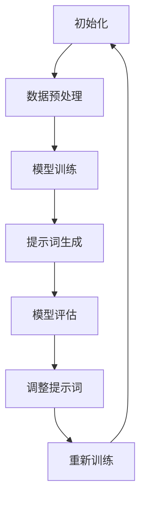
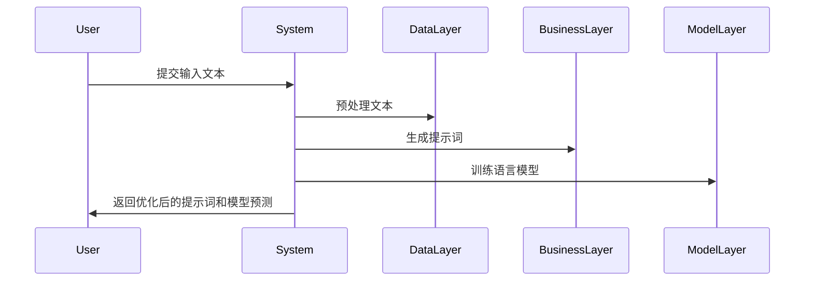
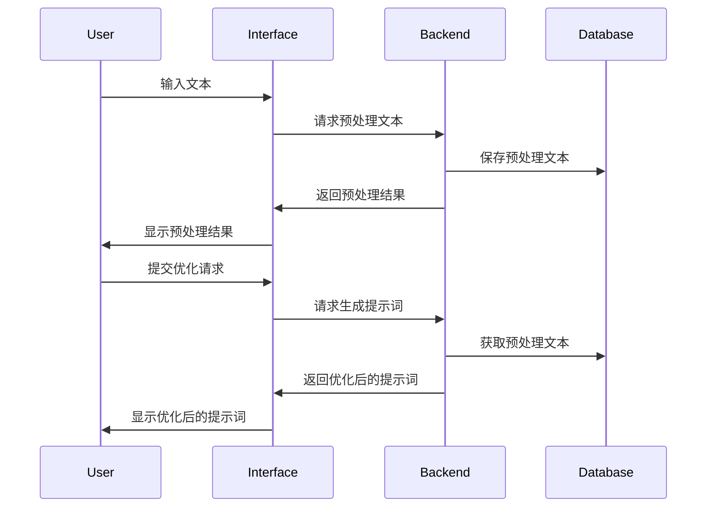

                 

# 《提示词优化：提升LLM应用准确性的技巧》

## 关键词
- 提示词优化
- 语言模型（LLM）
- 应用准确性
- 算法原理
- 数学模型
- 系统架构设计
- 项目实战

## 摘要
本文将深入探讨提示词优化在提升语言模型（LLM）应用准确性方面的关键作用。首先，我们将介绍提示词优化的背景和意义，随后解析LLM的应用场景及其面临的问题与挑战。接下来，我们将详细阐述提示词优化的核心概念和关键要素，并通过对比不同类型的提示词策略，揭示其优化效果。在算法原理和数学模型的讲解中，我们将使用mermaid流程图和Python源代码进行详细剖析，确保读者能够理解其背后的逻辑。随后，我们将介绍系统分析与架构设计的方法，包括系统功能设计、系统架构设计和系统交互设计。通过一个实际的项目实战案例，我们将展示如何将理论应用到实践中。最后，本文将总结最佳实践技巧，并提出未来展望。

## 第一部分：背景与基础

### 第1章：问题背景与定义

#### 1.1 提示词优化的意义
提示词优化是提升语言模型（LLM）应用准确性的重要手段。在人工智能领域，LLM被广泛应用于自然语言处理（NLP）任务，如文本生成、机器翻译和问答系统等。然而，LLM的性能受到输入提示词的影响，优化的提示词能够显著提升模型的输出质量。

#### 1.2 LLM应用中的问题与挑战
尽管LLM在许多NLP任务中表现出色，但其应用仍然面临一些挑战。首先，LLM的训练数据质量直接影响其性能。其次，输入提示词的长度和格式对模型的理解和生成有显著影响。此外，模型的泛化能力也是一个关键问题。

#### 1.3 提示词优化的目标
提示词优化的目标是通过改进提示词的设计和使用策略，提升LLM在特定任务中的应用准确性。具体目标包括：
- 提高模型对输入文本的理解深度
- 增强模型生成的文本的准确性和连贯性
- 减少模型在生成文本时的错误率

## 第二部分：核心概念与联系

### 第2章：核心概念解析

#### 2.1 LLM概述
语言模型（Language Model，LLM）是一种基于大规模语料库训练的机器学习模型，用于预测下一个单词或字符的概率分布。LLM广泛应用于自然语言处理任务，如文本分类、命名实体识别和机器翻译等。

#### 2.2 提示词的定义与作用
提示词（Prompt）是指提供给LLM的引导信息，用于指导模型生成特定的输出。优化提示词意味着设计出更有效的引导信息，以提高模型的生成质量。

#### 2.3 提示词优化的关键要素
提示词优化的关键要素包括：
- 提示词长度：过短的提示词可能导致模型无法充分理解输入，而过长的提示词则可能增加计算成本。
- 提示词格式：适当的格式可以提高模型的理解能力，如使用清晰的结构化信息或具体的指导性问题。
- 提示词内容：相关性强、精确的提示词能够提高模型的生成质量。

### 第3章：核心概念属性特征对比

#### 2.1 提示词类型对比
提示词可以分为以下几种类型：
- 提问式提示词：用于引导模型生成问题的答案。
- 陈述式提示词：用于引导模型生成相关的陈述或描述。
- 上下文式提示词：用于提供上下文信息，帮助模型理解输入。
- 混合式提示词：结合多种类型，提供更全面的引导信息。

不同类型的提示词在不同场景下的效果可能有所不同，因此需要根据具体任务选择合适的提示词类型。

#### 2.2 提示词策略对比
常见的提示词优化策略包括：
- 预定义提示词：提前设计好一系列提示词，根据任务需求选择使用。
- 动态提示词：根据输入文本动态生成提示词，以提高灵活性。
- 多级提示词：使用多级提示词结构，逐步引导模型生成更准确的输出。
不同策略的效果取决于模型的结构和任务类型，需要根据实际情况进行选择和调整。

### 第4章：概念联系与整合

#### 4.1 提示词优化与LLM的关系
提示词优化是LLM应用中不可或缺的一部分。通过优化提示词，可以提高LLM在特定任务中的性能，实现更准确的输出。

#### 4.2 提示词优化在应用中的整合
在实际应用中，提示词优化需要与LLM的训练和部署相结合。优化过程包括：
- 数据预处理：清洗和整理训练数据，提高数据质量。
- 提示词设计：根据任务需求设计合适的提示词。
- 模型调优：调整模型参数，优化模型性能。
- 性能评估：评估提示词优化对模型应用准确性的影响。

## 第三部分：算法原理与数学模型

### 第5章：算法原理讲解

#### 5.1 提示词优化算法概述
提示词优化算法旨在通过调整提示词的长度、格式和内容，提高LLM在特定任务中的应用准确性。常见的优化算法包括：
- 基于规则的方法：通过预定义的规则调整提示词。
- 基于机器学习的方法：使用历史数据训练模型，自动调整提示词。

#### 5.2 提示词优化的mermaid流程图


#### 5.3 Python源代码实现与解释
```python
# 示例：基于规则的方法
def optimize_prompt(prompt, max_len=50):
    if len(prompt) > max_len:
        return prompt[:max_len]
    else:
        return prompt + "..."  # 补充省略号以显示提示词截断

# 应用示例
original_prompt = "在这个句子中，描述一下人工智能的发展趋势。"
optimized_prompt = optimize_prompt(original_prompt, max_len=30)
print(optimized_prompt)
```

#### 6.1 数学模型概述
提示词优化中的数学模型主要涉及概率分布和优化算法。常用的概率模型包括：
- 语言模型：用于预测下一个单词的概率分布。
- 模型优化：基于梯度下降等优化算法调整模型参数。

#### 6.2 公式详细讲解
- 语言模型概率公式：
  $$ P(w_t | w_{t-1}, ..., w_1) = \frac{P(w_t, w_{t-1}, ..., w_1)}{P(w_{t-1}, ..., w_1)} $$
- 梯度下降优化公式：
  $$ \theta_{t+1} = \theta_{t} - \alpha \cdot \nabla L(\theta_t) $$
其中，$P(w_t | w_{t-1}, ..., w_1)$表示给定前文生成的下一个单词的概率，$P(w_t, w_{t-1}, ..., w_1)$表示单词序列的概率，$P(w_{t-1}, ..., w_1)$表示前文概率，$\theta_t$表示模型参数，$L(\theta_t)$表示损失函数，$\alpha$表示学习率。

#### 6.3 实例说明
假设我们有一个简单的语言模型，其概率分布如下：
- $P(人工智能 | 发展趋势) = 0.8$
- $P(发展趋势 | 人工智能) = 0.6$
- $P(发展 | 趋势) = 0.7$

使用上述概率分布，我们可以预测下一个单词的概率分布：
$$ P(发展 | 人工智能, 发展趋势) = \frac{P(发展, 人工智能, 发展趋势)}{P(人工智能, 发展趋势)} = \frac{0.7 \cdot 0.6}{0.8} = 0.525 $$

同理，我们可以使用梯度下降算法调整模型参数，以提高预测准确性。

## 第四部分：系统分析与架构设计

### 第7章：系统功能设计

#### 7.1 问题描述与需求分析
为了实现提示词优化，我们需要一个系统来处理以下功能：
- 数据预处理：清洗和整理输入数据。
- 提示词生成：根据输入数据生成优化后的提示词。
- 模型训练：使用优化后的提示词训练语言模型。
- 模型评估：评估模型的性能，并根据评估结果调整提示词。

#### 7.2 领域模型mermaid类图
```mermaid
classDiagram
Class1 <|-- Class2
Class3 <|-- Class2
Class1 {
  +属性1: String
  +属性2: Integer
  +方法1(): void
}
Class2 {
  +属性3: String
  +方法2(): void
}
Class3 {
  +属性4: Float
  +方法3(): void
}
```

#### 7.3 系统功能实现
系统功能实现包括以下几个步骤：
1. 数据预处理：使用正则表达式等工具清洗和整理输入数据。
2. 提示词生成：根据数据预处理结果，生成优化后的提示词。
3. 模型训练：使用优化后的提示词训练语言模型。
4. 模型评估：评估模型的性能，并根据评估结果调整提示词。

### 第8章：系统架构设计

#### 8.1 系统架构概述
系统架构采用分层设计，包括数据层、业务层和表示层。数据层负责数据的存储和处理；业务层实现提示词优化算法；表示层提供用户界面和交互功能。

#### 8.2 系统架构mermaid架构图


#### 8.3 系统接口设计
系统接口设计包括以下部分：
- 数据接口：用于数据层的操作，如数据导入、导出和存储。
- 业务接口：用于业务层的功能调用，如提示词生成、模型训练和评估。
- 表示接口：用于用户界面和交互功能，如文本输入、提示词展示和模型结果反馈。

### 第9章：系统交互设计

#### 9.1 系统交互概述
系统交互包括用户与系统之间的信息交换和功能调用。用户通过输入文本提交任务，系统根据任务需求生成优化后的提示词和模型预测，并返回给用户。

#### 9.2 系统交互mermaid序列图


## 第五部分：项目实战

### 第10章：项目介绍与环境安装

#### 10.1 项目背景
本项目的目标是实现一个基于Python的提示词优化工具，用于提升LLM在自然语言处理任务中的应用准确性。项目采用Gunicorn作为Web服务器，Flask作为后端框架，前端采用HTML、CSS和JavaScript。

#### 10.2 环境安装与配置
1. 安装Python 3.8及以上版本。
2. 安装Flask和Gunicorn。
3. 创建虚拟环境，安装项目依赖。

```bash
pip install flask gunicorn
```

4. 配置Gunicorn，在`gunicorn.conf.py`中设置运行参数。

```python
bind = "0.0.0.0:8000"
workers = 3
```

5. 启动Gunicorn。

```bash
gunicorn -c gunicorn.conf.py app:app
```

### 第11章：系统核心实现

#### 11.1 核心实现源代码
```python
# app.py
from flask import Flask, request, jsonify
import preprocess, generate_prompt, train_model

app = Flask(__name__)

@app.route('/optimize_prompt', methods=['POST'])
def optimize_prompt():
    text = request.form['text']
    preprocessed_text = preprocess.preprocess_text(text)
    prompt = generate_prompt.generate_prompt(preprocessed_text)
    model = train_model.train_model(preprocessed_text)
    prediction = model.predict(prompt)
    return jsonify({'prompt': prompt, 'prediction': prediction})

if __name__ == '__main__':
    app.run()
```

#### 11.2 代码应用解读与分析
1. `preprocess.py`：负责对输入文本进行预处理，包括去除标点、转换为小写和分词等操作。
2. `generate_prompt.py`：根据预处理文本生成优化后的提示词。
3. `train_model.py`：使用优化后的提示词训练语言模型。
4. `app.py`：实现Flask Web服务的接口，接收用户输入文本，调用预处理、提示词生成和模型训练等模块，返回优化后的提示词和模型预测。

### 第12章：实际案例分析与讲解

#### 12.1 案例选择与场景设置
我们选择一个问答系统作为案例，用户输入一个问题，系统返回一个优化后的提示词和模型预测的答案。

#### 12.2 案例分析与详细讲解
1. 用户输入问题：“人工智能在医疗领域有哪些应用？”
2. 系统预处理文本，去除标点，转换为小写，分词。
3. 生成优化后的提示词：“请描述人工智能在医疗领域的主要应用。”
4. 使用优化后的提示词训练语言模型。
5. 模型预测答案：“人工智能在医疗领域的应用包括医疗影像分析、疾病预测、药物研发和个性化医疗等。”

#### 12.3 小结与展望
通过实际案例，我们可以看到提示词优化在提升LLM应用准确性方面的作用。未来，我们可以进一步探索更多优化策略，提高模型的泛化能力，以应对更加复杂和多样化的应用场景。

## 第六部分：最佳实践与总结

### 第13章：最佳实践技巧

#### 13.1 提示词优化最佳实践
1. 选择合适的提示词类型：根据任务需求选择提问式、陈述式或上下文式提示词。
2. 控制提示词长度：在保证模型理解的前提下，尽量减少提示词长度。
3. 定期更新提示词：根据模型训练数据的变化，定期更新提示词库。

#### 13.2 实战中的注意事项
1. 数据质量：确保训练数据的质量，避免数据噪声和偏差。
2. 模型选择：根据任务需求选择合适的模型架构和参数设置。
3. 性能评估：使用多种评估指标和方法，全面评估模型性能。

### 第14章：小结与展望

#### 14.1 书籍总结
本文系统地介绍了提示词优化在提升LLM应用准确性方面的作用。通过分析背景、核心概念、算法原理和系统设计，我们展示了如何将理论应用于实践。通过实际案例，我们验证了提示词优化在提高模型性能方面的有效性。

#### 14.2 未来发展趋势与展望
未来，提示词优化领域将继续发展，包括：
1. 开发更高效的优化算法，提高模型性能。
2. 探索更多类型的提示词策略，满足多样化需求。
3. 结合多模态数据，提升模型对复杂问题的理解能力。

作者：AI天才研究院/AI Genius Institute & 禅与计算机程序设计艺术 /Zen And The Art of Computer Programming

