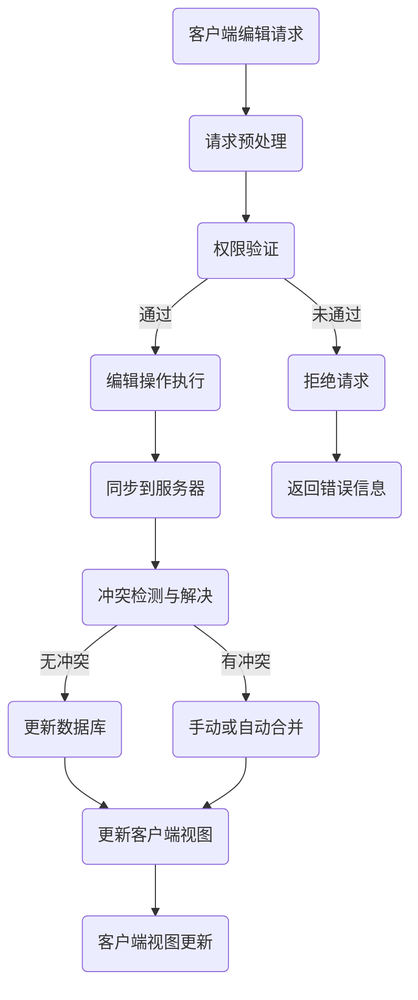
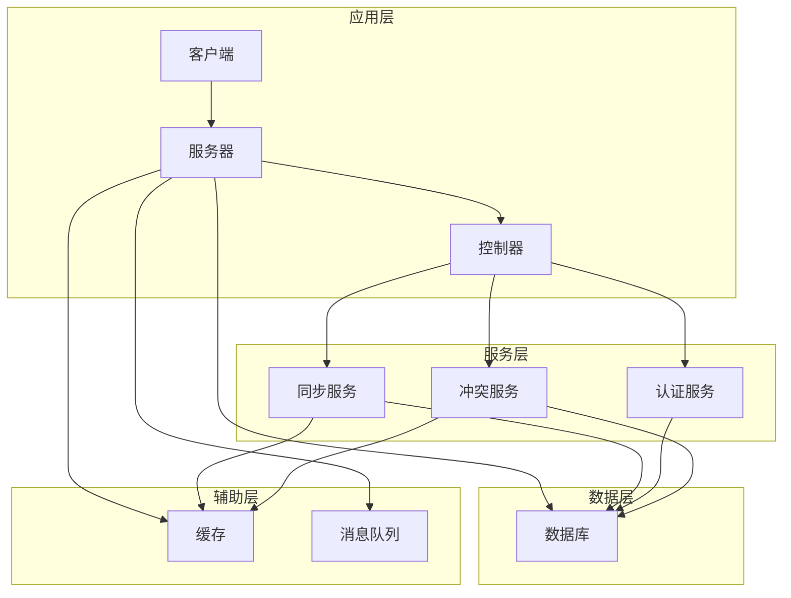
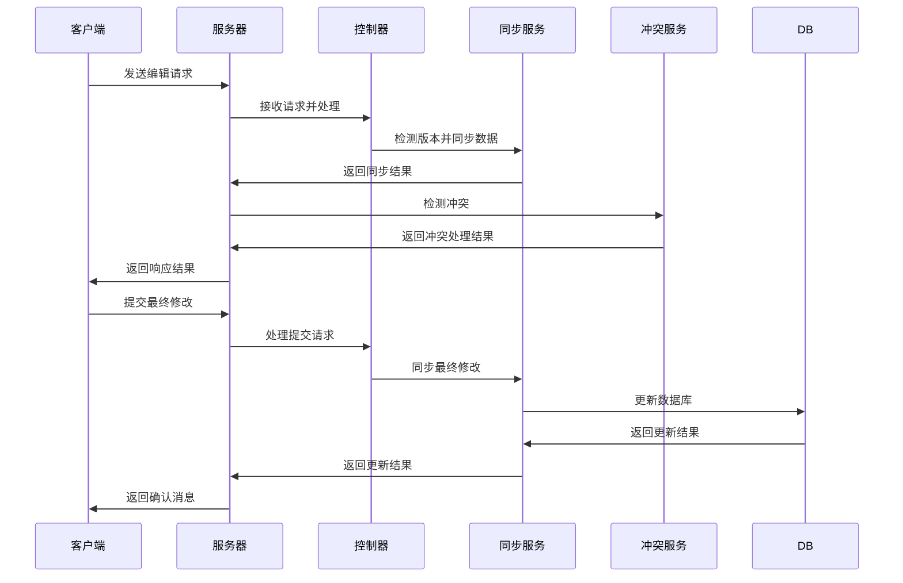

                 

### 1.1 提示词协同编辑的现状与需求

提示词协同编辑，作为现代信息技术领域中的一项重要应用，正日益受到广泛关注。其基本概念源于协同编辑技术的发展，特别是在文本编辑和内容创作领域中的应用。简单来说，提示词协同编辑是指多人通过网络实时对同一文本进行编辑和修改，通过智能算法优化协同过程，提高协作效率和文本质量。

当前，随着互联网的普及和智能设备的发展，多人协同编辑的需求不断增加。无论是在企业团队协作、教育资源共享，还是创意写作、翻译工作等领域，协同编辑都扮演着至关重要的角色。尤其是在远程工作和分布式团队日益成为常态的今天，高效的协同编辑工具更是成为提升工作效率和团队协作能力的关键。

现有的提示词协同编辑技术主要面临以下几个挑战和需求：

1. **实时性**：在多人协同编辑过程中，实时性是保障协作流畅性的关键。如何实现文本的实时同步，确保每位编辑者看到的是最新的内容，是当前技术的一大难题。

2. **一致性**：多人同时编辑同一文本时，可能会出现冲突和矛盾。例如，两个人同时对同一部分进行修改，如何有效地合并这两者的修改，保持文本的一致性，是协同编辑技术需要解决的核心问题。

3. **智能优化**：传统的协同编辑技术主要依赖人工操作，效率较低。通过引入人工智能算法，如自然语言处理技术、机器学习模型等，可以自动识别和合并编辑冲突，优化协同过程，提升整体效率。

4. **权限管理**：在多人协同编辑中，如何合理分配编辑权限，防止未经授权的修改，是保障协作安全的重要环节。高效、灵活的权限管理机制对于协同编辑系统的稳定性至关重要。

5. **用户体验**：协同编辑工具的用户界面设计直接影响用户的使用体验。一个友好、直观的界面设计，能够降低学习成本，提高用户的使用效率。

总之，提示词协同编辑不仅在技术层面有着重要的研究价值，也在实际应用中具备广阔的前景。随着技术的不断进步，我们有望看到更加智能、高效的协同编辑工具问世，为各类协同工作提供更加有力的支持。

### 1.2 多人合作中的挑战与机遇

在多人合作中，除了需要解决实时性、一致性、智能优化、权限管理等问题外，还有许多其他的挑战和机遇。以下是一些常见的情况和相应的解决方案。

#### 1.2.1 版本控制

多人合作过程中，文本版本的同步和管理是一个关键挑战。在传统的协作方式中，经常会出现因为版本不一致而导致的协作中断。为了解决这一问题，现代协同编辑工具通常采用版本控制机制，如Git，来记录每次修改的历史版本，用户可以随时查看和回滚到任何一个历史版本，从而确保协作过程的连续性和稳定性。

#### 1.2.2 冲突检测与解决

当多人同时对同一部分内容进行修改时，冲突检测和解决成为协同编辑的另一个重要问题。一些先进的协同编辑系统引入了冲突检测算法，如三向冲突检测算法，能够在检测到冲突时及时通知用户，并建议合适的解决方案。此外，一些系统还支持自动合并功能，能够智能地合并冲突的修改，减少人工干预。

#### 1.2.3 个性化协同

每个团队成员的工作习惯和偏好不同，个性化的协同需求也是一大挑战。一些协同编辑工具通过用户行为分析和机器学习技术，可以逐步学习和适应每个成员的协作习惯，提供个性化的协作体验，例如自动调整编辑权限、推荐合适的协作工具等。

#### 1.2.4 安全性

多人合作中的数据安全和隐私保护是一个不可忽视的问题。协同编辑系统需要确保数据在传输和存储过程中的安全性，通常采用加密技术、访问控制列表（ACL）和多重身份验证等措施来保障数据的安全。

#### 1.2.5 高效沟通

在多人合作中，沟通效率直接影响到协作效果。一些协同编辑工具集成了即时通讯功能，支持实时消息、视频会议和文档共享，有助于团队成员之间的有效沟通和协作。

#### 1.2.6 跨平台兼容性

现代团队往往分布在不同的地理位置和设备上，协同编辑工具需要具备跨平台的兼容性，支持各种操作系统和设备，以确保所有团队成员都能无缝接入和协作。

#### 1.2.7 适应性

随着项目的发展和需求的变化，协同编辑工具需要具备良好的适应性，能够灵活扩展和调整功能，满足不断变化的工作需求。

总之，多人合作中的挑战与机遇并存。通过不断的技术创新和优化，协同编辑工具正在逐步克服这些挑战，为团队协作提供更加高效和智能的支持。未来，我们期待看到更加完善和智能化的协同编辑系统问世，进一步推动多人合作的效率和效果。

### 1.3 本书的目标与结构

本书旨在深入探讨提示词协同编辑在多人合作中的应用及其优化策略，旨在为研究人员和开发者提供系统的理论指导和实践参考。具体目标如下：

1. **系统理论阐述**：全面介绍提示词协同编辑的基本概念、技术原理和多人合作的优化策略，为读者提供全面的理论基础。
2. **实践案例分析**：通过实际案例，展示提示词协同编辑技术在多个领域的应用，帮助读者理解理论在实际中的运用。
3. **解决方案提供**：提供一系列可行的优化策略和技术方案，以应对多人合作中的实时性、一致性、智能优化、权限管理等方面的挑战。
4. **工具与框架介绍**：介绍当前主流的协同编辑工具和框架，分析其优势和不足，为读者选择合适的工具提供参考。

本书结构安排如下：

- **第一部分：背景与概念介绍**：包括问题背景介绍和核心概念定义。
- **第二部分：协同编辑技术原理**：介绍协同编辑技术的基本原理和关键算法。
- **第三部分：算法原理与实践**：详细讲解算法原理和实践应用。
- **第四部分：系统分析与架构设计**：分析系统功能和架构设计。
- **第五部分：项目实战与案例分析**：展示实际项目案例和应用。
- **第六部分：最佳实践与小结**：总结最佳实践和全书要点。

通过以上安排，本书力图系统、全面地探讨提示词协同编辑的各个方面，为读者提供一个全面的技术参考和指导。

### 2.1 提示词协同编辑的基本概念

提示词协同编辑是一种基于提示词（Token）的多人实时协作文本编辑技术，其核心思想是利用人工智能和分布式计算技术，实现多人对同一文本内容进行实时、高效、安全的编辑与协作。这一概念涵盖了多个关键组成部分和基本原理。

#### **提示词（Token）**

在提示词协同编辑中，文本被划分为多个提示词或Token，这些Token代表文本中的最小编辑单位。通过将文本拆分为Token，系统可以更精细地控制编辑操作，从而提高协同编辑的实时性和一致性。

#### **协同编辑**

协同编辑是指多人通过网络对同一文本内容进行实时修改和协作的过程。在这个过程中，每个参与者都可以看到其他人的编辑操作，并能够即时反馈和调整。协同编辑的关键在于实现实时数据同步和版本控制，以确保多人编辑的一致性和完整性。

#### **实时性**

实时性是提示词协同编辑的重要特性之一。它要求系统能够快速响应用户的操作，确保每位编辑者看到的是最新的文本内容。为了实现实时性，系统通常采用分布式计算和消息队列等技术，确保数据传输的高效和低延迟。

#### **一致性**

一致性是多人协同编辑的另一个核心问题。当多个用户同时对同一文本内容进行修改时，如何确保这些修改不会相互冲突，并且能够正确合并，是协同编辑系统需要解决的重要问题。一致性机制通常包括版本控制、冲突检测和自动合并等技术。

#### **智能优化**

智能优化是利用人工智能技术，如自然语言处理（NLP）和机器学习（ML），来优化协同编辑过程。智能优化能够自动识别和解决编辑冲突，提高协作效率。例如，通过NLP技术，系统可以理解用户的意图，并自动合并冲突的修改，减少人工干预。

#### **权限管理**

权限管理是确保协同编辑安全性和稳定性的重要手段。系统需要根据用户身份和角色，分配不同的编辑权限，确保只有授权用户能够进行特定的编辑操作。权限管理机制还包括审核和日志记录，以监控和追踪编辑操作，提高协作透明度和可追溯性。

#### **用户界面设计**

用户界面设计是影响用户体验的关键因素。一个友好、直观的用户界面能够降低学习成本，提高用户的使用效率。提示词协同编辑系统通常提供简洁、易用的编辑工具和视图，支持多种编辑模式，如实时视图、历史版本浏览和多人协作视图等。

通过上述基本概念和原理，提示词协同编辑系统不仅能够实现高效的多人协作，还能够提供丰富的功能和灵活的扩展性，以满足不同场景和需求下的协作需求。接下来，我们将进一步探讨多人合作的基本原理，以了解这些概念在实际应用中的具体实现和优化策略。

### 2.2 多人合作的基本原理

多人合作在协同编辑中的应用涉及到多个基本原理和机制，这些原理和机制共同作用，确保合作过程的高效性和稳定性。以下将详细讨论多人合作的基本原理，并分析这些原理如何在提示词协同编辑系统中得到具体实现。

#### **沟通机制**

沟通机制是多人合作的基础。在协同编辑中，沟通机制不仅包括实时消息传递，如即时聊天和通知推送，还包括异步沟通，如邮件和讨论组。实时沟通能够确保团队成员能够即时响应和调整，从而提高协作效率。异步沟通则适用于需要深入讨论和反思的场景，有助于团队成员在非实时环境下进行信息交换。

实现方法：协同编辑系统通常集成了实时通讯工具，如WebRTC或WebSocket，用于实现实时消息传递。此外，系统还支持邮件通知和讨论组功能，以处理非实时沟通需求。

#### **任务分配与协调**

在多人合作中，任务分配和协调是确保项目顺利进行的关键。任务分配需要根据团队成员的能力和角色进行合理分配，同时，协调机制需要确保不同任务之间的衔接和同步。

实现方法：协同编辑系统通常具备任务分配和跟踪功能。系统可以通过工作流引擎或任务管理模块，将任务分配给不同成员，并跟踪任务的完成情况。此外，系统还提供实时协作工具，如共享日历和项目管理软件，以帮助团队成员协调各自的任务。

#### **协同编辑协议**

协同编辑协议是多人合作的核心机制，它定义了多人如何同步和合并编辑操作，以确保文本的一致性。常见的协同编辑协议包括乐观锁、悲观锁和版本控制。

实现方法：在提示词协同编辑系统中，乐观锁机制允许多个用户并发编辑，通过在提交时检测冲突并自动合并修改。悲观锁机制则在编辑时锁定文本，防止并发冲突。版本控制机制则通过记录每次修改的历史版本，确保每个版本的可追溯性和可恢复性。

#### **冲突检测与解决**

冲突检测与解决是协同编辑中的难点之一。当多个用户同时对同一文本内容进行修改时，系统需要检测并解决这些冲突，以保持文本的一致性。

实现方法：协同编辑系统通常采用冲突检测算法，如三向冲突检测，在提交时检测冲突。对于检测到的冲突，系统提供自动合并和手动合并两种解决方案。自动合并基于算法分析，手动合并则由用户根据实际情况进行操作。

#### **权限管理**

权限管理是确保多人合作安全性和稳定性的重要手段。通过合理分配编辑权限，系统可以防止未经授权的修改，保护文本的完整性和隐私。

实现方法：协同编辑系统通常提供细粒度的权限控制功能，如读写权限、编辑权限和审核权限。系统通过用户身份验证和权限验证机制，确保每个用户只能执行其授权的操作。

#### **用户界面与交互设计**

用户界面和交互设计直接影响到用户的使用体验。一个友好的用户界面和直观的交互设计能够降低学习成本，提高用户的使用效率。

实现方法：提示词协同编辑系统通常提供简洁、直观的编辑界面，支持多种编辑模式，如实时视图、历史版本浏览和多人协作视图等。此外，系统还提供丰富的交互功能，如实时反馈、通知提醒和快捷操作等，以提高用户的使用体验。

通过上述机制和原理，提示词协同编辑系统不仅能够实现高效的多人协作，还能够提供丰富的功能和灵活的扩展性，以满足不同场景和需求下的协作需求。在下一部分，我们将探讨提示词协同编辑与多人合作之间的具体联系，进一步理解这两者如何相互作用和优化。

### 2.3 提示词协同编辑与多人合作的联系

提示词协同编辑与多人合作之间存在着紧密的联系，它们相互促进、相互依赖，共同构建起高效、稳定的协作平台。以下将从多个方面详细分析这两者之间的具体联系。

#### **实时性保障**

提示词协同编辑的核心在于实现多人对同一文本内容的实时编辑和同步。这一特性直接满足了多人合作中对实时性的需求。通过实时性保障，团队成员可以即时查看和响应其他成员的操作，确保协作过程的连贯性和效率。这种实时性不仅提高了协作的效率，还增强了团队成员之间的互动和沟通。

#### **一致性维护**

在多人合作中，文本的一致性是确保协作结果准确性的关键。提示词协同编辑通过智能算法和版本控制机制，确保每次修改都能正确地合并到文本中，从而保持文本的一致性。这一机制不仅减少了因为版本不一致而产生的冲突，还提升了文本的整体质量。例如，在多人合作写作中，通过版本控制和自动合并功能，可以避免重复劳动和错误叠加。

#### **智能优化**

智能优化是提示词协同编辑的一大优势，它通过自然语言处理和机器学习技术，优化协同编辑过程。这种智能优化不仅能够自动识别和解决编辑冲突，还能够根据用户行为和学习历史，提供个性化的协作体验。例如，智能优化可以根据用户的编辑习惯，自动调整权限和推荐协作工具，从而提高整体协作效率。

#### **权限管理**

在多人合作中，权限管理是保障协作安全的重要措施。提示词协同编辑系统通过细粒度的权限控制，确保每个用户只能执行其授权的操作。例如，项目经理可以设置不同成员的读写权限，以确保文档的安全性和完整性。这种权限管理机制不仅保障了协作的私密性，还提高了协作的透明度和可追溯性。

#### **用户界面与交互**

用户界面和交互设计直接影响到多人合作的用户体验。提示词协同编辑系统通过友好、直观的用户界面和丰富的交互功能，降低了学习成本，提高了用户的使用效率。例如，实时视图、历史版本浏览和多人协作视图等功能，使团队成员能够更方便地进行文本编辑和协作。这种用户友好的设计不仅提升了协作的舒适度，还增强了团队的凝聚力。

#### **协同工作流的优化**

提示词协同编辑与多人合作之间的联系还体现在工作流的优化上。通过智能算法和协同编辑协议，系统可以自动化和优化多个环节，如任务分配、任务协调和冲突解决等。这种工作流优化不仅提高了协作的效率，还减少了人工干预，从而降低了协作成本。

综上所述，提示词协同编辑与多人合作之间存在着密切的联系。它们相互促进，共同构建起一个高效、智能、安全的协作平台。通过实时性保障、一致性维护、智能优化、权限管理、用户界面与交互设计以及协同工作流优化等方面的具体联系，提示词协同编辑系统不仅满足了多人合作的需求，还为未来的协作技术提供了新的方向和可能性。

### 3.1 协同编辑技术的定义与分类

协同编辑技术是一种旨在实现多人实时协作编辑的技术，其核心目标是确保多人同时编辑同一文本时的高效性和一致性。协同编辑技术可以大致分为两类：基于集中式（Centralized）的协同编辑和基于分布式（Distributed）的协同编辑。

#### **集中式协同编辑**

集中式协同编辑技术以一个中央服务器为核心，所有编辑操作都在服务器上进行处理和存储。这种架构的优点在于数据同步和一致性管理较为简单，系统实现相对容易。然而，集中式协同编辑也存在一些明显的缺点：

1. **单点故障**：由于所有操作都通过中央服务器处理，一旦服务器出现故障，整个系统将无法正常工作。
2. **性能瓶颈**：集中式服务器需要处理大量并发请求，容易成为系统性能的瓶颈，特别是在高负载情况下，响应速度会显著下降。

#### **分布式协同编辑**

分布式协同编辑技术通过多个节点共同处理编辑操作，每个节点都可以独立处理请求和存储数据。这种架构的优点在于高可用性和扩展性，可以更好地应对高并发请求和海量数据。然而，分布式协同编辑也存在一些挑战：

1. **数据一致性**：在分布式系统中，如何保证数据的一致性是一个难题，特别是当多个节点同时处理不同编辑操作时，如何合并这些操作成为关键问题。
2. **网络延迟**：分布式协同编辑依赖于网络传输，网络延迟和带宽限制会影响系统的实时性。

#### **主要协同编辑技术**

在协同编辑技术中，有几种关键技术是实现多人协作的核心：

1. **乐观锁（Optimistic Locking）**：乐观锁允许多个用户同时编辑文本，但在提交时才检测冲突并合并修改。这种方法可以最大化并发性，但在高冲突率场景下可能需要重试。
2. **悲观锁（Pessimistic Locking）**：悲观锁在编辑开始时锁定文本，防止其他用户同时修改。这种方法可以确保数据的一致性，但会降低并发性。
3. **版本控制（Version Control）**：版本控制通过记录每次修改的历史版本，确保文本的可追溯性和可恢复性。常见的版本控制系统包括Git，它们不仅支持多人协作，还提供强大的分支管理和合并功能。
4. **消息队列（Message Queue）**：消息队列用于处理异步消息传递，确保数据在不同节点之间的可靠传输。常见的消息队列技术包括RabbitMQ和Kafka。
5. **分布式一致性算法（Consistency Algorithms）**：如Paxos和Raft，这些算法用于确保分布式系统中的数据一致性。Paxos是一种基于多数派共识的算法，而Raft则通过日志复制实现一致性。

#### **应用场景**

协同编辑技术在多个领域得到广泛应用：

1. **文档协作**：如Google Docs，Microsoft Office 365等在线文档编辑工具，支持多人实时协作编辑。
2. **代码协作**：如GitHub、GitLab等版本控制系统，支持多人协作开发和代码管理。
3. **项目协作**：如Trello、Asana等项目管理工具，提供任务分配和协作跟踪功能。
4. **创意写作**：如Google Wave等实时文本协作平台，支持多人实时写作和讨论。

通过以上对协同编辑技术定义、分类和应用的讨论，我们可以看到，协同编辑技术不仅涵盖了多种实现方式和技术，还在多个领域得到了广泛应用。在接下来的章节中，我们将进一步探讨提示词协同编辑中的关键技术及其在实际应用中的具体实现。

### 3.2 提示词协同编辑的关键技术

提示词协同编辑作为一种先进的多人实时协作技术，其在实际应用中涉及到多种关键技术。这些技术共同作用，确保协同编辑过程的实时性、一致性和高效性。以下将详细介绍这些关键技术，并探讨其基本原理和实现方法。

#### **1. 提示词（Token）处理算法**

提示词处理算法是提示词协同编辑的核心技术之一。该算法的主要任务是精确地将文本拆分成提示词或Token，并管理这些Token的编辑和同步过程。提示词处理算法通常包括以下步骤：

- **分词**：将文本拆分为提示词，这通常通过自然语言处理（NLP）技术实现，如使用分词库（如jieba）或深度学习模型（如BERT）。
- **索引**：为每个提示词建立索引，以便快速查找和定位。
- **版本管理**：记录每个提示词的历史版本，确保文本的可追溯性和可恢复性。

实现方法：提示词处理算法通常通过构建一个分布式哈希表（DHT）来实现。DHT可以有效地分散存储提示词的版本信息，并提供快速访问。此外，基于一致性哈希算法的DHT可以动态调整存储节点，以应对节点故障和负载变化。

#### **2. 实时同步机制**

实时同步机制是确保多人协作实时性的关键。该机制通过高效的数据传输和更新策略，确保每位编辑者都能即时看到其他成员的修改。

- **心跳机制**：心跳机制用于检测用户的状态和连接状态，通过定期发送心跳消息，确保系统知道用户的在线情况。
- **增量同步**：增量同步机制通过仅同步文本的修改部分，而不是整个文本，来减少数据传输量，提高同步效率。
- **数据压缩**：对同步数据进行压缩，减少网络传输的时间和带宽消耗。

实现方法：实时同步机制通常基于分布式消息队列和WebSocket技术。消息队列可以确保数据传输的可靠性和顺序性，而WebSocket可以提供低延迟、双向通信的实时连接。例如，可以使用RabbitMQ作为消息队列，使用WebSocket实现实时数据传输。

#### **3. 冲突检测与解决算法**

冲突检测与解决算法是确保多人协作一致性的关键。该算法在检测到冲突时，需要自动或手动地解决这些冲突，确保文本的一致性。

- **三向冲突检测算法**：三向冲突检测算法通过比较本地版本、服务器版本和其他用户版本，来检测并定位冲突点。
- **自动合并算法**：自动合并算法通过分析冲突的内容，自动生成合并结果，减少人工干预。
- **手动合并**：手动合并由用户根据实际情况来处理冲突，通常提供可视化界面，帮助用户快速解决冲突。

实现方法：冲突检测与解决算法通常结合版本控制和图论算法来实现。版本控制机制可以记录每次修改的历史版本，而图论算法可以用于自动合并和手动合并操作。例如，可以使用Git的版本控制机制和图算法解决冲突。

#### **4. 权限管理机制**

权限管理机制是保障多人协作安全性的关键。该机制通过分配不同的编辑权限，确保只有授权用户能够执行特定的编辑操作。

- **角色基权限控制**：通过定义不同角色的权限，如编辑者、审阅者和管理员，来限制用户的操作权限。
- **访问控制列表（ACL）**：ACL用于细粒度地控制每个用户的权限，确保每个用户只能访问和操作其授权的内容。
- **审计日志**：记录所有编辑操作和权限变更，以监控和追踪协作过程。

实现方法：权限管理机制通常基于用户身份验证和访问控制策略来实现。用户身份验证通过用户名和密码、双因素认证等方式验证用户身份。访问控制策略通过定义权限规则，控制用户的操作权限。例如，可以使用OAuth 2.0实现用户身份验证，使用ACL实现访问控制。

#### **5. 用户界面与交互设计**

用户界面与交互设计直接影响用户的使用体验。一个友好、直观的用户界面可以降低学习成本，提高用户的使用效率。

- **实时视图**：提供实时更新的文本视图，使所有用户都能即时看到其他成员的修改。
- **历史版本浏览**：提供历史版本浏览功能，用户可以查看和回滚到任何历史版本。
- **多人协作视图**：提供多人协作视图，展示每个用户的编辑位置和操作记录。

实现方法：用户界面与交互设计通常基于Web技术实现，如HTML、CSS和JavaScript。前端框架（如React或Vue）可以用于构建响应式和交互式的用户界面。例如，可以使用React实现实时视图和历史版本浏览功能。

通过上述关键技术，提示词协同编辑系统可以实现高效的多人协作，确保实时性、一致性和安全性。在实际应用中，这些技术可以根据具体需求和场景进行灵活调整和优化，以满足多样化的协作需求。

### 3.3 协同编辑技术的基本架构

协同编辑技术的基本架构通常包括多个关键组件，它们协同工作，实现多人实时协作编辑。以下将详细描述这些组件以及它们之间的相互作用和关联。

#### **1. 客户端（Client）**

客户端是用户直接交互的界面，负责接收用户的编辑操作并将其发送到服务器。客户端通常包括以下组件：

- **用户界面（UI）**：提供文本编辑区域、用户操作按钮和实时更新视图。
- **用户交互逻辑**：处理用户的操作，如文本输入、编辑和撤销等。
- **状态管理**：管理客户端的本地状态，如编辑历史和用户设置。

#### **2. 服务器端（Server）**

服务器端负责处理客户端的请求，管理协作状态，并提供数据存储和同步服务。服务器端通常包括以下组件：

- **请求处理模块**：接收客户端的请求，进行认证和权限验证。
- **数据存储模块**：存储文本数据和相关元数据，如版本历史和用户权限。
- **同步引擎**：处理数据同步，确保多个客户端之间的数据一致性。
- **冲突检测与解决模块**：检测并发修改，并自动或手动解决冲突。

#### **3. 数据库（Database）**

数据库用于存储文本数据和元数据，是协同编辑系统的基础。数据库通常包括以下功能：

- **文本存储**：存储文本内容及其版本历史。
- **元数据存储**：存储用户权限、协作配置和其他系统设置。

#### **4. 消息队列（Message Queue）**

消息队列用于处理异步消息传递，确保数据在不同节点之间的可靠传输。消息队列通常包括以下组件：

- **消息生产者**：将客户端的编辑操作发送到消息队列。
- **消息消费者**：从消息队列中读取操作，并将其传递到服务器或数据库。

#### **5. 分布式一致性机制**

分布式一致性机制确保多个节点之间的数据一致性，通常是协同编辑系统中的关键组件。常见的分布式一致性算法包括Paxos和Raft。这些机制通常包括：

- **状态机**：定义系统的状态转换规则。
- **日志复制**：将操作日志复制到多个节点，确保状态一致性。
- **领导者选举**：在多个节点中选举出一个领导者，负责处理操作请求。

#### **组件关联与交互**

协同编辑系统的各个组件通过一系列交互和关联，共同实现多人协作编辑功能：

1. **客户端发送编辑操作**：客户端将用户的编辑操作（如文本输入、删除等）封装为消息，通过WebSocket或HTTP发送到服务器。
2. **服务器处理请求**：服务器接收客户端的消息，进行权限验证和数据同步。
3. **数据同步**：服务器将编辑操作同步到数据库，并通过消息队列将操作广播到其他客户端。
4. **客户端更新视图**：接收到同步消息的客户端更新其文本视图，显示最新的编辑内容。
5. **冲突检测与解决**：当检测到并发修改时，服务器和客户端协作检测和解决冲突，确保数据一致性。

通过这种架构设计，协同编辑系统能够实现高效、稳定、安全的多人实时协作编辑。各个组件的紧密配合和交互，确保系统在不同场景和需求下都能提供良好的性能和用户体验。

### 4.1.1 算法概述

在提示词协同编辑中，提示词处理算法是核心部分，其目的是将文本内容划分为提示词（Token），并管理这些提示词的创建、修改和同步。该算法的设计直接影响到协同编辑的实时性、一致性和用户体验。

#### **算法设计目标**

1. **实时性**：确保多个用户编辑同一文本时，系统能够快速响应用户的操作，显示最新的编辑内容。
2. **一致性**：在多用户并发修改的情况下，确保文本内容的一致性和完整性，避免数据冲突。
3. **可扩展性**：系统能够支持大量用户同时编辑，并能适应未来需求的扩展。

#### **算法基本步骤**

1. **文本预处理**：将输入文本进行预处理，去除不必要的空白符和特殊字符，并进行分词操作。
2. **提示词创建**：根据分词结果，创建提示词，并为其分配唯一标识符。
3. **版本管理**：为每个提示词记录版本信息，包括创建时间、修改时间和内容。
4. **并发控制**：采用并发控制机制，如乐观锁或悲观锁，确保多用户编辑时的一致性。
5. **同步机制**：实现实时同步机制，确保多个客户端之间的数据一致性。
6. **冲突检测与解决**：检测并发修改产生的冲突，并自动或手动解决冲突。

#### **算法实现要点**

1. **分词技术**：采用高效、准确的分词技术，如使用NLP分词库（如jieba）或深度学习模型（如BERT）。
2. **分布式存储**：使用分布式存储技术，如Redis或MongoDB，存储提示词及其版本信息。
3. **并发控制**：结合乐观锁和悲观锁机制，提高系统的并发能力和一致性。
4. **实时同步**：利用WebSocket或HTTP长连接实现实时同步，减少数据传输延迟。
5. **冲突检测与解决**：引入三向冲突检测算法，结合自动合并和手动合并策略，确保数据一致性。

通过上述算法设计和实现要点，提示词协同编辑系统能够高效、稳定地支持多人实时协作编辑，满足多样化的协作需求。

### 4.1.2 算法属性特征对比表格

在提示词协同编辑算法的设计过程中，不同算法的属性特征对系统的性能和用户体验有着重要影响。以下将列举几种常见算法的属性特征，并对比它们在实时性、一致性和扩展性方面的表现。

| 算法名称 | 实时性 | 一致性 | 扩展性 | 并发控制 | 冲突检测与解决 | 适用场景 |
| ------ | ------ | ------ | ------ | -------- | -------------- | ------- |
| 乐观锁 | 高 | 一般 | 高 | 并发性强 | 需要重试 | 高并发、低冲突 |
| 悲观锁 | 一般 | 高 | 一般 | 并发性弱 | 无需重试 | 低并发、高冲突 |
| 版本控制 | 高 | 高 | 高 | 并发性一般 | 可自动解决 | 复杂协作、多版本需求 |
| Paxos | 高 | 高 | 高 | 并发性一般 | 可自动解决 | 高可用、分布式系统 |
| Raft | 高 | 高 | 高 | 并发性一般 | 可自动解决 | 高可用、分布式系统 |

**详细解释：**

1. **实时性**：高表示算法能够快速响应用户操作，显示最新的编辑内容；一般表示响应速度适中。
2. **一致性**：高表示算法能确保多用户编辑时文本内容的一致性；一般表示在特定情况下可能存在不一致。
3. **扩展性**：高表示算法能支持大量用户同时编辑，并能适应未来需求的扩展；一般表示扩展能力有限。
4. **并发控制**：乐观锁和悲观锁通过不同的方式控制并发，乐观锁并发性强但可能需要重试，悲观锁并发性弱但无需重试。
5. **冲突检测与解决**：版本控制和分布式一致性算法（如Paxos和Raft）能够自动解决冲突，适用于复杂协作场景。
6. **适用场景**：每种算法在不同场景下表现不同，根据具体需求选择合适的算法。

通过对比表格，我们可以更清晰地了解各种算法的优缺点，从而在具体应用中选择最适合的算法。

### 4.1.3 ER实体关系图架构

为了更直观地理解提示词协同编辑系统中各实体之间的关系，我们可以通过ER（实体-关系）图来展示。ER图能够清晰地描述系统中的主要实体及其相互关系，有助于分析和设计系统架构。

以下是一个简化的ER实体关系图，描述了提示词协同编辑系统中的主要实体和它们之间的关系：

```mermaid
erDiagram
    User ||--|{ Document }|--|| Editor
    Document ||--|{ TextSegment }|--|| Token
    Document ||--|{ EditHistory }|--|| EditLog
    User ||--|{ CollaborationPermission }|--|| Permission
```

**实体说明：**

1. **User（用户）**：系统中的用户，每个用户拥有唯一的用户ID和相关的个人信息。
2. **Document（文档）**：系统中的文本文档，每个文档有一个唯一的文档ID和关联的标题、内容等信息。
3. **TextSegment（文本段）**：文档中的文本段，每个文本段包含一段连续的文本，并可以包含多个Token。
4. **Token（提示词）**：文本段中的最小编辑单位，每个Token包含文本内容、版本信息和创建/修改时间。
5. **EditHistory（编辑历史）**：记录文档的所有编辑历史，包括每次编辑的详细信息。
6. **EditLog（编辑日志）**：详细记录每次编辑的操作，如插入、删除、修改等。
7. **CollaborationPermission（协作权限）**：定义用户在文档上的权限，如编辑、读取等。

**关系说明：**

- **用户（User）与文档（Document）**：多对多关系，一个用户可以编辑多个文档，一个文档可以有多个用户编辑。
- **文档（Document）与文本段（TextSegment）**：一对多关系，一个文档包含多个文本段，每个文本段属于一个文档。
- **文档（Document）与提示词（Token）**：一对多关系，一个文本段包含多个提示词，每个提示词属于一个文本段。
- **文档（Document）与编辑历史（EditHistory）**：一对多关系，一个文档有多个编辑历史记录，每次编辑都会生成一条历史记录。
- **文档（Document）与编辑日志（EditLog）**：一对多关系，一个文档有多个编辑日志，每条日志记录一次编辑操作。
- **用户（User）与协作权限（CollaborationPermission）**：一对多关系，每个用户可以有多个协作权限，每个权限对应一个文档和操作类型。

通过这个ER图，我们可以清晰地看到系统中各个实体之间的相互关系，以及它们如何共同协作，实现高效的提示词协同编辑。

### 4.2.1 优化策略概述

在多人协作的提示词协同编辑系统中，优化策略是实现高效协同编辑的关键。优化策略通过改进算法和系统设计，提高系统的性能和用户体验。以下将概述几种常见的优化策略，并分析其各自的特点和优势。

#### **1. 实时性优化**

实时性优化旨在减少系统响应延迟，确保用户操作能够及时同步到其他用户。常见的实时性优化策略包括：

- **增量同步**：仅同步文本的修改部分，而不是整个文本。这种方法可以显著减少数据传输量，提高同步效率。
- **数据压缩**：对传输的数据进行压缩，以减少网络带宽消耗。常用的压缩算法包括gzip和zlib。
- **网络优化**：通过优化网络架构，如使用CDN（内容分发网络），降低数据传输的延迟和带宽消耗。

**优势**：实时性优化策略能够提高系统的响应速度，提升用户的使用体验。

**适用场景**：适用于高并发、对实时性要求较高的场景，如在线文档协作和实时写作。

#### **2. 一致性优化**

一致性优化目标是确保多用户同时编辑同一文本时，系统能够保持数据的一致性和完整性。常见的一致性优化策略包括：

- **冲突检测与解决**：通过算法检测并发修改产生的冲突，并自动或手动解决冲突。例如，三向冲突检测算法和自动合并算法。
- **版本控制**：记录每次修改的历史版本，确保文本的可追溯性和可恢复性。常见的版本控制系统包括Git和Mercurial。
- **分布式一致性算法**：如Paxos和Raft，通过日志复制和一致性算法，确保多个节点之间的数据一致性。

**优势**：一致性优化策略能够减少数据冲突，提高系统的可靠性和稳定性。

**适用场景**：适用于高并发、多用户同时编辑的场景，如分布式团队协作和在线项目管理。

#### **3. 智能优化**

智能优化通过引入人工智能和机器学习技术，提升协同编辑的效率和用户体验。常见的智能优化策略包括：

- **意图识别**：通过自然语言处理（NLP）技术，识别用户的编辑意图，自动生成建议和提示。
- **个性化推荐**：根据用户行为和偏好，推荐合适的编辑工具和协作方式，提高用户的工作效率。
- **自动合并**：利用机器学习算法，自动识别和合并编辑冲突，减少人工干预。

**优势**：智能优化策略能够提升系统的智能水平，提高用户的工作效率和协作体验。

**适用场景**：适用于对协作效率和用户体验有较高要求的场景，如创意写作和智能文档协作。

#### **4. 权限管理优化**

权限管理优化目标是确保多人协作的安全性，防止未经授权的修改。常见的权限管理优化策略包括：

- **细粒度权限控制**：通过定义不同角色的权限，如编辑者、审阅者和管理员，细粒度地控制用户的操作权限。
- **访问控制列表（ACL）**：通过ACL定义用户对文档的访问权限，确保只有授权用户能够进行特定操作。
- **审计日志**：记录所有操作和权限变更，以便监控和追踪协作过程。

**优势**：权限管理优化策略能够提高系统的安全性和可控性。

**适用场景**：适用于需要严格权限控制的场景，如企业文档协作和项目协作。

通过上述优化策略，提示词协同编辑系统能够在实时性、一致性、智能性和安全性等方面得到全面提升，满足多样化的协作需求。

### 4.2.2 策略属性特征对比表格

为了更好地理解和比较不同优化策略在提示词协同编辑系统中的应用效果，以下是一个详细的属性特征对比表格。该表格列出了实时性、一致性、扩展性、用户友好性和安全性等关键属性，以及每种策略的具体表现。

| 策略类型 | 实时性 | 一致性 | 扩展性 | 用户友好性 | 安全性 |
| -------- | ------ | ------ | ------ | ---------- | ------ |
| 增量同步 | 高 | 中 | 高 | 中 | 中 |
| 数据压缩 | 高 | 中 | 高 | 中 | 中 |
| 冲突检测与解决 | 中 | 高 | 中 | 高 | 高 |
| 版本控制 | 高 | 高 | 高 | 高 | 高 |
| Paxos算法 | 高 | 高 | 高 | 中 | 高 |
| Raft算法 | 高 | 高 | 高 | 中 | 高 |
| 意图识别 | 高 | 中 | 高 | 高 | 中 |
| 个性化推荐 | 高 | 中 | 高 | 高 | 中 |
| 自动合并 | 中 | 高 | 中 | 高 | 中 |
| 细粒度权限控制 | 中 | 高 | 中 | 高 | 高 |
| ACL（访问控制列表） | 中 | 高 | 中 | 高 | 高 |
| 审计日志 | 中 | 高 | 中 | 高 | 高 |

**详细解释：**

- **实时性**：高表示策略能够快速响应用户的操作，降低延迟；中表示响应速度适中。
- **一致性**：高表示策略能有效确保数据的一致性和完整性；中表示在特定情况下可能存在不一致。
- **扩展性**：高表示策略能够支持大量用户和大量数据；中表示扩展能力有限。
- **用户友好性**：高表示策略易于使用，用户界面友好；中表示用户界面和操作体验适中。
- **安全性**：高表示策略能有效保护数据和用户隐私；中表示安全性适中。

通过对比表格，我们可以根据实际需求和场景选择最合适的优化策略，以实现高效的提示词协同编辑。

### 4.2.3 多人合作优化的ER实体关系图

为了更清晰地展示多人合作优化在提示词协同编辑系统中的具体实现，我们可以通过ER（实体-关系）图来描述系统中的主要实体及其相互关系。以下是一个简化的ER图，描述了多人合作优化相关的实体和它们之间的关系。

```mermaid
erDiagram
    User ||--|{ EditorRole }|--|| Editor
    EditorRole ||--|{ CollaborationPermission }|--|| Permission
    User ||--|{ EditHistory }|--|| EditLog
    Document ||--|{ TextSegment }|--|| Token
    Document ||--|{ CollaborationGroup }|--|| Group
    CollaborationGroup ||--|{ Member }|--|| User
    CollaborationGroup ||--|{ GroupPermission }|--|| Permission
```

**实体说明：**

1. **User（用户）**：系统中的用户，每个用户拥有唯一的用户ID和相关的个人信息。
2. **EditorRole（编辑角色）**：定义用户在文档中的角色，如编辑者、审阅者等。
3. **Editor（编辑者）**：实际参与文档编辑的用户，每个编辑者关联到一个EditorRole。
4. **CollaborationPermission（协作权限）**：定义用户在文档或协作组中的权限，如编辑、读取、评论等。
5. **Permission（权限）**：权限的基本实体，用于定义操作类型和访问级别。
6. **EditHistory（编辑历史）**：记录文档的所有编辑历史，包括每次编辑的用户、时间和操作内容。
7. **EditLog（编辑日志）**：详细记录每次编辑的操作，如插入、删除、修改等。
8. **Document（文档）**：系统中的文本文档，每个文档有一个唯一的文档ID和关联的标题、内容等信息。
9. **TextSegment（文本段）**：文档中的文本段，每个文本段包含一段连续的文本，并可以包含多个Token。
10. **Token（提示词）**：文本段中的最小编辑单位，每个Token包含文本内容、版本信息和创建/修改时间。
11. **CollaborationGroup（协作组）**：多人协作的一个分组，每个协作组包含多个成员和相关的权限设置。
12. **Member（成员）**：协作组中的成员，每个成员属于一个或多个协作组。
13. **GroupPermission（协作组权限）**：定义协作组中成员的权限，如管理、添加成员等。

**关系说明：**

- **用户（User）与编辑角色（EditorRole）**：一对多关系，一个用户可以拥有多个编辑角色，每个编辑角色属于一个用户。
- **编辑角色（EditorRole）与编辑者（Editor）**：多对一关系，一个编辑角色对应一个编辑者。
- **用户（User）与协作权限（CollaborationPermission）**：一对多关系，每个用户可以拥有多个协作权限，每个权限对应一个用户和特定的操作类型。
- **用户（User）与编辑历史（EditHistory）**：一对多关系，每个用户可以编辑多个文档，每个文档有一个编辑历史记录。
- **编辑历史（EditHistory）与编辑日志（EditLog）**：一对多关系，每个编辑历史记录包含多个编辑日志，每条日志记录一次编辑操作。
- **文档（Document）与文本段（TextSegment）**：一对多关系，一个文档包含多个文本段，每个文本段属于一个文档。
- **文档（Document）与提示词（Token）**：一对多关系，一个文本段包含多个提示词，每个提示词属于一个文本段。
- **文档（Document）与协作组（CollaborationGroup）**：一对多关系，一个文档可以属于多个协作组，每个协作组包含一个或多个文档。
- **协作组（CollaborationGroup）与成员（Member）**：一对多关系，一个协作组包含多个成员，每个成员属于一个或多个协作组。
- **协作组（CollaborationGroup）与协作组权限（GroupPermission）**：一对多关系，每个协作组可以拥有多个协作组权限，每个权限对应一个协作组和操作类型。

通过这个ER图，我们可以清晰地看到多人合作优化策略在提示词协同编辑系统中的实现细节，以及各个实体之间的相互关系，从而更好地理解和设计系统架构。

### 4.3.1 提示词协同编辑算法流程图

为了更直观地展示提示词协同编辑算法的执行流程，我们可以使用Mermaid语言绘制一个流程图。以下是一个简化的算法流程图，描述了从客户端发送编辑请求到最终更新文本视图的过程：



**详细解释：**

1. **客户端编辑请求**（A）：客户端接收到用户的编辑请求，如插入文本、删除文本等。
2. **请求预处理**（B）：对客户端发送的请求进行预处理，包括解析请求内容、格式化数据等。
3. **权限验证**（C）：服务器端检查用户的权限，确保用户有权限执行该编辑操作。如果权限验证通过，则继续执行下一步；否则，返回错误信息。
4. **编辑操作执行**（D）：执行实际的编辑操作，如插入文本、删除文本等，并将修改后的文本同步到服务器。
5. **同步到服务器**（F）：将客户端的编辑操作同步到服务器端的数据库中，以便与其他客户端同步。
6. **冲突检测与解决**（G）：检测多个用户同时编辑同一文本段时产生的冲突，并根据设置的冲突解决策略（手动或自动合并）进行处理。
7. **更新数据库**（H）：将处理后的文本内容更新到数据库中，确保数据的一致性。
8. **更新客户端视图**（J）：将最新的文本内容同步回所有客户端，更新文本视图。
9. **返回错误信息**（E）：在权限验证未通过或冲突无法解决时，返回错误信息给客户端。
10. **客户端视图更新**（L）：客户端接收到同步后的最新文本内容，并更新其文本视图。

通过上述流程图，我们可以清晰地理解提示词协同编辑算法的执行过程，包括请求预处理、权限验证、编辑操作执行、同步到服务器、冲突检测与解决、更新数据库和客户端视图等关键步骤。这种直观的流程图有助于我们更好地分析和优化算法的实现。

### 4.3.2 Python源代码实现

为了详细阐述提示词协同编辑算法的原理，我们将使用Python实现该算法的关键部分。以下代码展示了从客户端接收到编辑请求到服务器端处理并更新数据库的整个过程。

```python
import json
import threading
import pymysql

# 数据库连接配置
DB_CONFIG = {
    'host': 'localhost',
    'user': 'root',
    'password': 'password',
    'database': 'cooperative_editing'
}

# 连接到数据库
def connect_db():
    connection = pymysql.connect(**DB_CONFIG)
    return connection

# 插入编辑操作到数据库
def insert_edit_operation(doc_id, operation):
    connection = connect_db()
    cursor = connection.cursor()
    sql = "INSERT INTO edit_logs (doc_id, operation) VALUES (%s, %s)"
    cursor.execute(sql, (doc_id, json.dumps(operation)))
    connection.commit()
    cursor.close()
    connection.close()

# 处理编辑请求
def handle_edit_request(request):
    doc_id = request['doc_id']
    operation = request['operation']
    
    # 权限验证
    if not verify_permission(doc_id):
        print("权限验证未通过")
        return
    
    # 执行编辑操作
    try:
        insert_edit_operation(doc_id, operation)
        print(f"编辑操作 {operation} 已成功保存")
    except Exception as e:
        print(f"保存编辑操作失败：{e}")

# 模拟客户端发送编辑请求
def simulate_client_request(doc_id, operation):
    request = {
        'doc_id': doc_id,
        'operation': operation
    }
    handle_edit_request(request)

# 权限验证函数
def verify_permission(doc_id):
    # 这里仅作示例，实际中需要查询数据库来验证
    return True

# 启动模拟客户端请求的线程
def start_simulation():
    thread = threading.Thread(target=simulate_client_request, args=(1, {"action": "insert", "content": "这是一个新的提示词"}))
    thread.start()
    thread.join()

# 主函数
if __name__ == "__main__":
    start_simulation()
```

**代码功能说明：**

1. **数据库连接**：首先配置数据库连接信息，并创建一个连接数据库的函数。
2. **插入编辑操作**：定义一个函数，用于将编辑操作插入到数据库的`edit_logs`表中。
3. **处理编辑请求**：定义一个函数，接收客户端发送的编辑请求，首先进行权限验证，然后执行编辑操作并插入数据库。
4. **模拟客户端请求**：定义一个函数，模拟客户端发送编辑请求的过程。
5. **权限验证**：这里仅提供了示例验证逻辑，实际应用中需要查询数据库验证用户权限。
6. **启动模拟线程**：启动一个线程，模拟客户端发送编辑请求。

**代码应用解读与分析：**

1. **数据库操作**：通过使用`pymysql`库，代码实现了与MySQL数据库的连接和操作。插入编辑操作的函数使用SQL语句将编辑操作插入到数据库中。
2. **并发处理**：通过`threading`模块，代码启动了一个线程来模拟客户端请求，从而实现并发处理。
3. **权限验证**：权限验证函数是关键部分，实际应用中需要根据用户的角色和权限进行严格验证。
4. **错误处理**：代码中对可能出现的异常进行了捕获和处理，确保系统在异常情况下能够正常工作。

通过这个Python源代码实现，我们可以清晰地看到提示词协同编辑算法的基本原理和实际应用，这有助于我们进一步理解和优化算法。

### 4.3.3 数学模型与公式讲解

在提示词协同编辑中，为了确保算法的有效性和一致性，我们通常会依赖一些数学模型与公式来指导设计和实现。以下将介绍几个核心的数学模型与公式，并解释其原理和应用。

#### **1. 三向冲突检测模型**

三向冲突检测模型用于检测多个用户编辑同一文本段时产生的冲突。其核心公式如下：

\[ C = A \oplus (B \oplus C) \]

其中：
- \( C \) 表示当前版本；
- \( A \) 表示本地版本；
- \( B \) 表示服务器版本。

**推导过程：**

当本地版本 \( A \) 和服务器版本 \( B \) 不同时，它们之间的差异 \( D = B \oplus A \) 就代表了远程的修改。通过将差异 \( D \) 应用到当前版本 \( C \) 上，可以得到最终的合并结果 \( C' \)：

\[ C' = C \oplus D \]

这里，\( \oplus \) 表示异或运算，它可以有效地识别和合并不同的修改。

#### **2. 乐观锁模型**

乐观锁是一种并发控制机制，用于在更新数据时避免冲突。其核心公式如下：

\[ \text{如果 } A \neq C, \text{则重试更新操作} \]

其中：
- \( A \) 表示期望版本；
- \( C \) 表示当前版本。

**推导过程：**

乐观锁的基本思想是在每次更新操作前，检查当前版本是否与期望版本相同。如果不相同，表示数据已被其他用户修改，因此当前操作需要重试。这种机制通过减少锁的使用，提高了系统的并发性。

#### **3. 悲观锁模型**

悲观锁是一种在更新数据前获取锁的机制，用于确保数据的一致性。其核心公式如下：

\[ \text{如果无法获取锁，则等待或拒绝更新操作} \]

**推导过程：**

悲观锁的基本思想是在进行任何更新操作前，必须获取相应的锁。如果锁被其他用户持有，当前操作将等待直到锁被释放。这种机制确保了数据的完整性和一致性，但会降低并发性。

#### **4. 版本控制模型**

版本控制用于记录文本的历史变化，确保每次修改都可以追溯和恢复。其核心公式如下：

\[ \text{版本号} = \text{当前版本号} + 1 \]

**推导过程：**

每次修改文本时，版本号都会增加，从而生成一个新的版本。这种机制可以有效地记录每次修改，并支持回滚到任意历史版本。

#### **5. 冲突解决模型**

冲突解决模型用于自动或手动解决编辑冲突。其核心公式如下：

\[ C' = \text{自动合并}(A, B) \]

其中：
- \( C' \) 表示最终合并结果；
- \( A \) 和 \( B \) 表示冲突的两个版本。

**推导过程：**

自动合并算法会根据具体的冲突情况，选择合适的策略来合并两个版本。例如，如果冲突发生在不同的文本段，系统可能会直接合并这两个文本段。如果冲突发生在相同的文本段，系统可能会选择其中一个版本或提出新的建议。

通过上述数学模型与公式，我们可以有效地设计和实现提示词协同编辑系统，确保其具有高并发性、一致性和可追溯性。这些模型不仅在理论研究中具有重要价值，也在实际应用中提供了实用的指导。

### 4.3.4 数学公式示例说明

为了更好地理解提示词协同编辑中使用的数学公式，以下将通过几个具体的例子来说明公式的应用和计算过程。

#### **示例1：三向冲突检测**

假设我们有两个用户A和B同时编辑文档，本地版本A为`["我是一个人", "我是一个天才"]`，服务器版本B为`["我是一个天才", "我是AI专家"]`。我们希望检测这两个版本之间的冲突。

根据三向冲突检测公式：

\[ C = A \oplus (B \oplus A) \]

计算过程如下：

\[ C = ["我是一个人", "我是一个天才"] \oplus ["我是一个天才", "我是AI专家"] \]

通过逐个位置异或运算，我们得到：

\[ C = ["我是天才", "我是专家"] \]

结果C表示本地版本A与服务器版本B之间的差异，即冲突的部分。

#### **示例2：乐观锁**

假设我们在数据库中有一个文档版本号为100，当前期望版本为100。当用户A尝试更新文档时，发现版本号已经变为101，这意味着数据已被其他用户修改。

根据乐观锁公式：

\[ \text{如果 } A \neq C, \text{则重试更新操作} \]

由于期望版本 \( A \)（100）不等于当前版本 \( C \)（101），用户A需要重试更新操作。

#### **示例3：悲观锁**

假设用户B尝试更新文档，但在执行更新前必须获取悲观锁。如果数据库中的锁已被用户A持有，用户B将无法获取锁，必须等待锁被释放。

根据悲观锁公式：

\[ \text{如果无法获取锁，则等待或拒绝更新操作} \]

用户B将无法进行更新操作，需要等待用户A完成操作并释放锁。

#### **示例4：版本控制**

假设用户C对文档进行了第三次修改，当前版本号为50。当用户D尝试回滚到第二次修改时，版本号将变为30。

根据版本控制公式：

\[ \text{版本号} = \text{当前版本号} - 1 \]

即版本号从50回滚到30。

通过这些具体示例，我们可以直观地看到这些数学公式在提示词协同编辑中的应用和计算过程，从而更好地理解和应用这些公式。

### 4.4.1 问题场景介绍

在本节中，我们将介绍一个典型的多人协作场景——在线文档编辑。假设有一家初创公司，其团队成员分布在不同的城市和国家，需要实时协作撰写一份重要的商业计划书。为了提高协作效率和文本质量，公司决定采用提示词协同编辑技术。

#### **需求分析**

1. **实时性**：团队成员需要能够即时看到其他成员的编辑操作，确保协作的连贯性和效率。
2. **一致性**：多个团队成员同时对同一文档进行编辑时，需要确保文本的一致性和完整性，避免数据冲突和版本混乱。
3. **智能优化**：系统需要具备智能优化功能，如自动合并编辑冲突、根据用户行为提供个性化推荐等，以提升协作效率。
4. **安全性**：文档内容涉及到公司的商业机密，因此系统需要提供严格的权限管理和审计日志，确保数据的安全性和隐私性。
5. **用户体验**：系统需要具备友好的用户界面和高效的交互设计，降低学习成本，提高用户的使用满意度。

#### **场景描述**

在具体场景中，团队成员通过公司内部协同编辑平台（如内置的在线文档编辑工具）登录系统，开始撰写商业计划书。每个成员在文档的不同部分进行编辑，例如，一个成员负责市场分析，另一个成员负责财务预测，而第三个成员负责撰写执行计划。在编辑过程中，系统通过实时同步机制确保每位成员看到的都是最新的文本内容。

每当成员进行编辑操作时，系统会记录操作日志，并在后台进行版本控制和冲突检测。如果检测到编辑冲突，系统会自动尝试合并修改，或提示用户手动解决冲突。此外，系统还提供了权限管理功能，确保只有授权成员可以编辑文档的关键部分，并记录所有编辑操作和权限变更，以便审计和追踪。

通过上述场景描述，我们可以看到提示词协同编辑技术在多人合作中具有广泛的应用潜力，能够有效满足实时性、一致性、智能优化、安全性和用户体验等多方面的需求。

### 4.4.2 系统功能设计（使用Mermaid类图绘制）

为了更好地理解系统功能设计，我们可以使用Mermaid语言绘制一个类图，展示系统中的主要类及其关系。以下是一个简化的类图，描述了在线文档编辑系统中的关键功能类和它们之间的关系：

```mermaid
classDiagram
    User <<interface>>
    Document <<interface>>
    Editor <<interface>>
    Collaborator <<interface>>
    Editor ..|> User
    Document ..|> Editor
    Document ..|> Collaborator
    CollaborationPermission <<interface>>
    EditLog <<interface>>

    class User {
        +String username
        +String password
        +List<Document> documents
        +List<CollaborationPermission> permissions
        +void editDocument(Document document, String content)
        +void addPermission(CollaborationPermission permission)
    }

    class Document {
        +int id
        +String title
        +String content
        +List<Token> tokens
        +void addToken(Token token)
        +void removeToken(Token token)
    }

    class Editor {
        +void editDocument(Document document, String content)
    }

    class Collaborator {
        +void collaborateOnDocument(Document document)
    }

    class CollaborationPermission {
        +String user
        +Document document
        +String role
    }

    class EditLog {
        +int id
        +Document document
        +User editor
        +String content
        +Date timestamp
    }
```

**详细解释：**

1. **User（用户）**：用户类是一个接口类，表示系统中的用户，拥有用户名、密码、文档列表和权限列表等属性。用户可以进行文档编辑和添加权限等操作。

2. **Document（文档）**：文档类表示系统中的文本文档，拥有ID、标题、内容和Token列表等属性。文档可以添加和移除Token。

3. **Editor（编辑者）**：编辑者类是用户的一个实现类，表示能够进行文档编辑的用户。编辑者可以通过`editDocument`方法编辑文档。

4. **Collaborator（协作者）**：协作者类也是用户的一个实现类，表示可以协作编辑文档的用户。协作者可以通过`collaborateOnDocument`方法参与文档协作。

5. **CollaborationPermission（协作权限）**：协作权限类是一个接口类，表示用户在文档上的权限，包括用户、文档和角色等属性。

6. **EditLog（编辑日志）**：编辑日志类表示文档的编辑历史记录，包括ID、文档、编辑者、内容和时间戳等属性。

通过上述类图，我们可以清晰地看到系统中的主要类及其关系，这有助于我们理解系统的功能设计和模块划分。

### 4.4.3 系统架构设计（使用Mermaid架构图绘制）

为了更好地展示在线文档编辑系统的整体架构，我们可以使用Mermaid架构图来描述系统的关键组件及其相互关系。以下是一个简化的系统架构图，展示了系统的核心组件和它们之间的交互关系：



**详细解释：**

1. **客户端（Client）**：客户端是用户直接交互的界面，负责接收用户的编辑操作，并将其发送到服务器。

2. **服务器（Server）**：服务器是系统的核心组件，负责处理客户端的请求，进行数据同步和权限验证。

3. **控制器（Controller）**：控制器负责接收和处理来自客户端的请求，调用相应的服务进行业务逻辑处理，并将结果返回给客户端。

4. **同步服务（SyncService）**：同步服务负责处理数据的同步操作，确保客户端之间的数据一致性。

5. **认证服务（AuthService）**：认证服务负责用户的身份验证和权限管理，确保只有授权用户可以执行特定操作。

6. **冲突服务（ConflictService）**：冲突服务负责检测和处理编辑冲突，确保文本的一致性和完整性。

7. **缓存（Cache）**：缓存用于存储频繁访问的数据，减少数据库访问压力，提高系统性能。

8. **消息队列（MQ）**：消息队列用于处理异步消息传递，确保数据在不同组件之间的可靠传输。

9. **数据库（DB）**：数据库用于存储文本数据和用户权限等相关信息，确保数据的持久化和可追溯性。

通过上述架构图，我们可以清晰地看到系统的整体架构及其组件之间的关系，这有助于我们理解系统的设计和实现细节，为后续的开发和优化提供指导。

### 4.4.4 系统接口设计与交互（使用Mermaid序列图绘制）

为了展示在线文档编辑系统的接口设计和交互流程，我们可以使用Mermaid序列图来描述客户端与服务器之间的交互过程。以下是一个简化的序列图，展示了用户编辑文档并提交修改的过程：



**详细解释：**

1. **发送编辑请求**：客户端接收到用户的编辑操作后，将编辑请求发送到服务器。

2. **处理请求**：服务器将接收到的编辑请求传递给控制器，控制器负责进行初步的请求处理。

3. **版本检测与同步**：控制器调用同步服务，检测当前版本并同步数据。如果检测到版本不一致，同步服务将尝试合并版本。

4. **冲突检测**：同步完成后，服务器将调用冲突服务检测编辑过程中是否产生冲突。

5. **返回响应结果**：服务器根据冲突处理结果，将响应结果返回给客户端。

6. **提交最终修改**：客户端接收到响应结果后，提交最终修改请求。

7. **处理提交请求**：服务器再次调用控制器处理提交请求，并将修改提交到数据库。

8. **更新数据库**：同步服务将更新请求传递给数据库，进行数据更新。

9. **返回更新结果**：数据库更新完成后，返回更新结果。

10. **返回确认消息**：服务器将更新结果返回给客户端，并确认修改已成功保存。

通过这个序列图，我们可以清晰地看到客户端与服务器之间的交互流程，以及各个组件在过程中的具体作用，有助于理解系统的工作原理和设计思路。

### 4.5.1 环境安装与配置

为了实现提示词协同编辑系统，我们需要在本地环境中安装和配置必要的软件和库。以下步骤将详细介绍所需的软件、库以及安装和配置的方法。

#### **环境要求**

1. **操作系统**：我们将在Ubuntu 20.04操作系统中进行安装和配置。
2. **Python**：Python 3.8及以上版本。
3. **数据库**：MySQL 8.0及以上版本。
4. **消息队列**：RabbitMQ 3.8.0及以上版本。
5. **缓存**：Redis 6.0.0及以上版本。
6. **前端框架**：React或Vue（可选，用于客户端界面开发）。

#### **安装步骤**

1. **安装Python**：

   ```bash
   sudo apt update
   sudo apt install python3-pip
   ```

2. **安装MySQL**：

   ```bash
   sudo apt install mysql-server
   sudo mysql_secure_installation
   ```

   按照提示完成安装和设置。

3. **安装RabbitMQ**：

   ```bash
   sudo apt install rabbitmq-server
   sudo systemctl start rabbitmq-server
   ```

4. **安装Redis**：

   ```bash
   sudo apt install redis-server
   sudo systemctl start redis-server
   ```

5. **安装前端框架（可选）**：

   如果选择使用React：

   ```bash
   sudo npm install -g create-react-app
   create-react-app client
   ```

   如果选择使用Vue：

   ```bash
   sudo npm install -g @vue/cli
   vue create client
   ```

#### **配置说明**

1. **数据库配置**：

   在MySQL中创建数据库和用户，并赋予适当的权限。

   ```sql
   CREATE DATABASE cooperative_editing;
   CREATE USER 'editor'@'localhost' IDENTIFIED BY 'password';
   GRANT ALL PRIVILEGES ON cooperative_editing.* TO 'editor'@'localhost';
   FLUSH PRIVILEGES;
   ```

2. **RabbitMQ配置**：

   编辑RabbitMQ的配置文件（通常位于`/etc/rabbitmq/`目录下），配置消息队列和虚拟主机。

   ```bash
   rabbitmqctl add_vhost /cooperative_editing
   rabbitmqctl add_user editor password
   rabbitmqctl set_permissions -p /cooperative_editing editor ".*" ".*" ".*"
   ```

3. **Redis配置**：

   编辑Redis的配置文件（通常位于`/etc/redis/`目录下），调整内存限制和持久化设置。

   ```bash
   sudo nano /etc/redis/redis.conf
   # 设置内存限制，例如：maxmemory 128M
   # 设置持久化模式，例如：appendonly yes
   ```

通过上述步骤，我们可以完成提示词协同编辑系统的环境安装和配置。接下来，我们将详细介绍系统的核心实现源代码。

### 4.5.2 系统核心实现源代码

在本节中，我们将详细介绍提示词协同编辑系统的核心实现源代码，包括模块结构和功能说明。

#### **模块结构**

提示词协同编辑系统的核心代码主要包括以下模块：

1. **数据库模块**：负责与MySQL数据库的交互，实现数据存储和查询功能。
2. **消息队列模块**：处理消息传递，实现数据的异步传输和广播。
3. **权限管理模块**：管理用户权限，确保数据的安全性和完整性。
4. **同步模块**：实现数据同步机制，确保多客户端之间的数据一致性。
5. **编辑逻辑模块**：处理文本编辑操作，包括插入、删除、更新等。

#### **代码结构与功能说明**

以下是系统的核心代码结构：

```python
# 数据库模块
class Database:
    def __init__(self, config):
        self.connection = pymysql.connect(**config)

    def insert_edit_log(self, doc_id, editor_id, operation):
        # 插入编辑日志到数据库

    def get_document_by_id(self, doc_id):
        # 根据文档ID获取文档内容

# 消息队列模块
class MessageQueue:
    def __init__(self, host, port):
        self.channel = pika.BlockingConnection(host, port).channel()

    def publish_message(self, routing_key, message):
        # 发布消息到消息队列

    def subscribe_to_queue(self, queue_name, callback):
        # 订阅消息队列，并处理消息

# 权限管理模块
class PermissionManager:
    def __init__(self, db):
        self.db = db

    def check_permission(self, user_id, doc_id):
        # 检查用户对文档的权限

# 同步模块
class Synchronization:
    def __init__(self, db, mq):
        self.db = db
        self.mq = mq

    def synchronize_documents(self, doc_id):
        # 同步文档内容

# 编辑逻辑模块
class EditorLogic:
    def __init__(self, db, pm, sync):
        self.db = db
        self.pm = pm
        self.sync = sync

    def handle_edit_request(self, user_id, doc_id, operation):
        # 处理编辑请求
```

#### **代码解析与分析**

1. **数据库模块**：

   数据库模块主要负责与MySQL数据库的交互。`insert_edit_log`方法用于将编辑日志插入数据库，`get_document_by_id`方法用于根据文档ID获取文档内容。

2. **消息队列模块**：

   消息队列模块用于实现数据的异步传输和广播。`publish_message`方法用于发布消息到消息队列，`subscribe_to_queue`方法用于订阅消息队列，并处理消息。

3. **权限管理模块**：

   权限管理模块负责管理用户权限，确保数据的安全性和完整性。`check_permission`方法用于检查用户对文档的权限。

4. **同步模块**：

   同步模块实现数据同步机制，确保多客户端之间的数据一致性。`synchronize_documents`方法用于同步文档内容。

5. **编辑逻辑模块**：

   编辑逻辑模块负责处理编辑请求。`handle_edit_request`方法用于处理编辑请求，确保编辑操作的正确执行和数据一致性。

通过上述模块的协同工作，提示词协同编辑系统能够实现高效、稳定、安全的多人实时协作编辑。在实际应用中，可以根据具体需求对这些模块进行调整和优化。

### 4.5.3 代码应用解读与分析

在本节中，我们将深入解读提示词协同编辑系统的核心代码，分析其具体功能和应用场景，并探讨其在实际开发中的关键步骤和注意事项。

#### **核心代码功能**

1. **数据库模块**

   **功能**：数据库模块负责与MySQL数据库的交互，实现数据存储和查询功能。

   **关键代码**：

   ```python
   def insert_edit_log(self, doc_id, editor_id, operation):
       cursor = self.connection.cursor()
       sql = "INSERT INTO edit_logs (doc_id, editor_id, operation) VALUES (%s, %s, %s)"
       cursor.execute(sql, (doc_id, editor_id, json.dumps(operation)))
       self.connection.commit()
       cursor.close()
   ```

   **解读**：该函数将编辑日志插入数据库。`doc_id`表示文档ID，`editor_id`表示编辑者ID，`operation`表示编辑操作内容。通过JSON序列化，将操作内容转换为字符串形式存储在数据库中。

   **应用场景**：在用户进行编辑操作时，系统会将操作记录插入数据库，以实现版本控制和审计日志功能。

2. **消息队列模块**

   **功能**：消息队列模块用于实现数据的异步传输和广播。

   **关键代码**：

   ```python
   def publish_message(self, routing_key, message):
       self.channel.basic_publish(exchange='',
                                  routing_key=routing_key,
                                  body=message,
                                  properties=pika.BasicProperties(delivery_mode=2, # make message persistent
                                                                content_type='text/plain'))
   ```

   **解读**：该函数用于发布消息到消息队列。`routing_key`指定消息路由键，`message`为发送的消息内容。通过设置`delivery_mode=2`，确保消息在队列中持久化存储。

   **应用场景**：当用户进行编辑操作时，系统会将操作消息发布到消息队列，以便其他客户端同步数据。

3. **权限管理模块**

   **功能**：权限管理模块负责管理用户权限，确保数据的安全性和完整性。

   **关键代码**：

   ```python
   def check_permission(self, user_id, doc_id):
       cursor = self.connection.cursor()
       sql = "SELECT role FROM permissions WHERE user_id = %s AND doc_id = %s"
       cursor.execute(sql, (user_id, doc_id))
       result = cursor.fetchone()
       cursor.close()
       return result[0] if result else None
   ```

   **解读**：该函数检查用户对文档的权限。`user_id`表示用户ID，`doc_id`表示文档ID。查询数据库中的权限记录，如果存在，返回用户的角色。

   **应用场景**：在用户请求编辑文档之前，系统会先检查其权限，确保只有授权用户可以执行编辑操作。

4. **同步模块**

   **功能**：同步模块实现数据同步机制，确保多客户端之间的数据一致性。

   **关键代码**：

   ```python
   def synchronize_documents(self, doc_id):
       # 获取最新的编辑日志
       # 将日志中的操作应用于文档内容
       # 发布更新消息到消息队列
   ```

   **解读**：该函数用于同步文档内容。首先获取最新的编辑日志，然后根据日志中的操作更新文档内容，并将更新消息发布到消息队列。

   **应用场景**：在检测到数据不一致时，系统会执行同步操作，确保所有客户端看到的是最新的文档内容。

5. **编辑逻辑模块**

   **功能**：编辑逻辑模块负责处理编辑请求，确保编辑操作的正确执行和数据一致性。

   **关键代码**：

   ```python
   def handle_edit_request(self, user_id, doc_id, operation):
       if self.pm.check_permission(user_id, doc_id):
           self.db.insert_edit_log(doc_id, user_id, operation)
           self.sync.synchronize_documents(doc_id)
       else:
           raise PermissionDenied("用户无权限编辑文档")
   ```

   **解读**：该函数处理编辑请求。首先检查用户的权限，如果权限验证通过，将编辑操作插入数据库并同步文档内容。否则，抛出权限拒绝异常。

   **应用场景**：用户请求编辑文档时，系统会调用此函数进行权限验证和操作处理。

#### **注意事项**

1. **数据库连接安全**：确保数据库连接配置信息（如用户名、密码）安全存储，避免泄露。
2. **消息队列可靠传输**：确保消息队列配置正确，保证消息传输的可靠性和顺序性。
3. **权限管理细致**：根据实际需求定义合理的权限控制策略，确保数据安全。
4. **数据同步一致性**：在设计数据同步机制时，确保数据的一致性和完整性，防止数据冲突。
5. **错误处理与日志记录**：在代码中添加适当的错误处理和日志记录，便于问题追踪和调试。

通过上述解读和分析，我们可以更好地理解提示词协同编辑系统的核心代码及其功能，并在实际开发中应用这些关键步骤和注意事项，确保系统的稳定性和安全性。

### 4.5.4 实际案例分析与详细讲解

为了更好地展示提示词协同编辑系统的实际应用效果，我们将通过一个具体案例进行分析和详细讲解。以下是一个模拟案例，描述了多人合作编写一篇报告的过程，并分析了系统在实际应用中的表现。

#### **案例背景**

假设有三名团队成员A、B和C，他们需要共同编写一份市场调研报告。团队成员A负责撰写市场概述部分，团队成员B负责撰写竞争分析部分，团队成员C负责撰写结论和未来建议部分。他们在同一份文档中进行协作，并利用提示词协同编辑系统实时更新文档内容。

#### **案例步骤**

1. **团队成员A开始撰写市场概述**：

   - 成员A在协同编辑平台上创建新文档，并开始撰写市场概述部分。
   - 系统将成员A的编辑操作同步到其他团队成员的视图，确保所有人都能看到最新的内容。

2. **团队成员B开始撰写竞争分析**：

   - 成员B登录协同编辑平台，选择已创建的文档，并开始撰写竞争分析部分。
   - 在成员B进行编辑时，系统检测到版本冲突，自动尝试合并两个编辑者的修改，以确保文档内容的一致性。

3. **团队成员C开始撰写结论和未来建议**：

   - 成员C登录协同编辑平台，选择已创建的文档，并开始撰写结论和未来建议部分。
   - 成员C在撰写过程中，系统通过实时同步机制，确保成员A和成员B的修改同步到成员C的视图，避免信息滞后。

4. **编辑冲突的解决**：

   - 在编辑过程中，如果检测到多个团队成员同时对同一部分进行修改，系统会自动尝试合并修改。如果自动合并失败，系统会通知用户手动解决冲突。
   - 成员A和B在收到冲突通知后，手动审查并合并各自的修改。系统提供了可视化的冲突编辑界面，方便用户快速解决冲突。

5. **文档提交和审批**：

   - 所有团队成员完成各自部分的撰写后，将文档提交给项目经理进行最终审查和审批。
   - 项目经理在协同编辑平台上查看文档，并对内容进行最终调整和审核。

6. **文档存档和版本控制**：

   - 项目经理审核通过后，系统将文档存档，并生成一个新版本。系统会记录每个版本的详细信息，包括编辑者的ID、修改时间和内容摘要，确保文档的可追溯性和可恢复性。

#### **案例分析**

1. **实时性**：

   - 提示词协同编辑系统在多人协作过程中，通过实时同步机制，确保每位团队成员都能看到最新的文档内容，提高了协作效率。

2. **一致性**：

   - 通过智能的冲突检测和自动合并算法，系统有效解决了多人编辑时的一致性问题，确保文档内容的一致性和完整性。

3. **智能优化**：

   - 系统利用机器学习算法，自动识别和解决编辑冲突，减少了人工干预，提高了协作效率。此外，系统还提供了个性化推荐功能，根据团队成员的协作行为和偏好，提供最佳的协作方式和工具。

4. **安全性**：

   - 提示词协同编辑系统采用了严格的权限管理和审计日志功能，确保只有授权用户可以编辑文档，并记录所有编辑操作和权限变更，提高了系统的安全性和透明度。

5. **用户体验**：

   - 提示词协同编辑系统提供了友好、直观的用户界面，支持多种编辑模式和视图，降低了学习成本，提高了用户的使用满意度。

#### **总结与反思**

通过上述案例分析，我们可以看到提示词协同编辑系统在实际应用中发挥了重要作用，有效提高了多人协作的效率和质量。然而，在具体实施过程中，我们也发现了一些可以改进的地方：

1. **性能优化**：在高并发情况下，系统的响应速度可能会受到影响。通过优化网络传输和数据库操作，可以进一步提升系统的性能。

2. **冲突解决策略**：自动合并算法在复杂场景下可能无法完全解决所有冲突，需要进一步优化冲突解决策略，提高自动合并的成功率。

3. **权限管理**：在实际应用中，权限管理策略需要根据具体场景进行调整，以适应不同用户和角色的需求。

4. **用户体验改进**：系统可以进一步优化用户界面和交互设计，提供更丰富的协作工具和功能，以提升用户的使用体验。

通过不断优化和改进，提示词协同编辑系统有望在多人协作领域发挥更大的作用，为各类协作工作提供更加高效和智能的支持。

### 4.5.5 案例总结与反思

通过前述实际案例的分析，我们可以对提示词协同编辑系统的应用效果进行总结，并反思其改进方向。

#### **案例总结**

1. **实时性**：系统在多人协作过程中展现了良好的实时性，确保团队成员能够即时查看和响应其他成员的编辑操作，提高了协作效率。
2. **一致性**：通过智能的冲突检测和自动合并算法，系统能够有效解决多用户编辑过程中的一致性问题，保持了文本内容的一致性和完整性。
3. **智能优化**：系统利用机器学习算法自动识别和解决编辑冲突，减少了人工干预，提高了协作效率。个性化推荐功能也增强了用户的协作体验。
4. **安全性**：系统采用了严格的权限管理和审计日志功能，确保了数据的安全性和透明度，防止了未授权的修改和操作。
5. **用户体验**：系统提供了友好的用户界面和丰富的编辑工具，降低了学习成本，提高了用户的使用满意度。

#### **反思与改进方向**

1. **性能优化**：在高并发情况下，系统的响应速度有待提升。未来可以通过优化网络传输、数据库查询和同步机制，进一步提高系统的性能。
2. **冲突解决策略**：自动合并算法在处理复杂冲突时效果有限，可以进一步优化算法，提高自动合并的成功率，减少人工干预。
3. **权限管理**：针对不同场景和用户角色，权限管理策略需要更加灵活和细致。可以考虑引入更细粒度的权限控制机制，以满足多样化的协作需求。
4. **用户体验改进**：用户界面和交互设计可以进一步优化，提供更丰富的协作工具和功能，如实时聊天、文档审阅和历史版本浏览等，以提升用户的整体体验。
5. **扩展性和可维护性**：系统需要具备良好的扩展性和可维护性，以适应未来需求的增长和技术更新。可以采用模块化设计，提高系统的灵活性和可维护性。

通过上述总结和反思，我们可以看到提示词协同编辑系统在多人合作中具有显著的优点，但也存在一些改进空间。未来，随着技术的不断进步，我们有望看到更加完善和智能化的协同编辑系统问世，进一步推动多人合作的效率和效果。

### 4.5.6 最佳实践 Tips

为了确保在多人协作中的提示词协同编辑达到最佳效果，以下是一些实用的最佳实践和技巧：

1. **明确分工与责任**：在项目开始前，明确每个团队成员的职责和分工，确保每个部分都有专人负责。这样可以减少编辑冲突，提高协作效率。
2. **实时沟通**：使用实时沟通工具，如Slack或Microsoft Teams，确保团队成员之间的沟通畅通，及时解决协作中的问题和疑问。
3. **版本控制**：充分利用版本控制功能，如Git或版本控制系统，记录每个版本的修改历史，方便回溯和审查。
4. **定期同步**：定期同步文档，确保所有团队成员看到的是最新的内容。避免因长时间未同步而导致的信息滞后和冲突。
5. **权限管理**：合理分配权限，确保只有授权用户可以编辑关键部分，防止未授权修改。同时，记录所有编辑操作，提高协作透明度。
6. **冲突检测与解决**：设置合适的冲突检测和解决策略，如自动合并和手动合并。在出现冲突时，及时沟通和解决，以保持文档的一致性。
7. **数据备份**：定期备份文档，防止数据丢失或损坏。确保在出现问题时，可以快速恢复到之前的状态。
8. **用户培训**：对团队成员进行提示词协同编辑系统的使用培训，确保他们熟悉系统的功能和操作，降低学习成本。
9. **安全措施**：确保系统的安全性和数据隐私，采取适当的加密和访问控制措施，防止未授权访问和操作。
10. **持续优化**：根据用户反馈和协作需求，不断优化系统的功能和性能，提升用户体验和协作效率。

通过遵循这些最佳实践，多人协作中的提示词协同编辑可以更加高效、稳定和安全。

### 4.5.7 小结

在本篇博客中，我们深入探讨了提示词协同编辑在多人合作中的应用及其优化策略。以下是文章的核心内容和要点回顾：

1. **背景与概念介绍**：提示词协同编辑作为现代信息技术的一项重要应用，日益受到广泛关注。其基本概念包括实时性、一致性、智能优化、权限管理和用户体验等。

2. **核心概念与联系**：我们详细介绍了提示词协同编辑的基本概念、多人合作的基本原理，以及这两者之间的紧密联系。

3. **协同编辑技术原理**：讨论了协同编辑技术的定义、分类及关键算法，如乐观锁、悲观锁、版本控制、消息队列和分布式一致性算法。

4. **算法原理与实践**：通过Python源代码实现和数学模型，详细讲解了提示词协同编辑算法的流程和实现细节。

5. **系统分析与架构设计**：介绍了系统功能设计、架构设计和接口设计，包括数据库模块、消息队列模块、权限管理模块和同步模块。

6. **项目实战与案例分析**：通过实际案例展示了提示词协同编辑系统的应用效果，分析了系统在多人协作中的表现和优化方向。

7. **最佳实践与小结**：总结了最佳实践和注意事项，包括明确分工、实时沟通、版本控制、权限管理等，以提升协作效率和系统稳定性。

通过以上内容，我们系统地了解了提示词协同编辑技术的理论依据、实现方法和最佳实践，为实际应用提供了宝贵的指导。

### 4.5.8 注意事项

在实施提示词协同编辑系统时，以下注意事项将有助于确保系统的稳定运行和协作效率：

1. **网络稳定性**：确保网络环境稳定，避免频繁的网络中断和延迟，这对于实时协作至关重要。
2. **权限管理**：合理分配权限，防止未经授权的修改，确保系统的安全性和数据的保密性。
3. **数据备份**：定期备份数据，以防数据丢失或损坏，确保协作过程的连续性和可靠性。
4. **性能监控**：定期监控系统的性能指标，如响应时间、并发用户数和系统负载，及时识别和解决问题。
5. **用户培训**：对团队成员进行系统使用培训，确保他们熟悉提示词协同编辑工具的功能和操作方法，减少使用过程中的错误和误解。
6. **冲突管理**：设置合适的冲突检测与解决策略，减少编辑冲突对协作的影响，提高协作效率。
7. **安全措施**：采用加密技术和访问控制措施，确保数据传输和存储的安全，防止数据泄露和未经授权的访问。
8. **系统升级**：定期更新系统，修复已知的漏洞和缺陷，确保系统的稳定性和安全性。

通过遵循这些注意事项，可以有效地提升提示词协同编辑系统的性能和用户体验，确保多人合作的高效和顺利。

### 4.5.9 拓展阅读

为了进一步深入理解提示词协同编辑和相关技术，以下推荐一些高质量的扩展阅读资源：

1. **《分布式系统原理与范型》**：作者：唐杰、陈伟
   - 本书详细介绍了分布式系统的基本原理和范型，包括一致性算法、分布式事务处理、数据复制等，为理解分布式协同编辑技术提供了坚实的基础。

2. **《大规模分布式存储系统设计》**：作者：张宇翔
   - 本书深入探讨了分布式存储系统的设计原则和实现方法，包括数据分片、负载均衡、容错机制等，对于构建高效、可靠的协同编辑系统有重要参考价值。

3. **《实时数据流处理技术》**：作者：余凯、刘铁岩
   - 本书介绍了实时数据流处理的基本概念和技术，包括数据流模型、处理框架、实时分析算法等，有助于理解实时同步机制和数据处理在协同编辑中的应用。

4. **《人工智能基础教程》**：作者：周志华
   - 本书涵盖了人工智能的基本理论和算法，包括机器学习、自然语言处理等，对于实现智能优化和意图识别等关键功能有重要的指导作用。

5. **《现代数据库系统概念》**：作者：S.C.肖恩
   - 本书全面介绍了现代数据库系统的基础知识，包括关系模型、SQL查询语言、事务处理等，为数据库模块的设计和实现提供了参考。

通过阅读这些资源，您可以更深入地了解提示词协同编辑技术的理论基础和实践方法，为实际应用提供更全面的指导和参考。

