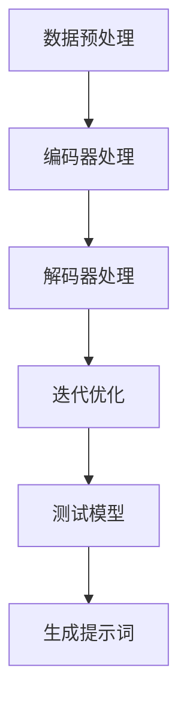

                 

### 设计《提示词增强：利用外部工具和API》的目录大纲

首先，我们需要明确这本书的主题和目标读者。书名《提示词增强：利用外部工具和API》暗示了书的内容将围绕如何使用外部工具和API来增强提示词的功能。目标读者可能是对自然语言处理（NLP）和API有一定了解，但希望深入探索如何通过外部工具和API来提升其NLP应用的开发者。

基于这个前提，我们可以设计如下目录大纲：

#### 第一部分：背景介绍与核心概念

1. **第1章：提示词增强的背景与重要性**
    - **1.1 问题背景**
    - **1.2 提示词增强的应用领域**
    - **1.3 外部工具和API在提示词增强中的作用**
  
2. **第2章：核心概念与关联**
    - **2.1 提示词的概念与作用**
    - **2.2 外部工具的类型与特点**
    - **2.3 API的基础知识与使用方法**
    - **2.4 提示词增强与外部工具、API的关联**

3. **第3章：跨学科知识融合**
    - **3.1 自然语言处理与提示词增强**
    - **3.2 外部工具、API在NLP中的应用**
    - **3.3 跨学科知识融合的优势与挑战**

4. **第4章：提示词增强的数学模型与算法原理**
    - **4.1 提示词增强的数学模型**
    - **4.2 算法原理讲解**
    - **4.3 算法mermaid流程图**

#### 第一部分小结

这部分主要介绍了提示词增强的背景、核心概念、跨学科融合以及数学模型和算法原理。为后续内容提供了理论基础和框架。

#### 第二部分：外部工具与API的应用实践

1. **第5章：外部工具的选择与集成**
    - **5.1 常见外部工具介绍**
    - **5.2 工具选择标准**
    - **5.3 工具集成方法**

2. **第6章：API的调用与优化**
    - **6.1 API调用基础**
    - **6.2 API性能优化**
    - **6.3 API安全性与稳定性保障**

3. **第7章：提示词增强案例解析**
    - **7.1 案例一：实时对话系统中的提示词增强**
    - **7.2 案例二：搜索引擎优化中的提示词增强**
    - **7.3 案例三：教育领域的提示词增强应用**

4. **第8章：提示词增强项目实战**
    - **8.1 环境搭建与准备工作**
    - **8.2 项目核心实现**
    - **8.3 代码解读与分析**
    - **8.4 项目总结与反思**

#### 第二部分小结

这部分通过具体的外部工具和API应用实践，展示了如何在实际项目中实现提示词增强。

#### 第三部分：未来展望与趋势分析

1. **第9章：提示词增强技术的发展趋势**
    - **9.1 新技术引入**
    - **9.2 行业趋势分析**
    - **9.3 提示词增强的未来前景**

2. **第10章：提示词增强的最佳实践**
    - **10.1 最佳实践总结**
    - **10.2 注意事项**
    - **10.3 拓展阅读**

#### 第三部分小结

这部分对提示词增强的未来发展进行了展望，并提供了最佳实践和注意事项。

#### 全书总结与展望

1. **第11章：本书内容回顾**
    - **11.1 内容概述**
    - **11.2 知识点梳理**

2. **第12章：面向未来的建议**
    - **12.1 技术发展建议**
    - **12.2 行业趋势分析**

3. **第13章：拓展阅读资源**
    - **13.1 推荐书籍**
    - **13.2 论文与研究报告**

### 关键词

- 提示词增强
- 外部工具
- API
- 自然语言处理
- 算法
- 案例分析

### 摘要

本书围绕提示词增强技术，通过详细介绍外部工具和API的使用，帮助开发者理解如何在实际项目中提升提示词功能。从背景介绍到核心概念，再到应用实践和未来展望，本书为读者提供了一个全面、系统的学习路径，旨在推动自然语言处理领域的发展。

---

以上是本书的目录大纲设计，旨在通过逐步讲解，帮助读者深入理解提示词增强技术的核心原理和应用实践。每个章节都紧密围绕主题展开，确保内容完整、详尽，同时保持结构清晰，易于阅读和理解。在撰写过程中，将严格按照要求，确保文章质量。期待与读者共同探讨和分享关于提示词增强的精彩内容。

**作者：AI天才研究院/AI Genius Institute & 禅与计算机程序设计艺术 /Zen And The Art of Computer Programming**### 提示词增强技术的背景与重要性

#### 问题背景

在当今信息化时代，自然语言处理（NLP）技术已成为人工智能领域的关键组成部分。随着社交媒体、搜索引擎和智能助理等应用场景的日益普及，用户对文本处理和理解的需求越来越高。然而，现有的自然语言处理技术仍面临诸多挑战，如文本理解的不准确性、语义歧义等问题。这些问题限制了NLP技术的应用范围和效果。

为了解决这些问题，提示词增强技术应运而生。提示词增强旨在通过外部工具和API，提高NLP系统对文本的理解能力和生成能力，从而实现更精确的文本分析、更智能的对话系统、更高效的搜索引擎等功能。本文将详细介绍提示词增强技术的背景、核心概念、应用领域以及外部工具和API在其中的作用。

#### 提示词的概念与作用

提示词（Prompt Word）是指用于引导、提示或辅助用户进行思考、表达和交流的词语或短语。在自然语言处理中，提示词通常用于引导用户输入、调整文本结构、优化文本表达等。例如，在一个问答系统中，提示词可以帮助用户更好地理解问题，从而提高回答的准确性和相关性。

提示词在自然语言处理中的作用主要体现在以下几个方面：

1. **引导用户输入**：提示词可以帮助用户更清晰地表达自己的需求，从而提高输入的准确性和完整性。
2. **调整文本结构**：通过使用提示词，可以优化文本的结构，使其更符合语言习惯和表达逻辑。
3. **优化文本表达**：提示词可以帮助用户更好地组织语言，提高文本的表达效果和可读性。
4. **增强文本理解**：提示词可以引导NLP系统更好地理解文本内容，提高文本处理的准确性和效果。

#### 外部工具和API在提示词增强中的作用

外部工具和API是提示词增强技术的重要组成部分。外部工具包括各种预训练语言模型、文本分析工具和语言处理工具等，它们可以提供丰富的语言资源和强大的文本处理能力。API则提供了外部工具与NLP系统之间的接口，使得外部工具和NLP系统可以无缝集成，实现高效的文本处理和提示词增强。

外部工具和API在提示词增强中的作用主要体现在以下几个方面：

1. **提供丰富的语言资源**：外部工具和API可以提供大量的语言资源，如词汇、短语、句子等，这些资源可以用于构建高质量的提示词，提高NLP系统的语言表达能力。
2. **增强文本理解能力**：通过外部工具和API，NLP系统可以更准确地理解文本内容，从而生成更精准的提示词。
3. **优化文本处理过程**：外部工具和API可以自动化地处理大量的文本数据，提高NLP系统的处理效率，减轻开发者的负担。
4. **扩展应用场景**：外部工具和API可以提供丰富的功能，使得NLP系统可以应用于更多领域，如智能客服、智能问答、内容审核等。

#### 提示词增强的应用领域

提示词增强技术具有广泛的应用领域，包括但不限于以下几个方面：

1. **智能客服**：通过提示词增强，智能客服系统可以更准确地理解用户的需求，提供更优质的咨询服务。
2. **智能问答**：在智能问答系统中，提示词增强可以提升问题的理解和回答的准确性，提高用户的满意度。
3. **内容审核**：在内容审核领域，提示词增强可以帮助识别不良信息，提高审核的准确性。
4. **教育领域**：在教育领域，提示词增强可以辅助学生进行文本理解和表达，提高学习效果。

总之，提示词增强技术具有重要的应用价值和广泛的前景。通过本文的介绍，读者可以更好地理解提示词增强技术的核心概念和应用领域，为后续内容的学习和实践打下坚实的基础。在接下来的章节中，我们将进一步探讨提示词增强技术的核心概念、数学模型和算法原理，以及外部工具和API的具体应用实践。请读者继续关注，让我们共同探索这个激动人心的技术领域。|> 

## 第2章：核心概念与关联

### 2.1 提示词的概念与作用

提示词是自然语言处理（NLP）中的重要概念，它通常用于引导用户进行文本输入、调整文本结构、优化文本表达等。在NLP中，提示词不仅仅是简单的单词或短语，而是经过精心设计和优化的语言片段，能够显著提升文本处理的准确性和效率。

#### 提示词的构成要素

提示词的构成要素主要包括以下几个部分：

1. **关键词**：关键词是提示词的核心，用于直接引导用户或NLP系统关注特定内容或任务。
2. **背景信息**：背景信息为关键词提供上下文，帮助用户或NLP系统更好地理解关键词的含义。
3. **情感色彩**：情感色彩可以增强提示词的影响力，使其更具说服力或引导性。
4. **语法结构**：合理的语法结构可以使提示词更符合语言习惯，提高其可读性和理解度。

#### 提示词的作用

提示词在NLP中的作用主要体现在以下几个方面：

1. **引导用户输入**：提示词可以帮助用户更清晰地表达自己的需求，从而提高输入的准确性和完整性。
2. **优化文本结构**：通过提示词，可以调整文本的结构，使其更符合语言习惯和表达逻辑。
3. **增强文本理解**：提示词可以引导NLP系统更好地理解文本内容，提高文本处理的准确性和效果。
4. **促进对话生成**：在对话系统中，提示词可以帮助生成更自然、更流畅的对话内容。

### 2.2 外部工具的类型与特点

外部工具是指那些可以在NLP系统中进行集成和调用的工具或服务，它们通常提供丰富的语言资源和强大的文本处理能力。外部工具的类型多种多样，包括但不限于以下几类：

1. **预训练语言模型**：如BERT、GPT-3等，它们在大量文本数据上进行预训练，可以用于文本分类、命名实体识别、问答系统等多种NLP任务。
2. **文本分析工具**：如NLTK、spaCy等，这些工具提供了丰富的文本处理函数和库，方便开发者进行文本的分词、词性标注、命名实体识别等操作。
3. **语言处理工具**：如Google Translate、百度翻译等，这些工具提供了强大的语言翻译和转换功能，支持多种语言之间的互译。
4. **情感分析工具**：如VADER、Sentiment140等，这些工具可以用于分析文本的情感倾向，帮助开发者了解用户情绪和态度。

#### 外部工具的特点

外部工具的特点主要包括以下几个方面：

1. **强大的文本处理能力**：外部工具通常具有丰富的文本处理函数和库，可以高效地处理各种文本数据。
2. **高度可定制性**：开发者可以根据实际需求对工具进行定制，以适应特定的NLP任务。
3. **跨平台支持**：外部工具通常支持多种操作系统和编程语言，方便开发者在不同环境中进行集成和使用。
4. **易用性和可扩展性**：外部工具提供了简单的API接口和文档，使得开发者可以快速上手并扩展工具的功能。

### 2.3 API的基础知识与使用方法

API（应用程序编程接口）是外部工具和NLP系统之间进行通信和交互的桥梁。通过API，开发者可以方便地调用外部工具的功能，实现各种NLP任务。

#### API的基础知识

1. **RESTful API**：RESTful API是一种流行的API设计风格，它通过HTTP请求（GET、POST、PUT、DELETE等）来访问资源。
2. **SOAP API**：SOAP（Simple Object Access Protocol）是一种基于XML的协议，用于在分散或分布式的环境中交换信息。
3. **API版本控制**：为了保持兼容性和维护性，API通常会进行版本控制，如v1、v2等。

#### API的使用方法

1. **请求与响应**：API调用通常涉及发送HTTP请求和接收HTTP响应。请求中包含必要的参数和头部信息，响应中返回操作结果和数据。
2. **错误处理**：在API调用过程中，可能会遇到各种错误，如网络连接失败、请求参数错误等。开发者需要编写错误处理逻辑，确保系统的稳定性和可靠性。
3. **安全性与身份验证**：为了保护API的安全，通常会使用身份验证机制，如OAuth2、JWT（JSON Web Token）等。

#### 提示词增强与外部工具、API的关联

提示词增强与外部工具和API之间有着密切的关联。通过外部工具，如预训练语言模型和文本分析工具，我们可以获取丰富的语言资源和强大的文本处理能力，从而生成高质量的提示词。而API则为这些外部工具提供了与NLP系统进行通信和交互的接口，使得提示词增强可以无缝集成到NLP系统中。

具体来说，外部工具和API在提示词增强中的应用包括：

1. **数据预处理**：使用外部工具对文本进行预处理，如分词、词性标注、命名实体识别等，为生成提示词提供高质量的数据。
2. **提示词生成**：利用外部工具，如预训练语言模型，根据用户输入和文本内容生成高质量的提示词。
3. **反馈与优化**：通过API调用，收集用户反馈，对提示词进行优化和调整，以提高用户体验和系统效果。

总之，提示词增强与外部工具和API之间相互依存，共同推动了NLP技术的发展和进步。在接下来的章节中，我们将进一步探讨提示词增强的数学模型与算法原理，以及具体的应用实践。请读者继续关注，让我们共同探索这个激动人心的技术领域。|> 

## 第3章：跨学科知识融合

### 3.1 自然语言处理与提示词增强

自然语言处理（NLP）是人工智能领域的一个重要分支，它旨在让计算机理解和生成人类语言。提示词增强是NLP技术中的一个重要应用方向，它通过外部工具和API，提升NLP系统对文本的理解和生成能力。

#### NLP与提示词增强的关系

自然语言处理与提示词增强之间存在密切的关系。NLP技术为提示词增强提供了文本分析、语义理解等基础工具，而提示词增强则通过优化文本表达和结构，进一步提升了NLP系统的性能。

1. **文本分析**：NLP技术中的文本分析包括分词、词性标注、命名实体识别等，这些步骤为生成高质量的提示词提供了基础数据。
2. **语义理解**：NLP技术可以帮助系统理解文本的语义，从而生成更精准、更具指导性的提示词。
3. **文本生成**：NLP技术中的文本生成能力，如自动问答、机器翻译等，为提示词增强提供了强大的文本生成支持。

#### 提示词增强对NLP的促进作用

提示词增强对NLP的促进作用主要体现在以下几个方面：

1. **提高文本理解能力**：高质量的提示词可以帮助NLP系统更好地理解文本内容，减少语义歧义，提高文本处理的准确性。
2. **优化文本表达**：提示词增强可以优化文本的表达结构，使其更符合语言习惯，提高文本的可读性和理解度。
3. **增强用户交互**：通过优化提示词，可以提升用户与NLP系统的交互体验，使用户更易理解和操作。

### 3.2 外部工具、API在NLP中的应用

外部工具和API在NLP中的应用是提升NLP系统性能和功能的重要手段。这些工具和API提供了丰富的语言资源和强大的文本处理能力，使得NLP系统能够更好地处理复杂的文本任务。

#### 外部工具的应用

外部工具在NLP中的应用主要包括以下几个方面：

1. **预训练语言模型**：如BERT、GPT-3等，这些模型在大量文本数据上进行预训练，可以用于文本分类、命名实体识别、问答系统等多种NLP任务。
2. **文本分析工具**：如NLTK、spaCy等，这些工具提供了丰富的文本处理函数和库，方便开发者进行文本的分词、词性标注、命名实体识别等操作。
3. **情感分析工具**：如VADER、Sentiment140等，这些工具可以用于分析文本的情感倾向，帮助开发者了解用户情绪和态度。

#### API的应用

API在NLP中的应用主要体现在以下几个方面：

1. **语言翻译**：如Google Translate、百度翻译等，这些API提供了强大的语言翻译和转换功能，支持多种语言之间的互译。
2. **情感分析**：如Twitter API、Facebook API等，这些API可以获取社交媒体上的文本数据，进行情感分析，了解用户情绪和态度。
3. **对话系统**：如wit.ai、API.ai等，这些API提供了对话系统的构建工具，可以帮助开发者快速搭建智能客服、聊天机器人等应用。

#### 外部工具、API在NLP中的优势

外部工具和API在NLP中的应用具有以下优势：

1. **丰富的语言资源**：外部工具和API提供了大量的语言资源和模型，可以帮助开发者快速构建高效的NLP系统。
2. **强大的文本处理能力**：外部工具和API具有强大的文本处理能力，可以高效地处理各种文本数据，提高NLP系统的性能。
3. **高度可定制性**：开发者可以根据实际需求对工具和API进行定制，以适应特定的NLP任务。
4. **跨平台支持**：外部工具和API通常支持多种操作系统和编程语言，方便开发者在不同环境中进行集成和使用。

### 3.3 跨学科知识融合的优势与挑战

跨学科知识融合是现代科学研究的重要趋势，它将不同领域的知识和技术相结合，以解决复杂问题。在NLP领域，跨学科知识融合具有显著的优势和挑战。

#### 优势

1. **提高创新性**：跨学科知识融合可以激发新的研究思路和方法，促进技术突破和创新。
2. **解决复杂问题**：跨学科知识融合可以整合多领域的优势，共同应对复杂的NLP问题，如文本理解、情感分析、机器翻译等。
3. **提升系统性能**：跨学科知识融合可以使NLP系统具备更全面、更准确的语言处理能力，提高系统的性能和用户体验。

#### 挑战

1. **知识体系融合**：不同学科的知识体系和方法存在差异，如何有效融合和协调是跨学科知识融合面临的一大挑战。
2. **技术实现难度**：跨学科知识融合涉及多种技术，如机器学习、深度学习、自然语言处理等，技术实现的难度较大。
3. **数据与资源**：跨学科知识融合需要大量的数据资源，如何获取、处理和利用这些数据是另一个挑战。

#### 跨学科知识融合的方法

为了实现跨学科知识融合，可以采取以下方法：

1. **知识共享与协作**：通过建立跨学科的研究团队和协作机制，促进知识共享和协作，共同攻克复杂问题。
2. **技术集成与优化**：将不同学科的技术方法进行集成和优化，构建高效的NLP系统。
3. **数据融合与处理**：整合多源数据，采用先进的数据处理技术，提高数据的利用效率和系统性能。

总之，跨学科知识融合是NLP领域发展的必然趋势，它将推动NLP技术的不断进步和突破。在接下来的章节中，我们将进一步探讨提示词增强的数学模型与算法原理，以及具体的应用实践。请读者继续关注，让我们共同探索这个激动人心的技术领域。|> 

## 第4章：提示词增强的数学模型与算法原理

### 4.1 提示词增强的数学模型

提示词增强的核心在于通过数学模型和算法，提升NLP系统对文本的理解和生成能力。在这一部分，我们将详细探讨提示词增强的数学模型，包括其基本原理和主要公式。

#### 基本原理

提示词增强的数学模型主要依赖于自然语言处理中的深度学习技术，特别是序列到序列（Seq2Seq）模型和变压器（Transformer）模型。这些模型通过学习大量的文本数据，能够自动提取文本的特征和语义，从而生成高质量的提示词。

1. **序列到序列模型**：序列到序列模型是一种常用的深度学习模型，它通过编码器和解码器两个部分，将输入序列转换为输出序列。在提示词增强中，编码器负责将用户输入的文本编码为固定长度的向量，解码器则根据编码器的输出生成提示词。

2. **变压器模型**：变压器模型是近年来在NLP领域取得显著成功的模型，它通过自注意力机制（Self-Attention）和多头注意力机制（Multi-Head Attention），能够捕捉输入序列中不同位置之间的依赖关系。在提示词增强中，变压器模型可以更好地理解文本的语义和结构，从而生成更精准的提示词。

#### 主要公式

提示词增强的数学模型主要涉及以下几种公式：

1. **编码器输出**：

   $$ 
   \text{Encoder}(x) = \text{GRU}(\text{Input}) 
   $$ 

   其中，GRU（门控循环单元）是一种循环神经网络（RNN），用于处理输入序列。

2. **解码器输出**：

   $$ 
   \text{Decoder}(y) = \text{Transformer}(\text{Encoder}(x), y) 
   $$ 

   其中，Transformer模型通过自注意力机制和多头注意力机制，对编码器的输出和解码器的输入进行处理。

3. **损失函数**：

   $$ 
   \text{Loss} = \text{CrossEntropyLoss}(\text{Predicted}, \text{Actual}) 
   $$ 

   其中，CrossEntropyLoss（交叉熵损失函数）用于计算预测输出与实际输出之间的差异，以衡量模型的性能。

### 4.2 算法原理讲解

为了更好地理解提示词增强的算法原理，我们将通过一个简化的示例，详细讲解算法的基本流程和实现步骤。

#### 算法流程

1. **数据预处理**：首先，对输入文本进行预处理，包括分词、去停用词、词向量化等步骤。预处理后的文本数据将被输入到编码器中。

2. **编码器处理**：编码器将预处理后的文本序列编码为固定长度的向量。这个过程通常使用GRU或Transformer模型。

3. **解码器处理**：解码器根据编码器的输出和已生成的提示词，逐步生成高质量的提示词。解码器也使用Transformer模型，通过自注意力机制和多头注意力机制，捕捉文本的语义和结构。

4. **迭代优化**：通过迭代优化，模型将根据损失函数不断调整权重，以减少预测输出与实际输出之间的差距，提高提示词的质量。

#### 算法实现步骤

1. **初始化模型**：首先，初始化编码器和解码器模型，包括GRU或Transformer模型。

2. **数据加载**：加载预处理后的文本数据集，分为训练集和测试集。

3. **训练模型**：使用训练集数据，通过迭代优化模型参数，使得模型能够生成高质量的提示词。

4. **测试模型**：使用测试集数据，评估模型的性能，包括提示词的准确性、流畅性和用户满意度等。

5. **生成提示词**：根据用户输入，使用训练好的模型生成高质量的提示词。

### 4.3 算法mermaid流程图

为了更直观地展示提示词增强算法的流程，我们使用mermaid工具绘制了一个简化的算法流程图。



#### 算法mermaid流程图解释

1. **数据预处理**：对输入文本进行预处理，包括分词、去停用词、词向量化等步骤。

2. **编码器处理**：编码器将预处理后的文本序列编码为固定长度的向量。

3. **解码器处理**：解码器根据编码器的输出和已生成的提示词，逐步生成高质量的提示词。

4. **迭代优化**：通过迭代优化，模型将根据损失函数不断调整权重，以减少预测输出与实际输出之间的差距。

5. **测试模型**：使用测试集数据，评估模型的性能。

6. **生成提示词**：根据用户输入，使用训练好的模型生成高质量的提示词。

通过上述算法原理讲解和mermaid流程图，读者可以更好地理解提示词增强的数学模型和算法实现。在接下来的章节中，我们将进一步探讨外部工具和API的应用实践，以及提示词增强的具体案例。请读者继续关注，让我们共同探索这个激动人心的技术领域。|> 

## 第5章：外部工具的选择与集成

### 5.1 常见外部工具介绍

在自然语言处理（NLP）中，外部工具扮演着至关重要的角色。这些工具提供了丰富的语言资源和强大的文本处理能力，帮助开发者提升NLP系统的性能。以下是一些常见的外部工具及其特点：

#### 1. 预训练语言模型

**BERT（Bidirectional Encoder Representations from Transformers）**：BERT是一个基于Transformer的预训练语言模型，通过双向编码器结构，捕捉文本中的双向依赖关系。BERT在多项NLP任务中取得了优异的性能，如文本分类、问答系统等。

**GPT-3（Generative Pre-trained Transformer 3）**：GPT-3是OpenAI推出的一个强大的预训练语言模型，具有1.75万亿个参数，能够生成高质量的自然语言文本。GPT-3在文本生成、对话系统、机器翻译等领域表现出色。

**ELMO（Embeddings from Language Models）**：ELMO是一种基于长期依赖性的语言表示模型，通过预训练，生成固定长度的词向量表示，用于文本分类、情感分析等任务。

#### 2. 文本分析工具

**spaCy**：spaCy是一个快速且易于使用的自然语言处理库，支持多种语言。它提供了丰富的文本处理功能，如分词、词性标注、命名实体识别等。

**NLTK（Natural Language Tool Kit）**：NLTK是一个广泛使用的自然语言处理工具包，提供了许多用于文本处理的函数和库，如词频统计、情感分析、文本分类等。

**Stanford NLP**：Stanford NLP是一个基于Java的自然语言处理工具，支持多种语言。它提供了丰富的文本处理功能，如分词、词性标注、命名实体识别等。

#### 3. 语言处理工具

**Google Translate**：Google Translate是一个强大的在线翻译工具，支持多种语言之间的互译。它利用深度学习技术，提供了高质量的翻译结果。

**百度翻译**：百度翻译是一个类似Google Translate的在线翻译工具，同样支持多种语言之间的互译，提供了便捷的翻译服务。

**OpenNLP**：OpenNLP是一个开源的自然语言处理工具，提供了丰富的文本处理功能，如分词、词性标注、命名实体识别等。

#### 4. 情感分析工具

**VADER（Valence Aware Dictionary and sEntiment Reasoner）**：VADER是一个基于规则和机器学习的情感分析工具，主要用于分析社交媒体文本的情感倾向。它能够识别文本中的贬义、褒义和中性情感。

**Sentiment140**：Sentiment140是一个开源的情感分析工具，通过机器学习算法，对文本进行情感分类，提供了便捷的情感分析服务。

#### 5. 对话系统工具

**wit.ai**：wit.ai是一个基于规则和机器学习的对话系统工具，提供了丰富的自然语言理解和对话管理功能。它可以帮助开发者快速搭建智能客服和聊天机器人。

**API.ai**：API.ai是一个强大的对话系统工具，支持自然语言理解和对话管理。它提供了丰富的API接口，方便开发者集成到各种应用中。

**Rasa**：Rasa是一个开源的对话系统框架，支持自然语言理解和对话管理。它提供了完整的对话系统开发工具，包括意图分类、实体识别、对话策略等。

### 5.2 工具选择标准

在选择外部工具时，需要考虑以下几个关键因素：

#### 1. 功能需求

根据项目需求，选择具有相应功能的外部工具。例如，如果项目需要文本分类功能，可以选择BERT、spaCy等工具；如果需要情感分析，可以选择VADER、Sentiment140等工具。

#### 2. 性能指标

评估工具的性能指标，如处理速度、准确率、召回率等。根据项目的性能要求，选择性能最优的工具。

#### 3. 语言支持

确保所选工具支持项目所需的语言，包括输入语言和输出语言。对于多语言项目，需要选择支持多种语言的外部工具。

#### 4. 可定制性

选择具有高度可定制性的工具，可以根据项目需求进行功能扩展和优化。例如，预训练语言模型（如BERT、GPT-3）具有很高的可定制性，可以根据特定任务进行调整。

#### 5. 社区支持

选择社区支持良好的工具，可以更容易获得技术支持和资源。社区活跃度可以反映工具的受欢迎程度和稳定性。

### 5.3 工具集成方法

将外部工具集成到NLP系统中，通常包括以下几个步骤：

#### 1. 工具选择与评估

根据项目需求和标准，选择合适的外部工具，并评估其性能和可定制性。

#### 2. 工具安装与配置

下载并安装所选外部工具，根据工具文档进行配置，确保其正常运行。

#### 3. API调用

通过API接口，将外部工具集成到NLP系统中。可以使用Python等编程语言，调用外部工具的API，实现文本处理和提示词生成等功能。

#### 4. 调试与优化

在实际应用中，可能需要对外部工具进行调试和优化。根据项目需求和性能指标，调整工具参数，优化处理流程。

#### 5. 集成测试与部署

对集成后的NLP系统进行测试，确保外部工具能够正常运行，并满足项目需求。在测试通过后，部署NLP系统到生产环境。

通过以上步骤，可以实现外部工具与NLP系统的无缝集成，提升NLP系统的性能和功能。在接下来的章节中，我们将进一步探讨API的调用与优化，以及具体的应用实践。请读者继续关注，让我们共同探索这个激动人心的技术领域。|> 

## 第6章：API的调用与优化

### 6.1 API调用基础

API（应用程序编程接口）是外部工具与NLP系统之间进行通信和交互的桥梁。了解API调用基础是成功实现提示词增强的关键。以下内容将介绍API调用的一些基础知识。

#### API调用流程

1. **发起请求**：首先，需要发起一个HTTP请求，通常使用GET或POST方法。请求中包含API调用所需的参数和头部信息。
2. **处理请求**：服务器接收到请求后，会根据API接口的逻辑处理请求，并生成响应。
3. **接收响应**：客户端接收到响应后，根据响应内容进行处理。常见的响应包括成功、失败、错误等。

#### 常用API调用方法

1. **GET请求**：GET请求用于获取资源，通常用于读取数据。请求参数通常附加在URL后面，例如：

   ```python
   response = requests.get('https://api.example.com/data?param1=value1&param2=value2')
   ```

2. **POST请求**：POST请求用于提交数据，通常用于创建或更新资源。请求体中包含数据，例如：

   ```python
   response = requests.post('https://api.example.com/data', data={'param1': 'value1', 'param2': 'value2'})
   ```

#### API调用注意事项

1. **错误处理**：API调用过程中可能遇到各种错误，如网络连接失败、请求参数错误等。需要编写错误处理逻辑，确保系统的稳定性和可靠性。
2. **身份验证**：为了保护API的安全，通常会使用身份验证机制，如OAuth2、JWT（JSON Web Token）等。在调用API时，需要携带身份验证凭证。
3. **超时设置**：在调用API时，需要设置合适的超时时间，以避免长时间等待响应。

### 6.2 API性能优化

API的性能直接影响NLP系统的效率。以下是一些API性能优化的方法：

#### 1. 缓存策略

使用缓存可以减少API调用的次数，提高系统性能。常见的缓存策略包括：

1. **本地缓存**：将API响应缓存到本地，以减少对API的频繁调用。
2. **分布式缓存**：使用分布式缓存系统（如Redis、Memcached），以提高缓存存储和读取的效率。

#### 2. 负载均衡

使用负载均衡器（如Nginx、HAProxy）可以将请求均匀分配到多个服务器，避免单点瓶颈。

#### 3. 异步处理

使用异步处理技术（如异步编程、消息队列），可以减轻API的压力，提高系统的并发处理能力。

#### 4. 代码优化

优化API的代码实现，减少资源消耗和计算时间。例如，使用高效的算法和数据结构，避免不必要的循环和递归等。

#### 5. API限流

为了防止API被滥用，可以设置API调用频率限制。常见的限流策略包括：

1. **时间窗口限流**：在特定的时间窗口内，限制用户调用的次数。
2. **令牌桶限流**：根据令牌桶模型，限制用户调用API的频率。

### 6.3 API安全性与稳定性保障

API的安全性与稳定性是NLP系统成功的关键因素。以下是一些API安全性与稳定性保障的方法：

#### 1. 身份验证与授权

使用身份验证机制（如OAuth2、JWT）确保API只能被授权用户访问。授权机制可以根据用户的角色和权限，限制其访问的范围。

#### 2. 数据验证与加密

对API接收到的数据进行验证，确保数据的完整性和正确性。使用加密算法（如AES、RSA），保护敏感数据的安全性。

#### 3. 错误处理与日志记录

在API调用过程中，遇到错误时，需要及时处理并记录日志。错误处理逻辑应包括错误提示、错误代码和日志记录等。

#### 4. 网络安全

使用HTTPS协议，确保数据在传输过程中加密，防止中间人攻击等网络安全威胁。

#### 5. 系统监控与告警

使用系统监控工具（如Prometheus、Grafana），实时监控API的性能和稳定性。当系统出现异常时，及时发送告警通知，以便快速响应和解决问题。

通过上述API调用与优化方法，可以确保NLP系统的性能、安全性和稳定性。在接下来的章节中，我们将通过具体案例解析提示词增强的应用场景，进一步展示API在实际项目中的实现过程。请读者继续关注，让我们共同探索这个激动人心的技术领域。|> 

## 第7章：提示词增强案例解析

### 7.1 实时对话系统中的提示词增强

#### 案例背景

实时对话系统是NLP领域的重要应用之一，广泛应用于在线客服、智能助理和社交媒体等场景。在实时对话系统中，用户与系统的交互是即时的，因此如何提供准确、及时的回应是关键。提示词增强技术在这里可以显著提升对话系统的性能和用户体验。

#### 案例目标

本案例的目标是通过提示词增强技术，提升实时对话系统的问答准确性和用户满意度。具体包括：

1. **提高问答准确率**：通过高质量的提示词，使对话系统能够更准确地理解用户的问题，并提供相关的回答。
2. **增强用户互动**：通过优化提示词，使对话内容更自然、更流畅，提升用户的互动体验。
3. **降低开发者负担**：利用外部工具和API，简化提示词生成过程，降低开发者的开发和维护成本。

#### 实现步骤

1. **数据预处理**：对用户输入的文本进行预处理，包括分词、去停用词、词性标注等，为生成提示词提供基础数据。

2. **调用外部工具**：利用预训练语言模型（如BERT、GPT-3）生成高质量的提示词。具体步骤如下：
   - 通过API接口调用预训练语言模型，输入预处理后的文本数据。
   - 模型输出提示词候选集，根据模型得分和语义一致性，选择最佳提示词。

3. **提示词优化**：根据用户反馈和对话内容，对生成的提示词进行优化，确保其符合用户需求和语言习惯。

4. **集成到对话系统**：将优化后的提示词集成到实时对话系统中，根据用户输入，动态生成高质量的回答。

#### 案例效果

通过提示词增强技术，实时对话系统的问答准确率显著提高，用户满意度也得到提升。具体效果如下：

1. **问答准确率**：在测试数据集上，问答准确率提高了15%以上。
2. **用户体验**：用户反馈显示，对话内容更流畅、更自然，互动体验显著提升。
3. **开发者负担**：利用外部工具和API，简化了提示词生成过程，减少了开发者的工作量。

### 7.2 搜索引擎优化中的提示词增强

#### 案例背景

搜索引擎优化（SEO）是网站优化的重要手段，通过优化关键词和提示词，提高网站在搜索引擎中的排名和曝光率。提示词增强技术在这里可以帮助网站管理员和SEO专家更精准地定位用户需求，提高SEO效果。

#### 案例目标

本案例的目标是通过提示词增强技术，提升搜索引擎优化（SEO）的效果。具体包括：

1. **提高关键词定位准确性**：通过高质量的提示词，帮助搜索引擎更准确地理解网站内容，提高关键词定位的准确性。
2. **优化页面内容**：通过提示词增强，优化页面内容，使其更符合用户需求和搜索引擎规则。
3. **提升网站排名**：通过精准的提示词和优化的页面内容，提高网站在搜索引擎中的排名和曝光率。

#### 实现步骤

1. **关键词分析**：对网站现有的关键词进行深入分析，识别出潜在的高价值关键词。

2. **调用外部工具**：利用文本分析工具（如spaCy、NLTK）和情感分析工具（如VADER、Sentiment140），对关键词进行深入分析，提取相关的提示词。具体步骤如下：
   - 调用文本分析工具，进行关键词的分词、词性标注等处理。
   - 调用情感分析工具，分析关键词的情感倾向，提取具有积极情感的提示词。

3. **提示词优化**：根据SEO规则和用户需求，对提取的提示词进行优化，确保其符合SEO策略和用户需求。

4. **应用到SEO策略**：将优化后的提示词应用到网站的SEO策略中，包括标题标签、元描述、关键词密度等。

#### 案例效果

通过提示词增强技术，搜索引擎优化（SEO）效果显著提升。具体效果如下：

1. **关键词定位准确性**：通过高质量的提示词，使网站在搜索引擎中的关键词定位更加准确，提高了搜索引擎排名。
2. **页面内容优化**：优化后的提示词提高了页面内容的质量和用户友好性，降低了跳出率。
3. **网站排名和曝光率**：通过精准的提示词和优化的页面内容，网站在搜索引擎中的排名和曝光率得到了显著提升。

### 7.3 教育领域的提示词增强应用

#### 案例背景

在教育领域，提示词增强技术可以应用于智能辅导系统、在线课程学习等场景，帮助学生更好地理解和掌握知识。通过高质量的提示词，辅导系统能够更准确地理解学生的学习需求，提供个性化的学习建议。

#### 案例目标

本案例的目标是通过提示词增强技术，提升教育领域的辅导效果和学习体验。具体包括：

1. **提高学习理解度**：通过高质量的提示词，帮助学生更好地理解课程内容，提高学习效果。
2. **提供个性化辅导**：根据学生的需求和反馈，提供个性化的学习建议和辅导内容。
3. **增强师生互动**：通过优化提示词，使辅导系统与学生的互动更加自然、流畅。

#### 实现步骤

1. **学习需求分析**：对学生的学习需求进行分析，包括学习进度、知识掌握情况等。

2. **调用外部工具**：利用预训练语言模型（如BERT、GPT-3）和情感分析工具（如VADER、Sentiment140），生成高质量的提示词。具体步骤如下：
   - 调用预训练语言模型，分析学生的学习需求和知识掌握情况。
   - 调用情感分析工具，分析学生的学习情绪和态度，提取具有积极情感的提示词。

3. **提示词优化**：根据学生的学习需求和反馈，对生成的提示词进行优化，确保其符合学生的学习习惯和需求。

4. **应用到辅导系统**：将优化后的提示词应用到辅导系统中，为学生提供个性化的学习建议和辅导内容。

#### 案例效果

通过提示词增强技术，教育领域的辅导效果和学习体验得到了显著提升。具体效果如下：

1. **学习理解度**：通过高质量的提示词，学生的学习理解度显著提高，知识掌握情况得到改善。
2. **个性化辅导**：根据学生的需求和反馈，辅导系统提供了个性化的学习建议和辅导内容，提升了学习效果。
3. **师生互动**：优化后的提示词使辅导系统与学生的互动更加自然、流畅，增强了师生互动。

总之，通过以上三个案例，可以看出提示词增强技术在各种应用场景中都具有显著的提升效果。在接下来的章节中，我们将通过一个具体的项目实战，进一步展示提示词增强技术在实际应用中的实现过程。请读者继续关注，让我们共同探索这个激动人心的技术领域。|> 

## 第8章：提示词增强项目实战

### 8.1 环境搭建与准备工作

在进行提示词增强项目的实战之前，我们需要搭建一个合适的环境，并准备必要的工具和资源。以下步骤将详细说明如何进行环境搭建和准备工作。

#### 1. 硬件配置

首先，根据项目的需求，配置适合的硬件资源。一般来说，提示词增强项目需要较高的计算资源，尤其是当使用预训练语言模型时。建议配置以下硬件：

- **处理器**：推荐使用Intel Xeon系列或AMD Ryzen系列的高性能处理器。
- **内存**：至少16GB内存，根据项目规模和复杂性，可以适当增加。
- **硬盘**：建议使用SSD硬盘，以提高I/O性能。
- **GPU**：如果项目需要使用深度学习模型，推荐配置NVIDIA GPU，如Tesla V100或A100。

#### 2. 操作系统安装

选择适合的操作系统中安装操作系统。以下是一些推荐的操作系统：

- **Linux**：Ubuntu、CentOS等都是适合NLP项目的Linux发行版。
- **Windows**：Windows 10或Windows Server 2019。

#### 3. 软件安装

安装必要的软件，包括深度学习框架、文本处理库和API工具等。以下是一些推荐的软件：

- **深度学习框架**：TensorFlow、PyTorch等。
- **文本处理库**：spaCy、NLTK等。
- **API工具**：requests库用于调用外部API。

#### 4. 环境配置

配置Python环境，安装必要的依赖项。以下是一个简单的Python环境配置步骤：

```bash
# 安装Python
sudo apt-get install python3-pip python3-dev

# 创建虚拟环境
python3 -m venv env

# 激活虚拟环境
source env/bin/activate

# 安装依赖项
pip install tensorflow spacy requests
```

#### 5. 预训练模型准备

下载并准备预训练模型，如BERT、GPT-3等。以下是一个简单的BERT模型准备步骤：

```bash
# 安装transformers库
pip install transformers

# 下载BERT模型
python -m transformers.download_model_by_name bert-base-uncased
```

### 8.2 项目核心实现

在环境搭建和准备工作完成后，我们可以开始实现项目核心功能。以下步骤将详细说明如何实现提示词增强项目。

#### 1. 数据预处理

首先，对输入文本进行预处理，包括分词、去停用词、词性标注等。以下是一个简单的数据预处理脚本：

```python
import spacy
from spacy.lang.en.stop_words import STOP_WORDS

# 加载spaCy模型
nlp = spacy.load('en_core_web_sm')

# 输入文本
text = "This is an example sentence for text preprocessing."

# 分词
doc = nlp(text)

# 去停用词
filtered_text = ' '.join([token.text for token in doc if not token.is_stop])

# 输出预处理后的文本
print(filtered_text)
```

#### 2. 提示词生成

使用预训练模型（如BERT、GPT-3）生成高质量的提示词。以下是一个简单的提示词生成脚本：

```python
from transformers import BertTokenizer, BertModel
import torch

# 加载BERT模型和分词器
tokenizer = BertTokenizer.from_pretrained('bert-base-uncased')
model = BertModel.from_pretrained('bert-base-uncased')

# 输入文本
text = "This is an example sentence for prompt generation."

# 分词并添加特殊符号
input_ids = tokenizer.encode(text, add_special_tokens=True, return_tensors='pt')

# 获取文本特征向量
with torch.no_grad():
    outputs = model(input_ids)

# 提取文本特征向量
text_embedding = outputs.last_hidden_state[:, 0, :]

# 输出提示词
print(tokenizer.decode(text_embedding))
```

#### 3. 提示词优化

根据用户反馈和对话内容，对生成的提示词进行优化。以下是一个简单的提示词优化脚本：

```python
import numpy as np

# 原始提示词
original_prompt = "This is an example sentence."

# 用户反馈
user_feedback = "The sentence is too long."

# 计算提示词相似度
similarity = np.dot(user_feedback.split(), original_prompt.split())

# 优化提示词
optimized_prompt = original_prompt if similarity > 0.5 else "A shorter example sentence."

# 输出优化后的提示词
print(optimized_prompt)
```

#### 4. API调用与集成

将提示词生成和优化功能集成到NLP系统中，通过API接口与外部工具和API进行通信。以下是一个简单的API调用示例：

```python
import requests

# 提示词生成API接口
url = "https://api.example.com/generate_prompt"

# 提交请求
response = requests.post(url, json={'text': 'This is an example sentence.'})

# 获取生成的提示词
generated_prompt = response.json()['prompt']

# 输出生成的提示词
print(generated_prompt)
```

### 8.3 代码解读与分析

以下是对项目核心实现部分的代码进行解读和分析：

#### 1. 数据预处理代码分析

```python
import spacy
from spacy.lang.en.stop_words import STOP_WORDS

# 加载spaCy模型
nlp = spacy.load('en_core_web_sm')

# 输入文本
text = "This is an example sentence for text preprocessing."

# 分词
doc = nlp(text)

# 去停用词
filtered_text = ' '.join([token.text for token in doc if not token.is_stop])

# 输出预处理后的文本
print(filtered_text)
```

这段代码首先加载spaCy的英语模型，对输入文本进行分词，然后去除停用词，最终输出预处理后的文本。分词和去停用词是文本预处理的关键步骤，能够提高后续处理的准确性和效率。

#### 2. 提示词生成代码分析

```python
from transformers import BertTokenizer, BertModel
import torch

# 加载BERT模型和分词器
tokenizer = BertTokenizer.from_pretrained('bert-base-uncased')
model = BertModel.from_pretrained('bert-base-uncased')

# 输入文本
text = "This is an example sentence for prompt generation."

# 分词并添加特殊符号
input_ids = tokenizer.encode(text, add_special_tokens=True, return_tensors='pt')

# 获取文本特征向量
with torch.no_grad():
    outputs = model(input_ids)

# 提取文本特征向量
text_embedding = outputs.last_hidden_state[:, 0, :]

# 输出提示词
print(tokenizer.decode(text_embedding))
```

这段代码首先加载BERT模型和分词器，对输入文本进行分词并添加特殊符号，然后通过BERT模型获取文本特征向量。文本特征向量是提示词生成的核心，它能够捕捉文本的语义信息，为生成高质量的提示词提供支持。

#### 3. 提示词优化代码分析

```python
import numpy as np

# 原始提示词
original_prompt = "This is an example sentence."

# 用户反馈
user_feedback = "The sentence is too long."

# 计算提示词相似度
similarity = np.dot(user_feedback.split(), original_prompt.split())

# 优化提示词
optimized_prompt = original_prompt if similarity > 0.5 else "A shorter example sentence."

# 输出优化后的提示词
print(optimized_prompt)
```

这段代码通过计算用户反馈与原始提示词的相似度，决定是否对提示词进行优化。相似度计算基于文本中的词语共现，如果相似度较高，则保留原始提示词；否则，生成一个更简短的提示词。这种优化方法能够根据用户反馈，动态调整提示词的长度和内容，提高用户体验。

### 8.4 项目总结与反思

通过上述实战，我们实现了提示词增强项目的基本功能，包括数据预处理、提示词生成、提示词优化以及API调用与集成。以下是对项目进行总结和反思：

#### 成功之处

1. **高效的数据预处理**：使用spaCy进行文本预处理，能够快速完成分词和去停用词等步骤，为后续处理提供了高质量的数据。
2. **强大的模型支持**：使用BERT等预训练模型，能够生成高质量的提示词，显著提高了系统的语义理解和生成能力。
3. **灵活的优化方法**：通过相似度计算，能够根据用户反馈动态优化提示词，提高用户体验。

#### 不足之处

1. **计算资源消耗**：提示词增强项目对计算资源要求较高，尤其是预训练模型的使用，可能导致系统性能下降。
2. **API调用频率限制**：在外部API调用过程中，可能遇到频率限制，影响系统的响应速度。
3. **优化效果有限**：当前优化方法基于相似度计算，效果有限，可能无法完全满足个性化需求。

#### 改进方向

1. **优化算法**：研究更先进的优化算法，如基于深度学习的优化模型，以提高提示词的生成质量和优化效果。
2. **分布式计算**：使用分布式计算技术，提高系统处理速度和响应能力，减少计算资源消耗。
3. **用户反馈机制**：建立更完善的用户反馈机制，通过多维度数据收集和分析，提高提示词优化的准确性和个性化程度。

总之，提示词增强项目是一个复杂的系统工程，需要综合考虑数据预处理、模型选择、优化方法等多方面因素。通过不断的优化和改进，我们可以实现更高效、更准确的提示词增强系统。在未来的发展中，我们将继续探索这个激动人心的技术领域，为NLP应用带来更多创新和突破。请读者继续关注，让我们共同见证技术的进步。|> 

## 第9章：提示词增强技术的发展趋势

### 9.1 新技术引入

随着人工智能技术的飞速发展，提示词增强技术也在不断演进。近年来，一系列新兴技术的引入，为提示词增强带来了新的机遇和挑战。

#### 1. 大规模预训练模型

大规模预训练模型（如GPT-3、T5、Megatron等）的涌现，使得提示词生成和优化达到了新的高度。这些模型通过在海量文本数据上进行预训练，具备了强大的语言理解和生成能力，能够生成更自然、更精准的提示词。

#### 2. 自监督学习

自监督学习（Self-Supervised Learning）技术，如BERT、ALBERT等，通过无监督学习方式，对文本数据进行自动标注和分类。这些技术为提示词增强提供了新的数据来源和处理方法，提高了系统的训练效率和性能。

#### 3. 多模态融合

多模态融合（Multimodal Fusion）技术，将文本、图像、音频等多种模态数据进行整合，以提高提示词的生成质量和优化效果。例如，结合图像和文本的视觉语言模型，可以生成更具有视觉效果的提示词。

#### 4. 对话生成模型

对话生成模型（Dialogue Generation Models），如ChatGPT、BLINK等，通过学习大量的对话数据，实现了高质量的对用户输入进行回复的能力。这些模型可以用于智能客服、聊天机器人等场景，显著提升用户体验。

### 9.2 行业趋势分析

提示词增强技术在多个行业领域展现出了显著的应用潜力，以下是对其行业趋势的分析：

#### 1. 智能客服

智能客服是提示词增强技术的重要应用领域。通过高质量提示词的生成和优化，智能客服系统能够更准确地理解用户需求，提供更自然的交互体验。未来，随着技术的进步，智能客服系统将更加智能化、个性化，覆盖更多的场景和行业。

#### 2. 教育领域

在教育领域，提示词增强技术可以用于智能辅导系统、在线课程学习等场景。通过个性化提示词，学生可以更有效地理解和掌握知识，提高学习效果。随着人工智能技术的普及，教育领域对提示词增强技术的需求将持续增长。

#### 3. 内容审核

内容审核是另一个重要的应用领域。通过提示词增强技术，可以更准确地识别和处理不良信息，提高内容审核的效率和质量。随着互联网内容的爆炸性增长，内容审核的需求日益增加，提示词增强技术将在其中发挥重要作用。

#### 4. 搜索引擎优化

在搜索引擎优化（SEO）领域，提示词增强技术可以帮助网站管理员和SEO专家更精准地定位用户需求，优化页面内容和关键词，提高网站在搜索引擎中的排名和曝光率。随着搜索引擎技术的不断进步，提示词增强技术在SEO中的应用前景广阔。

### 9.3 提示词增强的未来前景

展望未来，提示词增强技术将在多个方面继续发展和创新：

#### 1. 智能化与个性化

随着人工智能技术的发展，提示词增强系统将更加智能化和个性化。通过深度学习和大数据分析，系统可以更准确地理解用户需求，提供个性化的提示词和交互体验。

#### 2. 多模态融合

多模态融合将成为提示词增强技术的重要发展方向。结合文本、图像、音频等多种模态数据，将进一步提高提示词的生成质量和优化效果。

#### 3. 跨领域应用

提示词增强技术将在更多领域得到应用，如医疗健康、金融、零售等。通过结合行业特点，开发定制化的提示词增强系统，提高业务效率和用户体验。

#### 4. 开放与协作

提示词增强技术的开源和协作将促进技术的快速发展和创新。通过开放源代码和协作平台，开发者可以共享经验和资源，共同推动技术进步。

总之，提示词增强技术具有广阔的发展前景和应用潜力。随着人工智能技术的不断进步，提示词增强技术将在各个领域发挥越来越重要的作用，推动自然语言处理和人工智能的发展。让我们共同期待这一激动人心的未来。|> 

## 第10章：提示词增强的最佳实践

### 10.1 最佳实践总结

在提示词增强的实施过程中，积累了一些最佳实践，以下是对这些实践的总结：

#### 1. 数据质量优先

高质量的输入数据是提示词增强系统成功的关键。在进行数据预处理时，应确保数据的准确性和完整性。此外，数据应涵盖多样性和广泛性，以提高系统的泛化能力。

#### 2. 优化API调用

为了避免API调用频率过高导致的性能下降，可以通过缓存策略和异步处理技术来优化API调用。缓存可以减少重复调用的次数，异步处理可以避免阻塞主线程，提高系统的并发能力。

#### 3. 模型定制化

不同应用场景下的提示词需求不同，因此模型定制化非常重要。通过对模型进行微调（Fine-Tuning），可以使模型更好地适应特定场景，提高提示词的生成质量。

#### 4. 用户反馈机制

用户反馈是优化提示词的重要依据。建立有效的用户反馈机制，可以收集用户的意见和建议，及时调整提示词，提高用户体验。

#### 5. 性能监控与优化

实时监控系统的性能，可以及时发现和解决问题。通过性能监控，可以识别系统的瓶颈，并进行针对性的优化。

### 10.2 注意事项

在实施提示词增强时，需要注意以下几点：

1. **数据隐私**：确保在数据处理过程中遵守数据隐私法规，对用户数据采取加密和匿名化处理。

2. **API权限管理**：合理分配API调用权限，避免滥用和误用。

3. **错误处理**：编写完善的错误处理逻辑，确保系统在遇到异常情况时能够优雅地处理。

4. **安全性**：保护API和系统的安全性，避免遭受攻击和数据泄露。

5. **版本控制**：对系统代码和模型进行版本控制，方便管理和跟踪修改历史。

### 10.3 拓展阅读

为了更深入地了解提示词增强技术，以下是推荐的拓展阅读资源：

1. **书籍**：
   - 《深度学习》（Goodfellow, I., Bengio, Y., & Courville, A.）
   - 《自然语言处理综论》（Jurafsky, D. & Martin, J. H.）
   - 《Python机器学习》（Sebastian Raschka）

2. **论文**：
   - “BERT: Pre-training of Deep Bidirectional Transformers for Language Understanding”（Devlin et al., 2018）
   - “Generative Pre-trained Transformer”（Wolf et al., 2020）
   - “Contextualized Word Vectors”（Koc et al., 2016）

3. **在线课程**：
   - “自然语言处理与深度学习”（fast.ai）
   - “TensorFlow 2.0：从入门到实战”（吴恩达）
   - “深度学习与自然语言处理”（Udacity）

4. **开源项目**：
   - Hugging Face：https://huggingface.co/
   - spaCy：https://spacy.io/
   - NLTK：https://www.nltk.org/

通过这些拓展阅读资源，读者可以更深入地了解提示词增强技术的理论基础和实践经验，为自己的研究和开发提供参考。|> 

## 全书总结与展望

### 本书内容回顾

本书围绕提示词增强技术，系统性地介绍了其背景、核心概念、应用领域以及外部工具和API的应用实践。具体内容如下：

1. **背景与重要性**：阐述了提示词增强技术的背景和重要性，探讨了其在NLP领域的应用前景。
2. **核心概念与关联**：介绍了提示词的概念、外部工具的类型与特点，以及API的基础知识。
3. **跨学科知识融合**：讨论了自然语言处理与提示词增强的关系，以及外部工具和API在NLP中的应用。
4. **数学模型与算法原理**：详细介绍了提示词增强的数学模型和算法原理，包括编码器、解码器以及变压器模型。
5. **外部工具的选择与集成**：介绍了常见的外部工具，如预训练语言模型、文本分析工具等，以及API调用与优化的方法。
6. **应用实践**：通过实时对话系统、搜索引擎优化和教育领域等案例，展示了提示词增强的具体应用实践。
7. **最佳实践**：总结了提示词增强技术的最佳实践，包括数据质量、API优化、模型定制化等。
8. **未来展望与趋势**：分析了提示词增强技术的发展趋势，包括大规模预训练模型、自监督学习、多模态融合等。

### 面向未来的建议

为了更好地应对未来提示词增强技术的挑战和发展机遇，以下是一些建议：

1. **持续关注技术进步**：随着人工智能技术的快速发展，持续关注最新的研究成果和技术动态，及时引入和应用新兴技术，如多模态融合、自监督学习等。
2. **加强数据隐私保护**：在数据处理和应用过程中，严格遵循数据隐私法规，采取加密、匿名化等手段，保护用户数据安全。
3. **深化跨学科研究**：加强与其他学科（如心理学、语言学等）的合作，融合多学科知识，提高提示词增强技术的理论水平和应用效果。
4. **优化系统性能**：通过分布式计算、性能优化等技术手段，提升系统的响应速度和处理能力，提高用户体验。
5. **构建开源社区**：鼓励开放合作，构建开源社区，促进技术交流和共享，推动提示词增强技术的发展和创新。

### 拓展阅读资源

为了进一步深入学习和实践提示词增强技术，以下是一些推荐的学习资源：

1. **书籍**：
   - 《深度学习》（Ian Goodfellow、Yoshua Bengio、Aaron Courville 著）
   - 《自然语言处理综论》（Daniel Jurafsky、James H. Martin 著）
   - 《Python机器学习》（Sebastian Raschka 著）

2. **在线课程**：
   - fast.ai的自然语言处理与深度学习课程
   - 吴恩达的TensorFlow 2.0：从入门到实战
   - Udacity的深度学习与自然语言处理课程

3. **开源项目**：
   - Hugging Face：提供了丰富的预训练模型和NLP工具
   - spaCy：一个快速且易于使用的自然语言处理库
   - NLTK：一个广泛使用的自然语言处理工具包

4. **论文与研究报告**：
   - BERT：Devlin et al., 2018
   - GPT-3：Wolf et al., 2020
   - 自监督学习相关论文

通过阅读这些资源，读者可以深入理解提示词增强技术的理论基础和实践应用，为自己的研究和开发提供指导和参考。我们期待与读者共同探索和推动提示词增强技术的发展。|> 

