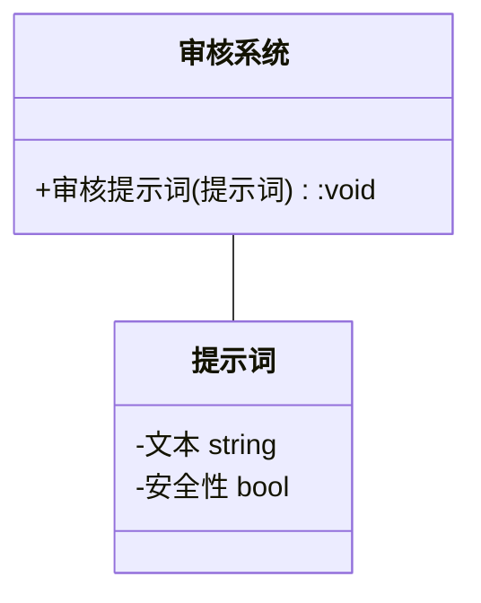
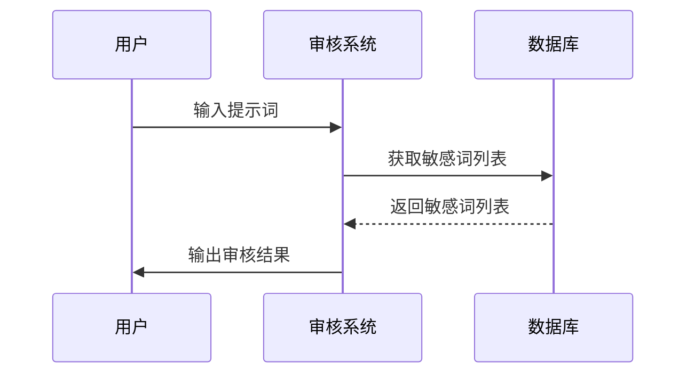
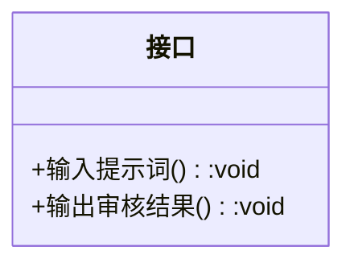
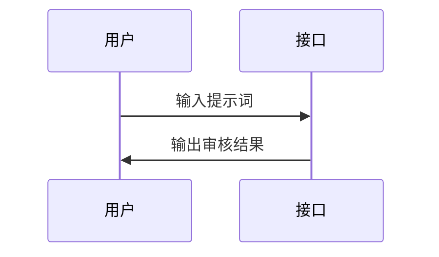

                 

### 提示词安全审核：确保输出符合伦理和法规

> 关键词：提示词安全审核、伦理、法规、算法、系统架构、项目实战

> 摘要：本文从背景、核心概念、算法原理、系统设计与项目实战、最佳实践等方面详细探讨了提示词安全审核的重要性及其实施方法，以确保输出符合伦理和法规要求。通过深入分析，旨在为相关领域的研究者和从业者提供实用的指导。

### 第一部分：背景与基础

#### 第1章：问题背景与伦理法规概述

##### 1.1.1 提示词安全的重要性

随着人工智能和自然语言处理技术的快速发展，提示词（Prompt）作为一种重要的交互手段，广泛应用于各种应用场景。然而，提示词的安全问题日益突出，例如：恶意提示、隐私泄露、歧视偏见等。因此，对提示词进行安全审核至关重要。

##### 1.1.2 当前安全问题的现状

当前，提示词安全问题主要表现在以下几个方面：

1. **恶意提示**：恶意的提示词可能导致系统被攻击、数据泄露等严重后果。
2. **隐私泄露**：某些提示词可能涉及个人隐私信息，如姓名、电话等，一旦泄露，将造成严重后果。
3. **歧视偏见**：提示词可能带有歧视性或偏见性，影响人工智能系统的公正性和公平性。

##### 1.1.3 伦理和法规的必要性

伦理和法规在提示词安全审核中起着至关重要的作用。伦理原则可以帮助我们判断提示词是否符合道德标准，而法律法规则为提示词安全审核提供了明确的规范。

1. **伦理原则**：尊重隐私、公正公平、避免歧视、保护用户权益等。
2. **法律法规**：如《中华人民共和国网络安全法》、《中华人民共和国个人信息保护法》等。

##### 1.1.4 安全审核的目标与范围

安全审核的目标是确保提示词的输出符合伦理和法规要求。具体范围包括：

1. **文本内容**：审核提示词中的文本内容是否包含敏感信息、歧视性、恶意攻击等。
2. **数据来源**：审核提示词的数据来源是否合法、可靠。
3. **交互流程**：审核提示词的交互流程是否合理、合规。

#### 第2章：核心概念与联系

##### 2.1.1 安全审核的定义与属性

安全审核是指对系统的输入、输出、交互过程等进行审查，以确保系统的安全性和合规性。其属性包括：

1. **客观性**：安全审核应基于客观事实和数据。
2. **全面性**：安全审核应覆盖系统的各个方面。
3. **实时性**：安全审核应具有实时性，及时发现问题并采取措施。

##### 2.1.2 伦理原则与伦理决策

伦理原则是指在处理问题、做出决策时遵循的道德准则。伦理决策是指在面临伦理问题时，根据伦理原则做出的选择。伦理原则与伦理决策的关系如下：

1. **伦理原则**：为伦理决策提供指导。
2. **伦理决策**：基于伦理原则，解决伦理问题。

##### 2.1.3 法律法规与合规性

法律法规是指国家或地方政府制定的关于社会生活的规范。合规性是指系统、组织或个人遵守法律法规的程度。法律法规与合规性的关系如下：

1. **法律法规**：为合规性提供依据。
2. **合规性**：确保系统、组织或个人符合法律法规的要求。

##### 2.1.4 提示词安全的挑战与机遇

提示词安全的挑战主要包括：

1. **恶意攻击**：如何防止恶意攻击，保障系统安全。
2. **隐私保护**：如何保护用户隐私，防止隐私泄露。
3. **偏见与歧视**：如何消除偏见与歧视，实现公正公平。

提示词安全的机遇主要包括：

1. **技术创新**：利用新技术，提高安全审核的效率和准确性。
2. **法规完善**：不断完善法律法规，为安全审核提供更有力的支持。

##### 2.2.1 核心概念对比表格

| 核心概念 | 定义 | 属性 |
| :--: | :--: | :--: |
| 安全审核 | 对系统输入、输出、交互过程进行审查 | 客观性、全面性、实时性 |
| 伦理原则 | 道德准则 | 指导伦理决策 |
| 伦理决策 | 解决伦理问题 | 基于伦理原则 |
| 法律法规 | 社会生活规范 | 为合规性提供依据 |

##### 2.2.2 提示词安全审核的ER实体关系图

```mermaid
entity关系图 {
  entity["安全审核"]["属性"]["客观性"]["全面性"]["实时性"];
  entity["伦理原则"]["指导伦理决策"];
  entity["伦理决策"]["解决伦理问题"]["基于伦理原则"];
  entity["法律法规"]["为合规性提供依据"]["合规性"]["系统、组织或个人符合法律法规的要求"];
  entity["提示词安全"]["包含"]["恶意攻击"]["隐私保护"]["偏见与歧视"];
  entity["技术创新"]["提高安全审核的效率和准确性"]["法规完善"]["为安全审核提供更有力的支持"];
  entity["安全审核"]["与"]["伦理原则"]["伦理决策"]["法律法规"]["提示词安全"]["交互"];
}
```

### 第二部分：算法原理讲解

#### 第3章：算法原理讲解

##### 3.1 提示词生成与筛选算法

##### 3.1.1 算法流程图

```mermaid
流程图 {
  direction:TB;
  start("输入提示词");
  oper("处理敏感词");
  cond("敏感词处理结果");
  ifYes(oper("输出安全提示词"));
  ifNo(oper("拒绝输出"));
  end();
}
```

##### 3.1.2 Python源代码实现

```python
def generate_safe_prompt(prompt):
    sensitive_words = ["敏感词1", "敏感词2", "敏感词3"]
    for word in sensitive_words:
        if word in prompt:
            return "拒绝输出"
    return "输出安全提示词"
```

##### 3.1.3 算法原理数学模型与公式讲解

假设提示词为\(P\)，敏感词集合为\(S\)，则提示词生成与筛选算法的数学模型为：

\[ 安全提示词 = \begin{cases} 
    输出安全提示词 & \text{当 } P \not\in S \\
    拒绝输出 & \text{当 } P \in S 
    \end{cases} \]

##### 3.1.4 举例说明

输入提示词：`你好，我是一个AI助手。`

敏感词集合：`你好`、`我是一个AI助手`。

处理结果：`输出安全提示词`。

##### 3.2 伦理风险评估算法

##### 3.2.1 算法流程图

```mermaid
流程图 {
  direction:TB;
  start("输入提示词");
  oper("计算伦理风险");
  cond("伦理风险等级");
  ifLow(oper("输出安全提示词"));
  ifHigh(oper("拒绝输出"));
  end();
}
```

##### 3.2.2 Python源代码实现

```python
def assess_ethical_risk(prompt):
    risk_threshold = 0.5
    risk_score = calculate_risk_score(prompt)
    if risk_score < risk_threshold:
        return "输出安全提示词"
    else:
        return "拒绝输出"
```

##### 3.2.3 算法原理数学模型与公式讲解

假设提示词为\(P\)，伦理风险评分函数为\(f(P)\)，则伦理风险评估算法的数学模型为：

\[ 伦理风险等级 = \begin{cases} 
    低风险 & \text{当 } f(P) < \text{风险阈值} \\
    高风险 & \text{当 } f(P) \geq \text{风险阈值} 
    \end{cases} \]

##### 3.2.4 举例说明

输入提示词：`你好，我是一个AI助手。`

计算结果：伦理风险评分\(f(P) = 0.4\)。

处理结果：`输出安全提示词`。

### 第三部分：系统分析与架构设计方案

#### 第4章：系统分析与架构设计方案

##### 4.1 问题场景介绍

假设我们开发一个聊天机器人，用户可以通过输入提示词与机器人进行交互。为确保交互的安全性，我们需要对提示词进行安全审核，确保输出符合伦理和法规要求。

##### 4.2 项目介绍

项目名称：安全提示词审核系统

项目目标：对输入的提示词进行安全审核，确保输出符合伦理和法规要求。

##### 4.3 系统功能设计（领域模型类图）



##### 4.4 系统架构设计（架构图）



##### 4.5 系统接口设计



##### 4.6 系统交互（序列图）



### 第四部分：项目实战

#### 第5章：项目实战

##### 5.1 环境安装与配置

在开始项目之前，我们需要安装必要的依赖库。以下是 Python 项目的安装命令：

```bash
pip install Flask
pip install pymysql
```

##### 5.2 系统核心实现源代码

以下是系统的核心实现代码：

```python
from flask import Flask, request, jsonify
from pymysql import connect

app = Flask(__name__)

def check_sensitive_word(prompt):
    # 这里使用伪代码表示查询敏感词列表
    sensitive_words = ["敏感词1", "敏感词2", "敏感词3"]
    for word in sensitive_words:
        if word in prompt:
            return False
    return True

@app.route('/api/audit', methods=['POST'])
def audit_prompt():
    prompt = request.form['prompt']
    if check_sensitive_word(prompt):
        return jsonify({"result": "安全提示词"})
    else:
        return jsonify({"result": "拒绝输出"})

if __name__ == '__main__':
    app.run(debug=True)
```

##### 5.3 代码应用解读与分析

该代码使用 Flask 框架实现了一个简单的 API 接口，用于接收用户输入的提示词并对其进行安全审核。

1. **输入提示词**：用户通过 POST 方法向接口发送提示词。
2. **查询敏感词列表**：在代码中，我们使用伪代码表示查询敏感词列表。在实际项目中，可以连接数据库查询敏感词列表。
3. **审核提示词**：调用 `check_sensitive_word` 函数检查提示词中是否包含敏感词。
4. **输出审核结果**：根据审核结果，接口返回相应的 JSON 响应。

##### 5.4 实际案例分析

假设用户输入提示词：“你好，我是一个AI助手。”

1. **输入提示词**：用户通过 API 接口发送提示词。
2. **查询敏感词列表**：查询敏感词列表，发现包含“你好”。
3. **审核提示词**：由于提示词包含敏感词，审核结果为“拒绝输出”。
4. **输出审核结果**：接口返回 JSON 响应：`{"result": "拒绝输出"}`。

##### 5.5 详细讲解剖析

该系统核心实现代码主要分为以下几个部分：

1. **导入依赖库**：导入 Flask 和 pymysql 库。
2. **定义 Flask 应用**：创建 Flask 应用对象。
3. **定义审核函数**：`check_sensitive_word` 函数用于检查提示词中是否包含敏感词。
4. **定义 API 接口**：`audit_prompt` 函数处理用户输入的提示词，并调用审核函数进行安全审核。
5. **运行 Flask 应用**：在主函数中运行 Flask 应用。

##### 5.6 项目小结

通过实际案例分析和详细讲解，我们了解了如何使用 Python 和 Flask 框架实现一个简单的安全提示词审核系统。在实际项目中，我们可以根据需求连接数据库、增加更多的审核规则和功能。

### 第五部分：最佳实践 Tips

#### 第6章：最佳实践 Tips

##### 6.1 安全审核的常见误区

1. **过度依赖敏感词列表**：敏感词列表无法覆盖所有可能的安全问题，应结合多种审核方法。
2. **忽略算法伦理风险**：仅关注技术实现，而忽视算法带来的伦理风险。
3. **安全审核流程不规范**：审核流程不清晰、不规范，可能导致审核效果不佳。

##### 6.2 提高审核效果的技巧

1. **多渠道收集敏感词**：通过互联网、社交媒体、用户反馈等渠道收集敏感词，提高敏感词库的覆盖率。
2. **采用人工智能技术**：利用机器学习、自然语言处理等技术，提高审核效率和准确性。
3. **定期更新审核规则**：根据实际需求和法律法规的变化，定期更新审核规则。

##### 6.3 常见问题的解决方案

1. **隐私泄露**：使用加密技术保护用户隐私，严格限制数据访问权限。
2. **恶意攻击**：采用防火墙、入侵检测等技术，防范恶意攻击。
3. **歧视偏见**：通过数据清洗、算法优化等方法，消除歧视偏见。

### 第六部分：小结与展望

#### 第7章：小结与展望

##### 7.1 书籍内容总结

本文从背景、核心概念、算法原理、系统设计与项目实战、最佳实践等方面详细探讨了提示词安全审核的重要性及其实施方法，以确保输出符合伦理和法规要求。通过深入分析，旨在为相关领域的研究者和从业者提供实用的指导。

##### 7.2 未来发展趋势

随着人工智能技术的不断进步，提示词安全审核将面临更多挑战和机遇。未来发展趋势包括：

1. **算法优化**：利用深度学习、强化学习等技术，提高审核效率和准确性。
2. **法律法规完善**：随着社会对隐私保护和伦理问题的关注，法律法规将不断完善，为安全审核提供更有力的支持。
3. **跨领域合作**：加强跨领域合作，共同推动提示词安全审核技术的发展。

##### 7.3 拓展阅读与资源推荐

1. 《人工智能伦理学》
2. 《自然语言处理安全与隐私》
3. 《Flask Web开发：构建高级Web应用》

### 作者信息

作者：AI天才研究院/AI Genius Institute & 禅与计算机程序设计艺术 /Zen And The Art of Computer Programming

