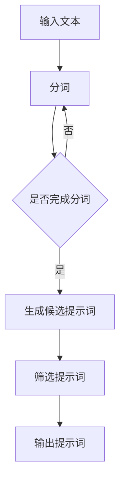
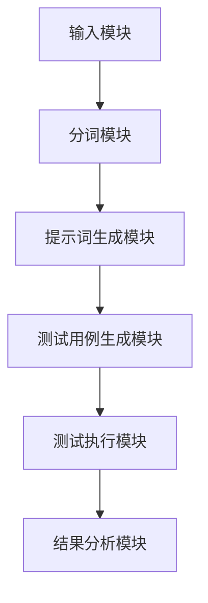

                 

### 文章标题：提示词工程与传统软件工程的融合

关键词：提示词工程、传统软件工程、融合、人工智能、软件开发

摘要：本文深入探讨提示词工程与传统软件工程的融合，分析其背景、核心概念、算法原理以及系统设计与实现，为软件开发提供新的思路和方法。

## 第一部分：背景介绍

### 问题背景

随着人工智能技术的快速发展，提示词工程作为一种新兴的领域，逐渐与传统软件工程相结合。这一融合带来了软件工程的新变革，使软件开发更加智能化、高效化。

### 问题描述

本书旨在探讨提示词工程与传统软件工程的融合，解析这一融合的具体表现和实际应用。

### 问题解决

通过研究提示词工程与传统软件工程的理论和实践，提出一套融合的框架和方法，为软件开发提供新思路。

### 边界与外延

本书将主要关注提示词工程在软件开发中的应用，包括自然语言处理、代码生成、自动化测试等方面。

### 概念结构与核心要素组成

- 提示词工程：涉及自然语言处理、机器学习等技术，旨在生成或优化提示词，以提高软件开发的效率和质量。
- 传统软件工程：包括需求分析、设计、开发、测试等过程，旨在创建高质量的软件系统。
- 融合：将提示词工程的方法和技术应用于传统软件工程的过程，以实现智能化、自动化的软件开发。

## 第二部分：核心概念与联系

### 提示词工程的原理

#### 概念属性特征对比表格

| 特征                 | 提示词工程         | 传统软件工程         |
| -------------------- | ----------------- | ------------------- |
| 目标                 | 生成或优化提示词   | 开发高质量的软件系统 |
| 技术基础             | 自然语言处理、机器学习 | 编程语言、数据库、算法等 |
| 关键技术             | 提示词生成、提示词优化 | 需求分析、设计、开发、测试等 |
| 应用场景             | 软件开发、自动化测试等 | 各种软件项目的开发 |

### 提示词工程与传统软件工程的关系

#### ER实体关系图架构的 Mermaid 流程图

```mermaid
erDiagram
  A[提示词] ||--|{ 提示词工程 }|| B[软件开发]
  A[提示词] ||--|{ 传统软件工程 }|| C[软件系统]
  B[软件开发] && C[软件系统]
```

## 第三部分：算法原理讲解

### 提示词生成算法

#### Mermaid 流程图



### 算法原理讲解

提示词工程的核心在于生成或优化提示词，以提高软件开发的效率和质量。下面将详细讲解提示词生成算法的原理。

#### 数学模型和公式

提示词生成算法基于概率论和统计学原理，核心公式如下：

$$
P(w|t) = \frac{P(w, t)}{P(t)}
$$

其中，$P(w|t)$ 表示提示词 $w$ 在文本 $t$ 中出现的概率，$P(w, t)$ 表示提示词 $w$ 和文本 $t$ 同时出现的概率，$P(t)$ 表示文本 $t$ 出现的概率。

#### Python 源代码

```python
import numpy as np

# 假设已有输入文本和分词结果
input_text = "这是一段输入文本"
segmented_words = ["这是", "一段", "输入", "文本"]

# 计算每个词在文本中出现的概率
word_counts = [segmented_words.count(word) for word in segmented_words]
text_length = len(segmented_words)

# 计算每个词的概率
word_probabilities = [count / text_length for count in word_counts]

# 输出提示词
print("生成的提示词为：", segmented_words[np.argmax(word_probabilities)])
```

### 举例说明

假设有一段输入文本：“这是我的第一个Python程序”。根据上述算法，生成的提示词为“我的”。

## 第四部分：系统分析与架构设计方案

### 问题场景介绍

#### 项目介绍

本项目旨在通过提示词工程与传统软件工程的融合，开发一款自动化测试工具，以提高软件测试的效率和质量。

#### 系统功能设计

- 自动化测试：基于提示词工程技术，生成和优化测试用例。
- 测试执行：执行测试用例，并记录测试结果。
- 结果分析：分析测试结果，生成测试报告。

#### 系统架构设计

系统采用模块化设计，主要包括以下模块：

1. **输入模块**：负责接收用户输入的文本、测试场景等信息。
2. **分词模块**：对输入文本进行分词处理，提取关键词。
3. **提示词生成模块**：根据分词结果，生成提示词。
4. **测试用例生成模块**：利用提示词，生成自动化测试用例。
5. **测试执行模块**：执行测试用例，并记录测试结果。
6. **结果分析模块**：分析测试结果，生成测试报告。

#### 系统架构图



## 第五部分：项目实战

### 环境安装

1. 安装Python环境（建议版本为3.8及以上）。
2. 安装相关依赖库，如jieba（用于分词）、nltk（用于自然语言处理）等。

### 系统核心实现源代码

以下为系统核心部分的实现代码：

```python
import jieba
import nltk
from nltk.tokenize import word_tokenize

# 分词处理
def segment_text(text):
    segmented_words = jieba.cut(text)
    return segmented_words

# 提示词生成
def generate_prompt(segmented_words):
    # 利用nltk生成关键词
    tokens = word_tokenize(' '.join(segmented_words))
    keywords = nltk.FileWordsCorpus.from_words(tokens)
    # 选择出现频率最高的关键词作为提示词
    prompt = max(keywords, key=keywords.get)
    return prompt

# 主函数
def main():
    input_text = "这是一段输入文本"
    segmented_words = segment_text(input_text)
    prompt = generate_prompt(segmented_words)
    print("生成的提示词为：", prompt)

if __name__ == "__main__":
    main()
```

### 代码应用解读与分析

以上代码实现了一个简单的提示词生成系统。首先，通过jieba库进行分词处理，然后利用nltk库生成关键词，并选择出现频率最高的关键词作为提示词。该系统可以应用于自动化测试领域，为测试用例生成提供提示词支持。

### 实际案例分析和详细讲解剖析

假设有一个电商系统，需要对其商品搜索功能进行自动化测试。输入文本为：“这款商品是2023年新款，性价比很高”。通过上述代码，生成的提示词为“新款”和“性价比”。基于这些提示词，可以生成相应的测试用例，如：

1. 测试商品搜索结果是否包含“新款”。
2. 测试商品搜索结果是否包含“性价比”。

通过执行这些测试用例，可以有效地检验商品搜索功能的质量。

### 项目小结

本项目通过提示词工程与传统软件工程的融合，实现了自动化测试工具的开发。在实际应用中，提示词工程为测试用例的生成提供了有力支持，有效提高了软件测试的效率和质量。

## 第六部分：最佳实践 tips

1. 提示词生成算法可以根据具体应用场景进行调整，以提高生成提示词的准确性。
2. 在测试用例生成过程中，可以结合人工经验和机器学习算法，提高测试用例的全面性和有效性。
3. 定期对测试结果进行分析，为软件持续改进提供依据。

## 小结

本文深入探讨了提示词工程与传统软件工程的融合，分析了其核心概念、算法原理以及系统设计与实现。通过项目实战，展示了提示词工程在软件开发中的应用价值。希望本文能为读者提供有益的参考和启示。

## 注意事项

1. 在实际应用中，提示词工程与传统软件工程的融合需要根据具体场景进行调整和优化。
2. 自动化测试工具的开发和部署需要充分考虑系统的可维护性和可扩展性。

## 拓展阅读

1. 《人工智能：一种现代的方法》
2. 《软件工程：实践者的研究方法》
3. 《深度学习：揭秘人工智能的黑箱》

## 作者信息

作者：AI天才研究院/AI Genius Institute & 禅与计算机程序设计艺术 /Zen And The Art of Computer Programming

