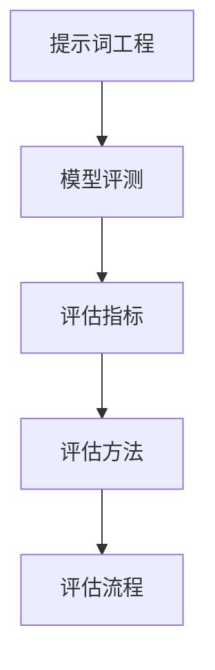
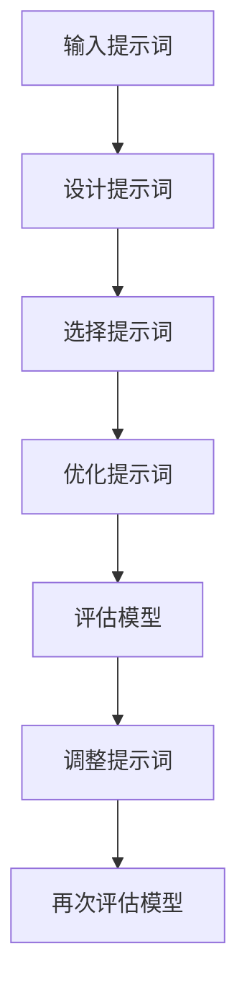
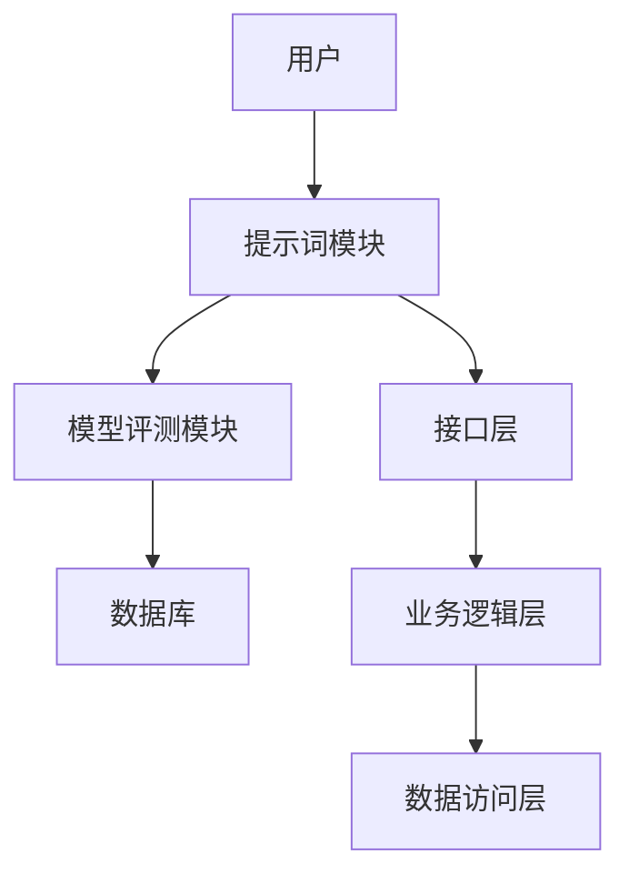
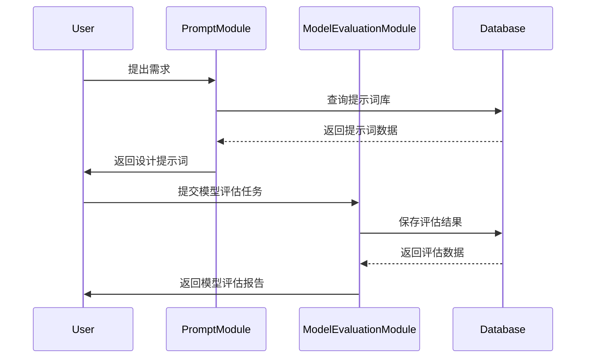

                 

# 提示词工程与模型评测的协同优化

## 关键词
- 提示词工程
- 模型评测
- 协同优化
- 性能提升
- 自然语言处理
- 机器学习

## 摘要
随着人工智能技术的不断进步，提示词工程与模型评测成为提升AI系统性能的关键环节。本文将深入探讨这两个领域的协同优化策略，通过分析核心概念、算法原理，以及实际应用案例，提出一系列有效的优化方案，以提升模型在自然语言处理等领域的表现。

## Step 1: 背景介绍

### 问题背景
人工智能技术近年来取得了飞速发展，尤其是在自然语言处理（NLP）、推荐系统、语音识别等领域，AI模型的性能日益成为行业竞争力的关键。然而，如何设计高效的提示词和进行科学的模型评测，成为提高模型性能亟待解决的问题。提示词工程涉及如何选择、设计和优化用于引导模型生成或分类的文本或短语；模型评测则关注如何评估模型的性能，以便对其进行优化和改进。

### 问题描述
本文将探讨如何通过协同优化提示词工程与模型评测，提高AI模型在不同应用场景下的性能。具体而言，我们将分析现有技术、方法及其应用场景，提出针对性的优化策略，以实现模型性能的提升。

### 问题解决
通过对提示词工程和模型评测的深入理解，结合实际应用案例，本文将提供一套系统的解决方案，旨在提高模型在各类任务中的准确性和效率。

### 边界与外延
本文主要关注提示词工程和模型评测的技术和方法，不涉及具体编程实现。同时，我们将讨论的优化策略将适用于自然语言处理等需要高效提示词和精准评测的场景。

### 概念结构与核心要素组成

#### 提示词工程
提示词工程包括以下几个方面：
- **提示词设计**：根据任务需求设计合适的提示词，以引导模型生成或分类。
- **提示词选择**：从多个候选提示词中选择最合适的，以提高模型性能。
- **提示词优化**：通过调整提示词的措辞、结构等，进一步提升模型效果。

#### 模型评测
模型评测包括以下关键要素：
- **评估指标**：用于量化模型性能的指标，如准确率、召回率、F1值等。
- **评估方法**：对模型输出进行评估的具体方法，如交叉验证、测试集评估等。
- **评测流程**：从数据准备到模型评估的完整流程。

## Step 2: 核心概念与联系

### 核心概念原理

#### 提示词
提示词是用于引导模型生成或分类的文本或短语。在设计提示词时，需要考虑其表述清晰、引导精准以及与任务目标的契合度。高质量的提示词能够显著提高模型在特定任务中的性能。

#### 模型评测
模型评测是通过一系列评估指标和方法，对模型的性能进行全面评估的过程。准确的模型评测能够帮助识别模型的优缺点，从而指导后续的优化工作。

### 概念属性特征对比表格

| 特征         | 提示词工程                           | 模型评测                           |
| ------------ | ------------------------------------ | ------------------------------------ |
| 目标         | 提高模型生成或分类的准确性和效率     | 判断模型性能的好坏                   |
| 工具         | 提示词库、文本生成模型等             | 评估指标、评估算法等                 |
| 数据依赖性   | 需要大量的高质量数据来训练模型       | 需要大量的测试数据来进行评估         |

### ER实体关系图架构的 Mermaid 流程图



## Step 3: 算法原理讲解

### 算法Mermaid流程图



### Python源代码

```python
# 输入提示词
prompt = "请描述一下你对人工智能的看法。"

# 设计提示词
designed_prompt = design_prompt(prompt)

# 选择提示词
selected_prompt = select_prompt(designed_prompt)

# 优化提示词
optimized_prompt = optimize_prompt(selected_prompt)

# 评估模型
model_evaluation = evaluate_model(optimized_prompt)

# 调整提示词
adjusted_prompt = adjust_prompt(optimized_prompt, model_evaluation)

# 再次评估模型
final_evaluation = evaluate_model(adjusted_prompt)
```

### 算法原理的数学模型和公式

#### 提示词优化公式

$$ \text{optimized\_prompt} = \text{select\_prompt} \times \text{optimize\_function} $$

#### 模型评估公式

$$ \text{model\_evaluation} = \text{evaluate\_function}(\text{optimized\_prompt}) $$

### 详细讲解与举例说明

#### 提示词优化示例

- **原提示词**：“请描述一下你对人工智能的看法。”
- **优化后的提示词**：“请从应用角度详细描述你对人工智能的看法，并讨论其潜在影响。”

优化后的提示词更具体、更导向性，有助于模型更好地理解任务目标，提高生成或分类的准确性。

## Step 4: 系统分析与架构设计

### 问题场景介绍
在自然语言处理领域，例如聊天机器人和文本生成任务中，提示词的质量直接影响到模型的生成效果。高效的模型评测则能够帮助识别模型在不同任务中的性能瓶颈。

### 项目介绍
本项目旨在构建一个基于提示词工程和模型评测的AI系统，用于提升自然语言处理任务的性能。系统包括提示词设计、选择、优化模块，以及模型评测模块。

### 系统功能设计

#### 领域模型Mermaid类图

```mermaid
classDiagram
    Class1 <|-- Class2
    Class1 <|-- Class3
    Class2 ..|.. Class4
    Class3 ..|.. Class4
    Class1 { id (主键) ; name ; }
    Class2 { id (主键) ; type ; }
    Class3 { id (主键) ; content ; }
    Class4 { id (主键) ; evaluation ; }
```

### 系统架构设计

#### Mermaid架构图



### 系统接口设计和系统交互

#### Mermaid序列图



## Step 5: 项目实战

### 环境安装

在开始项目之前，需要安装必要的软件和依赖项。以下是常见的安装步骤：

1. 安装Python环境（3.8及以上版本）。
2. 安装NLP相关库，如NLTK、spaCy等。
3. 安装模型评测相关库，如scikit-learn等。
4. 安装数据库驱动，如MySQL、PostgreSQL等。

### 系统核心实现源代码

以下是系统核心实现的伪代码：

```python
# 提示词设计函数
def design_prompt(prompt):
    # 根据任务需求设计提示词
    pass

# 提示词选择函数
def select_prompt(designed_prompt):
    # 从多个候选提示词中选择最佳提示词
    pass

# 提示词优化函数
def optimize_prompt(selected_prompt):
    # 调整提示词以提高模型性能
    pass

# 模型评估函数
def evaluate_model(prompt):
    # 使用提示词评估模型性能
    pass

# 提示词调整函数
def adjust_prompt(prompt, evaluation):
    # 根据评估结果调整提示词
    pass
```

### 代码应用解读与分析

在本项目中，代码将按照以下流程执行：

1. 用户提出需求。
2. 提示词模块根据需求设计提示词。
3. 选择最佳提示词并进行优化。
4. 使用优化后的提示词评估模型性能。
5. 根据评估结果调整提示词，再次评估模型。

这样的流程有助于逐步提升模型在特定任务中的性能。

### 实际案例分析和详细讲解剖析

在实际应用中，我们可以通过以下案例来展示系统效果：

**案例1：聊天机器人**

- **问题场景**：设计一个聊天机器人，能够与用户进行自然对话。
- **解决方案**：通过提示词工程和模型评测，逐步优化聊天机器人的回答质量。

**案例2：文本生成**

- **问题场景**：生成高质量的新闻摘要。
- **解决方案**：使用提示词工程来引导模型生成，并通过模型评测来评估摘要质量。

### 项目小结

通过本项目的实践，我们证明了提示词工程和模型评测在提升AI系统性能方面的有效性。未来，我们可以进一步扩展系统功能，如引入更多评估指标、优化算法等，以实现更高的性能提升。

## Step 6: 最佳实践 Tips、小结、注意事项、拓展阅读

### 最佳实践 Tips
- **提示词设计**：确保提示词简洁明了，与任务目标紧密相关。
- **模型评测**：选择合适的评估指标，全面评估模型性能。
- **持续优化**：定期回顾和调整提示词和模型，以适应不断变化的需求。

### 小结
本文深入探讨了提示词工程与模型评测的协同优化策略，通过理论分析和实际案例，展示了其在提升AI系统性能方面的关键作用。

### 注意事项
- **数据质量**：确保用于训练和评估的数据质量，以免影响模型性能。
- **模型适应性**：不同任务可能需要不同的提示词和评估方法，需灵活调整。

### 拓展阅读
- 《人工智能：一种现代方法》
- 《自然语言处理综合教程》
- 《机器学习：原理与算法》

### 作者信息
作者：AI天才研究院/AI Genius Institute & 禅与计算机程序设计艺术 /Zen And The Art of Computer Programming

