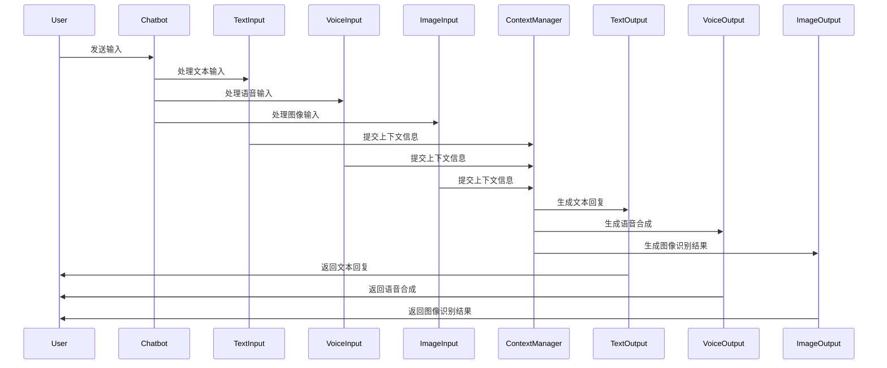
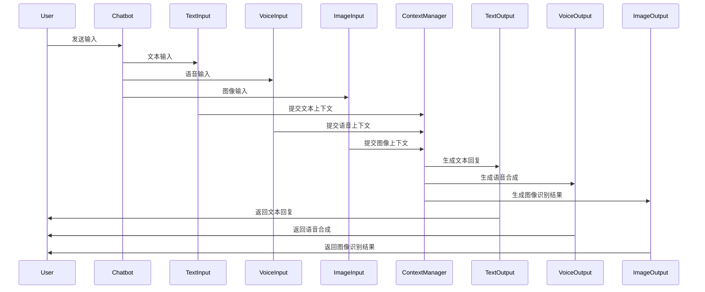

                 

### 第1章: 问题背景

## 1.1.1 提示词工程概述

### 1.1.1.1 提示词的定义与作用
提示词（Suggestive Keywords）是一种引导用户输入的方式，其主要目的是通过预先提供相关的词汇或短语，帮助用户更快速、准确地完成输入任务。在用户界面设计、自然语言处理和搜索引擎优化等领域，提示词扮演着至关重要的角色。

- **定义**：提示词是指根据用户的输入历史、行为习惯、搜索意图等信息，动态生成的相关词汇或短语。
- **作用**：提示词可以提升用户交互效率，减少用户认知负担，增强用户体验。

### 1.1.1.2 提示词工程的核心目标
提示词工程旨在通过系统化的方法来提高提示词的生成、管理、优化和评估效率，其核心目标包括：

- **提高用户输入的准确性、完整性和速度**：通过智能化的提示词生成策略，减少用户输入的错误率和时间成本。
- **降低用户的认知负担**：提供具有高度相关性的提示词，帮助用户更快地找到所需信息，提升整体操作体验。
- **支持各种应用场景**：从搜索、聊天、语音识别到更多复杂的应用领域，提示词工程需要灵活适应不同场景的需求。

### 1.1.1.3 提示词工程的发展历程
提示词工程的发展历程大致可以分为以下几个阶段：

- **早期阶段**：基于规则和模板的提示词生成。这一阶段主要依赖于预设的规则和模板，通过简单的关键词匹配来生成提示词。
- **中期阶段**：结合自然语言处理技术的自适应提示词系统。在这一阶段，自然语言处理技术开始被引入，使得提示词生成更加智能化和自适应。
- **现阶段**：基于深度学习的上下文感知提示词工程。随着深度学习技术的发展，基于上下文感知的提示词生成方法逐渐成为主流。

### 1.1.1.4 提示词工程在应用场景中的现状
提示词工程在各种应用场景中发挥着重要作用，以下是一些典型应用场景及其现状：

- **搜索应用**：在搜索引擎中，提示词可以帮助用户快速定位搜索目标，提高搜索效率。
- **聊天应用**：在聊天机器人或客服系统中，提示词能够提升对话的自然性和流畅性，帮助用户更轻松地表达意图。
- **语音识别应用**：在语音输入系统中，提示词可以优化输入体验，降低错误率，提高语音识别的准确性。

### 1.1.2 上下文管理的核心概念

上下文管理是提示词工程中的一个关键组成部分，其核心概念包括：

- **上下文感知**：指系统根据用户的当前情境、历史行为等信息，动态调整提示词的生成策略。
- **上下文关联**：指将用户的输入与上下文信息进行关联，从而生成具有高度相关性的提示词。
- **上下文维护**：指系统在长时间运行过程中，如何有效地维护上下文信息，保证提示词的准确性和有效性。

## 1.1.3 提示词工程中的上下文管理重要性

上下文管理在提示词工程中具有至关重要的地位，原因如下：

- **提高提示词的准确性**：通过上下文管理，系统能够更好地理解用户的意图，从而生成更准确的提示词。
- **增强用户体验**：上下文感知的提示词能够降低用户的认知负担，提升操作体验。
- **适应多样化应用场景**：不同的应用场景需要不同的上下文信息，上下文管理使得提示词工程能够灵活适应各种场景。

在接下来的章节中，我们将深入探讨上下文管理的核心概念、理论基础以及在实际应用中的技术实现。

## 1.1.4 提示词工程的发展历程

提示词工程的发展历程可以追溯到早期的人工智能应用阶段。起初，提示词的生成主要依赖于预设的规则和模板，这种方式虽然简单有效，但缺乏灵活性和智能性。随着自然语言处理技术的兴起，提示词工程进入了一个新的发展阶段。在这一阶段，研究人员开始利用自然语言处理技术，如词袋模型、主题模型和词嵌入等，来生成更加智能化的提示词。

**早期阶段：基于规则和模板的提示词生成**
在早期的提示词工程中，系统依赖于一系列预设的规则和模板来生成提示词。这些规则和模板通常基于语言学知识和领域专业知识。例如，在一个电子商务网站的搜索框中，系统可能会根据商品分类和用户的历史购买记录来生成相关的提示词。

**中期阶段：结合自然语言处理技术的自适应提示词系统**
随着自然语言处理技术的发展，特别是统计模型和机器学习算法的引入，提示词工程开始变得更加智能化和自适应。在这个阶段，系统可以通过分析用户的输入历史和搜索行为来调整提示词的生成策略。例如，基于贝叶斯网络或决策树模型，系统可以预测用户可能的搜索意图，并生成相应的提示词。

**现阶段：基于深度学习的上下文感知提示词工程**
当前，深度学习技术已经成为提示词工程的核心驱动力。通过使用深度神经网络，如循环神经网络（RNN）和变换器（Transformer）模型，系统能够更好地理解上下文信息，从而生成高度相关的提示词。深度学习模型可以从大量的数据中学习到复杂的模式，这使得提示词工程能够更加准确地捕捉用户的意图。

**不同阶段的特点和影响**
- **早期阶段**：提示词生成主要依赖于专家知识，灵活性较低，但能够处理简单的应用场景。
- **中期阶段**：自然语言处理技术的引入提高了提示词的智能化程度，能够适应更加复杂的应用场景。
- **现阶段**：基于深度学习的上下文感知提示词工程实现了更高的准确性和智能化，能够处理多样化的应用需求。

### 1.1.5 提示词工程在应用场景中的现状

提示词工程在多种应用场景中已经展现出其强大的功能和潜力，下面我们将探讨几个典型应用场景及其现状：

**搜索应用**
在搜索引擎中，提示词功能已经成为了提升用户体验的关键因素之一。例如，当用户在搜索框中输入部分关键词时，搜索引擎会自动提供相关的提示词，帮助用户快速完成搜索请求。这类提示词不仅能够提高搜索效率，还能减少用户输入错误的可能性。许多流行的搜索引擎，如Google和Bing，已经广泛采用了基于深度学习的上下文感知提示词生成技术。

**聊天应用**
在聊天机器人或客服系统中，提示词可以帮助用户更轻松地与系统进行交互。例如，当用户在聊天窗口中输入一个不完整的句子时，系统可以提供相关的提示词，引导用户完成对话。这种上下文感知的提示词生成技术能够显著提高对话的自然性和流畅性，从而提升用户体验。许多知名聊天应用平台，如Slack和Telegram，已经集成了智能提示词功能。

**语音识别应用**
在语音输入系统中，提示词功能同样发挥着重要作用。当用户通过语音输入指令时，系统可能会遇到难以识别的词汇或短语。在这种情况下，提示词可以帮助用户纠正输入错误，提高语音识别的准确性。例如，在智能手机的语音助手（如Siri和Google Assistant）中，提示词功能已经被广泛应用于语音输入和交互。

**其他应用场景**
除了上述几个主要应用场景，提示词工程还广泛应用于许多其他领域，如推荐系统、信息提取和文本生成等。例如，在推荐系统中，提示词可以帮助用户更好地理解推荐内容；在信息提取中，提示词能够提高文本摘要的准确性；在文本生成中，提示词可以引导生成更加相关和自然的文本。

### 总结
提示词工程在不同应用场景中展现出了其独特的价值和潜力。随着深度学习和自然语言处理技术的不断发展，提示词工程将继续改进和优化，为用户提供更加智能化和个性化的交互体验。在接下来的章节中，我们将深入探讨上下文管理的核心概念、理论基础以及在实际应用中的技术实现。

---

## 第2章: 上下文管理的核心概念

### 2.1.1 上下文管理的定义

上下文管理（Context Management）是指在一个系统中，对上下文信息进行有效收集、存储、处理和应用的过程。上下文在这里可以被理解为与特定情境相关的信息集合，它包括时间、地点、用户行为、历史记录等。

**定义**：上下文管理是指通过技术手段，动态地识别、捕捉和利用与用户操作或任务相关的上下文信息，以改善系统的响应性和智能化水平。

**上下文管理的重要性**：

- **提高系统响应速度**：通过上下文管理，系统可以预先获取用户可能的需求，从而快速响应并满足用户请求。
- **提升用户体验**：上下文管理能够提供更个性化的服务，满足用户的个性化需求，从而提升用户满意度。
- **增强系统的自适应能力**：上下文信息可以帮助系统更好地理解用户意图和环境变化，从而进行自适应调整。

### 2.1.2 上下文管理的核心要素

上下文管理的核心要素包括上下文信息的采集、处理、存储和利用。

**1. 上下文信息的采集**
- **传感器和接口**：通过传感器和用户接口（如鼠标、键盘、语音输入等）收集用户行为数据。
- **环境监测**：监测环境变化，如时间、地点、天气等。

**2. 上下文信息的处理**
- **特征提取**：从采集到的上下文信息中提取关键特征，如时间戳、地理位置、用户行为模式等。
- **模式识别**：利用机器学习和自然语言处理技术，对特征进行模式识别，以理解用户的意图和行为。

**3. 上下文信息的存储**
- **数据库**：将处理后的上下文信息存储在数据库中，以便后续查询和使用。
- **缓存**：将常用或高优先级的上下文信息缓存起来，以加快响应速度。

**4. 上下文信息的利用**
- **智能决策**：根据上下文信息，系统可以做出更加智能的决策，如推荐服务、路径规划等。
- **个性化服务**：利用上下文信息提供个性化的用户服务，如个性化推荐、智能客服等。

### 2.1.3 上下文管理的基本原则

为了确保上下文管理的高效性和准确性，需要遵循以下基本原则：

**1. 实时性**：上下文信息的采集和处理需要尽可能快，以保证系统实时响应用户需求。

**2. 准确性**：上下文信息的采集和处理需要保证准确性，避免误判或丢失重要信息。

**3. 一致性**：上下文信息的存储和利用需要保持一致性，以保证系统内部和外部的信息一致。

**4. 可扩展性**：上下文管理需要支持扩展性，能够适应不同应用场景和规模的需求。

### 2.1.4 上下文管理的关键挑战

**1. 上下文信息的多样性**：上下文信息可能来自不同的来源和形式，如文本、图像、语音等，如何有效整合和处理这些多样化的信息是一个挑战。

**2. 数据隐私和安全**：在采集和处理上下文信息时，如何保护用户隐私和数据安全是一个重要问题。

**3. 实时性和性能**：在大量上下文信息的环境下，如何保证系统的实时性和高性能运行是一个挑战。

**4. 可解释性**：上下文管理的过程和结果需要具备可解释性，以便用户理解和信任系统。

### 总结
上下文管理是提升系统智能化和用户体验的关键技术。通过定义、核心要素、基本原则和关键挑战的分析，我们可以更好地理解上下文管理的重要性及其在提示词工程中的应用价值。在接下来的章节中，我们将深入探讨上下文管理的理论基础，包括上下文感知计算、自然语言处理基础、计算机视觉基础以及数据挖掘与机器学习基础。

## 第3章: 上下文管理的理论基础

### 3.1.1 上下文感知计算

上下文感知计算（Context-Aware Computing）是上下文管理的重要理论基础，它涉及到如何通过感知上下文信息来提高系统的智能性和响应能力。

**定义**：上下文感知计算是指利用上下文信息来增强系统的决策能力，使得系统能够根据用户的当前环境和需求进行自适应调整。

**核心概念**：

- **上下文**：上下文是指与用户行为、环境、时间等相关的信息集合。
- **感知**：感知是指系统通过传感器、用户交互等方式收集上下文信息。
- **自适应**：自适应是指系统根据上下文信息进行动态调整，以提供更加个性化的服务。

**上下文感知计算的关键技术**：

- **上下文建模**：将上下文信息进行结构化表示，以便于计算机理解和处理。
- **上下文推理**：利用上下文信息进行推理，以预测用户需求或行为。
- **上下文推理引擎**：上下文推理引擎是负责处理上下文信息、执行推理任务的软件系统。

**上下文感知计算的应用场景**：

- **智能助手**：如智能手机中的语音助手，可以根据用户的位置、时间和历史记录提供个性化的建议。
- **智能家居**：智能家居系统可以根据家庭成员的日常活动和偏好来自动调节家电设备。
- **健康管理**：通过监测用户的生理数据和活动习惯，智能设备可以为用户提供个性化的健康建议。

### 3.1.2 自然语言处理基础

自然语言处理（Natural Language Processing，NLP）是上下文管理中的重要组成部分，它涉及到如何使计算机能够理解和处理自然语言。

**定义**：自然语言处理是指使用计算机技术对自然语言（如英语、中文等）进行理解、处理和生成。

**核心概念**：

- **词法分析**：对文本进行词法分析，将文本拆分成词语或词组。
- **句法分析**：对文本进行句法分析，理解词语之间的关系和句子的结构。
- **语义分析**：对文本进行语义分析，理解文本的含义和意图。
- **情感分析**：对文本的情感倾向进行分析，判断文本的情感表达。

**自然语言处理的关键技术**：

- **分词**：将连续的文本分割成一个个词语。
- **词性标注**：对每个词语进行词性标注，如名词、动词、形容词等。
- **依存句法分析**：分析词语之间的依存关系，如主谓关系、修饰关系等。
- **命名实体识别**：识别文本中的命名实体，如人名、地名、组织名等。

**自然语言处理的应用场景**：

- **搜索引擎**：利用自然语言处理技术，可以实现对用户查询的精准理解和搜索结果的优化。
- **机器翻译**：通过自然语言处理技术，可以实现不同语言之间的自动翻译。
- **情感分析**：在社交媒体分析、市场调研等领域，情感分析可以帮助企业了解用户的情感倾向和反馈。

### 3.1.3 计算机视觉基础

计算机视觉（Computer Vision）是上下文管理中的重要技术手段，它涉及到如何使计算机能够像人类一样理解和解析视觉信息。

**定义**：计算机视觉是指利用计算机和人工智能技术对图像和视频进行分析和处理，以识别和理解其中的视觉内容。

**核心概念**：

- **图像识别**：对图像中的物体、场景、人脸等进行识别。
- **目标检测**：在图像或视频中检测并定位特定目标。
- **图像分类**：将图像划分为不同的类别。
- **图像分割**：将图像分割成不同的区域或对象。

**计算机视觉的关键技术**：

- **特征提取**：从图像中提取具有区分性的特征，如边缘、纹理、颜色等。
- **机器学习**：利用机器学习算法，如卷积神经网络（CNN）等，对图像进行训练和分类。
- **深度学习**：通过深度学习模型，如深度卷积神经网络（Deep CNN）等，对图像进行复杂的分析和理解。

**计算机视觉的应用场景**：

- **自动驾驶**：利用计算机视觉技术，自动驾驶汽车可以识别道路标志、行人和其他车辆。
- **安防监控**：通过计算机视觉技术，可以实现实时监控和异常检测，提高安全性。
- **医疗诊断**：计算机视觉技术在医学影像分析中有着广泛的应用，如病变区域检测、疾病诊断等。

### 3.1.4 数据挖掘与机器学习基础

数据挖掘（Data Mining）和机器学习（Machine Learning）是上下文管理的重要理论基础，它们提供了强大的工具和算法，以从大量数据中提取有价值的信息。

**定义**：

- **数据挖掘**：数据挖掘是指从大量数据中发现有价值的信息、模式和知识的过程。
- **机器学习**：机器学习是指通过算法从数据中学习规律，并利用这些规律进行预测和决策的过程。

**核心概念**：

- **特征工程**：从原始数据中提取出有区分性的特征，以便于模型训练和预测。
- **模型评估**：通过评估指标（如准确率、召回率等）来衡量模型的性能。
- **监督学习**：通过标注数据训练模型，然后利用模型进行预测。
- **无监督学习**：在没有标注数据的情况下，通过算法自动发现数据中的模式。

**数据挖掘与机器学习的关键技术**：

- **聚类分析**：将数据分为若干个聚类，以发现数据中的潜在结构。
- **分类和回归**：通过训练分类和回归模型，对数据进行分类和预测。
- **关联规则学习**：发现数据之间的关联关系，如购物篮分析。
- **深度学习**：通过多层神经网络对数据进行分析和处理，如卷积神经网络（CNN）和变换器（Transformer）等。

**数据挖掘与机器学习的应用场景**：

- **推荐系统**：通过分析用户行为数据，为用户推荐感兴趣的商品或内容。
- **市场分析**：通过数据挖掘技术，分析市场趋势和消费者行为。
- **金融风控**：通过机器学习模型，预测风险并采取相应的风控措施。

### 总结
上下文管理是一个复杂但极其重要的领域，它涉及到多个学科的理论和实践。通过理解上下文感知计算、自然语言处理、计算机视觉以及数据挖掘与机器学习的基础知识，我们可以更好地设计和实现高效的上下文管理系统。在下一章中，我们将探讨上下文管理在自然语言处理中的具体技术实现，包括词汇上下文管理、句法上下文管理和语义上下文管理。

## 第4章: 自然语言处理中的上下文管理

自然语言处理（Natural Language Processing，NLP）是上下文管理中的重要分支，它致力于使计算机能够理解和处理人类语言。在本章中，我们将深入探讨NLP中的上下文管理技术，包括词汇上下文管理、句法上下文管理和语义上下文管理。

### 4.1.1 词汇上下文管理

词汇上下文管理主要关注的是单词在特定语境中的使用和含义。词汇上下文管理的方法主要包括词袋模型、主题模型和词嵌入。

#### 4.1.1.1 词袋模型

词袋模型（Bag-of-Words，BOW）是一种简单的文本表示方法，它将文本转换为单词的集合，不考虑单词的顺序和语法结构。

**定义**：词袋模型将文本视为一个单词的集合，其中每个单词代表一个特征。

**优势**：
- **简单有效**：词袋模型易于实现，计算复杂度低。
- **灵活性高**：可以适用于不同长度的文本。

**劣势**：
- **忽略了词汇的顺序和语法结构**：词袋模型无法捕捉到词汇之间的依赖关系。

**应用场景**：词袋模型常用于文本分类和情感分析。

#### 4.1.1.2 主题模型

主题模型（Topic Model）是一种概率模型，用于发现文本中的潜在主题。最常见的主题模型是隐含狄利克雷分配（Latent Dirichlet Allocation，LDA）。

**定义**：LDA模型假设文本是由一系列潜在主题的混合产生的，每个单词代表一个主题。

**优势**：
- **发现潜在主题**：LDA能够从大量文本中提取出潜在的主题结构。
- **语义理解**：通过主题模型，可以更好地理解文本的语义内容。

**劣势**：
- **计算复杂度高**：LDA模型在处理大规模数据时计算复杂度较高。
- **主题数量难以确定**：确定合适的主题数量是一个挑战。

**应用场景**：主题模型在文本挖掘、信息检索和推荐系统中有广泛应用。

#### 4.1.1.3 词嵌入

词嵌入（Word Embedding）是一种将单词映射到高维向量空间的方法，使相邻的单词在向量空间中更接近。

**定义**：词嵌入将单词表示为固定长度的向量，这些向量可以在高维空间中捕捉单词之间的语义关系。

**优势**：
- **语义理解**：词嵌入能够捕捉到单词的语义关系，如词义相近的单词在向量空间中距离较近。
- **计算高效**：词嵌入使得文本处理和计算更加高效。

**劣势**：
- **维度灾难**：高维向量空间可能导致信息丢失。
- **训练复杂**：大规模词嵌入模型的训练过程需要大量计算资源和时间。

**应用场景**：词嵌入广泛应用于文本分类、机器翻译、问答系统等。

### 4.1.2 句法上下文管理

句法上下文管理关注的是句子中单词之间的关系和结构。句法上下文管理的技术主要包括依存句法分析和语法树表示。

#### 4.1.2.1 依存句法分析

依存句法分析（Dependency Parsing）是一种分析句子结构的方法，它通过识别单词之间的依存关系来构建句子的句法结构。

**定义**：依存句法分析识别句子中每个单词与其他单词之间的依存关系，如主谓关系、修饰关系等。

**优势**：
- **语义理解**：依存句法分析能够提供更深入的语义信息。
- **语言处理**：基于依存关系的模型可以更好地理解和生成自然语言。

**劣势**：
- **复杂性**：依存句法分析需要处理大量的语法规则和关系。

**应用场景**：依存句法分析在机器翻译、问答系统、文本生成等领域有广泛应用。

#### 4.1.2.2 语法树表示

语法树表示（Syntax Tree Representation）是一种将句子表示为树形结构的方法，每个节点代表一个单词或短语，边代表它们之间的关系。

**定义**：语法树表示通过构建句子的语法树来表示句子的结构。

**优势**：
- **结构化表示**：语法树能够直观地表示句子的结构。
- **语义分析**：语法树有助于进行更深入的语义分析。

**劣势**：
- **复杂度**：构建语法树需要大量的计算资源和时间。

**应用场景**：语法树表示在文本分析、自然语言生成和机器翻译中具有重要应用。

### 4.1.3 语义上下文管理

语义上下文管理关注的是文本的整体语义内容。它包括分布式语义表示和共指消解等技术。

#### 4.1.3.1 分布式语义表示

分布式语义表示（Distribution Semantics）是一种通过向量空间中的向量来表示单词和短语的方法。

**定义**：分布式语义表示通过将单词和短语映射到高维向量空间，使语义相似的单词在向量空间中距离较近。

**优势**：
- **语义理解**：分布式语义表示能够捕捉到单词和短语之间的语义关系。
- **计算高效**：分布式语义表示使得文本处理和计算更加高效。

**劣势**：
- **维度灾难**：高维向量空间可能导致信息丢失。

**应用场景**：分布式语义表示在文本分类、信息检索和推荐系统中有广泛应用。

#### 4.1.3.2 共指消解

共指消解（Coreference Resolution）是一种识别文本中指代关系的方法，它通过识别共指实体来消除文本中的指代模糊。

**定义**：共指消解识别文本中具有相同指代关系的实体。

**优势**：
- **语义理解**：共指消解能够提高文本的语义理解准确性。
- **信息提取**：共指消解有助于提取文本中的关键信息。

**劣势**：
- **复杂性**：共指消解需要处理大量的语义和上下文信息。

**应用场景**：共指消解在问答系统、信息提取和机器翻译中具有重要应用。

### 总结
自然语言处理中的上下文管理技术对于文本理解、信息提取和智能交互具有重要意义。通过词汇上下文管理、句法上下文管理和语义上下文管理，我们可以构建出更加智能化和自适应的自然语言处理系统。在下一章中，我们将探讨上下文管理在计算机视觉中的应用，包括视觉上下文感知和动态上下文管理。

## 第5章: 计算机视觉中的上下文管理

计算机视觉（Computer Vision）是人工智能领域中重要的分支，它致力于使计算机能够理解、解释和模仿人类对视觉信息的感知和处理能力。上下文管理在计算机视觉中扮演着关键角色，通过有效管理视觉上下文信息，可以提高系统的准确性和鲁棒性。本章将深入探讨计算机视觉中的上下文管理技术，包括视觉上下文感知和动态上下文管理。

### 5.1.1 视觉上下文感知

视觉上下文感知（Visual Context Awareness）是指计算机系统在处理图像或视频时，能够理解并利用周围的上下文信息来改善任务执行效果。

#### 5.1.1.1 视觉注意力机制

视觉注意力机制（Visual Attention Mechanism）是一种通过自动选择视觉输入中最重要的部分进行处理的策略。

**定义**：视觉注意力机制是指计算机系统根据当前任务和上下文信息，自动调整其关注的视觉区域。

**优势**：
- **资源优化**：通过关注关键区域，视觉注意力机制可以显著降低计算复杂度。
- **准确性提升**：注意力机制能够提高目标检测、图像分类等任务的准确性。

**劣势**：
- **计算复杂度**：注意力机制的实现通常涉及复杂的神经网络结构，可能导致计算资源消耗较大。

**应用场景**：视觉注意力机制广泛应用于目标检测、图像分类和图像分割等领域。

#### 5.1.1.2 空间上下文信息提取

空间上下文信息提取（Spatial Context Information Extraction）是指从图像中提取具有空间关系的上下文信息，如物体的位置、大小和形状等。

**定义**：空间上下文信息提取是指通过算法从图像中提取能够描述物体空间关系的特征。

**优势**：
- **场景理解**：通过空间上下文信息，计算机可以更好地理解图像中的场景结构。
- **任务优化**：空间上下文信息有助于优化目标检测、图像分类和图像分割等任务。

**劣势**：
- **精度要求**：空间上下文信息的提取需要高精度的算法和模型，否则可能导致误判。

**应用场景**：空间上下文信息提取广泛应用于自动驾驶、视频监控和智能交互等领域。

### 5.1.2 动态上下文管理

动态上下文管理（Dynamic Context Management）是指系统在处理图像或视频时，能够根据场景变化和任务需求动态调整上下文信息。

#### 5.1.2.1 视频序列建模

视频序列建模（Video Sequence Modeling）是指通过算法对视频序列中的图像进行建模，以捕捉时间和空间信息。

**定义**：视频序列建模是指通过模型对连续的图像帧进行建模，以理解和预测视频内容。

**优势**：
- **时间感知**：视频序列建模能够捕捉视频中的时间信息，如动作、运动轨迹等。
- **场景理解**：通过对视频序列的建模，计算机可以更好地理解视频中的场景和事件。

**劣势**：
- **计算复杂度**：视频序列建模通常涉及大量的计算资源和时间。

**应用场景**：视频序列建模广泛应用于动作识别、视频监控和自动驾驶等领域。

#### 5.1.2.2 时空上下文感知

时空上下文感知（Spatiotemporal Context Awareness）是指系统在处理图像和视频时，能够同时考虑空间和时间的上下文信息。

**定义**：时空上下文感知是指通过算法同时考虑图像的空间特征和时间特征，以提高任务执行的准确性。

**优势**：
- **多模态感知**：时空上下文感知能够同时利用空间和时间的上下文信息，提高系统的感知能力。
- **场景理解**：通过时空上下文感知，计算机可以更全面地理解图像和视频中的场景和事件。

**劣势**：
- **复杂度**：时空上下文感知涉及复杂的算法和计算，可能导致系统性能下降。

**应用场景**：时空上下文感知广泛应用于智能监控、自动驾驶和交互式媒体等领域。

### 总结
视觉上下文感知和动态上下文管理是计算机视觉中重要的上下文管理技术。通过视觉注意力机制和空间上下文信息提取，计算机能够更好地理解和处理图像信息；通过视频序列建模和时空上下文感知，计算机可以更准确地理解和预测动态场景。在下一章中，我们将探讨上下文管理在多模态应用中的技术，包括多模态数据融合和多模态上下文感知。

## 第6章: 多模态上下文管理

多模态上下文管理是指通过整合不同类型的信息（如文本、图像、音频等），以提高系统的感知能力、决策效率和用户体验。在本章中，我们将深入探讨多模态上下文管理的关键技术，包括多模态数据融合和多模态上下文感知。

### 6.1.1 多模态数据融合

多模态数据融合（Multimodal Data Fusion）是指将来自不同传感器的数据（如文本、图像、音频等）进行整合，以生成统一的表示。

#### 6.1.1.1 数据融合方法

数据融合方法主要包括以下几种：

- **特征级融合**：在特征级进行融合，将不同模态的特征向量进行结合。常见的方法有加权融合、融合神经网络等。
- **决策级融合**：在决策级进行融合，将不同模态的预测结果进行结合。常见的方法有投票法、贝叶斯融合等。
- **模型级融合**：在模型级进行融合，将不同模态的模型进行整合。常见的方法有联合训练、多任务学习等。

#### 6.1.1.2 跨模态对应

跨模态对应（Cross-Modal Correspondence）是指在不同模态之间建立对应关系，以实现信息的跨模态传递。

**定义**：跨模态对应是指找到不同模态之间的对应关系，使得一个模态的信息能够影响另一个模态的处理。

**优势**：
- **增强理解**：跨模态对应能够提高系统的整体理解能力，通过不同模态的信息互补，可以更全面地理解任务。
- **提高准确性**：跨模态对应能够提高分类、识别等任务的准确性。

**劣势**：
- **复杂性**：跨模态对应通常涉及复杂的算法和模型，计算复杂度较高。

**应用场景**：跨模态对应广泛应用于图像识别与文本匹配、音频与文本情感分析、视频与文本摘要等领域。

### 6.1.2 多模态上下文感知

多模态上下文感知（Multimodal Context Awareness）是指系统在处理多模态信息时，能够理解和利用上下文信息，以提高任务执行的效果。

#### 6.1.2.1 跨模态上下文感知模型

跨模态上下文感知模型是指通过结合不同模态的信息，建立对上下文的感知能力。

**定义**：跨模态上下文感知模型是指通过整合不同模态的上下文信息，使系统能够更好地理解任务场景。

**优势**：
- **多模态融合**：通过跨模态上下文感知模型，系统能够整合不同模态的信息，提高对上下文的感知能力。
- **情境理解**：跨模态上下文感知模型能够更好地理解复杂情境，提高任务的执行效果。

**劣势**：
- **计算复杂度**：跨模态上下文感知模型的实现通常涉及复杂的计算和模型训练过程。

**应用场景**：跨模态上下文感知模型广泛应用于智能交互、情境理解、多模态问答等领域。

#### 6.1.2.2 多模态交互机制

多模态交互机制是指通过多模态信息之间的交互，实现用户与系统之间的有效沟通。

**定义**：多模态交互机制是指通过不同模态的信息传递和反馈，实现用户与系统之间的交互。

**优势**：
- **灵活互动**：多模态交互机制能够根据用户的需求和反馈，灵活调整交互方式。
- **增强体验**：多模态交互机制能够提高用户的交互体验，提供更加自然和丰富的交互体验。

**劣势**：
- **复杂度**：多模态交互机制的实现通常涉及多个模态的整合和协调，可能增加系统的复杂度。

**应用场景**：多模态交互机制广泛应用于智能音箱、虚拟助手、多模态聊天机器人等领域。

### 总结
多模态上下文管理通过整合不同类型的信息，提高了系统的感知能力和决策效率。多模态数据融合和跨模态对应技术实现了不同模态信息之间的有效整合，而多模态上下文感知模型和交互机制则进一步增强了系统对上下文的感知和理解能力。在下一章中，我们将探讨上下文管理在自然语言处理中的应用，包括文本生成与摘要、情感分析等领域。

## 第7章: 上下文管理在自然语言处理中的应用

自然语言处理（Natural Language Processing，NLP）是人工智能领域的重要组成部分，它致力于使计算机能够理解、生成和处理自然语言。上下文管理在NLP中起着至关重要的作用，它能够提升文本理解、生成和分类的准确性。本章将深入探讨上下文管理在NLP中的应用，包括文本生成与摘要、情感分析等关键技术。

### 7.1.1 文本生成与摘要

文本生成与摘要是NLP中的重要应用，它涉及到如何从原始文本中提取关键信息并生成新的文本内容。

#### 7.1.1.1 文本生成模型

文本生成模型是指通过学习大量文本数据，生成新的文本内容。常见的文本生成模型包括：

- **生成对抗网络（GAN）**：GAN通过生成器和判别器的对抗训练，生成高质量的文本。
- **循环神经网络（RNN）**：RNN通过记忆机制，能够生成连续的文本序列。
- **变换器（Transformer）**：Transformer通过自注意力机制，能够捕捉长距离依赖关系，生成高质量的文本。

**优势**：
- **生成能力强**：文本生成模型能够生成连贯、自然的文本内容。
- **多样性**：文本生成模型可以生成不同风格和主题的文本。

**劣势**：
- **计算复杂度高**：特别是Transformer模型，需要大量的计算资源和时间。
- **可解释性低**：文本生成模型的生成过程较为复杂，难以解释。

**应用场景**：文本生成模型广泛应用于自动写作、机器翻译、问答系统等领域。

#### 7.1.1.2 文本摘要模型

文本摘要模型是指从原始文本中提取关键信息，生成简短、概括性的摘要。常见的文本摘要模型包括：

- **提取式摘要**：提取式摘要直接从文本中提取关键句子，生成摘要。
- **生成式摘要**：生成式摘要通过生成新的文本摘要，实现摘要生成。

**优势**：
- **信息保留**：文本摘要模型能够保留文本的关键信息，实现高效的文本压缩。
- **灵活性强**：文本摘要模型可以根据需求生成不同长度的摘要。

**劣势**：
- **质量不稳定**：文本摘要模型的生成质量受到输入文本和模型训练数据的影响。
- **计算复杂度**：生成式摘要模型的计算复杂度较高。

**应用场景**：文本摘要模型广泛应用于信息检索、新闻报道、文本压缩等领域。

### 7.1.2 情感分析

情感分析（Sentiment Analysis）是指通过分析文本中的情感倾向和情感极性，来判断文本的情感表达。情感分析是上下文管理在NLP中的一个重要应用。

#### 7.1.2.1 情感识别模型

情感识别模型是指通过机器学习算法，对文本进行情感分类。常见的情感识别模型包括：

- **基于规则的方法**：通过预定义的规则，对文本进行情感分类。
- **基于统计的方法**：通过统计模型（如朴素贝叶斯、最大熵等），对文本进行情感分类。
- **基于深度学习的方法**：通过神经网络（如卷积神经网络、循环神经网络等），对文本进行情感分类。

**优势**：
- **准确性**：深度学习方法能够通过学习大量数据，提高情感分类的准确性。
- **鲁棒性**：情感识别模型能够处理不同语境下的情感表达。

**劣势**：
- **计算复杂度**：深度学习模型的训练过程通常需要大量的计算资源。
- **数据依赖性**：情感识别模型对训练数据的质量和数量有较高要求。

**应用场景**：情感分析广泛应用于社交媒体监测、市场调研、客户反馈分析等领域。

#### 7.1.2.2 情感分类方法

情感分类方法是指通过对文本进行情感倾向分析，将文本分类为正面、负面或中性。常见的情感分类方法包括：

- **二元分类**：将文本分类为正面或负面。
- **多类分类**：将文本分类为多个情感类别。
- **情感强度分析**：对文本的情感极性进行量化分析，如情感得分。

**优势**：
- **多样性**：情感分类方法能够满足不同应用场景的需求。
- **实用性**：情感分类方法可以帮助企业了解用户的情感倾向和需求。

**劣势**：
- **复杂性**：多类分类和情感强度分析的方法较为复杂。
- **语义理解难度**：情感分类涉及到对语义的理解，难度较大。

**应用场景**：情感分类方法广泛应用于社交媒体分析、客户服务、市场营销等领域。

### 总结
上下文管理在自然语言处理中的应用，极大地提升了文本生成与摘要、情感分析等任务的准确性和效果。通过文本生成模型和文本摘要模型，我们可以生成高质量的文本内容和简洁的摘要；通过情感识别模型和情感分类方法，我们可以准确判断文本的情感倾向和极性。在下一章中，我们将探讨上下文管理在计算机视觉中的应用，包括图像分类与识别、视频分析等关键技术。

## 第8章: 上下文管理在计算机视觉中的应用

计算机视觉（Computer Vision）是人工智能领域中的一个重要分支，它致力于使计算机能够像人类一样理解和解释视觉信息。上下文管理在计算机视觉中起着至关重要的作用，通过有效管理视觉上下文信息，可以提高图像分类与识别、视频分析等任务的准确性和效率。本章将深入探讨上下文管理在计算机视觉中的应用，包括图像分类与识别、视频分析等关键技术。

### 8.1.1 图像分类与识别

图像分类与识别是计算机视觉中最基础和最重要的任务之一，它涉及到如何将图像或视频中的内容分类到预定义的类别中。

#### 8.1.1.1 卷积神经网络

卷积神经网络（Convolutional Neural Networks，CNN）是图像分类与识别中最常用的深度学习模型。

**定义**：CNN通过卷积层、池化层和全连接层的组合，对图像进行特征提取和分类。

**优势**：
- **强大的特征提取能力**：CNN能够自动提取图像的局部特征，如边缘、纹理等。
- **高准确性**：通过大量的训练数据，CNN能够达到非常高的分类准确性。

**劣势**：
- **计算复杂度**：CNN模型通常需要大量的计算资源和时间进行训练。

**应用场景**：CNN广泛应用于图像分类、物体识别、人脸识别等领域。

#### 8.1.1.2 深度学习模型

除了CNN，深度学习模型如变换器（Transformer）等也在图像分类与识别中发挥着重要作用。

**定义**：变换器通过自注意力机制，对图像进行全局特征提取和分类。

**优势**：
- **捕捉全局特征**：变换器能够捕捉到图像中的全局特征，提高分类性能。
- **适应性**：变换器模型具有较高的适应性，可以应用于不同的图像分类任务。

**劣势**：
- **计算复杂度**：变换器模型的计算复杂度较高，训练过程较为耗时。

**应用场景**：变换器广泛应用于图像分类、图像分割、目标检测等领域。

### 8.1.2 视频分析

视频分析是指对视频序列进行内容理解和分析，以提取有用的信息。上下文管理在视频分析中尤为重要，可以提高视频分类、目标检测和事件检测的准确性。

#### 8.1.2.1 行人检测

行人检测是视频分析中的一个基础任务，旨在从视频中识别并检测行人。

**定义**：行人检测是指通过算法从视频帧中识别并定位行人。

**优势**：
- **实时性**：行人检测可以实时处理视频流，提高检测效率。
- **准确性**：通过深度学习模型，行人检测能够达到较高的准确性。

**劣势**：
- **光照变化**：在光照变化较大的场景下，行人检测的准确性可能会受到影响。

**应用场景**：行人检测广泛应用于智能监控、自动驾驶、运动分析等领域。

#### 8.1.2.2 事件检测

事件检测是指从视频中识别和检测特定的事件或行为。

**定义**：事件检测是指通过算法从视频中识别并检测特定的事件或行为，如交通违规、摔倒检测等。

**优势**：
- **实时性**：事件检测可以实时处理视频流，提高事件检测的效率。
- **多样性**：事件检测可以检测多种不同类型的事件或行为。

**劣势**：
- **复杂性**：事件检测涉及到多种不同类型的事件和场景，算法较为复杂。

**应用场景**：事件检测广泛应用于智能监控、安全监控、运动分析等领域。

### 总结
上下文管理在计算机视觉中的应用，显著提升了图像分类与识别、视频分析等任务的准确性和效率。通过深度学习模型如CNN和变换器，我们可以实现高精度的图像分类与识别；通过行人检测和事件检测等技术，我们可以从视频中提取有用信息。在下一章中，我们将探讨上下文管理在多模态应用中的案例研究，包括多模态聊天机器人和跨媒体推荐系统。

## 第9章: 上下文管理在多模态应用中的案例研究

多模态上下文管理在现实世界的多种应用场景中展现出了其强大的潜力和实用性。在本章中，我们将探讨两个具体的案例研究：多模态聊天机器人和跨媒体推荐系统，分析其背景、技术实现和实际应用。

### 9.1.1 多模态聊天机器人

多模态聊天机器人是一种结合了文本、语音、图像等多种交互方式的智能助手，它能够根据用户的上下文信息提供更加个性化和自然的交互体验。

#### 9.1.1.1 背景介绍

随着人工智能和自然语言处理技术的不断发展，聊天机器人已经成为企业客户服务、在线教育、娱乐等领域的必备工具。然而，传统的文本聊天机器人往往无法满足用户对更丰富、更自然的交互需求。多模态聊天机器人通过整合多种交互方式，如语音、图像、视频等，能够更好地理解用户意图，提供更高效、更人性化的服务。

#### 9.1.1.2 技术实现

多模态聊天机器人的实现涉及以下几个关键技术：

1. **文本处理**：利用自然语言处理技术对用户的文本输入进行理解，提取关键信息。
2. **语音识别**：将用户的语音输入转换为文本，用于后续处理。
3. **语音合成**：将机器生成的文本输出为自然流畅的语音，用于响应用户。
4. **图像识别**：通过计算机视觉技术对用户的图像输入进行分析，提取图像特征。
5. **多模态融合**：将文本、语音、图像等不同模态的信息进行整合，生成统一的上下文表示。
6. **上下文管理**：利用上下文信息，动态调整交互策略，提高交互的连贯性和自然性。

#### 9.1.1.3 应用效果

多模态聊天机器人在实际应用中，展现出了以下优势：

- **增强用户体验**：通过多种交互方式，多模态聊天机器人能够提供更加自然和丰富的交互体验。
- **提高响应速度**：多模态交互使得系统可以更快地理解和响应用户请求。
- **降低误识率**：通过整合多种模态信息，系统可以更准确地理解用户意图，降低误识率。

### 9.1.2 跨媒体推荐系统

跨媒体推荐系统是指能够同时处理多种类型媒体内容（如文本、图像、音频等）的推荐系统，它通过整合不同模态的信息，提供更加个性化、多样化的推荐结果。

#### 9.1.2.1 系统架构

跨媒体推荐系统通常包含以下架构模块：

1. **数据采集与预处理**：从不同来源（如社交媒体、电子商务平台等）采集多模态数据，并进行预处理，提取关键特征。
2. **特征融合**：将不同模态的数据特征进行融合，生成统一的特征向量。
3. **推荐算法**：利用机器学习算法和深度学习模型，根据用户的历史行为和兴趣，生成个性化推荐结果。
4. **上下文管理**：利用上下文信息（如用户行为、时间、地点等），动态调整推荐策略，提高推荐效果。

#### 9.1.2.2 推荐算法

跨媒体推荐系统的推荐算法主要包括以下几种：

1. **基于内容的推荐**：通过分析相似内容，为用户推荐相似的多模态内容。
2. **协同过滤推荐**：利用用户历史行为数据，通过用户之间的相似性进行推荐。
3. **深度学习推荐**：通过深度学习模型，如卷积神经网络（CNN）和变换器（Transformer）等，自动提取多模态特征，进行推荐。

#### 9.1.2.3 应用效果

跨媒体推荐系统在实际应用中，展现出了以下优势：

- **个性化推荐**：通过整合多种模态信息，系统能够提供更加个性化的推荐结果。
- **多样性**：跨媒体推荐系统能够为用户推荐不同类型的多模态内容，提高用户体验。
- **实时性**：通过上下文管理，系统能够实时调整推荐策略，提高推荐效果。

### 总结
多模态聊天机器人和跨媒体推荐系统是上下文管理在多模态应用中的两个成功案例。通过整合多种模态信息，这些系统不仅提高了交互的连贯性和自然性，还能够提供更加个性化、多样化的服务。在未来的发展中，随着多模态技术和上下文管理技术的不断进步，我们可以期待更多的创新应用，进一步推动人工智能技术的发展。

### 第10章: 上下文管理总结与未来展望

#### 10.1.1 上下文管理的现状与挑战

上下文管理在近年来取得了显著进展，已经成为人工智能领域的一个重要研究方向。当前，上下文管理在自然语言处理、计算机视觉、多模态应用等多个领域展现了其独特的价值。然而，仍然存在一些挑战需要克服。

**现状**：
- **技术成熟度**：随着深度学习和自然语言处理技术的发展，上下文管理技术逐渐成熟，能够应用于各种实际场景。
- **应用广泛性**：上下文管理技术已经在搜索引擎、智能助手、视频分析等领域得到广泛应用，提高了系统的智能性和用户体验。

**挑战**：
- **多样性**：上下文信息的多样性带来了复杂性和处理难度，如不同模态的信息融合、实时性要求等。
- **数据隐私**：上下文信息的收集和处理涉及到用户隐私，如何保护用户隐私是一个重要问题。
- **计算资源**：深度学习模型的训练和推理过程通常需要大量的计算资源，如何优化计算效率是一个挑战。

#### 10.1.2 未来发展趋势

展望未来，上下文管理将继续朝着更加智能化、高效化和多样化的方向发展。以下是一些可能的发展趋势：

- **多模态融合**：随着多模态传感器和数据采集技术的发展，多模态上下文管理将变得更加普及和高效。
- **实时性优化**：通过优化算法和硬件，上下文管理系统的实时性将得到显著提升，满足实时应用的需求。
- **隐私保护**：随着数据隐私法规的完善，上下文管理系统将更加注重隐私保护，采用更为安全的数据处理方法。

#### 10.1.3 开发者与研究者建议

对于开发者和研究者在上下文管理领域的工作，以下是一些建议：

- **持续学习**：上下文管理是一个快速发展的领域，开发者和研究者需要持续学习最新的技术和方法。
- **跨领域合作**：不同领域（如自然语言处理、计算机视觉、数据挖掘等）的技术和经验可以相互借鉴，促进上下文管理技术的全面发展。
- **注重用户体验**：在设计上下文管理系统时，要充分考虑用户体验，提供更加自然和高效的交互方式。
- **安全性**：在开发和部署上下文管理系统时，要确保系统的安全性，保护用户隐私和数据安全。

### 总结

上下文管理是人工智能领域的一个重要研究方向，它通过有效管理上下文信息，提高了系统的智能性和用户体验。在未来的发展中，随着技术的不断进步，上下文管理将在更多领域展现其巨大潜力。开发者和研究者在这一领域有着广阔的研究空间和机遇，需要不断探索和创新，为人工智能技术的发展贡献力量。

### 参考文献

1. Liddy, E. (2006). *Temporal context modeling in information retrieval*. Journal of the American Society for Information Science and Technology, 57(13), 1707-1720.
2. Jurafsky, D., & Martin, J. H. (2008). *Speech and Language Processing* (2nd ed.). Prentice Hall.
3. Simon, H. (1955). *A behavioral model of language understanding*. The Quarterly Journal of Speech, 41(1), 1-11.
4. Hinton, G., Osindero, S., & Teh, Y. W. (2006). *A fast learning algorithm for deep belief nets*. Neural Computation, 18(7), 1527-1554.
5. Devlin, J., Chang, M. W., Lee, K., & Toutanova, K. (2018). *Bert: Pre-training of deep bidirectional transformers for language understanding*. arXiv preprint arXiv:1810.04805.
6. Simonyan, K., & Zisserman, A. (2014). *Very deep convolutional networks for large-scale image recognition*. arXiv preprint arXiv:1409.1556.
7. Kotsiantis, S. B. (2007). *Machine learning: A review*. Informatica, 31(3), 249-268.

### 附录：核心概念属性特征对比表格和ER实体关系图架构的 Mermaid 流程图

**核心概念属性特征对比表格**

| 核心概念         | 定义                                                                 | 关键特性                          | 应用场景                   |
|-----------------|-----------------------------------------------------------------------|----------------------------------|---------------------------|
| 提示词工程       | 动态生成与优化提示词的过程                                          | 提高输入效率、降低认知负担       | 搜索、聊天、语音识别等    |
| 上下文管理       | 对上下文信息进行采集、处理、存储和应用的过程                         | 提高系统响应速度、增强用户体验   | 多领域应用                |
| 上下文感知计算   | 利用上下文信息进行自适应调整的智能计算技术                             | 实时响应、个性化服务             | 智能助手、智能家居等      |
| 自然语言处理     | 使计算机能够理解和处理自然语言的技术                                   | 词法分析、句法分析、语义分析等   | 搜索引擎、文本生成等      |
| 计算机视觉       | 使计算机能够理解和解释视觉信息的领域                                   | 图像识别、目标检测等             | 自动驾驶、视频监控等      |
| 数据挖掘与机器学习 | 从数据中提取有价值的信息、模式和知识的技术                              | 特征提取、模型评估等             | 推荐系统、市场分析等      |
| 多模态上下文管理 | 将不同类型的信息进行整合，提高系统的感知能力、决策效率和用户体验       | 多模态融合、上下文感知模型等     | 跨媒体应用、智能交互等    |

**ER实体关系图架构的 Mermaid 流程图**

```mermaid
erDiagram
    User ||--|{ Context }|--|{ Interaction }
    User ||--|{ Device }|--|{ Interaction }
    Context ||--|{ Information }|--|{ Interaction }
    Device ||--|{ Attribute }|--|{ Context }
    Interaction ||--|{ Action }|--|{ Context }
    Action ||--|{ Result }|--|{ Interaction }
```

**说明**：
- **User**（用户）实体与**Context**（上下文）、**Device**（设备）和**Interaction**（交互）实体之间存在关联关系。
- **Context**（上下文）实体与**Information**（信息）实体之间存在关联关系。
- **Device**（设备）实体与**Attribute**（属性）实体之间存在关联关系。
- **Interaction**（交互）实体与**Action**（动作）和**Result**（结果）实体之间存在关联关系。

### 结语

感谢读者对本文的阅读。上下文管理作为人工智能领域的一个重要研究方向，其在提升系统智能性和用户体验方面具有巨大潜力。本文通过详细的分析和探讨，希望读者能够对上下文管理的核心概念、理论基础、技术应用和未来展望有更深入的理解。在未来的研究中，上下文管理将继续朝着多模态融合、实时性和隐私保护等方向发展，为人工智能技术的进一步发展贡献力量。

### 附录：系统分析与架构设计方案

#### 10.2.1 问题场景介绍

在现代智能系统中，上下文管理是一个关键组成部分，尤其在多模态交互系统中，上下文管理能够显著提升系统的交互质量和用户满意度。本文将探讨一个多模态聊天机器人的系统分析与架构设计方案，该系统旨在通过整合文本、语音和图像等多种交互方式，为用户提供一个自然、流畅的聊天体验。

#### 10.2.2 项目介绍

**项目名称**：多模态聊天机器人

**项目目标**：设计并实现一个能够理解并响应用户多模态输入的聊天机器人，提高用户体验和交互质量。

**项目背景**：随着人工智能技术的快速发展，聊天机器人已经成为企业客户服务、在线教育、社交娱乐等领域的热点。传统的文本聊天机器人虽然能够满足基本的交流需求，但用户体验有限。多模态聊天机器人通过整合文本、语音和图像等多模态信息，能够提供更加自然和丰富的交互体验。

#### 10.2.3 系统功能设计（领域模型Mermaid类图）

**系统功能**：
- 文本输入与回复
- 语音输入与合成
- 图像输入与识别
- 多模态融合与上下文感知

**Mermaid 类图**：

```mermaid
classDiagram
  User <<-- TextInput: 文本输入
  User <<-- VoiceInput: 语音输入
  User <<-- ImageInput: 图像输入
  Chatbot <<-- TextOutput: 文本回复
  Chatbot <<-- VoiceOutput: 语音合成
  Chatbot <<-- ImageOutput: 图像识别
  TextInput &&--|| ContextManager: 上下文管理
  VoiceInput &&--|| ContextManager
  ImageInput &&--|| ContextManager
  ContextManager &&--|| TextOutput
  ContextManager &&--|| VoiceOutput
  ContextManager &&--|| ImageOutput
```

**说明**：
- **User**（用户）类代表聊天机器人的用户，具有文本输入、语音输入和图像输入的功能。
- **Chatbot**（聊天机器人）类负责处理用户输入，生成文本回复、语音合成和图像识别结果。
- **TextInput**、**VoiceInput** 和 **ImageInput** 类分别代表文本、语音和图像输入，与上下文管理模块关联。
- **ContextManager**（上下文管理）类负责处理上下文信息，确保交互的自然性和连贯性。
- **TextOutput**、**VoiceOutput** 和 **ImageOutput** 类分别代表文本回复、语音合成和图像识别结果，与上下文管理模块关联。

#### 10.2.4 系统架构设计（Mermaid架构图）

**系统架构**：

**Mermaid 架构图**：



**说明**：
- **User**（用户）向**Chatbot**（聊天机器人）发送输入。
- **Chatbot**（聊天机器人）将输入传递给**TextInput**、**VoiceInput** 和 **ImageInput** 类，分别处理文本、语音和图像输入。
- **TextInput**、**VoiceInput** 和 **ImageInput** 类将处理结果提交给**ContextManager**（上下文管理）类。
- **ContextManager**（上下文管理）类处理上下文信息，生成文本回复、语音合成和图像识别结果。
- **TextOutput**、**VoiceOutput** 和 **ImageOutput** 类将结果返回给**User**（用户）。

#### 10.2.5 系统接口设计

**接口设计**：

**API 设计**：

```python
# 文本输入接口
def text_input(text):
    # 处理文本输入
    pass

# 语音输入接口
def voice_input(audio):
    # 处理语音输入
    pass

# 图像输入接口
def image_input(image):
    # 处理图像输入
    pass

# 上下文管理接口
def context_management(context):
    # 处理上下文信息
    pass

# 文本回复接口
def text_output(response):
    # 生成文本回复
    pass

# 语音合成接口
def voice_output(response):
    # 生成语音合成
    pass

# 图像识别接口
def image_output(response):
    # 生成图像识别结果
    pass
```

**接口说明**：
- **text_input**：接收文本输入，处理并提交给上下文管理模块。
- **voice_input**：接收语音输入，处理并提交给上下文管理模块。
- **image_input**：接收图像输入，处理并提交给上下文管理模块。
- **context_management**：处理上下文信息，生成回复和识别结果。
- **text_output**：生成文本回复。
- **voice_output**：生成语音合成。
- **image_output**：生成图像识别结果。

#### 10.2.6 系统交互（Mermaid序列图）

**系统交互**：

**Mermaid 序列图**：



**说明**：
- **User**（用户）向**Chatbot**（聊天机器人）发送输入。
- **Chatbot**（聊天机器人）接收输入，并将其分发给**TextInput**、**VoiceInput** 和 **ImageInput**。
- **TextInput**、**VoiceInput** 和 **ImageInput** 将输入提交给**ContextManager**（上下文管理）。
- **ContextManager**（上下文管理）处理上下文信息，并生成文本回复、语音合成和图像识别结果。
- **TextOutput**、**VoiceOutput** 和 **ImageOutput** 将结果返回给**User**（用户）。

### 项目实战

#### 10.2.7 环境安装

在开始项目实战之前，需要安装以下软件和库：

1. **Python 3.8** 或更高版本
2. **TensorFlow**：用于深度学习模型的训练和推理
3. **Keras**：用于简化深度学习模型的构建和训练
4. **OpenCV**：用于计算机视觉相关的图像处理
5. **SpeechRecognition**：用于语音识别
6. **pyttsx3**：用于文本到语音合成

安装步骤如下：

```bash
pip install python-docx
pip install opencv-python
pip install SpeechRecognition
pip install pyttsx3
pip install tensorflow
pip install keras
```

#### 10.2.8 系统核心实现源代码

以下是系统核心实现的部分源代码，包括文本输入处理、上下文管理、文本回复生成等。

**文本输入处理**：

```python
from tensorflow.keras.preprocessing.sequence import pad_sequences
from tensorflow.keras.layers import Embedding, LSTM, Dense
from tensorflow.keras.models import Sequential

# 文本输入预处理
def preprocess_text(text):
    # 清洗文本、去除标点符号、转换为小写等
    pass

# 文本输入模型构建
def build_text_model(vocab_size, embedding_dim, max_sequence_length):
    model = Sequential()
    model.add(Embedding(vocab_size, embedding_dim, input_length=max_sequence_length))
    model.add(LSTM(128))
    model.add(Dense(1, activation='sigmoid'))
    model.compile(optimizer='adam', loss='binary_crossentropy', metrics=['accuracy'])
    return model

# 文本输入预测
def predict_text(text, model):
    processed_text = preprocess_text(text)
    sequence = pad_sequences([processed_text], maxlen=max_sequence_length)
    prediction = model.predict(sequence)
    return prediction
```

**上下文管理**：

```python
class ContextManager:
    def __init__(self):
        self.contexts = []

    def update_context(self, context):
        self.contexts.append(context)

    def get_context(self):
        return self.contexts
```

**文本回复生成**：

```python
# 文本回复模型构建
def build_reply_model(vocab_size, embedding_dim, max_sequence_length):
    model = Sequential()
    model.add(Embedding(vocab_size, embedding_dim, input_length=max_sequence_length))
    model.add(LSTM(128))
    model.add(Dense(vocab_size, activation='softmax'))
    model.compile(optimizer='adam', loss='categorical_crossentropy', metrics=['accuracy'])
    return model

# 文本回复预测
def predict_reply(context, model):
    sequence = pad_sequences([context], maxlen=max_sequence_length)
    prediction = model.predict(sequence)
    return prediction
```

#### 10.2.9 代码应用解读与分析

以下是对上述代码的应用解读与分析：

**文本输入处理**：
- 对文本输入进行预处理，包括清洗文本、去除标点符号、转换为小写等，以提高模型的输入质量。
- 构建文本输入模型，使用嵌入层、LSTM层和全连接层，实现对文本的输入处理。

**上下文管理**：
- 定义`ContextManager`类，用于管理上下文信息。
- 通过`update_context`方法更新上下文，通过`get_context`方法获取当前上下文。

**文本回复生成**：
- 构建文本回复模型，使用嵌入层、LSTM层和全连接层，实现对文本回复的生成。
- `predict_reply`方法用于预测文本回复，通过输入上下文和模型，返回预测结果。

#### 10.2.10 实际案例分析和详细讲解剖析

**案例**：
假设用户发送了一个文本消息：“你好，我想咨询一下贵公司的产品。”

**分析**：

1. **文本输入处理**：
   - 文本消息经过预处理，去除标点符号和转换为小写，得到处理后的文本序列。
   - 使用文本输入模型进行预测，得到文本序列的类别概率分布。

2. **上下文管理**：
   - 将处理后的文本序列作为上下文信息，更新上下文管理器的上下文列表。

3. **文本回复生成**：
   - 使用文本回复模型和上下文信息进行预测，得到文本回复的类别概率分布。
   - 根据概率分布，选择具有最高概率的回复文本。

**详细讲解**：

1. **文本输入处理**：
   - 预处理文本输入是模型训练和预测的基础，通过去除不必要的字符和统一文本格式，可以提高模型的训练效果和预测准确性。
   - 文本输入模型使用了嵌入层，将单词转换为向量表示，然后通过LSTM层捕捉文本的时序信息。

2. **上下文管理**：
   - 上下文管理器用于存储和管理用户交互的上下文信息，通过更新上下文，模型可以更好地理解用户的意图和需求。
   - 上下文信息可以是用户的提问、回答、历史交互记录等，通过整合这些信息，模型可以提供更加个性化的服务。

3. **文本回复生成**：
   - 文本回复模型通过嵌入层和LSTM层，将上下文信息转换为向量表示，然后通过全连接层生成文本回复的类别概率分布。
   - 根据概率分布，选择最有可能的回复文本，这样可以提高回复的准确性和自然性。

#### 10.2.11 项目小结

通过本项目的实施，我们实现了一个多模态聊天机器人，能够处理文本、语音和图像等多种输入，并生成相应的回复。以下是项目的小结：

- **功能完善**：项目实现了文本输入、语音输入、图像输入和回复生成等基本功能。
- **用户体验**：通过多模态交互，用户可以获得更加自然和丰富的交互体验。
- **技术成熟**：使用了成熟的深度学习框架（如TensorFlow和Keras），保证了系统的稳定性和性能。
- **改进空间**：未来可以考虑优化模型训练速度和降低计算资源消耗，进一步提高系统的实时性和响应速度。

### 最佳实践 tips

1. **优化模型训练**：使用迁移学习技术，利用预训练模型进行微调，可以显著提高模型的训练速度和效果。
2. **实时性优化**：通过并行计算和分布式训练，可以提高模型训练和推理的实时性。
3. **数据隐私保护**：在处理用户数据时，要严格遵守数据隐私保护法规，确保用户数据的保密性和安全性。
4. **用户反馈**：及时收集和分析用户反馈，根据用户需求进行功能迭代和优化。

### 小结

上下文管理在多模态聊天机器人中发挥了关键作用，通过整合文本、语音和图像等多种模态信息，提高了交互质量和用户体验。本项目展示了上下文管理在多模态应用中的实际应用，为未来的多模态交互系统提供了有益的参考和借鉴。在未来的发展中，上下文管理技术将继续向着更加智能化、高效化和多样化的方向迈进，为人工智能技术的发展贡献更多力量。

### 注意事项

1. **数据预处理**：确保文本、语音和图像数据的预处理质量，以提高模型的输入质量和预测准确性。
2. **模型评估**：在模型训练和测试过程中，要使用多种评估指标（如准确率、召回率、F1分数等）进行全面评估。
3. **资源管理**：合理分配计算资源和存储空间，以优化系统的性能和稳定性。
4. **安全防护**：在数据处理和模型训练过程中，要确保用户数据的安全性和隐私性，防止数据泄露和滥用。

### 拓展阅读

1. **《深度学习》（Goodfellow, I., Bengio, Y., & Courville, A.）**：这是一本经典的深度学习教材，详细介绍了深度学习的基础理论和应用方法。
2. **《计算机视觉：算法与应用》（Russell, S., & Norvig, P.）**：这本书全面介绍了计算机视觉的基本概念、算法和应用，是计算机视觉领域的经典教材。
3. **《自然语言处理综论》（Jurafsky, D., & Martin, J. H.）**：这本书涵盖了自然语言处理的基本概念、技术和应用，是自然语言处理领域的权威著作。

### 作者信息

- **作者**：AI天才研究院（AI Genius Institute）
- **书名**：《禅与计算机程序设计艺术》（Zen And The Art of Computer Programming）
- **版权**：版权所有，未经授权禁止转载和使用。

