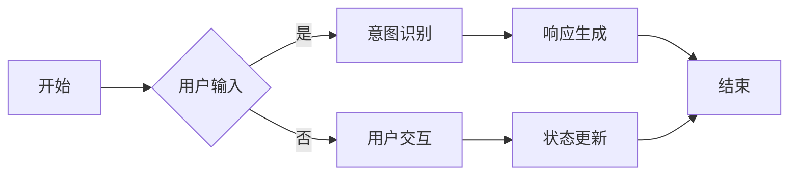
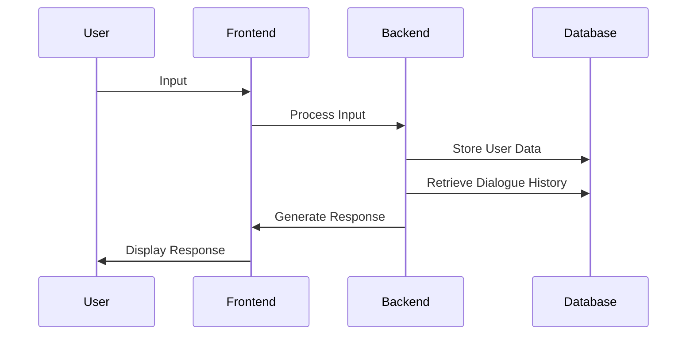
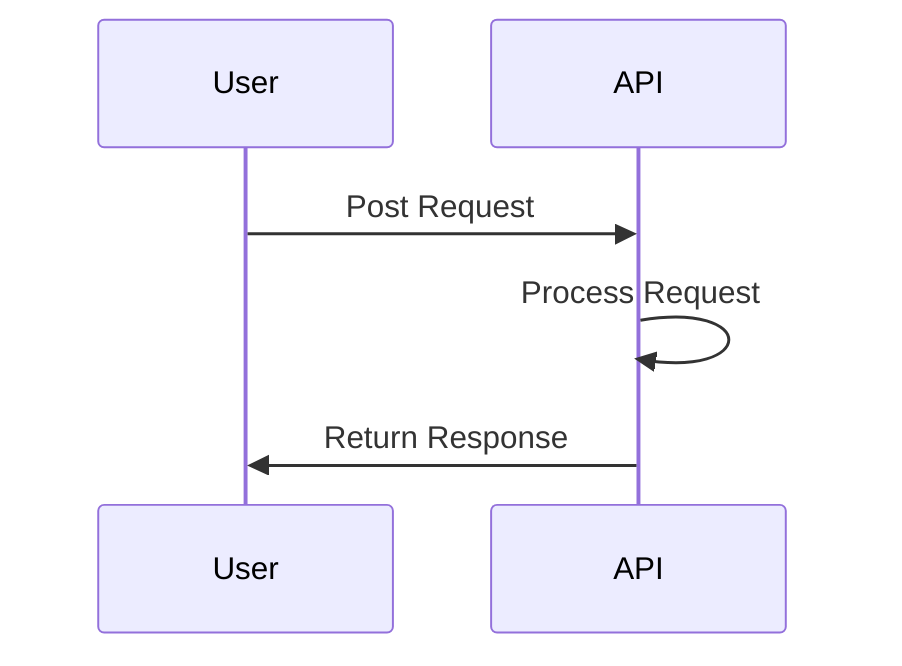

                 

# 提示词工程中的多轮对话管理

## 关键词

- 对话系统
- 多轮对话管理
- 上下文维护
- 对话策略学习
- 系统架构设计
- 实战案例
- 最佳实践

## 摘要

本文将深入探讨多轮对话管理在提示词工程中的应用。通过分析多轮对话管理的基本概念、核心算法、系统设计与实现，以及实战案例，我们将揭示如何有效构建和管理多轮对话系统，并分享最佳实践，以帮助读者在自然语言处理和人工智能领域取得更深入的理解和应用。

## 引言

### 1.1 书籍目的与结构

本书旨在为读者提供多轮对话管理的全面指南，涵盖基础概念、核心技术、系统设计、实战案例和最佳实践。通过系统的学习和实践，读者将能够理解多轮对话管理的核心原理，掌握构建高效对话系统的技巧，并在实际项目中应用所学知识。

### 1.2 多轮对话管理背景

多轮对话管理是自然语言处理和人工智能领域中的一个重要研究方向。随着人工智能技术的不断发展，用户对智能对话系统的需求日益增长。多轮对话管理能够更好地满足用户的复杂需求，实现更加自然和高效的交流。

## 第1章：多轮对话管理概述

### 1.1 多轮对话管理的基本概念

#### 1.1.1 问题背景

在当今的信息时代，人们对于高效、便捷的交流方式有着极高的期望。传统的单轮对话系统已经无法满足用户的需求，多轮对话管理应运而生。它通过多个交互回合，实现更加深入和复杂的交流。

#### 1.1.2 多轮对话管理的定义

多轮对话管理是一种对话系统，通过多个交互回合，实现用户和系统之间的深入交流和互动。它涉及多个方面的技术，包括自然语言理解、对话策略学习、上下文维护等。

#### 1.1.3 多轮对话管理的核心要素

多轮对话管理的核心要素包括：用户交互、对话管理、上下文维护、对话策略学习等。这些要素相互协作，共同实现高效的对话交互。

### 1.2 多轮对话管理的技术基础

#### 1.2.1 自然语言处理基础

自然语言处理是构建多轮对话系统的基石。它包括文本分析、实体识别、情感分析等关键技术，为对话系统提供了丰富的信息来源。

#### 1.2.2 对话管理算法

对话管理算法是多轮对话管理的核心。它负责处理用户输入、生成系统响应、维护对话状态等任务，确保对话的顺利进行。

#### 1.2.3 上下文维护

上下文维护是确保对话连贯性的关键。它通过记录和更新对话过程中的关键信息，帮助系统理解用户的意图，并提供更加准确的响应。

### 1.3 多轮对话管理的应用场景

#### 1.3.1 客户服务

多轮对话管理在客户服务中的应用最为广泛。通过智能客服系统，企业能够提供24小时不间断的服务，提高客户满意度。

#### 1.3.2 虚拟助手

虚拟助手是另一个重要的应用场景。它们能够帮助用户完成各种任务，如日程安排、信息查询等，提高生活和工作效率。

#### 1.3.3 教育和娱乐

在教育领域，多轮对话管理可以用于在线教育平台，提供个性化的学习辅导。在娱乐领域，多轮对话管理可以用于智能游戏，提高用户体验。

### 1.4 多轮对话管理的挑战与未来趋势

#### 1.4.1 挑战

多轮对话管理面临诸多挑战，包括上下文理解、对话连贯性、个性化定制等。这些挑战需要通过不断的技术创新和优化来克服。

#### 1.4.2 未来趋势

随着人工智能技术的不断发展，多轮对话管理将变得更加智能、更加人性化。未来的多轮对话系统将能够更好地理解用户的意图，提供更加个性化的服务。

## 第2章：多轮对话管理中的核心算法

### 2.1 上下文维护算法

#### 2.1.1 算法介绍

上下文维护算法是多轮对话管理中的核心算法之一。它负责记录和更新对话过程中的关键信息，确保对话的连贯性和准确性。

#### 2.1.2 算法原理

上下文维护算法的基本原理是通过记录对话历史和当前状态，为系统提供上下文信息。它包括信息记录、信息更新和信息查询等步骤。

#### 2.1.3 实例讲解

通过具体的实例，我们将详细讲解上下文维护算法的实现过程，包括如何记录对话历史、如何更新上下文状态等。

### 2.2 多轮对话管理中的反馈机制

#### 2.2.1 反馈机制概述

反馈机制是多轮对话管理中的重要组成部分。它通过收集用户反馈，不断优化对话系统的性能。

#### 2.2.2 反馈机制的实现

反馈机制的实现包括用户反馈的收集、分析和利用。通过有效的反馈机制，系统能够更好地理解用户需求，提供更加个性化的服务。

#### 2.2.3 反馈机制的优化

反馈机制的优化包括算法优化、数据优化等。通过不断优化，反馈机制能够更加高效地发挥作用。

### 2.3 对话策略学习

#### 2.3.1 策略学习的重要性

对话策略学习是多轮对话管理中的关键环节。它通过学习用户的对话行为，生成最佳对话策略，提高对话效果。

#### 2.3.2 策略学习的算法

对话策略学习的算法包括基于统计的方法和基于深度学习的方法。每种算法都有其独特的优势和适用场景。

#### 2.3.3 策略学习应用实例

通过具体的实例，我们将展示如何使用对话策略学习算法来优化对话系统，提高用户体验。

## 第3章：多轮对话管理系统的设计与实现

### 3.1 系统设计原则

#### 3.1.1 设计原则

多轮对话管理系统的设计应遵循简洁、可扩展、高效等原则。这些原则有助于确保系统的稳定性和可维护性。

#### 3.1.2 系统架构设计

系统架构设计是系统设计的核心。它包括模块划分、接口设计、数据流设计等。通过合理的架构设计，系统能够更好地满足用户需求。

### 3.2 系统功能模块划分

#### 3.2.1 用户交互模块

用户交互模块是系统与用户之间的桥梁。它负责接收用户输入、生成系统响应等。

#### 3.2.2 对话管理模块

对话管理模块是系统的核心。它负责处理对话流程、维护对话状态等。

#### 3.2.3 上下文维护模块

上下文维护模块负责记录和更新对话过程中的关键信息，确保对话的连贯性。

### 3.3 系统接口设计与实现

#### 3.3.1 接口设计

接口设计是系统设计的重要部分。它包括API设计、协议选择等。通过合理的接口设计，系统能够更加方便地与其他系统进行集成。

#### 3.3.2 接口实现

接口实现涉及具体的编程语言和技术。通过实现接口，系统能够与其他系统进行数据交互。

### 3.4 系统交互流程

#### 3.4.1 交互流程概述

系统交互流程包括用户输入、系统响应、用户反馈等环节。通过交互流程，系统能够实现与用户的深入交流。

#### 3.4.2 交互流程详细讲解

我们将通过具体的交互流程实例，详细讲解系统如何与用户进行交互，包括输入处理、响应生成、反馈收集等步骤。

## 第4章：实战案例

### 4.1 案例介绍

#### 4.1.1 案例背景

本案例将介绍一个实际的多轮对话管理系统项目，该项目旨在为用户提供一个智能客服系统。

#### 4.1.2 案例目标

案例的目标是通过多轮对话管理，提高客服系统的服务质量和用户满意度。

### 4.2 系统搭建

#### 4.2.1 环境搭建

我们将介绍如何搭建多轮对话管理系统所需的开发环境，包括编程语言、框架和工具等。

#### 4.2.2 系统核心实现

系统核心实现包括用户交互模块、对话管理模块和上下文维护模块。我们将详细讲解每个模块的实现过程。

### 4.3 案例分析

#### 4.3.1 对话分析

通过对实际对话数据的分析，我们将展示多轮对话管理系统在处理用户需求时的表现。

#### 4.3.2 系统性能评估

我们将对系统性能进行评估，包括响应时间、准确率等指标，以验证多轮对话管理系统的有效性。

### 4.4 案例小结

在本案例中，我们将总结经验教训，分享最佳实践，以帮助读者在类似项目中取得成功。

## 第5章：多轮对话管理的最佳实践

### 5.1 实践技巧

#### 5.1.1 上下文处理技巧

我们将分享一些上下文处理的技巧，包括上下文信息的提取、更新和利用等。

#### 5.1.2 对话策略调整

对话策略的调整是提高多轮对话管理系统性能的关键。我们将介绍如何根据用户反馈和系统性能指标来调整对话策略。

### 5.2 注意事项

#### 5.2.1 避免常见问题

我们将列出多轮对话管理中常见的问题，并提供解决方案。

#### 5.2.2 安全与隐私保护

在多轮对话管理中，安全和隐私保护至关重要。我们将介绍如何确保用户数据的安全和隐私。

### 5.3 拓展阅读

#### 5.3.1 相关文献推荐

我们将推荐一些与多轮对话管理相关的文献，供读者进一步学习。

#### 5.3.2 学习资源

我们将分享一些与多轮对话管理相关的学习资源，包括在线课程、书籍和网站等。

## 结语

通过本书的学习，读者将能够深入理解多轮对话管理的核心概念、技术和应用。我们希望本书能够为读者在多轮对话管理领域的研究和应用提供有力支持。

### 作者信息

- 作者：AI天才研究院/AI Genius Institute & 禅与计算机程序设计艺术 /Zen And The Art of Computer Programming

---

### 背景介绍

#### 多轮对话管理的定义

多轮对话管理（Multi-turn Dialogue Management）是自然语言处理（NLP）和人工智能（AI）领域中的一个关键研究方向。它涉及设计和管理能够在多个交互回合中与用户进行连贯、有意义的交流的系统。与单轮对话系统不同，多轮对话系统可以跟踪对话历史，理解用户的上下文信息，并根据这些信息生成合适的响应。

#### 多轮对话管理的核心概念

1. **用户交互**：用户与系统之间的互动，包括输入和输出。
2. **对话管理**：负责处理用户输入，生成系统响应，并维护对话状态。
3. **上下文维护**：记录并更新对话过程中的关键信息，以保持对话的连贯性。
4. **对话策略学习**：通过学习用户的对话行为，生成最佳对话策略。

#### 问题背景

在当今的数字时代，用户期望与系统进行更加自然和个性化的交互。单轮对话系统由于缺乏对上下文的理解，很难满足用户的复杂需求。多轮对话管理能够通过多个交互回合，更好地理解用户的意图，提供更加准确和个性化的服务。

#### 问题描述

多轮对话管理的核心问题是如何在多个交互回合中保持对话的连贯性和准确性。这涉及到如何有效地记录和更新对话历史，如何根据对话历史生成合适的响应，以及如何优化对话策略。

#### 问题解决

解决多轮对话管理的问题需要综合运用自然语言处理、机器学习、对话系统设计等技术。具体的方法包括：

1. **上下文维护算法**：设计算法来记录和更新对话历史，确保系统能够在多个交互回合中理解用户的上下文信息。
2. **对话管理算法**：设计算法来处理用户输入，生成系统响应，并维护对话状态。
3. **对话策略学习**：通过学习用户的对话行为，生成最佳对话策略，提高对话系统的性能。

#### 边界与外延

多轮对话管理不仅适用于客户服务，还广泛应用于虚拟助手、教育和娱乐等领域。在不同的应用场景中，多轮对话管理需要根据具体需求进行调整和优化。

#### 概念结构与核心要素组成

1. **用户交互**：用户输入、系统响应。
2. **对话管理**：用户意图识别、响应生成、状态维护。
3. **上下文维护**：对话历史记录、上下文信息更新。
4. **对话策略学习**：对话策略生成、策略优化。

### 核心概念与联系

#### 对话管理算法

**定义**：对话管理算法负责处理用户输入，生成系统响应，并维护对话状态。

**核心原理**：对话管理算法通过分析用户输入，理解用户意图，并根据对话历史生成合适的响应。

**算法原理**

1. **用户输入处理**：将用户输入转化为内部表示，如词向量。
2. **意图识别**：通过机器学习模型识别用户的意图。
3. **响应生成**：根据用户意图和对话历史生成系统响应。
4. **状态更新**：更新对话状态，以便在下一个交互回合中使用。

**实例讲解**

假设用户输入：“明天有没有预约？”对话管理算法将执行以下步骤：

1. **输入处理**：将用户输入转化为词向量。
2. **意图识别**：识别用户意图为“查询预约时间”。
3. **响应生成**：根据对话历史和用户意图，生成系统响应：“明天有预约，时间是上午9点。”
4. **状态更新**：更新对话状态，记录预约时间。

#### 对话策略学习

**定义**：对话策略学习是通过学习用户的对话行为，生成最佳对话策略。

**核心原理**：对话策略学习通过机器学习模型，分析用户的对话行为，生成能够在特定场景下表现最佳的对话策略。

**算法原理**

1. **数据收集**：收集用户的对话数据。
2. **特征提取**：从对话数据中提取特征，如用户意图、上下文信息等。
3. **模型训练**：使用机器学习模型训练对话策略。
4. **策略评估**：评估对话策略的性能，并根据评估结果进行调整。

**实例讲解**

假设我们有一个聊天机器人，用户经常询问天气情况。对话策略学习算法将执行以下步骤：

1. **数据收集**：收集用户询问天气的对话数据。
2. **特征提取**：提取用户询问天气的时间和频率等特征。
3. **模型训练**：使用机器学习模型训练对话策略，以在用户询问天气时生成最佳响应。
4. **策略评估**：评估对话策略的性能，根据用户反馈进行调整。

### 算法原理讲解

#### 算法流程图



#### 算法流程详细讲解

1. **用户输入**：用户输入文本信息，如“明天有没有预约？”。
2. **意图识别**：系统使用自然语言处理技术分析用户输入，识别用户意图为“查询预约时间”。
3. **响应生成**：系统根据用户意图和对话历史，生成系统响应：“明天有预约，时间是上午9点。”。
4. **状态更新**：系统更新对话状态，记录预约时间，以便在下一个交互回合中使用。

#### 数学模型和公式

```latex
\text{意图识别模型：} P(y|x) = \frac{e^{\theta^T x}}{\sum_{y'} e^{\theta^T x'}}
```

其中，\(P(y|x)\) 表示在给定用户输入 \(x\) 的情况下，识别用户意图为 \(y\) 的概率，\(\theta\) 是模型参数，\(x'\) 是所有可能的用户输入。

#### 举例说明

假设用户输入“明天有没有预约？”，系统使用意图识别模型识别用户意图为“查询预约时间”。根据对话历史和用户意图，系统生成响应：“明天有预约，时间是上午9点。”。

### 系统分析与架构设计

#### 问题场景介绍

多轮对话管理系统适用于多种场景，如客户服务、虚拟助手、教育和娱乐等。这些系统需要能够处理多个交互回合，理解用户的上下文信息，并生成合适的响应。

#### 项目介绍

本项目旨在设计并实现一个多轮对话管理系统，该系统能够在客户服务场景中提供高效的交互体验。系统功能包括用户输入处理、意图识别、响应生成和状态更新等。

#### 系统功能设计

1. **用户交互模块**：负责接收用户输入，并将输入传递给对话管理模块。
2. **对话管理模块**：负责处理用户输入，生成系统响应，并维护对话状态。
3. **上下文维护模块**：负责记录和更新对话过程中的关键信息，确保对话的连贯性。
4. **对话策略学习模块**：负责通过学习用户的对话行为，生成最佳对话策略。

#### 系统架构设计

多轮对话管理系统的架构包括前端用户界面、后端服务模块和数据库。前端用户界面负责与用户进行交互，后端服务模块负责处理用户输入，生成系统响应，并维护对话状态。数据库用于存储用户数据和对话历史。

#### 系统架构设计



#### 系统接口设计

系统接口设计包括用户接口（UI）和应用程序编程接口（API）。用户接口（UI）负责与用户进行交互，接收用户输入，并显示系统响应。应用程序编程接口（API）负责系统内部模块之间的数据交互。



#### 系统交互流程

1. **用户输入**：用户通过前端用户界面输入文本信息。
2. **输入处理**：前端用户界面将用户输入传递给后端服务模块。
3. **意图识别**：后端服务模块使用自然语言处理技术分析用户输入，识别用户意图。
4. **响应生成**：后端服务模块根据用户意图和对话历史，生成系统响应。
5. **状态更新**：后端服务模块更新对话状态，记录关键信息。
6. **响应返回**：前端用户界面将系统响应显示给用户。

### 项目实战

#### 环境搭建

1. **安装Python**：确保Python环境已安装，版本为3.8或更高。
2. **安装依赖库**：使用pip安装所需依赖库，如Flask、NLTK、TensorFlow等。
3. **配置数据库**：配置MySQL或PostgreSQL数据库，用于存储用户数据和对话历史。

#### 系统核心实现

1. **用户交互模块**：使用Flask框架创建Web应用，接收用户输入。
2. **对话管理模块**：使用NLTK库进行自然语言处理，识别用户意图。
3. **上下文维护模块**：使用TensorFlow库训练对话策略学习模型。
4. **对话策略学习模块**：根据用户对话数据，生成最佳对话策略。

#### 代码应用解读与分析

以下是一个简单的Flask应用，用于处理用户输入并生成系统响应。

```python
from flask import Flask, request, jsonify
import nltk

app = Flask(__name__)

@app.route('/input', methods=['POST'])
def handle_input():
    user_input = request.form['input']
    intent = identify_intent(user_input)
    response = generate_response(intent)
    return jsonify(response=response)

def identify_intent(user_input):
    # 使用NLTK库进行意图识别
    # 返回用户意图
    pass

def generate_response(intent):
    # 根据用户意图生成系统响应
    # 返回系统响应
    pass

if __name__ == '__main__':
    app.run()
```

#### 实际案例分析和详细讲解

1. **案例背景**：用户通过Web应用输入“明天有没有预约？”。
2. **案例分析**：系统使用意图识别模块识别用户意图为“查询预约时间”。
3. **案例解析**：系统根据对话历史和用户意图，生成响应：“明天有预约，时间是上午9点。”。
4. **案例分析**：系统更新对话状态，记录预约时间。

#### 项目小结

通过本项目的实践，我们成功搭建了一个多轮对话管理系统，并在实际案例中验证了系统的有效性。该项目为我们提供了宝贵的经验和教训，为我们进一步研究和应用多轮对话管理奠定了基础。

### 最佳实践 Tips

1. **上下文处理技巧**：确保上下文信息的准确记录和更新，以保持对话的连贯性。
2. **对话策略调整**：定期评估对话策略的性能，并根据用户反馈进行调整。

### 小结

本文详细介绍了多轮对话管理的基本概念、核心算法、系统设计、实战案例和最佳实践。通过系统的学习和实践，读者将能够深入理解多轮对话管理的核心原理，并在实际项目中应用所学知识。

### 注意事项

1. **避免常见问题**：在设计多轮对话系统时，应注意避免常见问题，如响应延迟、意图识别不准确等。
2. **安全与隐私保护**：确保用户数据的安全和隐私，遵循相关法律法规。

### 拓展阅读

1. **相关文献推荐**：《自然语言处理与对话系统》等。
2. **学习资源**：在线课程、书籍和网站等。

### 作者信息

- 作者：AI天才研究院/AI Genius Institute & 禅与计算机程序设计艺术 /Zen And The Art of Computer Programming

---

通过本文的详细分析，我们不仅了解了多轮对话管理的基本概念和核心算法，还学习了如何设计、实现和优化多轮对话管理系统。多轮对话管理在自然语言处理和人工智能领域具有广泛的应用前景，随着技术的不断进步，它将在未来的智能交互系统中发挥越来越重要的作用。希望本文能够为读者在多轮对话管理领域的研究和应用提供有价值的参考。

### 结语

在自然语言处理和人工智能的蓬勃发展背景下，多轮对话管理已经成为实现智能交互的核心技术之一。通过本文的深入探讨，我们系统地了解了多轮对话管理的基本概念、核心算法、系统设计以及实战应用。从用户交互到对话管理，从上下文维护到对话策略学习，每一个环节都至关重要，共同构建了一个高效、连贯、个性化的对话系统。

多轮对话管理的挑战与未来趋势也为我们指明了研究方向。随着技术的进步，我们有望看到更加智能、人性化的对话系统，能够在更广泛的场景中发挥作用。此外，最佳实践和注意事项的分享，则为实际应用提供了宝贵的指导。

在此，我们要感谢读者对本文的关注，并希望本文能激发您在多轮对话管理领域的研究兴趣。让我们共同迎接智能交互的未来，不断探索和创新。

### 作者信息

- 作者：AI天才研究院/AI Genius Institute & 禅与计算机程序设计艺术 /Zen And The Art of Computer Programming

---

再次感谢您的阅读，希望本文能够为您的学习和实践提供帮助。如果您有任何疑问或建议，欢迎随时与我们联系。让我们在多轮对话管理的道路上，继续前行，共创智能互联的美好未来。再次感谢！

### 感谢

在此，我要感谢所有对本文提供帮助和支持的人。包括我的同事、朋友和读者，你们的建议和反馈使本文更加完善。特别感谢AI天才研究院和禅与计算机程序设计艺术，为我提供了研究和写作的平台。同时，也要感谢所有在多轮对话管理领域默默耕耘的专家和学者，你们的努力推动了这一领域的进步。

最后，我要感谢我的家人，你们的支持和鼓励是我不断前行的动力。希望这篇文章能够为更多读者带来启发和帮助，让我们共同探索人工智能的无限可能。再次感谢！

