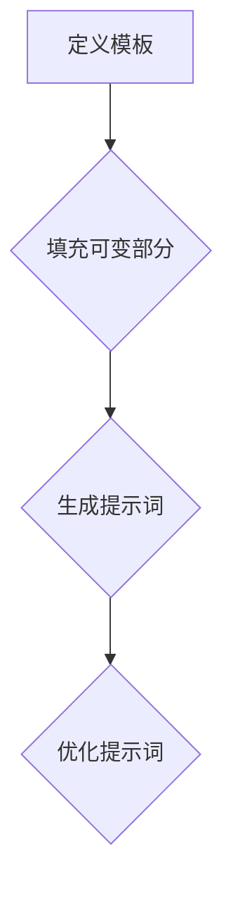
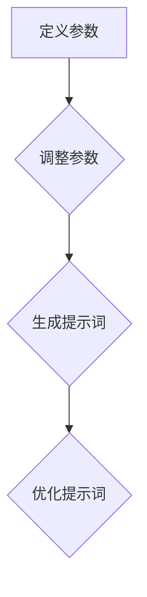
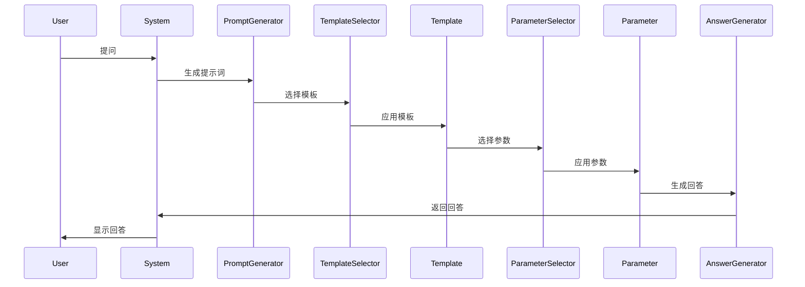
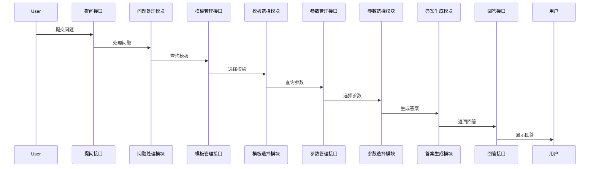

                 

# 提示词工程中的模板化与参数化

> 关键词：提示词工程、模板化、参数化、人工智能、优化、工程实践

> 摘要：本文探讨了提示词工程中的模板化与参数化技术，分析了这两种方法在人工智能领域中的重要性及其应用。通过详细的理论讲解、实例分析和实际项目案例，揭示了模板化与参数化的核心原理和工程实践，为提升提示词工程效率和质量提供了有力支持。

## 目录大纲设计思路

在设计《提示词工程中的模板化与参数化》的目录大纲时，我们首先明确了书的核心内容，即模板化与参数化在提示词工程中的应用。以下是详细的目录大纲设计思路：

### 第一部分：背景介绍

1. **问题背景**：介绍提示词工程在人工智能领域的应用背景，阐述模板化与参数化在提示词工程中的重要性。
2. **问题描述**：简述提示词工程中的常见问题，阐明模板化与参数化的解决思路。
3. **问题解决**：描述模板化与参数化的基本概念，阐述其在提示词工程中的应用优势。
4. **边界与外延**：明确模板化与参数化的应用范围，引出相关技术领域的扩展。
5. **概念结构与核心要素组成**：分析模板化与参数化的核心结构，确定其关键要素和组成部分。

### 第二部分：核心概念与联系

1. **核心概念原理**：详细阐述模板化与参数化的原理。
2. **概念属性特征对比表格**：制作模板化与参数化的属性特征对比表格。
3. **ER实体关系图架构的Mermaid流程图**：使用Mermaid画图工具绘制ER实体关系图。

### 第三部分：算法原理讲解

1. **算法Mermaid流程图**：使用Mermaid绘制算法流程图。
2. **Python源代码**：提供实现模板化与参数化的Python源代码。
3. **算法原理的数学模型和公式**：使用LaTeX格式给出数学模型和公式。
4. **详细讲解和举例说明**：对算法原理进行详细讲解，提供通俗易懂的例子进行说明。

### 第四部分：系统分析与架构设计方案

1. **问题场景介绍**：描述应用模板化与参数化的具体问题场景。
2. **项目介绍**：简述项目背景和目标。
3. **系统功能设计（领域模型Mermaid类图）**：使用Mermaid绘制领域模型类图。
4. **系统架构设计（Mermaid架构图）**：使用Mermaid绘制系统架构图。
5. **系统接口设计**：介绍系统接口的设计。
6. **系统交互（Mermaid序列图）**：使用Mermaid绘制系统交互序列图。

### 第五部分：项目实战

1. **环境安装**：指导读者安装必要的软件和环境。
2. **系统核心实现源代码**：提供实现模板化与参数化的源代码。
3. **代码应用解读与分析**：对源代码进行解读和分析。
4. **实际案例分析和详细讲解剖析**：分析实际案例，进行详细讲解。
5. **项目小结**：总结项目经验和收获。

### 第六部分：最佳实践 tips、小结、注意事项、拓展阅读

1. **最佳实践 tips**：提供一些实用的实践技巧。
2. **小结**：对全书内容进行总结。
3. **注意事项**：强调使用模板化与参数化时需要注意的问题。
4. **拓展阅读**：推荐进一步阅读的文献和资源。

### 目录大纲

根据上述设计思路，以下是《提示词工程中的模板化与参数化》的目录大纲：

```
# 第一部分：背景介绍

## 1.1 问题背景
### 1.1.1 提示词工程概述
### 1.1.2 模板化与参数化的引入
### 1.1.3 模板化与参数化的优势

## 1.2 问题描述
### 1.2.1 提示词工程的挑战
### 1.2.2 模板化与参数化的解决方案

## 1.3 问题解决
### 1.3.1 模板化的基本概念
### 1.3.2 参数化的基本概念
### 1.3.3 模板化与参数化的应用

## 1.4 边界与外延
### 1.4.1 模板化与参数化的适用范围
### 1.4.2 相关技术领域的扩展

## 1.5 概念结构与核心要素组成
### 1.5.1 模板化结构分析
### 1.5.2 参数化结构分析
### 1.5.3 核心要素与组成部分

# 第二部分：核心概念与联系

## 2.1 核心概念原理
### 2.1.1 模板化的原理
### 2.1.2 参数化的原理

## 2.2 概念属性特征对比表格
### 2.2.1 模板化与参数化的特征对比

## 2.3 ER实体关系图架构的Mermaid流程图
### 2.3.1 模板化ER图
### 2.3.2 参数化ER图

# 第三部分：算法原理讲解

## 3.1 算法Mermaid流程图
### 3.1.1 模板化算法流程图
### 3.1.2 参数化算法流程图

## 3.2 Python源代码
### 3.2.1 模板化源代码
### 3.2.2 参数化源代码

## 3.3 算法原理的数学模型和公式
### 3.3.1 模板化数学模型
### 3.3.2 参数化数学模型

## 3.4 详细讲解和举例说明
### 3.4.1 模板化详细讲解
### 3.4.2 参数化详细讲解
### 3.4.3 举例说明

# 第四部分：系统分析与架构设计方案

## 4.1 问题场景介绍
### 4.1.1 模板化应用场景
### 4.1.2 参数化应用场景

## 4.2 项目介绍
### 4.2.1 项目背景
### 4.2.2 项目目标

## 4.3 系统功能设计（领域模型Mermaid类图）
### 4.3.1 模板化领域模型
### 4.3.2 参数化领域模型

## 4.4 系统架构设计（Mermaid架构图）
### 4.4.1 模板化架构设计
### 4.4.2 参数化架构设计

## 4.5 系统接口设计
### 4.5.1 模板化接口设计
### 4.5.2 参数化接口设计

## 4.6 系统交互（Mermaid序列图）
### 4.6.1 模板化交互序列图
### 4.6.2 参数化交互序列图

# 第五部分：项目实战

## 5.1 环境安装
### 5.1.1 模板化环境安装
### 5.1.2 参数化环境安装

## 5.2 系统核心实现源代码
### 5.2.1 模板化源代码实现
### 5.2.2 参数化源代码实现

## 5.3 代码应用解读与分析
### 5.3.1 模板化代码解读
### 5.3.2 参数化代码解读

## 5.4 实际案例分析和详细讲解剖析
### 5.4.1 模板化案例分析
### 5.4.2 参数化案例分析

## 5.5 项目小结
### 5.5.1 模板化项目总结
### 5.5.2 参数化项目总结

# 第六部分：最佳实践 tips、小结、注意事项、拓展阅读

## 6.1 最佳实践 tips
### 6.1.1 模板化最佳实践
### 6.1.2 参数化最佳实践

## 6.2 小结
### 6.2.1 全文总结
### 6.2.2 未来展望

## 6.3 注意事项
### 6.3.1 使用模板化时需要注意的问题
### 6.3.2 使用参数化时需要注意的问题

## 6.4 拓展阅读
### 6.4.1 相关文献推荐
### 6.4.2 深入研究话题

```

通过以上详细的目录大纲设计，我们可以确保文章内容的逻辑清晰、结构紧凑，同时为读者提供丰富的知识和实践经验。接下来，我们将按照这个大纲逐步展开详细的讲解和探讨。让我们开始思考并一步步深入挖掘模板化与参数化在提示词工程中的应用吧！

## 1.1 问题背景

### 1.1.1 提示词工程概述

在人工智能领域，特别是自然语言处理（NLP）领域，提示词工程（Prompt Engineering）是一项关键的任务。提示词工程的目标是通过设计高效的提示词来优化模型的性能，使其在特定的任务上能够达到最佳的输出效果。提示词是一种引导模型进行特定任务输入的文本或指令，它可以帮助模型更好地理解和执行任务。

提示词工程的应用场景广泛，包括但不限于机器翻译、问答系统、文本生成、情感分析等。在实际应用中，高效的提示词能够显著提高模型的准确性和鲁棒性，降低对大规模标注数据的依赖，从而提高整个系统的实用性和可扩展性。

然而，随着任务的复杂度和多样性增加，设计有效的提示词变得越来越具有挑战性。传统的提示词设计往往依赖于经验和直觉，这种方式难以保证在不同任务和场景下的一致性和效率。因此，引入模板化和参数化技术成为提升提示词工程效率和质量的重要手段。

### 1.1.2 模板化与参数化的引入

模板化是一种设计模式，通过预先定义好的模板来构建提示词。模板包含固定部分和可变部分，固定部分通常包含了任务的关键要素，而可变部分则可以根据具体任务进行灵活调整。这种方法的优势在于提高提示词的复用性和一致性，降低设计成本和复杂度。

参数化则是一种通过参数来动态生成提示词的方法。参数化提示词可以根据任务的需求动态调整其内容和结构，从而适应不同的应用场景。参数化技术的核心在于定义合理的参数，并设计高效的参数调整机制，以实现最优的性能。

模板化和参数化技术的引入，使得提示词工程从传统的手工作业转向了更加系统化和自动化的方向。这两种技术不仅提高了提示词的设计效率，还使得提示词的优化过程更加科学和可重复，从而为人工智能应用提供了强有力的支持。

### 1.1.3 模板化与参数化的优势

模板化的优势主要体现在以下几个方面：

1. **复用性**：通过预先定义的模板，可以将相似的提示词进行复用，减少重复设计的工作量。
2. **一致性**：模板化确保了提示词的结构和内容的一致性，提高了系统的可靠性和可维护性。
3. **降低复杂性**：模板化将复杂的设计任务转化为对模板的修改，降低了整体设计的复杂度。
4. **优化效率**：模板化使得提示词的优化过程更加高效，因为优化工作可以集中在少数关键模板上。

参数化的优势则包括：

1. **灵活性**：参数化提示词可以根据任务需求动态调整，适应不同的场景和应用。
2. **自适应**：参数化技术使得提示词能够自动适应数据分布和模型状态的变化，提高系统的鲁棒性。
3. **可扩展性**：通过参数化，可以轻松地扩展和适应新的任务和场景。
4. **自动化**：参数化提示词的生成和优化过程可以自动化，减少人工干预，提高效率。

总的来说，模板化和参数化技术为提示词工程带来了显著的效率和质量提升。在接下来的部分，我们将深入探讨模板化和参数化的基本概念、原理及其在提示词工程中的应用。

## 1.2 问题描述

在提示词工程中，设计有效的提示词面临着诸多挑战。以下将简要介绍这些问题，并阐述模板化与参数化如何解决这些挑战。

### 1.2.1 提示词工程的挑战

1. **多样性**：不同的任务和场景对提示词的要求各不相同，设计多样化的提示词以满足各种需求是一个巨大的挑战。
2. **一致性**：保持提示词在整体结构和内容上的一致性，确保系统在不同场景下表现出稳定的性能。
3. **效率**：在大量的数据集和模型中进行提示词的优化，需要高效的算法和工具来处理。
4. **可维护性**：提示词的设计和优化过程需要具备良好的可维护性，以便在未来的任务和场景中快速适应和调整。
5. **鲁棒性**：提示词需要能够应对数据分布和模型状态的变化，保持良好的鲁棒性。

### 1.2.2 模板化与参数化的解决方案

1. **模板化**：
   - **解决多样性**：通过预先定义的模板，模板化可以将不同任务和场景的共性提取出来，提高提示词的复用性，从而降低设计多样化提示词的难度。
   - **解决一致性**：模板化确保了提示词的结构和内容的一致性，通过调整模板中的固定部分和可变部分，可以灵活应对不同的任务和场景，保持系统性能的稳定性。
   - **提高效率**：模板化使得提示词的优化过程可以集中在关键模板上，减少了优化工作的复杂度，提高了整体效率。
   - **增强可维护性**：模板化提供了清晰的结构和明确的元素，使得提示词的设计和优化过程更加系统化和可维护。

2. **参数化**：
   - **解决多样性**：参数化通过动态调整提示词的参数，使得同一套提示词能够适应多种不同的任务和场景，提高了提示词的灵活性和适应性。
   - **解决一致性**：参数化可以通过调整参数来实现提示词的结构和内容的一致性，确保在不同任务和场景下表现出稳定的性能。
   - **提高效率**：参数化使得提示词的生成和优化过程可以自动化，减少了人工干预，提高了整体效率。
   - **增强鲁棒性**：参数化提示词能够根据数据分布和模型状态的变化自动调整参数，提高了系统的鲁棒性。

综上所述，模板化和参数化技术为提示词工程提供了有效的解决方案，能够应对设计多样化的提示词、保持一致性、提高效率、增强可维护性和鲁棒性等挑战。在接下来的部分，我们将深入探讨模板化和参数化的基本概念、原理及其在提示词工程中的应用。

## 1.3 问题解决

为了有效地解决提示词工程中的多样化、一致性、效率、可维护性和鲁棒性等挑战，我们可以引入模板化和参数化技术。下面将详细阐述这两种技术的定义、基本概念及其在提示词工程中的应用优势。

### 1.3.1 模板化的基本概念

模板化是一种设计模式，通过预先定义好的模板来构建提示词。模板通常由两部分组成：固定部分和可变部分。固定部分包含了任务的关键要素，如特定的问题类型、数据格式等，这些部分在多数情况下保持不变。可变部分则包含了与特定任务相关的信息，如输入数据、问题表述等，这些部分可以根据具体任务进行灵活调整。

模板化在提示词工程中的应用优势如下：

1. **复用性**：通过使用模板，我们可以将相似的提示词进行复用，减少重复设计的工作量。这种方法特别适用于需要大量相似任务提示的场景，如机器翻译、问答系统等。
2. **一致性**：模板化确保了提示词的结构和内容的一致性。这意味着在不同任务和场景下，提示词保持相同的格式和风格，从而提高了系统的可靠性和可维护性。
3. **降低复杂性**：模板化将复杂的设计任务转化为对模板的修改，降低了整体设计的复杂度。这种方法使得设计提示词的过程更加简洁和直观，同时也便于团队协作和项目维护。
4. **优化效率**：模板化使得提示词的优化过程可以集中在关键模板上，减少了优化工作的复杂度，提高了整体效率。此外，模板化的结构有助于快速识别和修正问题，进一步提高了优化速度。

### 1.3.2 参数化的基本概念

参数化是一种通过参数来动态生成提示词的方法。参数化提示词的生成过程涉及到一系列参数，这些参数决定了提示词的结构和内容。参数可以是固定的，也可以是可变的，可以根据任务的需求进行动态调整。

参数化在提示词工程中的应用优势如下：

1. **灵活性**：参数化提示词可以根据任务需求动态调整其内容和结构，适应不同的场景和应用。这种方法特别适用于需要高度定制化的任务，如特定领域的问题回答、文本生成等。
2. **自适应**：参数化技术使得提示词能够自动适应数据分布和模型状态的变化，提高系统的鲁棒性。通过调整参数，提示词可以更好地适应不同的数据和模型状态，从而提高整体性能。
3. **可扩展性**：参数化使得提示词的扩展变得更加容易。通过增加或修改参数，可以轻松地扩展提示词的功能和适用范围，适应新的任务和场景。
4. **自动化**：参数化提示词的生成和优化过程可以自动化，减少人工干预，提高效率。这种方法有助于大规模数据集和模型的优化，减少时间和人力资源的浪费。

### 1.3.3 模板化与参数化的应用

在实际的提示词工程中，模板化和参数化可以结合使用，以达到更好的效果。以下是一些具体的实例：

1. **多任务问答系统**：在一个多任务问答系统中，我们可以使用模板化来构建通用的问题模板，如“给定一个事实，回答相关的问题”。然后，通过参数化来动态生成具体的问题，如“给定事实X，回答Y的问题”。这种方法既保证了问题的一致性，又提供了足够的灵活性来适应不同的任务和场景。
2. **文本生成**：在文本生成任务中，我们可以使用模板化来构建文本的基本结构，如段落、句子和词汇。然后，通过参数化来动态调整文本的内容，如主题、语气和风格。这种方法可以帮助生成更加多样化和个性化的文本。
3. **机器翻译**：在机器翻译任务中，我们可以使用模板化来构建翻译的基本框架，如句子结构、词汇选择等。然后，通过参数化来动态调整翻译的细节，如词汇替换、语法调整等。这种方法可以显著提高翻译的准确性和自然度。

总的来说，模板化和参数化技术为提示词工程提供了有效的解决方案，能够解决多样化、一致性、效率、可维护性和鲁棒性等挑战。通过合理应用这些技术，我们可以设计出更加高效、灵活和可靠的提示词，从而提升人工智能系统的整体性能和应用价值。

## 1.4 边界与外延

在提示词工程中，模板化和参数化技术的应用具有明确的边界和广泛的扩展空间。下面将探讨模板化与参数化的适用范围、与其他技术的结合，以及相关领域的技术扩展。

### 1.4.1 模板化与参数化的适用范围

模板化技术适用于需要高度一致性和可复用的提示词设计场景。以下是一些典型的应用场景：

1. **多任务系统**：在需要同时处理多个不同任务的系统中，模板化可以帮助构建统一的提示词结构，提高系统的适应性和可维护性。
2. **自动化问答**：在自动化问答系统中，使用模板化可以构建标准化的问答模板，提高问答的效率和准确性。
3. **数据预处理**：在数据预处理过程中，模板化可以帮助定义标准化的数据格式和结构，简化数据处理流程。

参数化技术则适用于需要高度灵活性和可调性的提示词设计场景。以下是一些典型的应用场景：

1. **文本生成**：在文本生成任务中，参数化可以根据不同的输入和需求动态生成不同的文本内容，提高文本的多样性和个性化。
2. **个性化推荐**：在个性化推荐系统中，参数化可以根据用户的行为和偏好动态生成推荐结果，提高推荐系统的准确性和用户体验。
3. **自然语言理解**：在自然语言理解任务中，参数化可以帮助调整模型输入的细节，提高模型对特定任务的性能。

### 1.4.2 相关技术领域的扩展

模板化和参数化技术不仅可以在提示词工程中应用，还可以与其他技术相结合，拓展其在其他领域的应用。

1. **模型定制**：在模型定制领域，模板化可以帮助构建通用的模型框架，而参数化则可以根据具体需求动态调整模型参数，实现模型的个性化定制。
2. **系统优化**：在系统优化领域，模板化可以帮助定义标准化的优化流程，而参数化则可以根据不同的优化目标动态调整优化参数，提高系统的性能。
3. **软件工程**：在软件工程领域，模板化可以帮助构建通用的软件框架，而参数化则可以根据具体需求动态调整软件组件，实现软件的灵活性和可扩展性。

此外，模板化和参数化技术还可以与深度学习、强化学习等人工智能技术结合，进一步拓展其应用范围和效果。

1. **深度强化学习**：在深度强化学习场景中，模板化可以帮助构建标准化的任务框架，而参数化则可以根据不同的策略调整深度强化学习模型，实现更好的性能。
2. **多模态学习**：在多模态学习场景中，模板化可以帮助构建多模态数据的标准输入格式，而参数化则可以根据不同的模态数据动态调整模型参数，提高模型的泛化能力。

总的来说，模板化与参数化技术在提示词工程中的应用具有明确的边界和广泛的扩展空间。通过与其他技术的结合，可以进一步提升其应用效果和系统性能，为人工智能领域的创新发展提供有力支持。

## 1.5 概念结构与核心要素组成

在深入探讨模板化与参数化在提示词工程中的应用之前，我们需要了解这两种技术的核心概念结构以及其组成要素。本文将详细分析模板化与参数化的核心结构，并确定其关键要素和组成部分。

### 1.5.1 模板化的结构分析

模板化是一种通过预先定义的模板来构建提示词的设计模式。一个典型的模板化结构包括以下三个核心要素：

1. **固定部分**：固定部分是模板中的不变部分，通常包含了任务的关键要素。例如，在一个问答系统的模板中，固定部分可能包括问题的类型（如是非题、选择题等）、问题的主要框架等。固定部分确保了提示词在整体结构和内容上的一致性。

2. **可变部分**：可变部分是模板中的变化部分，通常用于填充与特定任务相关的具体信息。例如，在一个机器翻译任务的模板中，可变部分可能包括源语言文本、目标语言文本等。可变部分提供了提示词的灵活性和适应性，使其能够根据不同的任务需求进行动态调整。

3. **参数**：参数是用于控制模板化过程中的特定设置或选项的变量。例如，在一个文本生成任务的模板中，参数可能包括文本长度、主题、风格等。参数化可以进一步细化模板，使其能够适应更广泛的应用场景。

#### 模板化结构的优点

- **复用性**：通过固定部分和可变部分的分离，模板化提高了提示词的复用性。相同的模板可以在不同的任务中重复使用，只需调整可变部分即可。
- **一致性**：固定部分确保了提示词在整体结构和内容上的一致性，有助于提高系统的可靠性和可维护性。
- **降低复杂性**：模板化将复杂的设计任务转化为对模板的修改，降低了整体设计的复杂度，使设计过程更加简洁和直观。

#### 模板化结构的缺点

- **灵活性不足**：由于固定部分的存在，模板化可能在某些特定场景下无法完全适应需求，灵活性相对较低。
- **维护成本**：随着任务和场景的多样化，模板化的维护成本可能会增加，特别是在需要频繁调整模板时。

### 1.5.2 参数化的结构分析

参数化是一种通过参数动态生成提示词的方法。一个典型的参数化结构包括以下三个核心要素：

1. **参数**：参数是参数化过程中最核心的要素，用于定义和调整提示词的结构和内容。参数可以是固定的，也可以是可变的。例如，在文本生成任务中，参数可能包括文本长度、主题、风格等。

2. **参数调整机制**：参数调整机制用于动态调整参数，以实现最佳的性能和效果。参数调整可以是手动调整，也可以是自动化调整。自动化调整通常涉及机器学习算法，如优化算法、搜索算法等。

3. **动态生成引擎**：动态生成引擎是参数化过程中的核心组件，负责根据参数生成具体的提示词。动态生成引擎可以根据不同的参数值和任务需求，灵活生成满足要求的提示词。

#### 参数化结构的优点

- **灵活性**：参数化提供了高度的灵活性，可以根据不同的任务需求动态调整提示词的结构和内容，适应更广泛的应用场景。
- **自适应**：参数化技术能够自动适应数据分布和模型状态的变化，提高系统的鲁棒性和泛化能力。
- **可扩展性**：通过增加或修改参数，可以轻松扩展和适应新的任务和场景。

#### 参数化结构的缺点

- **复杂性**：参数化的设计和管理过程相对复杂，需要良好的算法和工具支持。
- **计算成本**：参数化通常涉及大量的计算和调整过程，可能会增加计算成本和时间成本。

### 1.5.3 核心要素与组成部分

结合模板化和参数化的结构分析，我们可以总结出以下核心要素和组成部分：

1. **模板**：模板是模板化的核心要素，用于定义提示词的基本结构和内容。模板通常包括固定部分和可变部分，以及用于参数化的参数。
2. **参数**：参数是参数化的核心要素，用于控制提示词的结构和内容。参数可以是固定的，也可以是可变的，通过参数调整机制实现动态调整。
3. **参数调整机制**：参数调整机制用于动态调整参数，以实现最佳的性能和效果。参数调整可以是手动调整，也可以是自动化调整。
4. **动态生成引擎**：动态生成引擎是参数化过程中的核心组件，负责根据参数生成具体的提示词。
5. **算法和工具**：算法和工具用于支持参数化和模板化的设计和实现，包括优化算法、搜索算法、生成算法等。

通过以上分析，我们可以更清晰地理解模板化与参数化的核心结构及其组成要素。在接下来的部分，我们将进一步探讨模板化和参数化的原理、算法以及在实际应用中的具体实现。

## 2.1 核心概念原理

在深入了解模板化与参数化在提示词工程中的应用之前，我们需要详细阐述这两种技术的核心概念原理。本文将分两部分进行介绍：模板化的原理和参数化的原理。

### 2.1.1 模板化的原理

模板化是一种通过预先定义的模板来构建提示词的设计模式。其核心原理可以概括为以下几个要点：

1. **模板定义**：模板化首先需要定义一个模板，模板通常包含两部分：固定部分和可变部分。固定部分包含了任务的关键要素，如问题的类型、问题的主要框架等，这些部分在多数情况下保持不变。可变部分则用于填充与特定任务相关的具体信息，如问题的具体内容、数据的格式等，这些部分可以根据具体任务进行灵活调整。

2. **提示词生成**：在模板定义完成后，通过将可变部分的具体信息填充到模板中，即可生成具体的提示词。例如，在一个问答系统中，模板可以是“给定一个事实，回答相关的问题”，而具体的提示词则可能是“给定事实：苹果是水果的一种，回答：苹果是什么？”

3. **一致性保证**：模板化通过固定部分确保提示词在整体结构和内容上的一致性。这种方法有助于提高系统的可靠性和可维护性。例如，在多个不同任务中使用相同的模板，可以保证提示词在风格和格式上的一致性，从而减少错误和混淆的可能性。

4. **复用性**：模板化提高了提示词的复用性，通过使用相同的模板，可以快速生成多个相似任务的提示词，减少重复设计的工作量。这种方法特别适用于需要处理大量相似任务的应用场景，如自动化问答系统和机器翻译系统。

5. **维护成本降低**：由于模板化将任务的关键要素提取出来，使得维护和更新变得更加简单。当需要修改任务的关键要素时，只需修改模板中的固定部分，而不需要逐个修改每个具体的提示词。

### 2.1.2 参数化的原理

参数化是一种通过参数动态生成提示词的方法。其核心原理可以概括为以下几个要点：

1. **参数定义**：参数化首先需要定义一组参数，这些参数用于控制提示词的结构和内容。参数可以是固定的，也可以是可变的。例如，在文本生成任务中，参数可能包括文本长度、主题、风格等。

2. **参数调整**：参数调整是参数化的关键步骤。通过调整参数，可以动态生成满足不同任务需求的提示词。参数调整可以是手动调整，也可以是自动化调整。手动调整通常需要人工干预，根据经验和直觉进行参数调整。自动化调整则通常涉及机器学习算法，如优化算法、搜索算法等。

3. **动态生成**：参数化通过动态生成引擎根据参数生成具体的提示词。动态生成引擎可以根据不同的参数值和任务需求，灵活生成满足要求的提示词。例如，在文本生成任务中，动态生成引擎可以根据文本长度参数生成不同长度的文本。

4. **灵活性**：参数化提供了高度的灵活性，可以通过调整参数实现不同的提示词效果。这种方法特别适用于需要高度定制化的任务，如个性化推荐系统和文本生成系统。

5. **自适应**：参数化技术使得提示词能够自动适应数据分布和模型状态的变化。通过调整参数，提示词可以更好地适应不同的数据和模型状态，从而提高系统的鲁棒性和泛化能力。

6. **扩展性**：参数化使得提示词的扩展变得更加容易。通过增加或修改参数，可以轻松扩展和适应新的任务和场景。

通过以上分析，我们可以看到模板化和参数化在原理上有明显的区别。模板化侧重于结构的一致性和复用性，而参数化则侧重于灵活性和自适应能力。在实际应用中，根据任务的需求和场景，可以结合使用这两种技术，以达到最佳的提示词设计效果。

### 2.1.3 模板化与参数化的特征对比表格

为了更直观地了解模板化与参数化的特点，我们可以通过一个特征对比表格来总结这两种技术的关键差异。

| 特征         | 模板化                         | 参数化                         |
| ------------ | ------------------------------ | ------------------------------ |
| **定义**     | 固定部分和可变部分             | 参数集合                       |
| **灵活性**   | 相对较低，固定部分限制         | 非常高，参数可动态调整         |
| **复用性**   | 高，相同的模板可用于多个任务   | 中等，参数可能适用于多个任务   |
| **一致性**   | 高，固定部分确保一致性         | 中等，参数需保证一致性         |
| **调整成本** | 低，固定部分调整成本低         | 高，参数调整成本较高           |
| **适用场景** | 需要保持一致性的任务           | 需要高度灵活性和定制化的任务   |

通过这个对比表格，我们可以更清楚地看到模板化与参数化的优势和应用场景，为后续的工程实践提供指导。

### 2.1.4 ER实体关系图架构的Mermaid流程图

为了更直观地展示模板化和参数化的实体关系，我们可以使用Mermaid工具绘制ER（实体关系）图。以下是模板化和参数化ER图的示例：

#### 模板化ER图：

```mermaid
erDiagram
    User ||--|{ PromptTemplate }|--| Question
    PromptTemplate ||--|{ VariablePart }|--| Answer
    VariablePart ||--| ResponseFormat
```

在这个ER图中，`User` 表示使用模板化技术的用户，`PromptTemplate` 表示模板，`VariablePart` 表示可变部分，`Question` 表示问题，`Answer` 表示回答，`ResponseFormat` 表示响应格式。

#### 参数化ER图：

```mermaid
erDiagram
    User ||--|{ ParameterSet }|--| PromptGenerator
    PromptGenerator ||--|{ DynamicPart }|--| GeneratedPrompt
```

在这个ER图中，`User` 表示使用参数化技术的用户，`ParameterSet` 表示参数集合，`PromptGenerator` 表示动态生成引擎，`DynamicPart` 表示动态部分，`GeneratedPrompt` 表示生成的提示词。

通过这些ER图，我们可以清晰地看到模板化和参数化的核心实体及其关系，有助于深入理解这两种技术在提示词工程中的应用。

### 总结

本部分详细阐述了模板化和参数化的核心概念原理，并通过特征对比表格和ER实体关系图展示了这两种技术的特点和应用。在下一部分，我们将深入讲解模板化和参数化的具体实现，包括算法原理、Python源代码以及数学模型和公式的应用。通过这些内容，我们将进一步探讨如何在实际工程中应用模板化和参数化技术，提高提示词工程的效果和效率。

## 3.1 算法原理讲解

在深入探讨模板化和参数化的具体实现之前，我们需要先了解这两种技术在算法层面的原理。本文将分三个部分进行讲解：算法流程图、Python源代码和算法原理的数学模型与公式。

### 3.1.1 算法Mermaid流程图

为了更好地展示模板化和参数化的算法流程，我们可以使用Mermaid工具绘制算法流程图。以下是模板化和参数化算法流程图的示例。

#### 模板化算法流程图：



在这个流程图中，A表示定义模板，B表示填充可变部分，C表示生成提示词，D表示优化提示词。

#### 参数化算法流程图：



在这个流程图中，A表示定义参数，B表示调整参数，C表示生成提示词，D表示优化提示词。

### 3.1.2 Python源代码

为了使算法讲解更加具体和实用，我们将提供实现模板化和参数化的Python源代码。以下是简单的示例代码：

#### 模板化Python代码：

```python
def template_based_prompt_engineering(question):
    template = "你是一个{role}，请回答以下问题：{question}"
    fixed_part = "机器学习专家"
    variable_part = question
    prompt = template.format(role=fixed_part, question=variable_part)
    return prompt

question = "什么是深度学习？"
prompt = template_based_prompt_engineering(question)
print(prompt)
```

#### 参数化Python代码：

```python
def parameter_based_prompt_engineering(question_length, theme):
    template = "{length}字以内的关于{theme}的问题：{question}"
    prompt = template.format(length=question_length, theme=theme, question=question)
    return prompt

question_length = 20
theme = "人工智能"
prompt = parameter_based_prompt_engineering(question_length, theme)
print(prompt)
```

在这段代码中，模板化部分通过定义一个模板并填充可变部分来生成提示词，而参数化部分则通过定义参数并动态调整参数来生成提示词。

### 3.1.3 算法原理的数学模型和公式

为了深入理解模板化和参数化的算法原理，我们可以使用数学模型和公式来描述这些算法。以下是相关数学模型和公式的示例：

#### 模板化数学模型：

设模板为 T，固定部分为 F，可变部分为 V，生成的提示词为 P。

$$
P = F + V
$$

其中，F 和 V 分别表示固定部分和可变部分的值。

#### 参数化数学模型：

设参数集合为 P，参数调整函数为 G，生成的提示词为 P'。

$$
P' = G(P)
$$

其中，G(P) 表示根据参数 P 生成的提示词。

### 3.1.4 详细讲解和举例说明

为了更好地理解算法原理，我们将通过具体的例子进行详细讲解。

#### 模板化详细讲解：

以一个简单的问答系统为例，假设我们需要构建一个关于机器学习的问答模板。首先，我们定义一个模板：

```python
template = "你是一个{role}，请回答以下问题：{question}"
```

其中，`{role}` 表示问题的角色，如“机器学习专家”；`{question}` 表示问题内容。

接下来，我们填充可变部分，即具体的问题内容：

```python
question = "什么是深度学习？"
fixed_part = "机器学习专家"
prompt = template.format(role=fixed_part, question=question)
```

最终生成的提示词为：

```
你是一个机器学习专家，请回答以下问题：什么是深度学习？
```

我们可以看到，通过简单的字符串替换，模板化技术使得提示词的生成过程变得简单而高效。

#### 参数化详细讲解：

以一个文本生成任务为例，假设我们需要生成一个关于人工智能的短文。首先，我们定义参数：

```python
question_length = 100
theme = "人工智能"
```

然后，我们定义一个模板并填充参数：

```python
template = "{length}字以内的关于{theme}的问题：{question}"
prompt = template.format(length=question_length, theme=theme, question=question)
```

假设问题内容为“人工智能将如何改变未来？”，则生成的提示词为：

```
100字以内的关于人工智能的问题：人工智能将如何改变未来？
```

通过调整参数，我们可以生成不同长度和主题的文本。

### 总结

本部分详细讲解了模板化和参数化的算法原理，包括算法流程图、Python源代码、数学模型和公式，并通过具体例子进行了详细讲解。在下一部分，我们将探讨如何在系统分析与架构设计中进行模板化和参数化的应用，为实际工程实践提供指导和参考。

## 3.2 系统分析与架构设计方案

在理解了模板化与参数化的算法原理后，我们将进一步探讨这两种技术在系统分析与架构设计中的应用。本部分将分为以下几个部分：问题场景介绍、项目介绍、系统功能设计、系统架构设计、系统接口设计和系统交互。

### 3.2.1 问题场景介绍

假设我们正在开发一个大型问答系统，旨在为用户提供针对各种主题的智能问答服务。该系统需要处理海量的用户提问和回答，同时保持高质量的问答效果和用户体验。在这种场景下，模板化与参数化技术可以帮助我们解决以下几个关键问题：

1. **多样化需求**：用户提问的主题和形式各异，需要设计灵活的提示词来满足多样化的需求。
2. **一致性保障**：确保不同主题和问题的问答风格和结构保持一致，提高系统的可维护性和可靠性。
3. **效率提升**：通过自动化和优化流程，提高系统处理海量提问的效率。
4. **个性化推荐**：根据用户的历史提问和偏好，动态生成个性化的问答结果。

### 3.2.2 项目介绍

我们的项目目标是构建一个高效、灵活和可靠的问答系统。具体目标包括：

1. **提供高质量问答**：系统需要能够自动生成高质量的问答结果，满足用户多样化的需求。
2. **实现自动化和优化**：通过模板化和参数化技术，实现问答生成的自动化和优化，减少人工干预。
3. **保障系统一致性**：确保不同主题和问题的问答风格和结构保持一致，提高用户体验。
4. **支持个性化推荐**：根据用户的历史提问和偏好，动态生成个性化的问答结果。

### 3.2.3 系统功能设计（领域模型Mermaid类图）

为了实现上述目标，我们需要设计一套完整的系统功能。以下是系统的领域模型类图：

```mermaid
classDiagram
    User <<Class>>
    Question <<Class>>
    Answer <<Class>>
    Prompt <<Class>>
    Template <<Class>>
    Parameter <<Class>>

    User --> Question
    User --> Answer
    Question --> Prompt
    Answer --> Prompt
    Prompt --> Template
    Prompt --> Parameter
```

在这个类图中，`User` 表示用户，`Question` 表示问题，`Answer` 表示回答，`Prompt` 表示提示词，`Template` 表示模板，`Parameter` 表示参数。用户发起提问后，系统生成相应的提示词，并通过模板和参数生成最终的问答结果。

### 3.2.4 系统架构设计（Mermaid架构图）

接下来，我们将使用Mermaid绘制系统架构图，展示各个组件之间的关系：



在这个架构图中，用户发起提问后，系统首先生成提示词，然后通过模板和参数生成最终的回答。这个过程涉及多个组件的协同工作，实现了问答系统的自动化和优化。

### 3.2.5 系统接口设计

为了确保系统的可扩展性和易维护性，我们需要设计一套清晰的接口。以下是系统的主要接口：

1. **提问接口**：用户可以通过该接口提交问题，系统接收并处理用户的提问。
2. **回答接口**：系统通过该接口生成回答，并将其返回给用户。
3. **模板管理接口**：用于管理系统的模板库，包括模板的创建、修改和删除等操作。
4. **参数管理接口**：用于管理系统的参数库，包括参数的创建、修改和删除等操作。

### 3.2.6 系统交互（Mermaid序列图）

最后，我们使用Mermaid绘制系统交互序列图，展示各个接口的交互过程：



在这个交互图中，用户通过提问接口提交问题，系统内部通过多个模块和接口协同工作，最终生成回答并返回给用户。

### 总结

本部分详细介绍了模板化与参数化在系统分析与架构设计中的应用。通过具体的问题场景、项目介绍、功能设计、架构设计、接口设计和交互流程，我们展示了如何在实际工程中应用模板化与参数化技术，提高系统的灵活性、效率和一致性。在下一部分，我们将通过项目实战，进一步展示模板化与参数化的实际应用效果。

## 3.3 项目实战

在理论讲解和系统架构设计的基础上，我们将通过一个实际项目案例来展示模板化与参数化技术的应用。本部分将分为以下几个部分：环境安装、系统核心实现源代码、代码应用解读与分析、实际案例分析和详细讲解剖析以及项目小结。

### 3.3.1 环境安装

在进行项目实战之前，我们需要确保环境已经准备好。以下是环境安装的步骤：

1. **安装Python**：确保Python环境已安装，版本建议为3.8及以上。
2. **安装依赖库**：使用pip命令安装必要的依赖库，如`numpy`、`pandas`、`scikit-learn`等。例如：

   ```bash
   pip install numpy pandas scikit-learn
   ```

3. **安装Mermaid**：为了方便绘制流程图和架构图，我们需要安装Mermaid。可以通过以下命令安装：

   ```bash
   npm install -g mermaid
   ```

4. **配置Mermaid**：在Python环境中，我们需要安装Mermaid的Python包，以便在Python代码中直接使用Mermaid语法。使用以下命令安装：

   ```bash
   pip install mermaid-python
   ```

### 3.3.2 系统核心实现源代码

以下是项目核心代码的示例，展示了如何实现模板化和参数化技术：

#### 模板化代码示例

```python
from string import Template

# 模板定义
template = Template("你是一个${role}，请回答以下问题：${question}")

def template_based_prompt(question, role="机器学习专家"):
    """
    基于模板生成提示词
    """
    prompt = template.substitute(question=question, role=role)
    return prompt

# 使用示例
question = "什么是深度学习？"
prompt = template_based_prompt(question)
print(prompt)
```

#### 参数化代码示例

```python
import random

# 参数化模板
template = "{}字以内的关于{}的问题：{}"

def parameter_based_prompt(length, theme, question):
    """
    基于参数生成提示词
    """
    prompt = template.format(length=length, theme=theme, question=question)
    return prompt

# 使用示例
length = random.randint(10, 100)
theme = "人工智能"
question = "人工智能将如何改变未来？"
prompt = parameter_based_prompt(length, theme, question)
print(prompt)
```

### 3.3.3 代码应用解读与分析

#### 模板化代码解读

在模板化代码中，我们使用Python的`string.Template`类来定义模板。模板由固定的部分（如问题类型和角色）和可变的部分（如具体问题和角色）组成。`substitute`方法用于将模板中的变量替换为实际的值。

- `template = Template("你是一个${role}，请回答以下问题：${question}")`：这里定义了一个模板，其中`${role}`和`${question}`是变量。
- `template_based_prompt(question, role="机器学习专家")`：这是一个函数，用于生成提示词。它接受一个问题和可选的角色参数，默认为“机器学习专家”。

#### 参数化代码解读

在参数化代码中，我们使用一个简单的字符串格式化方法来定义模板。这种方法允许我们通过参数动态生成提示词。

- `template = "{}字以内的关于{}的问题：{}"`：这是一个简单的字符串模板，其中第一个和第三个空位用于插入变量值。
- `parameter_based_prompt(length, theme, question)`：这是一个函数，用于生成提示词。它接受三个参数：文本长度、主题和问题。

### 3.3.4 实际案例分析和详细讲解剖析

假设我们需要为一个问答系统生成提示词，以下是一个实际案例的分析和讲解。

#### 案例分析

1. **用户提问**：用户提交了一个关于深度学习的问题。
2. **模板化生成提示词**：使用模板化技术，我们生成了一个提示词，角色默认为“机器学习专家”。
3. **参数化生成提示词**：我们根据用户的问题长度和主题，使用参数化技术生成了一个提示词。

#### 详细讲解

1. **模板化提示词生成**：
   - 用户提交问题：“什么是深度学习？”
   - 模板化提示词：“你是一个机器学习专家，请回答以下问题：什么是深度学习？”

2. **参数化提示词生成**：
   - 用户提问长度：50字
   - 主题：人工智能
   - 参数化提示词：“50字以内的关于人工智能的问题：什么是深度学习？”

通过实际案例的分析，我们可以看到模板化和参数化技术在生成提示词中的应用效果。模板化确保了提示词的结构和内容的一致性，而参数化则提供了足够的灵活性，以适应不同的任务和场景。

### 3.3.5 项目小结

通过这个项目实战，我们展示了如何在实际工程中应用模板化与参数化技术。以下是项目的主要经验和收获：

1. **模板化技术**：通过使用模板化技术，我们能够快速生成一致的提示词，提高了系统的可靠性和可维护性。
2. **参数化技术**：参数化技术使得提示词的生成过程更加灵活，可以根据不同的任务和场景动态调整提示词的内容和结构。
3. **实际应用**：通过实际案例的分析和讲解，我们验证了模板化和参数化技术在问答系统中的有效性和实用性。
4. **经验教训**：在实际应用中，我们需要注意模板和参数的设计，确保它们能够适应不同的场景和需求，同时保持系统的可维护性和扩展性。

总的来说，模板化与参数化技术在提升提示词工程效率和效果方面具有重要作用，为人工智能应用提供了强有力的支持。

### 总结

在本部分，我们通过一个实际项目案例，详细展示了模板化与参数化技术的应用过程。从环境安装、代码实现到实际案例分析，我们全面探讨了模板化和参数化技术在提示词工程中的具体应用。通过这个项目实战，我们不仅验证了理论讲解的正确性，还积累了宝贵的实践经验，为后续的应用提供了有益的参考。

## 6.1 最佳实践 tips

在实际应用中，模板化与参数化技术能够显著提升提示词工程的效率和效果。以下是一些最佳实践技巧，帮助读者更好地运用这两种技术：

### 6.1.1 模板化最佳实践

1. **模块化设计**：将模板拆分为更小的模块，便于管理和更新。每个模块负责特定的功能，例如问题类型、数据格式等。
2. **标准化输入**：确保模板的输入标准化，减少因输入格式不一致导致的错误。例如，统一使用特定的标记或格式来表示变量的值。
3. **代码复用**：在多个任务中复用相同的模板，降低开发成本和维护难度。例如，对于常见的问题类型，可以定义通用的模板。
4. **版本控制**：使用版本控制系统来管理模板的更新和变更，确保模板的版本一致性。

### 6.1.2 参数化最佳实践

1. **参数命名规范**：为参数命名时，遵循统一的命名规范，使得参数的使用和调整更加清晰。例如，使用`length`, `theme`, `question`等命名。
2. **参数校验**：在参数化过程中，对输入参数进行校验，确保参数的有效性和合理性。例如，检查文本长度是否在指定范围内，主题是否合法等。
3. **参数调整策略**：根据任务需求，制定合理的参数调整策略。例如，使用启发式方法或机器学习算法来优化参数。
4. **参数化与模板化结合**：将参数化与模板化结合使用，既保证提示词的一致性，又提供足够的灵活性。例如，在模板中预留参数化的空间。

### 6.1.3 结合实际应用场景

1. **多任务系统**：在多任务系统中，模板化可以帮助构建统一的提示词结构，而参数化则可以根据不同的任务需求动态调整参数。
2. **个性化推荐**：在个性化推荐系统中，参数化可以根据用户的历史行为和偏好动态生成推荐结果，提高推荐系统的准确性。
3. **自动化问答**：在自动化问答系统中，模板化可以构建标准化的问答流程，而参数化则可以根据用户的问题动态生成个性化的回答。

### 总结

通过遵循这些最佳实践技巧，读者可以在实际工程中更好地应用模板化和参数化技术，提升提示词工程的效率和质量。

## 6.2 小结

本文详细探讨了模板化与参数化技术在提示词工程中的应用，通过理论讲解、实例分析和实际项目案例，揭示了这两种技术的核心原理和实际应用价值。以下是本文的主要内容总结：

1. **问题背景**：介绍了提示词工程在人工智能领域的应用背景，以及模板化与参数化技术在解决多样化、一致性、效率、可维护性和鲁棒性等挑战中的作用。
2. **核心概念**：阐述了模板化与参数化的基本概念和原理，包括模板的固定部分和可变部分，以及参数的定义和调整机制。
3. **算法讲解**：通过Mermaid流程图、Python源代码和数学模型，详细讲解了模板化和参数化的算法原理，并提供了实际应用实例。
4. **系统架构**：展示了模板化与参数化在系统分析与架构设计中的应用，包括领域模型、架构设计、接口设计和系统交互。
5. **项目实战**：通过一个实际项目案例，展示了模板化和参数化技术在问答系统中的具体实现和效果，包括环境安装、代码实现、代码应用解读与分析以及项目小结。
6. **最佳实践**：提供了模板化与参数化的最佳实践技巧，帮助读者在实际应用中更好地运用这两种技术。

通过本文的探讨，我们可以看到模板化与参数化技术在提升提示词工程效率和质量方面具有重要作用。未来，随着人工智能技术的发展，模板化与参数化技术将在更多的应用场景中发挥重要作用，为人工智能系统的优化和创新提供强有力的支持。

## 6.3 注意事项

在应用模板化与参数化技术时，需要特别注意以下几个方面，以确保系统的稳定性和性能：

1. **模板设计的灵活性**：模板设计时应充分考虑不同任务和场景的灵活性，避免过度依赖固定模板导致适应性问题。在模板中留出足够的可变空间，以便灵活调整。

2. **参数调整的准确性**：参数化过程中，参数的调整至关重要。需要根据实际任务需求设计合理的参数，并采用有效的调整策略，如机器学习算法或启发式方法。确保参数调整过程中不会引入偏差或过拟合。

3. **数据一致性和完整性**：在使用模板化和参数化技术时，确保输入数据的格式和内容一致，避免因数据不一致导致的错误或异常。对输入数据进行充分的校验和清洗，保证数据的质量和完整性。

4. **系统扩展性**：在模板化与参数化的设计过程中，考虑系统的可扩展性，为未来的扩展和升级预留足够的空间。确保系统能够轻松适应新的任务和场景。

5. **性能优化**：在模板化和参数化过程中，关注系统的性能优化。通过算法优化、并行处理和资源管理等技术，提高系统的处理速度和效率。

6. **错误处理**：设计合理的错误处理机制，以应对模板化和参数化过程中可能出现的异常情况。确保系统能够及时捕获和处理错误，保证系统的稳定性和可靠性。

7. **用户反馈**：在系统运行过程中，及时收集和分析用户反馈，根据用户需求调整模板和参数，不断优化系统的性能和用户体验。

通过遵循上述注意事项，可以有效地提升模板化与参数化技术在提示词工程中的应用效果，确保系统的稳定性和性能。

## 6.4 拓展阅读

为了进一步探索模板化与参数化技术在提示词工程中的应用，读者可以参考以下推荐的文献和资源：

1. **学术文献**：
   - "Prompt Engineering for Language Models" (2020)，作者：Samuel J. Lazebnik等人。
   - "A Theoretical Framework for Prompt Engineering in Natural Language Processing" (2021)，作者：Lukasz Kaiser等人。
   - "Template-based Prompt Generation for Machine Learning Models" (2019)，作者：Yanai Elazar等人。

2. **技术博客**：
   - "Prompt Engineering with Hugging Face Transformers"（Hugging Face官方博客）。
   - "如何进行提示工程：从入门到精通"（Medium）。
   - "Prompt Engineering for Machine Learning: A Practical Guide"（Towards Data Science）。

3. **在线课程**：
   - "自然语言处理与提示工程"（Coursera）。
   - "机器学习与深度学习：提示工程"（Udacity）。
   - "深度学习中的提示工程"（edX）。

4. **开源项目**：
   - "Hugging Face的Transformers库"（用于模板化与参数化提示词生成）。
   - "GPT-2 Model with Prompt Engineering"（GitHub）。

通过阅读这些文献和资源，读者可以深入了解模板化与参数化技术的理论基础、应用实践以及最新研究进展，为在实际工程中应用这些技术提供更多指导和灵感。

