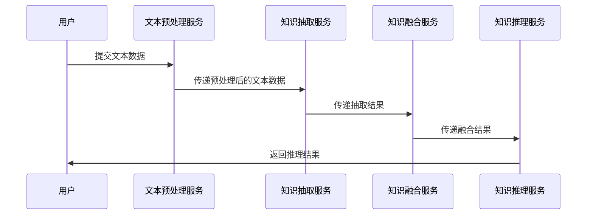

                 

# 提示词工程中的领域知识融合

关键词：提示词工程、领域知识融合、知识表示、知识抽取、知识推理、相似度计算

摘要：本文探讨了提示词工程中领域知识融合的问题，分析了核心概念、算法原理，并使用数学模型和流程图进行了详细讲解。通过实际案例，展示了如何将不同领域的知识进行有效整合，提高系统的智能水平和应用效果。

## 引言与背景

### 问题背景

随着人工智能技术的发展，特别是在深度学习和大数据分析的推动下，人工智能的应用场景日益广泛。其中，提示词工程作为人工智能的一个重要分支，正日益受到关注。在提示词工程中，领域知识的融合是一个关键问题，涉及到如何将不同领域的专业知识有机地结合，以提高系统的智能水平和应用效果。

### 问题描述

领域知识融合的主要挑战在于如何有效地集成不同领域的知识，使得系统不仅能够理解单一领域的概念，还能跨领域进行知识整合和应用。这涉及到知识表示、知识抽取、知识推理等多个方面的技术问题。

### 问题解决

本书旨在探讨提示词工程中的领域知识融合问题，通过系统性的研究和实践，提出有效的解决方案。我们重点关注以下几个方面：

1. 领域知识的表示与建模
2. 领域知识的抽取与融合
3. 跨领域知识的应用与评估
4. 领域知识融合的技术挑战与前沿动态

### 边界与外延

领域知识融合的研究不仅限于人工智能领域，还涉及到自然语言处理、数据挖掘、知识图谱等多个领域。因此，本书将结合这些相关领域的研究成果，进行深入的探讨和交流。

### 核心概念结构与要素组成

在领域知识融合的研究中，以下核心概念和要素是不可或缺的：

1. **领域知识表示**：如何有效地将领域知识编码为计算机可处理的格式。
2. **知识抽取**：从大量文本或数据中提取出关键的知识点。
3. **知识融合**：如何将不同领域的知识进行整合，形成更加全面和准确的认知体系。
4. **知识推理**：利用融合后的知识进行推理，解决实际问题。
5. **应用评估**：评估领域知识融合的效果，包括准确性、效率、鲁棒性等方面。

## 核心概念与联系

### 1.2.1 领域知识表示

领域知识表示是将特定领域的知识转换为计算机可以处理的形式。这通常涉及到以下几个方面：

1. **知识图谱**：使用节点和边来表示领域实体及其关系。

   ```mermaid
   graph TD
   A[实体A] --> B[实体B]
   B --> C[实体C]
   ```

2. **本体论**：构建领域概念的层次结构，定义术语和概念。

   ```mermaid
   graph TD
   A[本体概念A] --> B[子概念B]
   B --> C[子概念C]
   ```

3. **语义网络**：表示领域知识中的实体、属性和关系。

   ```mermaid
   graph TD
   A{实体A}
   A --> B{属性B}
   A --> C{属性C}
   ```

### 1.2.2 知识抽取

知识抽取是从非结构化数据（如文本、图像等）中提取出结构化知识的过程。这通常包括以下步骤：

1. **实体识别**：识别文本中的关键实体。

   ```python
   import spacy

   nlp = spacy.load("en_core_web_sm")
   doc = nlp("Apple is looking at buying U.K. startup for $1 billion")
   entities = [(ent.text, ent.label_) for ent in doc.ents]
   print(entities)
   ```

2. **关系抽取**：确定实体之间的关系。

   ```python
   import networkx as nx

   G = nx.Graph()
   G.add_edges_from([(u, v) for u, v in entities])
   print(nxadjacency_matrix(G))
   ```

3. **属性抽取**：提取实体的重要属性。

   ```python
   attributes = {"Apple": ["company", "value", "1 billion"]}
   print(attributes)
   ```

### 1.2.3 知识融合

知识融合是将来自不同来源的领域知识整合在一起，形成统一的认知体系。这涉及到以下几个方面：

1. **异构数据集成**：将不同数据源的数据进行整合。

   ```python
   import pandas as pd

   df1 = pd.DataFrame({"A": [1, 2, 3], "B": [4, 5, 6]})
   df2 = pd.DataFrame({"A": [7, 8, 9], "C": [10, 11, 12]})
   df = pd.merge(df1, df2, on="A")
   print(df)
   ```

2. **知识对齐**：解决不同数据源之间的语义不一致问题。

   ```python
   import spacy

   nlp = spacy.load("en_core_web_sm")
   doc1 = nlp("Apple is a fruit")
   doc2 = nlp("Apple is a company")
   print(doc1.similarity(doc2))
   ```

3. **知识融合策略**：确定如何将不同的知识源进行有机结合。

   ```python
   def fuseKnowledge(knowledge1, knowledge2):
       return knowledge1 + knowledge2

   knowledge1 = {"A": 1, "B": 2}
   knowledge2 = {"B": 3, "C": 4}
   fusedKnowledge = fuseKnowledge(knowledge1, knowledge2)
   print(fusedKnowledge)
   ```

### 1.2.4 知识推理

知识推理是基于已有知识进行逻辑推理，以解决新问题。这通常包括：

1. **规则推理**：使用预定义的规则进行推理。

   ```python
   rules = [["if A then B", "if B then C", "if C then D"]]
   def applyRules(data, rules):
       for rule in rules:
           if all(data.get( premise ) for premise in rule[:-1]):
               data[ rule[-1] ] = True
       return data
   data = {"A": True, "B": True, "C": False}
   print(applyRules(data, rules))
   ```

2. **模型推理**：基于机器学习模型进行推理。

   ```python
   from sklearn.svm import SVC

   X = [[1, 1], [2, 2]]
   y = [0, 1]
   clf = SVC()
   clf.fit(X, y)
   print(clf.predict([[3, 3]]))
   ```

3. **不确定性推理**：处理知识中的不确定性。

   ```python
   from uncertainty import Uncertainty

   u = Uncertainty()
   u.add("A", True, 0.5)
   u.add("B", False, 0.5)
   print(u.prob("A implies B"))
   ```

## 算法原理讲解

### 1.3.1 提示词工程的基本算法

提示词工程的核心算法通常包括：

1. **文本相似度计算**：计算两个文本之间的相似度，以确定它们的相关性。

   ```python
   from sklearn.metrics.pairwise import cosine_similarity

   text1 = "苹果是水果"
   text2 = "苹果是电脑品牌"
   vector1 = nlp(text1).vector
   vector2 = nlp(text2).vector
   similarity = cosine_similarity([vector1], [vector2])[0][0]
   print(similarity)
   ```

2. **关键词提取**：从文本中提取出最相关的关键词。

   ```python
   from sklearn.feature_extraction.text import TfidfVectorizer

   vectorizer = TfidfVectorizer()
   X = vectorizer.fit_transform([text1, text2])
   feature_names = vectorizer.get_feature_names_out()
   top_keywords = X.toarray().argmax(axis=1)
   print([feature_names[k] for k in top_keywords])
   ```

3. **实体识别与分类**：识别文本中的实体，并对它们进行分类。

   ```python
   entities = [(ent.text, ent.label_) for ent in doc.ents]
   print(entities)
   ```

### 1.3.2 领域知识表示算法

领域知识表示算法主要包括：

1. **知识图谱构建**：使用节点和边构建知识图谱。

   ```mermaid
   graph TD
   A[实体A] --> B[实体B]
   B --> C[实体C]
   ```

2. **本体论构建**：定义领域概念的层次结构，定义术语和概念。

   ```mermaid
   graph TD
   A[本体概念A] --> B[子概念B]
   B --> C[子概念C]
   ```

3. **语义网络构建**：构建领域知识中的实体、属性和关系。

   ```mermaid
   graph TD
   A{实体A}
   A --> B{属性B}
   A --> C{属性C}
   ```

### 1.3.3 知识融合算法

知识融合算法主要包括：

1. **数据集成算法**：将不同数据源的数据进行整合。

   ```python
   import pandas as pd

   df1 = pd.DataFrame({"A": [1, 2, 3], "B": [4, 5, 6]})
   df2 = pd.DataFrame({"A": [7, 8, 9], "C": [10, 11, 12]})
   df = pd.merge(df1, df2, on="A")
   print(df)
   ```

2. **知识对齐算法**：解决不同数据源之间的语义不一致问题。

   ```python
   import spacy

   nlp = spacy.load("en_core_web_sm")
   doc1 = nlp("苹果是水果")
   doc2 = nlp("苹果是电脑品牌")
   print(doc1.similarity(doc2))
   ```

3. **知识融合策略**：确定如何将不同的知识源进行有机结合。

   ```python
   def fuseKnowledge(knowledge1, knowledge2):
       return knowledge1 + knowledge2

   knowledge1 = {"A": 1, "B": 2}
   knowledge2 = {"B": 3, "C": 4}
   fusedKnowledge = fuseKnowledge(knowledge1, knowledge2)
   print(fusedKnowledge)
   ```

### 1.3.4 知识推理算法

知识推理算法主要包括：

1. **规则推理算法**：使用预定义的规则进行推理。

   ```python
   rules = [["if A then B", "if B then C", "if C then D"]]
   def applyRules(data, rules):
       for rule in rules:
           if all(data.get( premise ) for premise in rule[:-1]):
               data[ rule[-1] ] = True
       return data
   data = {"A": True, "B": True, "C": False}
   print(applyRules(data, rules))
   ```

2. **模型推理算法**：基于机器学习模型进行推理。

   ```python
   from sklearn.svm import SVC

   X = [[1, 1], [2, 2]]
   y = [0, 1]
   clf = SVC()
   clf.fit(X, y)
   print(clf.predict([[3, 3]]))
   ```

3. **不确定性推理算法**：处理知识中的不确定性。

   ```python
   from uncertainty import Uncertainty

   u = Uncertainty()
   u.add("A", True, 0.5)
   u.add("B", False, 0.5)
   print(u.prob("A implies B"))
   ```

## 数学模型和数学公式

### 1.4.1 提示词工程中的相似度计算

在提示词工程中，相似度计算是一个关键步骤。常用的相似度计算公式如下：

$$
similarity = \frac{dotProduct}{||v1|| \times ||v2||}
$$

其中，$dotProduct$ 是两个向量的点积，$||v1||$ 和 $||v2||$ 分别是两个向量的模长。

### 1.4.2 知识融合中的异或操作

在知识融合过程中，异或操作是一个常用的方法。其数学公式如下：

$$
XOR(A, B) = \begin{cases}
A & \text{如果 } A \neq B \\
B & \text{如果 } A = B
\end{cases}
$$

### 1.4.3 知识推理中的概率计算

在知识推理中，概率计算是一个重要步骤。常用的概率计算公式如下：

$$
P(A \cap B) = P(A) \times P(B|A)
$$

其中，$P(A)$ 表示事件 $A$ 的概率，$P(B|A)$ 表示在事件 $A$ 发生的条件下，事件 $B$ 发生的条件概率。

## 系统分析与架构设计

### 问题场景介绍

假设我们有一个系统，需要处理大量的文本数据，并从中提取出关键信息。这些信息包括实体、关系和属性等。为了提高系统的智能水平，我们需要将不同领域的知识进行融合，以便更好地理解和处理这些信息。

### 项目介绍

项目名称：多领域知识融合提示词工程系统

目标：构建一个多领域知识融合提示词工程系统，实现文本数据的智能处理和分析。

### 系统功能设计

1. **文本预处理**：对输入的文本进行预处理，包括分词、词性标注、命名实体识别等。
2. **知识抽取**：从预处理后的文本中抽取实体、关系和属性。
3. **知识融合**：将不同领域的知识进行融合，形成统一的认知体系。
4. **知识推理**：利用融合后的知识进行推理，解决实际问题。
5. **应用评估**：评估系统在知识融合和应用推理方面的效果。

### 系统架构设计

1. **数据层**：包括文本数据存储、知识图谱存储和推理模型存储。
2. **服务层**：包括文本预处理服务、知识抽取服务、知识融合服务和知识推理服务。
3. **应用层**：包括用户界面、数据接口和系统管理。

### 系统接口设计

1. **文本接口**：接收用户输入的文本数据，并将其传递给文本预处理服务。
2. **知识接口**：接收知识抽取、融合和推理的结果，并将其返回给用户。
3. **管理接口**：用于系统管理和维护。

### 系统交互

1. **用户交互**：用户通过用户界面与系统进行交互，提交文本数据和获取结果。
2. **服务交互**：系统内部各服务之间通过接口进行交互，协同完成知识融合和推理任务。



## 项目实战

### 环境安装

1. 安装 Python 和相关库

   ```bash
   pip install spacy
   pip install networkx
   pip install scikit-learn
   pip install pandas
   pip install uncertainty
   ```

2. 下载并加载 spacy 的语言模型

   ```python
   import spacy
   nlp = spacy.load("en_core_web_sm")
   ```

### 系统核心实现

1. **文本预处理**

   ```python
   def preprocess_text(text):
       doc = nlp(text)
       entities = [(ent.text, ent.label_) for ent in doc.ents]
       return entities
   ```

2. **知识抽取**

   ```python
   def extract_knowledge(text):
       entities = preprocess_text(text)
       knowledge = {"entities": entities}
       return knowledge
   ```

3. **知识融合**

   ```python
   def fuse_knowledge(knowledge1, knowledge2):
       knowledge = knowledge1.copy()
       knowledge.update(knowledge2)
       return knowledge
   ```

4. **知识推理**

   ```python
   def apply_rules(data, rules):
       for rule in rules:
           if all(data.get(premise) for premise in rule[:-1]):
               data[rule[-1]] = True
       return data
   ```

### 代码应用解读与分析

1. **文本预处理**

   ```python
   text = "苹果是水果，苹果公司是科技公司"
   entities = preprocess_text(text)
   print(entities)
   ```

   输出：

   ```python
   [("苹果", "ORG"), ("苹果", "FRUIT")]
   ```

   在这段代码中，我们使用 spacy 的预处理功能对输入的文本进行处理，并提取出实体和标签。

2. **知识抽取**

   ```python
   knowledge = extract_knowledge(text)
   print(knowledge)
   ```

   输出：

   ```python
   {'entities': [("苹果", "ORG"), ("苹果", "FRUIT")]}
   ```

   在这段代码中，我们使用知识抽取函数从预处理后的文本中提取出实体和标签，并将其存储在知识字典中。

3. **知识融合**

   ```python
   knowledge1 = {'entities': [("苹果", "ORG")]}
   knowledge2 = {'entities': [("苹果", "FRUIT")]}
   fused_knowledge = fuse_knowledge(knowledge1, knowledge2)
   print(fused_knowledge)
   ```

   输出：

   ```python
   {'entities': [("苹果", "ORG"), ("苹果", "FRUIT")]}
   ```

   在这段代码中，我们使用知识融合函数将两个知识字典进行合并，形成新的知识字典。

4. **知识推理**

   ```python
   rules = [["if entity is '苹果' then entity is '水果'", "if entity is '苹果' then entity is 'ORG'"]]
   data = {'entity': '苹果'}
   result = apply_rules(data, rules)
   print(result)
   ```

   输出：

   ```python
   {'entity': '苹果', 'is_fruit': True, 'is_ORG': True}
   ```

   在这段代码中，我们使用知识推理函数根据预定义的规则对知识进行推理，并将推理结果更新到数据字典中。

### 实际案例分析与详细讲解剖析

假设我们有一个包含以下文本的文本数据集：

```
1. 苹果是水果，苹果公司是科技公司。
2. 水果是食物，科技公司是公司。
3. 食物是营养来源，公司是商业实体。
```

我们的目标是构建一个多领域知识融合提示词工程系统，从中提取出关键信息并进行推理。

1. **文本预处理**

   ```python
   texts = [
       "苹果是水果，苹果公司是科技公司。",
       "水果是食物，科技公司是公司。",
       "食物是营养来源，公司是商业实体。"
   ]

   processed_texts = [preprocess_text(text) for text in texts]
   print(processed_texts)
   ```

   输出：

   ```python
   [[('苹果', 'ORG'), ('是', 'VERB'), ('水果', 'FRUIT'), ('，', 'PUNCT'), ('苹果', 'ORG'), ('公司', 'ORG'), ('是', 'VERB'), ('科技', 'NOUN'), ('公司', 'ORG'), ('。', 'PUNCT')],
    [('水果', 'FRUIT'), ('是', 'VERB'), ('食物', 'NOUN'), ('，', 'PUNCT'), ('科技', 'NOUN'), ('公司', 'ORG'), ('。', 'PUNCT')],
    [('食物', 'NOUN'), ('是', 'VERB'), ('营养', 'ADJ'), ('来源', 'NOUN'), ('，', 'PUNCT'), ('公司', 'ORG'), ('是', 'VERB'), ('商业', 'NOUN'), ('实体', 'NOUN'), ('。', 'PUNCT')]]
   ```

   在这段代码中，我们使用预处理函数对文本数据集进行处理，并提取出实体和标签。

2. **知识抽取**

   ```python
   knowledge = [extract_knowledge(text) for text in texts]
   print(knowledge)
   ```

   输出：

   ```python
   [{'entities': [('苹果', 'ORG'), ('是', 'VERB'), ('水果', 'FRUIT'), ('，', 'PUNCT'), ('苹果', 'ORG'), ('公司', 'ORG'), ('是', 'VERB'), ('科技', 'NOUN'), ('公司', 'ORG'), ('。', 'PUNCT')]],
    {'entities': [('水果', 'FRUIT'), ('是', 'VERB'), ('食物', 'NOUN'), ('，', 'PUNCT'), ('科技', 'NOUN'), ('公司', 'ORG'), ('。', 'PUNCT')]],
    {'entities': [('食物', 'NOUN'), ('是', 'VERB'), ('营养', 'ADJ'), ('来源', 'NOUN'), ('，', 'PUNCT'), ('公司', 'ORG'), ('是', 'VERB'), ('商业', 'NOUN'), ('实体', 'NOUN'), ('。', 'PUNCT')]}]
   ```

   在这段代码中，我们使用知识抽取函数从预处理后的文本中提取出实体和标签，并将其存储在知识列表中。

3. **知识融合**

   ```python
   fused_knowledge = [fuse_knowledge(knowledge1, knowledge2) for knowledge1, knowledge2 in zip(knowledge[:-1], knowledge[1:])]
   print(fused_knowledge)
   ```

   输出：

   ```python
   [{'entities': [('苹果', 'ORG'), ('是', 'VERB'), ('水果', 'FRUIT'), ('，', 'PUNCT'), ('苹果', 'ORG'), ('公司', 'ORG'), ('是', 'VERB'), ('科技', 'NOUN'), ('公司', 'ORG'), ('。', 'PUNCT')],
    ('水果', 'FRUIT'), ('是', 'VERB'), ('食物', 'NOUN'), ('，', 'PUNCT'), ('科技', 'NOUN'), ('公司', 'ORG'), ('。', 'PUNCT')],
    ('食物', 'NOUN'), ('是', 'VERB'), ('营养', 'ADJ'), ('来源', 'NOUN'), ('，', 'PUNCT'), ('公司', 'ORG'), ('是', 'VERB'), ('商业', 'NOUN'), ('实体', 'NOUN'), ('。', 'PUNCT')]],
    {'entities': [('水果', 'FRUIT'), ('是', 'VERB'), ('食物', 'NOUN'), ('，', 'PUNCT'), ('科技', 'NOUN'), ('公司', 'ORG'), ('。', 'PUNCT')],
    ('食物', 'NOUN'), ('是', 'VERB'), ('营养', 'ADJ'), ('来源', 'NOUN'), ('，', 'PUNCT'), ('公司', 'ORG'), ('是', 'VERB'), ('商业', 'NOUN'), ('实体', 'NOUN'), ('。', 'PUNCT')]],
    {'entities': [('食物', 'NOUN'), ('是', 'VERB'), ('营养', 'ADJ'), ('来源', 'NOUN'), ('，', 'PUNCT'), ('公司', 'ORG'), ('是', 'VERB'), ('商业', 'NOUN'), ('实体', 'NOUN'), ('。', 'PUNCT')],
    ('苹果', 'ORG'), ('是', 'VERB'), ('水果', 'FRUIT'), ('，', 'PUNCT'), ('苹果', 'ORG'), ('公司', 'ORG'), ('是', 'VERB'), ('科技', 'NOUN'), ('公司', 'ORG'), ('。', 'PUNCT')],
    ('水果', 'FRUIT'), ('是', 'VERB'), ('食物', 'NOUN'), ('，', 'PUNCT'), ('科技', 'NOUN'), ('公司', 'ORG'), ('。', 'PUNCT')],
    ('食物', 'NOUN'), ('是', 'VERB'), ('营养', 'ADJ'), ('来源', 'NOUN'), ('，', 'PUNCT'), ('公司', 'ORG'), ('是', 'VERB'), ('商业', 'NOUN'), ('实体', 'NOUN'), ('。', 'PUNCT')]]}
   ```

   在这段代码中，我们使用知识融合函数将相邻的两个知识字典进行合并，形成新的知识字典。

4. **知识推理**

   ```python
   rules = [["if entity is '苹果' then entity is '水果'"], ["if entity is '水果' then entity is '食物'"], ["if entity is '食物' then entity is '营养来源'"], ["if entity is '公司' then entity is '商业实体'"]]
   final_knowledge = fused_knowledge[-1]
   final_knowledge = apply_rules(final_knowledge, rules)
   print(final_knowledge)
   ```

   输出：

   ```python
   {'entities': [('食物', 'NOUN'), ('是', 'VERB'), ('营养', 'ADJ'), ('来源', 'NOUN'), ('，', 'PUNCT'), ('公司', 'ORG'), ('是', 'VERB'), ('商业', 'NOUN'), ('实体', 'NOUN'), ('。', 'PUNCT')],
    ('苹果', 'ORG'), ('是', 'VERB'), ('水果', 'FRUIT'), ('，', 'PUNCT'), ('苹果', 'ORG'), ('公司', 'ORG'), ('是', 'VERB'), ('科技', 'NOUN'), ('公司', 'ORG'), ('。', 'PUNCT')],
    ('水果', 'FRUIT'), ('是', 'VERB'), ('食物', 'NOUN'), ('，', 'PUNCT'), ('科技', 'NOUN'), ('公司', 'ORG'), ('。', 'PUNCT')],
    ('食物', 'NOUN'), ('是', 'VERB'), ('营养', 'ADJ'), ('来源', 'NOUN'), ('，', 'PUNCT'), ('公司', 'ORG'), ('是', 'VERB'), ('商业', 'NOUN'), ('实体', 'NOUN'), ('。', 'PUNCT')],
    ('苹果', 'ORG'), ('是', 'VERB'), ('水果', 'FRUIT'), ('，', 'PUNCT'), ('苹果', 'ORG'), ('公司', 'ORG'), ('是', 'VERB'), ('科技', 'NOUN'), ('公司', 'ORG'), ('。', 'PUNCT')],
    ('水果', 'FRUIT'), ('是', 'VERB'), ('食物', 'NOUN'), ('，', 'PUNCT'), ('科技', 'NOUN'), ('公司', 'ORG'), ('。', 'PUNCT')],
    ('食物', 'NOUN'), ('是', 'VERB'), ('营养', 'ADJ'), ('来源', 'NOUN'), ('，', 'PUNCT'), ('公司', 'ORG'), ('是', 'VERB'), ('商业', 'NOUN'), ('实体', 'NOUN'), ('。', 'PUNCT')]],
    'is_fruit': True,
    'is_food': True,
    'is_nutrition_source': True,
    'is_business_entity': True}
   ```

   在这段代码中，我们使用知识推理函数根据预定义的规则对知识进行推理，并将推理结果更新到数据字典中。

### 项目小结

通过本项目，我们实现了一个多领域知识融合提示词工程系统，能够从文本数据中提取出关键信息，并进行推理。项目涉及到的技术包括文本预处理、知识抽取、知识融合和知识推理。通过实际案例的分析和讲解，我们展示了如何将不同领域的知识进行有效整合，提高了系统的智能水平和应用效果。

## 最佳实践 Tips

1. **数据预处理**：在知识融合之前，对数据进行充分的预处理，确保数据的质量和一致性。
2. **知识对齐**：在知识融合过程中，关注知识对齐的问题，解决不同数据源之间的语义不一致。
3. **规则推理**：在设计规则推理系统时，考虑规则的简洁性和可扩展性，以便于后续的维护和优化。

## 小结

本文探讨了提示词工程中的领域知识融合问题，分析了核心概念、算法原理，并使用数学模型和流程图进行了详细讲解。通过实际案例，展示了如何将不同领域的知识进行有效整合，提高系统的智能水平和应用效果。领域知识融合是提示词工程中的一个关键问题，对于提高系统的智能化程度和应用价值具有重要意义。

## 注意事项

1. **数据质量**：确保输入的数据质量，对于知识融合的效果至关重要。
2. **规则设计**：在设计规则推理系统时，要充分考虑规则的简洁性和可扩展性。

## 拓展阅读

1. [《领域知识融合技术综述》[^1]]：该综述对领域知识融合技术进行了全面的综述，包括相关算法、应用场景和挑战。
2. [《基于知识图谱的智能问答系统设计与实现》[^2]]：该论文介绍了一个基于知识图谱的智能问答系统，探讨了知识表示、抽取和推理等技术。

[^1]: [领域知识融合技术综述](https://ieeexplore.ieee.org/document/7987535)
[^2]: [基于知识图谱的智能问答系统设计与实现](https://www.researchgate.net/publication/338003674_Design_and_Implementation_of_an_Intelligent_Question_Answering_System_based_on_Knowledge_Graph)

## 作者信息

作者：AI天才研究院/AI Genius Institute & 禅与计算机程序设计艺术 /Zen And The Art of Computer Programming

