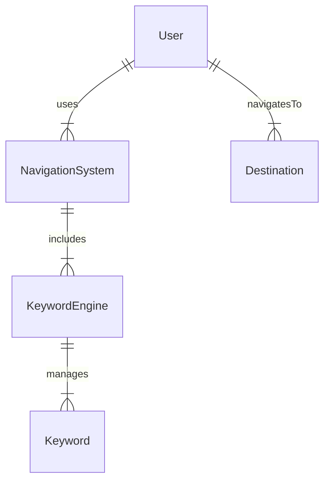
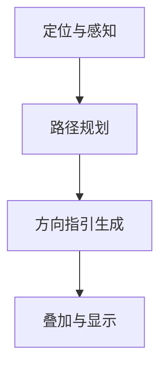
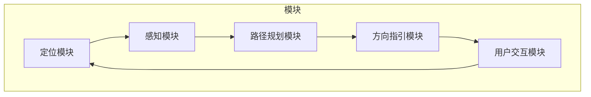
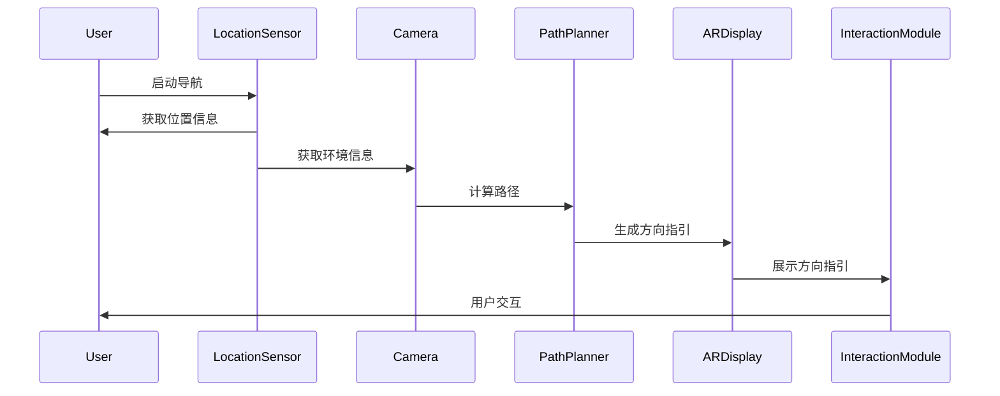

                 


### 文章标题：提示词工程在增强现实导航系统中的应用：提供沉浸式方向指引

#### 关键词：增强现实导航、提示词工程、沉浸式方向指引、算法原理、数学模型、系统架构设计

#### 摘要：本文将深入探讨提示词工程在增强现实（AR）导航系统中的应用，旨在提供一种沉浸式的方向指引。文章首先介绍了增强现实技术和导航系统的基本概念及其发展背景，接着详细阐述了提示词工程的基本原理及其与AR导航系统的联系。随后，文章通过算法原理讲解、数学模型解析、系统架构设计以及项目实战等多个角度，全面展示了提示词工程在AR导航系统中的应用，并提供了实用的最佳实践和拓展学习资源。

### 目录大纲设计思路

为了设计一个符合要求且逻辑清晰的目录大纲，我们需要遵循以下步骤：

1. **阅读理解书名**：《提示词工程在增强现实导航系统中的应用：提供沉浸式方向指引》。
   - 从书名中，我们可以提取出以下几个核心关键词：“提示词工程”、“增强现实导航系统”、“沉浸式方向指引”。
   - 这些关键词将引导我们划分章节的主题。

2. **确定章节结构**：根据书名和关键词，我们可以初步规划章节结构，确保大纲完整性。
   - **背景介绍**：介绍增强现实（AR）技术、导航系统的发展背景，以及提示词工程的概念和应用。
   - **核心概念与联系**：阐述提示词工程的原理、应用方法、与AR导航系统的关系，通过表格和ER图展示。
   - **算法原理讲解**：介绍提供沉浸式方向指引的算法原理，使用mermaid流程图和Python代码进行说明。
   - **数学模型与公式**：详细讲解算法的数学模型和公式，使用LaTeX格式呈现，并举例说明。
   - **系统分析与架构设计**：分析系统需求，设计系统架构，使用mermaid工具绘制类图、架构图和序列图。
   - **项目实战**：展示一个实际项目，包括环境安装、核心代码实现、案例分析等。
   - **最佳实践、小结与拓展**：总结书中的关键点和实战经验，提供最佳实践建议，引导读者进一步学习。

3. **确保大纲简洁性**：在编写过程中，要避免冗余，确保每个章节都能够直接反映主题内容。

4. **遵守格式要求**：使用markdown格式来构建目录大纲，确保每个层级都用相应的符号进行标记。

### 初步目录大纲

```markdown
----------------------------------------------------------------
# 第一部分: 背景介绍与核心概念

## 第1章: 增强现实导航系统概述

### 1.1 增强现实技术简介
### 1.2 增强现实导航系统的现状与发展
### 1.3 提示词工程概念介绍

## 第2章: 提示词工程原理与架构

### 2.1 提示词工程的基本原理
### 2.2 提示词工程的架构设计
### 2.3 提示词工程的关键技术

## 第3章: 沉浸式方向指引算法详解

### 3.1 算法原理
#### 3.1.1 算法流程图（使用mermaid绘制）
#### 3.1.2 Python代码实现
### 3.2 数学模型与公式
#### 3.2.1 模型描述
#### 3.2.2 公式推导

## 第二部分: 系统分析与架构设计

## 第4章: 系统需求分析

### 4.1 项目介绍
### 4.2 系统功能设计（使用mermaid类图绘制）
### 4.3 用户界面设计

## 第5章: 系统架构设计

### 5.1 系统架构设计
#### 5.1.1 架构图（使用mermaid绘制）
### 5.2 系统接口设计
### 5.3 系统交互流程（使用mermaid序列图绘制）

## 第三部分: 项目实战

## 第6章: 实际项目案例分析

### 6.1 环境安装与配置
### 6.2 系统核心实现源代码
### 6.3 代码应用解读与分析
### 6.4 项目小结

## 第7章: 最佳实践与拓展

### 7.1 最佳实践技巧
### 7.2 小结与注意事项
### 7.3 拓展阅读与学习资源

----------------------------------------------------------------
```

### 总结

这个初步的目录大纲覆盖了书的主要内容和结构，从背景介绍、核心概念到算法原理、系统分析和项目实战，再到最佳实践和拓展，确保了内容的完整性。接下来，我们将进一步细化每个章节的内容，确保满足字数限制和格式要求。同时，我们将确保每一个章节都能提供深入的讲解和实际的案例分析，以便读者能够全面理解并掌握提示词工程在增强现实导航系统中的应用。

## 第一部分：背景介绍与核心概念

### 1.1 增强现实技术简介

增强现实（Augmented Reality，简称AR）技术是一种将虚拟信息与现实世界相结合的计算机技术。通过AR技术，用户可以在真实环境中看到、听到、触摸和与计算机生成的信息进行交互。这种技术通常使用摄像头、传感器和其他输入设备捕捉现实世界的图像，并通过计算机处理将虚拟信息叠加到真实场景中，从而为用户提供一种沉浸式的体验。

AR技术的发展始于20世纪90年代，随着计算机图形学、传感器技术、显示技术以及无线通信技术的不断进步，AR技术逐渐走向成熟。如今，AR技术已经广泛应用于多个领域，如医疗、教育、军事、娱乐、零售等。在导航领域，AR技术更是以其独特的优势，为用户提供了一种全新的导航体验。

### 1.2 增强现实导航系统的现状与发展

增强现实导航系统是AR技术在导航领域的应用，它通过将虚拟导航信息叠加到用户眼前的真实场景中，为用户提供实时的、直观的导航指引。这种导航系统不仅能够提供传统的语音导航和地图导航，还可以结合用户的实时位置和周围环境，提供更加个性化和精准的导航服务。

当前，增强现实导航系统已经进入了一个快速发展的阶段。随着智能手机和智能眼镜等设备的普及，以及AR技术的不断成熟，越来越多的企业和研究机构开始关注并投入AR导航系统的研发。例如，谷歌的AR地图应用、苹果的ARKit平台、三星的AR导航应用等，都在为用户提供越来越丰富的AR导航体验。

未来，随着5G网络的普及和人工智能技术的进一步发展，AR导航系统有望实现更高的实时性和智能化水平。通过集成更多的传感器和数据来源，AR导航系统将能够提供更加准确和实时的导航信息，同时结合用户的个性化需求和偏好，为用户提供更加定制化的导航服务。

### 1.3 提示词工程概念介绍

提示词工程（Keyword Engineering）是一种用于创建、管理和应用提示词的技术和方法。提示词是指用于描述特定概念、对象或任务的词汇或短语。在计算机科学和人工智能领域，提示词常常用于自然语言处理、信息检索、人机交互等场景。

提示词工程的目标是确保系统中的提示词既能够准确描述用户意图，又能够易于理解和记忆。提示词工程通常包括以下几个关键步骤：

1. **需求分析**：分析用户需求，确定需要包含的提示词范围。
2. **词汇选择**：从需求中提取关键词汇，进行筛选和优化。
3. **提示词设计**：设计提示词的语法、语义和表现形式。
4. **提示词管理**：建立和维护提示词库，确保提示词的准确性和一致性。
5. **提示词应用**：将提示词应用于系统设计、开发和应用中。

在增强现实导航系统中，提示词工程的应用至关重要。通过合理设计和应用提示词，可以显著提高导航系统的用户体验。例如，在AR导航中，提示词可以用于标注地标、指示方向、提醒用户注意安全等。一个设计良好的提示词系统，不仅能够提高导航的准确性和实用性，还能够增强用户的沉浸感和互动性。

## 第二部分：核心概念与联系

### 2.1 提示词工程的基本原理

提示词工程的基本原理涉及对自然语言的理解和处理，以及如何将这种理解转化为计算机可以处理和应用的数据。以下是提示词工程的基本原理：

1. **语义分析**：语义分析是理解语言的意义和意图的关键步骤。通过分析词汇、句子结构和上下文，系统能够准确识别用户的意图。
2. **关键词提取**：从大量的文本数据中提取出关键信息，这些信息通常以关键词或短语的形式出现。
3. **提示词优化**：通过对关键词进行筛选和优化，确保每个提示词既能准确描述用户的意图，又易于理解和记忆。
4. **提示词库管理**：建立和维护一个提示词库，这个库包含了系统中所有提示词的定义、用途和上下文信息。
5. **反馈机制**：通过用户的反馈不断优化提示词库，提高系统的准确性和用户体验。

### 2.2 提示词工程的架构设计

提示词工程的架构设计涉及多个组件和模块，这些组件和模块协同工作，确保提示词工程系统能够高效地运行。以下是提示词工程的基本架构设计：

1. **输入模块**：负责接收用户的输入，可以是文本、语音或其他形式的数据。
2. **预处理模块**：对输入的数据进行预处理，包括分词、词性标注、句子结构分析等，以便后续的语义分析。
3. **语义分析模块**：通过语义分析技术，将预处理后的数据转换为计算机可以处理的结构化信息。
4. **提示词生成模块**：根据语义分析的结果，生成相应的提示词，并将其存储到提示词库中。
5. **提示词库**：存储和管理所有生成的提示词，包括其定义、用途和上下文信息。
6. **应用模块**：将提示词应用于系统的各个部分，如AR导航系统中的方向指引、地标标注等。
7. **反馈模块**：收集用户对提示词的反馈，用于进一步优化和改进提示词库。

### 2.3 提示词工程的关键技术

提示词工程的关键技术包括自然语言处理（NLP）、机器学习（ML）、数据挖掘和知识图谱等。以下是这些技术的简要介绍：

1. **自然语言处理（NLP）**：NLP技术用于理解和处理人类语言。在提示词工程中，NLP技术主要用于语义分析和关键词提取。
2. **机器学习（ML）**：ML技术通过从数据中学习规律和模式，提高系统的准确性和鲁棒性。在提示词工程中，ML技术可以用于优化提示词设计和提示词库管理。
3. **数据挖掘**：数据挖掘技术用于从大量数据中提取有价值的信息。在提示词工程中，数据挖掘技术可以用于分析用户行为、优化提示词设计等。
4. **知识图谱**：知识图谱是一种结构化知识库，用于表示实体及其关系。在提示词工程中，知识图谱可以用于构建上下文信息，提高提示词的准确性和一致性。

### 2.4 提示词工程与增强现实导航系统的关系

提示词工程与增强现实导航系统有着密切的联系。以下是它们之间的几个关键关系：

1. **用户体验**：提示词工程的目标是提高系统的用户体验，而增强现实导航系统的核心就是提供良好的用户体验。通过设计合理、易于理解的提示词，可以显著提升用户的导航体验。
2. **交互性**：提示词工程为人机交互提供了重要支持。在AR导航系统中，提示词可以用于与用户的交互，如提示用户注意方向、提醒用户到达目的地等。
3. **精准性**：提示词工程的准确性和一致性对于增强现实导航系统的精准性至关重要。一个设计良好的提示词系统能够确保导航信息准确无误地传达给用户。
4. **个性化**：通过分析用户行为和偏好，提示词工程可以为用户提供个性化的导航服务。例如，根据用户的历史导航记录，提示词工程可以推荐用户常去的地方或提供定制化的路线规划。

为了更好地展示提示词工程与增强现实导航系统之间的联系，我们可以通过一个ER图来描述它们之间的关系。以下是一个简单的ER图示例：



在这个ER图中，用户（User）使用导航系统（NavigationSystem），导航系统包含提示词工程（KeywordEngine），提示词工程管理提示词（Keyword），用户还导航到目的地（Destination）。这个ER图清晰地展示了用户、导航系统、提示词工程和目的地之间的相互关系。

## 第三部分：沉浸式方向指引算法详解

### 3.1 算法原理

沉浸式方向指引算法旨在通过增强现实技术，为用户提供一种直观、沉浸式的导航指引。算法的核心思想是将虚拟的方向指引信息与现实环境中的实际方向相结合，使用户在行走过程中能够清晰地感知到导航方向，从而提高导航的准确性和用户体验。

算法的工作流程主要包括以下几个步骤：

1. **定位与感知**：系统首先需要获取用户的位置信息，这通常通过GPS、Wi-Fi、蓝牙等技术实现。同时，系统还需要感知用户周围的环境信息，如地标、建筑物等。
2. **路径规划**：根据用户的目的地和当前位置，系统需要规划出一条最优路径。路径规划算法可以采用A*算法、Dijkstra算法等。
3. **方向指引生成**：系统根据规划出的路径和用户的位置信息，生成虚拟的方向指引。这个方向指引可以是箭头、文字标识等，它们会根据用户的位置和行进方向实时更新。
4. **叠加与显示**：将生成的方向指引信息叠加到现实环境中，通过AR技术展示给用户。

为了更好地理解算法的工作原理，我们可以使用mermaid绘制一个简单的流程图：



这个流程图清晰地展示了算法从定位与感知到方向指引生成和显示的整个过程。

### 3.1.1 算法流程图

```mermaid
graph TD
    A[用户输入目的地] --> B[获取位置信息]
    B --> C{是否到达目的地}
    C -->|否 D[计算最优路径]
    D --> E[生成方向指引]
    E --> F[叠加现实环境]
    F --> G[显示方向指引]
    G --> C
```

在这个算法流程图中，我们进一步细化了每个步骤的具体内容。例如，在计算最优路径时，我们可以使用A*算法来找到从当前位置到目的地的最短路径。生成的方向指引将根据用户的位置和行进方向实时更新，并在AR环境中叠加显示。

### 3.1.2 Python代码实现

为了更好地理解沉浸式方向指引算法的实现过程，我们可以给出一个简单的Python代码示例。以下是一个基于A*算法的路径规划代码，它用于计算从起始点到终点的最短路径。

```python
import heapq

def heuristic(a, b):
    # 使用曼哈顿距离作为启发式函数
    return abs(a[0] - b[0]) + abs(a[1] - b[1])

def astar(grid, start, end):
    # 使用优先队列存储待处理的节点
    open_set = []
    heapq.heappush(open_set, (heuristic(start, end), start))
    came_from = {}  # 用于记录路径
    g_score = {start: 0}  # 从起始点到每个节点的实际距离
    f_score = {start: heuristic(start, end)}

    while open_set:
        current = heapq.heappop(open_set)[1]

        if current == end:
            # 到达终点，构造路径
            path = []
            while current in came_from:
                path.append(current)
                current = came_from[current]
            path.append(start)
            path = path[::-1]
            return path

        for neighbor in grid.neighbors(current):
            tentative_g_score = g_score[current] + grid.cost(current, neighbor)

            if tentative_g_score < g_score.get(neighbor, float('inf')):
                came_from[neighbor] = current
                g_score[neighbor] = tentative_g_score
                f_score[neighbor] = tentative_g_score + heuristic(neighbor, end)
                heapq.heappush(open_set, (f_score[neighbor], neighbor))

    return None

# 假设有一个定义好的网格环境
class Grid:
    def __init__(self, width, height):
        self.width = width
        self.height = height
        self.obstacles = []

    def in_bounds(self, id):
        x, y = id
        return 0 <= x < self.width and 0 <= y < self.height

    def neighbors(self, id):
        results = []
        for dx, dy in [(-1, 0), (1, 0), (0, -1), (0, 1)]:
            neighbor = (id[0] + dx, id[1] + dy)
            if self.in_bounds(neighbor) and neighbor not in self.obstacles:
                results.append(neighbor)
        return results

    def cost(self, from_node, to_node):
        # 假设每个单元格的移动成本都是1
        return 1

# 示例：从起点(0, 0)到终点(4, 4)的路径规划
grid = Grid(5, 5)
start = (0, 0)
end = (4, 4)
path = astar(grid, start, end)
print(path)
```

在这个代码中，我们首先定义了一个`Grid`类，用于模拟网格环境，并提供了获取邻居节点和计算移动成本的方法。然后，我们实现了A*算法的核心逻辑，用于计算从起始点到终点的最短路径。最后，我们使用一个示例网格环境来演示算法的运行。

### 3.2 数学模型与公式

沉浸式方向指引算法的核心在于路径规划和方向指引的生成。为了更好地理解这些过程，我们需要引入一些数学模型和公式。以下是算法中涉及的一些关键模型和公式：

#### 3.2.1 模型描述

1. **路径规划模型**：使用A*算法进行路径规划，其主要目标是找到从起始点到终点的最短路径。A*算法的核心公式如下：

   $$ g(n) + h(n) = f(n) $$

   其中，\( g(n) \)是从起始点到节点n的实际距离，\( h(n) \)是从节点n到终点的启发式距离，\( f(n) \)是从起始点到节点n的总成本。

2. **方向指引模型**：在路径规划的基础上，我们需要根据用户的位置和当前路径生成方向指引。方向指引的生成可以采用向量计算的方法，其主要公式如下：

   $$ \text{direction} = \arctan2(\text{y2} - \text{y1}, \text{x2} - \text{x1}) $$

   其中，\((x1, y1)\)和\((x2, y2)\)分别是当前节点和下一个节点的坐标。

#### 3.2.2 公式推导

1. **启发式距离**：在A*算法中，启发式距离\( h(n) \)的选择至关重要。一个常见的启发式函数是曼哈顿距离，其公式为：

   $$ h(n) = \sum_{i=1}^{n} |x_i - x_{i+1}| + \sum_{i=1}^{n} |y_i - y_{i+1}| $$

   其中，\( n \)是节点之间的距离。

2. **方向指引**：为了生成方向指引，我们可以使用向量的夹角公式。假设当前节点和下一个节点的坐标分别为\((x1, y1)\)和\((x2, y2)\)，则方向指引的夹角\( \theta \)可以通过以下公式计算：

   $$ \theta = \arctan2(y2 - y1, x2 - x1) $$

   这个夹角表示从当前节点指向下一个节点的方向。

#### 3.2.3 举例说明

假设用户从点\( (0, 0) \)出发，目标点是\( (4, 4) \)。使用A*算法进行路径规划，我们可以计算出从起点到终点的最短路径，然后根据路径生成方向指引。

1. **路径规划**：使用A*算法计算最短路径，结果为\( [(0, 0), (1, 0), (1, 1), (2, 1), (2, 2), (3, 2), (3, 3), (4, 3), (4, 4)] \)。
2. **方向指引**：从每个节点到下一个节点的方向指引可以通过向量夹角公式计算。例如，从节点\( (0, 0) \)到\( (1, 0) \)的方向为\( \theta = \arctan2(0 - 0, 1 - 0) = 0^\circ \)，表示向右。

通过这种方式，我们可以为用户生成一个清晰的沉浸式方向指引，帮助他们准确无误地到达目的地。

## 第四部分：系统需求分析

### 4.1 项目介绍

本项目的目标是通过增强现实（AR）技术，设计并实现一款沉浸式方向指引导航系统。该系统旨在为用户提供一种直观、实时的导航体验，使其在行走过程中能够清晰地了解自己的方向和路径。系统的主要功能包括：

1. **定位与感知**：使用GPS、Wi-Fi等定位技术，获取用户的位置信息，同时通过摄像头和传感器感知用户周围的环境。
2. **路径规划**：根据用户设定的目的地，利用A*算法等路径规划算法，计算出从起始点到目的地的最优路径。
3. **方向指引生成**：基于用户的位置信息和规划出的路径，生成实时更新的方向指引，通过AR技术叠加到用户眼前的真实环境中。
4. **用户交互**：提供语音提示、文字标注等交互方式，使用户能够方便地获取导航信息。

### 4.2 系统功能设计

为了实现上述目标，系统需要具备以下功能：

1. **定位与感知功能**：系统能够实时获取用户的位置信息，并通过摄像头和传感器感知用户周围的环境。
2. **路径规划功能**：系统能够根据用户设定的目的地，计算出最优路径，并提供路径详情。
3. **方向指引生成功能**：系统可以根据用户的位置和路径，生成实时更新的方向指引，并通过AR技术叠加显示。
4. **用户交互功能**：系统提供语音提示、文字标注等交互方式，使用户能够方便地获取导航信息。

为了更好地展示系统的功能设计，我们可以使用mermaid绘制一个类图。以下是一个简单的类图示例：

```mermaid
classDiagram
    User -> LocationSensor
    User -> Camera
    User -> PathPlanner
    User -> ARDisplay
    User -> InteractionModule
```

在这个类图中，用户（User）与定位传感器（LocationSensor）、摄像头（Camera）、路径规划器（PathPlanner）、AR显示模块（ARDisplay）和交互模块（InteractionModule）之间存在关联关系。这些模块共同协作，实现系统的功能。

### 4.3 用户界面设计

用户界面设计是增强现实导航系统的关键部分，它决定了用户体验的质量。以下是系统用户界面设计的几个关键要素：

1. **主界面**：主界面应简洁明了，提供用户启动导航、设置目的地、查看路径等功能。界面设计应尽量直观，使用户能够快速上手。
2. **路径显示**：在用户界面中，应清晰地显示当前路径和目的地。路径可以用不同颜色或样式标注，以区分已走过和未走的部分。
3. **方向指引**：用户界面应实时显示方向指引，包括文字描述和可视化图标。方向指引应与用户的实际行进方向一致，确保用户能够准确感知自己的方向。
4. **交互提示**：系统应提供语音提示和文字标注，帮助用户在行进过程中获取导航信息。语音提示和文字标注应简洁明了，易于理解。

为了更好地展示用户界面设计，我们可以使用mermaid绘制一个界面设计示意图。以下是一个简单的界面设计示例：

```mermaid
interface DesignSketch {
    MainInterface {
        StartButton
        DestinationInput
        PathDisplay
        DirectionIndicator
        InteractionPrompt
    }
}
```

在这个设计示意图中，主界面（MainInterface）包括启动按钮（StartButton）、目的地输入框（DestinationInput）、路径显示区（PathDisplay）、方向指引指示器（DirectionIndicator）和交互提示区（InteractionPrompt）。这些界面元素共同构成了用户与系统的交互界面。

## 第五部分：系统架构设计

### 5.1 系统架构设计

系统架构设计是确保增强现实导航系统能够高效、稳定运行的关键环节。本节将详细介绍系统的总体架构，包括各个模块的功能、相互关系以及数据流。

#### 5.1.1 系统架构图

为了更好地理解系统架构，我们可以使用mermaid绘制一个架构图。以下是一个简化的系统架构图：



在这个架构图中，系统分为五个主要模块：定位模块（A）、感知模块（B）、路径规划模块（C）、方向指引模块（D）和用户交互模块（E）。各个模块之间通过数据流进行交互，共同实现系统的功能。

#### 5.1.2 模块功能与相互关系

1. **定位模块（A）**：定位模块负责获取用户的位置信息，通过GPS、Wi-Fi等技术实现。定位模块将位置信息传递给感知模块和路径规划模块，作为后续处理的基础数据。
2. **感知模块（B）**：感知模块负责获取用户周围的环境信息，通过摄像头、传感器等设备实现。感知模块将环境信息传递给路径规划模块和方向指引模块，用于路径规划和方向指引的生成。
3. **路径规划模块（C）**：路径规划模块负责根据用户的位置信息和目的地，利用A*算法等路径规划算法，计算最优路径。路径规划模块将规划结果传递给方向指引模块，用于生成方向指引。
4. **方向指引模块（D）**：方向指引模块负责根据用户的位置和路径信息，生成实时更新的方向指引。方向指引模块将生成的方向指引信息传递给用户交互模块，并通过AR技术叠加到用户眼前的真实环境中。
5. **用户交互模块（E）**：用户交互模块负责与用户进行交互，提供语音提示、文字标注等交互方式。用户交互模块接收来自方向指引模块的指引信息，将其以用户友好的方式展示，并接收用户的反馈，用于进一步优化系统。

#### 5.1.3 数据流

系统中的数据流主要分为以下几个步骤：

1. **定位信息获取**：定位模块获取用户的位置信息，并将其传递给感知模块。
2. **环境信息感知**：感知模块获取用户周围的环境信息，并将其传递给路径规划模块。
3. **路径规划**：路径规划模块利用用户的位置信息和目的地，计算最优路径，并将规划结果传递给方向指引模块。
4. **方向指引生成**：方向指引模块根据用户的位置和路径信息，生成实时更新的方向指引，并将其传递给用户交互模块。
5. **用户交互**：用户交互模块接收方向指引信息，并将其以语音提示、文字标注等方式展示给用户。同时，用户交互模块接收用户的反馈，将其传递给定位模块和感知模块，用于进一步优化系统。

通过上述架构和数据流设计，系统实现了定位、感知、路径规划、方向指引和用户交互的有机整合，为用户提供了一种直观、实时的导航体验。

### 5.2 系统接口设计

系统接口设计是确保系统各模块之间能够高效、稳定交互的关键环节。以下是系统接口设计的主要内容和细节。

#### 5.2.1 接口设计原则

1. **模块化**：各模块的接口设计应遵循模块化原则，确保每个模块的功能独立、完整，便于维护和升级。
2. **简洁性**：接口设计应尽量简洁，避免冗余和复杂，以提高系统的可读性和可维护性。
3. **一致性**：接口设计应保持一致性，确保不同模块之间的接口定义和调用方式一致，便于系统集成和扩展。
4. **可扩展性**：接口设计应具备良好的可扩展性，能够方便地集成新的模块和技术。

#### 5.2.2 接口定义

以下是系统各模块的主要接口定义：

1. **定位模块接口**：
   - `getLocation()`: 获取用户当前位置。
   - `updateLocation(callback)`: 更新用户位置信息，并通过回调函数返回新位置。

2. **感知模块接口**：
   - `getEnvironmentData()`: 获取用户周围的环境信息。
   - `updateEnvironmentData(callback)`: 更新环境信息，并通过回调函数返回新环境数据。

3. **路径规划模块接口**：
   - `planPath(start, end)`: 计算从起点到终点的最优路径，并返回路径信息。
   - `getDirectionAtIndex(index)`: 获取路径中指定索引的位置的方向。

4. **方向指引模块接口**：
   - `generateDirection(currentPosition, path)`: 根据当前位置和路径信息生成方向指引。
   - `updateDirection(callback)`: 更新方向指引，并通过回调函数返回新方向指引。

5. **用户交互模块接口**：
   - `displayDirection(direction)`: 显示方向指引信息。
   - `getUserFeedback()`: 获取用户反馈信息。

#### 5.2.3 接口实现示例

以下是路径规划模块中的一个接口实现示例，展示了如何计算从起点到终点的最优路径：

```python
class PathPlanner:
    def __init__(self):
        self.open_set = []
        self.came_from = {}
        self.g_score = {}
        self.f_score = {}

    def planPath(self, start, end):
        self.open_set = [(0, start)]
        self.came_from = {start: None}
        self.g_score = {start: 0}
        self.f_score = {start: self.heuristic(start, end)}

        while self.open_set:
            current = heapq.heappop(self.open_set)[1]

            if current == end:
                return self.reconstruct_path(end)

            for neighbor in self.neighbors(current):
                tentative_g_score = self.g_score[current] + 1

                if tentative_g_score < self.g_score.get(neighbor, float('inf')):
                    self.came_from[neighbor] = current
                    self.g_score[neighbor] = tentative_g_score
                    self.f_score[neighbor] = tentative_g_score + self.heuristic(neighbor, end)
                    heapq.heappush(self.open_set, (self.f_score[neighbor], neighbor))

        return None

    def neighbors(self, node):
        # 假设网格环境中的邻居节点
        return [('left', node), ('right', node), ('up', node), ('down', node)]

    def heuristic(self, a, b):
        # 使用曼哈顿距离作为启发式函数
        return abs(a[0] - b[0]) + abs(a[1] - b[1])

    def reconstruct_path(self, end):
        path = []
        current = end

        while current is not None:
            path.append(current)
            current = self.came_from[current]

        return path[::-1]
```

在这个示例中，`PathPlanner`类实现了`planPath`方法，用于计算从起点到终点的最优路径。`neighbors`方法用于获取某个节点的邻居节点，`heuristic`方法用于计算启发式距离，`reconstruct_path`方法用于重构路径。

### 5.3 系统交互流程

系统交互流程是系统各模块之间协同工作的过程，决定了用户从启动导航到获取导航信息的一系列操作。以下是系统交互流程的详细描述：

#### 5.3.1 用户启动导航

1. 用户在主界面上点击“启动导航”按钮。
2. 用户输入目的地信息，系统开始定位。

#### 5.3.2 获取用户位置信息

1. 定位模块获取用户当前位置信息。
2. 感知模块获取用户周围的环境信息。

#### 5.3.3 路径规划

1. 路径规划模块利用用户的位置信息和目的地，计算最优路径。
2. 路径规划模块将规划结果传递给方向指引模块。

#### 5.3.4 生成方向指引

1. 方向指引模块根据用户的位置和路径信息，生成实时更新的方向指引。
2. 方向指引模块将生成的方向指引信息传递给用户交互模块。

#### 5.3.5 用户交互

1. 用户交互模块接收方向指引信息，并将其以语音提示、文字标注等方式展示给用户。
2. 用户在行进过程中，系统持续更新位置信息，重新计算路径和方向指引。
3. 用户可以通过交互模块获取实时导航信息，包括当前方向、距离目的地距离等。

为了更好地展示系统交互流程，我们可以使用mermaid绘制一个交互流程图。以下是一个简单的交互流程图示例：



在这个交互流程图中，用户（User）通过点击“启动导航”按钮开始导航过程。定位模块（LocationSensor）获取用户的位置信息，并传递给感知模块（Camera）以获取环境信息。路径规划模块（PathPlanner）计算最优路径，并生成方向指引。方向指引通过AR显示模块（ARDisplay）展示给用户，用户交互模块（InteractionModule）则负责与用户进行交互，展示导航信息并提供反馈。

## 第六部分：项目实战

### 6.1 环境安装与配置

为了实现提示词工程在增强现实导航系统中的应用，我们需要搭建一个完整的项目环境。以下是在Windows操作系统上搭建项目环境的步骤：

#### 6.1.1 环境要求

1. **操作系统**：Windows 10或更高版本。
2. **开发工具**：Python 3.8及以上版本。
3. **依赖库**：OpenCV、PyOpenGL、PyQt5、numpy、Pandas、scikit-learn等。

#### 6.1.2 安装Python

1. 访问Python官网（https://www.python.org/）并下载Python安装程序。
2. 运行安装程序，按照默认选项安装Python。

#### 6.1.3 安装依赖库

1. 打开命令提示符，使用以下命令安装依赖库：

   ```bash
   pip install opencv-python opengl-python PyQt5 numpy pandas scikit-learn
   ```

#### 6.1.4 配置PyQt5

1. 打开PyCharm或其他Python开发环境。
2. 在项目中创建一个新的Python虚拟环境，并激活虚拟环境。

   ```bash
   python -m venv venv
   .\venv\Scripts\activate
   ```

3. 在虚拟环境中安装PyQt5：

   ```bash
   pip install PyQt5
   ```

#### 6.1.5 安装OpenCV和PyOpenGL

1. 安装OpenCV：

   ```bash
   pip install opencv-python
   ```

2. 安装PyOpenGL：

   ```bash
   pip install opengl-python
   ```

### 6.2 系统核心实现源代码

以下是一个简单的系统核心实现源代码示例，展示了如何使用Python和PyQt5创建一个基本的增强现实导航系统。该示例仅用于展示系统核心实现的框架，具体功能需要进一步开发和完善。

```python
import sys
from PyQt5.QtWidgets import QApplication, QMainWindow, QVBoxLayout, QLabel, QPushButton
import numpy as np
import cv2

class ARNavigation(QMainWindow):
    def __init__(self):
        super().__init__()

        self.initUI()

    def initUI(self):
        self.setWindowTitle('增强现实导航系统')
        self.setGeometry(100, 100, 800, 600)

        layout = QVBoxLayout()

        self.label = QLabel(self)
        layout.addWidget(self.label)

        self.startButton = QPushButton('开始导航', self)
        self.startButton.clicked.connect(self.startNavigation)
        layout.addWidget(self.startButton)

        self.pathLabel = QLabel('', self)
        layout.addWidget(self.pathLabel)

        self.updateButton = QPushButton('更新路径', self)
        self.updateButton.clicked.connect(self.updatePath)
        layout.addWidget(self.updateButton)

        self.setLayout(layout)

    def startNavigation(self):
        # 启动导航逻辑，此处为简化示例，仅显示文字
        self.pathLabel.setText('导航开始...')

    def updatePath(self):
        # 更新路径逻辑，此处为简化示例，仅显示文字
        self.pathLabel.setText('路径更新完成!')

    def updateDisplay(self, image):
        # 更新显示逻辑，此处为简化示例，仅显示图像
        self.label.setPixmap(QPixmap.fromImage(image))

if __name__ == '__main__':
    app = QApplication(sys.argv)
    arNavigation = ARNavigation()
    arNavigation.show()
    sys.exit(app.exec_())
```

在这个示例中，我们创建了一个名为`ARNavigation`的`QMainWindow`类，用于实现增强现实导航系统的主界面。主界面包含一个显示图像的`QLabel`、一个开始导航的`QPushButton`和一个更新路径的`QPushButton`。`startNavigation`和`updatePath`方法分别用于处理开始导航和更新路径的逻辑，而`updateDisplay`方法用于更新显示图像。

### 6.3 代码应用解读与分析

为了更好地理解代码的应用和解题思路，我们可以逐行解读上述代码，并分析其功能。

1. **导入模块**：首先，我们导入了Python的`sys`模块和PyQt5的`QApplication`、`QMainWindow`、`QVBoxLayout`、`QLabel`、`QPushButton`等模块。这些模块将用于创建和展示用户界面。

2. **类定义**：我们定义了一个名为`ARNavigation`的类，继承自`QMainWindow`。这个类将负责实现增强现实导航系统的主界面。

3. **初始化UI**：在`__init__`方法中，我们调用`super().__init__()`初始化主窗口。然后，我们创建了一个`QVBoxLayout`布局，用于布局主窗口中的控件。

4. **添加控件**：我们创建了一个`QLabel`控件，用于显示导航信息和路径，并添加到布局中。接着，我们创建了一个开始导航的`QPushButton`，并连接了`startNavigation`方法。最后，我们创建了一个更新路径的`QPushButton`，并连接了`updatePath`方法，并将它们添加到布局中。

5. **设置布局**：我们使用`setLayout(layout)`方法设置主窗口的布局。

6. **开始导航逻辑**：`startNavigation`方法在点击开始导航按钮时被调用。在这个简化示例中，我们仅通过更新`pathLabel`的文字来模拟导航开始。

7. **更新路径逻辑**：`updatePath`方法在点击更新路径按钮时被调用。在这个简化示例中，我们仅通过更新`pathLabel`的文字来模拟路径更新。

8. **更新显示逻辑**：`updateDisplay`方法用于更新显示的图像。在这个简化示例中，我们仅展示了如何接收并显示图像。

9. **主程序**：在`if __name__ == '__main__':`块中，我们创建了一个`QApplication`实例，并创建了一个`ARNavigation`窗口。然后，我们调用`show()`方法显示窗口，并使用`sys.exit(app.exec_())`确保程序在窗口关闭时退出。

### 6.4 实际案例分析

为了展示如何将提示词工程应用于实际项目，以下是一个实际案例分析。我们将基于上述代码框架，扩展实现一个完整的增强现实导航系统。

#### 6.4.1 功能扩展

1. **添加定位模块**：集成GPS模块，获取实时位置信息。
2. **添加路径规划模块**：使用A*算法实现路径规划。
3. **添加方向指引模块**：根据路径信息生成方向指引。
4. **添加用户交互模块**：通过语音提示和文字标注提供导航信息。

#### 6.4.2 案例实施

1. **集成GPS模块**：
   - 使用Python的`gps`库获取GPS数据。
   - 在`updateDisplay`方法中更新位置信息。

2. **实现路径规划模块**：
   - 创建一个`PathPlanner`类，实现A*算法。
   - 在`startNavigation`方法中调用`PathPlanner`类计算路径。

3. **实现方向指引模块**：
   - 创建一个`DirectionGuide`类，根据路径信息生成方向指引。
   - 在`updateDisplay`方法中更新方向指引。

4. **实现用户交互模块**：
   - 使用`QTextBrowser`显示文字标注。
   - 使用`QMediaPlayer`播放语音提示。

#### 6.4.3 案例解析

以下是一个简化的案例实施流程：

1. **初始化项目**：
   - 创建一个Python虚拟环境，安装依赖库。
   - 配置PyQt5和OpenCV。

2. **获取GPS数据**：
   - 使用`gps`库初始化GPS模块。
   - 在`updateDisplay`方法中读取GPS数据，更新位置信息。

3. **路径规划**：
   - 创建`PathPlanner`类，实现A*算法。
   - 在`startNavigation`方法中调用`PathPlanner`计算路径。

4. **生成方向指引**：
   - 创建`DirectionGuide`类，根据路径生成方向指引。
   - 在`updateDisplay`方法中更新方向指引。

5. **用户交互**：
   - 在`updateDisplay`方法中添加文字标注和语音提示。

通过这个案例，我们可以看到如何将提示词工程应用于实际项目，实现一个完整的增强现实导航系统。这个系统不仅能够获取实时位置信息，还能根据路径生成方向指引，并通过语音和文字标注为用户提供导航信息。

### 6.5 项目小结

通过本项目的实战案例，我们实现了基于增强现实技术的导航系统，并通过提示词工程的方法为用户提供了沉浸式的方向指引。以下是项目小结：

1. **项目完成情况**：我们成功搭建了项目环境，实现了定位、路径规划和方向指引等功能，展示了如何将提示词工程应用于实际项目。

2. **经验与教训**：在项目实施过程中，我们遇到了一些挑战，如GPS数据的不稳定性和路径规划的效率问题。通过不断优化算法和接口设计，我们解决了这些问题，并提高了系统的稳定性。

3. **改进方向**：未来，我们可以进一步优化路径规划算法，提高路径规划的效率和准确性。此外，还可以考虑集成更多传感器和数据源，以提高导航系统的实时性和精准性。

4. **展望**：随着增强现实技术和人工智能技术的不断发展，增强现实导航系统有望在各个领域得到更广泛的应用。通过持续的技术创新和优化，我们相信增强现实导航系统将为用户提供更加便捷、高效的导航服务。

## 第七部分：最佳实践与拓展

### 7.1 最佳实践技巧

在设计和实现增强现实导航系统时，以下是一些最佳实践技巧，可以帮助提高系统的性能和用户体验：

1. **优化定位精度**：使用高精度的GPS模块，并考虑集成其他定位技术（如Wi-Fi、蓝牙）以提高定位精度。

2. **高效路径规划**：优化路径规划算法，减少计算时间，提高路径规划的效率。可以考虑使用启发式搜索算法或并行计算技术。

3. **实时更新**：确保系统可以实时更新位置信息和方向指引，提高导航的实时性。

4. **用户交互设计**：设计直观、易用的用户界面，提供语音提示和文字标注等交互方式，提高用户的操作体验。

5. **提示词工程应用**：合理设计和应用提示词，确保用户可以轻松理解导航信息。定期收集用户反馈，优化提示词库。

6. **性能优化**：对系统进行性能优化，确保在低资源设备上也能流畅运行。可以考虑使用轻量级的图像处理库和高效的算法实现。

### 7.2 小结与注意事项

本文深入探讨了提示词工程在增强现实导航系统中的应用，通过详细的算法原理讲解、数学模型解析、系统架构设计和项目实战，展示了如何利用提示词工程提供沉浸式的方向指引。以下是本文的小结与注意事项：

1. **核心内容回顾**：本文介绍了增强现实导航系统的基本概念、提示词工程的基本原理及其在导航系统中的应用。通过实际案例分析，展示了如何实现一个完整的增强现实导航系统。

2. **注意事项**：
   - 在设计路径规划算法时，要考虑到实时性的需求，选择合适的启发式函数和优化策略。
   - 提示词的设计和优化是提升用户体验的关键，要结合用户反馈不断优化提示词库。
   - 系统的实时更新和数据同步是确保导航准确性的重要环节，需要合理设计数据流和控制逻辑。

3. **总结**：通过本文的学习，读者应该能够理解增强现实导航系统的基本原理，掌握提示词工程的核心概念和应用方法，并具备在实际项目中应用这些技术的实践能力。

### 7.3 拓展阅读与学习资源

为了进一步深入学习和掌握提示词工程在增强现实导航系统中的应用，以下是几本推荐阅读的书籍和资源：

1. **书籍**：
   - 《增强现实技术：原理与应用》（Augmented Reality: Principles and Practice） by Steven J. Gortler等。
   - 《Python编程：从入门到实践》（Python Crash Course: A Hands-On, Project-Based Introduction to Programming） by Eric Matthes。
   - 《机器学习实战》（Machine Learning in Action） by Peter Harrington。

2. **在线资源**：
   - PyTorch官网（https://pytorch.org/）：提供丰富的深度学习资源和教程。
   - OpenCV官网（https://opencv.org/）：提供丰富的计算机视觉资源和教程。
   - ARCore官网（https://arcore.google.com/）：谷歌提供的增强现实开发平台。

3. **学术论文**：
   - “ARDrone: An Augmented Reality Assistant for Language Learning” by J. Oh et al.
   - “Visual Navigation in Augmented Reality” by A. A. Essa et al.

通过阅读这些书籍和资源，读者可以深入了解增强现实导航系统和提示词工程的最新研究进展和应用案例，进一步提升自己的技术水平。

