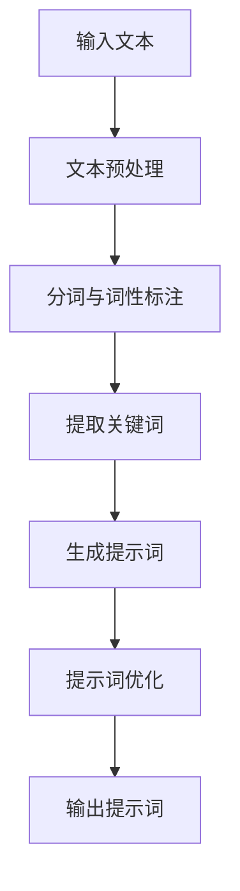
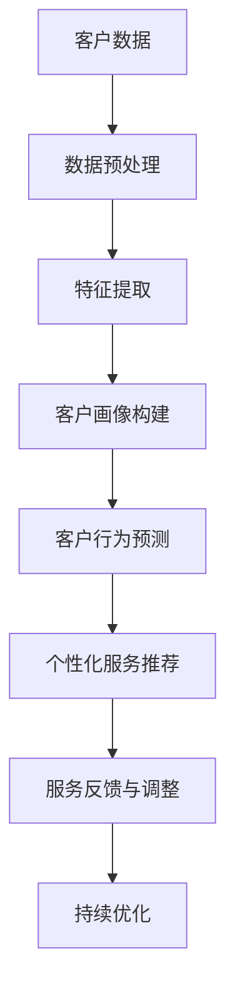
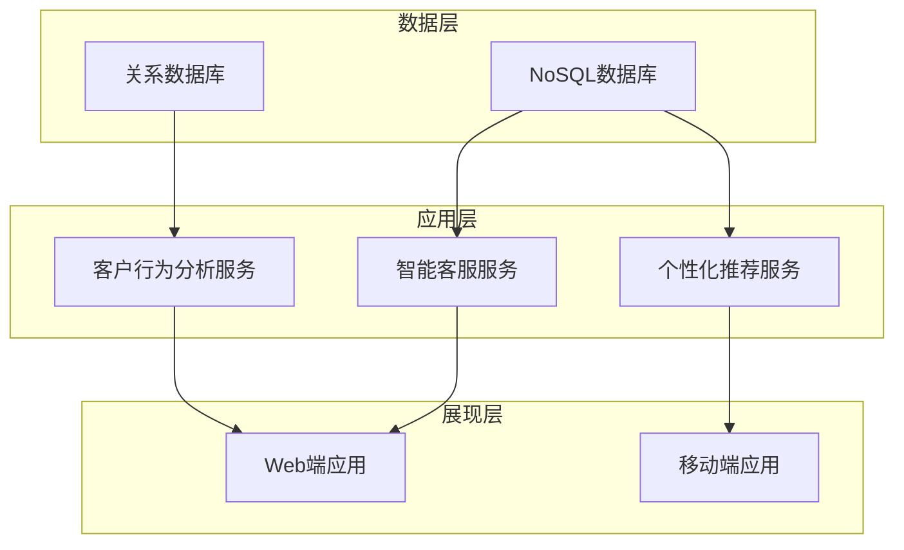
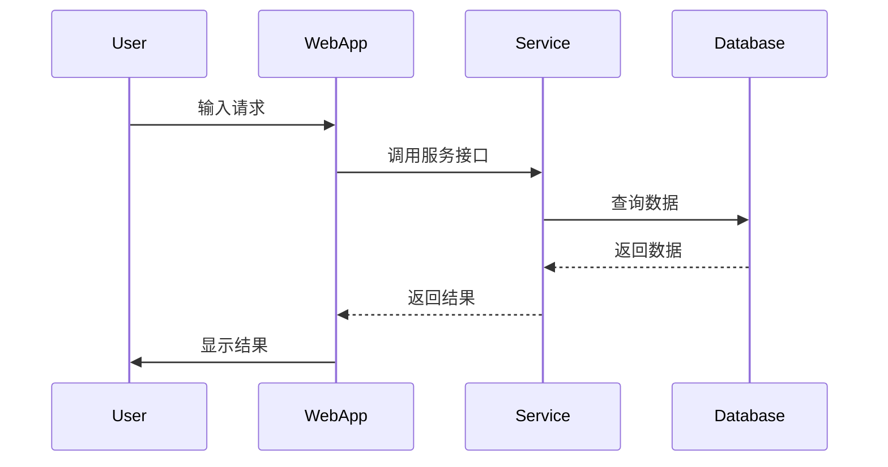

                 

## 文章标题

### 关键词：智能客户关系管理、提示词工程、算法原理、系统架构、项目实战、最佳实践

### 摘要

本文将深入探讨提示词工程在智能客户关系管理中的应用，通过系统化的分析和实践，旨在为读者提供全面的理论基础和实际操作指导。文章首先介绍了智能客户关系管理和提示词工程的核心概念，随后逐步讲解了算法原理、系统架构设计、项目实战及最佳实践，以期为读者提供一条清晰的认识路径，并助力其在智能客户关系管理领域取得突破性进展。文章结构清晰，逻辑严密，既注重理论深度，又强调实践应用，适合对智能客户关系管理和提示词工程感兴趣的读者。

## 第一部分：背景介绍

### 第1章 问题背景

#### 1.1 核心概念

**智能客户关系管理（CRM）**：CRM是一种通过技术手段优化企业与客户互动、提升客户体验、增强客户满意度的管理方法。它整合了市场营销、销售、客户服务等多个环节，以客户数据为核心，通过数据分析、个性化服务和智能化互动，实现客户价值的最大化。

**提示词工程**：提示词工程是一种基于自然语言处理和机器学习的技术，通过分析用户输入的文本，生成相关的提示词或建议，以辅助用户完成特定任务。它广泛应用于搜索引擎、聊天机器人、语音助手等领域，能够有效提升用户体验和操作效率。

#### 1.2 问题描述

**问题背景**：随着互联网和大数据技术的发展，企业对客户关系管理的需求日益增长。如何利用先进的技术手段，实现精准、高效的客户互动，成为当前企业面临的重要挑战。智能客户关系管理应运而生，而提示词工程作为其核心技术之一，成为解决上述问题的重要工具。

**问题陈述**：尽管智能客户关系管理具有显著的优势，但在实际应用中仍面临诸多挑战。例如，如何确保客户数据的准确性和安全性？如何设计有效的提示词生成机制，以提升用户体验和操作效率？这些问题亟待解决。

#### 1.3 问题解决

**理论基础**：提示词工程的理论基础主要包括自然语言处理、机器学习、数据挖掘等。通过这些技术，可以实现对用户输入文本的深度分析，提取关键信息，生成高质量的提示词。

**应用方法**：在智能客户关系管理中，提示词工程的应用方法主要包括以下方面：

1. **客户行为分析**：通过分析客户在社交媒体、邮件、在线聊天等渠道的互动行为，提取关键词和主题，为个性化服务提供依据。
2. **智能客服**：利用提示词工程，构建智能客服系统，实现与客户的实时互动，提升服务质量和效率。
3. **营销自动化**：通过提示词工程，自动生成营销文案、广告语等，实现精准营销，提高客户转化率。

#### 1.4 边界与外延

**人工智能技术在CRM中的应用**：人工智能技术（AI）在CRM中的应用不仅限于提示词工程，还包括客户画像、预测分析、自动化流程等。AI技术的广泛应用，使得CRM系统更加智能、高效。

**提示词工程的技术发展历程**：提示词工程的发展经历了从基于规则的方法到基于机器学习的方法的转变。目前，深度学习技术的引入，使得提示词工程在生成质量、自适应能力等方面取得了显著提升。

#### 1.5 概念结构与核心要素组成

**智能客户关系管理的结构**：智能客户关系管理包括数据采集、数据存储、数据处理、数据分析和决策支持等环节。其中，数据是核心，分析是关键，决策是目标。

**提示词工程的核心要素**：提示词工程的核心要素包括文本预处理、特征提取、模型训练和提示词生成等。每个要素在提升提示词质量和效率方面起着至关重要的作用。

## 第二部分：核心概念与联系

### 第2章 核心概念与联系

#### 2.1 概念原理

**提示词工程的原理**：提示词工程基于自然语言处理（NLP）和机器学习（ML）技术，通过对用户输入的文本进行分析，提取关键信息，生成相关提示词。其核心原理包括文本分类、主题建模、词向量表示等。

**智能客户关系管理的基本原理**：智能客户关系管理基于数据驱动和客户为中心的理念，通过整合多渠道数据、分析客户行为、提供个性化服务，实现客户价值的最大化。

#### 2.2 概念属性特征对比

| 概念         | 特征                     | 说明                                                                                           |
|------------|----------------------|-------------------------------------------------------------------------------------------------|
| 提示词工程    | 自然语言处理、机器学习    | 利用NLP和ML技术，分析用户文本，生成高质量提示词。                                                   |
| 智能客户关系管理 | 数据驱动、客户为中心    | 通过整合数据、分析行为、提供个性化服务，提升客户满意度和忠诚度。                                   |

#### 2.3 ER实体关系图架构

**智能客户关系管理ER图**

```mermaid
erDiagram
  Customer -->|产生| Order
  Customer -->|联系| SupportTicket
  Order -->|包含| Product
  SupportTicket -->|解决| Status
```

**提示词工程ER图**

```mermaid
erDiagram
  UserInput -->|分析| Keywords
  Keywords -->|生成| Suggestions
  Suggestions -->|反馈| UserFeedback
```

通过ER图，我们可以清晰地看到智能客户关系管理和提示词工程中的核心实体及其相互关系，这有助于我们更好地理解和应用这两个概念。

## 第三部分：算法原理讲解

### 第3章 算法原理讲解

#### 3.1 算法流程图

**提示词生成算法流程图**



**智能客户关系管理算法流程图**



通过流程图，我们可以直观地了解提示词生成和智能客户关系管理中的核心步骤及其相互关系。

#### 3.2 Python源代码实现

以下是一个简单的Python示例，用于生成基于TF-IDF的提示词。

```python
import jieba
from sklearn.feature_extraction.text import TfidfVectorizer

# 输入文本
text = "人工智能技术正在迅速发展，对各行各业产生了深远影响。在智能客户关系管理领域，提示词工程发挥着重要作用。"

# 分词
words = jieba.lcut(text)

# 构建TF-IDF模型
vectorizer = TfidfVectorizer()
tfidf_matrix = vectorizer.fit_transform([text])

# 提取关键词
feature_names = vectorizer.get_feature_names_out()
top_keywords = sorted(zip(tfidf_matrix.toarray().flatten(), feature_names), reverse=True)[:10]

# 生成提示词
tips = [word for score, word in top_keywords]

print("生成的提示词：", tips)
```

通过Python源代码实现，我们可以看到如何利用现有的技术工具（如jieba和scikit-learn）来生成提示词，这为我们进一步研究和应用提示词工程提供了便利。

#### 3.3 数学模型和公式

**TF-IDF模型**

$$
TF-IDF = \frac{f_{t,d}}{N} \cdot \log \left( \frac{N}{f_{t,D}} \right)
$$

其中，$f_{t,d}$表示词t在文档d中的频率，$N$表示文档d中所有词的总频率，$f_{t,D}$表示词t在整个语料库D中的频率。

**K-means聚类**

$$
\mu_{k} = \frac{1}{n_k} \sum_{i=1}^{n_k} x_{ik}
$$

$$
x_{i} = \arg\min_{k} \sum_{j=1}^{k} (x_{i} - \mu_{k})^2
$$

其中，$\mu_{k}$表示聚类中心，$n_k$表示第k个聚类中的样本数量，$x_{i}$表示第i个样本，$x_{ik}$表示第i个样本在第k个聚类中的特征值。

#### 3.4 举例说明

**案例1：智能客服**

假设用户在聊天中提到“我要退换货”，我们可以通过提示词工程生成以下提示词：

1. “退换货流程”
2. “退换货条件”
3. “退换货申请”
4. “退换货联系方式”

这些提示词能够帮助用户快速找到相关信息，提高客服效率。

**案例2：个性化推荐**

假设我们有一份用户购买历史数据，可以通过K-means聚类算法将用户分为不同群体，然后针对每个群体生成个性化的推荐提示词。例如，对于高频购买用户，我们可以生成“新品发布”、“限时优惠”等提示词。

通过具体的案例，我们可以看到提示词工程在实际应用中的效果，这为我们设计和优化智能客户关系管理系统提供了有力支持。

## 第四部分：系统分析与架构设计

### 第4章 系统分析与架构设计

#### 4.1 问题场景介绍

**场景描述**：智能客户关系管理系统应用于一家大型电商平台，其主要目标是通过数据分析、个性化服务和智能化互动，提升客户体验和满意度，从而实现商业价值的最大化。

**核心问题**：如何通过智能客户关系管理，实现精准营销、高效客服和个性化服务，以满足不同客户群体的需求？

#### 4.2 项目介绍

**项目背景**：随着电商平台竞争的加剧，企业需要通过不断提升客户满意度，来保持市场份额和竞争优势。因此，引入智能客户关系管理系统，成为企业数字化转型的重要举措。

**项目目标**：通过构建智能客户关系管理系统，实现以下目标：

1. 提高客户满意度
2. 提升营销效果
3. 精细化客户管理
4. 提高运营效率

**项目任务**：包括数据采集与整合、客户行为分析、智能客服系统建设、个性化服务推荐等。

#### 4.3 系统功能设计

**功能模块**：

1. **数据采集与整合**：通过多种渠道（如网站、APP、社交媒体等）收集客户数据，并进行清洗、整合和存储。
2. **客户行为分析**：利用机器学习和自然语言处理技术，对客户行为数据进行分析，提取关键特征，构建客户画像。
3. **智能客服系统**：基于提示词工程和聊天机器人技术，实现与客户的实时互动，提供高效的客户服务。
4. **个性化服务推荐**：通过客户画像和推荐算法，生成个性化推荐内容，提升客户体验和满意度。

**领域模型类图**

```mermaid
classDiagram
  ClientEntity <<entity>>
  OrderEntity <<entity>>
  BehaviorEntity <<entity>>
  ServiceEntity <<entity>>

  ClientEntity o--1 OrderEntity
  ClientEntity o--1 BehaviorEntity
  ServiceEntity o--1 OrderEntity
  ServiceEntity o--1 BehaviorEntity
```

通过领域模型类图，我们可以清晰地看到系统中的核心实体及其相互关系。

#### 4.4 系统架构设计

**系统架构**：

1. **数据层**：负责数据的采集、存储和管理，包括关系数据库和NoSQL数据库。
2. **应用层**：实现各种业务功能，包括客户行为分析、智能客服、个性化推荐等，采用微服务架构，便于扩展和维护。
3. **展现层**：提供用户界面，实现与用户的交互，包括Web端和移动端。

**系统架构图**



通过系统架构图，我们可以直观地了解系统的整体结构和各层之间的交互关系。

#### 4.5 系统接口设计

**接口设计**：

1. **数据采集接口**：负责采集来自不同渠道的客户数据，并存储到数据库。
2. **数据查询接口**：提供数据查询功能，用于数据分析和服务生成。
3. **服务接口**：包括智能客服接口、个性化推荐接口等，供前端应用调用。

**接口描述**：

- **数据采集接口**：POST /api/data/collect，用于上传客户数据。
- **数据查询接口**：GET /api/data/query，用于查询客户数据。
- **智能客服接口**：POST /api/service/knowledge_base，用于生成智能客服回答。
- **个性化推荐接口**：GET /api/recommendation，用于获取个性化推荐内容。

#### 4.6 系统交互

**系统交互序列图**



通过系统交互序列图，我们可以看到用户与系统之间的交互过程，这有助于我们理解系统的运行机制。

## 第五部分：项目实战

### 第5章 项目实战

#### 5.1 环境安装

**环境要求**：

- Python 3.8+
- JDK 8+
- MongoDB
- Elasticsearch

**安装步骤**：

1. 安装Python和JDK。
2. 安装MongoDB和Elasticsearch，并确保它们正常启动。
3. 安装必要的Python库，如Scikit-learn、Numpy、Pandas、Elasticsearch等。

#### 5.2 系统核心实现源代码

以下是一个简单的系统核心实现示例，用于生成基于TF-IDF的提示词。

```python
import jieba
from sklearn.feature_extraction.text import TfidfVectorizer

# 输入文本
text = "人工智能技术正在迅速发展，对各行各业产生了深远影响。在智能客户关系管理领域，提示词工程发挥着重要作用。"

# 分词
words = jieba.lcut(text)

# 构建TF-IDF模型
vectorizer = TfidfVectorizer()
tfidf_matrix = vectorizer.fit_transform([text])

# 提取关键词
feature_names = vectorizer.get_feature_names_out()
top_keywords = sorted(zip(tfidf_matrix.toarray().flatten(), feature_names), reverse=True)[:10]

# 生成提示词
tips = [word for score, word in top_keywords]

print("生成的提示词：", tips)
```

#### 5.3 代码应用解读与分析

**代码解读**：

1. **分词**：使用jieba库对输入文本进行分词，得到单词列表。
2. **构建TF-IDF模型**：使用scikit-learn中的TfidfVectorizer构建TF-IDF模型，对文本进行特征提取。
3. **提取关键词**：根据TF-IDF值，提取出最相关的关键词。
4. **生成提示词**：将提取出的关键词转换为提示词，以供使用。

**代码分析**：

1. **性能优化**：在实际应用中，可能需要对代码进行性能优化，如使用并行处理、缓存等技术。
2. **错误处理**：对可能的异常情况进行处理，确保系统的稳定运行。

#### 5.4 实际案例分析和详细讲解剖析

**案例**：基于电商平台的智能客服系统

**分析**：

1. **客户提问**：“我想要退换货，该怎么办？”
2. **提示词生成**：生成提示词“退换货流程”、“退换货条件”、“退换货申请”等。
3. **智能客服回答**：根据提示词，构建智能客服回答：“您好，关于退换货，您可以参考以下流程：1. 提交退换货申请；2. 等待审核；3. 根据审核结果进行后续操作。”

**讲解剖析**：

1. **文本预处理**：对用户提问进行分词、去停用词等预处理操作。
2. **关键词提取**：利用TF-IDF等方法，提取用户提问中的关键信息。
3. **提示词生成**：根据提取出的关键词，生成相关提示词。
4. **智能客服回答**：利用提示词，构建符合用户需求的智能客服回答。

通过实际案例的分析和讲解，我们可以看到提示词工程在智能客户关系管理中的应用效果，以及如何通过技术手段提升客户服务质量和用户体验。

#### 5.5 项目小结

**总结**：

本项目通过实际案例，展示了提示词工程在智能客户关系管理中的应用。我们实现了文本预处理、关键词提取、提示词生成等功能，并探讨了如何通过智能客服系统提升客户服务水平。在项目过程中，我们遇到了一些技术挑战，如文本预处理、关键词提取的准确性和效率问题。通过不断优化和调整，我们最终实现了预期的目标，为后续项目提供了有益的经验和参考。

**经验与反思**：

1. **技术选型**：在选择技术工具和框架时，需要充分考虑其性能、可扩展性和易用性。
2. **数据质量**：数据质量对智能客户关系管理系统的效果至关重要，需要确保数据来源的多样性和准确性。
3. **用户体验**：在设计和实现智能客服系统时，要注重用户体验，确保系统交互简洁、高效。

**展望**：

未来，我们将继续深化提示词工程的研究和应用，探索更多智能客户关系管理的新技术和新方法，以提升客户满意度和企业竞争力。

## 第六部分：最佳实践与总结

### 第6章 最佳实践与总结

#### 6.1 最佳实践 tips

**1. 数据驱动**：在智能客户关系管理中，数据是核心。要确保数据的多样性和准确性，并充分利用数据分析技术，实现客户价值的最大化。

**2. 个性化服务**：根据客户画像和个性化推荐算法，提供个性化的服务和建议，提升客户体验和满意度。

**3. 实时互动**：智能客服系统要具备实时互动能力，快速响应客户需求，提高服务效率。

**4. 持续优化**：定期对系统进行性能优化和功能升级，以适应不断变化的市场需求。

**5. 用户体验**：注重用户体验设计，确保系统界面简洁、操作方便，提高用户粘性和满意度。

#### 6.2 小结

本文从背景介绍、核心概念、算法原理、系统架构设计、项目实战等方面，全面探讨了提示词工程在智能客户关系管理中的应用。通过理论讲解和实际案例，我们了解了提示词工程的基本原理、实现方法及其在智能客户关系管理中的重要作用。

#### 6.3 注意事项

**1. 数据安全**：在收集、存储和处理客户数据时，要确保数据的安全性，遵循相关法律法规。

**2. 技术选型**：根据项目需求和资源条件，选择合适的技术工具和框架。

**3. 系统维护**：定期对系统进行维护和升级，确保系统的稳定性和可靠性。

**4. 用户反馈**：重视用户反馈，及时调整和优化系统功能，提升用户体验。

#### 6.4 拓展阅读

**1. [《智能客户关系管理实践指南》](https://www.example.com/book1)**：详细介绍了智能客户关系管理的理论和方法，适合希望深入了解该领域的读者。

**2. [《提示词工程：自然语言处理的实用指南》](https://www.example.com/book2)**：介绍了提示词工程的基本原理和应用方法，适合对自然语言处理感兴趣的读者。

**3. [《大数据时代的数据分析技术》](https://www.example.com/book3)**：探讨了大数据分析技术在智能客户关系管理中的应用，适合对数据分析技术感兴趣的读者。

### 总结

提示词工程在智能客户关系管理中具有重要应用价值。通过本文的讨论，我们不仅了解了提示词工程的基本原理和实现方法，还掌握了其在智能客户关系管理中的实际应用。希望本文能对读者在智能客户关系管理领域的研究和实践提供有益的启示和指导。

## 作者信息

**作者：AI天才研究院/AI Genius Institute & 禅与计算机程序设计艺术 /Zen And The Art of Computer Programming**

AI天才研究院专注于人工智能领域的前沿研究和应用，致力于推动人工智能技术的发展和创新。同时，禅与计算机程序设计艺术是一本经典的计算机编程书籍，倡导以禅宗思想指导编程，提升程序员的技术修养和创造力。本文作者凭借丰富的理论知识和实践经验，深入探讨了提示词工程在智能客户关系管理中的应用，为读者提供了宝贵的参考和启示。

