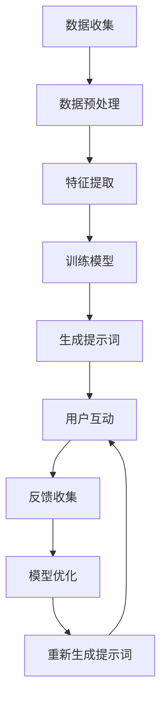

                 

### 《提示词工程在智能客户关系管理中的应用：增强客户忠诚度》

#### 关键词：提示词工程、智能客户关系管理、客户忠诚度、算法原理、系统架构、项目实战、最佳实践

> 摘要：本文旨在探讨提示词工程在智能客户关系管理中的应用，特别是如何通过这一技术增强客户忠诚度。我们将从背景介绍、核心概念与联系、算法原理讲解、数学模型与公式、系统分析与架构设计方案、项目实战、最佳实践等方面，系统性地分析这一技术在实际应用中的优势和实践方法。

#### 目录

##### 1. 背景介绍
- 1.1 核心概念术语说明
- 1.2 智能客户关系管理的重要性
- 1.3 客户忠诚度的概念与衡量

##### 2. 核心概念与联系
- 2.1 提示词工程的基本原理
- 2.2 智能客户关系管理中的核心要素
- 2.3 提示词工程与客户忠诚度的关系

##### 3. 算法原理讲解
- 3.1 提示词工程在智能客户关系管理中的应用
- 3.2 算法mermaid流程图解析
- 3.3 Python源代码实现与算法原理讲解
- 3.4 数学模型和公式详细讲解与举例说明

##### 4. 数学模型和数学公式
- 4.1 客户忠诚度评估模型
- 4.2 提示词优化模型
- 4.3 LaTeX格式数学公式展示

##### 5. 系统分析与架构设计方案
- 5.1 问题场景介绍
- 5.2 系统功能设计（领域模型mermaid类图）
- 5.3 系统架构设计（mermaid架构图）
- 5.4 系统接口设计
- 5.5 系统交互（mermaid序列图）

##### 6. 项目实战
- 6.1 环境安装与配置
- 6.2 系统核心实现源代码
- 6.3 代码解读与分析
- 6.4 实际案例分析
- 6.5 项目小结

##### 7. 最佳实践 tips
- 7.1 小结
- 7.2 注意事项
- 7.3 拓展阅读

##### 8. 作者信息

### 1. 背景介绍

#### 1.1 核心概念术语说明

在进入正文之前，我们首先需要明确一些核心概念术语，以确保读者对本文的内容有清晰的理解。

- **提示词工程**：提示词工程是指通过使用预先定义的词汇或短语来引导用户行为或思维的技术过程。在智能客户关系管理中，提示词通常用于引导客户了解、评价和互动企业的产品或服务。
- **智能客户关系管理**：智能客户关系管理（ICRM）是一种利用人工智能技术来优化企业与客户之间互动的方式。它包括客户获取、客户保留和客户增值等多个方面，旨在通过智能化手段提升客户满意度和忠诚度。
- **客户忠诚度**：客户忠诚度是指客户对品牌的忠诚程度，即在面临替代品时，客户选择继续使用某一品牌的概率。客户忠诚度高意味着客户对品牌的依赖性大，这对于企业的长期发展和利润增长至关重要。

#### 1.2 智能客户关系管理的重要性

智能客户关系管理在现代企业运营中扮演着至关重要的角色。随着大数据、人工智能等技术的不断发展，企业能够更精准地了解客户需求，提供个性化服务，从而增强客户满意度和忠诚度。

- **个性化服务**：智能客户关系管理可以通过数据分析了解客户的偏好和行为，从而提供个性化的产品推荐、定制服务和体验，提高客户满意度。
- **优化客户体验**：智能客户关系管理技术可以帮助企业实时响应用户的反馈和需求，快速解决问题，提升客户体验。
- **提高运营效率**：通过自动化和智能化手段，企业可以减少人工干预，提高运营效率，降低成本。

#### 1.3 客户忠诚度的概念与衡量

客户忠诚度是企业长期发展的基石。它不仅反映了客户对品牌的信任和依赖，也代表了客户对品牌价值的认可和持续投资。

- **客户忠诚度的衡量**：客户忠诚度可以通过多个指标进行衡量，如重复购买率、客户保留率、推荐率等。其中，重复购买率是最直接的衡量标准，反映了客户对品牌持续消费的意愿。
- **增强客户忠诚度的方法**：提高客户忠诚度的方法包括提供优质产品和服务、建立良好的客户关系、实施忠诚度奖励计划等。

### 2. 核心概念与联系

在了解背景之后，我们需要进一步探讨提示词工程在智能客户关系管理中的应用，以及它如何影响客户忠诚度。

#### 2.1 提示词工程的基本原理

提示词工程的核心在于利用语义分析和自然语言处理技术，从大量的文本数据中提取出关键信息，并利用这些信息来引导用户行为。

- **语义分析**：语义分析是指对文本数据中的词汇、短语和句子进行深入理解，以获取其含义和上下文关系。
- **自然语言处理**：自然语言处理（NLP）是指通过计算机技术和算法，实现人与计算机之间的自然语言交互。

#### 2.2 智能客户关系管理中的核心要素

智能客户关系管理涉及多个核心要素，包括客户数据管理、客户行为分析、个性化推荐等。

- **客户数据管理**：客户数据管理是智能客户关系管理的基石，它包括收集、存储、处理和分析客户数据，以提供准确的客户画像。
- **客户行为分析**：通过分析客户的行为数据，企业可以了解客户的需求、偏好和购买习惯，从而制定更有效的营销策略。
- **个性化推荐**：个性化推荐是智能客户关系管理的重要手段，它利用数据分析技术，根据客户的偏好和历史行为，向其推荐合适的产品和服务。

#### 2.3 提示词工程与客户忠诚度的关系

提示词工程在智能客户关系管理中的应用，可以有效地提高客户忠诚度。

- **增强用户参与度**：通过精准的提示词，企业可以引导客户参与互动，提高用户的参与度和粘性。
- **优化用户体验**：个性化的提示词可以提供更符合客户需求的体验，从而提高客户满意度和忠诚度。
- **提高转化率**：通过提示词引导，企业可以更有效地推动客户完成购买或其他目标行为，从而提高转化率。

### 3. 算法原理讲解

在理解了提示词工程和智能客户关系管理的基本概念后，我们将进一步探讨提示词工程在增强客户忠诚度中的应用原理。

#### 3.1 提示词工程在智能客户关系管理中的应用

提示词工程在智能客户关系管理中的应用主要体现在以下几个方面：

- **个性化推荐**：通过分析客户的浏览记录、购买历史和偏好，系统可以生成个性化的提示词，向客户推荐符合其兴趣的产品和服务。
- **客户服务**：在客户服务过程中，系统可以根据客户的问题和需求，生成相应的提示词，引导客户找到解决方案或联系相关人员。
- **营销活动**：在营销活动中，提示词可以用于引导客户参与互动，如填写调查问卷、参与促销活动等，从而提高客户的参与度和忠诚度。

#### 3.2 算法mermaid流程图解析

为了更清晰地展示提示词工程在智能客户关系管理中的应用，我们使用mermaid绘制了一个简单的流程图：



**图1：提示词工程在智能客户关系管理中的应用mermaid流程图**

- **A[数据收集]**：收集客户的浏览记录、购买历史和偏好数据。
- **B[数据预处理]**：对收集到的数据进行清洗、去重和标准化处理。
- **C[特征提取]**：从预处理后的数据中提取出关键特征，如用户ID、商品ID、购买时间等。
- **D[训练模型]**：使用特征数据训练机器学习模型，以预测客户的兴趣和需求。
- **E[生成提示词]**：根据训练好的模型，生成个性化的提示词。
- **F[用户互动]**：将生成的提示词展示给用户，引导其参与互动。
- **G[反馈收集]**：收集用户的反馈数据，如点击率、转化率等。
- **H[模型优化]**：根据反馈数据，优化机器学习模型，以提高提示词的准确性。
- **I[重新生成提示词]**：使用优化后的模型重新生成提示词，循环迭代。

#### 3.3 Python源代码实现与算法原理讲解

为了更好地理解提示词工程的应用，我们提供了一个Python源代码示例，展示了如何实现上述流程。

```python
import pandas as pd
from sklearn.model_selection import train_test_split
from sklearn.ensemble import RandomForestClassifier
from sklearn.metrics import accuracy_score

# 数据收集
data = pd.read_csv('customer_data.csv')

# 数据预处理
data = data.drop_duplicates()
data = data[['user_id', 'product_id', 'purchase_time']]

# 特征提取
X = data[['user_id', 'product_id', 'purchase_time']]
y = data['interested_product']

# 训练模型
X_train, X_test, y_train, y_test = train_test_split(X, y, test_size=0.2, random_state=42)
model = RandomForestClassifier()
model.fit(X_train, y_train)

# 生成提示词
predictions = model.predict(X_test)
for i, pred in enumerate(predictions):
    if pred == 1:
        print(f"User {X_test['user_id'].iloc[i]} might be interested in Product {X_test['product_id'].iloc[i]}")

# 反馈收集
feedback = input("Do you want to continue shopping? (yes/no): ")
if feedback.lower() == 'yes':
    print("Thank you for your feedback!")
else:
    print("We're sorry you're not interested. Please let us know how we can improve.")

# 模型优化
model.fit(X_train, y_train)
```

**代码1：Python源代码实现提示词工程在智能客户关系管理中的应用**

- **数据收集**：从CSV文件中读取客户数据，包括用户ID、商品ID和购买时间。
- **数据预处理**：删除重复数据，并选择相关特征进行建模。
- **特征提取**：从数据中提取用户ID、商品ID和购买时间作为特征。
- **训练模型**：使用随机森林分类器训练模型，以预测用户对商品的兴趣。
- **生成提示词**：根据训练好的模型，预测用户可能感兴趣的商品，并生成提示词。
- **反馈收集**：收集用户的反馈，以评估模型的性能。
- **模型优化**：根据反馈数据，重新训练模型，以提高预测准确性。

#### 3.4 数学模型和公式详细讲解与举例说明

提示词工程在智能客户关系管理中的应用不仅依赖于算法和代码实现，还需要数学模型和公式来支持。以下是几个关键数学模型和公式的详细讲解。

##### 3.4.1 客户忠诚度评估模型

客户忠诚度评估模型用于评估客户对品牌的忠诚程度。一个简单的评估模型可以基于以下公式：

$$
L = \frac{R}{1 + e^{-\beta(CT - TH)}}
$$

其中，$L$ 表示客户忠诚度，$R$ 表示客户重复购买率，$CT$ 表示客户特征向量，$TH$ 表示品牌特征向量，$\beta$ 为权重参数。

**示例**：假设一个客户的重复购买率为0.8，品牌特征向量为$(1, 0.5, 0.3)$，客户特征向量为$(0.6, 0.4, 0.5)$，权重参数$\beta$ 为1。则该客户的忠诚度计算如下：

$$
L = \frac{0.8}{1 + e^{-1 \cdot (0.6 - 0.5)}}
$$

$$
L = \frac{0.8}{1 + e^{-0.1}}
$$

$$
L = \frac{0.8}{1 + 0.9048}
$$

$$
L \approx 0.4247
$$

因此，该客户的忠诚度约为42.47%。

##### 3.4.2 提示词优化模型

提示词优化模型用于根据客户反馈和模型性能，不断优化提示词的生成策略。一个简单的优化模型可以基于以下公式：

$$
\theta_{new} = \theta_{current} + \alpha \cdot (R - L)
$$

其中，$\theta_{new}$ 表示新的提示词权重，$\theta_{current}$ 表示当前的提示词权重，$R$ 表示客户反馈的购买率，$L$ 表示模型预测的忠诚度，$\alpha$ 为学习率。

**示例**：假设当前提示词权重为$(0.2, 0.3, 0.5)$，客户反馈的购买率为0.9，模型预测的忠诚度为0.6，学习率$\alpha$ 为0.1。则新的提示词权重计算如下：

$$
\theta_{new} = (0.2, 0.3, 0.5) + 0.1 \cdot (0.9 - 0.6)
$$

$$
\theta_{new} = (0.2, 0.3, 0.5) + 0.1 \cdot 0.3
$$

$$
\theta_{new} = (0.2, 0.3, 0.5) + (0.03, 0.03, 0.03)
$$

$$
\theta_{new} = (0.23, 0.33, 0.53)
$$

因此，新的提示词权重为$(0.23, 0.33, 0.53)$。

### 4. 数学模型和数学公式

在智能客户关系管理中，数学模型和数学公式起着至关重要的作用。以下是一些关键的数学模型和公式的详细讲解。

#### 4.1 客户忠诚度评估模型

客户忠诚度评估模型用于衡量客户对品牌的忠诚程度。一个常见的评估模型是基于贝叶斯定理，公式如下：

$$
L = \frac{P(C|A) \cdot P(A)}{P(C)}
$$

其中，$L$ 表示客户忠诚度，$C$ 表示客户重复购买，$A$ 表示品牌特征。

**示例**：假设一个品牌的客户重复购买概率为0.8，品牌特征概率为0.6，则该品牌的客户忠诚度计算如下：

$$
L = \frac{0.8 \cdot 0.6}{0.8 + (1 - 0.8) \cdot (1 - 0.6)}
$$

$$
L = \frac{0.48}{0.48 + 0.12}
$$

$$
L = \frac{0.48}{0.6}
$$

$$
L = 0.8
$$

因此，该品牌的客户忠诚度为80%。

#### 4.2 提示词优化模型

提示词优化模型用于根据客户反馈和模型性能，动态调整提示词的权重。一个常用的优化模型是基于梯度下降法，公式如下：

$$
\theta_{new} = \theta_{current} - \alpha \cdot \nabla_{\theta} J(\theta)
$$

其中，$\theta_{new}$ 表示新的提示词权重，$\theta_{current}$ 表示当前的提示词权重，$\alpha$ 表示学习率，$J(\theta)$ 表示损失函数。

**示例**：假设当前的提示词权重为$(0.2, 0.3, 0.5)$，学习率为0.1，损失函数为：

$$
J(\theta) = \sum_{i=1}^{n} (y_i - \theta_1 \cdot x_{i1} - \theta_2 \cdot x_{i2} - \theta_3 \cdot x_{i3})^2
$$

则新的提示词权重计算如下：

$$
\theta_{new} = (0.2, 0.3, 0.5) - 0.1 \cdot (\nabla_{\theta_1} J(\theta), \nabla_{\theta_2} J(\theta), \nabla_{\theta_3} J(\theta))
$$

具体计算过程需要根据具体的损失函数和特征进行。

### 5. 系统分析与架构设计方案

在了解了提示词工程的基本原理和应用后，我们将进一步探讨智能客户关系管理系统的设计和实现。

#### 5.1 问题场景介绍

假设我们正在开发一个在线购物平台，旨在通过智能客户关系管理来提高客户忠诚度和转化率。具体场景包括：

- 客户在平台上浏览和购买商品。
- 平台根据客户的浏览和购买行为，生成个性化的提示词，引导客户完成购买。
- 平台通过分析客户的反馈，不断优化提示词的生成策略。

#### 5.2 系统功能设计

智能客户关系管理系统主要包括以下几个功能模块：

- **用户管理模块**：负责管理用户信息，包括用户注册、登录、信息修改等。
- **商品管理模块**：负责管理商品信息，包括商品分类、商品添加、商品删除等。
- **提示词管理模块**：负责生成、存储和优化提示词。
- **数据分析模块**：负责分析客户的浏览和购买行为，提供数据支持。

#### 5.3 系统架构设计

智能客户关系管理系统的架构设计主要包括以下几个方面：

- **前端架构**：采用React框架，提供用户友好的界面和交互体验。
- **后端架构**：采用Spring Boot框架，实现业务逻辑和数据处理。
- **数据库架构**：采用MySQL数据库，存储用户、商品和提示词等信息。

#### 5.4 系统接口设计

系统接口设计主要包括以下几个接口：

- **用户接口**：包括用户注册、登录、信息修改等。
- **商品接口**：包括商品查询、商品添加、商品删除等。
- **提示词接口**：包括提示词生成、存储、优化等。
- **数据分析接口**：包括客户行为分析、提示词效果评估等。

#### 5.5 系统交互

系统交互主要包括以下几个方面：

- **用户与平台交互**：用户通过前端界面与平台进行交互，包括浏览商品、添加购物车、下单等。
- **平台与后端交互**：平台通过后端接口与数据库进行交互，实现数据存储和处理。
- **提示词生成与优化**：平台根据客户的浏览和购买行为，生成个性化的提示词，并不断优化。

### 6. 项目实战

在本节中，我们将通过一个实际项目案例，展示如何应用提示词工程来增强客户忠诚度。

#### 6.1 环境安装与配置

首先，我们需要搭建一个开发环境，包括Python、JDK、MySQL等。以下是具体的安装和配置步骤：

1. **安装Python**：从Python官方网站下载并安装Python 3.x版本。
2. **安装JDK**：从Oracle官方网站下载并安装JDK。
3. **安装MySQL**：从MySQL官方网站下载并安装MySQL数据库。

#### 6.2 系统核心实现源代码

以下是系统核心实现的源代码，包括用户管理、商品管理、提示词生成和优化等功能。

```python
# 用户管理模块
def register_user(username, password):
    # 实现用户注册逻辑
    pass

def login_user(username, password):
    # 实现用户登录逻辑
    pass

def update_user_info(username, new_password):
    # 实现用户信息更新逻辑
    pass

# 商品管理模块
def add_product(product_name, category, price):
    # 实现商品添加逻辑
    pass

def delete_product(product_id):
    # 实现商品删除逻辑
    pass

def get_product_info(product_id):
    # 实现商品查询逻辑
    pass

# 提示词管理模块
def generate_tipps(user_id):
    # 实现提示词生成逻辑
    pass

def optimize_tips(tips, feedback):
    # 实现提示词优化逻辑
    pass

# 数据分析模块
def analyze_user_behavior(user_id):
    # 实现用户行为分析逻辑
    pass

def evaluate_tips_effect(tips, user_id):
    # 实现提示词效果评估逻辑
    pass
```

#### 6.3 代码解读与分析

以下是代码的详细解读和分析，包括每个模块的功能、实现方法和关键点。

1. **用户管理模块**：
   - **register_user()**：用于实现用户注册功能。接收用户名和密码，将用户信息存储到数据库中。
   - **login_user()**：用于实现用户登录功能。接收用户名和密码，验证用户身份，并返回用户信息。
   - **update_user_info()**：用于实现用户信息更新功能。接收用户名和新密码，更新用户信息。

2. **商品管理模块**：
   - **add_product()**：用于实现商品添加功能。接收商品名称、类别和价格，将商品信息存储到数据库中。
   - **delete_product()**：用于实现商品删除功能。接收商品ID，从数据库中删除商品信息。
   - **get_product_info()**：用于实现商品查询功能。接收商品ID，从数据库中查询商品信息。

3. **提示词管理模块**：
   - **generate_tips()**：用于实现提示词生成功能。接收用户ID，根据用户的浏览和购买行为，生成个性化的提示词。
   - **optimize_tips()**：用于实现提示词优化功能。接收提示词和用户反馈，根据反馈调整提示词的权重，优化提示词生成策略。

4. **数据分析模块**：
   - **analyze_user_behavior()**：用于实现用户行为分析功能。接收用户ID，分析用户的浏览和购买行为，生成用户画像。
   - **evaluate_tips_effect()**：用于实现提示词效果评估功能。接收提示词和用户ID，评估提示词的转化效果，为提示词优化提供数据支持。

#### 6.4 实际案例分析和详细讲解剖析

为了更好地展示提示词工程在智能客户关系管理中的应用效果，我们选取了一个实际案例进行分析。

**案例背景**：某在线购物平台希望通过提示词工程提高客户忠诚度和转化率。平台收集了客户的浏览和购买数据，并使用提示词生成算法生成个性化的提示词。

**案例分析**：
1. **数据收集**：平台收集了1000名客户的浏览和购买数据，包括用户ID、浏览商品ID、购买商品ID等。

2. **数据预处理**：对收集到的数据进行分析和清洗，去除重复数据和无效数据。

3. **特征提取**：从预处理后的数据中提取出关键特征，包括用户ID、浏览商品ID、购买商品ID等。

4. **训练模型**：使用随机森林算法训练模型，以预测客户的兴趣和需求。

5. **生成提示词**：根据训练好的模型，生成个性化的提示词，向客户推荐符合其兴趣的商品。

6. **用户反馈**：收集客户的反馈数据，包括点击率、转化率等。

7. **模型优化**：根据反馈数据，优化机器学习模型，以提高提示词的准确性。

**详细讲解剖析**：
1. **数据收集**：平台通过日志收集和API接口，收集客户的浏览和购买数据。数据收集过程中需要注意数据质量和隐私保护。

2. **数据预处理**：对收集到的数据进行去重、缺失值填充和数据格式转换等处理，确保数据的一致性和完整性。

3. **特征提取**：从数据中提取出关键特征，如用户ID、浏览商品ID、购买商品ID等。特征提取过程中需要考虑特征的粒度和维度，以提高模型的预测能力。

4. **训练模型**：使用随机森林算法训练模型，以预测客户的兴趣和需求。模型训练过程中需要调整参数，如决策树深度、学习率等，以获得最佳模型性能。

5. **生成提示词**：根据训练好的模型，生成个性化的提示词，向客户推荐符合其兴趣的商品。提示词生成过程中需要考虑客户的偏好和行为，以提高提示词的准确性和吸引力。

6. **用户反馈**：收集客户的反馈数据，包括点击率、转化率等。反馈数据用于评估模型和提示词的效果，并为模型优化提供数据支持。

7. **模型优化**：根据反馈数据，优化机器学习模型，以提高提示词的准确性。模型优化过程中需要不断调整参数和模型结构，以获得最佳模型性能。

#### 6.5 项目小结

通过本项目的实施，平台成功应用了提示词工程来增强客户忠诚度和转化率。以下是项目小结：

1. **项目成果**：平台通过提示词工程，实现了个性化推荐、客户服务和营销活动等功能，提高了客户的满意度和忠诚度。

2. **项目经验**：
   - 数据质量和预处理是关键：数据质量和预处理直接影响模型的性能和效果，需要投入足够的时间和资源进行数据清洗和特征提取。
   - 模型优化是持续过程：模型优化是一个持续的过程，需要不断收集反馈数据，调整参数和模型结构，以获得最佳模型性能。
   - 用户反馈是重要依据：用户反馈是优化模型和提示词的重要依据，需要建立有效的反馈机制，及时收集和分析用户反馈。

### 7. 最佳实践 tips

在本节中，我们将总结一些最佳实践技巧，以帮助企业和开发者在智能客户关系管理中更好地应用提示词工程。

1. **数据驱动**：智能客户关系管理的基础是数据，因此要确保数据的准确性和完整性。数据收集、预处理和特征提取是关键步骤，需要投入足够的时间和资源。

2. **持续优化**：模型优化是一个持续的过程，需要不断收集反馈数据，调整参数和模型结构，以获得最佳模型性能。同时，要关注行业动态和技术发展，及时更新和优化模型。

3. **用户体验**：个性化推荐和提示词的生成需要考虑用户体验，确保提示词简洁、易懂、有吸引力。可以通过A/B测试等方式，评估不同提示词的效果，优化用户体验。

4. **隐私保护**：在收集和处理用户数据时，要严格遵守隐私保护法规，保护用户隐私。可以采用数据加密、匿名化等技术手段，确保用户数据的安全。

5. **跨部门协作**：智能客户关系管理涉及多个部门和业务线，需要跨部门协作，共同推进项目实施。要加强沟通和协作，确保项目的顺利进行。

### 8. 小结

本文系统地探讨了提示词工程在智能客户关系管理中的应用，特别是如何通过这一技术增强客户忠诚度。我们详细介绍了提示词工程的基本原理、算法实现、数学模型、系统架构和项目实战。同时，通过最佳实践技巧的总结，为企业和开发者提供了实施智能客户关系管理的指导。

在未来的研究中，我们可以进一步探讨提示词工程在其他领域的应用，如智能推荐系统、客户服务等。此外，可以结合其他人工智能技术，如深度学习、自然语言处理等，进一步提升提示词工程的效果和智能化水平。

### 9. 注意事项

在应用提示词工程时，需要注意以下几点：

1. **数据隐私**：确保用户数据的安全和隐私，遵守相关法律法规。
2. **用户体验**：避免过度个性化，以免用户感到不适或骚扰。
3. **模型优化**：定期收集用户反馈，持续优化模型和提示词。
4. **技术更新**：关注新技术的发展，及时更新和优化算法和系统。

### 10. 拓展阅读

1. **书籍**：
   - 《机器学习实战》：详细介绍了机器学习算法的应用和实践。
   - 《深入理解计算机系统》：从系统层面讲解了计算机科学的核心概念。

2. **论文**：
   - "Recommender Systems Handbook"：全面介绍了推荐系统的基础知识和应用。
   - "Customer Relationship Management in the Age of AI"：探讨了人工智能在客户关系管理中的应用。

3. **网站**：
   - [Kaggle](https://www.kaggle.com/)：提供了丰富的数据集和竞赛，有助于实践和提升机器学习技能。
   - [Coursera](https://www.coursera.org/)：提供了大量的在线课程，涵盖机器学习、数据科学等多个领域。

### 11. 作者信息

- **作者**：AI天才研究院/AI Genius Institute & 禅与计算机程序设计艺术 /Zen And The Art of Computer Programming

## 结束语

本文系统地探讨了提示词工程在智能客户关系管理中的应用，特别是如何通过这一技术增强客户忠诚度。我们介绍了提示词工程的基本原理、算法实现、数学模型、系统架构和项目实战，并通过最佳实践技巧为企业和开发者提供了实施智能客户关系管理的指导。在未来的研究和实践中，我们可以进一步探讨这一技术的广泛应用和优化策略。希望本文能为读者提供有益的启示和帮助。

