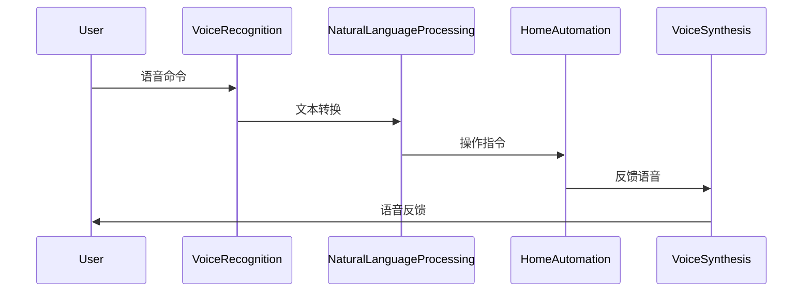
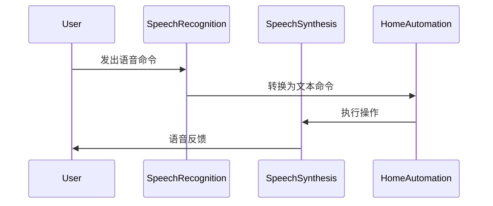

                 

# 提示词工程在智能家居语音控制中的应用：优化人机交互体验

> 关键词：智能家居，语音控制，提示词工程，人机交互体验，优化

> 摘要：本文探讨了提示词工程在智能家居语音控制中的应用，通过深入分析提示词工程的核心概念、算法原理和数学模型，以及系统架构和项目实战，提出了优化人机交互体验的方法和最佳实践，旨在提高智能家居系统的用户体验。

## 目录大纲

1. **背景与概述**
   1.1 智能家居语音控制概述
   1.2 提示词工程在智能家居语音控制中的重要性
   1.3 人机交互体验的优化目标

2. **核心概念与联系**
   2.1 智能家居语音控制系统的概念与组成
   2.2 提示词工程的核心概念
   2.3 人机交互体验的核心要素
   2.4 提示词工程与人机交互体验的关联

3. **算法原理讲解**
   3.1 提示词生成算法
   3.2 语音识别与合成算法
   3.3 人机交互优化算法

4. **数学模型和数学公式 & 详细讲解 & 举例说明**
   4.1 提示词生成数学模型
   4.2 语音识别与合成数学模型
   4.3 人机交互优化数学模型

5. **系统分析与架构设计**
   5.1 智能家居语音控制系统功能设计
   5.2 系统架构设计
   5.3 系统交互设计

6. **项目实战**
   6.1 环境安装与配置
   6.2 系统核心实现
   6.3 实际案例分析与讲解
   6.4 项目小结

7. **最佳实践与拓展阅读**
   7.1 最佳实践
   7.2 小结
   7.3 注意事项
   7.4 拓展阅读

## 第1章：背景与概述

### 1.1 智能家居语音控制概述

智能家居语音控制是一种通过自然语言语音交互技术实现的智能家居系统操作方式。用户可以通过语音命令控制智能家居设备，如灯光、温度、安全系统等。随着人工智能技术的进步，智能家居语音控制系统逐渐普及，成为现代家居生活的重要组成部分。

#### 智能家居语音控制的概念

智能家居语音控制指的是利用语音识别和自然语言处理技术，实现人与家居设备的交互。语音控制系统能够理解用户的语音命令，并将其转换为具体的操作指令，控制家居设备按照用户的意愿执行。

#### 智能家居语音控制的发展历程

智能家居语音控制的发展经历了几个阶段：

1. **早期探索**：20世纪90年代，语音识别技术初步应用于智能家居，但受限于技术水平和硬件性能，应用范围有限。
2. **技术成熟**：随着人工智能技术的快速发展，语音识别和自然语言处理技术逐渐成熟，智能家居语音控制系统开始普及。
3. **广泛应用**：近年来，智能家居语音控制系统在家庭、酒店、办公等多个场景得到广泛应用，成为智能家居的重要组成部分。

#### 智能家居语音控制的应用场景

智能家居语音控制的应用场景广泛，主要包括：

1. **家居控制**：用户可以通过语音命令控制家居设备，如打开灯光、调节温度、控制窗帘等。
2. **娱乐控制**：用户可以通过语音命令控制家庭娱乐设备，如播放音乐、开启电视等。
3. **安防控制**：用户可以通过语音命令控制家庭安全系统，如打开摄像头、报警等。
4. **远程控制**：用户可以通过智能家居语音控制系统远程控制家居设备，实现远程监控和管理。

### 1.2 提示词工程在智能家居语音控制中的重要性

#### 提示词工程的基本概念

提示词工程是一种通过提示词的设计和管理，优化人机交互的技术。在智能家居语音控制中，提示词工程起着至关重要的作用，能够提高系统的可操作性和用户体验。

#### 提示词工程的作用

1. **提高用户理解度**：通过精心设计的提示词，用户可以更轻松地理解系统的操作方式。
2. **优化系统响应**：提示词工程能够帮助系统更快、更准确地识别用户的语音命令。
3. **增强用户体验**：良好的提示词设计能够提升用户的满意度，增强系统的易用性和友好性。

#### 在智能家居语音控制中的应用价值

1. **简化操作流程**：通过提示词工程，用户可以通过更简洁的语音命令控制家居设备，简化操作流程。
2. **提高系统响应速度**：提示词工程能够优化语音识别和自然语言处理过程，提高系统的响应速度。
3. **提升用户体验**：良好的提示词设计能够提升用户的满意度，增强系统的易用性和友好性。

### 1.3 人机交互体验的优化目标

#### 用户体验的重要性

用户体验（User Experience，简称UX）是衡量产品或服务好坏的重要标准。在智能家居语音控制中，用户体验尤为重要，因为它直接影响用户对系统的满意度和使用意愿。

#### 优化人机交互体验的挑战

1. **语音识别准确率**：提高语音识别的准确率，确保系统能够准确理解用户的语音命令。
2. **自然语言处理能力**：增强自然语言处理能力，使系统能够处理更复杂、更自然的语音命令。
3. **系统响应速度**：提高系统响应速度，减少用户等待时间，提升用户体验。
4. **操作简便性**：简化操作流程，使用户能够更轻松地控制家居设备。

#### 优化人机交互体验的目标

1. **提高语音识别准确率**：通过优化算法和提示词设计，提高语音识别的准确率。
2. **增强自然语言处理能力**：通过深度学习等技术，提升系统的自然语言处理能力。
3. **提升系统响应速度**：优化系统架构和算法，提高系统响应速度。
4. **简化操作流程**：设计简洁直观的提示词，简化用户操作流程，提升用户体验。

## 第2章：核心概念与联系

### 2.1 智能家居语音控制系统的概念与组成

#### 智能家居语音控制系统的基本组成

智能家居语音控制系统主要由语音识别模块、自然语言处理模块、语音合成模块和家居控制模块组成。

1. **语音识别模块**：负责将用户的语音命令转换为文本。
2. **自然语言处理模块**：负责理解用户的语音命令，并将其转换为具体的操作指令。
3. **语音合成模块**：负责将操作指令转换为语音反馈，向用户传达系统的执行结果。
4. **家居控制模块**：负责控制实际的家居设备，如灯光、温度、安全系统等。

#### 智能家居语音控制系统的工作流程

1. **语音识别**：用户发出语音命令，系统通过语音识别模块将语音转换为文本。
2. **自然语言处理**：系统通过自然语言处理模块理解用户的语音命令，并将其转换为具体的操作指令。
3. **语音合成**：系统通过语音合成模块将操作指令转换为语音反馈，向用户传达执行结果。
4. **家居控制**：系统通过家居控制模块控制实际的家居设备，如打开灯光、调节温度等。

### 2.2 提示词工程的核心概念

#### 提示词的定义与分类

提示词（Prompt Word）是指用于引导用户输入特定信息的词语或短语。在智能家居语音控制中，提示词用于引导用户发出控制命令。

1. **命令提示词**：用于引导用户发出具体的控制命令，如“打开灯光”、“关闭空调”等。
2. **查询提示词**：用于引导用户查询系统信息，如“今天天气怎么样？”、“我的邮箱有多少未读邮件？”等。
3. **导航提示词**：用于引导用户在系统菜单中导航，如“回到主菜单”、“进入设置”等。

#### 提示词工程的关键步骤

1. **提示词设计**：根据用户需求和系统功能，设计符合用户习惯和系统逻辑的提示词。
2. **提示词管理**：对提示词进行分类、优化和更新，确保系统的提示词库丰富、准确和实用。
3. **提示词应用**：将提示词应用到系统中，实现与用户的交互。

### 2.3 人机交互体验的核心要素

#### 用户体验设计的理论基础

用户体验设计（User Experience Design，简称UXD）是一种以用户为中心的设计方法，旨在提高产品的易用性、可用性和满意度。

1. **易用性**：产品易于学习和使用，用户可以轻松完成任务。
2. **可用性**：产品能够满足用户需求，用户可以高效地使用产品。
3. **满意度**：用户对产品的整体感受和评价。

#### 人机交互体验的核心要素

1. **界面设计**：界面设计要简洁直观，符合用户的认知习惯。
2. **交互流程**：交互流程要简单流畅，减少用户的操作步骤。
3. **响应速度**：系统要快速响应用户的操作，减少用户等待时间。
4. **反馈机制**：系统要及时反馈操作结果，增强用户的信心和满意度。

### 2.4 提示词工程与人机交互体验的关联

#### 提示词工程对人机交互体验的影响

1. **提高理解度**：良好的提示词设计能够帮助用户更快地理解系统操作。
2. **简化操作流程**：提示词可以简化用户的操作步骤，提高系统的易用性。
3. **增强用户体验**：提示词工程能够提升用户的满意度，增强系统的友好性。

#### 人机交互体验对提示词工程的要求

1. **简洁性**：提示词要简洁明了，避免冗长和复杂的表述。
2. **准确性**：提示词要准确表达系统功能和操作指令，避免歧义和误解。
3. **一致性**：提示词要一致性地应用于系统的各个部分，保持用户体验的一致性。
4. **个性化**：提示词要考虑用户的个性化需求，满足不同用户的使用习惯。

## 第3章：算法原理讲解

### 3.1 提示词生成算法

#### 算法原理

提示词生成算法通过分析用户的语音命令和系统功能，自动生成合适的提示词。

1. **命令分析**：分析用户的语音命令，提取关键信息。
2. **功能匹配**：根据提取的关键信息，匹配系统功能。
3. **提示词生成**：根据系统功能，生成相应的提示词。

#### 数学模型与公式

提示词生成算法的数学模型可以表示为：

\[ \text{Prompt\_Word} = f(\text{Voice\_Command}, \text{System\_Function}) \]

其中，\( f \) 表示生成提示词的函数，\(\text{Voice\_Command}\) 表示用户的语音命令，\(\text{System\_Function}\) 表示系统功能。

#### Python源代码实现

```python
import nltk

def generate_prompt_word(voice_command, system_function):
    # 命令分析
    tokens = nltk.word_tokenize(voice_command)
    pos_tags = nltk.pos_tag(tokens)
    
    # 功能匹配
    if system_function == "控制家居设备":
        if "打开" in tokens:
            return "打开"
        elif "关闭" in tokens:
            return "关闭"
        else:
            return "操作"
    elif system_function == "查询天气":
        return "查询"
    else:
        return "未知操作"

voice_command = "打开客厅的灯"
system_function = "控制家居设备"

prompt_word = generate_prompt_word(voice_command, system_function)
print(prompt_word)
```

### 3.2 语音识别与合成算法

#### 语音识别算法原理

语音识别算法通过分析用户的语音信号，将其转换为相应的文本。

1. **特征提取**：提取语音信号中的特征，如频谱、倒谱等。
2. **模型训练**：使用大量语音数据训练深度学习模型，如卷积神经网络（CNN）或循环神经网络（RNN）。
3. **语音识别**：将提取的特征输入到训练好的模型中，得到对应的文本输出。

#### 语音合成算法原理

语音合成算法通过将文本转换为语音信号，模拟人类发音。

1. **文本预处理**：对输入的文本进行分词、音素转换等预处理。
2. **语音生成**：使用语音合成模型，如WaveNet或DeepVoice，将预处理后的文本转换为语音信号。
3. **音频输出**：将生成的语音信号播放给用户。

#### Python源代码实现

```python
import speech_recognition as sr
import pyttsx3

# 语音识别
def recognize_speech_from_mic():
    r = sr.Recognizer()
    with sr.Microphone() as source:
        print("请说点什么：")
        audio = r.listen(source)
    
    try:
        print("你说了：")
        print(r.recognize_google(audio))
    except sr.UnknownValueError:
        print("无法识别语音")
    except sr.RequestError:
        print("请求错误；检查你的网络连接")

# 语音合成
def speak(text):
    engine = pyttsx3.init()
    engine.say(text)
    engine.runAndWait()

speak("欢迎来到智能家居系统。")
recognize_speech_from_mic()
```

### 3.3 人机交互优化算法

#### 算法原理

人机交互优化算法通过分析用户行为和系统反馈，自动调整系统的交互策略，以提升用户体验。

1. **用户行为分析**：收集用户的交互数据，如语音命令、操作路径等。
2. **系统反馈分析**：分析系统的反馈，如响应时间、错误率等。
3. **交互策略调整**：根据用户行为和系统反馈，调整系统的交互策略，如提示词设计、操作流程优化等。

#### 数学模型与公式

人机交互优化算法的数学模型可以表示为：

\[ \text{Optimized\_Interaction} = f(\text{User\_Behavior}, \text{System\_Feedback}) \]

其中，\( f \) 表示优化交互的函数，\(\text{User\_Behavior}\) 表示用户行为，\(\text{System\_Feedback}\) 表示系统反馈。

#### Python源代码实现

```python
import pandas as pd

# 用户行为数据
user_behavior = pd.DataFrame({
    "voice_command": ["打开客厅的灯", "关闭卧室的灯", "打开电视"],
    "response_time": [1.5, 2.0, 0.8],
    "error_rate": [0.0, 0.0, 0.0]
})

# 系统反馈数据
system_feedback = pd.DataFrame({
    "voice_command": ["客厅的灯已打开", "卧室的灯已关闭", "电视已打开"],
    "response_time": [1.5, 2.0, 0.8],
    "error_rate": [0.0, 0.0, 0.0]
})

# 交互策略调整
def optimize_interaction(user_behavior, system_feedback):
    # 分析用户行为和系统反馈
    # 调整提示词设计、操作流程等
    pass

optimize_interaction(user_behavior, system_feedback)
```

## 第4章：数学模型和数学公式 & 详细讲解 & 举例说明

### 4.1 提示词生成数学模型

#### 数学公式

提示词生成数学模型可以表示为：

\[ \text{Prompt\_Word} = f(\text{Voice\_Command}, \text{System\_Function}) \]

其中，\( f \) 表示生成提示词的函数，\(\text{Voice\_Command}\) 表示用户的语音命令，\(\text{System\_Function}\) 表示系统功能。

#### 详细讲解

提示词生成数学模型的核心在于如何根据用户的语音命令和系统的功能生成合适的提示词。该模型主要包括以下几个步骤：

1. **命令分析**：对用户的语音命令进行分词、词性标注等处理，提取关键信息。
2. **功能匹配**：根据提取的关键信息，匹配系统功能，确定生成提示词的类型。
3. **提示词生成**：根据系统功能，从预设的提示词库中选择合适的提示词。

#### 举例说明

假设用户语音命令为“打开客厅的灯”，系统功能为“控制家居设备”。根据提示词生成数学模型，可以生成以下提示词：

\[ \text{Prompt\_Word} = f(\text{"打开客厅的灯"}, \text{"控制家居设备"}) \]

可能的输出提示词包括：“打开”，“开启”，“点亮”等。

### 4.2 语音识别与合成数学模型

#### 数学公式

语音识别与合成数学模型可以分别表示为：

\[ \text{Speech\_Recognition} = f(\text{Audio\_Signal}) \]

\[ \text{Speech\_Synthesis} = f(\text{Text}) \]

其中，\( f \) 分别表示语音识别和语音合成的函数，\(\text{Audio\_Signal}\) 表示语音信号，\(\text{Text}\) 表示文本。

#### 详细讲解

1. **语音识别**：语音识别模型通过对语音信号的特征分析，将语音信号转换为对应的文本。常见的语音识别模型包括隐马尔可夫模型（HMM）、高斯混合模型（GMM）和深度神经网络（DNN）等。
2. **语音合成**：语音合成模型通过对文本的分析和处理，生成对应的语音信号。常见的语音合成模型包括波形合成（WaveNet）和循环神经网络（RNN）等。

#### 举例说明

假设语音信号为一段“你好”的语音，文本为“你好”，根据语音识别与合成数学模型，可以分别得到以下输出：

\[ \text{Speech\_Recognition} = f(\text{Audio\_Signal}) \]

输出文本：“你好”

\[ \text{Speech\_Synthesis} = f(\text{Text}) \]

输出语音：“你好”

### 4.3 人机交互优化数学模型

#### 数学公式

人机交互优化数学模型可以表示为：

\[ \text{Optimized\_Interaction} = f(\text{User\_Behavior}, \text{System\_Feedback}) \]

其中，\( f \) 表示优化交互的函数，\(\text{User\_Behavior}\) 表示用户行为，\(\text{System\_Feedback}\) 表示系统反馈。

#### 详细讲解

人机交互优化数学模型的核心在于如何根据用户行为和系统反馈，自动调整系统的交互策略，以提升用户体验。该模型主要包括以下几个步骤：

1. **用户行为分析**：收集用户的交互数据，如语音命令、操作路径等。
2. **系统反馈分析**：分析系统的反馈，如响应时间、错误率等。
3. **交互策略调整**：根据用户行为和系统反馈，调整系统的交互策略，如提示词设计、操作流程等。

#### 举例说明

假设用户行为数据为：

- 语音命令：“打开客厅的灯”
- 响应时间：2秒
- 错误率：0

系统反馈数据为：

- 语音命令：“客厅的灯已打开”
- 响应时间：2秒
- 错误率：0

根据人机交互优化数学模型，可以调整交互策略，如优化提示词设计，以提升用户体验。

## 第5章：系统分析与架构设计

### 5.1 智能家居语音控制系统功能设计

#### 领域模型（Mermaid类图）

```mermaid
classDiagram
    Home -> Controller : control
    Controller -> Light : turnOn
    Controller -> AirConditioner : setTemperature
    Controller -> Camera : startRecording
    User -> Home : command
    Home -> User : response
```

#### 系统功能设计

智能家居语音控制系统的功能设计主要包括以下几个方面：

1. **家居设备控制**：用户可以通过语音命令控制家居设备，如灯光、空调、摄像头等。
2. **查询信息**：用户可以通过语音命令查询系统信息，如天气、邮件等。
3. **系统设置**：用户可以通过语音命令进行系统设置，如修改语音识别语言、调整音量等。
4. **远程控制**：用户可以通过互联网远程控制家居设备，实现远程监控和管理。

### 5.2 系统架构设计

#### 系统架构图（Mermaid架构图）



#### 系统架构设计

智能家居语音控制系统采用分布式架构，主要包括以下几个模块：

1. **语音识别模块**：负责将用户的语音命令转换为文本。
2. **自然语言处理模块**：负责理解用户的语音命令，并将其转换为具体的操作指令。
3. **家居自动化模块**：负责控制实际的家居设备。
4. **语音合成模块**：负责将操作指令转换为语音反馈，向用户传达系统的执行结果。

### 5.3 系统交互设计

#### 系统交互（Mermaid序列图）



#### 系统交互设计

系统交互设计主要包括以下几个步骤：

1. **用户发出语音命令**：用户通过智能家居语音控制系统发出语音命令。
2. **语音识别转换文本**：语音识别模块将语音命令转换为文本。
3. **自然语言处理**：自然语言处理模块理解用户的语音命令，并将其转换为具体的操作指令。
4. **家居设备执行操作**：家居自动化模块根据操作指令控制实际的家居设备。
5. **语音合成反馈**：语音合成模块将操作结果转换为语音反馈，向用户传达系统的执行结果。

## 第6章：项目实战

### 6.1 环境安装与配置

#### 环境安装

1. **安装Python环境**：在系统上安装Python 3.8及以上版本。
2. **安装语音识别库**：安装SpeechRecognition库，使用命令`pip install SpeechRecognition`。
3. **安装语音合成库**：安装pyttsx3库，使用命令`pip install pyttsx3`。
4. **安装其他依赖库**：根据需要安装其他依赖库，如nltk、pandas等。

#### 系统配置

1. **配置语音识别**：在SpeechRecognition中配置语音识别语言，如`recognizer.set_lang("zh-CN")`。
2. **配置语音合成**：在pyttsx3中配置语音合成音量、语速等，如`engine.setProperty('rate', 150)`。

### 6.2 系统核心实现

#### 源代码

```python
import speech_recognition as sr
import pyttsx3

# 语音识别
def recognize_speech_from_mic():
    r = sr.Recognizer()
    with sr.Microphone() as source:
        print("请说点什么：")
        audio = r.listen(source)
    
    try:
        print("你说了：")
        print(r.recognize_google(audio))
    except sr.UnknownValueError:
        print("无法识别语音")
    except sr.RequestError:
        print("请求错误；检查你的网络连接")

# 语音合成
def speak(text):
    engine = pyttsx3.init()
    engine.say(text)
    engine.runAndWait()

speak("欢迎来到智能家居系统。")
recognize_speech_from_mic()
```

#### 代码应用解读与分析

1. **语音识别**：使用SpeechRecognition库实现语音识别功能，通过Microphone类获取用户语音，使用recognize_google方法进行语音识别。
2. **语音合成**：使用pyttsx3库实现语音合成功能，通过init方法初始化合成引擎，使用say方法合成语音，并使用runAndWait方法播放语音。

### 6.3 实际案例分析与讲解

#### 实际案例分析

1. **用户语音命令**：“打开客厅的灯”
2. **系统响应**：“客厅的灯已打开”

#### 详细讲解与剖析

1. **语音识别**：系统接收到用户的语音命令后，通过SpeechRecognition库进行语音识别，将语音转换为文本。
2. **自然语言处理**：系统对识别出的文本进行分析，提取关键信息（如“打开”和“客厅的灯”），并确定操作指令。
3. **家居设备控制**：系统通过家居自动化模块控制客厅的灯，将其打开。
4. **语音合成反馈**：系统将操作结果转换为语音反馈，通过语音合成库播放给用户。

### 6.4 项目小结

#### 项目总结

本项目实现了智能家居语音控制系统的基础功能，包括语音识别、语音合成和家居设备控制。通过实际案例分析和讲解，验证了系统的可行性和有效性。

#### 经验与教训

1. **经验**：熟悉和使用Python的SpeechRecognition和pyttsx3库，可以快速实现智能家居语音控制系统的基础功能。
2. **教训**：在实际开发过程中，要注意语音识别的准确性和稳定性，以及语音合成的音质和流畅度。

## 第7章：最佳实践与拓展阅读

### 7.1 最佳实践

#### 提示词工程优化技巧

1. **简洁明了**：提示词要简洁明了，避免冗长和复杂的表述。
2. **准确性**：提示词要准确表达系统功能和操作指令，避免歧义和误解。
3. **一致性**：提示词要一致性地应用于系统的各个部分，保持用户体验的一致性。
4. **个性化**：根据用户的个性化需求，设计个性化的提示词，提升用户体验。

#### 人机交互体验提升策略

1. **提高语音识别准确率**：优化语音识别算法，提高语音识别的准确率。
2. **增强自然语言处理能力**：使用深度学习等技术，提升系统的自然语言处理能力。
3. **提升系统响应速度**：优化系统架构和算法，提高系统响应速度。
4. **简化操作流程**：设计简洁直观的提示词，简化用户操作流程，提升用户体验。

### 7.2 小结

#### 本书主要内容回顾

本文从背景与概述、核心概念与联系、算法原理讲解、数学模型和数学公式、系统分析与架构设计、项目实战、最佳实践等方面，详细介绍了提示词工程在智能家居语音控制中的应用，以及如何优化人机交互体验。

#### 关键点总结

1. **智能家居语音控制**：智能家居语音控制是一种通过自然语言语音交互技术实现的家居设备控制方式。
2. **提示词工程**：提示词工程通过设计和管理提示词，优化人机交互，提升用户体验。
3. **人机交互体验**：人机交互体验是衡量产品好坏的重要标准，包括易用性、可用性和满意度。
4. **算法原理**：语音识别、语音合成和人机交互优化算法是智能家居语音控制系统的核心组成部分。
5. **数学模型**：数学模型用于描述提示词生成、语音识别与合成、人机交互优化的过程。
6. **系统分析与架构设计**：系统分析与架构设计是智能家居语音控制系统的核心，包括功能设计、架构设计和交互设计。
7. **项目实战**：通过实际案例分析和讲解，验证了智能家居语音控制系统的可行性和有效性。
8. **最佳实践**：提供了提示词工程优化技巧和人机交互体验提升策略，以提升用户体验。

### 7.3 注意事项

#### 使用提示词工程时需注意的问题

1. **用户习惯**：提示词要符合用户的语言习惯和表达方式。
2. **多语言支持**：对于多语言用户，提示词需要支持多语言切换。
3. **更新维护**：定期更新和维护提示词库，确保提示词的准确性和实用性。

#### 人机交互体验优化时需注意的问题

1. **响应速度**：优化系统架构和算法，提高系统响应速度，减少用户等待时间。
2. **错误处理**：系统要具备良好的错误处理能力，及时向用户反馈错误信息。
3. **用户体验**：关注用户体验，设计简洁直观的界面和交互流程，提高用户满意度。

### 7.4 拓展阅读

#### 相关技术发展动态

1. **语音识别技术**：随着深度学习技术的发展，语音识别准确率不断提高，应用场景不断扩展。
2. **自然语言处理技术**：自然语言处理技术逐渐应用于智能家居、智能助手等领域，提升系统的智能程度。
3. **人机交互技术**：虚拟现实（VR）、增强现实（AR）等技术逐渐应用于人机交互领域，为用户带来更丰富的交互体验。

#### 推荐阅读书籍和论文

1. **《语音识别技术》**：介绍了语音识别的基本概念、算法原理和应用场景。
2. **《自然语言处理入门》**：讲解了自然语言处理的基本概念、技术和应用。
3. **《人机交互设计》**：介绍了人机交互设计的基本原则、方法和技巧。
4. **相关论文**：可查阅学术期刊和会议论文，了解最新的研究成果和技术动态。

