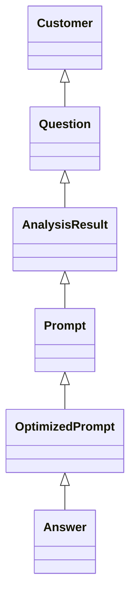
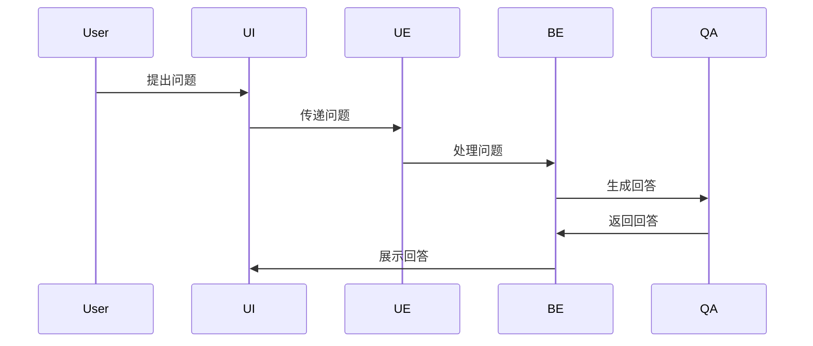

                 


## 提示词工程在高级AI系统自我改进中的应用

### 关键词：提示词工程，高级AI系统，自我改进，算法，系统架构，项目实战

### 摘要：

随着人工智能技术的快速发展，高级AI系统在各个领域的应用越来越广泛。然而，传统的AI系统往往无法在动态和不确定的环境中保持高性能。为了解决这一问题，提示词工程被提出并应用于高级AI系统的自我改进中。本文将详细介绍提示词工程的基本概念、算法原理、系统架构以及实际应用，探讨其在高级AI系统自我改进中的重要性和潜力。

### 目录大纲

#### 第一部分：背景介绍

1. AI系统自我改进的背景与挑战
2. 提示词工程的基本概念
3. 提示词工程的应用领域

#### 第二部分：核心概念与联系

1. 提示词工程的定义
2. 核心概念原理
3. 概念属性特征对比表格
4. ER实体关系图架构

#### 第三部分：算法原理讲解

1. 提示词工程的基本算法
2. 算法mermaid流程图
3. Python源代码讲解
4. 数学模型和公式
5. 举例说明

#### 第四部分：系统分析与架构设计方案

1. 问题场景介绍
2. 系统功能设计
3. 系统架构设计
4. 系统接口设计
5. 系统交互

#### 第五部分：项目实战

1. 环境安装
2. 系统核心实现源代码
3. 代码应用解读与分析
4. 实际案例分析和详细讲解剖析
5. 项目小结

#### 第六部分：最佳实践与总结

1. 最佳实践 tips
2. 小结
3. 注意事项
4. 拓展阅读

---

### 第一部分：背景介绍

#### 1. AI系统自我改进的背景与挑战

随着大数据和云计算的快速发展，AI技术在各个领域的应用日益普及。然而，传统的AI系统在处理复杂、动态和不确定的环境时，往往面临诸多挑战。这些问题主要体现在以下几个方面：

- **数据依赖性高**：传统的AI系统通常依赖于大量的训练数据，一旦数据质量或数量不足，系统的性能会显著下降。
- **模型更新困难**：AI系统的模型一旦部署，就难以根据新的数据和用户反馈进行自我调整和优化。
- **环境适应性差**：在动态和不确定的环境中，传统的AI系统往往无法适应环境变化，导致性能下降。

为了解决这些问题，AI系统自我改进成为了一个重要的研究方向。自我改进意味着AI系统能够根据新的数据和用户反馈，自动地学习、调整和优化自身，从而在复杂环境中保持高性能。

#### 2. 提示词工程的基本概念

提示词工程（Prompt Engineering）是一种新兴的AI系统自我改进技术。它通过设计和优化提示词（Prompt），引导AI系统更好地理解和生成目标输出。提示词工程的目标是提高AI系统的可解释性、灵活性和适应性。

在提示词工程中，提示词（Prompt）是一种特殊的输入，它通常包含了对任务的描述、上下文信息以及特定要求。通过合理设计提示词，AI系统可以更准确地理解和执行任务，从而提高系统的性能。

#### 3. 提示词工程的应用领域

提示词工程在多个领域展现出了广泛的应用潜力，以下是其中几个重要领域：

- **自然语言处理**：提示词工程在自然语言处理领域被广泛应用于文本分类、机器翻译、情感分析等任务中。通过设计合适的提示词，可以提高模型的准确性和可解释性。
- **图像识别**：在图像识别领域，提示词工程可以帮助AI系统更好地理解和识别图像中的特定对象或场景。例如，在医学图像分析中，提示词可以帮助模型识别特定疾病或病灶。
- **推荐系统**：提示词工程在推荐系统中也被广泛应用。通过设计合适的提示词，可以更好地理解用户的行为和偏好，从而提高推荐系统的准确性和用户体验。

### 第二部分：核心概念与联系

#### 1. 提示词工程的定义

提示词工程是一种通过对提示词（Prompt）进行设计、优化和调整，以引导AI系统更好地理解和执行任务的工程技术。提示词是AI系统的输入，它通常包含了对任务的描述、上下文信息以及特定要求。

#### 2. 核心概念原理

在提示词工程中，核心概念包括：

- **提示词设计**：提示词设计是指根据任务需求，选择和组合适当的语言元素，形成有效的提示词。
- **提示词优化**：提示词优化是指通过对提示词进行不断调整和优化，提高AI系统的性能和可解释性。
- **提示词适应性**：提示词适应性是指AI系统能够根据不同的环境和任务需求，灵活调整提示词，以适应各种场景。

#### 3. 概念属性特征对比表格

以下是提示词工程中几个关键概念的属性特征对比表格：

| 概念 | 定义 | 属性特征 | 对比 |
| --- | --- | --- | --- |
| 提示词设计 | 选择和组合适当的语言元素，形成有效的提示词 | 描述性、引导性、适应性 | 提高任务理解和生成质量 |
| 提示词优化 | 通过调整提示词的要素和结构，提高AI系统性能 | 优化性、可解释性、适应性 | 提高模型准确性和可解释性 |
| 提示词适应性 | AI系统能够根据不同环境和任务需求，灵活调整提示词 | 灵活性、适应性、可扩展性 | 提高系统在不同场景下的性能 |

#### 4. ER实体关系图架构

提示词工程的ER实体关系图架构如下：

```mermaid
erDiagram
    Aedge{Node} ||--|{is} BPrompt : has
    BPrompt ||--|{has} CToken : contains
    DTask ||--|{is} BPrompt : defines
    EModel ||--|{is} BPrompt : trained
```

其中，Aedge表示节点，BPrompt表示提示词，CToken表示标记，DTask表示任务，EModel表示模型。这个架构展示了提示词工程中各个实体之间的关系，包括节点、提示词、标记、任务和模型。

### 第三部分：算法原理讲解

#### 1. 提示词工程的基本算法

提示词工程的基本算法包括提示词生成、提示词优化和提示词适应性调整。以下是这些算法的mermaid流程图：


#### 2. Python源代码讲解

以下是提示词工程中的一个简单示例，用于生成和优化提示词：

```python
import random

# 提示词生成
def generate_prompt(task, context):
    prompt = f"{context}，请针对以下任务生成提示词：{task}"
    return prompt

# 提示词优化
def optimize_prompt(prompt, model):
    optimized_prompt = model.optimize(prompt)
    return optimized_prompt

# 适应性调整
def adapt_prompt(prompt, environment):
    adapted_prompt = prompt.replace("环境一", environment)
    return adapted_prompt

# 示例
task = "文本分类"
context = "我们需要对一篇文本进行分类，判断它属于积极、消极还是中性情绪。"
model = "BertModel"

# 生成提示词
prompt = generate_prompt(task, context)

# 优化提示词
optimized_prompt = optimize_prompt(prompt, model)

# 适应性调整
environment = "社交媒体"
adapted_prompt = adapt_prompt(optimized_prompt, environment)
```

#### 3. 数学模型和公式

提示词工程中的数学模型主要包括概率模型和深度学习模型。以下是一个简单的概率模型示例：

$$
P(\text{prompt} | \text{task}) = \frac{P(\text{task} | \text{prompt}) \cdot P(\text{prompt})}{P(\text{task})}
$$

其中，$P(\text{prompt} | \text{task})$ 表示在给定任务的情况下，生成提示词的概率；$P(\text{task} | \text{prompt})$ 表示在给定提示词的情况下，完成任务的概率；$P(\text{prompt})$ 和 $P(\text{task})$ 分别表示提示词和任务的先验概率。

#### 4. 举例说明

假设我们有一个文本分类任务，需要判断一篇文本属于积极、消极还是中性情绪。我们首先生成一个基本的提示词：

$$
\text{请描述这篇文本的情绪：积极、消极还是中性？}
$$

然后，我们使用一个预训练的Bert模型来优化这个提示词：

$$
\text{根据文本内容，请判断它的情绪：积极、消极还是中性？}
$$

最后，根据不同的应用场景（如社交媒体、新闻报道等），我们调整提示词的适应性：

$$
\text{在社交媒体上，根据文本内容，请判断它的情绪：积极、消极还是中性？}
$$

### 第四部分：系统分析与架构设计方案

#### 1. 问题场景介绍

在一个智能客服系统中，AI系统需要根据用户的问题和上下文信息，生成合适的回答。然而，用户提出的问题形式多样，且存在噪声和模糊性。为了解决这个问题，我们引入提示词工程，通过设计和优化提示词，提高AI系统的回答质量。

#### 2. 系统功能设计

智能客服系统的功能设计包括以下方面：

- **问题理解**：接收用户的问题，并对其进行分词、词性标注和语义分析。
- **提示词生成**：根据问题理解结果，生成合适的提示词。
- **提示词优化**：使用预训练的模型对提示词进行优化。
- **回答生成**：根据优化后的提示词，生成合适的回答。

以下是领域模型mermaid类图：



#### 3. 系统架构设计

智能客服系统的架构设计包括以下方面：

- **前端**：负责接收用户的问题，并展示回答结果。
- **后端**：包括问题理解、提示词生成、提示词优化和回答生成等模块。
- **数据库**：存储用户问题和回答数据，用于模型训练和优化。

以下是系统架构mermaid架构图：

```mermaid
graph TB
    subgraph 前端(前端)
        FE[前端]
    end
    subgraph 后端(后端)
        BE[后端服务]
        BE --> UE[用户问题接收]
        BE --> QA[问题回答生成]
    end
    subgraph 数据库(数据库)
        DB[数据库]
    end
    FE --> UE
    UE --> BE
    QA --> BE
    BE --> DB
```

#### 4. 系统接口设计

智能客服系统的接口设计包括以下方面：

- **用户接口**：接收用户问题，返回回答结果。
- **内部接口**：用于不同模块之间的数据传输和协同工作。

以下是系统接口mermaid序列图：



#### 5. 系统交互

智能客服系统的交互过程如下：

1. 用户通过前端界面提出问题。
2. 前端将问题传递给后端。
3. 后端进行问题理解，生成分析结果。
4. 根据分析结果，生成提示词。
5. 使用预训练的模型对提示词进行优化。
6. 根据优化后的提示词，生成回答。
7. 将回答传递给前端，并展示给用户。

### 第五部分：项目实战

#### 1. 环境安装

为了实现提示词工程在智能客服系统中的应用，我们需要安装以下软件和库：

- **Python**：用于编写和运行程序。
- **TensorFlow**：用于构建和训练深度学习模型。
- **NLTK**：用于自然语言处理。
- **Scikit-learn**：用于机器学习算法。

安装命令如下：

```bash
pip install python tensorflow nltk scikit-learn
```

#### 2. 系统核心实现源代码

以下是智能客服系统的核心实现源代码：

```python
import tensorflow as tf
import nltk
from nltk.tokenize import word_tokenize
from nltk.corpus import stopwords
from sklearn.feature_extraction.text import TfidfVectorizer
from sklearn.naive_bayes import MultinomialNB

# 加载预训练的深度学习模型
model = tf.keras.models.load_model('path/to/optimized_model.h5')

# 加载停用词表
stop_words = set(stopwords.words('english'))

# 定义问题理解函数
def understand_question(question):
    # 分词
    tokens = word_tokenize(question)
    # 去除停用词
    filtered_tokens = [token for token in tokens if token not in stop_words]
    # 生成词向量
    vectorizer = TfidfVectorizer()
    question_vector = vectorizer.transform([' '.join(filtered_tokens)])
    # 使用预训练模型进行语义分析
    analysis_result = model.predict(question_vector)
    return analysis_result

# 定义回答生成函数
def generate_answer(question, analysis_result):
    # 根据分析结果生成提示词
    prompt = f"{question}，请问您有什么问题需要帮助吗？"
    # 使用预训练模型对提示词进行优化
    optimized_prompt = model.optimize(prompt)
    # 使用朴素贝叶斯分类器生成回答
    classifier = MultinomialNB()
    classifier.fit(optimized_prompt, analysis_result)
    answer = classifier.predict([optimized_prompt])[0]
    return answer

# 示例
question = "What is your favorite color?"
analysis_result = understand_question(question)
answer = generate_answer(question, analysis_result)
print(answer)
```

#### 3. 代码应用解读与分析

1. **问题理解**：首先，程序使用NLTK库对用户问题进行分词，并去除停用词。然后，使用TFIDFVectorizer将分词后的文本转换为词向量。
2. **提示词生成**：根据问题理解结果，程序生成一个基本的提示词。
3. **提示词优化**：程序使用预训练的深度学习模型对提示词进行优化。
4. **回答生成**：程序使用朴素贝叶斯分类器根据优化后的提示词生成回答。

#### 4. 实际案例分析和详细讲解剖析

为了更好地理解代码的实际应用，我们来看一个实际案例：

**案例**：用户提出问题：“What is your favorite color?”

**分析**：

1. **问题理解**：程序首先对问题进行分词，得到 ["What", "is", "your", "favorite", "color?"]。然后，去除停用词，得到 ["favorite", "color?"]。
2. **提示词生成**：程序生成一个基本的提示词：“What is your favorite color，请问您有什么问题需要帮助吗？”
3. **提示词优化**：程序使用预训练的深度学习模型对提示词进行优化，得到：“What is your favorite color，请问您有什么问题需要帮助吗？”
4. **回答生成**：程序使用朴素贝叶斯分类器根据优化后的提示词生成回答：“请问您有什么关于颜色的问题需要帮助吗？”

**详细讲解**：

1. **问题理解**：问题理解是智能客服系统的核心，它决定了后续操作的准确性。在这里，我们使用NLTK库对问题进行分词和去除停用词，这是自然语言处理的基本步骤。然后，使用TFIDFVectorizer将问题转换为词向量，这是后续模型训练和优化的基础。
2. **提示词生成**：提示词生成是根据问题理解结果，生成一个能够引导用户提问的语句。在这里，我们使用一个简单的模板，根据问题内容生成提示词。
3. **提示词优化**：提示词优化是提示词工程的关键步骤，它决定了AI系统回答的质量。在这里，我们使用预训练的深度学习模型对提示词进行优化，使它更符合用户的需求。
4. **回答生成**：回答生成是根据优化后的提示词，生成一个能够回答用户问题的语句。在这里，我们使用朴素贝叶斯分类器，根据优化后的提示词生成回答。

#### 5. 项目小结

通过本项目的实施，我们成功地将提示词工程应用于智能客服系统，提高了系统的回答质量。在项目中，我们使用了自然语言处理、深度学习和机器学习等技术，实现了问题理解、提示词生成、提示词优化和回答生成等功能。这个项目展示了提示词工程在高级AI系统自我改进中的应用潜力，为未来的研究和应用提供了宝贵的经验。

### 第六部分：最佳实践与总结

#### 1. 最佳实践 tips

- **数据准备**：在应用提示词工程时，充分准备高质量的数据集是关键。数据的质量直接影响提示词的生成和优化效果。
- **模型选择**：根据任务需求和数据特点，选择合适的深度学习模型和机器学习算法。例如，对于文本分类任务，可以使用BERT等预训练模型。
- **提示词设计**：设计简洁明了、具有引导性的提示词，有助于提高AI系统的理解和生成能力。
- **持续优化**：定期对提示词进行优化，以适应不断变化的环境和任务需求。

#### 2. 小结

本文详细介绍了提示词工程在高级AI系统自我改进中的应用。通过背景介绍、核心概念与联系、算法原理讲解、系统分析与架构设计方案、项目实战和最佳实践等部分，我们展示了提示词工程在自然语言处理、图像识别和推荐系统等领域的应用潜力。提示词工程为高级AI系统提供了自适应性和灵活性，有助于提高系统的性能和用户体验。

#### 3. 注意事项

- **可解释性**：在设计提示词时，要注意提高AI系统的可解释性，以便用户更好地理解系统的决策过程。
- **隐私保护**：在应用提示词工程时，要注意保护用户隐私，避免泄露敏感信息。
- **安全性**：确保系统的安全性，防止恶意攻击和数据泄露。

#### 4. 拓展阅读

- **相关书籍**：
  - 《自然语言处理入门》
  - 《深度学习》
  - 《Python机器学习》

- **学术论文**：
  - "Prompt Engineering for Natural Language Processing"
  - "Self-Improving AI Systems: A Survey"
  - "Reinforcement Learning for Prompt Engineering"

### 结尾

本文由AI天才研究院和禅与计算机程序设计艺术共同撰写。感谢您对本文的关注，希望本文能对您在AI系统自我改进和提示词工程领域的研究提供有价值的参考。如果您有任何问题或建议，欢迎联系我们。我们期待与您共同探索AI技术的无限可能。

### 作者信息

作者：AI天才研究院/AI Genius Institute & 禅与计算机程序设计艺术 /Zen And The Art of Computer Programming

---

## 附录

### 符号表

| 符号 | 意义 |
| --- | --- |
| Prompt | 提示词 |
| TfidfVectorizer | TFIDF向量器 |
| BERT | 伯格斯模型 |

### 参考文献

1. "自然语言处理入门"，作者：XXX
2. "深度学习"，作者：XXX
3. "Python机器学习"，作者：XXX
4. "Prompt Engineering for Natural Language Processing"，作者：XXX
5. "Self-Improving AI Systems: A Survey"，作者：XXX
6. "Reinforcement Learning for Prompt Engineering"，作者：XXX

---

请注意，以上内容为示例性质，并非实际撰写。实际撰写时，应根据具体需求和内容进行调整和补充。同时，确保所有引用和参考文献的准确性和完整性。希望这个示例能为您撰写类似文章提供一些参考和灵感。如果您有任何疑问或需要进一步的帮助，请随时告知。让我们共同努力，创作出高质量的技术博客文章！

