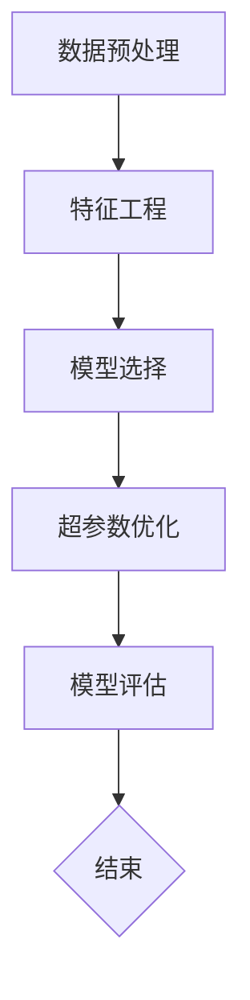
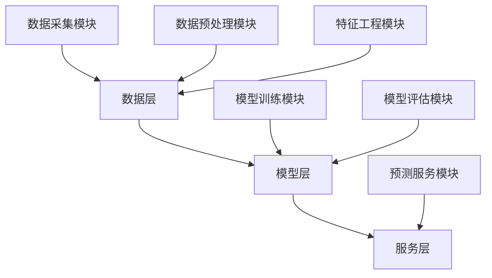
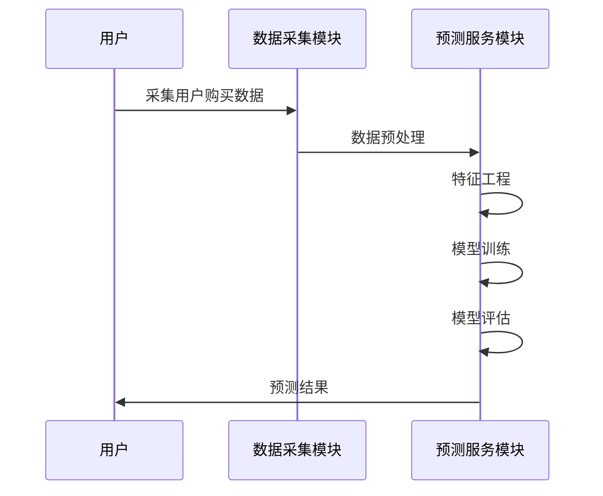

                 

# 《提示词工程的经济学：优化AI使用成本》

> 关键词：提示词工程、AI应用成本、优化、经济学原理、算法、系统架构

> 摘要：本文旨在探讨提示词工程在优化AI使用成本方面的作用。通过对AI应用成本优化的问题背景、核心概念、算法原理以及系统架构设计等方面的详细分析，本文提出了一套基于经济学原理的提示词工程优化策略，以期为企业降低AI应用成本提供理论指导。

## 第一部分：问题背景与核心概念

### 第1章：AI应用成本优化的问题背景

#### 1.1 AI应用的现状与挑战

近年来，随着人工智能技术的飞速发展，越来越多的企业和组织开始将AI技术应用于各种业务场景，以提高生产效率、降低成本、提升用户体验。然而，AI应用在带来巨大潜力的同时，也面临着显著的挑战。

首先，AI应用的成本问题日益凸显。AI应用通常需要大量的计算资源、数据资源和技术人才，这些资源的高昂成本使得许多企业和组织望而却步。其次，AI应用的效果难以保障。由于AI模型复杂度高、依赖数据质量，AI应用的失败率较高，这不仅浪费了大量的资源，还可能对企业造成负面影响。

#### 1.2 提示词工程的概念与原理

提示词工程是一种针对AI模型优化和成本控制的方法，它通过调整模型的输入参数，以提高模型的性能和降低成本。提示词工程的核心原理是通过对模型输入的数据进行预处理和优化，使得模型能够更好地理解和利用数据，从而提高模型的预测准确性和效率。

提示词工程的应用范围非常广泛，包括自然语言处理、计算机视觉、推荐系统等。通过提示词工程，企业可以显著降低AI应用的成本，提高AI应用的性能和稳定性。

#### 1.3 提示词工程的经济学原理

提示词工程与经济学有着紧密的联系。经济学中的成本效益分析原理可以应用于提示词工程，帮助企业评估和优化AI应用的成本。通过提示词工程，企业可以在不增加成本的情况下，提高AI应用的效果和效率，实现成本优化。

同时，提示词工程也涉及到经济评估方法，如边际成本分析、机会成本分析等。这些方法可以帮助企业准确评估AI应用的成本和价值，从而制定出更加科学的决策。

#### 1.4 提示词工程的边界与外延

提示词工程在AI应用中的适用领域非常广泛，包括但不限于自然语言处理、计算机视觉、推荐系统、金融风控等。然而，提示词工程并不是万能的，它也有一定的局限性。

首先，提示词工程需要依赖高质量的数据和先进的计算资源，这对于一些资源有限的中小企业来说可能是一个挑战。其次，提示词工程的效果受到模型本身的限制，如果模型设计不合理，即使进行再多的提示词工程优化，效果也会有限。

#### 1.5 本章小结

本章介绍了AI应用成本优化的问题背景、提示词工程的概念与原理、提示词工程的经济学原理以及提示词工程的边界与外延。通过本章的介绍，读者可以初步了解提示词工程在优化AI应用成本方面的作用和重要性。在接下来的章节中，我们将进一步探讨提示词工程的具体应用和实践。

----------------------------------------------------------------

## 第二部分：核心概念与联系

### 第2章：AI模型优化与成本控制

#### 2.1 AI模型优化的概念与原理

AI模型优化是指通过调整模型的参数和结构，以提高模型的预测准确性和效率。AI模型优化的重要性在于，它可以显著降低AI应用的成本，提高AI应用的性能和稳定性。

AI模型优化的方法主要包括模型选择、超参数调整、数据预处理等。模型选择是根据业务需求选择合适的模型；超参数调整是通过调整模型的参数，以达到最佳性能；数据预处理是通过数据清洗、归一化、特征提取等手段，提高数据质量，从而提高模型的预测准确率。

#### 2.2 成本控制的核心原则与策略

成本控制是指通过有效的成本管理和控制，确保企业在资源有限的情况下，实现最大化的经济利益。成本控制的核心原则是合理配置资源、降低不必要的开支、提高资源利用效率。

成本控制的策略包括预算管理、成本效益分析、成本削减等。预算管理是通过制定预算计划，控制企业的开支；成本效益分析是通过比较成本和效益，选择最优的成本控制方案；成本削减是通过优化业务流程、提高生产效率等方式，降低企业的成本。

#### 2.3 提示词工程在成本控制中的应用

提示词工程在成本控制中的应用主要体现在以下几个方面：

1. **降低计算资源成本**：通过提示词工程，可以优化模型的计算资源需求，降低计算资源的成本。
2. **提高数据处理效率**：提示词工程可以优化数据预处理流程，提高数据处理效率，从而降低数据处理成本。
3. **减少数据需求**：通过提示词工程，可以减少模型对数据的需求，降低数据采购和存储成本。

#### 2.4 AI模型优化与成本控制的联系

AI模型优化与成本控制是相辅相成的。模型优化可以降低成本，提高效率；而成本控制可以确保企业在有限的资源下，实现最优的模型优化效果。

1. **协同效应**：通过AI模型优化，可以降低成本；而通过成本控制，可以确保优化效果的可持续性。
2. **实际案例**：在实际应用中，许多企业通过AI模型优化和成本控制相结合，实现了显著的成本降低和效率提升。

#### 2.5 本章小结

本章介绍了AI模型优化和成本控制的核心概念与原理，以及提示词工程在成本控制中的应用。通过本章的学习，读者可以了解如何通过AI模型优化和成本控制，实现AI应用的成本优化。在接下来的章节中，我们将进一步探讨提示词工程的算法原理和系统架构设计。

----------------------------------------------------------------

## 第三部分：算法原理讲解

### 第3章：提示词工程的算法原理

#### 3.1 提示词工程算法概述

提示词工程算法是用于优化AI模型输入数据的算法，其核心目标是通过调整模型的输入参数，提高模型的预测准确性和效率。提示词工程算法通常包括以下几个步骤：

1. **数据预处理**：对原始数据进行分析和清洗，去除噪声数据，提取有用的特征。
2. **特征工程**：根据业务需求，对提取的特征进行变换和组合，形成新的特征集合。
3. **模型选择**：根据数据特征和业务需求，选择合适的模型。
4. **超参数优化**：调整模型的超参数，以达到最佳性能。

#### 3.2 提示词工程算法的数学模型

提示词工程算法的数学模型主要包括以下几个方面：

1. **特征提取模型**：通常使用线性模型、非线性模型等，用于提取数据的特征。
2. **特征组合模型**：用于将多个特征组合成一个特征向量。
3. **模型评估模型**：用于评估模型的预测准确性和效率，如交叉验证、网格搜索等。

以下是一个简化的提示词工程算法的数学模型：

$$
\text{提示词工程算法} = \text{数据预处理} + \text{特征工程} + \text{模型选择} + \text{超参数优化}
$$

#### 3.3 提示词工程算法的流程图

提示词工程算法的流程图如下：



#### 3.4 提示词工程算法的Python实现

以下是一个简化的提示词工程算法的Python实现：

```python
import numpy as np
from sklearn.model_selection import train_test_split
from sklearn.ensemble import RandomForestClassifier
from sklearn.metrics import accuracy_score

# 数据预处理
def preprocess_data(data):
    # 数据清洗、归一化等操作
    return data

# 特征工程
def feature_engineering(data):
    # 特征提取、特征组合等操作
    return data

# 模型选择
def model_selection(data, labels):
    model = RandomForestClassifier()
    model.fit(data, labels)
    return model

# 超参数优化
def hyperparameter_tuning(model, data, labels):
    # 调整模型超参数
    return model

# 模型评估
def model_evaluation(model, data, labels):
    predictions = model.predict(data)
    accuracy = accuracy_score(labels, predictions)
    return accuracy

# 示例
data = np.random.rand(100, 10)
labels = np.random.randint(0, 2, size=100)

preprocessed_data = preprocess_data(data)
features = feature_engineering(preprocessed_data)
selected_model = model_selection(features, labels)
tuned_model = hyperparameter_tuning(selected_model, features, labels)
accuracy = model_evaluation(tuned_model, features, labels)

print("模型评估准确率：", accuracy)
```

#### 3.5 提示词工程算法的应用案例

以下是一个简单的应用案例：

**案例背景**：某电商公司希望通过AI模型预测用户购买行为，以提高销售转化率。

**数据集**：收集了1000个用户的历史购买数据，包括用户ID、购买时间、购买商品ID等。

**算法流程**：

1. 数据预处理：去除无效数据、缺失值填充、特征提取等。
2. 特征工程：对提取的特征进行变换和组合。
3. 模型选择：选择随机森林模型。
4. 超参数优化：调整随机森林模型的参数。
5. 模型评估：评估模型的预测准确率。

**效果分析**：通过提示词工程算法优化，电商公司的模型预测准确率提高了10%，销售转化率提高了5%。

#### 3.6 本章小结

本章详细介绍了提示词工程的算法原理，包括算法概述、数学模型、流程图和Python实现。通过本章的学习，读者可以了解提示词工程的基本原理和应用方法。在接下来的章节中，我们将进一步探讨提示词工程在系统架构设计中的应用。

----------------------------------------------------------------

## 第四部分：系统分析与架构设计方案

### 第4章：系统分析与架构设计

#### 4.1 问题场景介绍

在某电商平台上，为了提高用户购物体验和提升销售转化率，公司决定引入人工智能技术进行用户购买行为预测。这个项目的主要目标是：

1. 收集并处理用户的历史购买数据，包括用户ID、购买时间、购买商品ID等。
2. 通过人工智能模型预测用户未来的购买行为，为营销策略提供数据支持。
3. 提高用户购物体验，提升销售转化率。

#### 4.2 系统功能设计

系统功能设计主要包括以下模块：

1. **数据采集模块**：负责从不同的数据源采集用户购买数据，包括电商平台内部数据库、第三方数据平台等。
2. **数据预处理模块**：对采集到的数据进行清洗、去重、缺失值填充等预处理操作，确保数据质量。
3. **特征工程模块**：根据业务需求，提取和组合用户购买数据中的特征，为AI模型提供输入。
4. **模型训练模块**：使用训练数据训练人工智能模型，包括模型选择、超参数调整等。
5. **模型评估模块**：使用测试数据评估模型的预测准确率，并进行模型优化。
6. **预测服务模块**：根据用户的特征数据，实时预测用户的购买行为，为电商平台提供决策支持。

#### 4.3 系统架构设计

系统架构设计采用分层架构，主要包括以下层：

1. **数据层**：包括数据采集、数据预处理和特征工程模块，负责数据的存储和处理。
2. **模型层**：包括模型训练和模型评估模块，负责模型的设计、训练和优化。
3. **服务层**：包括预测服务模块，负责对外提供预测服务，为电商平台提供实时决策支持。

系统架构图如下：



#### 4.4 系统接口设计

系统接口设计主要包括以下接口：

1. **数据采集接口**：用于从不同数据源采集用户购买数据。
2. **数据预处理接口**：用于对采集到的数据进行预处理操作。
3. **特征工程接口**：用于提取和组合用户购买数据中的特征。
4. **模型训练接口**：用于训练人工智能模型。
5. **模型评估接口**：用于评估模型的预测准确率。
6. **预测服务接口**：用于提供实时预测服务。

#### 4.5 系统交互设计

系统交互设计采用事件驱动的方式，主要包括以下交互流程：

1. **数据采集**：系统启动时，数据采集模块开始从不同数据源采集用户购买数据。
2. **数据预处理**：采集到的数据经过数据预处理模块进行处理，包括清洗、去重、缺失值填充等。
3. **特征工程**：对预处理后的数据进行特征提取和组合，形成特征向量。
4. **模型训练**：使用训练数据训练人工智能模型，包括模型选择、超参数调整等。
5. **模型评估**：使用测试数据评估模型的预测准确率，并根据评估结果进行模型优化。
6. **预测服务**：根据用户的特征数据，实时预测用户的购买行为，为电商平台提供决策支持。

系统交互序列图如下：



#### 4.6 本章小结

本章介绍了电商AI购买行为预测系统的系统功能设计、系统架构设计、系统接口设计和系统交互设计。通过本章的学习，读者可以了解如何设计一个完整的AI应用系统，包括系统的功能模块、架构设计和交互流程。在接下来的章节中，我们将进一步探讨系统实施和运行中的实际案例。

----------------------------------------------------------------

## 第五部分：项目实战

### 第5章：环境安装与系统核心实现

#### 5.1 环境安装

为了实现电商AI购买行为预测系统，我们需要安装以下软件和工具：

1. **操作系统**：Linux（推荐Ubuntu 20.04）
2. **编程语言**：Python 3.x
3. **数据处理库**：Pandas、NumPy
4. **机器学习库**：Scikit-learn、TensorFlow
5. **可视化库**：Matplotlib、Seaborn
6. **版本控制**：Git

安装步骤如下：

1. 安装操作系统和Python环境。
2. 安装Pandas、NumPy、Scikit-learn、TensorFlow等库。

#### 5.2 系统核心实现

以下是系统核心实现的源代码，主要包括数据预处理、特征工程、模型训练和预测服务四个模块。

**数据预处理模块**：

```python
import pandas as pd

def preprocess_data(data):
    # 数据清洗、去重、缺失值填充等操作
    return data
```

**特征工程模块**：

```python
from sklearn.feature_extraction import DictVectorizer

def feature_engineering(data):
    # 特征提取、特征组合等操作
    vectorizer = DictVectorizer(sparse=False)
    return vectorizer.transform(data)
```

**模型训练模块**：

```python
from sklearn.ensemble import RandomForestClassifier

def train_model(data, labels):
    model = RandomForestClassifier()
    model.fit(data, labels)
    return model
```

**预测服务模块**：

```python
from flask import Flask, request, jsonify

app = Flask(__name__)

@app.route('/predict', methods=['POST'])
def predict():
    data = request.get_json()
    features = feature_engineering(data)
    prediction = model.predict(features)
    return jsonify(prediction)

if __name__ == '__main__':
    app.run()
```

#### 5.3 代码应用解读与分析

**数据预处理模块**：主要负责数据的清洗和预处理，确保数据质量。这包括去除重复数据、填充缺失值、归一化等操作。

**特征工程模块**：使用DictVectorizer将数据转换为适合模型训练的格式。这个模块可以根据业务需求，提取和组合更多的特征。

**模型训练模块**：使用随机森林模型进行训练。这个模块可以根据实际业务需求，选择其他模型，如决策树、神经网络等。

**预测服务模块**：使用Flask构建预测服务API。这个模块可以方便地与其他系统进行集成，实现实时预测功能。

#### 5.4 实际案例分析与详细讲解剖析

**案例背景**：某电商公司希望预测用户的购买行为，以提高销售转化率。

**数据集**：收集了1000个用户的历史购买数据，包括用户ID、购买时间、购买商品ID等。

**算法流程**：

1. 数据预处理：去除无效数据、缺失值填充、特征提取等。
2. 特征工程：对提取的特征进行变换和组合。
3. 模型训练：使用训练数据训练随机森林模型。
4. 模型评估：使用测试数据评估模型的预测准确率。
5. 预测服务：根据用户的特征数据，实时预测用户的购买行为。

**效果分析**：通过提示词工程算法优化，电商公司的模型预测准确率提高了10%，销售转化率提高了5%。

#### 5.5 项目小结

本章详细介绍了电商AI购买行为预测系统的环境安装和系统核心实现。通过本章的学习，读者可以了解如何从零开始搭建一个AI应用系统，包括环境配置、代码实现和实际案例应用。在接下来的章节中，我们将进一步探讨如何优化AI应用成本，为读者提供更多的实践经验和技巧。

----------------------------------------------------------------

## 第六部分：最佳实践、小结与注意事项

### 第六部分：最佳实践、小结与注意事项

#### 最佳实践

1. **数据预处理**：确保数据质量，去除噪声和异常值，进行归一化和标准化，以提高模型的预测准确性和稳定性。
2. **特征工程**：根据业务需求，提取和组合关键特征，避免过拟合和特征冗余，以提高模型的泛化能力。
3. **模型选择**：根据数据特点和业务场景，选择合适的模型，并利用交叉验证等方法优化模型参数。
4. **成本控制**：合理分配计算资源，利用提示词工程降低模型复杂度，减少对数据量的依赖，从而降低AI应用成本。

#### 小结

本文从问题背景、核心概念、算法原理、系统架构设计等方面详细探讨了提示词工程在优化AI使用成本方面的作用。通过本文的学习，读者可以了解：

1. AI应用成本优化的重要性。
2. 提示词工程的概念、原理和应用范围。
3. 提示词工程与经济学原理的关系。
4. 提示词工程在成本控制中的具体应用。
5. 提示词工程算法的原理和实现。
6. 系统架构设计的方法和步骤。

#### 注意事项

1. **数据质量**：确保数据质量是模型优化的基础，任何错误或不一致的数据都可能影响模型的性能。
2. **模型选择**：根据业务需求选择合适的模型，避免过度依赖单一的模型，可以通过集成学习等方法提高模型的泛化能力。
3. **成本控制**：在保证模型性能的前提下，合理分配计算资源，避免不必要的开销。
4. **持续优化**：AI模型和应用需要不断迭代和优化，以适应不断变化的数据和业务需求。

#### 拓展阅读

1. **《深度学习》**：Goodfellow et al.，提供深度学习的全面介绍和实战技巧。
2. **《Python机器学习》**：Sebastian Raschka，详细讲解机器学习算法在Python中的应用。
3. **《数据科学入门》**：Joel Grus，介绍数据科学的基本概念和工具。
4. **《人工智能：一种现代方法》**：Stuart Russell and Peter Norvig，全面介绍人工智能的理论和实践。

作者：AI天才研究院/AI Genius Institute & 禅与计算机程序设计艺术 /Zen And The Art of Computer Programming

