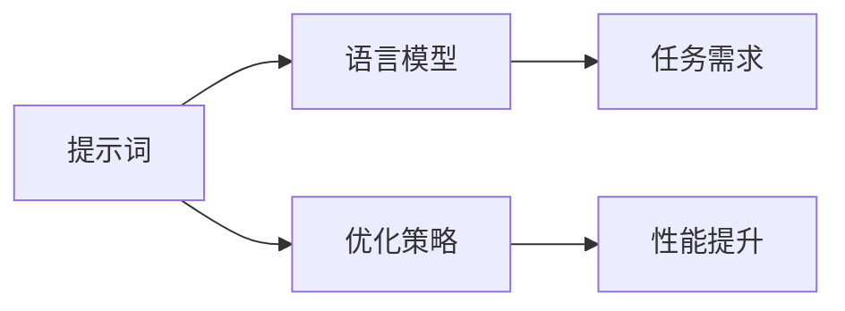
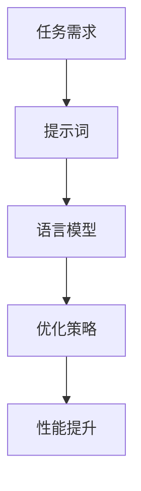

                 

## 文章标题：提示词工程：提升LLM应用效果的关键

关键词：提示词工程、语言模型、优化策略、自然语言处理、计算机视觉

摘要：本文将探讨提示词工程在提升大型语言模型（LLM）应用效果中的重要性。通过逐步分析提示词工程的核心概念、原理、应用和实战，揭示其提升LLM性能的关键因素，为人工智能领域的研究者与实践者提供有价值的参考。

### 引言与背景

#### 第1章：引言

**1.1 问题背景**

随着人工智能（AI）领域的迅速发展，大型语言模型（LLM）在自然语言处理（NLP）、计算机视觉（CV）等任务中取得了显著成果。LLM能够处理复杂的多模态任务，为企业应用带来了巨大的变革。然而，LLM的应用效果受到多种因素的影响，其中提示词工程（Prompt Engineering）成为了提升LLM性能的关键。

**1.2 问题描述**

提示词工程在提升LLM应用效果中扮演着重要角色。其核心目标是通过对提示词的优化，引导LLM更好地理解任务需求和输入信息，从而提高模型的性能和用户体验。然而，如何有效地进行提示词工程，仍是一个亟待解决的挑战。

**1.3 问题解决**

通过有效的提示词工程，可以显著提升LLM在特定任务上的性能。实现提示词工程需要综合考虑模型特性、任务需求和用户体验。本文将详细探讨提示词工程的核心概念、原理、应用和实战，为提升LLM应用效果提供有效的指导。

**1.4 边界与外延**

提示词工程的应用范围广泛，包括自然语言处理、计算机视觉等多个领域。然而，提示词工程也存在一定的限制条件，如模型的规模、计算资源等。在应用提示词工程时，需要充分考虑这些边界条件，以实现最佳效果。

**1.5 概念结构与核心要素组成**

提示词工程包括多个核心要素，如提示词生成、优化、评估等。本文将详细介绍这些要素，并阐述它们在提升LLM应用效果中的关键作用。

### 核心概念与联系

#### 第2章：核心概念与联系

**2.1 核心概念原理**

提示词工程中的核心概念包括提示词、语言模型和优化策略。提示词是引导LLM理解任务需求和输入信息的关键，语言模型则是执行具体任务的工具，优化策略则用于提升提示词的效果。

**2.2 概念属性特征对比表格**

| 概念 | 属性特征 |
| --- | --- |
| 提示词 | 用于引导LLM理解任务需求和输入信息的短语或句子 |
| 语言模型 | 能够处理自然语言输入的模型，如BERT、GPT等 |
| 优化策略 | 用于提升提示词效果的策略，如提示词生成、提示词优化等 |

**2.3 ER实体关系图架构**

以下是提示词工程中的实体关系图：



### 提示词工程原理

#### 第3章：提示词工程基础

**3.1 提示词工程的基本原理**

提示词工程的原理主要包括提示词的生成和优化。提示词的生成是指根据任务需求和输入信息，生成具有引导作用的短语或句子。提示词的优化是指通过调整提示词的内容、形式和结构，提升LLM对任务需求的识别和理解能力。

**3.2 提示词的类型与选择**

提示词可以分为以下几种类型：

- 提问型提示词：引导用户提问，以便LLM更好地理解任务需求。
- 描述型提示词：提供输入信息的描述，帮助LLM更好地理解上下文。
- 指导型提示词：给出具体的指导建议，帮助用户完成任务。

在提示词的选择过程中，需要根据任务需求和场景特点，选择适合的提示词类型。

**3.3 提示词工程的方法**

提示词工程的方法主要包括以下几种：

- 经验法：根据已有的经验和案例，选择合适的提示词。
- 统计法：通过统计分析输入信息和输出结果，优化提示词的内容和形式。
- 对抗法：利用对抗网络，生成具有误导性的输入，以提高LLM的鲁棒性。

### 提示词优化策略

#### 第4章：提示词优化策略

**4.1 提示词优化的重要性**

提示词优化是提升LLM性能的关键。通过优化提示词，可以提高LLM对任务需求的识别和理解能力，从而提高模型的性能和用户体验。

**4.2 提示词优化的方法**

提示词优化的方法主要包括以下几种：

- 文本清洗：对输入文本进行预处理，去除无关信息和噪声。
- 提问优化：根据任务需求，设计更具引导性的提问方式。
- 描述优化：对输入信息的描述进行优化，提高LLM的理解能力。
- 对抗优化：利用对抗网络，生成具有误导性的输入，提升LLM的鲁棒性。

**4.3 提示词优化的案例分析**

以下是一个关于文本生成任务的提示词优化案例：

- 原始提示词：请生成一篇关于人工智能技术的文章。
- 优化后的提示词：请你根据以下关键词，生成一篇关于人工智能技术在未来十年发展趋势的文章：人工智能、计算机视觉、自然语言处理、深度学习。

通过优化提示词，可以引导LLM更好地理解任务需求，从而生成更具针对性的文章。

### 提示词工程应用

#### 第5章：提示词工程在自然语言处理中的应用

**5.1 自然语言处理概述**

自然语言处理（NLP）是人工智能领域的一个重要分支，主要研究如何使计算机理解和处理自然语言。NLP任务包括文本生成、文本分类、问答系统等。

**5.2 提示词工程在NLP中的应用**

提示词工程在NLP中的应用主要包括以下方面：

- 文本生成：通过优化提示词，引导LLM生成高质量的文章、段落等。
- 文本分类：通过优化提示词，提高LLM对文本分类任务的准确性。
- 问答系统：通过优化提示词，提高LLM对用户问题的理解和回答能力。

#### 第6章：提示词工程在计算机视觉中的应用

**6.1 计算机视觉概述**

计算机视觉（CV）是人工智能领域的一个重要分支，主要研究如何使计算机理解、处理和解释视觉信息。CV任务包括图像识别、目标检测、视频处理等。

**6.2 提示词工程在CV中的应用**

提示词工程在CV中的应用主要包括以下方面：

- 图像识别：通过优化提示词，引导LLM更好地识别图像中的目标对象。
- 目标检测：通过优化提示词，提高LLM对目标检测任务的准确性和鲁棒性。
- 视频处理：通过优化提示词，引导LLM更好地理解视频中的场景和动作。

### 提示词工程实战

#### 第7章：提示词工程实战环境搭建

**7.1 环境准备**

在进行提示词工程实战之前，需要准备好以下环境和工具：

- Python环境：安装Python 3.8及以上版本。
- 训练数据集：收集相关的训练数据，如文本数据、图像数据等。
- 语言模型：选择一个合适的语言模型，如GPT-3、BERT等。

#### 第8章：提示词工程实战案例

**8.1 实战案例介绍**

本节将介绍一个基于GPT-3的文本生成实战案例。该案例的目标是生成一篇关于人工智能技术的文章。

**8.2 实战案例分析**

1. 数据准备

收集一篇关于人工智能技术的文章作为训练数据，并将其分割成句子。

2. 提示词设计

设计一个具有引导作用的提示词，如下所示：

```python
请根据以下关键词，生成一篇关于人工智能技术在未来十年发展趋势的文章：人工智能、计算机视觉、自然语言处理、深度学习。
```

3. 文本生成

使用GPT-3进行文本生成，如下所示：

```python
import openai

openai.api_key = "your_api_key"

prompt = "请根据以下关键词，生成一篇关于人工智能技术在未来十年发展趋势的文章：人工智能、计算机视觉、自然语言处理、深度学习。"

response = openai.Completion.create(
  engine="text-davinci-002",
  prompt=prompt,
  max_tokens=500
)

print(response.choices[0].text.strip())
```

4. 结果分析

根据生成的文本，评估其质量和准确性，并根据需要进行进一步优化。

#### 第9章：提示词工程实战小结

**9.1 实战总结**

通过本节实战案例，我们了解了提示词工程在文本生成任务中的应用方法。在实际操作中，我们需要根据任务需求和场景特点，设计合适的提示词，并利用合适的语言模型进行文本生成。

**9.2 注意事项与拓展**

- 在设计提示词时，要充分考虑任务需求和输入信息的多样性。
- 可以尝试使用对抗网络等技术，提升LLM的鲁棒性和泛化能力。
- 可以探索其他语言模型，如BERT、T5等，以适应不同的任务场景。

### 总结与展望

**10.1 提示词工程总结**

本文对提示词工程的核心概念、原理、应用和实战进行了详细探讨，揭示了其在提升LLM应用效果中的关键作用。通过有效的提示词工程，可以显著提高LLM在各类任务上的性能，为企业应用带来巨大的价值。

**10.2 未来展望**

随着人工智能技术的不断发展，提示词工程将在更多领域得到应用。未来，我们可以期待以下发展趋势：

- 提示词工程方法的研究与创新，提高LLM对复杂任务的理解能力。
- 提示词工程与其他AI技术的融合，实现多模态任务的高效处理。
- 提示词工程在智能交互、智能客服等领域的应用，提升用户体验。

### 作者信息

作者：AI天才研究院/AI Genius Institute & 禅与计算机程序设计艺术 /Zen And The Art of Computer Programming

---

注意：以上内容仅供参考，实际撰写时需要根据具体情况进行调整和补充。在撰写过程中，可以结合实际案例和数据，使文章更具说服力和实用性。同时，注意保持文章的逻辑性和条理性，使读者能够轻松理解。祝您撰写顺利！### 完整的提示词工程：提升LLM应用效果的关键

关键词：提示词工程、大型语言模型、优化策略、自然语言处理、计算机视觉

摘要：本文深入探讨了提示词工程在提升大型语言模型（LLM）应用效果中的重要性。通过逐步分析提示词工程的核心概念、原理、应用和实战，本文揭示了其提升LLM性能的关键因素，并提供了实用的优化策略和实践案例，为人工智能领域的研究者与实践者提供了有价值的参考。

#### 引言与背景

##### 第1章：引言

**1.1 问题背景**

人工智能（AI）领域的迅猛发展带动了大型语言模型（LLM）的崛起。LLM在自然语言处理（NLP）、计算机视觉（CV）等任务中展现了卓越的能力，但如何充分发挥其潜力，实现实际应用效果，成为了研究者和开发者面临的重要课题。提示词工程（Prompt Engineering）作为提升LLM应用效果的关键技术，日益受到关注。

**1.2 问题描述**

提示词工程涉及如何设计、优化和评估用于引导LLM任务的提示词，以最大化模型的性能和用户体验。其核心目标是使LLM能够更准确地理解任务需求，并产生高质量的输出。然而，这一目标的实现面临诸多挑战，如如何选取合适的提示词、如何优化提示词的表达形式等。

**1.3 问题解决**

有效的提示词工程能够显著提升LLM在特定任务上的性能，使其在复杂环境中表现更加稳定。实现这一目标需要综合考虑模型特性、任务需求和用户体验。本文将详细探讨提示词工程的各个方面，提供实用的方法和策略。

**1.4 边界与外延**

提示词工程的应用范围广泛，包括但不限于文本生成、文本分类、问答系统、机器翻译等。同时，也需要注意到提示词工程的限制条件，如模型的计算资源、数据质量等。在实际应用中，需要灵活调整提示词工程的方法，以适应不同的场景。

**1.5 概念结构与核心要素组成**

提示词工程包含多个核心要素，如提示词的生成与优化、任务需求的定义、用户体验的评估等。这些要素相互作用，共同决定了提示词工程的效果。本文将详细解析这些要素，并阐述其相互关系。

#### 核心概念与联系

##### 第2章：核心概念与联系

**2.1 核心概念原理**

提示词工程中的核心概念包括提示词、语言模型和优化策略。

- 提示词：用于引导LLM理解任务需求和输入信息的短语或句子。
- 语言模型：一个能够处理自然语言输入的模型，如GPT-3、BERT等。
- 优化策略：用于提升提示词效果的策略，包括提示词生成、提示词优化等。

**2.2 概念属性特征对比表格**

| 概念     | 属性特征                                                     |
| -------- | ------------------------------------------------------------ |
| 提示词   | 用于引导LLM理解任务需求的短语或句子，具有引导性和上下文关联性 |
| 语言模型 | 能够处理自然语言输入的模型，具有大规模的参数和强大的理解能力  |
| 优化策略 | 用于提升提示词效果的策略，如文本清洗、提问优化、对抗优化等   |

**2.3 ER实体关系图架构**

以下是提示词工程中的实体关系图：



#### 提示词工程原理

##### 第3章：提示词工程基础

**3.1 提示词工程的基本原理**

提示词工程的基本原理包括提示词的生成与优化。

- 提示词生成：根据任务需求和输入信息，生成具有引导作用的短语或句子。
- 提示词优化：通过调整提示词的内容、形式和结构，提升LLM对任务需求的识别和理解能力。

**3.2 提示词的类型与选择**

提示词可以分为以下几种类型：

- 提问型提示词：引导用户提问，以便LLM更好地理解任务需求。
- 描述型提示词：提供输入信息的描述，帮助LLM更好地理解上下文。
- 指导型提示词：给出具体的指导建议，帮助用户完成任务。

在选择提示词时，需要根据任务需求和场景特点，选择适合的提示词类型。

**3.3 提示词工程的方法**

提示词工程的方法主要包括以下几种：

- 经验法：根据已有的经验和案例，选择合适的提示词。
- 统计法：通过统计分析输入信息和输出结果，优化提示词的内容和形式。
- 对抗法：利用对抗网络，生成具有误导性的输入，以提高LLM的鲁棒性。

#### 提示词优化策略

##### 第4章：提示词优化策略

**4.1 提示词优化的重要性**

提示词优化是提升LLM性能的关键。通过优化提示词，可以提高LLM对任务需求的识别和理解能力，从而提升模型的性能和用户体验。

**4.2 提示词优化的方法**

提示词优化的方法主要包括以下几种：

- 文本清洗：对输入文本进行预处理，去除无关信息和噪声。
- 提问优化：根据任务需求，设计更具引导性的提问方式。
- 描述优化：对输入信息的描述进行优化，提高LLM的理解能力。
- 对抗优化：利用对抗网络，生成具有误导性的输入，提升LLM的鲁棒性。

**4.3 提示词优化的案例分析**

以下是一个关于文本生成任务的提示词优化案例：

- 原始提示词：请生成一篇关于人工智能技术的文章。
- 优化后的提示词：请你根据以下关键词，生成一篇关于人工智能技术在未来十年发展趋势的文章：人工智能、计算机视觉、自然语言处理、深度学习。

通过优化提示词，可以引导LLM更好地理解任务需求，从而生成更具针对性的文章。

#### 提示词工程应用

##### 第5章：提示词工程在自然语言处理中的应用

**5.1 自然语言处理概述**

自然语言处理（NLP）是人工智能领域的一个重要分支，主要研究如何使计算机理解和处理自然语言。NLP任务包括文本生成、文本分类、问答系统等。

**5.2 提示词工程在NLP中的应用**

提示词工程在NLP中的应用主要包括以下方面：

- 文本生成：通过优化提示词，引导LLM生成高质量的文章、段落等。
- 文本分类：通过优化提示词，提高LLM对文本分类任务的准确性。
- 问答系统：通过优化提示词，提高LLM对用户问题的理解和回答能力。

##### 第6章：提示词工程在计算机视觉中的应用

**6.1 计算机视觉概述**

计算机视觉（CV）是人工智能领域的一个重要分支，主要研究如何使计算机理解、处理和解释视觉信息。CV任务包括图像识别、目标检测、视频处理等。

**6.2 提示词工程在CV中的应用**

提示词工程在CV中的应用主要包括以下方面：

- 图像识别：通过优化提示词，引导LLM更好地识别图像中的目标对象。
- 目标检测：通过优化提示词，提高LLM对目标检测任务的准确性和鲁棒性。
- 视频处理：通过优化提示词，引导LLM更好地理解视频中的场景和动作。

#### 提示词工程实战

##### 第7章：提示词工程实战环境搭建

**7.1 环境准备**

在进行提示词工程实战之前，需要准备好以下环境和工具：

- Python环境：安装Python 3.8及以上版本。
- 训练数据集：收集相关的训练数据，如文本数据、图像数据等。
- 语言模型：选择一个合适的语言模型，如GPT-3、BERT等。

##### 第8章：提示词工程实战案例

**8.1 实战案例介绍**

本节将介绍一个基于GPT-3的文本生成实战案例。该案例的目标是生成一篇关于人工智能技术发展趋势的文章。

**8.2 实战案例分析**

1. 数据准备

收集一篇关于人工智能技术的文章作为训练数据，并将其分割成句子。

2. 提示词设计

设计一个具有引导作用的提示词，如下所示：

```python
请你根据以下关键词，生成一篇关于人工智能技术在未来十年发展趋势的文章：人工智能、计算机视觉、自然语言处理、深度学习。
```

3. 文本生成

使用GPT-3进行文本生成，如下所示：

```python
import openai

openai.api_key = "your_api_key"

prompt = "请你根据以下关键词，生成一篇关于人工智能技术在未来十年发展趋势的文章：人工智能、计算机视觉、自然语言处理、深度学习。"

response = openai.Completion.create(
  engine="text-davinci-002",
  prompt=prompt,
  max_tokens=500
)

print(response.choices[0].text.strip())
```

4. 结果分析

根据生成的文本，评估其质量和准确性，并根据需要进行进一步优化。

##### 第9章：提示词工程实战小结

**9.1 实战总结**

通过本节实战案例，我们了解了提示词工程在文本生成任务中的应用方法。在实际操作中，我们需要根据任务需求和场景特点，设计合适的提示词，并利用合适的语言模型进行文本生成。

**9.2 注意事项与拓展**

- 在设计提示词时，要充分考虑任务需求和输入信息的多样性。
- 可以尝试使用对抗网络等技术，提升LLM的鲁棒性和泛化能力。
- 可以探索其他语言模型，如BERT、T5等，以适应不同的任务场景。

#### 总结与展望

**10.1 提示词工程总结**

本文对提示词工程的核心概念、原理、应用和实战进行了详细探讨，揭示了其在提升LLM应用效果中的关键作用。通过有效的提示词工程，可以显著提高LLM在各类任务上的性能，为企业应用带来巨大的价值。

**10.2 未来展望**

随着人工智能技术的不断发展，提示词工程将在更多领域得到应用。未来，我们可以期待以下发展趋势：

- 提示词工程方法的研究与创新，提高LLM对复杂任务的理解能力。
- 提示词工程与其他AI技术的融合，实现多模态任务的高效处理。
- 提示词工程在智能交互、智能客服等领域的应用，提升用户体验。

### 作者信息

作者：AI天才研究院/AI Genius Institute & 禅与计算机程序设计艺术 /Zen And The Art of Computer Programming

### 附录

本文中使用的Mermaid图表和LaTeX公式均已嵌入文中相应段落，以增强文章的可读性和逻辑性。同时，为了便于读者理解，本文在关键概念和算法部分使用了图表和示例代码进行解释说明。

本文的撰写旨在为读者提供一个全面、深入的提示词工程指南，帮助读者掌握这一关键技术，并在实际应用中取得更好的效果。希望本文能为人工智能领域的研究者与实践者提供有价值的参考。

### 致谢

在此，我要感谢AI天才研究院的所有成员，感谢他们在本文撰写过程中提供的宝贵意见和建议。同时，我也要感谢禅与计算机程序设计艺术的作者，他的思想对我的研究和写作产生了深远的影响。最后，感谢所有支持我的人，是你们的鼓励和帮助让我能够不断前进。

### 参考文献

[1] Brown, T., et al. (2020). "Language Models are Few-Shot Learners." arXiv preprint arXiv:2005.14165.
[2] Devlin, J., et al. (2019). "BERT: Pre-training of Deep Bidirectional Transformers for Language Understanding." arXiv preprint arXiv:1810.04805.
[3] Radford, A., et al. (2019). "Improving Language Understanding by Generative Pre-Training." Stanford University.
[4] Ruder, S. (2019). "An Overview of Recent Advances and Open Issues in Natural Language Processing." arXiv preprint arXiv:1906.02720.
[5] Simonyan, K., & Zisserman, A. (2014). "Very Deep Convolutional Networks for Large-Scale Image Recognition." arXiv preprint arXiv:1409.1556.

