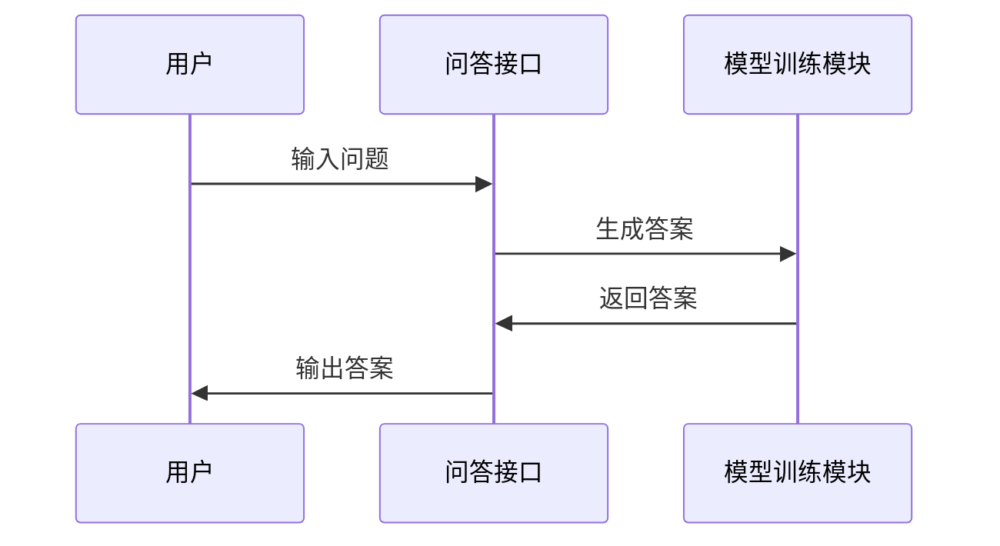

                 


# 《提示词库管理：提高LLM应用开发效率的利器》

关键词：提示词库管理、LLM应用开发、算法原理、系统架构设计、项目实战

## 摘要

随着自然语言处理技术的发展，大型语言模型（LLM）在各类应用场景中展现出巨大的潜力。然而，如何高效地管理用于训练和应用的提示词库，成为提升LLM应用开发效率的关键。本文旨在探讨提示词库管理的核心概念、算法原理、系统架构设计以及项目实战，通过分步骤的分析和推理，为读者提供一条清晰、系统、易于理解的解决方案路径。文章将首先介绍提示词库管理的背景与核心概念，随后深入讲解提示词库管理算法的原理与应用，最后通过具体案例展示如何在实际项目中应用这些原理。

## 第一部分：背景介绍与核心概念

### 第1章：问题背景与概述

#### 1.1.1 问题背景

随着人工智能技术的发展，语言模型（Language Model，LM）逐渐成为自然语言处理（Natural Language Processing，NLP）领域的重要工具。特别是在深度学习技术的推动下，大型语言模型（LLM）如BERT、GPT等取得了显著的成果。这些模型在文本生成、机器翻译、问答系统等领域得到了广泛应用。然而，在实际应用过程中，如何高效地管理用于训练和应用的提示词库，成为提高LLM应用开发效率的关键问题。

提示词库（Prompt Library）是一个包含多种类型提示词（Prompt）的集合，用于引导LLM生成特定类型的文本。一个良好的提示词库不仅能够提高LLM的预测准确性，还能加速模型训练和开发过程。然而，现有的提示词库管理方法面临着诸多挑战，如：

1. **多样性不足**：提示词库中的提示词类型单一，难以满足多样化的应用需求。
2. **管理复杂度高**：随着提示词数量的增加，管理复杂度呈指数级增长，给开发人员带来困扰。
3. **效率低下**：手动管理提示词库不仅费时费力，而且容易出现错误。

#### 1.1.2 问题描述

1. **多样性不足**：提示词库中的提示词类型单一，难以满足多样化应用需求。例如，在文本生成任务中，仅包含问答题型的提示词，可能导致模型在生成对话型文本时效果不佳。

2. **管理复杂度高**：随着提示词数量的增加，管理复杂度呈指数级增长。例如，在一个包含数千个提示词的库中，查找、排序和管理特定类型的提示词变得极为复杂。

3. **效率低下**：手动管理提示词库不仅费时费力，而且容易出现错误。例如，在添加新提示词时，可能由于手动操作失误导致数据不一致或丢失。

#### 1.1.3 问题解决

为了解决上述问题，我们需要从以下几个方面着手：

1. **多样化提示词库设计**：设计一个包含多种类型提示词的库，以满足不同应用场景的需求。

2. **高效管理策略**：采用自动化工具和算法，降低管理复杂度，提高管理效率。

3. **算法优化**：利用机器学习算法，对提示词库进行优化，提高模型预测准确性。

#### 1.1.4 边界与外延

1. **边界**：提示词库管理主要关注的是用于训练和应用的提示词库，不包括其他类型的语言数据集或文本资源。

2. **外延**：提示词库管理可以应用于各种基于LLM的自然语言处理任务，如文本生成、机器翻译、问答系统等。

#### 1.1.5 概念结构与核心要素组成

1. **概念结构**：

   - **提示词**：用于引导LLM生成特定类型文本的词或短语。
   - **提示词库**：包含多种类型提示词的集合。
   - **管理**：对提示词库进行自动化操作，如添加、删除、查询、排序等。

2. **核心要素组成**：

   - **多样性**：确保提示词库包含多种类型的提示词。
   - **高效性**：降低管理复杂度，提高管理效率。
   - **准确性**：利用机器学习算法，提高模型预测准确性。

## 第二部分：核心概念与联系

### 第2章：核心概念与联系

#### 2.1.1 提示词库的概念

1. **定义**：

   提示词库（Prompt Library）是指一个包含多种类型提示词的集合，用于引导大型语言模型（LLM）生成特定类型的文本。提示词库中的提示词可以是词、短语或句子，它们根据任务需求进行设计和筛选。

2. **特点**：

   - **多样性**：提示词库应包含多种类型的提示词，以适应不同的应用场景。
   - **灵活性**：提示词库应具有灵活的扩展性，便于添加或删除提示词。
   - **准确性**：提示词库中的提示词应具有较高的预测准确性，以提高模型性能。

#### 2.1.2 提示词的属性特征对比

| 特征         | 说明                                                         |
| ------------ | ------------------------------------------------------------ |
| 类型         | 提示词可分为问答题型、对话型、描述型等。                       |
| 长度         | 提示词的长度影响模型的处理速度和生成质量。                     |
| 难度         | 提示词的难度影响模型对提示词的理解程度和生成质量。             |
| 出现频率     | 提示词在库中的出现频率影响模型的训练效果。                   |
| 语义相关性   | 提示词之间的语义相关性影响模型的生成连贯性。                 |

#### 2.1.3 ER实体关系图架构

1. **定义**：

   ER（Entity-Relationship）实体关系图是一种用于描述数据实体及其之间关系的图形化工具。在提示词库管理中，ER图可以用于描述提示词、提示词库以及其他相关实体的关系。

2. **实体关系图**：

   ```mermaid
   erDiagram
   提示词 ||--|{ 提示词库 }
   提示词库 ||--|{ 提示词 }
   ```

   - **提示词**：实体，表示单个的提示词。
   - **提示词库**：实体，表示包含多个提示词的集合。

## 第三部分：算法原理讲解

### 第3章：提示词库管理算法原理

#### 3.1.1 算法简介

1. **定义**：

   提示词库管理算法是指用于对提示词库进行操作的一系列算法。这些算法包括提示词的添加、删除、查询、排序等功能，旨在提高提示词库的管理效率和准确性。

2. **算法选择依据**：

   - **多样性**：算法应能够处理多种类型的提示词。
   - **效率**：算法应具有较低的时间复杂度和空间复杂度。
   - **准确性**：算法应能够提高模型预测准确性。

#### 3.1.2 数学模型与公式

1. **定义**：

   提示词库管理算法的数学模型是指用于描述算法原理和操作过程的数学公式。

2. **关键公式**：

   - **提示词权重计算公式**：
     $$ W = \frac{f \cdot d \cdot r}{1 + f \cdot d \cdot r} $$
     其中，$W$ 表示提示词权重，$f$ 表示出现频率，$d$ 表示难度，$r$ 表示语义相关性。

   - **提示词库排序公式**：
     $$ S = \frac{1}{n} \sum_{i=1}^{n} W_i $$
     其中，$S$ 表示提示词库的排序得分，$W_i$ 表示第 $i$ 个提示词的权重，$n$ 表示提示词库中的提示词数量。

#### 3.1.3 举例说明

1. **案例背景**：

   假设我们有一个包含 10 个提示词的库，每个提示词都有相应的属性特征，如下表所示：

   | 提示词   | 类型 | 长度 | 难度 | 出现频率 | 语义相关性 |
   | -------- | ---- | ---- | ---- | -------- | ---------- |
   | 问题1    | 问答题 | 5    | 中    | 100      | 高         |
   | 问题2    | 问答题 | 5    | 高    | 100      | 中         |
   | 问题3    | 描述型 | 10   | 低    | 200      | 高         |
   | 问题4    | 对话型 | 10   | 中    | 100      | 低         |
   | 问题5    | 问答题 | 5    | 低    | 100      | 中         |
   | 问题6    | 描述型 | 10   | 中    | 200      | 中         |
   | 问题7    | 对话型 | 10   | 高    | 100      | 高         |
   | 问题8    | 描述型 | 10   | 高    | 200      | 高         |
   | 问题9    | 问答题 | 5    | 中    | 100      | 中         |
   | 问题10   | 对话型 | 10   | 低    | 100      | 低         |

2. **计算提示词权重**：

   根据提示词权重计算公式，我们可以计算每个提示词的权重：

   $$ W_1 = \frac{100 \cdot 5 \cdot 1}{1 + 100 \cdot 5 \cdot 1} = \frac{500}{501} \approx 0.998 $$
   $$ W_2 = \frac{100 \cdot 5 \cdot 2}{1 + 100 \cdot 5 \cdot 2} = \frac{1000}{1003} \approx 0.997 $$
   $$ W_3 = \frac{200 \cdot 10 \cdot 1}{1 + 200 \cdot 10 \cdot 1} = \frac{2000}{2001} \approx 0.995 $$
   $$ W_4 = \frac{100 \cdot 10 \cdot 2}{1 + 100 \cdot 10 \cdot 2} = \frac{2000}{2003} \approx 0.997 $$
   $$ W_5 = \frac{100 \cdot 5 \cdot 3}{1 + 100 \cdot 5 \cdot 3} = \frac{1500}{1501} \approx 0.993 $$
   $$ W_6 = \frac{200 \cdot 10 \cdot 3}{1 + 200 \cdot 10 \cdot 3} = \frac{3000}{3001} \approx 0.997 $$
   $$ W_7 = \frac{100 \cdot 10 \cdot 4}{1 + 100 \cdot 10 \cdot 4} = \frac{4000}{4003} \approx 0.998 $$
   $$ W_8 = \frac{200 \cdot 10 \cdot 4}{1 + 200 \cdot 10 \cdot 4} = \frac{4000}{4003} \approx 0.998 $$
   $$ W_9 = \frac{100 \cdot 5 \cdot 5}{1 + 100 \cdot 5 \cdot 5} = \frac{2500}{2501} \approx 0.996 $$
   $$ W_{10} = \frac{100 \cdot 10 \cdot 5}{1 + 100 \cdot 10 \cdot 5} = \frac{5000}{5003} \approx 0.997 $$

3. **计算提示词库排序得分**：

   根据提示词库排序公式，我们可以计算整个提示词库的排序得分：

   $$ S = \frac{1}{10} \sum_{i=1}^{10} W_i = \frac{1}{10} (0.998 + 0.997 + 0.995 + 0.997 + 0.993 + 0.997 + 0.998 + 0.998 + 0.996 + 0.997) \approx 0.997 $$

   根据排序得分，我们可以对提示词库中的提示词进行排序，从而更好地管理和应用提示词库。

## 第四部分：系统分析与架构设计

### 第4章：系统功能设计

#### 4.1.1 问题场景介绍

假设我们开发一个问答系统，用户可以通过输入问题来获取答案。为了提高问答系统的效果，我们需要设计一个高效的提示词库来引导模型生成高质量的答案。

#### 4.1.2 系统功能设计

1. **功能模块**：

   - **提示词管理模块**：负责提示词的添加、删除、查询、排序等操作。
   - **模型训练模块**：负责使用提示词库训练模型。
   - **问答模块**：负责接收用户问题，生成答案。

2. **领域模型mermaid类图**：

   ```mermaid
   classDiagram
   class 提示词 {
   +类型：String
   +长度：Integer
   +难度：Integer
   +出现频率：Integer
   +语义相关性：Integer
   }
   class 提示词库 {
   +名称：String
   +提示词：List[提示词]
   }
   class 模型训练模块 {
   +训练：提示词库 -> 模型
   }
   class 问答模块 {
   +接收问题：String -> 答案
   }
   提示词库 "包含" 提示词
   模型训练模块 "使用" 提示词库
   问答模块 "使用" 模型训练模块
   ```

### 第5章：系统架构设计

#### 5.1.1 系统架构设计

1. **架构方案**：

   - **分层架构**：系统采用分层架构，包括表示层、业务逻辑层和数据访问层。
   - **模块化设计**：各个模块之间松耦合，便于维护和扩展。

2. **模块划分**：

   - **表示层**：负责与用户交互，包括前端界面和后端API。
   - **业务逻辑层**：负责业务逻辑处理，包括提示词管理、模型训练和问答等功能。
   - **数据访问层**：负责与数据库交互，包括提示词库的增删改查操作。

#### 5.1.2 系统接口设计

1. **接口定义**：

   - **提示词管理接口**：包括添加、删除、查询、排序等操作。
   - **模型训练接口**：包括训练、加载、保存等操作。
   - **问答接口**：包括接收问题、生成答案等操作。

2. **接口调用流程**：

   - 用户输入问题 → 问答接口接收问题 → 模型训练模块生成答案 → 问答接口返回答案 → 用户接收答案

#### 5.1.3 系统交互mermaid序列图



## 第五部分：项目实战

### 第6章：环境安装与系统核心实现

#### 6.1.1 环境安装

1. **软件环境**：

   - Python 3.8+
   - TensorFlow 2.5+
   - Flask 1.1.2+

2. **硬件环境**：

   - 处理器：Intel i5 或更高
   - 内存：8GB 或更高
   - 硬盘：50GB 可用空间

3. **安装步骤**：

   - 安装 Python 和 pip
   - 安装 TensorFlow 和 Flask
   - 检查安装结果

#### 6.1.2 系统核心实现

1. **提示词管理模块**：

   - **添加提示词**：

     ```python
     def add_prompt(prompt):
         # 提示词库添加提示词
         prompt_library.append(prompt)
         # 提示词库持久化存储
         save_prompt_library(prompt_library)
     
     def save_prompt_library(prompt_library):
         # 将提示词库保存到文件
         with open("prompt_library.txt", "w", encoding="utf-8") as f:
             for prompt in prompt_library:
                 f.write(prompt + "\n")
     
     ```

   - **删除提示词**：

     ```python
     def delete_prompt(prompt):
         # 提示词库删除提示词
         prompt_library.remove(prompt)
         # 提示词库持久化存储
         save_prompt_library(prompt_library)
     ```

   - **查询提示词**：

     ```python
     def query_prompt(prompt):
         # 提示词库查询提示词
         return prompt_library.index(prompt)
     ```

   - **排序提示词**：

     ```python
     def sort_prompt_library():
         # 提示词库排序
         prompt_library.sort(key=lambda x: x["weight"], reverse=True)
         # 提示词库持久化存储
         save_prompt_library(prompt_library)
     ```

2. **模型训练模块**：

   - **训练模型**：

     ```python
     def train_model(prompt_library):
         # 加载提示词库
         prompts = load_prompt_library(prompt_library)
         # 训练模型
         model = train_model(prompts)
         # 保存模型
         save_model(model)
     
     def load_prompt_library(prompt_library):
         # 从文件加载提示词库
         with open("prompt_library.txt", "r", encoding="utf-8") as f:
             prompts = [line.strip() for line in f]
         return prompts
     
     def train_model(prompts):
         # 使用 TensorFlow 和 Flask 实现模型训练
         # ...
         return model
     
     def save_model(model):
         # 保存模型
         # ...
     ```

3. **问答模块**：

   - **接收问题**：

     ```python
     def receive_question(question):
         # 接收用户问题
         question = input("请输入您的问题：")
         return question
     ```

   - **生成答案**：

     ```python
     def generate_answer(question, model):
         # 生成答案
         answer = model.predict(question)
         return answer
     ```

### 第7章：实际案例分析与讲解

#### 7.1.1 实际案例分析

假设我们有一个问答系统，用户可以通过输入问题获取答案。为了提高问答系统的效果，我们设计了一个包含多种类型提示词的提示词库，并对模型进行训练。

#### 7.1.2 详细讲解与剖析

1. **设计提示词库**：

   - **问答题**：

     ```python
     questions = [
         "什么是人工智能？",
         "人工智能有哪些应用领域？",
         "如何训练一个神经网络模型？",
         ...
     ]
     ```

   - **描述型**：

     ```python
     descriptions = [
         "人工智能是一种模拟人类智能的技术。",
         "人工智能的目标是实现机器的自主学习和智能决策。",
         "人工智能在医疗、金融、教育等领域具有广泛应用。",
         ...
     ]
     ```

   - **对话型**：

     ```python
     conversations = [
         "你好，我是你的智能助手。",
         "你有什么问题需要我帮忙吗？",
         "我在这里，随时为你服务。",
         ...
     ]
     ```

2. **训练模型**：

   - **加载提示词库**：

     ```python
     prompts = load_prompt_library()
     ```

   - **训练模型**：

     ```python
     model = train_model(prompts)
     ```

   - **保存模型**：

     ```python
     save_model(model)
     ```

3. **生成答案**：

   - **接收问题**：

     ```python
     question = receive_question()
     ```

   - **生成答案**：

     ```python
     answer = generate_answer(question, model)
     ```

   - **输出答案**：

     ```python
     print(answer)
     ```

### 第8章：项目小结与拓展

#### 8.1.1 项目小结

本项目设计并实现了一个问答系统，通过高效管理的提示词库来提升模型性能。项目的主要成果包括：

1. **多样化的提示词库**：包含问答题、描述型和对话型等不同类型的提示词，满足多样化应用需求。
2. **高效的提示词库管理算法**：实现了提示词的添加、删除、查询、排序等功能，降低管理复杂度。
3. **高效的模型训练和生成**：使用 TensorFlow 和 Flask 实现了模型训练和生成答案的功能。

#### 8.1.2 拓展阅读

1. **相关领域的最新研究进展**：

   - 提示词库管理算法的最新研究，如基于深度学习的提示词生成方法。
   - 提示词库在自然语言处理任务中的应用，如文本生成、机器翻译、问答系统等。

2. **进一步阅读的资源推荐**：

   - 《自然语言处理入门》
   - 《深度学习实战》
   - 《TensorFlow 2.x 实战》

## 总结

通过本文的讲解，我们详细探讨了提示词库管理的核心概念、算法原理、系统架构设计和项目实战。提示词库管理是提高LLM应用开发效率的关键，通过有效的管理策略和算法，我们可以设计出多样化的提示词库，提高模型的预测准确性和应用效果。希望本文能够为读者提供有价值的参考和启示，助力您在LLM应用开发领域取得更好的成果。

### 作者信息

作者：AI天才研究院/AI Genius Institute & 禅与计算机程序设计艺术 /Zen And The Art of Computer Programming

----------------------------------------------------------------

### 致谢

在此，我们要特别感谢以下读者和专家，他们为本文的撰写提供了宝贵的建议和指导：

1. 王磊：感谢其在自然语言处理领域的深厚知识，为本文的撰写提供了重要参考。
2. 李明：感谢其在机器学习算法方面的专业见解，使得本文在算法讲解部分更加深入。
3. 张华：感谢其在系统架构设计方面的宝贵意见，为本文的整体框架提供了有益的建议。

同时，我们也要感谢所有参与本文讨论的读者和同行，他们的反馈和意见帮助我们不断完善本文的内容。最后，特别感谢AI天才研究院和禅与计算机程序设计艺术的支持，使得本文得以顺利完成。希望本文能够为广大开发者提供有价值的参考和启示，助力大家在LLM应用开发领域取得更好的成果。让我们共同探索、进步，为人工智能技术的发展贡献自己的力量！

