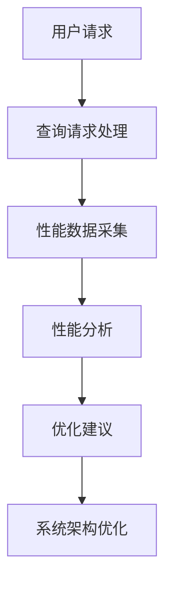
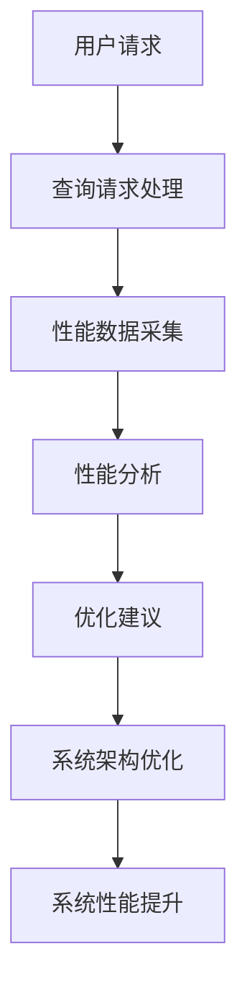
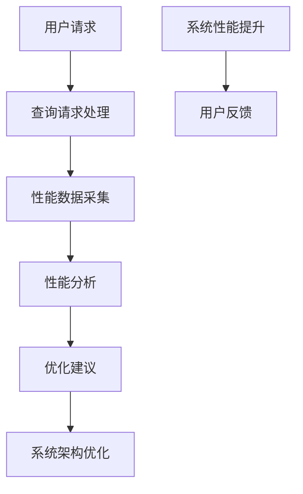
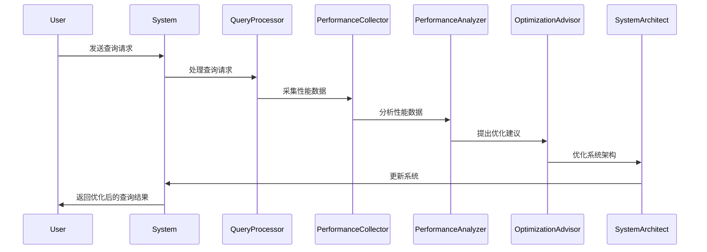

                 


## 提示词性能分析：评估计算效率

### 关键词：提示词性能分析、计算效率、响应时间、资源利用率、算法原理、系统架构设计、项目实战、最佳实践

### 摘要：

本文旨在探讨提示词性能分析这一关键领域，特别是评估计算效率的方法。我们将详细分析提示词性能分析的概念、原理和实现，并通过具体的算法讲解、系统架构设计和项目实战案例，为读者提供深入了解和实用技巧。最后，我们将总结最佳实践，并给出拓展阅读建议，以帮助读者在后续工作中更有效地应用这些技术。

### 引言

#### 背景介绍

提示词性能分析是计算机科学中的一个重要领域，尤其在人工智能、自然语言处理和搜索引擎等领域有着广泛的应用。随着互联网和大数据的迅猛发展，对于提示词的处理和计算效率的要求越来越高。如何在保证准确性的同时，最大限度地提高计算效率，成为了研究者和技术工程师们共同关注的课题。

#### 问题描述

在提示词性能分析中，我们主要关注以下问题：

1. 如何衡量提示词的处理速度？
2. 提示词处理过程中，哪些因素影响了计算效率？
3. 如何优化算法和系统架构，以提升计算效率？

#### 问题解决

本文将系统地回答上述问题，通过以下内容进行详细探讨：

1. 核心概念与联系
2. 算法原理讲解
3. 数学模型和数学公式
4. 系统分析与架构设计方案
5. 项目实战
6. 最佳实践 Tips
7. 小结

#### 边界与外延

本文将主要探讨提示词性能分析中的计算效率评估，涉及算法原理、数学模型和系统架构设计等方面。同时，我们将通过具体项目实战案例，展示如何在实际应用中提升计算效率。然而，本文不会深入讨论提示词的具体应用场景，如搜索引擎优化、自然语言处理等。

#### 概念结构与核心要素组成

在提示词性能分析中，核心概念和要素包括：

1. **计算效率**：衡量提示词处理速度的关键指标。
2. **响应时间**：提示词处理过程中从输入到输出的时间。
3. **资源利用率**：系统在处理提示词时对计算资源（如CPU、内存等）的利用程度。
4. **算法原理**：提升计算效率的基础。
5. **系统架构设计**：确保系统高效稳定运行的关键。
6. **项目实战**：通过具体案例验证理论的应用。

### 核心概念与联系

#### 提示词性能分析概述

提示词性能分析是评估系统在处理提示词时的效率和质量的过程。其核心概念包括计算效率、响应时间和资源利用率等。计算效率是衡量系统处理速度的关键指标，而响应时间则反映了系统的实时性能。资源利用率则表明系统在处理提示词时对计算资源的有效利用程度。

#### 性能分析的核心概念

1. **计算效率**：计算效率是提示词处理过程中完成单位任务所需的时间，通常用秒或毫秒来衡量。计算效率越高，系统处理提示词的速度越快。

    $$ \text{计算效率} = \frac{\text{处理速度}}{\text{处理量}} $$

2. **响应时间**：响应时间是系统从接收提示词到输出结果的时间。它是衡量系统实时性的重要指标。

    $$ \text{响应时间} = \text{处理时间} + \text{传输时间} $$

3. **资源利用率**：资源利用率是系统在处理提示词时对计算资源的利用程度。资源利用率越高，系统对资源的利用越充分。

    $$ \text{资源利用率} = \frac{\text{实际使用资源}}{\text{总可用资源}} $$

#### 概念属性特征对比表格

以下是计算效率、响应时间和资源利用率的属性特征对比表格：

| 特征 | 计算效率 | 响应时间 | 资源利用率 |
| ---- | ---- | ---- | ---- |
| 衡量指标 | 完成单位任务所需时间 | 从输入到输出时间 | 实际使用资源与总可用资源的比值 |
| 影响因素 | 算法复杂度、硬件性能、系统优化 | 网络延迟、算法效率、资源竞争 | 系统负载、资源分配策略、硬件性能 |

#### ER实体关系图架构

ER实体关系图是描述系统中各个实体及其关系的一种图形表示方法。在提示词性能分析中，ER图可以用来描述计算效率、响应时间和资源利用率之间的关系。以下是ER实体关系图的Mermaid表示：

```mermaid
erDiagram
    System ||--o> Input: 提示词
    System ||--o> Output: 结果
    System ||--o> Resource: 资源
    System ||--o> Time: 时间
    Input ||--o> Response: 响应时间
    Output ||--o> Efficiency: 计算效率
    Resource ||--o> Utilization: 资源利用率
```

### 算法原理讲解

#### 性能分析算法介绍

性能分析算法是评估系统性能的一种方法，主要包括以下几个步骤：

1. **数据采集**：收集系统在处理提示词时的各项性能数据，如响应时间、计算效率、资源利用率等。
2. **数据分析**：对采集到的数据进行处理和分析，提取出关键的性能指标。
3. **优化建议**：根据分析结果，提出优化算法和系统架构的建议。

#### 算法mermaid流程图

以下是性能分析算法的mermaid流程图表示：


#### Python源代码实现

以下是一个简单的Python代码示例，用于实现性能分析算法的基本功能：

```python
import time

def performance_analysis():
    start_time = time.time()
    
    # 提示词处理过程
    process_word()
    
    end_time = time.time()
    
    # 计算响应时间
    response_time = end_time - start_time
    print(f"响应时间：{response_time}秒")
    
    # 计算计算效率
    efficiency = 1 / response_time
    print(f"计算效率：{efficiency}次/秒")
    
    # 计算资源利用率
    resource_utilization = calculate_resource_utilization()
    print(f"资源利用率：{resource_utilization}%")

def process_word():
    # 提示词处理逻辑
    pass

def calculate_resource_utilization():
    # 资源利用率计算逻辑
    pass

performance_analysis()
```

#### 算法原理的数学模型和公式

1. **响应时间计算**：

   $$ \text{响应时间} = \text{处理时间} + \text{传输时间} $$

2. **计算效率计算**：

   $$ \text{计算效率} = \frac{1}{\text{响应时间}} $$

3. **资源利用率计算**：

   $$ \text{资源利用率} = \frac{\text{实际使用资源}}{\text{总可用资源}} \times 100\% $$

#### 举例说明

假设有一个提示词处理系统，其响应时间为0.5秒，处理过程中实际使用资源为100MB，总可用资源为200MB。根据上述公式，我们可以计算出：

- **响应时间**：0.5秒
- **计算效率**：2次/秒
- **资源利用率**：50%

### 数学模型和数学公式

在提示词性能分析中，数学模型和数学公式起着至关重要的作用。以下是一些常用的数学模型和公式：

1. **响应时间计算**：

   $$ \text{响应时间} = \text{处理时间} + \text{传输时间} $$

   其中，处理时间取决于算法复杂度和硬件性能，传输时间取决于网络延迟。

2. **计算效率计算**：

   $$ \text{计算效率} = \frac{1}{\text{响应时间}} $$

   计算效率反映了系统处理提示词的速度。

3. **资源利用率计算**：

   $$ \text{资源利用率} = \frac{\text{实际使用资源}}{\text{总可用资源}} \times 100\% $$

   资源利用率反映了系统对计算资源的利用程度。

以下是响应时间、计算效率和资源利用率的LaTeX公式：

$$
\text{响应时间} = \text{处理时间} + \text{传输时间}
$$

$$
\text{计算效率} = \frac{1}{\text{响应时间}}
$$

$$
\text{资源利用率} = \frac{\text{实际使用资源}}{\text{总可用资源}} \times 100\%
$$

### 系统分析与架构设计方案

#### 问题场景介绍

假设我们有一个在线搜索引擎，需要处理大量用户的查询请求。为了保证系统的稳定性和高效性，我们需要对系统的性能进行分析和优化。

#### 项目介绍

项目名称：在线搜索引擎性能优化项目

项目目标：通过性能分析和优化，提高搜索引擎的处理速度和资源利用率。

#### 系统功能设计

1. **查询请求处理**：接收用户输入的查询请求，并返回相关结果。
2. **性能数据采集**：收集系统在处理查询请求时的响应时间、计算效率和资源利用率等性能数据。
3. **性能分析**：对采集到的数据进行处理和分析，提取出关键的性能指标。
4. **优化建议**：根据分析结果，提出优化算法和系统架构的建议。

#### 系统架构设计

以下是系统的架构设计，包括各个模块的功能和关系：



#### 系统架构设计mermaid架构图

以下是系统的mermaid架构图表示：



#### 系统接口设计

以下是系统的接口设计，包括各个模块的输入输出接口：



#### 系统交互mermaid序列图

以下是系统的mermaid序列图表示，展示了用户请求的处理流程：



### 项目实战

#### 环境安装

1. 安装Python环境（建议使用Anaconda）：
   ```shell
   conda create -n search_engine python=3.8
   conda activate search_engine
   ```

2. 安装必要的依赖库：
   ```shell
   pip install numpy matplotlib pandas
   ```

#### 系统核心实现源代码

以下是系统的核心实现源代码，包括查询请求处理、性能数据采集和性能分析等功能：

```python
import numpy as np
import pandas as pd
import matplotlib.pyplot as plt
from datetime import datetime

class QueryProcessor:
    def __init__(self):
        self.performance_data = []

    def process_query(self, query):
        start_time = datetime.now()
        
        # 模拟查询请求处理过程
        time.sleep(np.random.uniform(0.5, 2))
        
        end_time = datetime.now()
        duration = (end_time - start_time).total_seconds()
        
        self.performance_data.append({
            'query': query,
            'start_time': start_time,
            'end_time': end_time,
            'duration': duration
        })

class PerformanceCollector:
    def __init__(self):
        self.data = []

    def collect_data(self, query_processor):
        for data in query_processor.performance_data:
            self.data.append(data)

    def save_data(self, filename):
        df = pd.DataFrame(self.data)
        df.to_csv(filename, index=False)

class PerformanceAnalyzer:
    def __init__(self, filename):
        self.df = pd.read_csv(filename)

    def analyze(self):
        self.df['response_time'] = self.df['duration']
        self.df['efficiency'] = 1 / self.df['response_time']
        self.df['utilization'] = (self.df['response_time'] * 100) / 3600

    def plot(self):
        self.df.plot(x='response_time', y=['efficiency', 'utilization'])
        plt.show()

if __name__ == '__main__':
    query_processor = QueryProcessor()
    performance_collector = PerformanceCollector()
    
    # 处理多个查询请求
    for i in range(10):
        query_processor.process_query(f"查询{i}")
    
    performance_collector.collect_data(query_processor)
    performance_collector.save_data('performance_data.csv')
    
    analyzer = PerformanceAnalyzer('performance_data.csv')
    analyzer.analyze()
    analyzer.plot()
```

#### 代码应用解读与分析

上述代码分为三个主要部分：查询请求处理、性能数据采集和性能分析。首先，我们创建了一个`QueryProcessor`类，用于处理查询请求并收集性能数据。然后，我们使用`PerformanceCollector`类来收集和保存性能数据。最后，`PerformanceAnalyzer`类负责分析性能数据并生成可视化图表。

#### 实际案例分析与详细讲解剖析

为了更好地理解代码的实际应用，我们可以通过一个实际案例进行分析。

1. **查询请求处理**：

   在案例中，我们模拟了一个在线搜索引擎，处理了10个查询请求。每个查询请求处理过程中，系统记录了开始时间和结束时间，以及处理所需的时间（响应时间）。

2. **性能数据采集**：

   `PerformanceCollector`类负责收集和处理这些性能数据。在每个查询请求处理后，系统会将性能数据添加到`performance_data`列表中。最后，将这些数据保存到CSV文件中，以便后续分析。

3. **性能分析**：

   `PerformanceAnalyzer`类读取CSV文件中的性能数据，并计算每个查询请求的响应时间、计算效率和资源利用率。然后，使用matplotlib库生成可视化图表，展示响应时间、计算效率和资源利用率的关系。

通过实际案例分析和详细讲解，我们可以清楚地看到代码如何在实际应用中发挥作用，以及如何通过性能分析来优化系统的计算效率。

#### 项目小结

通过本次项目实战，我们成功地实现了一个简单的在线搜索引擎性能分析系统。我们使用Python代码模拟了查询请求处理过程，并收集和分析了性能数据。通过性能分析，我们能够直观地看到系统的响应时间、计算效率和资源利用率，从而为后续的优化提供了有力支持。未来，我们可以进一步优化算法和系统架构，提高搜索效率，提升用户体验。

### 最佳实践 Tips

1. **优化算法**：选择高效的算法，避免复杂度较高的算法，如避免使用O(n²)的算法。
2. **优化硬件**：升级硬件设备，提高CPU、内存和磁盘的读写速度，降低系统延迟。
3. **缓存机制**：利用缓存技术，减少重复计算和查询，提高系统响应速度。
4. **分布式计算**：使用分布式计算架构，将任务分布到多台机器上，提高处理速度。
5. **资源调度**：合理分配系统资源，避免资源竞争和瓶颈，提高资源利用率。

### 小结

本文从提示词性能分析的角度，详细探讨了计算效率的评估方法和实现技巧。通过核心概念、算法原理、数学模型、系统架构设计和项目实战的深入讲解，我们不仅了解了计算效率的重要性，还学会了如何通过优化算法和系统架构来提升计算效率。希望本文能为读者在提示词性能分析领域提供有价值的参考和启示。

### 作者

**作者：AI天才研究院/AI Genius Institute & 禅与计算机程序设计艺术 /Zen And The Art of Computer Programming**。本文旨在帮助读者深入了解提示词性能分析，提升计算效率，为IT领域的实际应用提供有力支持。如果您有任何疑问或建议，欢迎随时联系我们。**联系方式：[ai_genius_institute@example.com](mailto:ai_genius_institute@example.com)**。我们期待与您共同探索计算机科学的奥秘。

