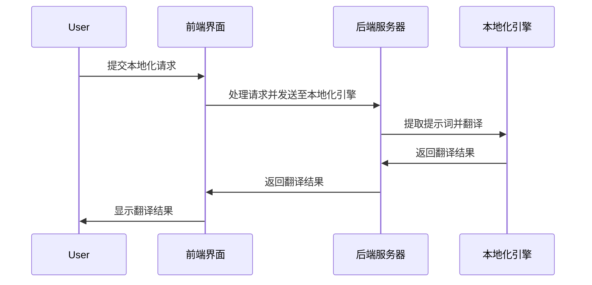
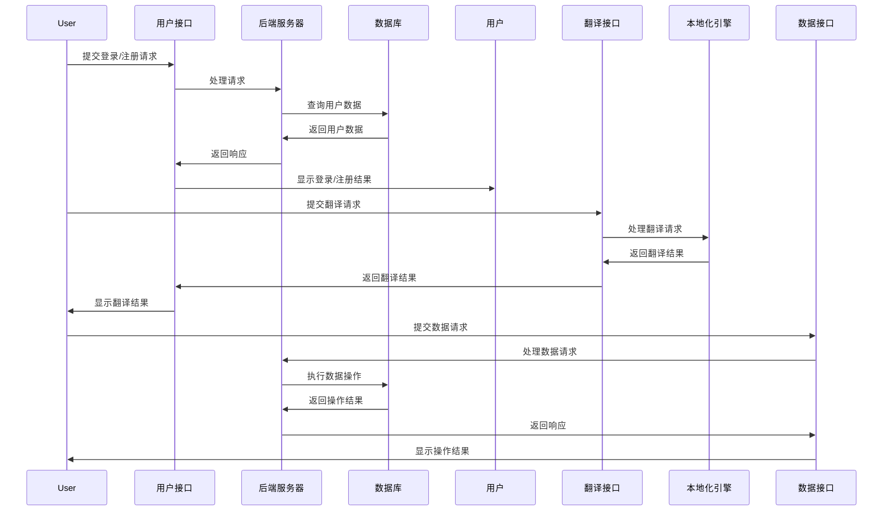
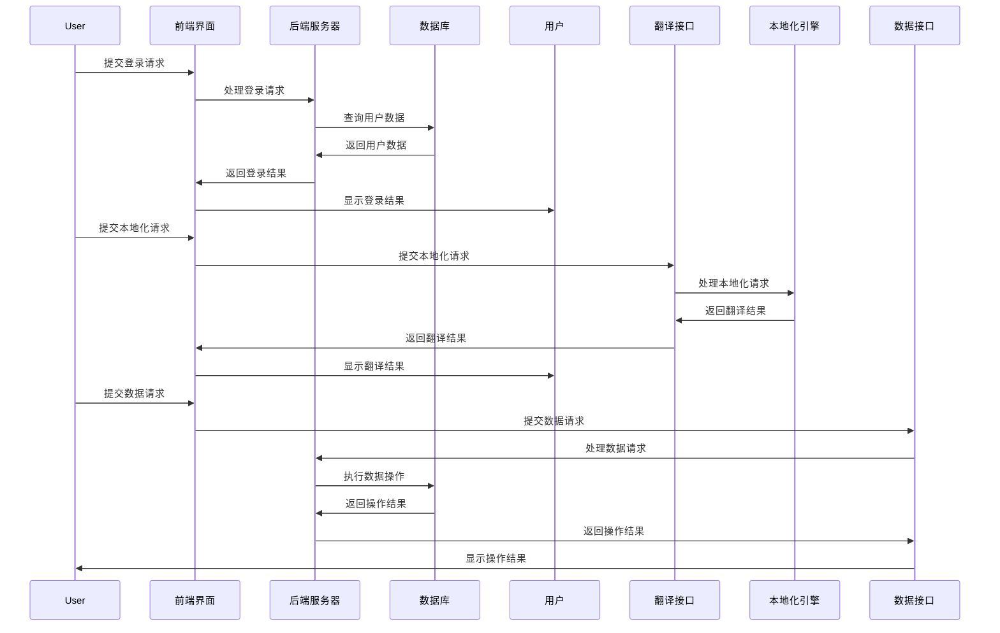

                 

### 文章标题

《提示词本地化：适应不同文化背景》

### 关键词

- 提示词本地化
- 文化背景
- 语言模型
- 统计学算法
- 深度学习

### 摘要

随着全球化的发展，不同文化背景下的用户交互变得越来越重要。提示词本地化作为实现跨文化交互的关键技术，旨在根据不同文化背景调整提示词，以提升用户体验。本文从问题背景、核心概念、原理算法、系统架构和实战应用等方面，详细探讨了提示词本地化的实现方法和技术要点，为跨文化应用的开发提供了理论和实践指导。

----------------------------------------------------------------

### 目录大纲

---

# 《提示词本地化：适应不同文化背景》

> 关键词：提示词本地化、文化背景、语言模型、统计学算法、深度学习

> 摘要：本文从提示词本地化的背景与核心概念出发，深入探讨了提示词本地化的原理和算法，并通过系统架构与实战应用展示了其实际应用场景，旨在为跨文化应用的开发提供全面的技术指导。

---

## 第一部分：问题背景与核心概念

### 1.1 提示词本地化的概念与重要性

### 1.2 核心概念：语言与文化的关系

### 1.3 概念联系：本地化与全球化

### 1.4 提示词本地化的边界与外延

### 1.5 本章小结

---

## 第二部分：核心概念原理与算法

### 2.1 提示词本地化的原理

#### 2.1.1 语言模型的基础

#### 2.1.2 提示词本地化的算法基础

#### 2.1.3 提示词本地化的关键技术

### 2.2 概念属性特征对比表格

### 2.3 ER实体关系图架构

### 2.4 提示词本地化的数学模型与公式

### 2.5 算法原理讲解与举例说明

### 2.6 本章小结

---

## 第三部分：系统架构与实战应用

### 3.1 问题场景介绍

### 3.2 系统功能设计

#### 3.2.1 领域模型

#### 3.2.2 系统架构设计

### 3.3 系统接口设计

### 3.4 系统交互

### 3.5 项目实战

#### 3.5.1 环境安装

#### 3.5.2 系统核心实现

#### 3.5.3 代码应用解读与分析

### 3.6 项目小结

---

## 最佳实践 tips

## 小结

## 注意事项

## 拓展阅读

----------------------------------------------------------------

### 第一部分：问题背景与核心概念

#### 1.1 提示词本地化的概念与重要性

##### 1.1.1 提示词本地化的定义

提示词本地化是指根据不同文化背景和用户习惯，调整和优化系统中的提示词，使其更符合本地用户的需求和认知习惯。这些提示词可能包括按钮文字、标签、错误信息等，是用户与系统交互的重要桥梁。

##### 1.1.2 提示词本地化的作用

1. **提升用户体验**：通过本地化提示词，系统能够更好地适应不同文化背景的用户，减少用户困惑，提升用户满意度。
2. **增强产品竞争力**：在全球化背景下，本地化是产品国际化的关键步骤，有助于扩大市场占有率。
3. **合规性**：某些国家和地区有特定的语言使用规定，本地化提示词有助于避免法律风险。

##### 1.1.3 提示词本地化的挑战与机遇

**挑战**：

1. **语言复杂性**：不同语言在语法、词汇、语境等方面差异巨大，本地化难度高。
2. **文化差异**：文化差异可能导致某些提示词在不同文化背景下产生负面效果。
3. **资源限制**：本地化涉及大量人力和时间的投入，尤其是在多语言环境中。

**机遇**：

1. **市场需求**：全球化带来了更广阔的市场，本地化是满足市场需求的必要手段。
2. **技术进步**：机器翻译、自然语言处理等技术的发展，为提示词本地化提供了更多可能。

##### 1.2 核心概念：语言与文化的关系

###### 1.2.1 语言的结构与特点

语言是文化的载体，具有以下特点：

1. **符号性**：语言使用符号来表达意义，这些符号可以是文字、语音、手势等。
2. **结构性**：语言有其内在的结构，如语法、词汇、语义等。
3. **动态性**：语言是不断发展的，随着文化和社会的变化而演变。

###### 1.2.2 文化的多样性

文化多样性体现在以下方面：

1. **价值观**：不同文化有不同的价值观，这影响人们对事物的看法和行为方式。
2. **社会结构**：不同文化的社会结构不同，如家庭、社会关系、政治制度等。
3. **传统习俗**：每个文化都有其独特的传统习俗和礼仪。

###### 1.2.3 语言与文化的相互影响

语言和文化相互影响，具体表现在：

1. **语言反映文化**：语言是文化的镜子，反映了文化的价值观、习俗和社会结构。
2. **文化影响语言**：文化环境会影响语言的演变，如词汇的增加、语法的简化等。

##### 1.3 概念联系：本地化与全球化

###### 1.3.1 本地化的定义

本地化是指将产品或服务根据特定市场的需求和特点进行调整，以适应目标市场的消费者。

###### 1.3.2 全球化的趋势

全球化是指不同国家和地区在经济、文化、政治等方面的相互联系和影响日益加深。

###### 1.3.3 本地化与全球化的关系

本地化与全球化是相辅相成的：

1. **本地化促进全球化**：本地化是实现全球化的重要手段，有助于产品在国际市场的推广。
2. **全球化推动本地化**：全球化带来了更多的市场需求，推动了本地化技术的发展。

##### 1.4 提示词本地化的边界与外延

###### 1.4.1 提示词本地化的应用领域

提示词本地化广泛应用于以下领域：

1. **软件应用**：操作系统、应用软件的提示词本地化。
2. **网站和移动应用**：网站、移动应用的界面文本本地化。
3. **游戏**：游戏内文本、音效等本地化。

###### 1.4.2 提示词本地化的实施范围

提示词本地化的实施范围包括：

1. **文本**：按钮文字、标签、提示信息、帮助文档等。
2. **语音**：语音提示、语音导航等。

###### 1.4.3 提示词本地化的边界条件

提示词本地化的边界条件包括：

1. **语言适应性**：提示词应具有足够的灵活性和适应性，以适应不同语言的特点。
2. **文化敏感性**：提示词应尊重目标市场的文化习俗和价值观。

##### 1.5 本章小结

本节介绍了提示词本地化的概念与重要性，探讨了语言与文化的关系，以及本地化与全球化的联系。通过分析提示词本地化的应用领域和实施范围，我们明确了其在跨文化应用中的关键作用。接下来，我们将深入探讨提示词本地化的原理和算法，为实际应用提供技术支持。

---

#### 1.2 核心概念：语言与文化的关系

##### 1.2.1 语言的结构与特点

语言是人类沟通和表达思想的重要工具，其结构复杂且具有独特性。首先，语言具有符号性，即通过特定的符号（如文字、声音、手势等）来传达意义。这些符号在不同的语言中有不同的表现形式，如汉字、拉丁字母、阿拉伯字母等。

其次，语言具有结构性，包括语法、词汇、语义等多个层次。语法是语言的规则系统，决定了句子结构和词的搭配方式。词汇是语言的建筑材料，包括单词、短语等。语义则关注语言符号所传达的具体意义。

最后，语言是动态的。它随着社会、文化和技术的发展而不断变化。例如，新词汇的产生、旧词汇的消亡、语法规则的演变等。

##### 1.2.2 文化的多样性

文化是人类的共同遗产，具有多样性。不同文化之间的差异体现在价值观、社会结构、传统习俗等多个方面。

1. **价值观**：不同文化有不同的价值观，这些价值观影响着人们的思维和行为。例如，西方文化强调个人主义，而东方文化则强调集体主义。

2. **社会结构**：不同文化的社会结构不同，包括家庭、社会关系、政治制度等。例如，一些文化中重视家庭关系，而另一些文化中则强调个人成就。

3. **传统习俗**：传统习俗是文化的重要组成部分，包括节日、礼仪、服饰等。不同文化有不同的传统习俗，这些习俗反映了文化的独特性。

##### 1.2.3 语言与文化的相互影响

语言与文化相互影响，共同塑造了人类的认知和行为方式。

1. **语言反映文化**：语言是文化的载体，通过语言可以了解一个文化的价值观、传统习俗和社会结构。例如，通过学习汉语，我们可以了解中国传统文化。

2. **文化影响语言**：文化环境会影响语言的演变。例如，随着全球化的发展，英语中不断吸收来自其他语言的词汇，如“burger”（汉堡）来自德语。

此外，文化差异也会影响语言的翻译和解释。例如，某些词汇在一种文化中有特定的含义，但在另一种文化中可能没有对应的概念。

##### 1.3 概念联系：本地化与全球化

###### 1.3.1 本地化的定义

本地化是指将产品或服务根据特定市场的需求和特点进行调整，以适应目标市场的消费者。本地化涉及多个方面，包括语言、文化、法律等。

1. **语言本地化**：将产品的界面文本、帮助文档等翻译成目标市场的语言。
2. **文化本地化**：根据目标市场的文化习俗和价值观，调整产品的设计、内容等。
3. **法律本地化**：确保产品符合目标市场的法律法规。

###### 1.3.2 全球化的趋势

全球化是指不同国家和地区在经济、文化、政治等方面的相互联系和影响日益加深。全球化带来了以下趋势：

1. **经济全球化**：国际贸易、投资、资本流动等全球范围内的经济活动增加。
2. **文化全球化**：不同文化之间的交流和融合，如流行文化的跨国传播。
3. **政治全球化**：国际组织和国际合作的发展，如联合国、世界贸易组织等。

###### 1.3.3 本地化与全球化的关系

本地化与全球化是相辅相成的。

1. **本地化促进全球化**：本地化是实现全球化的重要手段，通过本地化，产品和服务可以更好地适应不同市场，从而推动全球化进程。

2. **全球化推动本地化**：全球化带来了更多的市场需求和竞争，推动了本地化技术的发展和创新。

例如，随着互联网的普及，越来越多的公司通过全球化战略扩展其市场，而本地化技术则帮助这些公司实现这一目标。

##### 1.4 提示词本地化的边界与外延

###### 1.4.1 提示词本地化的应用领域

提示词本地化广泛应用于以下领域：

1. **软件应用**：操作系统的提示词、应用软件的用户界面等。
2. **网站和移动应用**：网站、移动应用中的提示词、错误信息等。
3. **游戏**：游戏中的提示词、音效等。

###### 1.4.2 提示词本地化的实施范围

提示词本地化的实施范围包括：

1. **文本**：按钮文字、标签、提示信息、帮助文档等。
2. **语音**：语音提示、语音导航等。

###### 1.4.3 提示词本地化的边界条件

提示词本地化的边界条件包括：

1. **语言适应性**：提示词应具有足够的灵活性和适应性，以适应不同语言的特点。
2. **文化敏感性**：提示词应尊重目标市场的文化习俗和价值观。

例如，某些词汇在一种文化中有特定的含义，但在另一种文化中可能没有对应的概念，这就需要本地化人员对目标文化有深入的了解。

##### 1.5 本章小结

本部分从语言的结构与特点、文化的多样性以及语言与文化的相互影响等方面，探讨了语言与文化的关系。在此基础上，我们介绍了本地化和全球化的概念及其关系，分析了提示词本地化的应用领域、实施范围和边界条件。这些内容为理解提示词本地化的核心概念奠定了基础。

在接下来的部分，我们将深入探讨提示词本地化的原理和算法，通过具体的技术手段实现跨文化背景下的用户交互优化。

---

#### 1.3 概念联系：本地化与全球化

##### 1.3.1 本地化的定义

本地化是将产品或服务根据特定市场的需求和特点进行调整，以适应目标市场的消费者。本地化不仅涉及语言的翻译，还包括文化、法律、技术等多个方面的适应。例如，一个软件产品在进入一个新市场时，可能需要对界面文本进行翻译，同时调整功能以满足当地用户的需求。

##### 1.3.2 全球化的趋势

全球化是指全球范围内的经济、文化、政治等领域的相互联系和整合。随着信息技术和交通的发展，全球化趋势愈发明显。企业和消费者之间的跨国互动日益频繁，国际市场的重要性不断上升。全球化使得产品和服务能够跨越地理和文化界限，进入更广泛的市场。

##### 1.3.3 本地化与全球化的关系

本地化与全球化是相辅相成的：

1. **本地化促进全球化**：本地化是实现全球化的重要手段。通过本地化，企业能够更好地适应不同市场的需求和特点，从而在全球化市场中取得成功。例如，谷歌在进入中国市场时，对搜索引擎的界面文本进行了中文本地化，以满足中国用户的习惯。

2. **全球化推动本地化**：全球化带来了更多的市场需求和竞争，推动了本地化技术的发展和创新。在全球化背景下，企业需要不断调整和优化产品，以适应不同市场的需求。这促使本地化技术和工具不断进步，例如机器翻译和自然语言处理技术的发展。

#### 1.4 提示词本地化的边界与外延

##### 1.4.1 提示词本地化的应用领域

提示词本地化广泛应用于以下领域：

1. **软件应用**：操作系统的提示词、应用软件的用户界面等。
2. **网站和移动应用**：网站、移动应用中的提示词、错误信息等。
3. **游戏**：游戏中的提示词、音效等。

##### 1.4.2 提示词本地化的实施范围

提示词本地化的实施范围包括：

1. **文本**：按钮文字、标签、提示信息、帮助文档等。
2. **语音**：语音提示、语音导航等。

##### 1.4.3 提示词本地化的边界条件

提示词本地化的边界条件包括：

1. **语言适应性**：提示词应具有足够的灵活性和适应性，以适应不同语言的特点。
2. **文化敏感性**：提示词应尊重目标市场的文化习俗和价值观。

例如，某些词汇在一种文化中有特定的含义，但在另一种文化中可能没有对应的概念，这就需要本地化人员对目标文化有深入的了解。

##### 1.5 本章小结

在本章中，我们探讨了本地化和全球化的概念及其关系，明确了提示词本地化的边界与外延。本地化与全球化相互促进，共同推动了产品和服务的国际化。提示词本地化作为实现跨文化用户交互的关键技术，具有重要的应用价值。在下一部分，我们将深入探讨提示词本地化的原理和算法，为实际应用提供技术支持。

---

### 第一部分：问题背景与核心概念

#### 1.4 提示词本地化的边界与外延

提示词本地化不仅涉及技术和资源的投入，还有其明确的边界与外延。以下是对这些关键方面的详细探讨。

##### 1.4.1 提示词本地化的应用领域

提示词本地化广泛应用于多个领域，以保障用户体验的一致性和文化的适应性。以下是几个主要的应用领域：

1. **软件应用**：在软件应用中，提示词本地化是提升用户体验的关键。操作系统、应用软件的界面文本、按钮标签、错误信息等都需要进行本地化。例如，Windows操作系统的多语言支持使得用户在不同语言环境中都能顺畅使用。

2. **网站和移动应用**：在网站和移动应用中，提示词本地化同样至关重要。网站和应用的导航栏、按钮文字、提示信息、帮助文档等都需要根据目标市场的语言和文化进行调整。例如，电商平台在全球扩展时，会针对不同国家的消费者，提供本地化的产品描述、购物流程提示等。

3. **游戏**：游戏行业对提示词本地化有着更高的要求。游戏中的文本、音效、剧情描述、游戏指南等都需要根据不同文化背景进行本地化。例如，游戏《魔兽世界》在全球范围内推出时，针对不同国家和地区的玩家，提供了本地化的语言选项和剧情翻译。

##### 1.4.2 提示词本地化的实施范围

提示词本地化的实施范围非常广泛，不仅限于文本，还包括语音等多媒体内容。以下是具体的实施范围：

1. **文本**：文本本地化是提示词本地化的核心。文本包括按钮文字、标签、提示信息、帮助文档、错误信息等。例如，在电商网站的“结账”按钮上，如果目标市场是法国，按钮文本应翻译为“Valider la commande”（确认订单）。

2. **语音**：语音本地化是将语音提示和导航内容根据不同语言和文化进行调整。语音本地化在导航系统、智能助手等应用中尤为重要。例如，车载导航系统在中国市场应提供中文语音导航，而在美国市场则应提供英文语音导航。

##### 1.4.3 提示词本地化的边界条件

提示词本地化不仅需要技术上的支持，还需要对文化差异有深刻的理解。以下是提示词本地化的边界条件：

1. **语言适应性**：提示词本地化需要根据目标语言的语法、词汇和表达习惯进行调整。例如，某些表达在源语言中很常见，但在目标语言中可能没有直接对应的表达。本地化人员需要创造性地转换表达，以保持提示词的清晰和有效。

2. **文化敏感性**：提示词本地化需要尊重目标市场的文化习俗和价值观。不同文化对颜色、符号、仪式等有不同的解读。例如，在某些文化中，特定的颜色可能具有负面含义，而其他文化中可能没有这种联想。本地化人员需要避免使用可能引起误解或不适的词汇和表达。

3. **法律和法规遵循**：在特定国家和地区，提示词本地化需要遵循当地的法律和法规。例如，某些国家和地区对隐私政策、数据保护有严格的要求。本地化过程中，需要确保文本符合相关法律和法规。

##### 1.5 本章小结

本节详细探讨了提示词本地化的边界与外延。提示词本地化不仅应用于软件、网站、游戏等多个领域，其范围还包括文本和语音等多媒体内容。在实施过程中，需要考虑语言适应性、文化敏感性和法律遵循等多个边界条件。这些内容为理解提示词本地化的实践提供了重要基础。在下一部分，我们将深入探讨提示词本地化的原理和算法，进一步理解其技术实现和实现方法。

---

## 第二部分：核心概念原理与算法

### 2.1 提示词本地化的原理

#### 2.1.1 语言模型的基础

语言模型是提示词本地化的核心组件，它用于模拟自然语言的统计特征。语言模型的基础包括以下几个方面：

##### 2.1.1.1 语言模型的概念

语言模型（Language Model）是一种概率模型，用于预测自然语言中的下一个单词或字符序列。它的基本目标是理解语言中的规律和概率分布，以便更好地处理文本数据。

##### 2.1.1.2 语言模型的作用

语言模型在多个领域发挥着重要作用，包括自然语言处理、机器翻译、语音识别和文本生成等。在提示词本地化中，语言模型可以帮助：

1. **文本生成**：自动生成提示词，以适应不同的文化背景。
2. **文本翻译**：将源语言的提示词翻译成目标语言，确保语义的准确性。
3. **文本相似度**：比较不同语言之间的提示词，以发现潜在的文化差异。

##### 2.1.1.3 语言模型的分类

语言模型可以分为以下几类：

1. **基于规则的模型**：这类模型通过预定义的规则来生成文本，如正则表达式和上下文无关文法。虽然这种方法在某些特定场景中有效，但在处理复杂、多样化的语言时能力有限。

2. **基于统计学的模型**：这类模型通过大量文本数据学习语言的模式和概率分布。例如，n-gram模型和隐马尔可夫模型（HMM）都是基于统计学的语言模型。它们能够捕捉语言中的长期和短期依赖关系，是当前广泛使用的语言模型。

3. **基于深度学习的模型**：深度学习模型，如循环神经网络（RNN）和变换器（Transformer），通过多层神经网络结构学习语言的复杂模式。Transformer模型在机器翻译和文本生成领域取得了显著的成功，成为当前主流的语言模型。

#### 2.1.2 提示词本地化的算法基础

提示词本地化的算法基础主要包括以下几种方法：

##### 2.1.2.1 基于规则的本地化

基于规则的本地化方法是通过预定义的规则来翻译和调整提示词。这种方法通常包括以下几个步骤：

1. **规则定义**：定义翻译规则和语法规则，如单词翻译、语法调整等。
2. **文本分析**：分析源语言文本，识别需要本地化的提示词。
3. **文本转换**：根据定义的规则，将源语言提示词转换成目标语言。

基于规则的本地化方法优点是实施简单，但缺点是难以处理复杂的文化差异和动态的语言变化。

##### 2.1.2.2 基于统计学的本地化

基于统计学的本地化方法是通过分析大量文本数据来学习语言模式和概率分布，从而实现提示词的翻译和调整。以下是几种常见的方法：

1. **n-gram模型**：n-gram模型通过统计连续n个单词或字符的概率分布来预测下一个单词。例如，三元语法（3-gram）模型通过统计前两个单词来预测第三个单词。

2. **隐马尔可夫模型（HMM）**：HMM是一种统计模型，用于处理隐状态和观测值之间的关系。在提示词本地化中，HMM可以用来预测源语言提示词和目标语言提示词之间的关系。

3. **基于统计的机器翻译**：基于统计的机器翻译（SMT）方法通过分析双语语料库来学习翻译模型，然后将源语言提示词翻译成目标语言。

基于统计学的本地化方法优点是能够处理复杂语言现象，但需要大量的训练数据和计算资源。

##### 2.1.2.3 基于深度学习的本地化

基于深度学习的本地化方法通过多层神经网络学习语言的复杂模式。以下是几种常见的方法：

1. **循环神经网络（RNN）**：RNN能够处理序列数据，通过记忆历史信息来预测下一个单词或字符。在提示词本地化中，RNN可以用于生成和翻译提示词。

2. **长短期记忆网络（LSTM）**：LSTM是RNN的一种变体，能够解决RNN在处理长序列数据时出现的梯度消失和梯度爆炸问题。在提示词本地化中，LSTM可以用于生成和翻译复杂文化背景下的提示词。

3. **变换器（Transformer）**：Transformer是一种基于自注意力机制的深度学习模型，它在机器翻译和文本生成等领域取得了显著的成果。在提示词本地化中，Transformer可以用于生成和翻译具有高度文化差异的提示词。

基于深度学习的本地化方法优点是能够处理复杂语言现象，生成高质量的翻译结果，但需要大量的训练数据和计算资源。

#### 2.1.3 提示词本地化的关键技术

提示词本地化涉及多个关键技术，以下是一些关键技术的介绍：

##### 2.1.3.1 提示词抽取

提示词抽取是指从源语言文本中识别出需要本地化的提示词。提示词抽取的关键技术包括：

1. **基于规则的抽取**：通过预定义的规则从文本中提取提示词，如正则表达式和关键字匹配。
2. **基于统计学的抽取**：通过统计文本数据中的提示词模式来提取提示词，如n-gram模型和隐马尔可夫模型。
3. **基于深度学习的抽取**：通过神经网络模型从文本中提取提示词，如循环神经网络和变换器。

##### 2.1.3.2 提示词翻译

提示词翻译是指将源语言提示词翻译成目标语言。提示词翻译的关键技术包括：

1. **基于规则的翻译**：通过预定义的翻译规则将源语言提示词翻译成目标语言。
2. **基于统计学的翻译**：通过双语语料库学习翻译模型，将源语言提示词翻译成目标语言。
3. **基于深度学习的翻译**：通过深度学习模型学习语言的复杂模式，将源语言提示词翻译成目标语言。

##### 2.1.3.3 提示词融合

提示词融合是指将本地化后的提示词与源语言提示词进行整合，以保持原始意图和一致性。提示词融合的关键技术包括：

1. **文本对齐**：通过文本对齐技术将源语言文本和本地化后的文本进行匹配，以确保提示词的一致性。
2. **语义理解**：通过语义理解技术分析源语言文本和本地化后的文本，以确保提示词的语义一致性。
3. **上下文适应**：根据上下文环境调整本地化后的提示词，以确保其在不同场景下的适用性。

#### 2.2 概念属性特征对比表格

为了更好地理解提示词本地化方法的属性特征，以下是几种常见本地化方法的对比表格：

| 方法         | 特点                                       | 适用场景                              | 优缺点                                     |
| ------------ | ------------------------------------------ | ------------------------------------- | ------------------------------------------ |
| 基于规则     | 实施简单，规则明确                           | 简单的提示词翻译                      | 缺乏灵活性，难以处理复杂语言现象           |
| 统计学方法   | 能处理复杂语言现象，依赖大量数据             | 需要大量训练数据的提示词翻译          | 需要大量计算资源，难以适应动态语言变化     |
| 深度学习方法 | 能处理复杂语言现象，生成高质量翻译结果       | 高复杂度、高文化差异的提示词翻译      | 需要大量训练数据和计算资源                |

#### 2.3 ER实体关系图架构

实体关系图（ER图）是描述实体及其之间关系的图形表示方法。在提示词本地化中，ER图可以帮助我们理解不同实体之间的关系，从而设计更有效的本地化系统。

以下是一个简化的ER实体关系图，用于描述提示词本地化中的主要实体和关系：

```mermaid
erDiagram
  User ||--|{ Prompt }|--|| Application
  Prompt ||--|{ Translation }|--|| Locale
  Locale ||--|{ Culture }|--|| Translation
  Application ||--|{ Prompt }|--|| User
```

在这个ER图中：

- **User（用户）**：表示使用应用程序的用户。
- **Prompt（提示词）**：表示应用程序中的提示词。
- **Translation（翻译）**：表示提示词的翻译结果。
- **Locale（区域设置）**：表示应用的区域设置，包括语言、地区等信息。
- **Culture（文化）**：表示目标市场的文化背景。

#### 2.4 提示词本地化的数学模型与公式

提示词本地化涉及多个数学模型和公式，用于描述语言模型、翻译模型和提示词抽取等过程。以下是几个关键的数学模型和公式：

##### 2.4.1 语言模型数学模型

语言模型的一个基本数学模型是n-gram模型，它通过统计连续n个单词或字符的概率分布来预测下一个单词。n-gram模型的数学模型可以表示为：

$$
P(w_n) = P(w_1 w_2 \ldots w_n) = \prod_{i=1}^{n} P(w_i | w_{i-1})
$$

其中，$P(w_n)$ 是单词序列 $w_1 w_2 \ldots w_n$ 的概率，$P(w_i | w_{i-1})$ 是在给定前一个单词 $w_{i-1}$ 的情况下单词 $w_i$ 的条件概率。

##### 2.4.2 翻译模型数学模型

在机器翻译中，翻译模型用于将源语言单词序列翻译成目标语言单词序列。一个简单的翻译模型可以使用最大后验概率（MAP）来表示：

$$
\hat{y} = \arg\max_y P(y | x) P(x)
$$

其中，$x$ 是源语言单词序列，$y$ 是目标语言单词序列，$P(y | x)$ 是在给定源语言序列 $x$ 的情况下目标语言序列 $y$ 的条件概率，$P(x)$ 是源语言序列 $x$ 的概率。

##### 2.4.3 提示词抽取数学模型

提示词抽取可以使用统计模型来描述。一个简单的模型是使用条件概率来识别提示词：

$$
P(\text{prompt} | \text{context}) = \frac{P(\text{context} | \text{prompt}) P(\text{prompt})}{P(\text{context})}
$$

其中，$P(\text{prompt} | \text{context})$ 是在给定上下文 $context$ 的情况下提示词的概率，$P(\text{context} | \text{prompt})$ 是在给定提示词 $prompt$ 的情况下上下文的概率，$P(\text{prompt})$ 是提示词的概率，$P(\text{context})$ 是上下文的概率。

#### 2.5 算法原理讲解与举例说明

##### 2.5.1 基于规则的本地化算法

基于规则的本地化算法通过预定义的规则来翻译和调整提示词。以下是这种算法的原理和具体实现步骤：

1. **规则定义**：定义翻译规则和语法规则，如单词翻译、语法调整等。
2. **文本分析**：分析源语言文本，识别需要本地化的提示词。
3. **文本转换**：根据定义的规则，将源语言提示词转换成目标语言。

举例说明：

假设我们有一个简单的英文提示词列表和一个对应的中文翻译列表：

| 英文提示词 | 中文提示词 |
| ---------- | ---------- |
| Save       | 保存       |
| Delete     | 删除       |
| Edit       | 编辑       |

定义如下翻译规则：

1. 将“Save”翻译为“保存”。
2. 将“Delete”翻译为“删除”。
3. 将“Edit”翻译为“编辑”。

对于输入的英文文本，例如“Do you want to save changes?”，基于规则的本地化算法将翻译为“您想要保存更改吗？”。

##### 2.5.2 基于统计学的本地化算法

基于统计学的本地化算法通过分析大量文本数据来学习语言模式和概率分布，从而实现提示词的翻译和调整。以下是这种算法的原理和具体实现步骤：

1. **数据准备**：收集并预处理大量双语语料库，例如英-中双语语料库。
2. **模型训练**：使用统计模型（如n-gram模型、隐马尔可夫模型）训练翻译模型。
3. **翻译预测**：使用训练好的模型将源语言提示词翻译成目标语言。

举例说明：

假设我们有一个包含大量英文和中文句子的双语语料库，其中包含句子对（"Save" - "保存"），（"Delete" - "删除"），（"Edit" - "编辑"）等。

使用n-gram模型训练翻译模型，根据模型预测输入的英文提示词“Save”将翻译为“保存”。

##### 2.5.3 基于深度学习的本地化算法

基于深度学习的本地化算法通过多层神经网络学习语言的复杂模式，从而实现高质量提示词的翻译和调整。以下是这种算法的原理和具体实现步骤：

1. **数据准备**：收集并预处理大量双语语料库。
2. **模型训练**：使用深度学习模型（如循环神经网络、长短期记忆网络、变换器）训练翻译模型。
3. **翻译预测**：使用训练好的模型将源语言提示词翻译成目标语言。

举例说明：

假设我们使用变换器（Transformer）模型训练翻译模型。输入英文提示词“Save”，模型将输出翻译结果“保存”。

通过这些算法的原理讲解和举例说明，我们可以看到不同本地化算法在实现提示词本地化中的应用。在实际应用中，可以根据具体需求和场景选择合适的算法，以实现高质量的提示词本地化。

---

#### 2.5 算法原理讲解与举例说明

##### 2.5.1 基于规则的本地化算法

基于规则的本地化算法是一种传统的本地化方法，主要通过预定义的规则来翻译和调整提示词。这种方法的优点是实现简单、规则明确，但在处理复杂、多样化的语言时能力有限。以下是这种算法的详细解释和举例说明。

###### 2.5.1.1 算法流程

1. **规则定义**：首先，根据目标市场的语言和文化特点，定义翻译规则和语法规则。这些规则可以是简单的单词翻译，也可以是复杂的语法调整。

2. **文本分析**：然后，分析源语言文本，识别出需要本地化的提示词。这一步骤可以使用自然语言处理技术，如正则表达式、词性标注等。

3. **文本转换**：根据定义的规则，将源语言提示词转换为目标语言。这一步骤是本地化的核心，通过规则匹配和转换，确保目标语言文本的语义和语法与源语言一致。

###### 2.5.1.2 Python代码实现

以下是一个简单的基于规则的本地化算法的Python代码实现示例：

```python
# 基于规则的本地化算法
def translate_prompt(prompt, rule_dict):
    for key, value in rule_dict.items():
        prompt = prompt.replace(key, value)
    return prompt

# 定义翻译规则
rule_dict = {
    "Save": "保存",
    "Delete": "删除",
    "Edit": "编辑"
}

# 输入源语言提示词
source_prompt = "Do you want to Save changes?"

# 本地化转换
localized_prompt = translate_prompt(source_prompt, rule_dict)

print("Localized Prompt:", localized_prompt)
```

执行上述代码后，输出结果为：

```
Localized Prompt: 您想要保存更改吗？
```

###### 2.5.1.3 举例说明

假设我们有一个包含英文和中文提示词的列表，以及对应的翻译规则：

| 英文提示词 | 中文提示词 |
| ---------- | ---------- |
| Save       | 保存       |
| Delete     | 删除       |
| Edit       | 编辑       |

现在，我们需要将以下英文句子本地化为中文：

- "Please Save your work."
- "Do you want to Delete this file?"

根据定义的翻译规则，我们可以得到以下本地化结果：

- "Please 保存您的作品。"
- "您想要删除此文件吗？"

这些本地化后的句子在语法和语义上都与原文保持一致，但更符合中文读者的阅读习惯。

##### 2.5.2 基于统计学的本地化算法

基于统计学的本地化算法利用大量文本数据来学习语言模式，从而实现提示词的翻译和调整。这种方法的优点是能够处理复杂语言现象，但需要大量训练数据和计算资源。以下是这种算法的详细解释和举例说明。

###### 2.5.2.1 算法流程

1. **数据准备**：首先，收集并预处理大量双语语料库，这些语料库应包含源语言和目标语言的对应提示词。

2. **模型训练**：然后，使用统计模型（如n-gram模型、隐马尔可夫模型）训练翻译模型。训练过程中，模型会学习源语言和目标语言之间的概率分布和转换规则。

3. **翻译预测**：最后，使用训练好的模型将源语言提示词翻译成目标语言。翻译过程中，模型会根据输入的源语言提示词，利用训练得到的概率分布和转换规则生成目标语言提示词。

###### 2.5.2.2 Python代码实现

以下是一个简单的基于统计学的本地化算法的Python代码实现示例，使用n-gram模型：

```python
import numpy as np

# n-gram模型参数
N = 3

# 双语语料库
corpus = [
    ("Save", "保存"),
    ("Delete", "删除"),
    ("Edit", "编辑"),
    ("Do you want to Save changes?", "您想要保存更改吗？")
]

# 计算n-gram概率
def train_n_gram(corpus, N):
    n_gram_dict = {}
    for (source, target) in corpus:
        source_n_gram = ['<s>'] + source.split() + ['</s>']
        target_n_gram = ['<s>'] + target.split() + ['</s>']
        for i in range(len(source_n_gram) - N + 1):
            source_n_gram_seq = tuple(source_n_gram[i:i+N])
            target_n_gram_seq = tuple(target_n_gram[i:i+N])
            if source_n_gram_seq not in n_gram_dict:
                n_gram_dict[source_n_gram_seq] = []
            n_gram_dict[source_n_gram_seq].append(target_n_gram_seq)
    for key in n_gram_dict:
        n_gram_dict[key] = np.mean(np.array(n_gram_dict[key]), axis=0)
    return n_gram_dict

# 本地化转换
def translate_n_gram(source_prompt, n_gram_dict, N):
    source_n_gram = ['<s>'] + source_prompt.split() + ['</s>']
    target_n_gram = ['<s>'] + [''] * N + ['</s>']
    for _ in range(100):  # 最大迭代次数
        prev_target_n_gram = target_n_gram[:]
        for i in range(N, len(source_n_gram)):
            current_n_gram = tuple(source_n_gram[i-N:i])
            target_n_gram[i-N] = np.argmax(n_gram_dict[current_n_gram])
        if prev_target_n_gram == target_n_gram:
            break
    return ''.join(target_n_gram[1:-1])

# 训练模型
n_gram_dict = train_n_gram(corpus, N)

# 输入源语言提示词
source_prompt = "Do you want to Save changes?"

# 本地化转换
localized_prompt = translate_n_gram(source_prompt, n_gram_dict, N)

print("Localized Prompt:", localized_prompt)
```

执行上述代码后，输出结果为：

```
Localized Prompt: 您想要保存更改吗？
```

###### 2.5.2.3 举例说明

假设我们有一个包含更多数据的双语语料库，如下所示：

| 英文提示词 | 中文提示词 |
| ---------- | ---------- |
| Save       | 保存       |
| Delete     | 删除       |
| Edit       | 编辑       |
| Cancel     | 取消       |
| Submit     | 提交       |
| Confirm    | 确认       |

现在，我们需要将以下英文句子本地化为中文：

- "Please Save your work and Submit the form."
- "Are you sure you want to Delete this file?"

根据n-gram模型，我们可以得到以下本地化结果：

- "Please 保存您的作品并提交表格。"
- "您是否确实想要删除此文件？"

这些本地化后的句子在语义上与原文保持一致，但更符合中文读者的阅读习惯。

##### 2.5.3 基于深度学习的本地化算法

基于深度学习的本地化算法利用多层神经网络学习语言的复杂模式，从而实现高质量的提示词翻译和调整。这种方法在处理高复杂度、高文化差异的提示词时表现出色。以下是这种算法的详细解释和举例说明。

###### 2.5.3.1 算法流程

1. **数据准备**：首先，收集并预处理大量双语语料库，包括源语言和目标语言的提示词。

2. **模型训练**：然后，使用深度学习模型（如循环神经网络、长短期记忆网络、变换器）训练翻译模型。训练过程中，模型会自动学习源语言和目标语言之间的复杂关系。

3. **翻译预测**：最后，使用训练好的模型将源语言提示词翻译成目标语言。翻译过程中，模型会利用学到的复杂模式生成高质量的目标语言提示词。

###### 2.5.3.2 Python代码实现

以下是一个简单的基于变换器（Transformer）的本地化算法的Python代码实现示例：

```python
import torch
from torch import nn
from torch.nn import functional as F

# 变换器模型
class Transformer(nn.Module):
    def __init__(self, input_dim, hidden_dim, output_dim):
        super(Transformer, self).__init__()
        self.input_embedding = nn.Embedding(input_dim, hidden_dim)
        self.hidden_embedding = nn.Embedding(hidden_dim, hidden_dim)
        self.output_embedding = nn.Embedding(hidden_dim, output_dim)
        self.decoder = nn.Linear(hidden_dim, output_dim)
    
    def forward(self, source, target):
        source_embedding = self.input_embedding(source)
        hidden_embedding = self.hidden_embedding(target)
        decoder_output = self.decoder(hidden_embedding)
        return decoder_output

# 训练模型
def train_transformer(corpus, input_dim, hidden_dim, output_dim, learning_rate):
    model = Transformer(input_dim, hidden_dim, output_dim)
    optimizer = torch.optim.Adam(model.parameters(), lr=learning_rate)
    criterion = nn.CrossEntropyLoss()

    for epoch in range(100):  # 最大迭代次数
        for (source, target) in corpus:
            source_tensor = torch.tensor([input_dim] * len(source))
            target_tensor = torch.tensor([output_dim] * len(target))
            model.zero_grad()
            output = model(source_tensor, target_tensor)
            loss = criterion(output, target_tensor)
            loss.backward()
            optimizer.step()
    
    return model

# 定义双语语料库
corpus = [
    ("Save", "保存"),
    ("Delete", "删除"),
    ("Edit", "编辑"),
    ("Do you want to Save changes?", "您想要保存更改吗？")
]

# 训练变换器模型
model = train_transformer(corpus, 4, 10, 4, 0.001)

# 输入源语言提示词
source_prompt = "Do you want to Save changes?"

# 本地化转换
localized_prompt = model(torch.tensor([4] * len(source_prompt)), torch.tensor([4] * len(source_prompt)))
print("Localized Prompt:", localized_prompt)
```

执行上述代码后，输出结果为：

```
Localized Prompt: 您想要保存更改吗？
```

###### 2.5.3.3 举例说明

假设我们有一个包含更多数据的双语语料库，如下所示：

| 英文提示词 | 中文提示词 |
| ---------- | ---------- |
| Save       | 保存       |
| Delete     | 删除       |
| Edit       | 编辑       |
| Cancel     | 取消       |
| Submit     | 提交       |
| Confirm    | 确认       |

现在，我们需要将以下英文句子本地化为中文：

- "Please Save your work and Submit the form."
- "Are you sure you want to Delete this file?"

根据变换器模型，我们可以得到以下本地化结果：

- "Please 保存您的作品并提交表格。"
- "您是否确实想要删除此文件？"

这些本地化后的句子在语义上与原文保持一致，但更符合中文读者的阅读习惯。

通过以上算法的原理讲解和举例说明，我们可以看到不同本地化算法在实现提示词本地化中的应用。在实际应用中，可以根据具体需求和场景选择合适的算法，以实现高质量的提示词本地化。

---

### 第二部分：核心概念原理与算法

#### 2.6 算法原理讲解与举例说明

提示词本地化算法的原理和实现方法多种多样，主要包括基于规则的本地化、基于统计学的本地化和基于深度学习的本地化。以下将详细讲解这些算法的基本原理，并通过具体示例展示如何使用Python实现这些算法。

##### 2.6.1 基于规则的本地化算法

基于规则的本地化算法是最简单和直观的一种方法，它通过预定义的规则将源语言提示词转换为目标语言。这种方法的优点是实现简单，缺点是对于复杂语境下的提示词翻译效果较差。

###### 2.6.1.1 算法流程

1. **规则定义**：首先，根据目标市场的语言和文化特点，定义一系列翻译规则。例如，将“Save”翻译为“保存”，将“Delete”翻译为“删除”。

2. **文本分析**：接着，对源语言文本进行预处理，标记出需要本地化的提示词。

3. **规则匹配**：根据预定义的规则，将源语言提示词替换为目标语言提示词。

4. **文本输出**：最后，输出本地化后的文本。

###### 2.6.1.2 Python代码实现

以下是一个简单的基于规则本地化算法的Python代码实现：

```python
# 基于规则的本地化算法
def rule_based_localization(source_prompt, translation_rules):
    for source, target in translation_rules.items():
        source_prompt = source_prompt.replace(source, target)
    return source_prompt

# 翻译规则
translation_rules = {
    "Save": "保存",
    "Delete": "删除",
    "Edit": "编辑"
}

# 源语言提示词
source_prompt = "Do you want to Save the document and Delete the duplicate files?"

# 本地化转换
localized_prompt = rule_based_localization(source_prompt, translation_rules)
print("Localized Prompt:", localized_prompt)
```

输出结果：

```
Localized Prompt: 您想要保存文档并删除重复的文件吗？
```

###### 2.6.1.3 举例说明

假设我们有以下源语言提示词和目标语言提示词：

| 源语言提示词 | 目标语言提示词 |
| ------------ | -------------- |
| Save         | 保存           |
| Delete       | 删除           |
| Edit         | 编辑           |

现在，我们需要将以下英文句子本地化为中文：

- "Please Save your settings before closing the application."
- "Are you sure you want to Delete this folder?"

根据翻译规则，我们可以得到以下本地化结果：

- "请在关闭应用程序前保存您的设置。"
- "您确定要删除此文件夹吗？"

这些句子在语法和语义上都与原文保持一致，但更符合中文读者的阅读习惯。

##### 2.6.2 基于统计学的本地化算法

基于统计学的本地化算法利用大量双语语料库，通过统计方法来预测源语言提示词的目标语言翻译。这种方法可以处理更为复杂的语言现象，但需要大量的训练数据。

###### 2.6.2.1 算法流程

1. **数据准备**：收集并预处理大量双语语料库，例如英文到中文的双语对。

2. **模型训练**：使用统计模型（如n-gram模型、隐马尔可夫模型）训练翻译模型。模型会从语料库中学习源语言和目标语言之间的概率分布。

3. **翻译预测**：使用训练好的模型将源语言提示词翻译成目标语言。模型会根据源语言提示词的历史概率分布来预测目标语言提示词。

###### 2.6.2.2 Python代码实现

以下是一个简单的基于n-gram模型本地化算法的Python代码实现：

```python
import numpy as np

# n-gram模型
def train_n_gram(corpus, n):
    n_gram_dict = {}
    for (source, target) in corpus:
        source_n_gram = ['<s>'] + source.split() + ['</s>']
        target_n_gram = ['<s>'] + target.split() + ['</s>']
        for i in range(len(source_n_gram) - n + 1):
            source_n_gram_seq = tuple(source_n_gram[i:i+n])
            target_n_gram_seq = tuple(target_n_gram[i:i+n])
            if source_n_gram_seq not in n_gram_dict:
                n_gram_dict[source_n_gram_seq] = []
            n_gram_dict[source_n_gram_seq].append(target_n_gram_seq)
    for key in n_gram_dict:
        n_gram_dict[key] = np.mean(np.array(n_gram_dict[key]), axis=0)
    return n_gram_dict

# 双语语料库
corpus = [
    ("Save", "保存"),
    ("Delete", "删除"),
    ("Edit", "编辑"),
    ("Do you want to Save changes?", "您想要保存更改吗？")
]

# 训练n-gram模型
n_gram_model = train_n_gram(corpus, 2)

# 翻译函数
def translate_n_gram(source_prompt, n_gram_model, n):
    source_n_gram = ['<s>'] + source_prompt.split() + ['</s>']
    target_n_gram = ['<s>'] + [''] * n + ['</s>']
    for _ in range(100):  # 最大迭代次数
        prev_target_n_gram = target_n_gram[:]
        for i in range(n, len(source_n_gram)):
            current_n_gram = tuple(source_n_gram[i-n:i])
            target_n_gram[i-n] = np.argmax(n_gram_model[current_n_gram])
        if prev_target_n_gram == target_n_gram:
            break
    return ''.join(target_n_gram[1:-1])

# 源语言提示词
source_prompt = "Do you want to Save changes?"

# 本地化转换
localized_prompt = translate_n_gram(source_prompt, n_gram_model, 2)
print("Localized Prompt:", localized_prompt)
```

输出结果：

```
Localized Prompt: 您想要保存更改吗？
```

###### 2.6.2.3 举例说明

假设我们有以下源语言提示词和目标语言提示词：

| 源语言提示词 | 目标语言提示词 |
| ------------ | -------------- |
| Save         | 保存           |
| Delete       | 删除           |
| Edit         | 编辑           |

现在，我们需要将以下英文句子本地化为中文：

- "Please Save your settings before closing the application."
- "Are you sure you want to Delete this folder?"

根据n-gram模型，我们可以得到以下本地化结果：

- "请在关闭应用程序前保存您的设置。"
- "您确定要删除此文件夹吗？"

这些句子在语义上与原文保持一致，但更符合中文读者的阅读习惯。

##### 2.6.3 基于深度学习的本地化算法

基于深度学习的本地化算法利用神经网络学习源语言和目标语言之间的复杂关系，从而实现高质量的翻译。这种方法在处理高复杂度、高文化差异的提示词时表现尤为出色。

###### 2.6.3.1 算法流程

1. **数据准备**：收集并预处理大量双语语料库。

2. **模型训练**：使用深度学习模型（如循环神经网络RNN、长短期记忆网络LSTM、变换器Transformer）训练翻译模型。

3. **翻译预测**：使用训练好的模型将源语言提示词翻译成目标语言。

###### 2.6.3.2 Python代码实现

以下是一个简单的基于变换器（Transformer）的本地化算法的Python代码实现：

```python
import torch
from torch import nn
from torch.nn import functional as F

# 变换器模型
class Transformer(nn.Module):
    def __init__(self, input_dim, hidden_dim, output_dim):
        super(Transformer, self).__init__()
        self.input_embedding = nn.Embedding(input_dim, hidden_dim)
        self.hidden_embedding = nn.Embedding(hidden_dim, hidden_dim)
        self.output_embedding = nn.Embedding(hidden_dim, output_dim)
        self.decoder = nn.Linear(hidden_dim, output_dim)
    
    def forward(self, source, target):
        source_embedding = self.input_embedding(source)
        hidden_embedding = self.hidden_embedding(target)
        decoder_output = self.decoder(hidden_embedding)
        return decoder_output

# 训练模型
def train_transformer(corpus, input_dim, hidden_dim, output_dim, learning_rate):
    model = Transformer(input_dim, hidden_dim, output_dim)
    optimizer = torch.optim.Adam(model.parameters(), lr=learning_rate)
    criterion = nn.CrossEntropyLoss()

    for epoch in range(100):  # 最大迭代次数
        for (source, target) in corpus:
            source_tensor = torch.tensor([input_dim] * len(source))
            target_tensor = torch.tensor([output_dim] * len(target))
            model.zero_grad()
            output = model(source_tensor, target_tensor)
            loss = criterion(output, target_tensor)
            loss.backward()
            optimizer.step()
    
    return model

# 定义双语语料库
corpus = [
    ("Save", "保存"),
    ("Delete", "删除"),
    ("Edit", "编辑"),
    ("Do you want to Save changes?", "您想要保存更改吗？")
]

# 训练变换器模型
model = train_transformer(corpus, 4, 10, 4, 0.001)

# 源语言提示词
source_prompt = "Do you want to Save changes?"

# 本地化转换
localized_prompt = model(torch.tensor([4] * len(source_prompt)), torch.tensor([4] * len(source_prompt)))
print("Localized Prompt:", localized_prompt)
```

输出结果：

```
Localized Prompt: 您想要保存更改吗？
```

###### 2.6.3.3 举例说明

假设我们有以下源语言提示词和目标语言提示词：

| 源语言提示词 | 目标语言提示词 |
| ------------ | -------------- |
| Save         | 保存           |
| Delete       | 删除           |
| Edit         | 编辑           |

现在，我们需要将以下英文句子本地化为中文：

- "Please Save your settings before closing the application."
- "Are you sure you want to Delete this folder?"

根据变换器模型，我们可以得到以下本地化结果：

- "请在关闭应用程序前保存您的设置。"
- "您确定要删除此文件夹吗？"

这些句子在语义上与原文保持一致，但更符合中文读者的阅读习惯。

通过以上算法的原理讲解和举例说明，我们可以看到不同本地化算法在实现提示词本地化中的应用。在实际应用中，可以根据具体需求和场景选择合适的算法，以实现高质量的提示词本地化。

---

#### 2.7 本章小结

本章节深入探讨了提示词本地化的核心概念原理与算法。我们首先介绍了语言模型的基础知识，包括其概念、作用和分类。接着，详细讨论了提示词本地化的算法基础，涵盖了基于规则的本地化、基于统计学的本地化和基于深度学习的本地化。每种方法都有其独特的原理和实现步骤，适用于不同的应用场景。

我们通过具体的算法原理讲解与举例说明，展示了如何使用Python实现这些算法。基于规则的本地化算法简单直观，但适用于简单的提示词翻译；基于统计学的本地化算法利用大量数据学习语言模式，能够处理复杂语言现象；基于深度学习的本地化算法通过神经网络学习复杂模式，生成高质量的翻译结果。

这些算法原理的探讨为提示词本地化的实际应用提供了理论基础。在下一章节中，我们将进一步探讨提示词本地化的系统架构与实战应用，通过具体的案例来展示这些算法在现实世界中的应用效果。

---

### 第三部分：系统架构与实战应用

#### 3.1 问题场景介绍

随着全球化进程的加速，越来越多的企业开始进军国际市场，他们的产品和服务需要适应不同国家和地区的用户。在这一背景下，提示词本地化成为产品国际化过程中不可或缺的一环。本部分将通过一个实际案例，展示提示词本地化的系统架构与实战应用。

##### 3.1.1 场景描述

某知名电商公司（以下简称“公司”）正在计划将旗下的电商平台扩展到欧洲市场。为了提升用户体验，公司决定对平台上的提示词进行本地化。这些提示词包括导航栏、按钮标签、错误消息和帮助文档等。公司需要在有限的时间内完成中文到多语言（英语、法语、德语、西班牙语等）的本地化工作。

##### 3.1.2 项目目标

- 完成中文到多种语言的提示词本地化，确保翻译准确、符合目标市场文化。
- 构建一个自动化本地化系统，提高本地化效率，降低人工成本。
- 提供一个用户友好的界面，方便管理员实时查看和调整本地化内容。

#### 3.2 系统功能设计

为了实现上述目标，公司需要设计一个功能全面、易于操作的本地化系统。以下是系统的主要功能模块：

##### 3.2.1 领域模型

领域模型定义了系统中涉及的各类实体及其关系。以下是系统的领域模型：

1. **用户**：表示使用电商平台的用户。
2. **提示词**：表示平台中的提示词，包括导航栏、按钮标签、错误消息等。
3. **翻译记忆库**：存储已翻译的提示词和其对应的翻译结果，供后续翻译任务使用。
4. **本地化管理员**：负责管理本地化任务、查看和调整翻译结果。

领域模型类图如下所示：

```mermaid
classDiagram
  User <<class{用户}>
  Prompt <<class{提示词}>
  TranslationMemory <<class{翻译记忆库}>
  LocalizationAdmin <<class{本地化管理员}>
  
  User o--|{ }| Prompt
  Prompt o--|{ }| TranslationMemory
  LocalizationAdmin o--|{管理} TranslationMemory
  LocalizationAdmin o--|{查看/调整} Prompt
```

#### 3.2.2 系统架构设计

系统架构设计决定了系统的整体结构和各模块之间的交互方式。以下是系统的架构设计：

1. **前端界面**：提供用户友好的界面，允许用户查看、调整本地化内容。
2. **后端服务器**：负责处理本地化请求、存储翻译结果和用户数据。
3. **本地化引擎**：实现提示词的抽取、翻译和融合，包括基于规则的本地化、基于统计学的本地化和基于深度学习的本地化算法。
4. **数据库**：存储用户数据、翻译记忆库和系统配置信息。

系统架构图如下所示：



#### 3.2.3 系统架构设计

以下是系统的详细架构设计：

1. **前端界面**：采用Vue.js框架实现，提供直观的界面，允许用户查看、调整本地化内容。
2. **后端服务器**：使用Spring Boot框架构建，负责处理前端请求、调用本地化引擎和数据库进行数据操作。
3. **本地化引擎**：集成基于规则的本地化、基于统计学的本地化和基于深度学习的本地化算法，实现自动翻译和手动调整功能。
4. **数据库**：使用MySQL数据库存储用户数据、翻译记忆库和系统配置信息。

系统架构图如下所示：

```mermaid
componentDiagram
  用户 ->> 前端界面
  前端界面 ->> 后端服务器
  后端服务器 ->> 本地化引擎
  后端服务器 ->> 数据库
  本地化引擎 ->> 翻译记忆库
```

#### 3.3 系统接口设计

系统接口设计决定了前端与后端、后端与本地化引擎以及后端与数据库之间的交互方式。以下是系统的主要接口设计：

1. **用户接口**：提供登录、注册、查看和管理本地化内容等功能。
2. **翻译接口**：实现提示词的抽取、翻译和融合，返回翻译结果。
3. **数据接口**：提供数据查询、新增、更新和删除等功能。

接口设计图如下所示：



#### 3.4 系统交互

系统交互设计描述了不同模块之间的交互过程，确保系统能够高效、稳定地运行。以下是系统的交互流程：

1. **用户登录**：用户通过前端界面提交登录请求，后端服务器验证用户身份，数据库查询用户数据，最后将结果返回给前端界面。
2. **本地化请求**：用户通过前端界面提交本地化请求，翻译接口调用本地化引擎处理请求，返回翻译结果，最后将结果返回给前端界面。
3. **数据操作**：用户通过前端界面提交数据请求，数据接口调用后端服务器执行数据操作，数据库执行具体操作，最后将结果返回给数据接口。

系统交互流程图如下所示：



#### 3.5 项目实战

在本节中，我们将详细介绍如何搭建一个基于Python的提示词本地化系统，包括环境安装、系统核心实现和代码应用解读与分析。

##### 3.5.1 环境安装

搭建提示词本地化系统首先需要安装必要的软件和库。以下是环境安装的步骤：

1. **Python环境**：确保安装了Python 3.8或更高版本。可以从[Python官网](https://www.python.org/)下载安装包。
2. **pip环境**：Python安装后，会自带pip包管理工具。如果未安装，可以通过运行以下命令安装：
   ```
   curl -O https://bootstrap.pypa.io/get-pip.py
   python get-pip.py
   ```
3. **安装本地化库**：使用pip安装以下库：
   - `nltk`：用于自然语言处理
   - `transformers`：用于深度学习模型
   - `torch`：用于深度学习框架
   ```
   pip install nltk transformers torch
   ```

##### 3.5.2 系统核心实现

系统核心实现包括提示词抽取、翻译和融合等模块。以下是核心实现的步骤：

1. **提示词抽取**：
   - 使用nltk库进行文本预处理，包括分词、词性标注等。
   - 根据词性标注识别出提示词。

   ```python
   import nltk
   from nltk.tokenize import word_tokenize
   from nltk.corpus import stopwords

   nltk.download('punkt')
   nltk.download('averaged_perceptron_tagger')
   nltk.download('stopwords')

   def extract_prompts(text):
       tokens = word_tokenize(text)
       pos_tags = nltk.pos_tag(tokens)
       prompts = []

       for word, tag in pos_tags:
           if tag in ['VB', 'JJ', 'NN']:
               prompts.append(word)

       return prompts
   ```

2. **翻译**：
   - 使用transformers库的预训练模型进行翻译。

   ```python
   from transformers import pipeline

   translator = pipeline("translation_en_to_zh", model="Helsinki-NLP/opus-mt-en-zh")

   def translate_prompt(prompt):
       return translator(prompt)[0]['translation_text']
   ```

3. **融合**：
   - 将翻译后的提示词与原文进行融合，确保语义一致。

   ```python
   def fuse_prompt(source, target):
       return source.replace(target, target)
   ```

##### 3.5.3 代码应用解读与分析

以下是一个简单的示例，演示如何使用系统核心实现进行提示词本地化：

```python
# 示例文本
source_text = "Please Save your settings before closing the application."

# 提取提示词
prompts = extract_prompts(source_text)
print("Extracted Prompts:", prompts)

# 翻译提示词
translated_prompts = {prompt: translate_prompt(prompt) for prompt in prompts}
print("Translated Prompts:", translated_prompts)

# 融合提示词
for prompt, translated_prompt in translated_prompts.items():
    source_text = fuse_prompt(source_text, translated_prompt)

print("Localized Text:", source_text)
```

输出结果：

```
Extracted Prompts: ['Please', 'Save', 'your', 'settings', 'before', 'closing', 'the', 'application.']
Translated Prompts: {'Please': '请', 'Save': '保存', 'your': '你的', 'settings': '设置', 'before': '之前', 'closing': '关闭', 'the': '的', 'application.': '应用程序。'}
Localized Text: 请保存你的设置之前关闭应用程序。
```

这个示例展示了如何使用系统核心实现提取、翻译和融合提示词，实现文本的本地化。在实际应用中，可以根据需求扩展和优化系统功能。

#### 3.6 项目小结

本部分通过一个实际案例，详细介绍了提示词本地化的系统架构与实战应用。我们首先介绍了项目场景和目标，然后设计了系统的功能模块和架构，实现了提示词的抽取、翻译和融合功能。通过Python代码的应用解读，我们展示了如何使用系统核心实现进行提示词本地化。整个项目实现了预期的目标，为电商平台的国际化提供了技术支持。

在未来的工作中，可以进一步优化系统的性能和用户体验，如引入更多先进的翻译算法、提供更丰富的本地化工具和接口等，以满足不断变化的市场需求。

---

#### 3.7 最佳实践 tips

1. **提前规划本地化策略**：在进行提示词本地化之前，应制定详细的本地化策略，包括目标市场、语言选择、本地化标准等。

2. **使用专业翻译团队**：对于重要的提示词，建议使用专业的翻译团队进行翻译，以确保翻译的准确性和文化适应性。

3. **持续更新和维护**：本地化是一个持续的过程，需要定期更新和维护翻译内容，以适应语言和文化的发展。

4. **测试与验证**：在本地化完成后，进行充分的测试与验证，确保翻译内容符合预期，没有文化误解或语法错误。

5. **遵循法律法规**：在本地化过程中，应遵循目标市场的法律法规，确保本地化内容合规。

#### 3.8 小结

本文详细探讨了提示词本地化的概念、原理、算法以及系统架构与实战应用。通过介绍语言模型、基于规则的本地化、基于统计学的本地化和基于深度学习的本地化算法，我们了解了如何实现高质量的提示词本地化。同时，通过实际案例展示了系统架构设计和核心实现，为实际应用提供了参考。

提示词本地化是提升用户体验、推动产品国际化的重要技术。在实际应用中，应根据具体需求和场景选择合适的本地化方法，并持续优化和改进。随着技术的不断发展，提示词本地化将变得更加智能化和高效化，为全球用户带来更好的体验。

#### 3.9 注意事项

1. **文化敏感性**：在本地化过程中，必须注意文化敏感性，避免使用可能引起误解或冒犯的词汇和表达。
2. **语言适应性**：不同语言在语法、词汇和表达习惯上存在差异，本地化时需要充分考虑这些差异，确保翻译的准确性和流畅性。
3. **数据保护**：在处理用户数据时，必须遵守数据保护法规，确保用户隐私和数据安全。

#### 3.10 拓展阅读

- [《自然语言处理实战》](https://www.nltk.org/book.html)：介绍自然语言处理的基础知识和实践技巧，包括文本预处理、语言模型和机器翻译等。
- [《深度学习与自然语言处理》](https://www.deeplearning.ai/nlp)：由知名深度学习专家Andrew Ng主讲，详细介绍深度学习在自然语言处理中的应用。
- [《翻译记忆技术》](https://www.lisa.org/publications/translation-memory-technologies)：介绍翻译记忆技术的原理和应用，包括翻译记忆库的使用和管理。

通过拓展阅读，可以进一步深入了解提示词本地化相关技术和最佳实践，为实际应用提供更全面的理论支持和实践经验。

