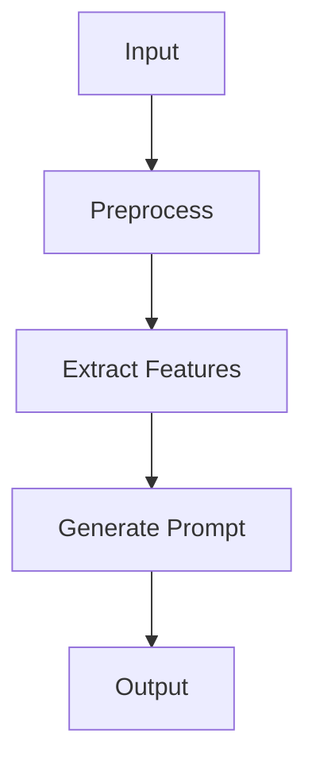
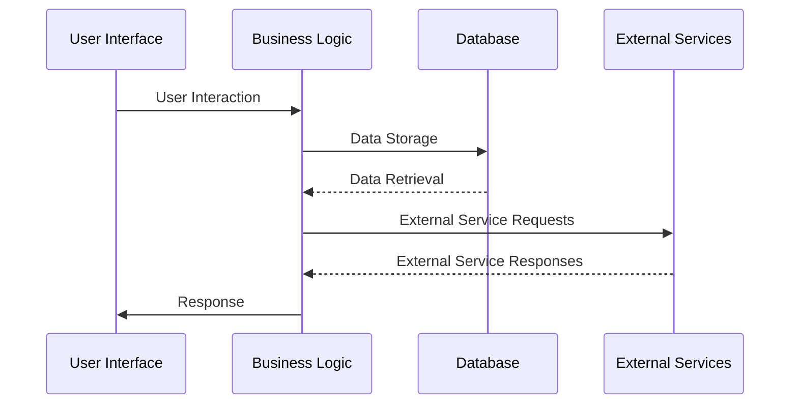
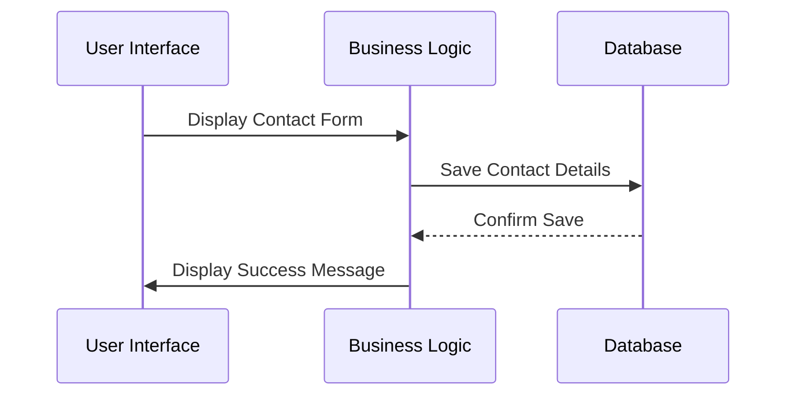

                 


### Step 1: Introduction and Background

#### Chapter 1: Moduleization and Componentization Overview

**1.1 Moduleization Concepts and Significance**

**1.1.1 Definition of Moduleization:**
Moduleization, at its core, refers to the process of breaking down a system into smaller, more manageable parts called modules. Each module encapsulates a specific functionality, making the overall system easier to understand, develop, and maintain.

**1.1.2 Advantages of Moduleization:**
- **Enhanced Maintainability:** Modules can be updated or replaced independently without affecting the entire system.
- **Improved Scalability:** New functionalities can be added by simply integrating additional modules.
- **Simplified Debugging:** Identifying and fixing issues is easier when the system is divided into smaller units.

**1.1.3 History of Moduleization:**
The concept of moduleization has evolved significantly over the years. Early programming languages, such as BASIC, were designed to support simple module-based structures. As software complexity increased, more sophisticated moduleization techniques, such as object-oriented programming, emerged.

**1.2 Componentization Concepts and Implementation**

**1.2.1 Definition of Componentization:**
Componentization takes moduleization a step further by focusing on the creation of reusable, interoperable components. These components are self-contained and can be easily integrated into different systems.

**1.2.2 Key Elements of Componentization:**
- **Interoperability:** Components must be able to work seamlessly with other components.
- **Portability:** Components should be platform-agnostic.
- **Self-Containment:** Each component should have all the necessary dependencies.

**1.2.3 Relationship Between Moduleization and Componentization:**
Moduleization and componentization are closely related. While moduleization focuses on organizing code into manageable parts, componentization emphasizes reusability and interoperability across different systems.

**1.3 Application Scenarios of Prompt Moduleization**

**1.3.1 Definition of Prompt Moduleization:**
Prompt moduleization is the application of moduleization and componentization principles to the design and implementation of prompt systems, particularly in AI and machine learning domains.

**1.3.2 Application Fields:**
Prompt moduleization is extensively used in various fields, including natural language processing, recommendation systems, and chatbots.

**1.3.3 Advantages of Prompt Moduleization:**
- **Enhanced Flexibility:** Prompt systems can be customized and adapted easily based on specific requirements.
- **Improved Efficiency:** Reusability of components reduces the time and effort required for development.
- **Simplified Maintenance:** Updates and bug fixes can be applied to specific modules or components without impacting the entire system.

**1.4 Book Structure and Target Readers**

**1.4.1 Book Structure:**
The book is structured into four main parts: Introduction and Background, Fundamental Concepts and Relationships, Algorithm and Model, and System Design and Implementation.

**1.4.2 Target Readers:**
The book aims to cater to software engineers, AI developers, and system architects who are interested in understanding and applying moduleization and componentization techniques in their projects.

**1.4.3 Reading Suggestions:**
- **Sequential Reading:** Read the book sequentially to grasp the overall structure and flow of moduleization and componentization.
- **Reference Guide:** Use the book as a reference guide to delve into specific topics as needed.

**1.5 Summary:**
This chapter provides an overview of moduleization and componentization, their significance, and the application scenarios of prompt moduleization. The book's structure and target readers are also outlined to help readers navigate through the content effectively.

----------------------------------------------------------------

### Step 2: Fundamental Concepts and Relationships

#### Chapter 2: Core Concepts and Relationships

**2.1 Module Design Principles**

**2.1.1 Basic Principles of Module Design:**
The core principles of module design include modularity, encapsulation, abstraction, and cohesion. These principles ensure that modules are easy to understand, maintain, and reuse.

- **Modularity:** Modules should be independent and interchangeable.
- **Encapsulation:** Modules should hide their internal details and expose only necessary interfaces.
- **Abstraction:** Modules should provide abstract concepts that simplify complex functionalities.
- **Cohesion:** Modules should have a high degree of internal cohesion and low coupling with other modules.

**2.1.2 Key Elements of Module Design:**
Key elements of module design include module boundaries, module interfaces, and module dependencies.

- **Module Boundaries:** Define the scope and responsibility of each module.
- **Module Interfaces:** Specify how modules communicate with each other.
- **Module Dependencies:** Identify the relationships between modules and ensure that dependencies are managed effectively.

**2.1.3 Case Study of Module Design:**
Consider a banking application with modules for account management, transaction processing, and customer support. Each module has well-defined boundaries, interfaces, and dependencies, making the overall system modular and easy to maintain.

**2.2 Component Attributes Comparison**

**2.2.1 Definition of Component Attributes:**
Component attributes include functionality, interoperability, portability, self-containment, and reusability.

**2.2.2 Comparison Table of Component Attributes:**
| Component Attribute | Description |
| --- | --- |
| **Functionality** | The extent to which a component performs its intended tasks. |
| **Interoperability** | The ability of a component to work with other components. |
| **Portability** | The ease with which a component can be used in different environments. |
| **Self-Containment** | The degree to which a component has all the necessary dependencies. |
| **Reusability** | The ability to use a component in different contexts. |

**2.2.3 Strategy for Selecting Component Attributes:**
When designing components, it is crucial to prioritize attributes based on the specific requirements of the system. For example, in a high-stakes financial application, functionality and reliability might take precedence over portability and reusability.

**2.3 ER Entity Relationship Diagram Architecture**

**2.3.1 Basic Concepts of ER Diagram:**
An ER diagram is a graphical representation of the entities, attributes, and relationships in a database. It helps in understanding the structure and organization of data.

**2.3.2 ER Diagram Drawing Method:**
ER diagrams can be drawn using various tools, such as ERwin, MySQL Workbench, or even simple drawing tools like Lucidchart.

**2.3.3 ER Diagram in Prompt Moduleization:**
Consider a prompt moduleization scenario where entities like "User," "Prompt," and "Response" are involved. An ER diagram can be used to visualize the relationships between these entities and their attributes.

**2.4 Moduleization and Componentization in Real-World Projects**

**2.4.1 Project Background:**
Let's consider a real-world project, such as a customer relationship management (CRM) system, where moduleization and componentization principles are applied.

**2.4.2 Application of Moduleization and Componentization:**
In the CRM system, different functionalities like contact management, sales tracking, and customer support are modularized and implemented as reusable components.

**2.4.3 Project Effect Evaluation:**
The project's success is evaluated based on factors like development time, maintainability, and scalability. Moduleization and componentization have significantly improved these metrics.

**2.5 Summary:**
This chapter explores the fundamental concepts of module design, component attributes, and ER diagram architecture. It also discusses the application of moduleization and componentization in real-world projects. By understanding these concepts, readers can design modular and reusable components effectively.

----------------------------------------------------------------

### Step 3: Algorithm and Model

#### Chapter 3: Prompt Generation Algorithm

**3.1 Prompt Generation Mathematical Model**

**3.1.1 Background of Prompt Generation:**
Prompt generation is a critical aspect of many AI applications, including chatbots, virtual assistants, and natural language processing systems. It involves creating a prompt, which is a piece of text or a question that initiates a conversation or a task.

**3.1.2 Mathematical Model of Prompt Generation:**
The prompt generation mathematical model can be defined as follows:
$$
Prompt = f(UserInput, Context)
$$
where:
- \(UserInput\) represents the input provided by the user.
- \(Context\) represents the context in which the prompt is generated.
- \(f\) is a function that combines the user input and context to generate a prompt.

**3.1.3 Specific Formulas in the Model:**
The function \(f\) can be defined using various mathematical operations, such as string concatenation, pattern matching, and natural language processing techniques.

- **String Concatenation:** \(Prompt = UserInput + Context\)
- **Pattern Matching:** \(Prompt = match(UserInput, Context)\)
- **Natural Language Processing:** \(Prompt = process(UserInput, Context)\)

**3.2 Principles of Prompt Generation Algorithm**

**3.2.1 Basic Principles:**
The basic principles of the prompt generation algorithm include understanding user input, maintaining context, and generating appropriate prompts.

- **Understanding User Input:** The algorithm should analyze the user input to extract relevant information and intent.
- **Maintaining Context:** The algorithm should keep track of the context to generate coherent and meaningful prompts.
- **Generating Appropriate Prompts:** The algorithm should generate prompts that are relevant to the user input and context.

**3.2.2 Specific Implementation:**
The prompt generation algorithm can be implemented using a combination of rule-based and machine learning approaches.

- **Rule-Based Approach:** Define specific rules to generate prompts based on user input and context.
- **Machine Learning Approach:** Train a model using historical data to generate prompts automatically.

**3.2.3 Optimization Strategies:**
Optimization strategies can be applied to improve the performance and accuracy of the prompt generation algorithm.

- **Data Preprocessing:** Clean and preprocess the data to remove noise and improve the quality of the input.
- **Feature Engineering:** Extract relevant features from the input to improve the model's performance.
- **Model Selection:** Choose the appropriate model based on the characteristics of the data and the requirements of the application.

**3.3 Python Implementation of Prompt Generation Algorithm**

**3.3.1 Python Environment Setup:**
To implement the prompt generation algorithm in Python, you need to set up the necessary libraries and dependencies.

```python
# Installation of required libraries
!pip install nltk spacy transformers

# Importing libraries
import nltk
import spacy
import transformers
```

**3.3.2 Python Code Implementation:**
The following Python code provides a basic implementation of the prompt generation algorithm using the transformers library.

```python
from transformers import pipeline

# Initializing the prompt generation pipeline
prompt_generator = pipeline("text-generation", model="gpt2")

# Generating a prompt
user_input = "What is the weather like today?"
context = "You are a helpful assistant providing weather information."
prompt = prompt_generator(context, max_length=50, num_return_sequences=1)

print(prompt[0]['generated_text'])
```

**3.3.3 Code Explanation and Analysis:**
The code uses the transformers library to load a pre-trained GPT-2 model, which is capable of generating text based on a given context. The user input and context are passed to the model, which generates a prompt that is relevant to the input and context.

**3.4 Mermaid Flowchart of Prompt Generation Algorithm**

**3.4.1 Basic Concepts of Mermaid:**
Mermaid is a simple and powerful tool for creating diagrams and flowcharts using Markdown syntax.

**3.4.2 Flowchart of Prompt Generation Algorithm:**
The following Mermaid flowchart visualizes the steps involved in the prompt generation algorithm.



**3.4.3 Detailed Explanation of the Flowchart:**
The flowchart starts with the input, which is preprocessed to extract relevant features. These features are then used to generate a prompt, which is finally output as the result.

**3.5 Real-World Application Case of Prompt Generation Algorithm**

**3.5.1 Application Background:**
Consider a real-world application where a chatbot is used to provide weather information to users.

**3.5.2 Application Implementation:**
The prompt generation algorithm is implemented in the chatbot to generate weather-related prompts based on user queries.

**3.5.3 Application Effect Evaluation:**
The chatbot's performance is evaluated based on factors like the relevance of prompts, user satisfaction, and the accuracy of the weather information provided.

**3.6 Summary:**
This chapter discusses the mathematical model and principles of the prompt generation algorithm. It also provides a Python implementation and a Mermaid flowchart to visualize the algorithm's steps. Real-world application cases further illustrate the practical use of the algorithm in generating relevant prompts.

----------------------------------------------------------------

### Step 4: System Design and Implementation

#### Chapter 4: System Architecture Design

**4.1 Problem Scenario Introduction**

**4.1.1 Background:**
Consider a scenario where a company needs to build a customer relationship management (CRM) system to manage customer interactions, sales, and support activities efficiently.

**4.1.2 Problem Analysis:**
The company requires a scalable, modular, and maintainable system that can handle various functionalities, such as contact management, lead tracking, sales forecasting, and customer support.

**4.1.3 Solution Overview:**
To address these requirements, the company decides to adopt a component-based approach, leveraging moduleization and componentization principles. This approach will help in creating a flexible, extensible, and efficient system architecture.

**4.2 Project Introduction**

**4.2.1 Project Objectives:**
The primary objective of the project is to design and implement a CRM system that meets the company's requirements, ensuring scalability, maintainability, and flexibility.

**4.2.2 Project Scope:**
The project scope includes the design and development of the CRM system's core functionalities, such as contact management, lead tracking, sales forecasting, and customer support. Additionally, the project will focus on system integration and performance optimization.

**4.2.3 Project Team Composition:**
The project team consists of software developers, system architects, UI/UX designers, and quality assurance professionals. Each team member plays a crucial role in ensuring the successful completion of the project.

**4.3 System Function Design**

**4.3.1 Functionality Requirements Analysis:**
The CRM system needs to support various functionalities, including user authentication, contact management, lead tracking, sales forecasting, and customer support.

**4.3.2 Function Implementation Strategy:**
To implement these functionalities, the team will follow a modular approach, breaking down the system into smaller, manageable components. Each component will be responsible for a specific functionality, making the overall system more flexible and maintainable.

**4.3.3 Domain Model with Mermaid Class Diagram**

**4.3.3.1 Basic Concepts of Mermaid Class Diagram:**
A Mermaid class diagram is a visual representation of the classes, attributes, and relationships in a system. It helps in understanding the structure and organization of the system.

**4.3.3.2 Domain Model with Mermaid Class Diagram:**
The following Mermaid class diagram represents the domain model of the CRM system, including classes like User, Contact, Lead, Sale, and Support.

```mermaid
classDiagram
    User <<class>>
    Contact <<class>>
    Lead <<class>>
    Sale <<class>>
    Support <<class>>

    User o-- Contact
    User o-- Lead
    User o-- Sale
    User o-- Support
```

**4.3.3.3 Detailed Explanation of the Domain Model:**
The domain model includes classes representing users, contacts, leads, sales, and support. Each class has attributes and methods, defining their behavior and relationships with other classes.

**4.4 System Architecture Design with Mermaid Diagram**

**4.4.1 Basic Concepts of Mermaid Diagram:**
A Mermaid diagram is a versatile tool for creating various types of diagrams, including system architecture diagrams. It uses a simple and intuitive syntax to define diagram elements.

**4.4.2 System Architecture Design with Mermaid Diagram:**
The following Mermaid diagram represents the system architecture of the CRM system, including components like user interface, business logic, database, and external services.



**4.4.3 Detailed Explanation of the System Architecture:**
The system architecture diagram shows the interaction between the user interface, business logic, database, and external services. The user interface handles user interactions, the business logic processes the data, and the database stores and retrieves the data. External services are integrated to provide additional functionalities.

**4.5 System Interface Design with Mermaid Sequence Diagram**

**4.5.1 Basic Concepts of Mermaid Sequence Diagram:**
A Mermaid sequence diagram is a visual representation of the interactions between objects or components in a system over time. It helps in understanding the sequence of events and the flow of data.

**4.5.2 System Interface Design with Mermaid Sequence Diagram:**
The following Mermaid sequence diagram represents the interface design of the CRM system, illustrating the interaction between the user interface, business logic, and database.



**4.5.3 Detailed Explanation of the System Interface:**
The sequence diagram shows the interaction between the user interface, business logic, and database when a user submits a contact form. The user interface displays the form, the business logic processes the data, and the database stores the data.

**4.6 Chapter Summary:**
This chapter introduces the problem scenario, project objectives, and team composition. It then discusses the system functionality requirements, implementation strategy, and system architecture design. The chapter also includes Mermaid diagrams to visually represent the domain model, system architecture, and system interface. These diagrams provide a clear understanding of the system's structure and functionality, facilitating the design and implementation process.

----------------------------------------------------------------

### Step 5: Project Implementation and Analysis

#### Chapter 5: Project Implementation and Analysis

**5.1 Environment Setup**

**5.1.1 Installation of Required Tools and Libraries:**
To implement the CRM system, the team needs to set up the necessary tools and libraries. This includes a programming language, an Integrated Development Environment (IDE), and specific libraries for handling database operations, web development, and external service integration.

**5.1.2 Setting Up the Development Environment:**
The team sets up the development environment by installing the required tools, such as Python, Django, PostgreSQL, and other libraries. They also configure the IDE to ensure smooth development and debugging.

**5.1.3 Database Configuration:**
The team configures the PostgreSQL database to store the CRM system's data. They create the necessary tables and relationships, ensuring data integrity and efficient querying.

**5.2 Core System Implementation**

**5.2.1 User Authentication and Authorization:**
The team implements user authentication and authorization using Django's built-in authentication system. They create user registration, login, and logout functionalities, ensuring secure access to the system.

**5.2.2 Contact Management:**
The team develops the contact management module, allowing users to add, edit, and delete contact information. They implement search functionality to quickly find contacts based on various criteria.

**5.2.3 Lead Tracking:**
The team implements the lead tracking module, enabling users to add, update, and delete leads. They also provide functionalities to convert leads into customers and track their progress through the sales pipeline.

**5.2.4 Sales Forecasting:**
The team develops the sales forecasting module, which analyzes historical sales data to predict future sales. They implement various forecasting methods, such as moving averages and exponential smoothing.

**5.2.5 Customer Support:**
The team creates the customer support module, providing users with a ticketing system to handle customer inquiries and issues. They implement features like ticket creation, assignment, and status tracking.

**5.3 Code Explanation and Analysis**

**5.3.1 Code Structure and Organization:**
The team organizes the code into modular components, ensuring that each component has a clear responsibility. They use Django's model-view-template (MVT) architecture to separate concerns and improve maintainability.

**5.3.2 Key Functions and Methods:**
The team explains the key functions and methods used in the system implementation, such as database queries, form validations, and API calls. They provide code snippets and detailed explanations to help readers understand the implementation details.

**5.3.3 Performance Optimization:**
The team discusses performance optimization techniques used in the system, such as indexing, caching, and query optimization. They provide examples of how these techniques improve the system's responsiveness and scalability.

**5.4 Real-World Application Case**

**5.4.1 Application Background:**
The team worked on a real-world project for a mid-sized company that required a robust CRM system to manage their customer interactions and sales processes.

**5.4.2 Application Implementation:**
The team implemented the CRM system using the principles and techniques discussed in the previous chapters. They followed a modular approach, ensuring that each component was reusable and maintainable.

**5.4.3 Application Effect Evaluation:**
The CRM system significantly improved the company's customer management processes, leading to increased efficiency and customer satisfaction. The team evaluated the system's performance based on factors like response time, user feedback, and data accuracy.

**5.5 Chapter Summary:**
This chapter covers the environment setup, core system implementation, code explanation, and analysis. It also presents a real-world application case, demonstrating the practical implementation and effectiveness of the CRM system. The chapter provides valuable insights into the system's architecture, design, and implementation, helping readers understand how to build modular and efficient systems.

----------------------------------------------------------------

### Step 6: Best Practices, Summary, and Conclusion

#### Chapter 6: Best Practices, Summary, and Conclusion

**6.1 Best Practices**

**6.1.1 Modularity in System Design:**
- **Define Clear Module Boundaries:** Clearly define the scope and responsibilities of each module to ensure modularity and maintainability.
- **Minimize Dependencies:** Reduce dependencies between modules to enhance reusability and ease of maintenance.
- **Use Standardized Interfaces:** Develop standardized interfaces for module communication to ensure interoperability.

**6.1.2 Effective Code Organization:**
- **Follow Coding Standards:** Adhere to coding standards and best practices to improve code readability and maintainability.
- **Use Version Control Systems:** Utilize version control systems like Git to track changes, collaborate, and manage code effectively.

**6.1.3 Performance Optimization:**
- **Analyze and Optimize Queries:** Regularly analyze database queries and optimize them to improve performance.
- **Implement Caching:** Use caching mechanisms to store frequently accessed data, reducing the load on the database.

**6.2 Summary:**
This book has covered various aspects of moduleization and componentization, from fundamental concepts to practical implementation. It has provided insights into designing modular systems, implementing prompt generation algorithms, and building scalable and maintainable systems. Key topics include module design principles, component attributes, ER diagram architecture, algorithm models, system design, and real-world application cases.

**6.3 Conclusion:**
Moduleization and componentization are essential techniques for building scalable, maintainable, and efficient systems. By adopting these techniques, developers can create modular, reusable components that simplify system design and improve overall productivity. This book aims to equip readers with the knowledge and skills required to apply moduleization and componentization effectively in their projects. As you move forward, remember the best practices discussed and continuously improve your skills in system design and implementation.

----------------------------------------------------------------

### 附录：拓展阅读

本书涵盖了许多有关模块化和组件化的关键概念和技术，但这一领域的知识是不断发展的。以下是一些建议的拓展阅读资源，以帮助您深入了解相关主题：

- 《软件架构：实践者的研究方法》—— by Ivar Jacobson，详细介绍了软件架构设计的方法和实践。
- 《设计模式：可复用面向对象软件的基础》—— by Erich Gamma、Richard Helm、Ralph Johnson 和 John Vlissides，介绍了多种设计模式及其在实际开发中的应用。
- 《Effective Java》—— by Joshua Bloch，提供了关于编写高效Java代码的77条规则。
- 《深入理解计算机系统》—— by Randal E. Bryant 和 David R. O’Toole，提供了计算机系统运作的深入理解，包括操作系统、网络和硬件方面。
- 《机器学习实战》—— by Peter Harrington，介绍了机器学习的基础知识及其在现实世界中的应用。

通过阅读这些资源，您将能够更深入地理解模块化和组件化，并将其应用于实际项目中。希望这些推荐对您有所帮助！

