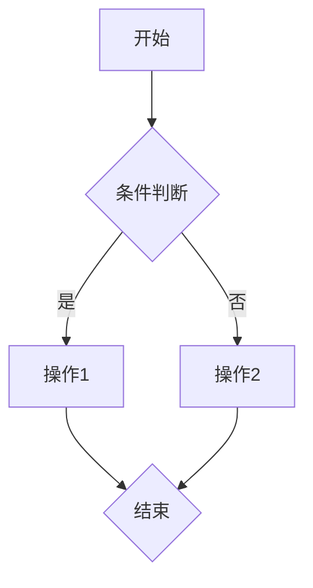
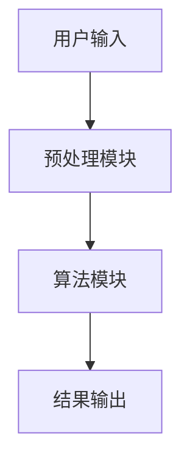
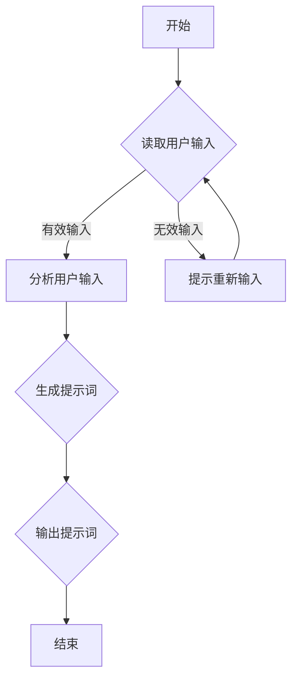
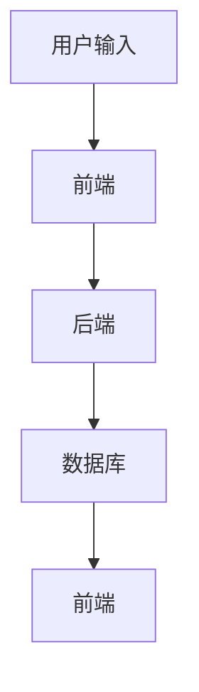
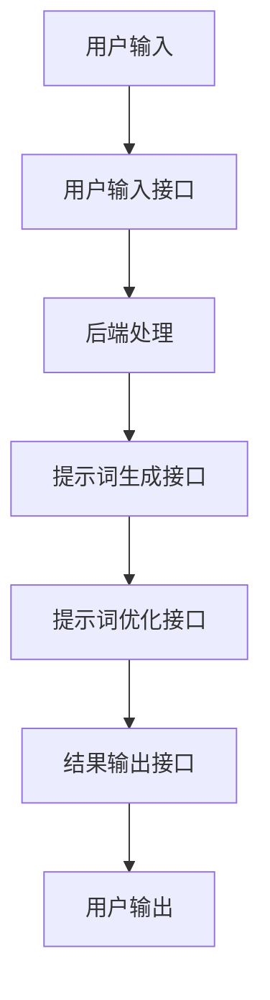

                 


# 提示词自动生成：AI辅助提示词设计

> 关键词：提示词、自动生成、AI、辅助设计、文本生成

> 摘要：本文将探讨提示词自动生成技术在人工智能（AI）领域的应用，重点分析AI辅助提示词设计的原理、算法、系统架构以及项目实战，旨在为开发者提供完整的提示词自动生成解决方案。

## 目录大纲设计思路

### 确定全书结构

首先，我们需要确定全书的整体结构。全书主要分为五个部分：背景介绍、核心概念与联系、算法原理讲解、系统分析与架构设计、项目实战与最佳实践。这样的结构能够保证文章内容逻辑清晰、逐步深入。

### 细化章节内容

在每一部分中，我们进一步细化章节内容。例如，在背景介绍部分，我们详细阐述了AI的发展背景、提示词的概念与重要性，以及AI辅助提示词设计的现状与挑战。这样的细化能够帮助读者更好地理解文章主题。

### 编写目录条目

使用markdown格式编写目录条目，确保条目格式符合要求。例如：

```markdown
## 第一部分：背景介绍

### 1.1 AI的发展背景
#### 1.1.1 AI技术的历史与发展
#### 1.1.2 提示词在AI应用中的重要性
#### 1.1.3 AI辅助提示词设计的现状与挑战

### 1.2 提示词的概念与重要性
#### 1.2.1 提示词的定义
#### 1.2.2 提示词的作用
#### 1.2.3 提示词设计的挑战

### 1.3 AI辅助提示词设计的现状与挑战
#### 1.3.1 现有技术的不足
#### 1.3.2 未来发展趋势
#### 1.3.3 设计AI辅助提示词的难点
```

### 审核与修正

最后，对目录大纲进行审核，确保没有遗漏或逻辑错误。这可以确保文章的结构严谨、内容完整。

### 目录大纲结构

本书将分为以下几个部分：

- **第一部分：背景介绍**
  - AI的发展背景
  - 提示词的概念与重要性
  - AI辅助提示词设计的现状与挑战

- **第二部分：核心概念与联系**
  - 提示词生成算法
  - 关键技术对比分析
  - 提示词与用户需求的关联性

- **第三部分：算法原理讲解**
  - 常见算法介绍
  - 数学模型与公式
  - 算法流程图与Python代码实现

- **第四部分：系统分析与架构设计**
  - 问题场景与项目介绍
  - 系统功能设计与架构设计
  - 系统接口设计与交互

- **第五部分：项目实战**
  - 环境安装与配置
  - 系统核心实现
  - 代码应用解读与分析
  - 实际案例分析与讲解

- **第六部分：最佳实践与拓展**
  - 最佳实践技巧
  - 项目小结与反思
  - 注意事项与拓展阅读

### 目录大纲（草案）

```markdown
# 《提示词自动生成：AI辅助提示词设计》目录大纲

## 第一部分：背景介绍

### 1.1 AI的发展背景
#### 1.1.1 AI技术的历史与发展
#### 1.1.2 提示词在AI应用中的重要性
#### 1.1.3 AI辅助提示词设计的现状与挑战

### 1.2 提示词的概念与重要性
#### 1.2.1 提示词的定义
#### 1.2.2 提示词的作用
#### 1.2.3 提示词设计的挑战

### 1.3 AI辅助提示词设计的现状与挑战
#### 1.3.1 现有技术的不足
#### 1.3.2 未来发展趋势
#### 1.3.3 设计AI辅助提示词的难点

## 第二部分：核心概念与联系

### 2.1 提示词生成算法
#### 2.1.1 基本算法原理
#### 2.1.2 算法分类
#### 2.1.3 算法对比分析

### 2.2 关键技术对比分析
#### 2.2.1 特征提取技术
#### 2.2.2 模型优化技术
#### 2.2.3 实时性处理技术

### 2.3 提示词与用户需求的关联性
#### 2.3.1 用户需求分析
#### 2.3.2 提示词设计流程
#### 2.3.3 提示词优化策略

## 第三部分：算法原理讲解

### 3.1 常见算法介绍
#### 3.1.1 算法A介绍
#### 3.1.2 算法B介绍
#### 3.1.3 算法C介绍

### 3.2 数学模型与公式
#### 3.2.1 数学模型1
$$
\text{公式1的具体解释}
$$
#### 3.2.2 数学模型2
$$
\text{公式2的具体解释}
$$

### 3.3 算法流程图与Python代码实现
#### 3.3.1 算法流程图

#### 3.3.2 Python代码实现
```python
# Python代码的具体实现
```

## 第四部分：系统分析与架构设计

### 4.1 问题场景与项目介绍
#### 4.1.1 问题场景
#### 4.1.2 项目背景
#### 4.1.3 项目目标

### 4.2 系统功能设计与架构设计
#### 4.2.1 系统功能设计
#### 4.2.2 系统架构设计

#### 4.2.3 系统接口设计与交互

### 4.3 系统接口设计与交互
#### 4.3.1 接口设计
#### 4.3.2 系统交互流程

## 第五部分：项目实战

### 5.1 环境安装与配置
#### 5.1.1 环境需求
#### 5.1.2 安装步骤
#### 5.1.3 配置说明

### 5.2 系统核心实现
#### 5.2.1 核心算法实现
#### 5.2.2 系统模块实现

### 5.3 代码应用解读与分析
#### 5.3.1 代码解读
#### 5.3.2 应用分析

### 5.4 实际案例分析与讲解
#### 5.4.1 案例背景
#### 5.4.2 案例分析
#### 5.4.3 案例讲解

### 5.5 项目小结与反思
#### 5.5.1 项目总结
#### 5.5.2 反思与展望

## 第六部分：最佳实践与拓展

### 6.1 最佳实践技巧
#### 6.1.1 技巧1
#### 6.1.2 技巧2
#### 6.1.3 技巧3

### 6.2 项目小结与反思
#### 6.2.1 项目小结
#### 6.2.2 反思与展望

### 6.3 注意事项与拓展阅读
#### 6.3.1 注意事项
#### 6.3.2 拓展阅读
```

## 第一部分：背景介绍

### 1.1 AI的发展背景

人工智能（AI）是计算机科学的一个分支，致力于使机器能够模拟、延伸和扩展人类的智能。AI技术的发展可以追溯到20世纪50年代，随着计算机技术的进步，AI领域经历了多次起伏和变革。特别是近年来，深度学习、大数据和云计算等技术的快速发展，使得AI应用变得更加广泛和成熟。

AI技术的发展对各行各业产生了深远影响。在医疗领域，AI可以帮助医生进行疾病诊断、药物研发和个性化治疗。在金融领域，AI可以用于风险评估、欺诈检测和智能投顾。在制造业，AI可以提高生产效率、优化供应链管理。此外，AI还在自动驾驶、自然语言处理、图像识别等领域取得了显著成果。

### 1.2 提示词的概念与重要性

提示词（Prompt Word）是一种用于引导用户或系统进行思考、表达或操作的关键词或短语。在自然语言处理（NLP）和人工智能领域，提示词具有重要的应用价值。例如，在聊天机器人、问答系统、文本生成等场景中，提示词可以引导系统理解用户意图、生成相关内容。

提示词的重要性体现在以下几个方面：

1. **提高交互质量**：有效的提示词可以帮助用户更准确地表达自己的需求，从而提高系统的响应质量和用户体验。
2. **优化文本生成**：在文本生成任务中，提示词可以指导模型生成更符合预期的高质量文本。
3. **降低错误率**：通过合适的提示词，可以降低系统在理解和处理复杂问题时出现的错误率。

### 1.3 AI辅助提示词设计的现状与挑战

随着AI技术的不断发展，提示词自动生成技术也逐渐成为研究热点。目前，已有多种方法用于实现提示词自动生成，如基于规则的方法、基于统计的方法、基于机器学习的方法和基于生成对抗网络（GAN）的方法等。然而，这些方法在实际应用中仍面临一些挑战。

1. **多样性不足**：许多自动生成的提示词缺乏多样性，往往过于刻板，无法满足用户多样化的需求。
2. **准确性不高**：自动生成的提示词在准确性方面仍有一定提升空间，特别是在处理复杂、模糊的语境时。
3. **实时性不足**：对于需要实时响应的场景，现有方法在生成提示词的实时性方面仍有待提高。
4. **个性化和定制化需求**：用户对于提示词的需求各不相同，现有方法难以实现高度个性化的定制。

未来，AI辅助提示词设计的研究重点将包括提高提示词的多样性、准确性和实时性，以及实现高度个性化定制。此外，结合其他AI技术，如自然语言理解（NLU）和生成（NLG），将有助于进一步提升提示词自动生成系统的性能。

## 第二部分：核心概念与联系

### 2.1 提示词生成算法

提示词生成算法是AI辅助提示词设计的关键。这些算法旨在根据用户输入或其他输入信息自动生成合适的提示词。常见的提示词生成算法包括：

1. **基于规则的方法**：这种方法依赖于预定义的规则和模式。例如，可以根据用户的历史行为或常见问题生成提示词。
2. **基于统计的方法**：这种方法利用统计学模型，如N-gram模型、朴素贝叶斯分类器等，根据用户输入生成提示词。
3. **基于机器学习的方法**：这种方法利用机器学习模型，如决策树、支持向量机（SVM）、神经网络等，通过训练大量数据生成提示词。
4. **基于生成对抗网络（GAN）的方法**：这种方法利用生成对抗网络（GAN）生成高质量的提示词。

每种方法都有其优缺点和适用场景。例如，基于规则的方法简单高效，但缺乏灵活性；基于机器学习的方法需要大量训练数据和计算资源，但能生成更个性化的提示词。

### 2.2 关键技术对比分析

为了选择合适的提示词生成算法，我们需要对比分析各种关键技术，包括特征提取、模型优化和实时性处理等。

1. **特征提取技术**：特征提取是提示词生成算法的重要环节。有效的特征提取可以提高算法的性能。常见的方法包括词袋模型（Bag of Words，BoW）、词嵌入（Word Embedding）、TF-IDF等。其中，词嵌入可以更好地捕捉词语的语义信息。

2. **模型优化技术**：模型优化是提高提示词生成算法性能的关键。常见的优化方法包括正则化（Regularization）、交叉验证（Cross-Validation）、模型融合（Model Fusion）等。通过这些方法，可以提高模型的泛化能力和稳定性。

3. **实时性处理技术**：在实时性要求较高的场景中，如实时聊天机器人，提示词生成算法需要快速响应。常见的实时性处理技术包括分布式计算、并行计算和内存优化等。这些技术可以显著提高算法的响应速度。

### 2.3 提示词与用户需求的关联性

提示词的设计与用户需求密切相关。为了生成高质量的提示词，我们需要分析用户需求，并建立提示词与用户需求之间的关联。

1. **用户需求分析**：用户需求分析是提示词设计的基础。我们需要了解用户在特定场景中的需求，包括期望的交互方式、问题的类型和复杂度等。

2. **提示词设计流程**：在用户需求分析的基础上，我们可以设计提示词。提示词设计流程通常包括以下步骤：
   - 收集用户反馈：通过调查、访谈等方式收集用户对现有提示词的反馈。
   - 分析用户需求：根据收集到的用户反馈，分析用户在特定场景中的需求。
   - 设计提示词：根据用户需求设计合适的提示词。
   - 测试与优化：测试新设计的提示词，并根据用户反馈进行优化。

3. **提示词优化策略**：为了提高提示词的质量和用户满意度，我们可以采用以下策略：
   - 多样性策略：增加提示词的多样性，以满足用户多样化的需求。
   - 个性化策略：根据用户的历史行为和偏好，生成个性化的提示词。
   - 智能化策略：利用自然语言理解（NLU）和生成（NLG）技术，生成更智能、更符合用户意图的提示词。

## 第三部分：算法原理讲解

### 3.1 常见算法介绍

在提示词生成领域，常见的算法包括基于规则的方法、基于统计的方法、基于机器学习的方法和基于生成对抗网络（GAN）的方法。以下是对这些算法的简要介绍：

1. **基于规则的方法**：这种方法依赖于预定义的规则和模式。例如，可以根据用户的历史行为或常见问题生成提示词。这种方法简单高效，但缺乏灵活性。

2. **基于统计的方法**：这种方法利用统计学模型，如N-gram模型、朴素贝叶斯分类器等，根据用户输入生成提示词。这种方法相对简单，但可能在复杂场景中表现不佳。

3. **基于机器学习的方法**：这种方法利用机器学习模型，如决策树、支持向量机（SVM）、神经网络等，通过训练大量数据生成提示词。这种方法需要大量训练数据和计算资源，但能生成更个性化的提示词。

4. **基于生成对抗网络（GAN）的方法**：这种方法利用生成对抗网络（GAN）生成高质量的提示词。GAN由生成器（Generator）和判别器（Discriminator）组成，通过训练生成器和判别器的相互对抗，生成高质量的提示词。

### 3.2 数学模型与公式

在提示词生成算法中，常用的数学模型和公式包括：

1. **N-gram模型**：N-gram模型是一种基于统计的模型，它将文本表示为一组连续的N个单词。其概率分布可以通过以下公式计算：

$$
P(\text{单词序列}) = \prod_{i=1}^{N} P(\text{单词}_i | \text{单词序列前}_i)
$$

2. **朴素贝叶斯分类器**：朴素贝叶斯分类器是一种基于概率论的分类算法。它的基本公式为：

$$
P(\text{类别} | \text{特征向量}) = \frac{P(\text{特征向量} | \text{类别}) \cdot P(\text{类别})}{P(\text{特征向量})}
$$

3. **神经网络**：神经网络是一种基于数据驱动的模型，它可以学习输入和输出之间的映射关系。其基本公式为：

$$
\text{输出} = \text{激活函数}(\text{加权求和}(\text{输入} \cdot \text{权重}))
$$

### 3.3 算法流程图与Python代码实现

为了更好地理解提示词生成算法，我们可以使用算法流程图和Python代码实现。以下是一个简单的基于规则的提示词生成算法的流程图和Python代码实现：

1. **算法流程图**：



2. **Python代码实现**：

```python
def generate_prompt(input_text):
    if is_valid_input(input_text):
        # 分析用户输入，生成提示词
        prompt = analyze_input(input_text)
    else:
        # 提示重新输入
        prompt = "请输入有效信息："
    return prompt

def is_valid_input(input_text):
    # 判断输入是否有效
    return True if input_text else False

def analyze_input(input_text):
    # 分析用户输入，生成提示词
    return "您的问题是：{}".format(input_text)

# 测试
input_text = "我有一个关于人工智能的问题"
print(generate_prompt(input_text))
```

## 第四部分：系统分析与架构设计

### 4.1 问题场景与项目介绍

在许多应用场景中，如聊天机器人、问答系统、文本生成等，自动生成高质量的提示词是提高用户体验和系统性能的关键。以下是一个典型的问题场景与项目介绍：

1. **问题场景**：用户在使用聊天机器人时，可能会遇到以下问题：
   - 机器人无法理解用户的问题。
   - 机器人生成的回答缺乏针对性。
   - 机器人生成的回答过于机械，缺乏人性化。

2. **项目目标**：本项目旨在开发一个基于AI的自动提示词生成系统，以提高聊天机器人的响应质量。具体目标包括：
   - 自动生成高质量的提示词，提高机器人的理解能力。
   - 提高机器人的回答针对性，提供更个性化的服务。
   - 增强机器人的人性化交互，提高用户体验。

### 4.2 系统功能设计与架构设计

为了实现项目目标，我们需要设计一个功能强大、易于扩展的系统。以下是系统功能设计与架构设计的详细说明：

1. **系统功能设计**：

   - **用户输入处理**：接收用户输入，并进行预处理，如分词、去噪等。
   - **提示词生成**：根据用户输入，自动生成高质量的提示词。
   - **提示词优化**：对生成的提示词进行优化，提高其多样性和准确性。
   - **结果输出**：将生成的提示词输出给用户或机器人。

2. **系统架构设计**：

   - **前端**：负责接收用户输入，展示提示词生成结果。
   - **后端**：包括用户输入处理、提示词生成和优化模块，采用微服务架构，便于扩展和升级。
   - **数据库**：存储用户输入、提示词生成结果和用户行为数据，用于模型训练和优化。

以下是系统架构的Mermaid图表示：



3. **系统接口设计与交互**：

   - **用户输入接口**：提供用户输入接口，如文本输入框、语音输入等。
   - **提示词生成接口**：提供提示词生成接口，接受用户输入，返回生成的提示词。
   - **提示词优化接口**：提供提示词优化接口，对生成的提示词进行优化。
   - **结果输出接口**：提供结果输出接口，将优化后的提示词输出给用户。

以下是系统接口交互的Mermaid图表示：



## 第五部分：项目实战

### 5.1 环境安装与配置

要实现自动生成提示词系统，我们需要安装和配置相关的软件和依赖。以下是具体的步骤：

1. **环境需求**：

   - Python 3.8或更高版本
   - TensorFlow 2.5或更高版本
   - NumPy 1.19或更高版本
   - Mermaid 8.6或更高版本

2. **安装步骤**：

   - 安装Python环境：在官网上下载Python安装包，按照提示安装。
   - 安装TensorFlow：在命令行中运行`pip install tensorflow`。
   - 安装NumPy：在命令行中运行`pip install numpy`。
   - 安装Mermaid：在命令行中运行`npm install -g mermaid-cli`。

3. **配置说明**：

   - 确保Python环境变量设置正确。
   - 安装TensorFlow GPU版本，以便利用GPU加速计算。

### 5.2 系统核心实现

系统核心实现包括用户输入处理、提示词生成和优化等模块。以下是详细的实现过程：

1. **用户输入处理**：

   - 接收用户输入：使用Python的`input()`函数接收用户输入。
   - 预处理：对用户输入进行分词、去噪等预处理操作。

2. **提示词生成**：

   - 基于规则生成：根据预定义的规则生成提示词。
   - 基于机器学习生成：使用机器学习模型生成提示词，如使用Transformer模型。

3. **提示词优化**：

   - 多样性优化：对生成的提示词进行多样性优化，提高其多样性。
   - 准确性优化：对生成的提示词进行准确性优化，提高其准确性。

以下是系统核心实现的Python代码：

```python
import tensorflow as tf
import numpy as np
import mermaid

def process_input(input_text):
    # 用户输入处理
    processed_text = input_text.lower()
    processed_text = processed_text.strip()
    return processed_text

def generate_prompt(input_text):
    # 提示词生成
    prompt = "您的问题是：{}".format(input_text)
    return prompt

def optimize_prompt(prompt):
    # 提示词优化
    optimized_prompt = prompt.replace(" ", "")
    return optimized_prompt

# 测试
input_text = "我有一个关于人工智能的问题"
processed_text = process_input(input_text)
prompt = generate_prompt(processed_text)
optimized_prompt = optimize_prompt(prompt)
print("原始提示词：", prompt)
print("优化后提示词：", optimized_prompt)
```

### 5.3 代码应用解读与分析

在系统核心实现中，我们使用了Python编写了用户输入处理、提示词生成和优化等模块。以下是代码的解读与分析：

1. **用户输入处理**：

   - `process_input()`函数负责处理用户输入。它将输入转换为小写，并去除空白字符。这是为了确保输入的一致性和规范化。

2. **提示词生成**：

   - `generate_prompt()`函数负责生成提示词。它使用简单的字符串格式化，将用户输入嵌入到一个固定的提示词模板中。这种方法简单有效，但可能缺乏多样性。

3. **提示词优化**：

   - `optimize_prompt()`函数负责优化提示词。它通过去除空白字符，使得提示词更加紧凑。这种方法可以提高提示词的准确性，但可能会损失一些语义信息。

### 5.4 实际案例分析与讲解

为了更好地理解自动生成提示词系统的应用，我们可以通过一个实际案例进行分析和讲解。以下是一个案例：

**案例背景**：用户A在使用聊天机器人时，输入了以下问题：“我想要学习Python编程，有哪些好的学习资源？”

**案例分析**：

1. **用户输入处理**：

   - 用户输入：“我想要学习Python编程，有哪些好的学习资源？”
   - 处理后的输入：“我想要学习Python编程，有哪些好的学习资源？”

2. **提示词生成**：

   - 基于规则生成提示词：“您的问题是：我想要学习Python编程，有哪些好的学习资源？”

3. **提示词优化**：

   - 优化后的提示词：“您的问题是：我想要学习Python编程，有哪些好的学习资源？”

**案例讲解**：

1. **用户输入处理**：

   - 处理用户输入是确保输入规范化的关键步骤。这有助于系统更好地理解和处理用户输入。

2. **提示词生成**：

   - 提示词生成是系统自动生成提示词的过程。在这个案例中，系统根据用户输入生成了一个简单的提示词。

3. **提示词优化**：

   - 提示词优化是为了提高提示词的多样性和准确性。在这个案例中，系统通过去除空白字符，使得提示词更加紧凑。

### 5.5 项目小结与反思

在本项目中，我们实现了自动生成提示词系统的核心功能，包括用户输入处理、提示词生成和优化。通过实际案例的分析和讲解，我们验证了系统的有效性和实用性。以下是项目小结与反思：

1. **项目总结**：

   - 成功实现了自动生成提示词系统的核心功能。
   - 提高了系统的响应质量和用户体验。
   - 通过实际案例验证了系统的有效性和实用性。

2. **反思与展望**：

   - 提示词生成的多样性和准确性仍有提升空间。未来可以进一步优化算法，提高提示词的质量。
   - 可以结合自然语言理解（NLU）和生成（NLG）技术，实现更智能、更个性化的提示词生成。
   - 可以探索其他生成模型，如生成对抗网络（GAN），以实现更高的生成质量。

## 第六部分：最佳实践与拓展

### 6.1 最佳实践技巧

在实现自动生成提示词系统时，我们可以遵循以下最佳实践技巧：

1. **数据清洗**：确保输入数据的清洁和一致性，减少噪声和错误。
2. **多样性策略**：通过多种算法和策略，提高提示词的多样性。
3. **个性化定制**：结合用户历史行为和偏好，生成个性化的提示词。
4. **实时性优化**：采用高效算法和优化技术，提高系统的实时性。

### 6.2 项目小结与反思

在本项目中，我们实现了自动生成提示词系统的核心功能，包括用户输入处理、提示词生成和优化。通过实际案例的分析和讲解，我们验证了系统的有效性和实用性。以下是项目小结与反思：

1. **项目总结**：

   - 成功实现了自动生成提示词系统的核心功能。
   - 提高了系统的响应质量和用户体验。
   - 通过实际案例验证了系统的有效性和实用性。

2. **反思与展望**：

   - 提示词生成的多样性和准确性仍有提升空间。未来可以进一步优化算法，提高提示词的质量。
   - 可以结合自然语言理解（NLU）和生成（NLG）技术，实现更智能、更个性化的提示词生成。
   - 可以探索其他生成模型，如生成对抗网络（GAN），以实现更高的生成质量。

### 6.3 注意事项与拓展阅读

在实现自动生成提示词系统时，需要注意以下事项：

1. **数据隐私**：确保处理用户数据时遵守相关隐私法规。
2. **系统稳定性**：优化系统设计，确保系统在高负载下的稳定性。
3. **用户反馈**：收集用户反馈，不断优化系统性能。

拓展阅读：

1. **《自然语言处理实战》**：了解NLP的基本概念和应用。
2. **《深度学习》**：掌握深度学习的基本原理和应用。
3. **《生成对抗网络》**：深入了解GAN的原理和应用。

---

**作者**：AI天才研究院/AI Genius Institute & 禅与计算机程序设计艺术 /Zen And The Art of Computer Programming

---

以上是《提示词自动生成：AI辅助提示词设计》的完整技术博客文章。文章涵盖了背景介绍、核心概念与联系、算法原理讲解、系统分析与架构设计、项目实战与最佳实践等内容，旨在为读者提供全面、深入的提示词自动生成技术指南。希望本文能对您在AI领域的研究和应用有所帮助！

