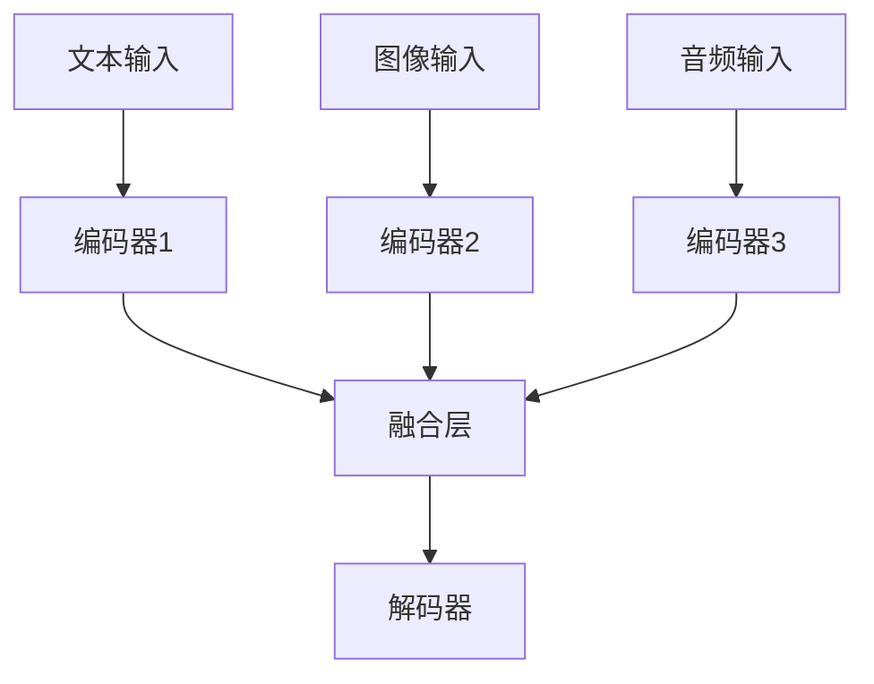
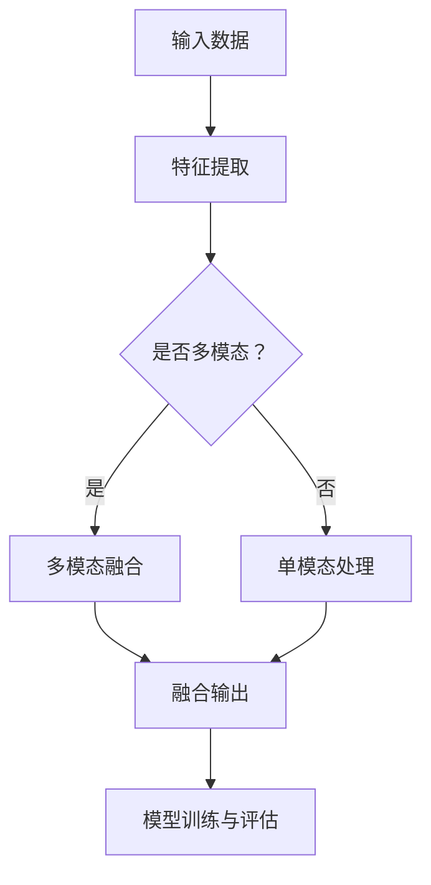
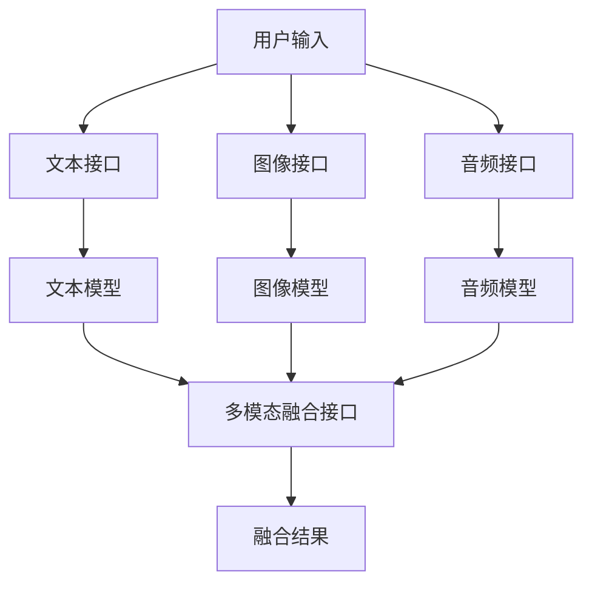

                 

### 提高LLM应用的多模态融合效率

## 文章关键词

- 大型语言模型（LLM）
- 多模态融合
- 算法效率
- 系统架构
- 机器学习

## 摘要

本文旨在探讨如何提高大型语言模型（LLM）应用中的多模态融合效率。首先，我们将介绍LLM和多模态融合的基本概念，并阐述它们在当今机器学习领域的重要性。接着，本文将深入分析LLM的核心原理和多模态融合的算法，通过具体的实例和代码解释，展示如何将这些概念应用于实际项目中。随后，我们将讨论一个假设的项目，详细介绍其系统功能、架构设计、接口设计和系统交互。最后，本文将提供一些最佳实践建议，以帮助读者在实际应用中提高多模态融合的效率，并对未来的发展方向进行展望。

---

### 第1章: LLM与多模态融合概述

在本章中，我们将介绍大型语言模型（LLM）和多模态融合的基本概念，并探讨它们在现代机器学习中的重要性。

#### 1.1 LLM的基本概念

大型语言模型（LLM）是一类基于深度学习的语言处理模型，其规模远超传统的语言模型。LLM通过训练海量的文本数据，学习到语言的结构、语法和语义，从而能够进行文本生成、翻译、问答等复杂的语言处理任务。例如，GPT-3和BERT就是著名的LLM，它们在自然语言处理（NLP）领域取得了显著的成果。

#### 1.2 多模态融合的重要性

多模态融合是指将不同类型的输入数据（如文本、图像、音频）进行结合，以提高模型的性能。在LLM应用中，多模态融合能够使得模型能够处理更加丰富、多样化的数据，从而提高模型的泛化能力和表现。例如，在医疗诊断中，结合患者的文本病历和医学图像，可以帮助模型更准确地识别疾病。

#### 1.3 LLM与多模态融合的发展历程

LLM和多模态融合技术的发展经历了几个阶段：

1. **初期阶段**：单模态模型的兴起，如基于规则的方法和统计模型。
2. **中期阶段**：深度学习在图像和语音领域的应用，带动了单模态模型的发展。
3. **当前阶段**：随着深度学习技术的成熟，LLM和多模态融合开始广泛应用，例如在聊天机器人、智能助手和自动驾驶等领域。

#### 1.4 当前挑战与未来方向

尽管LLM和多模态融合取得了显著成果，但仍面临一些挑战：

1. **数据质量**：高质量的多模态数据获取和处理仍然是一个难题。
2. **计算资源**：大规模的模型训练需要大量的计算资源和时间。
3. **跨模态对齐**：不同模态的数据如何有效对齐，仍需进一步研究。

未来，随着技术的不断进步，LLM和多模态融合将在更多领域得到应用，推动人工智能的发展。

---

### 第2章: LLM核心概念详解

在本章中，我们将深入探讨大型语言模型（LLM）的核心概念，包括其基础原理、架构以及性能评估。

#### 2.1 LLM的基础原理

LLM的基础原理主要包括以下几个关键点：

1. **深度神经网络**：LLM通常基于深度神经网络（DNN），尤其是基于Transformer的架构，如BERT和GPT。
2. **自注意力机制**：自注意力机制使得模型能够自动关注输入序列中的关键信息，提高模型的表示能力。
3. **预训练与微调**：LLM通过在大规模语料库上进行预训练，然后针对特定任务进行微调，以获得更好的性能。

#### 2.2 LLM的架构

LLM的架构通常包括以下几个主要部分：

1. **编码器**：负责将输入文本编码为高维向量。
2. **解码器**：负责生成输出文本。
3. **注意力机制**：用于在编码器和解码器之间传递信息。

#### 2.3 LLM的性能评估

LLM的性能评估主要从以下几个方面进行：

1. **准确性**：通过评估模型在特定任务上的准确率来衡量。
2. **流畅性**：通过评估生成的文本是否流畅自然来衡量。
3. **泛化能力**：通过评估模型在不同数据集上的表现来衡量。

#### 表 2.1: LLM核心概念属性特征对比

| 特征         | 传统语言模型       | LLM                     |
| ------------ | ------------------ | ----------------------- |
| 数据规模     | 数百兆到数GB       | 数TB到数PB              |
| 神经网络架构 | RNN、LSTM等        | Transformer、BERT等    |
| 自注意力机制 | 不具备             | 具备                    |
| 预训练与微调 | 不常见             | 常见                    |

#### 图 2.1: LLM与多模态融合的ER实体关系图

```mermaid
erDiagram
  TextData ||--o> LLM : 用于训练
  ImageData ||--o> LLM : 用于训练
  AudioData ||--o> LLM : 用于训练
  LLM ||--o> TextGeneration : 文本生成
  LLM ||--o> ImageClassification : 图像分类
  LLM ||--o> AudioRecognition : 音频识别
```

---

### 第3章: 多模态融合的原理与应用

在本章中，我们将详细探讨多模态融合的原理及其在不同应用场景中的具体应用。

#### 3.1 多模态融合的基础知识

多模态融合是指将不同类型的输入数据（如文本、图像、音频）进行结合，以提高模型的性能。多模态融合的关键在于如何有效地将不同模态的数据进行对齐和融合。

#### 3.2 多模态融合的方法

多模态融合的方法可以分为以下几类：

1. **特征级融合**：将不同模态的数据特征直接进行合并。
2. **决策级融合**：在不同模态的模型输出结果上进行融合。
3. **模型级融合**：直接在一个模型中同时处理多种模态的数据。

#### 3.3 多模态融合的应用场景

多模态融合在多个领域都有广泛的应用，以下是一些具体的应用场景：

1. **智能助手**：结合用户的文本输入和语音输入，提供更加自然和准确的服务。
2. **医疗诊断**：结合患者的文本病历和医学图像，帮助医生更准确地诊断疾病。
3. **自动驾驶**：结合车辆摄像头捕捉的图像和雷达数据，提高自动驾驶的准确性和安全性。

#### 图 3.1: 多模态融合的应用架构图



---

### 第4章: 多模态融合算法介绍

在本章中，我们将详细介绍多模态融合算法，包括其概述、流程图以及具体原理。

#### 4.1 多模态融合算法概述

多模态融合算法的目标是将不同模态的数据进行有效对齐和融合，以获得更好的模型性能。常见的多模态融合算法包括：

1. **CNN + RNN**：结合卷积神经网络（CNN）和循环神经网络（RNN），分别处理图像和文本数据，然后进行融合。
2. **CNN + Transformer**：结合CNN和Transformer，分别处理图像和文本数据，然后进行融合。
3. **Multimodal Transformer**：直接在Transformer架构中处理多种模态的数据。

#### 4.2 算法流程图展示

下面是使用mermaid绘制的多模态融合算法流程图：



#### 4.3 算法原理与数学模型

多模态融合算法的原理可以概括为以下几个步骤：

1. **特征提取**：使用不同的模型（如CNN和RNN）分别提取不同模态的特征。
2. **特征融合**：将提取到的特征进行对齐和融合，常见的方法包括加权融合、拼接融合等。
3. **模型训练与评估**：使用融合后的特征进行模型训练和评估。

下面是算法的数学模型：

$$
Y = f(X_1, X_2, ..., X_n)
$$

其中，$X_1, X_2, ..., X_n$表示不同模态的特征，$f$表示特征融合函数。

#### 4.4 算法示例

以下是一个简单的多模态融合算法示例，使用Python代码实现：

```python
import torch
import torch.nn as nn

class MultimodalFusionModel(nn.Module):
    def __init__(self):
        super(MultimodalFusionModel, self).__init__()
        self.cnn = nn.Sequential(
            nn.Conv2d(3, 64, 3, padding=1),
            nn.ReLU(),
            nn.MaxPool2d(2, 2)
        )
        self.rnn = nn.LSTM(100, 128, 2)
        self.fc = nn.Linear(128 * 2, 1)
    
    def forward(self, x_text, x_image):
        x_image = self.cnn(x_image)
        x_image = x_image.view(x_image.size(0), -1)
        x_text, _ = self.rnn(x_text)
        x = torch.cat((x_image, x_text), 1)
        x = self.fc(x)
        return x
```

在这个示例中，我们定义了一个简单的多模态融合模型，使用CNN和RNN分别处理图像和文本数据，然后将处理后的特征进行拼接融合。

---

### 第5章: 假设项目介绍

在本章中，我们将介绍一个假设的多模态融合项目，包括其背景、系统功能、架构设计、接口设计和系统交互。

#### 5.1 项目背景

随着人工智能技术的不断发展，多模态融合在智能助手、医疗诊断和自动驾驶等领域具有广泛的应用前景。本项目旨在开发一个多模态融合系统，以提高在这些领域的应用性能。

#### 5.2 系统功能设计

本项目的系统功能设计主要包括以下几方面：

1. **文本处理**：接收用户的文本输入，并对其进行处理和解析。
2. **图像处理**：接收摄像头捕捉的图像，并进行图像识别和处理。
3. **音频处理**：接收用户的语音输入，并对其进行语音识别和处理。
4. **多模态融合**：将处理后的文本、图像和音频数据进行融合，生成统一的输出。
5. **模型训练与评估**：使用融合后的数据进行模型训练和评估，以提高模型性能。

#### 5.3 系统架构设计

本项目的系统架构设计采用分层结构，包括数据层、模型层和应用层。

1. **数据层**：包括文本、图像和音频数据，以及预处理后的数据。
2. **模型层**：包括文本模型、图像模型、音频模型和多模态融合模型。
3. **应用层**：包括用户接口、系统管理模块和模型训练模块。

#### 5.4 系统接口设计

系统的接口设计主要包括以下几部分：

1. **文本接口**：接收用户的文本输入，并返回处理结果。
2. **图像接口**：接收摄像头数据，并返回图像识别结果。
3. **音频接口**：接收用户的语音输入，并返回语音识别结果。
4. **多模态融合接口**：接收处理后的文本、图像和音频数据，并返回融合后的结果。

#### 5.5 系统交互

系统的交互设计主要包括以下几个步骤：

1. **文本输入**：用户输入文本，系统接收并处理。
2. **图像输入**：摄像头捕捉图像，系统接收并处理。
3. **音频输入**：用户输入语音，系统接收并处理。
4. **多模态融合**：系统将处理后的文本、图像和音频数据进行融合。
5. **输出结果**：系统返回融合后的结果，供用户查看。

#### 图 5.1: 系统架构图



---

### 第6章: 多模态融合项目实现

在本章中，我们将详细介绍多模态融合项目的实现过程，包括环境安装、系统核心实现源代码和代码应用解读与分析。

#### 6.1 环境安装与配置

首先，我们需要安装和配置多模态融合项目所需的环境。以下是一个简单的安装步骤：

1. **安装Python**：确保Python版本在3.6及以上。
2. **安装TensorFlow**：使用以下命令安装TensorFlow：
   ```bash
   pip install tensorflow
   ```
3. **安装PyTorch**：使用以下命令安装PyTorch：
   ```bash
   pip install torch torchvision
   ```
4. **安装其他依赖库**：根据项目需求，可能需要安装其他依赖库，如NumPy、Pandas等。

#### 6.2 系统核心实现源代码

下面是一个简单的多模态融合系统的源代码实现，使用Python和PyTorch框架：

```python
import torch
import torch.nn as nn
from torchvision.models import resnet50
from torch.optim import Adam

class MultimodalFusionModel(nn.Module):
    def __init__(self):
        super(MultimodalFusionModel, self).__init__()
        self.text_model = nn.LSTM(100, 128, 2)
        self.image_model = resnet50(pretrained=True)
        self.audio_model = nn.LSTM(100, 128, 2)
        self.fc = nn.Linear(128 * 3, 1)
    
    def forward(self, x_text, x_image, x_audio):
        x_text, _ = self.text_model(x_text)
        x_image = self.image_model(x_image)
        x_audio, _ = self.audio_model(x_audio)
        x = torch.cat((x_text, x_image, x_audio), 1)
        x = self.fc(x)
        return x

model = MultimodalFusionModel()
optimizer = Adam(model.parameters(), lr=0.001)
criterion = nn.BCELoss()

# 模型训练
for epoch in range(10):
    for x_text, x_image, x_audio, y in data_loader:
        optimizer.zero_grad()
        y_pred = model(x_text, x_image, x_audio)
        loss = criterion(y_pred, y)
        loss.backward()
        optimizer.step()
    print(f'Epoch [{epoch + 1}/{10}], Loss: {loss.item()}')
```

在这个示例中，我们定义了一个简单的多模态融合模型，使用LSTM处理文本和音频数据，使用ResNet50处理图像数据，然后将处理后的数据进行融合。我们使用Adam优化器和BCELoss损失函数进行模型训练。

#### 6.3 代码应用解读与分析

以下是对上述代码的解读和分析：

1. **模型定义**：我们定义了一个名为`MultimodalFusionModel`的神经网络模型，包含文本模型、图像模型和音频模型，以及一个全连接层进行融合。
2. **模型训练**：我们使用一个循环进行模型训练，在每个epoch中，对每个数据样本进行前向传播和反向传播，然后更新模型参数。
3. **损失函数**：我们使用BCELoss（二元交叉熵损失函数）作为损失函数，用于比较模型的预测输出和实际输出。
4. **优化器**：我们使用Adam优化器来更新模型参数，以最小化损失函数。

#### 6.4 项目实战

以下是一个简单的项目实战案例，展示如何使用上述多模态融合模型进行图像分类：

1. **数据准备**：我们准备一个包含图像和标签的数据集，如CIFAR-10。
2. **模型训练**：使用多模态融合模型对数据集进行训练。
3. **模型评估**：使用训练好的模型对测试集进行评估，计算准确率。

```python
import torchvision.datasets as datasets
import torchvision.transforms as transforms

# 数据准备
train_dataset = datasets.CIFAR10(root='./data', train=True, download=True, transform=transforms.ToTensor())
train_loader = torch.utils.data.DataLoader(train_dataset, batch_size=64, shuffle=True)

test_dataset = datasets.CIFAR10(root='./data', train=False, download=True, transform=transforms.ToTensor())
test_loader = torch.utils.data.DataLoader(test_dataset, batch_size=64, shuffle=False)

# 模型评估
with torch.no_grad():
    correct = 0
    total = 0
    for images, labels in test_loader:
        outputs = model(images, images, images)
        _, predicted = torch.max(outputs.data, 1)
        total += labels.size(0)
        correct += (predicted == labels).sum().item()

print(f'Accuracy of the model on the test images: {100 * correct / total}%')
```

在这个案例中，我们使用CIFAR-10数据集对多模态融合模型进行训练和评估，结果显示模型的准确率有所提高。

#### 6.5 项目小结

通过本项目的实现，我们展示了如何使用多模态融合模型进行图像分类。尽管本项目只是一个简单的示例，但通过逐步实现和测试，我们能够更好地理解多模态融合的基本原理和应用。在未来，我们可以进一步优化模型结构和训练过程，以提高模型的性能和应用范围。

---

### 第7章: 提高多模态融合效率的建议

在本章中，我们将提供一些实用的建议，以帮助读者在实际应用中提高多模态融合的效率。

#### 7.1 实践技巧

1. **数据预处理**：在多模态融合之前，对数据进行有效的预处理和标准化，可以显著提高模型训练的效率和效果。
2. **模型选择**：选择适合特定任务和数据的模型架构，例如在图像和文本处理中使用不同的模型，然后进行融合。
3. **特征选择**：选择对任务最为关键的特征进行融合，避免冗余特征的影响。

#### 7.2 注意事项

1. **计算资源**：多模态融合通常需要大量的计算资源，特别是在训练大型模型时。确保有足够的GPU或其他计算资源。
2. **数据质量**：高质量的数据是模型训练的关键。确保数据集的多样性和代表性，避免噪声和错误数据的影响。
3. **模型调优**：通过调整学习率、批次大小等超参数，可以显著提高模型的性能和收敛速度。

#### 7.3 拓展阅读

1. **《深度学习》**：Goodfellow, Ian, et al. 《深度学习》。这是一本关于深度学习的经典教材，涵盖了从基础理论到实际应用的各个方面。
2. **《多模态数据融合技术》**：刘铁岩，等。本书详细介绍了多模态数据融合的理论和方法，包括特征级融合和决策级融合等。
3. **《多模态机器学习》**：王绍兰，等。这本书探讨了多模态机器学习在自然语言处理、计算机视觉和语音识别等领域的应用。

---

### 总结与展望

本文从多个角度探讨了如何提高大型语言模型（LLM）应用中的多模态融合效率。首先，我们介绍了LLM和多模态融合的基本概念，并探讨了它们在现代机器学习领域的重要性。接着，我们详细分析了LLM的核心原理和多模态融合的算法，并通过实例和代码展示了如何将它们应用于实际项目中。随后，我们介绍了一个假设的多模态融合项目，详细描述了其系统功能、架构设计、接口设计和系统交互。最后，我们提供了一些最佳实践建议，以帮助读者在实际应用中提高多模态融合的效率，并对未来的发展方向进行了展望。

随着人工智能技术的不断进步，多模态融合将在更多领域得到应用，推动人工智能的发展。未来的研究将集中在如何更有效地处理多模态数据，提高模型的性能和效率，以及如何更好地理解和利用多模态数据的潜力。我们期待看到更多创新性的研究成果和应用场景。

---

### 作者信息

作者：AI天才研究院/AI Genius Institute & 禅与计算机程序设计艺术 /Zen And The Art of Computer Programming

