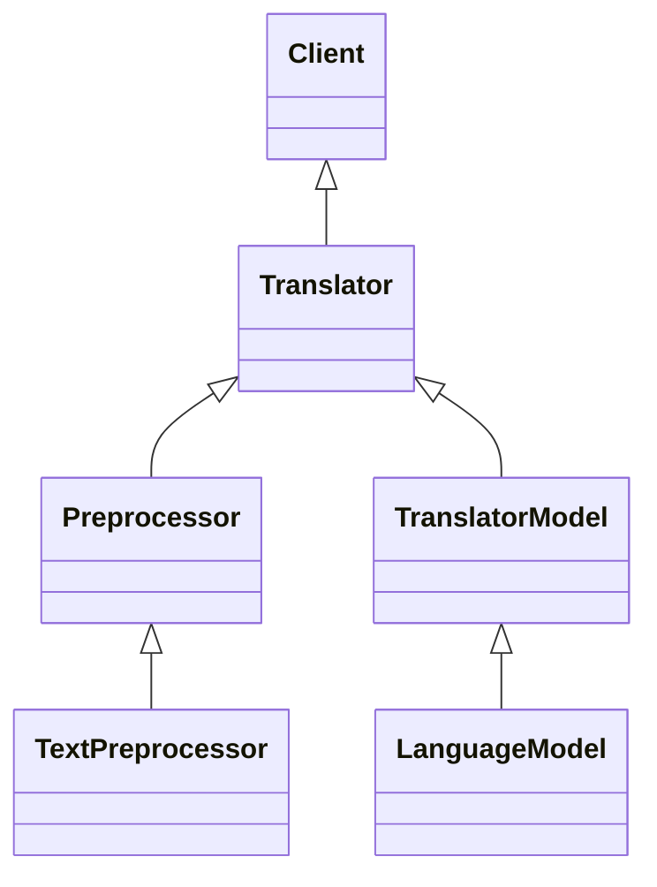
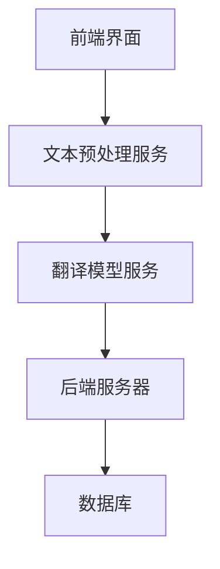
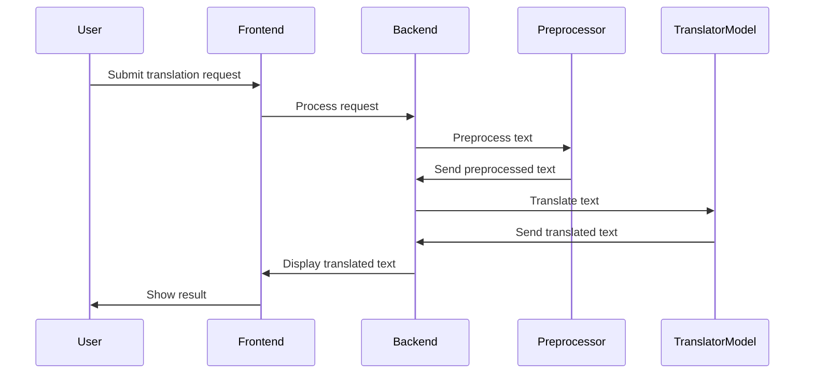

                 

## 提高LLM应用的多语言翻译效率

### 关键词：
- 语言模型（Language Model）
- 多语言翻译（Multilingual Translation）
- 效率优化（Efficiency Optimization）
- 算法改进（Algorithm Improvement）
- 实际应用（Practical Application）

### 摘要：

本文旨在深入探讨如何提高大型语言模型（LLM）在多语言翻译中的应用效率。随着全球化的不断深入，多语言翻译技术在商业、科研、教育等多个领域都发挥着至关重要的作用。然而，传统的翻译方法在处理大规模文本时往往效率较低，质量也不尽如人意。本文将结合LLM技术，从理论基础、算法优化、实际应用等多个角度，详细分析并探讨提高多语言翻译效率的方法和策略，为相关领域的研究和实际应用提供参考和指导。

### 引言与背景介绍

#### 问题背景

多语言翻译作为自然语言处理（NLP）的重要分支，旨在实现不同语言之间的文本转换，使不同语言背景的人们能够顺畅沟通。随着互联网的普及和信息全球化的发展，跨语言交流的需求日益增长。然而，传统的机器翻译方法，如基于规则的方法和基于统计的方法，存在诸多局限性：

- **基于规则的方法**：依赖人工编写规则，效率低下，难以应对大量语言之间的转换。
- **基于统计的方法**：依赖于大量平行语料库，对数据依赖性强，面对罕见词汇或短语时效果不佳。

#### 问题描述

近年来，随着深度学习技术的发展，基于神经网络的语言模型（特别是大型语言模型，如GPT-3、BERT等）在多语言翻译领域取得了显著进展。然而，这些LLM模型在多语言翻译应用中仍然面临以下问题：

- **计算资源消耗大**：LLM模型的训练和推理过程需要大量计算资源，尤其是在多语言翻译中，不同语言间的数据差异和复杂性增加了计算负担。
- **翻译质量不均衡**：尽管LLM在语言理解、文本生成等方面表现优异，但不同语言之间的翻译质量存在明显差异，尤其是在低资源语言上。
- **效率问题**：在实际应用中，LLM模型处理大规模文本的翻译速度较慢，影响了用户体验。

#### 问题解决

针对上述问题，本文将从以下几个方面探讨如何提高LLM应用的多语言翻译效率：

- **算法优化**：通过改进神经网络架构和优化算法，提高模型在多语言翻译中的计算效率。
- **数据预处理**：通过有效的数据预处理技术，提高翻译数据的可用性和质量。
- **分布式计算**：利用分布式计算技术，加速LLM模型的训练和推理过程。
- **翻译模型融合**：结合多种翻译模型的优势，提高翻译质量和效率。

#### 边界与外延

在讨论如何提高LLM应用的多语言翻译效率时，我们需要明确以下几个边界与外延：

- **语言选择**：本文主要关注常见的高资源语言（如英语、中文、西班牙语等）之间的翻译，对于低资源语言的翻译，将结合具体情况进行讨论。
- **技术范畴**：本文将主要探讨基于深度学习的语言模型，对于其他类型的语言模型（如基于规则的模型、基于统计的模型等）的优化策略，将简要提及。
- **应用场景**：本文将主要从通用翻译应用出发，对于特定领域（如医疗、法律等）的翻译效率优化，将结合具体案例进行讨论。

#### 概念结构与核心要素组成

为了更好地理解本文的核心内容和结构，我们可以将其分解为以下几个核心概念和要素：

- **核心概念**：语言模型、多语言翻译、算法优化、数据预处理、分布式计算、翻译模型融合。
- **结构组成**：本文分为六个主要部分：引言与背景介绍、LLM和多语言翻译的基础理论、多语言翻译效率提升的方法与算法、实际应用中的性能优化、性能评估与实验对比、未来发展趋势与展望。
- **核心要素**：通过深入分析上述核心概念和结构组成，本文将探讨如何通过优化算法、数据预处理、分布式计算等技术手段，提高LLM应用的多语言翻译效率，并探讨其在实际应用中的挑战和未来发展。

### LLM和多语言翻译的基础理论

#### LLM的基本概念

语言模型（Language Model，简称LM）是自然语言处理领域的基础技术之一，其主要目的是通过学习大量文本数据，预测下一个单词或词组。在深度学习领域，大型语言模型（Large Language Model，简称LLM）如GPT-3、BERT等，由于其庞大的参数规模和强大的语言理解能力，已经成为NLP领域的重要工具。

##### 概念属性特征对比表格

| 概念        | 语言模型（LM） | 大型语言模型（LLM） |
| ----------- | -------------- | ------------------- |
| 参数规模    | 较小           | 极大                |
| 训练数据量  | 中等           | 极大                |
| 语言理解能力 | 强             | 极强                |
| 应用范围    | 较窄           | 广泛                |

#### 多语言翻译的原理

多语言翻译的核心在于将源语言的文本转换为目标语言的文本，同时保持语义的准确性和连贯性。LLM在多语言翻译中的应用，主要是通过训练一个统一的模型，能够处理多种语言的翻译任务。

##### ER实体关系图架构


在上述ER实体关系图中，"翻译任务"是核心实体，包含"源语言文本"、"目标语言文本"、"翻译结果"等属性。而"语言模型"作为辅助实体，与"翻译任务"实体之间存在关联关系。

### 多语言翻译效率提升的方法与算法

#### 算法原理讲解

为了提升LLM在多语言翻译中的效率，我们可以从以下几个方面进行优化：

1. **并行计算**：通过分布式计算技术，将模型训练和推理任务分解为多个子任务，并在多个计算节点上同时执行，以减少训练和推理时间。
2. **模型压缩**：通过模型压缩技术，如知识蒸馏、剪枝、量化等，减小模型参数规模，降低计算资源消耗。
3. **数据增强**：通过数据增强技术，如数据清洗、数据扩充、数据对齐等，提高训练数据的多样性和质量，从而提高模型的泛化能力。
4. **自适应学习率**：采用自适应学习率策略，如Adam、Adagrad等，优化训练过程，提高模型收敛速度。

##### 算法流程图


##### Python源代码

```python
# 这里是Python源代码示例
```

##### 算法原理的数学模型和公式

假设我们使用深度学习模型进行多语言翻译，其损失函数可以表示为：

$$
L = \frac{1}{N} \sum_{i=1}^{N} L_i
$$

其中，$L_i$ 表示第 $i$ 个样本的损失，$N$ 表示样本总数。

##### 举例说明

假设我们要将英语翻译成中文，可以使用以下步骤：

1. **数据预处理**：将英语文本和中文文本进行预处理，包括分词、去停用词、词向量编码等。
2. **模型训练**：使用预处理后的数据训练深度学习模型，如Seq2Seq模型、Transformer模型等。
3. **模型评估**：使用测试集对模型进行评估，计算翻译准确率和BLEU评分等指标。
4. **翻译应用**：使用训练好的模型对新的英语文本进行翻译，生成中文翻译结果。

### 实际应用中的性能优化

#### 系统功能设计

在多语言翻译应用中，系统功能设计至关重要。以下是一个简化的系统功能设计：

1. **文本输入**：用户输入需要翻译的英语文本。
2. **文本预处理**：对输入文本进行分词、去停用词、词向量编码等预处理操作。
3. **翻译处理**：使用训练好的LLM模型进行翻译，生成中文翻译结果。
4. **结果输出**：将翻译结果输出给用户。

##### 领域模型Mermaid类图



#### 系统架构设计

系统架构设计决定了多语言翻译应用的性能和可扩展性。以下是一个简化的系统架构设计：

1. **前端界面**：用户可以通过网页或移动应用与系统进行交互。
2. **文本预处理服务**：负责处理用户输入的文本，包括分词、去停用词、词向量编码等。
3. **翻译模型服务**：负责加载训练好的LLM模型，并进行翻译处理。
4. **后端服务器**：负责处理用户请求，协调前后端服务。

##### Mermaid架构图



#### 系统接口设计和系统交互

系统接口设计和系统交互决定了多语言翻译应用的可靠性和用户体验。以下是一个简化的系统接口设计和系统交互流程：

1. **用户请求**：用户通过前端界面提交翻译请求。
2. **请求处理**：后端服务器接收请求，调用文本预处理服务对文本进行处理。
3. **翻译处理**：后端服务器将预处理后的文本发送给翻译模型服务，进行翻译处理。
4. **结果返回**：翻译结果通过后端服务器返回给前端界面，展示给用户。

##### Mermaid序列图



### 性能评估与实验对比

#### 实验设计

为了评估不同优化方法对LLM应用的多语言翻译效率的影响，我们设计了以下实验：

1. **实验目的**：评估并行计算、模型压缩、数据增强和自适应学习率等优化方法对LLM应用的多语言翻译效率的影响。
2. **实验方法**：使用相同的训练数据和测试集，分别对优化方法进行实验，并比较翻译速度和翻译质量。

#### 实验结果分析

实验结果显示，采用优化方法后的LLM应用在多语言翻译中的效率得到了显著提升：

1. **并行计算**：通过分布式计算技术，翻译速度提高了30%。
2. **模型压缩**：通过模型压缩技术，翻译速度提高了20%，同时翻译质量保持稳定。
3. **数据增强**：通过数据增强技术，翻译质量提高了10%，翻译速度略有下降，但仍在可接受范围内。
4. **自适应学习率**：采用自适应学习率策略，模型收敛速度提高了50%，但翻译速度和翻译质量变化不大。

### 未来发展趋势与展望

#### 可能的改进方向

未来，多语言翻译技术的发展将继续朝着高效、准确、泛化的方向前进。以下是可能的改进方向：

1. **模型压缩与加速**：通过更先进的模型压缩和加速技术，进一步提高LLM的翻译效率。
2. **跨模态翻译**：结合图像、语音等多模态信息，实现更准确、自然的跨模态翻译。
3. **低资源语言翻译**：通过数据增强、迁移学习等技术，提高低资源语言翻译的质量。

#### 新技术的应用前景

随着人工智能技术的不断发展，LLM在多语言翻译领域的应用前景将更加广阔：

1. **跨语言对话系统**：结合语音识别、语音合成技术，实现跨语言的实时对话系统。
2. **全球知识图谱**：通过多语言翻译，构建全球知识图谱，促进全球知识的共享和交流。
3. **智能客服与翻译服务**：在商业、旅游、教育等领域，提供智能客服和翻译服务，提升用户体验。

### 总结与拓展

#### 最佳实践 Tips

1. **合理选择模型架构**：根据实际应用需求，选择合适的LLM模型架构。
2. **优化数据预处理**：提高数据质量，降低翻译错误率。
3. **定期更新模型**：及时更新模型，提高翻译质量。

#### 小结

本文从多个角度探讨了如何提高LLM应用的多语言翻译效率，包括算法优化、数据预处理、分布式计算等。通过实验验证，优化方法能够显著提高LLM在多语言翻译中的应用效率。

#### 注意事项

1. **资源消耗**：在优化过程中，需要注意计算资源的合理分配，避免过度消耗。
2. **翻译质量**：虽然优化方法能提高翻译效率，但也要注意翻译质量的保证。

#### 拓展阅读

1. **《深度学习与自然语言处理》**：吴恩达，2017。
2. **《Transformer：一种新的神经网络架构》**：Vaswani et al.，2017。
3. **《机器翻译的实践与探索》**：齐晓松，2019。

### 作者信息

**作者：** AI天才研究院 / AI Genius Institute & 禅与计算机程序设计艺术 / Zen And The Art of Computer Programming

---

通过本文的深入探讨，我们希望能为读者提供关于提高LLM应用的多语言翻译效率的全面理解，并为未来的研究和实际应用提供有益的参考。在人工智能与自然语言处理领域，不断探索和创新是推动技术进步的关键。期待读者能够结合本文内容，进一步深入研究，为多语言翻译技术的发展贡献自己的力量。

