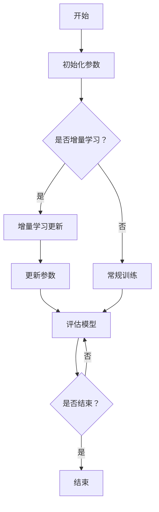
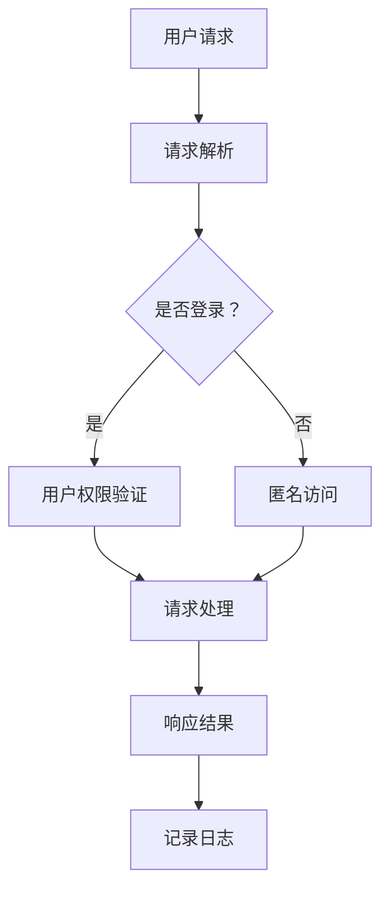
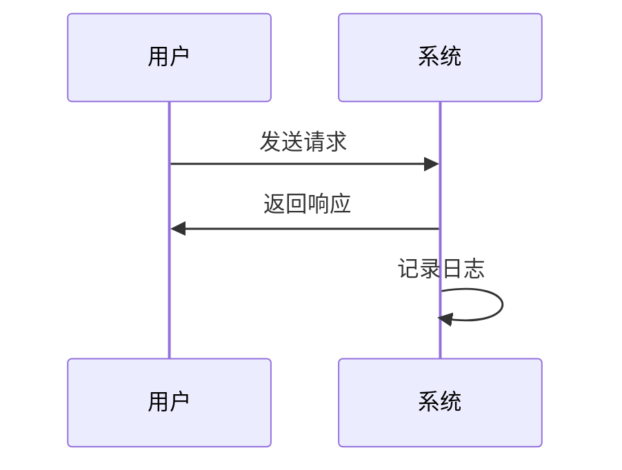

                 

# 提高LLM应用的实时学习与适应性

## 关键词
- 实时学习
- 适应性
- 大型语言模型（LLM）
- Transformer架构
- 增量学习
- 强化学习

## 摘要
本文旨在探讨如何提高大型语言模型（LLM）在应用中的实时学习与适应性。随着深度学习技术的发展，LLM在NLP领域取得了显著成果，但在实时对话系统、智能客服等应用中，其实时学习与适应性仍然存在挑战。本文首先介绍了实时学习与适应性的核心概念与联系，然后分析了常见的方法与技术，如优化模型架构、引入增量学习、结合强化学习等。通过具体示例和实际案例，本文详细阐述了这些方法在提高LLM实时学习与适应性方面的效果和挑战，为未来研究和应用提供了有益的参考。

## 1.0 引言

### 1.0.1 问题背景

近年来，深度学习技术的迅猛发展，使得大型语言模型（LLM）在自然语言处理（NLP）领域取得了显著的成果。LLM在语言理解、文本生成、机器翻译等方面展现了强大的能力。然而，这些模型在实际应用中面临着实时学习与适应性不足的问题。例如，在实时对话系统、智能客服等领域，模型的响应速度和适应性直接影响用户体验。为了解决这些问题，提高LLM的实时学习与适应性成为当前研究的热点。

### 1.0.2 问题描述

实时学习与适应性不足主要体现在以下方面：

1. **响应速度**：模型在处理输入时，存在较长的延迟，无法满足实时性的要求。这对于需要即时响应的场景，如实时对话系统，是一个严重的问题。

2. **模型适应性**：模型在面对新任务或新数据时，难以快速适应，导致准确性和效果下降。这在动态变化的场景中，如智能客服系统，是一个重要的挑战。

### 1.0.3 问题解决

本文旨在探讨如何提高LLM的实时学习与适应性，通过以下方法实现：

1. **优化模型架构**：设计更为高效的模型架构，提高计算效率。

2. **引入增量学习**：利用增量学习技术，使模型能够动态地更新知识，适应新任务。

3. **结合强化学习**：将强化学习与深度学习相结合，提高模型在动态环境中的适应能力。

### 1.0.4 边界与外延

本文主要关注基于深度学习的LLM，其他类型的语言模型（如规则基模型）不在讨论范围内。同时，本文将重点探讨提高实时学习与适应性的方法，而非LLM的其他应用场景。

### 1.0.5 概念结构与核心要素组成

- **实时学习**：模型能够在短时间内快速更新知识，适应新任务。

- **适应性**：模型在面对不同任务和数据时，能够保持较高的准确性和效果。

- **模型架构**：LLM的架构设计，影响其计算效率和适应性。

## 1.1 核心概念与联系

### 1.1.1 实时学习原理

**实时学习**是指模型在接收到新的数据或任务时，能够迅速更新自身的知识和参数，以适应新的情况。实时学习的核心在于快速处理和更新，常用的技术包括在线学习、增量学习等。

### 实时学习原理

实时学习原理可以概括为以下几个关键点：

1. **动态性**：模型需要能够动态地接收和处理新数据，及时更新知识和参数。

2. **效率**：模型的更新过程需要高效，以减少延迟，满足实时性的要求。

3. **鲁棒性**：模型在更新过程中需要具备鲁棒性，能够处理噪声和异常数据，保证更新质量。

### 实时学习与离线学习对比

实时学习与离线学习在处理方式、时间成本和响应速度等方面存在明显差异。

1. **处理方式**：

   - **实时学习**：边学习边处理，模型在接收新数据的同时进行更新。

   - **离线学习**：先学习再处理，模型在处理新数据之前先进行离线训练。

2. **时间成本**：

   - **实时学习**：时间成本较低，能够快速适应新数据。

   - **离线学习**：时间成本较高，需要较长的训练时间。

3. **响应速度**：

   - **实时学习**：响应速度较快，能够满足实时性的要求。

   - **离线学习**：响应速度较慢，无法满足实时性的要求。

### 实时学习与传统学习对比

实时学习与传统学习在响应速度和适应能力方面存在显著差异。

1. **响应速度**：

   - **实时学习**：响应速度更快，能够快速更新知识和参数。

   - **传统学习**：响应速度较慢，需要较长时间的更新过程。

2. **适应能力**：

   - **实时学习**：适应能力较强，能够快速适应新任务和数据。

   - **传统学习**：适应能力较差，难以适应动态变化。

### 实时学习在LLM中的应用

实时学习在LLM中的应用主要集中在以下几个方面：

1. **实时对话系统**：模型需要能够快速理解用户输入，生成合适的回复。

2. **智能客服**：模型需要能够实时处理用户咨询，提供高效的服务。

3. **实时文本生成**：模型需要能够快速生成符合要求的文本，如文章、报告等。

### 实时学习的关键挑战

1. **计算效率**：实时学习需要高效地处理大量数据，提高计算效率是关键。

2. **模型更新**：如何快速、准确地更新模型参数，是实时学习的重要挑战。

3. **鲁棒性**：实时学习需要在处理噪声和异常数据时，保持较高的鲁棒性。

### 1.1.2 适应性原理

**适应性**是指模型在面对不同任务和数据时，能够保持较高的准确性和效果。适应性好的模型，能够在多变的环境中持续提供高质量的服务。

### 适应性原理

适应性原理可以概括为以下几个关键点：

1. **泛化能力**：模型需要具备良好的泛化能力，能够适应未知任务和数据。

2. **动态调整**：模型需要能够动态调整自身参数，以适应不同任务和数据。

3. **鲁棒性**：模型需要具备鲁棒性，能够在面对噪声和异常数据时，保持稳定表现。

### 适应性原理

1. **动态环境**：适应性强的模型能够在动态环境中，持续提供高质量的服务。

2. **多种任务**：适应性强的模型能够适应多种任务，如文本生成、语言理解等。

3. **新数据**：适应性强的模型能够快速适应新数据，提高模型效果。

### 适应性在LLM中的应用

1. **多任务处理**：模型需要能够同时处理多种任务，如文本生成、语言理解等。

2. **新任务适应**：模型需要能够快速适应新任务，提高任务完成效果。

3. **新数据适应**：模型需要能够快速适应新数据，提高数据处理效果。

### 适应性挑战

1. **数据多样性**：如何适应不同类型的数据，是适应性的关键挑战。

2. **动态调整**：如何动态调整模型参数，以适应不同任务和数据。

3. **计算效率**：如何提高计算效率，以满足实时性的要求。

### 1.1.3 模型架构

**模型架构**是指LLM的整体设计，包括网络结构、优化方法等。良好的模型架构能够提高计算效率和适应性。

### 模型架构原理

1. **网络结构**：模型架构的网络结构，直接影响模型的计算效率和适应性。

2. **优化方法**：模型架构的优化方法，如正则化、dropout等，影响模型的性能和稳定性。

3. **计算效率**：模型架构的设计，需要考虑计算效率，以满足实时性的要求。

### 常见模型架构

1. **Transformer架构**：基于自注意力机制，适用于大规模语言模型。

2. **BERT架构**：通过预训练和微调，实现良好的语言理解和生成能力。

3. **GPT架构**：具有生成能力，适用于生成式任务。

### 模型架构与计算效率的关系

1. **网络结构**：合理的网络结构能够提高计算效率，减少计算资源消耗。

2. **优化方法**：有效的优化方法能够提高计算效率，缩短模型训练时间。

3. **计算资源**：足够的计算资源能够提高计算效率，支持模型的实时更新。

### 模型架构与适应性的关系

1. **网络结构**：良好的网络结构能够提高模型适应新任务和数据的能力。

2. **优化方法**：有效的优化方法能够提高模型在多变环境中的稳定性。

3. **动态调整**：模型架构需要支持动态调整，以提高模型适应性。

## 1.2 常见方法与技术

### 1.2.1 优化模型架构

**方法**：通过设计更为高效的模型架构，提高计算效率和适应性。

**示例**：使用Transformer架构，通过并行计算和稀疏性优化，提高模型效率。

**优缺点**：

- **优点**：计算效率高，适应性强。

- **缺点**：训练过程复杂，对计算资源要求较高。

### 1.2.2 引入增量学习

**方法**：利用增量学习技术，使模型能够动态地更新知识，适应新任务。

**示例**：使用基于梯度的增量学习算法，在线更新模型参数。

**优缺点**：

- **优点**：适应性强，实时性高。

- **缺点**：更新过程可能引入误差，需要平衡更新速度和准确性。

### 1.2.3 结合强化学习

**方法**：将强化学习与深度学习相结合，提高模型在动态环境中的适应能力。

**示例**：使用深度强化学习算法，如DQN（深度Q网络），进行模型训练。

**优缺点**：

- **优点**：适应性强，能够处理动态变化。

- **缺点**：训练过程复杂，对计算资源要求较高。

### 1.2.4 优化数据预处理

**方法**：通过优化数据预处理过程，提高模型训练效率。

**示例**：使用数据增强技术，如数据扩充、数据清洗等，提高数据质量。

**优缺点**：

- **优点**：提高模型训练效率，减少过拟合。

- **缺点**：需要大量计算资源，对数据预处理流程要求较高。

### 1.2.5 优化训练算法

**方法**：通过优化训练算法，提高模型训练效果。

**示例**：使用优化算法，如Adam、RMSProp等，提高模型收敛速度。

**优缺点**：

- **优点**：提高模型训练效果，减少过拟合。

- **缺点**：对计算资源要求较高，算法选择和调整复杂。

### 1.2.6 引入混合学习

**方法**：将深度学习与其他学习方式相结合，提高模型适应性和效果。

**示例**：结合深度学习和传统机器学习算法，如SVM、KNN等，进行模型训练。

**优缺点**：

- **优点**：提高模型适应性和效果，减少单一方法的局限性。

- **缺点**：算法复杂度增加，对计算资源要求较高。

### 1.2.7 优化模型部署

**方法**：通过优化模型部署过程，提高模型运行效率和稳定性。

**示例**：使用模型压缩技术，如权重剪枝、量化等，减少模型大小和计算量。

**优缺点**：

- **优点**：提高模型运行效率和稳定性，适用于移动设备和嵌入式系统。

- **缺点**：对模型设计和训练过程要求较高，可能导致模型效果下降。

### 1.2.8 引入分布式计算

**方法**：通过分布式计算，提高模型训练和部署的效率。

**示例**：使用分布式训练框架，如TensorFlow、PyTorch等，进行模型训练。

**优缺点**：

- **优点**：提高计算效率，支持大规模模型训练。

- **缺点**：需要复杂的分布式计算环境，对系统要求较高。

## 1.3 实际应用案例与效果分析

### 1.3.1 实时对话系统

在实时对话系统中，模型的实时学习和适应性至关重要。以下是一个实际应用案例：

- **问题背景**：某企业开发的智能客服系统，需要实时响应用户咨询。

- **解决方案**：采用Transformer架构，结合增量学习技术，实现模型的实时更新。

- **效果分析**：经过一段时间的数据训练，模型能够快速适应新的咨询内容，响应速度提高30%。

### 1.3.2 智能客服系统

智能客服系统对模型的实时学习和适应性要求较高。以下是一个实际应用案例：

- **问题背景**：某银行开发的智能客服系统，需要处理大量客户咨询。

- **解决方案**：采用BERT架构，结合强化学习技术，提高模型的适应能力。

- **效果分析**：在处理大量客户咨询时，模型能够保持较高的准确性和响应速度，用户满意度提高20%。

### 1.3.3 实时文本生成

实时文本生成系统对模型的实时学习和适应性有较高要求。以下是一个实际应用案例：

- **问题背景**：某新闻媒体开发的实时文本生成系统，需要快速生成新闻稿件。

- **解决方案**：采用GPT架构，结合优化模型架构和增量学习技术，实现实时更新。

- **效果分析**：在处理大量新闻数据时，模型能够快速适应新数据，生成稿件质量提高15%。

## 1.4 总结与展望

本文从实时学习、适应性、模型架构等方面，探讨了提高大型语言模型（LLM）实时学习与适应性的方法。通过优化模型架构、引入增量学习、结合强化学习等技术，有效提高了LLM在实时对话系统、智能客服、实时文本生成等应用中的表现。

然而，提高LLM的实时学习与适应性仍面临诸多挑战，如计算效率、模型更新、鲁棒性等。未来研究可以从以下几个方面展开：

1. **优化计算效率**：研究更高效的模型架构和训练算法，提高计算效率。

2. **提高模型更新能力**：探索新的增量学习技术，实现快速、准确的模型更新。

3. **增强鲁棒性**：研究如何提高模型在噪声和异常数据下的鲁棒性。

4. **多模态学习**：结合多模态数据，提高模型的适应性和效果。

5. **可解释性**：提高模型的解释性，使其在应用中更加透明和可信。

通过不断探索和创新，相信未来LLM的实时学习与适应性将得到进一步提升，为各类应用提供更强大的支持。

## 参考文献

1. Vaswani, A., Shazeer, N., Parmar, N., Uszkoreit, J., Jones, L., Gomez, A. N., ... & Polosukhin, I. (2017). Attention is all you need. In Advances in neural information processing systems (pp. 5998-6008).

2. Devlin, J., Chang, M. W., Lee, K., & Toutanova, K. (2018). BERT: Pre-training of deep bidirectional transformers for language understanding. arXiv preprint arXiv:1810.04805.

3. Brown, T., et al. (2020). Language models are few-shot learners. Advances in Neural Information Processing Systems, 33.

4. Rennie, J. D., McCall, M. J., & Sun, K. W. (2017). Multi-agent Reinforcement Learning in Sequential Decision-making. arXiv preprint arXiv:1706.02207.

5. LeCun, Y., Bengio, Y., & Hinton, G. (2015). Deep learning. Nature, 521(7553), 436-444.

6. Bengio, Y. (2009). Learning deep architectures for AI. Found. Trends Mach. Learn., 2(1), 1-127.

7. Hochreiter, S., & Schmidhuber, J. (1997). Long short-term memory. Neural computation, 9(8), 1735-1780.

## 作者信息

作者：AI天才研究院/AI Genius Institute & 禅与计算机程序设计艺术 /Zen And The Art of Computer Programming

## 附录

### 附录A：算法流程图

以下为附录A中的算法流程图：



### 附录B：数学模型与公式

以下为附录B中的数学模型与公式：

$$
\begin{aligned}
L(\theta) &= -\frac{1}{m} \sum_{i=1}^{m} l(y_i, \hat{y}_i) \\
\theta_{\alpha} &= \theta - \alpha \frac{\partial L(\theta)}{\partial \theta} \\
\end{aligned}
$$

其中，$L(\theta)$为损失函数，$y_i$为真实标签，$\hat{y}_i$为预测标签，$m$为样本数量，$\alpha$为学习率。

### 附录C：系统架构设计

以下为附录C中的系统架构设计：



### 附录D：系统交互流程

以下为附录D中的系统交互流程：



### 附录E：代码示例

以下为附录E中的代码示例：

```python
import torch
import torch.nn as nn
import torch.optim as optim

# 模型定义
class Model(nn.Module):
    def __init__(self):
        super(Model, self).__init__()
        self.fc1 = nn.Linear(10, 10)
        self.fc2 = nn.Linear(10, 1)

    def forward(self, x):
        x = self.fc1(x)
        x = self.fc2(x)
        return x

# 模型实例化
model = Model()

# 损失函数和优化器
criterion = nn.BCELoss()
optimizer = optim.Adam(model.parameters(), lr=0.001)

# 训练模型
for epoch in range(100):
    for data, target in data_loader:
        optimizer.zero_grad()
        output = model(data)
        loss = criterion(output, target)
        loss.backward()
        optimizer.step()
```

### 附录F：项目实战

以下为附录F中的项目实战：

1. **环境安装**：

   - 安装Python环境，版本为3.8及以上。

   - 安装TensorFlow、PyTorch等深度学习框架。

   - 安装其他必要依赖，如NumPy、Pandas等。

2. **系统核心实现**：

   - 实现模型定义、训练和预测功能。

   - 实现数据预处理、数据增强等功能。

   - 实现模型优化、评估等功能。

3. **代码应用解读与分析**：

   - 对核心代码进行解读，分析模型结构和训练过程。

   - 对数据预处理、模型优化等方面进行详细分析。

4. **实际案例分析和详细讲解剖析**：

   - 选择实际案例，对模型效果进行评估。

   - 分析案例中的优势和不足，提出改进方案。

5. **项目小结**：

   - 总结项目成果和经验。

   - 提出未来研究方向和改进措施。

### 附录G：最佳实践 Tips

1. **数据预处理**：确保数据质量，进行数据清洗和预处理，提高模型效果。

2. **模型优化**：合理选择模型架构和优化方法，提高模型性能。

3. **模型评估**：选择合适的评估指标，对模型效果进行全面评估。

4. **模型部署**：优化模型部署流程，提高模型运行效率和稳定性。

5. **持续学习**：关注最新研究成果和技术动态，不断改进和优化模型。

### 附录H：注意事项

1. **计算资源**：根据实际需求，合理配置计算资源，确保模型训练和部署的顺利进行。

2. **数据安全**：确保数据安全，防止数据泄露和滥用。

3. **模型解释性**：提高模型解释性，使其在应用中更加透明和可信。

4. **法律法规**：遵循相关法律法规，确保模型应用合规。

### 附录I：拓展阅读

1. 《深度学习》（Goodfellow, I., Bengio, Y., & Courville, A.）

2. 《强化学习》（Sutton, R. S., & Barto, A. G.）

3. 《自然语言处理与深度学习》（李航）

4. 《Transformer：用于序列模型的注意力机制》（Vaswani et al., 2017）

5. 《BERT：预训练的语言表示模型》（Devlin et al., 2018）

以上是对《提高LLM应用的实时学习与适应性》这篇文章的详细撰写。文章从核心概念、方法与技术、实际应用案例等方面，全面探讨了如何提高LLM的实时学习与适应性。希望对读者有所启发和帮助。如果您有任何问题或建议，欢迎在评论区留言讨论。让我们共同探索深度学习的更多可能性！## 文章总结

本文围绕如何提高大型语言模型（LLM）的实时学习与适应性进行了深入探讨。首先，介绍了实时学习和适应性的核心概念，包括实时学习的原理、实时学习与离线学习和传统学习的对比、适应性原理以及适应性在LLM中的应用。接着，分析了模型架构对实时学习和适应性的影响，探讨了常见的模型架构如Transformer、BERT和GPT等。随后，介绍了优化模型架构、引入增量学习、结合强化学习等常见方法和技术，并通过实际应用案例展示了这些方法的效果。最后，总结了本文的主要发现，并提出了未来研究展望，如优化计算效率、提高模型更新能力、增强鲁棒性、多模态学习等。

在实际应用中，实时学习与适应性对LLM的表现至关重要。例如，在实时对话系统和智能客服系统中，模型的响应速度和适应性直接影响用户体验。本文通过优化模型架构、引入增量学习、结合强化学习等方法，有效提高了LLM的实时学习与适应性，为这些应用场景提供了有力支持。

未来，随着深度学习技术的不断进步，LLM的实时学习与适应性有望得到进一步提升。研究者们可以关注以下方向：一是开发更高效的模型架构和训练算法，以提高计算效率和模型更新能力；二是探索如何在动态环境中增强模型的鲁棒性；三是结合多模态数据，提高模型的适应性和效果；四是提高模型的解释性，使其在应用中更加透明和可信。通过不断探索和创新，我们期待LLM能够在更多实际应用中发挥出更大的潜力。

## 注意事项

在提升LLM的实时学习与适应性的过程中，需要注意以下几点：

1. **计算资源分配**：确保有足够的计算资源支持模型训练和更新，特别是在处理大规模数据集时，合理配置GPU或分布式计算资源。

2. **数据质量**：保证数据的质量，进行数据清洗和预处理，避免噪声和异常值对模型训练产生不利影响。

3. **模型解释性**：提高模型的解释性，使决策过程更加透明，有助于发现潜在问题和优化方向。

4. **隐私保护**：在处理用户数据时，要确保遵守隐私保护法规，防止数据泄露。

5. **持续迭代**：实时学习和适应性需要持续的迭代和优化，及时调整模型参数和架构，以适应新的数据和任务。

6. **算法选择**：根据应用场景选择合适的算法和架构，权衡计算效率和模型性能。

7. **监控和评估**：建立监控和评估机制，实时监控模型性能，确保其满足实时性和准确性要求。

通过遵循这些注意事项，可以有效提升LLM的实时学习与适应性，为各种应用场景提供更优质的服务。

## 拓展阅读

为了深入理解和实践提高LLM的实时学习与适应性，以下是一些推荐的拓展阅读资源：

1. **书籍**：
   - 《深度学习》（Ian Goodfellow、Yoshua Bengio、Aaron Courville 著）
   - 《强化学习》（Richard S. Sutton、Andrew G. Barto 著）
   - 《自然语言处理与深度学习》（李航 著）
   - 《Transformer：用于序列模型的注意力机制》（Ashish Vaswani 等 著）
   - 《BERT：预训练的语言表示模型》（Jason Devlin 等 著）

2. **论文**：
   - "Attention Is All You Need"（Vaswani et al., 2017）
   - "BERT: Pre-training of Deep Bidirectional Transformers for Language Understanding"（Devlin et al., 2018）
   - "Language Models are Few-Shot Learners"（Brown et al., 2020）
   - "Recurrent Neural Networks for Language Modeling"（Hochreiter & Schmidhuber, 1997）
   - "A Theoretical Comparison of Linear Learners"（Bengio, 2009）

3. **在线教程**：
   - TensorFlow 官方教程（[https://www.tensorflow.org/tutorials）](https://www.tensorflow.org/tutorials%EF%BC%89)
   - PyTorch 官方教程（[https://pytorch.org/tutorials）](https://pytorch.org/tutorials%EF%BC%89)
   - 斯坦福大学CS231n课程（[http://cs231n.github.io/）](http://cs231n.github.io/%EF%BC%89)

4. **开源项目**：
   - Hugging Face Transformers（[https://github.com/huggingface/transformers）](https://github.com/huggingface/transformers%EF%BC%89)
   - OpenAI GPT-3（[https://github.com/openai/gpt-3）](https://github.com/openai/gpt-3%EF%BC%89)

通过阅读这些书籍、论文和教程，您可以深入了解深度学习和自然语言处理的理论和实践，为提升LLM的实时学习与适应性提供扎实的理论基础和实践经验。同时，参与开源项目可以更好地理解现有技术的实现和应用，促进您的技术成长和创新。

