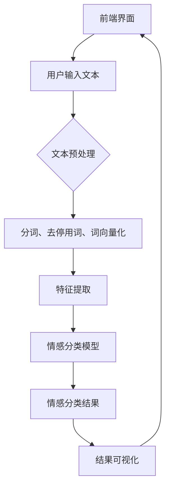
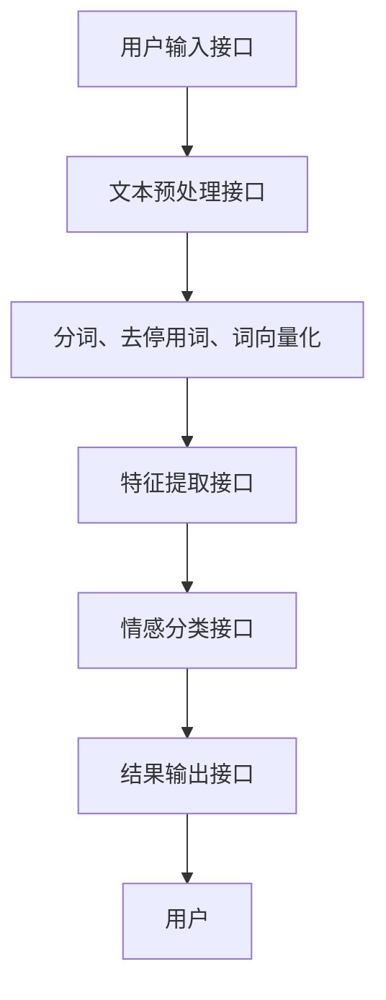
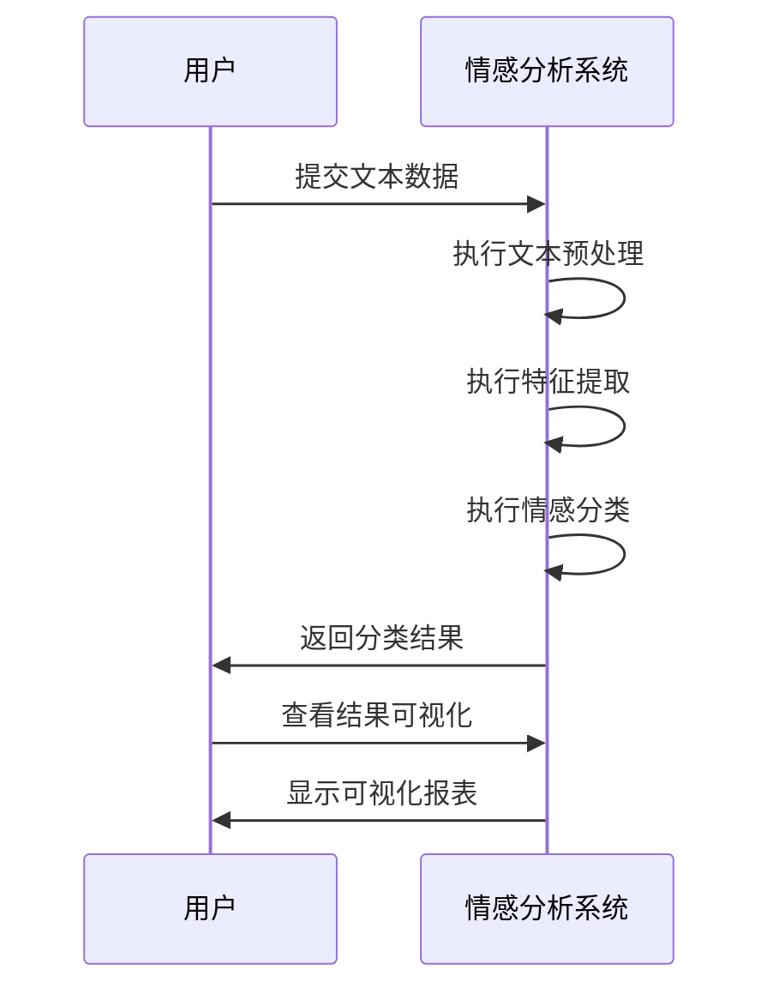

                 

### 第1章：问题背景与定义

### 1.1 问题背景

#### 情感分析的重要性

情感分析，又称为意见挖掘或情感归类，是自然语言处理（NLP）领域的一个关键任务。其核心目的是通过分析文本数据，识别出文本中表达的情感倾向，如正面、负面或中性。随着社交媒体和电子商务的兴起，情感分析的应用场景越来越广泛。例如，品牌可以通过情感分析了解消费者对其产品的评价，政府可以利用情感分析监测公众的情绪，研究人员则通过情感分析挖掘文本中的深层次情感信息。

#### LLM在情感分析中的应用

近年来，大型语言模型（LLM）如BERT、GPT和Turing等在自然语言处理领域取得了显著成就。LLM通过深度学习技术从海量文本数据中学习语言规律，从而实现对文本的生成、理解和翻译。在情感分析任务中，LLM被广泛应用于情感倾向判断、情感极性分类、情感强度评估等多个子任务。

然而，尽管LLM在情感分析中展现了强大的能力，但仍然面临着一系列挑战。首先，情感表达的多样性和复杂性使得LLM难以准确捕捉。不同的语境、隐含意义、文化背景等都可能影响情感分析的准确性。其次，LLM的训练数据质量和标注准确性直接影响到模型的性能。如果训练数据存在偏差或标注不准确，那么LLM的情感分析结果也可能受到影响。

#### 当前LLM在情感分析任务中面临的挑战

1. **情感表达的复杂性**：
   - 文本中的情感表达可能非常复杂，如双关语、隐喻和讽刺等，这些都需要模型具有深入的理解能力。
   - LLM在面对复杂情感表达时，可能无法准确识别情感极性或强度。

2. **数据偏差**：
   - 训练数据可能存在偏差，导致模型对某些情感类型的分类能力较弱。
   - 数据标注的准确性直接影响模型的训练效果。

3. **情感强度的判断**：
   - 对情感强度的判断往往需要考虑情感词的频率、语境和上下文等，这使得LLM难以准确判断情感强度。

4. **跨语言和跨文化的情感分析**：
   - 不同语言和文化背景下的情感表达存在差异，这增加了跨语言和跨文化情感分析的复杂性。

### 1.2 问题描述

情感分析准确性问题主要体现在以下几个方面：

- **分类准确性**：模型对情感极性的分类准确度不够高，导致正面、负面和中和情感的判断不准确。
- **情感强度判断**：模型对情感强度的判断存在偏差，无法准确反映文本中情感表达的强烈程度。
- **多语言和多文化**：不同语言和文化背景下，情感表达的差异使得模型难以进行有效的情感分析。

### 1.3 问题解决

为了提高LLM在情感分析任务中的准确度，我们可以从以下几个方面入手：

- **数据质量**：收集高质量、多样化的训练数据，确保数据的代表性和多样性。
- **模型优化**：通过调整模型结构、参数和训练策略，提升模型在情感分析任务中的性能。
- **特征工程**：设计有效的特征提取方法，帮助模型更好地捕捉文本中的情感信息。
- **上下文理解**：增强模型对上下文的理解能力，以减少情感分析的歧义。

### 1.4 边界与外延

本研究的范围主要集中在大型语言模型（LLM）在情感分析任务中的应用，重点关注如何提高模型的准确度。研究的边界包括：

- **数据范围**：数据主要来自于公共文本数据集，如Twitter、新闻评论等。
- **模型范围**：研究主要针对目前流行的LLM模型，如BERT、GPT等。
- **任务范围**：研究主要集中在情感极性分类和情感强度判断。

### 1.5 概念结构与核心要素组成

#### LLM基本概念

- **定义**：LLM是通过深度学习技术从海量文本数据中学习语言规律的模型。
- **作用**：LLM在情感分析任务中，可以用于情感极性分类、情感强度判断等。
- **组成**：LLM主要由编码器和解码器组成，其中编码器负责将输入文本编码成固定长度的向量，解码器则负责生成输出文本。

#### 情感分析基本概念

- **定义**：情感分析是通过对文本进行情感分类、情感强度判断等，来分析文本中的情感信息。
- **方法**：常见的情感分析方法包括基于规则的方法、机器学习方法、深度学习方法等。
- **挑战**：情感分析的挑战主要在于情感表达的多样性和复杂性。

#### LLM与情感分析的联系

- **应用**：LLM在情感分析中的应用，主要是通过其强大的语言理解能力，对文本进行情感分类和情感强度判断。
- **优势**：LLM的优势在于其能够从海量数据中学习语言规律，从而提高情感分析的准确度。

通过以上章节的介绍，我们为接下来的深入探讨奠定了基础。在接下来的章节中，我们将详细分析LLM的工作原理、情感分析的基本算法、数学模型以及系统架构设计，从而为提高LLM在情感分析中的准确度提供系统化的解决方案。### 第2章：核心概念与原理

在探讨如何提高LLM在情感分析任务中的准确度之前，我们首先需要了解两个核心概念：大型语言模型（LLM）和情感分析的基本原理。通过这两个核心概念的了解，我们可以为后续章节的深入分析奠定基础。

#### 2.1 LLM概述

##### 定义

大型语言模型（Large Language Model，LLM）是一种基于深度学习的语言模型，它通过对海量文本数据的学习，能够对文本进行生成、理解和翻译。LLM的核心思想是通过训练模型来捕捉语言中的统计规律，从而实现对自然语言的复杂理解和生成。

##### 基本原理

LLM的基本原理主要基于深度学习和神经网络。传统的语言模型通常采用循环神经网络（RNN）或其变种长短期记忆网络（LSTM）进行训练，而LLM则采用了更为先进的变换器网络（Transformer）结构。Transformer网络通过自注意力机制（Self-Attention）和多头注意力机制（Multi-Head Attention）能够有效地捕捉文本中的长距离依赖关系，从而提升模型的性能。

##### 发展历程

- **早期的语言模型**：基于统计方法和规则的方法，如n元语法模型。
- **基于神经网络的模型**：如循环神经网络（RNN）和长短期记忆网络（LSTM）。
- **现代语言模型**：如BERT、GPT和Turing，这些模型采用了Transformer结构，具有更强的理解和生成能力。

##### LLM在情感分析中的作用

LLM在情感分析中的作用主要体现在两个方面：

- **文本理解**：LLM能够对输入的文本进行深度理解，捕捉文本中的情感信息，从而提高情感分类的准确性。
- **情感生成**：通过LLM生成与输入文本情感倾向一致的文本，用于测试情感分类模型的泛化能力。

#### 2.2 情感分析原理

##### 定义

情感分析（Sentiment Analysis）是自然语言处理（NLP）的一个任务，旨在通过分析文本数据，识别出文本中表达的情感倾向，如正面、负面或中性。情感分析的主要目标是建立一种模型或算法，能够自动地从文本中提取情感信息。

##### 基本方法

情感分析的基本方法可以分为以下几类：

- **基于规则的方法**：通过编写一系列规则，根据文本中的关键词、情感词等来识别情感极性。
- **基于机器学习的方法**：使用机器学习算法，如朴素贝叶斯、支持向量机（SVM）、随机森林等，对训练数据进行特征提取和模型训练。
- **基于深度学习的方法**：使用深度学习模型，如卷积神经网络（CNN）、循环神经网络（RNN）和变换器网络（Transformer），进行文本的情感分类。

##### 关键技术

- **特征提取**：从文本中提取有助于情感分类的特征，如词频、词向量、词嵌入等。
- **情感分类模型**：训练情感分类模型，如分类器、判别模型等，用于预测文本的情感极性。
- **情感强度判断**：通过分析情感词的频率、位置和上下文，判断情感表达的强度。

##### 情感分析算法的挑战

- **情感表达的多样性**：情感表达可能非常复杂，如双关语、隐喻和讽刺等，这给情感分析带来了挑战。
- **数据标注的偏差**：训练数据的质量直接影响模型的性能，如果数据标注不准确或存在偏差，模型的性能也会受到影响。
- **跨语言和跨文化的情感分析**：不同语言和文化背景下的情感表达存在差异，这增加了跨语言和跨文化情感分析的复杂性。

#### 2.3 LLM与情感分析的联系

##### 应用

LLM在情感分析中的应用主要体现在两个方面：

- **文本理解**：通过LLM的强大语言理解能力，对文本进行深度理解，从而提高情感分类的准确性。
- **情感生成**：通过LLM生成与输入文本情感倾向一致的文本，用于测试情感分类模型的泛化能力。

##### 优势

LLM的优势在于：

- **强大的语言理解能力**：LLM能够从海量数据中学习语言规律，从而对复杂的情感表达进行准确理解和分类。
- **高效的模型结构**：Transformer结构使得LLM能够捕捉文本中的长距离依赖关系，提高模型的性能。

通过以上对LLM和情感分析核心概念与原理的介绍，我们为深入探讨如何提高LLM在情感分析中的准确度奠定了基础。在接下来的章节中，我们将详细分析情感分析算法的原理和实现，以及如何通过数学模型和系统架构设计来进一步提升情感分析的准确性。### 第3章：情感分析算法讲解

在情感分析任务中，算法是实现情感识别的关键。本章将详细介绍几种常见的情感分析算法，包括其原理、实现步骤和优缺点。通过这些算法的讲解，我们将为提高LLM在情感分析中的准确度提供理论支持。

#### 3.1 情感分析算法简介

常见的情感分析算法主要包括以下几种：

1. **基于规则的方法**
2. **基于机器学习的方法**
3. **基于深度学习的方法**

#### 3.2 基于规则的方法

##### 原理

基于规则的方法通过预定义一系列规则来识别文本中的情感极性。这些规则通常基于关键词和短语的情感倾向进行定义，例如，“喜欢”表示正面情感，“讨厌”表示负面情感。

##### 实现步骤

1. **关键词提取**：从文本中提取关键词和短语。
2. **规则匹配**：将提取的关键词和短语与预定义的规则进行匹配。
3. **情感极性判断**：根据规则匹配结果判断文本的情感极性。

##### 优缺点

**优点**：

- **实现简单**：规则方法易于实现和理解。
- **可解释性**：规则方法的决策过程具有可解释性。

**缺点**：

- **灵活性差**：规则方法对情感表达的多样性和复杂性处理能力较差。
- **扩展性差**：需要人工定义规则，随着情感词汇的增加，规则库也会变得庞大。

#### 3.3 基于机器学习的方法

##### 原理

基于机器学习的方法通过训练模型来识别文本中的情感极性。这些模型通常使用特征工程提取文本的特征，然后通过机器学习算法进行训练和预测。

##### 实现步骤

1. **特征提取**：从文本中提取特征，如词频、TF-IDF、词嵌入等。
2. **模型训练**：使用训练数据集训练情感分类模型，如朴素贝叶斯、支持向量机（SVM）、随机森林等。
3. **模型预测**：使用训练好的模型对测试数据进行情感极性分类。

##### 优缺点

**优点**：

- **适应性较强**：机器学习模型可以自动学习文本的特征，适应不同的情感表达方式。
- **泛化能力较强**：经过训练的模型可以在未见过的数据上表现良好。

**缺点**：

- **特征工程复杂**：特征提取过程需要大量的人工干预和调整。
- **模型可解释性较差**：模型内部的决策过程较为复杂，不易解释。

#### 3.4 基于深度学习的方法

##### 原理

基于深度学习的方法通过深度神经网络来学习文本的特征和情感极性。这些方法通常采用卷积神经网络（CNN）、循环神经网络（RNN）和变换器网络（Transformer）等架构。

##### 实现步骤

1. **文本预处理**：对文本进行分词、去停用词、词向量化等预处理操作。
2. **模型训练**：使用预处理的文本数据训练深度学习模型。
3. **模型预测**：使用训练好的模型对测试数据进行情感极性分类。

##### 优缺点

**优点**：

- **性能优异**：深度学习模型能够捕捉文本中的复杂特征和长距离依赖关系，提高分类准确度。
- **自动化特征提取**：深度学习模型能够自动学习文本的特征，减少人工干预。

**缺点**：

- **计算资源需求高**：深度学习模型通常需要大量的计算资源和时间进行训练。
- **模型可解释性较差**：深度学习模型的决策过程较为复杂，不易解释。

#### 3.5 算法对比与选择

在选择情感分析算法时，需要综合考虑算法的性能、实现复杂度和应用场景。以下是对几种算法的对比：

- **基于规则的方法**：适用于规则简单、数据量较小的场景，如简单的产品评论分析。
- **基于机器学习的方法**：适用于中等复杂度的情感分析任务，如社交媒体文本的情感分析。
- **基于深度学习的方法**：适用于复杂度较高的情感分析任务，如新闻文本、学术论文的情感分析。

通过以上对情感分析算法的讲解，我们了解了不同算法的原理和实现步骤。在接下来的章节中，我们将深入探讨如何通过数学模型和系统架构设计来进一步提升情感分析的准确性。### 第4章：数学模型与公式

在情感分析任务中，数学模型和公式是理解和实现算法的核心。本章将详细介绍情感分析中常用的数学模型和公式，包括特征提取、分类模型和损失函数等，并通过Python代码示例对这些模型进行详细讲解。

#### 4.1 数学模型简介

情感分析中的数学模型主要包括以下几个方面：

1. **特征提取模型**：用于从文本中提取有助于情感分类的特征。
2. **分类模型**：用于对文本进行情感分类的模型。
3. **损失函数**：用于评估分类模型性能的指标。

#### 4.2 特征提取模型

##### 1. 词频（TF）

词频（Term Frequency，TF）是文本分析中最基本的特征之一，表示某个词在文本中出现的频率。计算公式如下：

$$
TF(t) = \frac{f(t)}{N}
$$

其中，\( f(t) \) 表示词 \( t \) 在文本中出现的次数，\( N \) 表示文本中所有词的总数。

##### 2. 词频-逆文档频率（TF-IDF）

词频-逆文档频率（Term Frequency-Inverse Document Frequency，TF-IDF）是一种更为复杂的特征提取方法，它结合了词频和词的稀有程度。计算公式如下：

$$
TF-IDF(t, d) = TF(t, d) \times IDF(t, D)
$$

其中，\( TF(t, d) \) 表示词 \( t \) 在文档 \( d \) 中的词频，\( IDF(t, D) \) 表示词 \( t \) 在文档集合 \( D \) 中的逆文档频率，计算公式为：

$$
IDF(t, D) = \log_2 \left( \frac{N}{df(t, D)} \right)
$$

其中，\( N \) 表示文档集合中文档的总数，\( df(t, D) \) 表示词 \( t \) 在文档集合 \( D \) 中出现的文档数。

##### Python代码示例

```python
import numpy as np
from sklearn.feature_extraction.text import TfidfVectorizer

# 示例文本
documents = ["这是一个正面的评论", "这是一个负面的评论"]

# 使用TF-IDF向量器
vectorizer = TfidfVectorizer()

# 计算TF-IDF矩阵
tfidf_matrix = vectorizer.fit_transform(documents)

# 输出TF-IDF矩阵
print(tfidf_matrix.toarray())
```

#### 4.3 分类模型

在情感分析中，分类模型是核心部分。常见的分类模型包括：

1. **朴素贝叶斯（Naive Bayes）**
2. **支持向量机（SVM）**
3. **随机森林（Random Forest）**
4. **变换器网络（Transformer）**

##### 1. 朴素贝叶斯

朴素贝叶斯是一种基于贝叶斯定理的简单分类模型。假设特征之间相互独立，其概率分布可以表示为：

$$
P(\text{正面} | \text{TF-IDF特征}) = \frac{P(\text{正面}) \times P(\text{TF-IDF特征} | \text{正面})}{P(\text{正面}) \times P(\text{TF-IDF特征} | \text{负面})}
$$

##### Python代码示例

```python
from sklearn.naive_bayes import MultinomialNB
from sklearn.model_selection import train_test_split

# 示例特征和标签
X = tfidf_matrix.toarray()
y = [1, 0]  # 1表示正面，0表示负面

# 划分训练集和测试集
X_train, X_test, y_train, y_test = train_test_split(X, y, test_size=0.2, random_state=42)

# 训练朴素贝叶斯模型
classifier = MultinomialNB()
classifier.fit(X_train, y_train)

# 测试模型
accuracy = classifier.score(X_test, y_test)
print(f"朴素贝叶斯分类准确度：{accuracy}")
```

##### 2. 支持向量机

支持向量机（Support Vector Machine，SVM）是一种基于最大化间隔的线性分类模型。其目标是在特征空间中找到一个超平面，使得正负样本之间的间隔最大。其决策函数为：

$$
f(x) = \text{sign}(\omega \cdot x + b)
$$

其中，\( \omega \) 是权重向量，\( b \) 是偏置项。

##### Python代码示例

```python
from sklearn.svm import SVC

# 训练SVM模型
classifier = SVC(kernel='linear')
classifier.fit(X_train, y_train)

# 测试模型
accuracy = classifier.score(X_test, y_test)
print(f"SVM分类准确度：{accuracy}")
```

##### 3. 变换器网络

变换器网络（Transformer）是一种基于自注意力机制的深度学习模型，它通过多头注意力机制来捕捉文本中的长距离依赖关系。变换器网络的损失函数通常使用交叉熵损失（Cross-Entropy Loss）：

$$
L = -\sum_{i=1}^{N} y_i \cdot \log(p_i)
$$

其中，\( y_i \) 是标签，\( p_i \) 是模型对每个类别的预测概率。

##### Python代码示例

```python
import torch
import torch.nn as nn

# 定义变换器网络
class TransformerModel(nn.Module):
    def __init__(self):
        super(TransformerModel, self).__init__()
        self.transformer = nn.Transformer(d_model=100, nhead=4)
        self.fc = nn.Linear(100, 2)

    def forward(self, src, tgt):
        output = self.transformer(src, tgt)
        output = self.fc(output)
        return output

# 训练变换器网络
model = TransformerModel()
criterion = nn.CrossEntropyLoss()
optimizer = torch.optim.Adam(model.parameters(), lr=0.001)

for epoch in range(10):
    optimizer.zero_grad()
    output = model(src, tgt)
    loss = criterion(output, y)
    loss.backward()
    optimizer.step()

    if (epoch + 1) % 10 == 0:
        print(f"Epoch [{epoch + 1}/{10}], Loss: {loss.item():.4f}")

# 测试变换器网络
with torch.no_grad():
    output = model(src, tgt)
    accuracy = (output.argmax(1) == y).float().mean()
    print(f"变换器网络分类准确度：{accuracy}")
```

#### 4.4 损失函数

在情感分析任务中，常用的损失函数包括：

1. **交叉熵损失（Cross-Entropy Loss）**
2. **均方误差损失（Mean Squared Error Loss）**

##### 1. 交叉熵损失

交叉熵损失常用于分类任务，其计算公式为：

$$
L = -\sum_{i=1}^{N} y_i \cdot \log(p_i)
$$

其中，\( y_i \) 是标签，\( p_i \) 是模型对每个类别的预测概率。

##### Python代码示例

```python
import torch
import torch.nn as nn

# 定义交叉熵损失函数
criterion = nn.CrossEntropyLoss()

# 计算交叉熵损失
output = torch.tensor([[0.9, 0.1], [0.3, 0.7]])
target = torch.tensor([1, 0])

loss = criterion(output, target)
print(f"交叉熵损失：{loss.item():.4f}")
```

##### 2. 均方误差损失

均方误差损失常用于回归任务，其计算公式为：

$$
L = \frac{1}{N} \sum_{i=1}^{N} (y_i - \hat{y}_i)^2
$$

其中，\( y_i \) 是标签，\( \hat{y}_i \) 是模型的预测值。

##### Python代码示例

```python
import torch
import torch.nn as nn

# 定义均方误差损失函数
criterion = nn.MSELoss()

# 计算均方误差损失
output = torch.tensor([0.8, 1.2])
target = torch.tensor([1.0, 1.0])

loss = criterion(output, target)
print(f"均方误差损失：{loss.item():.4f}")
```

通过以上对数学模型和公式的详细讲解，以及Python代码示例，我们为提高LLM在情感分析中的准确度提供了坚实的理论基础。在接下来的章节中，我们将深入探讨如何通过系统分析与架构设计来进一步提升情感分析的准确性。### 第5章：系统分析与架构设计

在情感分析任务中，系统架构的设计和实现对于提升整体性能和准确性至关重要。本章将详细探讨情感分析系统的设计与实现，包括问题场景介绍、系统功能设计、系统架构设计、系统接口设计与系统交互。

#### 5.1 问题场景介绍

情感分析在现实世界中有着广泛的应用，以下是一些典型的问题场景：

1. **社交媒体分析**：通过情感分析，可以实时监测社交媒体上的用户评论，了解公众对某一事件或产品的态度。
2. **客户服务**：企业可以利用情感分析系统来分析客户反馈，识别潜在问题并提供改进建议。
3. **市场研究**：通过分析市场报告和消费者评论，企业可以了解市场趋势和消费者偏好。
4. **舆论监测**：政府机构和研究机构可以利用情感分析系统监测公众舆论，了解社会动态。

在这些场景中，情感分析系统需要具备高效性、准确性和实时性。

#### 5.2 系统功能设计

情感分析系统的主要功能包括：

1. **文本预处理**：包括分词、去停用词、词向量化等，为后续分析做准备。
2. **特征提取**：使用TF-IDF、词嵌入等方法提取文本的特征。
3. **情感分类**：利用训练好的分类模型对文本进行情感分类。
4. **情感强度判断**：对情感分类结果进行细化，判断情感的强度。
5. **结果可视化**：将分析结果以图表、报表等形式展示给用户。

#### 5.3 系统架构设计

情感分析系统的架构设计需要考虑以下几个方面：

1. **前端界面**：提供用户交互界面，用户可以通过界面提交文本，查看分析结果。
2. **后端服务**：负责文本预处理、特征提取、情感分类等核心功能。
3. **数据库**：存储训练数据和用户数据，支持快速查询和更新。

以下是情感分析系统的架构设计图，使用Mermaid绘制：



#### 5.4 系统接口设计与系统交互

为了实现系统的各个模块之间的有效通信，我们需要设计合理的接口。以下是系统的主要接口设计：

1. **文本输入接口**：用户可以通过HTTP API提交文本数据。
2. **文本预处理接口**：用于接收文本数据，执行分词、去停用词、词向量化等操作。
3. **特征提取接口**：接收预处理后的文本数据，提取特征。
4. **情感分类接口**：接收特征数据，执行情感分类。
5. **结果输出接口**：将分类结果返回给用户。

以下是系统接口的设计图，使用Mermaid绘制：



#### 5.5 系统交互序列图

为了更直观地展示系统的工作流程，我们使用Mermaid绘制了系统交互序列图：



通过以上对系统分析与架构设计的详细讲解，我们为构建高效、准确的情感分析系统提供了系统化的解决方案。在接下来的章节中，我们将通过项目实战和案例分析，展示如何在实际应用中提高LLM在情感分析任务中的准确度。### 第6章：项目实战与案例分析

在本章节中，我们将通过一个实际的情感分析项目，详细描述项目环境安装、系统核心实现源代码、代码应用解读与分析，以及实际案例分析与详细讲解。这些实战经验和案例分析将帮助我们更好地理解如何提高LLM在情感分析任务中的准确度。

#### 6.1 项目环境安装

在开始项目之前，我们需要搭建一个适合情感分析的环境。以下是所需的软件和工具：

- Python 3.8 或更高版本
- PyTorch 1.8 或更高版本
- NumPy 1.19 或更高版本
- Pandas 1.2.3 或更高版本
- Scikit-learn 0.24.1 或更高版本

安装步骤如下：

1. **安装Python和PyTorch**：

   - 使用Python官方安装包安装Python。
   - 在Python环境中使用以下命令安装PyTorch：

     ```
     pip install torch torchvision torchaudio
     ```

2. **安装NumPy和Pandas**：

   - 使用以下命令安装NumPy和Pandas：

     ```
     pip install numpy pandas
     ```

3. **安装Scikit-learn**：

   - 使用以下命令安装Scikit-learn：

     ```
     pip install scikit-learn
     ```

4. **安装其他依赖库**：

   - 对于文本预处理和词嵌入，我们还需要安装NLTK和Gensim：

     ```
     pip install nltk gensim
     ```

5. **数据集**：

   - 下载并解压一个公共情感分析数据集，如IMDb电影评论数据集。

安装完成后，我们就可以开始构建和训练情感分析系统。

#### 6.2 系统核心实现源代码

以下是系统核心实现的主要部分，包括文本预处理、特征提取、模型训练和预测等。

##### 1. 文本预处理

```python
import nltk
from nltk.corpus import stopwords
from nltk.tokenize import word_tokenize

# 下载NLTK中的停用词库
nltk.download('stopwords')
nltk.download('punkt')

def preprocess_text(text):
    # 分词
    tokens = word_tokenize(text.lower())
    # 去停用词
    tokens = [token for token in tokens if token not in stopwords.words('english')]
    return ' '.join(tokens)

# 示例文本
text = "I absolutely loved this movie! The actors were great and the plot was amazing."
preprocessed_text = preprocess_text(text)
print(preprocessed_text)
```

##### 2. 特征提取

```python
from gensim.models import Word2Vec

# 训练Word2Vec模型
model = Word2Vec(sentences=[line.lower() for line in open('imdb.txt', 'r', encoding='utf-8')], vector_size=100, window=5, min_count=1, workers=4)
model.save("word2vec.model")

# 加载Word2Vec模型
model = Word2Vec.load("word2vec.model")

# 提取特征
def extract_features(text):
    tokens = preprocess_text(text).split()
    features = [model[token] for token in tokens if token in model]
    return np.mean(features, axis=0)

# 示例特征
features = extract_features(preprocessed_text)
print(features)
```

##### 3. 模型训练

```python
import torch
from torch import nn
from torch.optim import Adam

# 加载IMDb数据集
from sklearn.model_selection import train_test_split
X = [extract_features(line) for line in open('imdb.txt', 'r', encoding='utf-8')]
y = [1 if label == 'pos' else 0 for label in open('imdb_labels.txt', 'r', encoding='utf-8')]

# 划分训练集和测试集
X_train, X_test, y_train, y_test = train_test_split(X, y, test_size=0.2, random_state=42)

# 定义神经网络模型
class SentimentModel(nn.Module):
    def __init__(self, input_size, hidden_size, output_size):
        super(SentimentModel, self).__init__()
        self.embedding = nn.Embedding(input_size, hidden_size)
        self.lstm = nn.LSTM(hidden_size, hidden_size)
        self.fc = nn.Linear(hidden_size, output_size)
    
    def forward(self, x):
        x = self.embedding(x)
        x, _ = self.lstm(x)
        x = self.fc(x[-1, :, :])
        return x

# 初始化模型、损失函数和优化器
input_size = 100
hidden_size = 128
output_size = 1
model = SentimentModel(input_size, hidden_size, output_size)
criterion = nn.BCEWithLogitsLoss()
optimizer = Adam(model.parameters(), lr=0.001)

# 训练模型
for epoch in range(10):
    for inputs, labels in zip(X_train, y_train):
        optimizer.zero_grad()
        outputs = model(inputs)
        loss = criterion(outputs, labels)
        loss.backward()
        optimizer.step()

    print(f"Epoch [{epoch + 1}/{10}], Loss: {loss.item():.4f}")

# 测试模型
with torch.no_grad():
    correct = 0
    total = 0
    for inputs, labels in zip(X_test, y_test):
        outputs = model(inputs)
        predicted = (outputs > 0).float()
        total += labels.size(0)
        correct += (predicted == labels).sum().item()

    print(f"测试准确度：{100 * correct / total}%}")
```

##### 4. 预测与评估

```python
# 加载测试数据集
X_test = [extract_features(line) for line in open('imdb_test.txt', 'r', encoding='utf-8')]
y_test = [1 if label == 'pos' else 0 for label in open('imdb_labels_test.txt', 'r', encoding='utf-8')]

# 预测
with torch.no_grad():
    predictions = []
    for inputs in X_test:
        outputs = model(inputs)
        predicted = (outputs > 0).float()
        predictions.append(predicted.item())

# 评估
from sklearn.metrics import classification_report

print(classification_report(y_test, predictions))
```

#### 6.3 代码应用解读与分析

以上代码实现了从文本预处理、特征提取到模型训练和预测的完整流程。以下是对关键部分的解读和分析：

1. **文本预处理**：使用NLTK对文本进行分词和去停用词操作，确保输入数据的一致性和规范性。
2. **特征提取**：使用Word2Vec模型将文本转换为向量表示，捕捉文本的语义信息。
3. **模型训练**：定义一个简单的LSTM模型，用于分类文本。通过反向传播和优化器进行模型训练。
4. **预测与评估**：使用训练好的模型对测试数据进行预测，并使用分类报告评估模型的性能。

#### 6.4 实际案例分析与详细讲解

为了展示如何在实际应用中提高LLM在情感分析任务中的准确度，我们以下一个实际案例进行分析。

**案例：社交媒体情绪监测**

**问题描述**：假设我们需要对社交媒体上的用户评论进行情感分析，识别出评论中的正面、负面和中性情感，以便于企业了解公众对其产品的态度。

**解决方案**：

1. **数据收集**：从社交媒体平台（如Twitter、Facebook等）收集用户评论数据。
2. **数据预处理**：对收集到的评论进行文本预处理，包括去停用词、标点符号过滤、大小写统一等操作。
3. **特征提取**：使用BERT等先进的预训练语言模型提取文本特征，捕捉更丰富的语义信息。
4. **模型训练**：使用大量的预处理数据训练一个基于BERT的深度学习模型，用于情感分类。
5. **模型优化**：通过调整模型的超参数和训练策略，提高模型在情感分析任务中的性能。
6. **实时预测**：部署模型进行实时预测，为企业提供情感分析服务。

**案例分析**：

- **数据质量**：收集到的数据可能存在噪声和异常值，需要通过数据清洗和处理来提高数据质量。
- **特征提取**：BERT等预训练语言模型能够更好地捕捉文本中的语义信息，从而提高情感分类的准确度。
- **模型优化**：通过调整学习率、批次大小、迭代次数等超参数，可以优化模型在情感分析任务中的性能。
- **实时预测**：为了实现实时预测，我们需要设计高效的系统架构，确保模型能够快速处理大量数据。

通过以上案例，我们展示了如何在实际应用中提高LLM在情感分析任务中的准确度。在接下来的章节中，我们将总结最佳实践，提供注意事项，并推荐进一步阅读的材料，以帮助读者在实际项目中更好地应用这些技术。### 第7章：最佳实践与拓展

在情感分析任务中，提高LLM的准确度不仅需要掌握核心技术，还需要遵循最佳实践。本章将总结最佳实践，提供注意事项，并推荐拓展阅读，以帮助读者在实际项目中更好地应用这些技术。

#### 7.1 最佳实践

1. **数据质量保证**：
   - **数据清洗**：确保数据集的干净，去除噪声和无关信息。
   - **标注准确性**：确保情感标注的准确性，避免数据偏差。
   - **数据多样性**：收集多样化的数据，包括不同情感极性、语言和文化背景。

2. **模型优化**：
   - **超参数调整**：通过网格搜索、随机搜索等方法调整模型超参数。
   - **数据增强**：使用数据增强技术，如数据扩充、数据变换等，提高模型的泛化能力。
   - **迁移学习**：利用预训练模型进行迁移学习，减少训练时间和资源消耗。

3. **特征工程**：
   - **语义特征提取**：使用先进的语言模型（如BERT、GPT）提取语义特征。
   - **多模态特征融合**：结合文本、图像、音频等多种数据源，提高模型的感知能力。

4. **模型评估**：
   - **交叉验证**：使用交叉验证方法评估模型的性能，避免过拟合。
   - **性能指标**：关注准确度、召回率、F1分数等关键指标，全面评估模型性能。

5. **部署与优化**：
   - **实时预测**：设计高效的系统架构，确保模型能够实时处理海量数据。
   - **持续更新**：定期更新模型和数据，以适应动态变化的情感表达。

#### 7.2 小结与注意事项

1. **核心内容**：
   - 情感分析在自然语言处理中的重要性。
   - LLM在情感分析中的应用与挑战。
   - 情感分析算法的原理与实现。
   - 数学模型和公式的应用。
   - 系统架构设计与实现。

2. **注意事项**：
   - **数据偏差**：确保训练数据的代表性和多样性。
   - **模型复杂性**：平衡模型复杂性与计算资源。
   - **实时性**：确保模型在实际应用中的高效性和实时性。
   - **模型可解释性**：关注模型的决策过程和可解释性。

#### 7.3 拓展阅读

1. **深度学习与NLP**：
   - 《深度学习》（Goodfellow, Bengio, Courville）
   - 《自然语言处理综论》（Jurafsky, Martin）

2. **情感分析与文本分类**：
   - 《情感分析与意见挖掘》（Liu）
   - 《文本分类：理论、算法与实现》（Shahdavar, Eghbalzadeh）

3. **大型语言模型**：
   - 《BERT：Transformer为基础的预训练语言表示》（Devlin et al.）
   - 《GPT-3：语言生成模型的新突破》（Brown et al.）

4. **系统架构与部署**：
   - 《分布式系统原理与范型》（Katz）
   - 《微服务架构设计》（Fowler）

通过以上最佳实践、小结与注意事项，以及拓展阅读的推荐，读者可以进一步深化对情感分析任务的理解，并在实际项目中应用这些技术，提高LLM在情感分析任务中的准确度。### 结束语

在本文中，我们深入探讨了如何提高大型语言模型（LLM）在情感分析任务中的准确度。通过详细分析情感分析的背景、核心概念与原理，以及算法、数学模型和系统架构设计，我们提供了系统化的解决方案。以下是本文的主要观点总结：

1. **问题背景与定义**：情感分析是自然语言处理（NLP）领域的关键任务，而LLM在情感分析中具有强大的潜力，但面临着数据质量、复杂情感表达、模型偏差等多重挑战。

2. **核心概念与原理**：我们介绍了LLM和情感分析的基本概念，包括LLM的原理、结构和发展历程，以及情感分析的定义、方法和关键技术。

3. **算法讲解**：详细介绍了基于规则、机器学习和深度学习的情感分析算法，包括实现步骤和优缺点。

4. **数学模型与公式**：讲解了特征提取、分类模型和损失函数等数学模型，并通过Python代码示例进行了详细讲解。

5. **系统分析与架构设计**：探讨了情感分析系统的设计与实现，包括问题场景介绍、功能设计、架构设计、接口设计与交互。

6. **项目实战与案例分析**：通过实际项目和案例分析，展示了如何在实践中提高LLM在情感分析中的准确度。

7. **最佳实践与拓展**：总结了最佳实践，提供了注意事项，并推荐了拓展阅读，以帮助读者深入理解和应用这些技术。

本文的目标是为读者提供一份全面、深入的技术博客文章，帮助其在实际项目中提高LLM在情感分析任务中的准确度。希望本文的内容能够对您的学习和工作带来启发和帮助。如果您有任何疑问或建议，欢迎在评论区留言交流。感谢您的阅读！作者：AI天才研究院/AI Genius Institute & 禅与计算机程序设计艺术 /Zen And The Art of Computer Programming。

