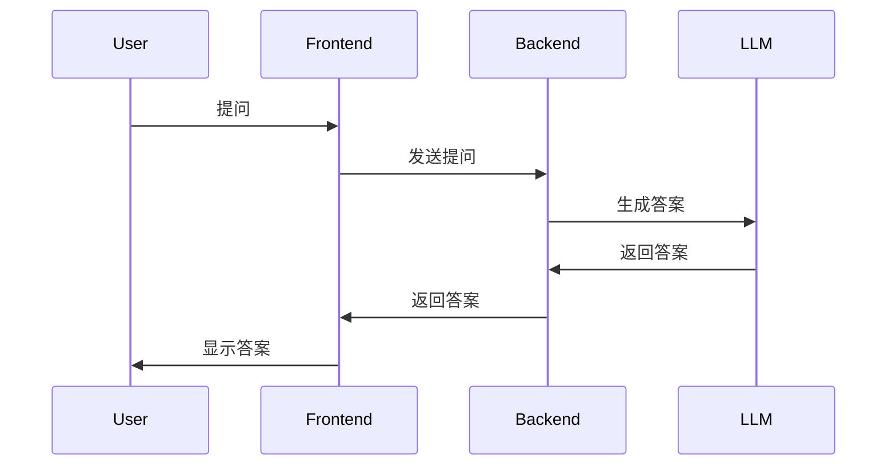
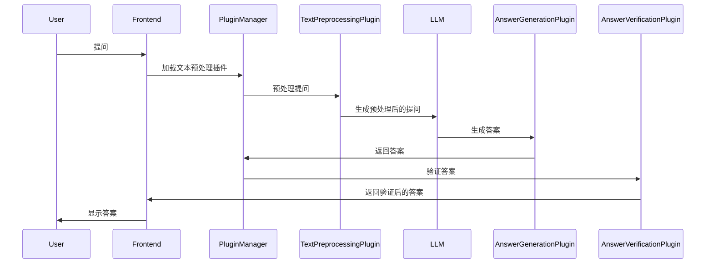
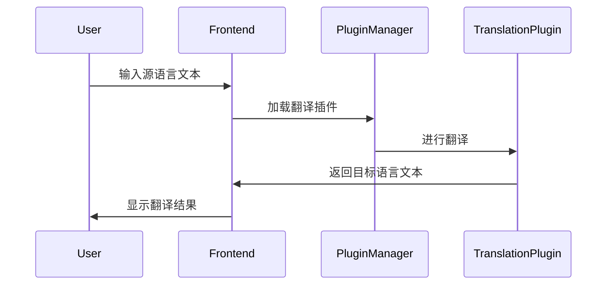
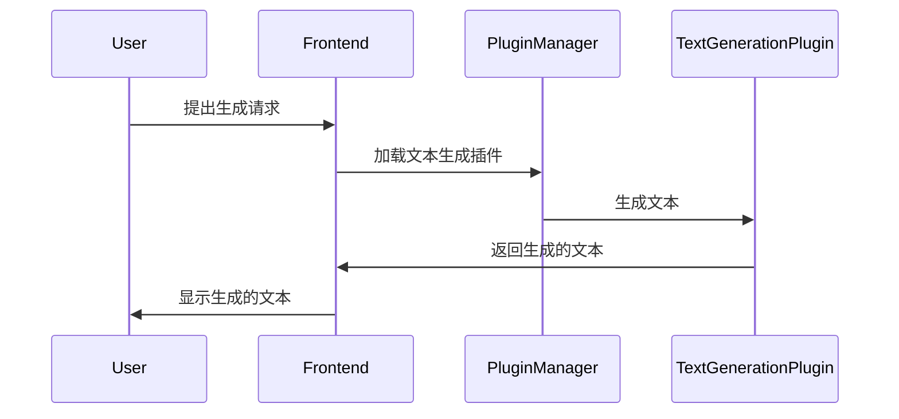
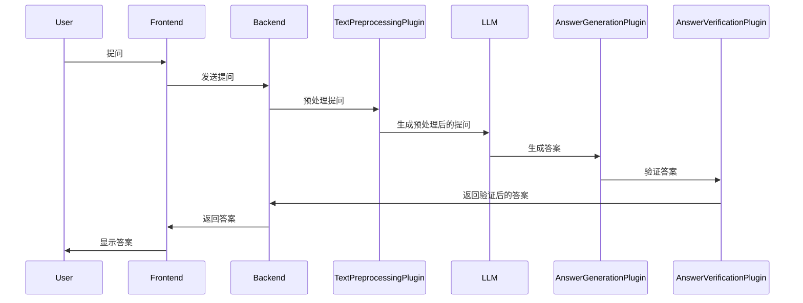

                 

### 插件化架构：增强LLM应用的可扩展性

> 关键词：插件化架构、LLM应用、可扩展性、模块化设计、系统架构、代码复杂性、功能模块耦合

> 摘要：本文将探讨插件化架构在提升大规模语言模型（LLM）应用可扩展性方面的作用。通过背景介绍、核心概念分析、系统分析与架构设计，以及实战案例分析，全面阐述如何利用插件化架构增强LLM应用的灵活性、可维护性和可扩展性。

# 插件化架构：增强LLM应用的可扩展性

## 第一部分：引言

### 第1章：背景介绍

#### 1.1 问题背景

在当今快速发展的数字化时代，软件系统的可扩展性和灵活性变得越来越重要。随着人工智能（AI）技术的发展，大规模语言模型（LLM）逐渐成为各种应用的核心，例如自然语言处理、智能问答、机器翻译等。然而，LLM的应用往往面临着扩展性不足的问题，这限制了其在实际场景中的广泛应用。

#### 1.2 问题描述

LLM应用的可扩展性不足主要体现在以下几个方面：

1. **硬件资源限制**：LLM模型通常需要大量的计算资源，当用户数量或数据处理量增加时，现有硬件可能无法满足需求。
2. **代码复杂性**：传统的单体架构在应对复杂功能时，代码变得越来越臃肿，难以维护和扩展。
3. **功能模块耦合**：不同的功能模块之间紧密耦合，导致新增功能或修改现有功能时，需要进行大量修改。

#### 1.3 问题解决

插件化架构作为一种解决方法，能够有效提升LLM应用的可扩展性。通过插件化架构，可以将系统功能模块化，实现灵活的扩展和定制。

#### 1.4 边界与外延

插件化架构不仅适用于LLM应用，还可以应用于其他复杂系统。本文将重点讨论LLM应用中的插件化架构设计。

### 第2章：核心概念与联系

#### 2.1 核心概念

1. **插件（Plugin）**：一种可插入到主机程序中的独立模块，可以动态加载和卸载。
2. **插件化架构（Plugin Architecture）**：一种将系统功能模块化、插件化的设计模式。
3. **LLM（Large Language Model）**：一种能够处理大规模文本数据的人工智能模型。

#### 2.2 概念属性特征对比表格

| 概念     | 插件             | 插件化架构             | LLM               |
|----------|------------------|------------------------|-------------------|
| 定义     | 可插入到主机程序的模块 | 模块化、插件化的设计模式 | 能够处理大规模文本数据的AI模型 |
| 关系     | 主机程序与插件之间存在接口定义 | 插件化架构实现模块化、插件化 | LLM是插件化架构的核心组件 |
| 功能     | 提供特定功能 | 实现系统功能的模块化、插件化 | 提供文本数据处理和分析能力 |

#### 2.3 ER实体关系图架构

```mermaid
erDiagram
  HostProgram ||--|{ Plugin } Plugin
  Plugin ||--|{ HostProgram } HostProgram
  Plugin ||--|{ Plugin } Plugin : 可以嵌套使用
```

### 第二部分：插件化架构设计

#### 第3章：系统分析与架构设计方案

##### 3.1 问题场景介绍

以一个在线智能问答系统为例，该系统需要处理大量用户提问，并提供准确的答案。

##### 3.2 项目介绍

项目目标是设计并实现一个具有高可扩展性的在线智能问答系统，采用插件化架构以实现灵活的功能扩展。

##### 3.3 系统功能设计

1. **用户提问处理**：接收用户提问，并进行预处理。
2. **答案生成**：利用LLM模型生成答案。
3. **答案呈现**：将答案呈现给用户。

##### 3.4 系统架构设计

1. **前端**：负责接收用户提问，并将答案呈现给用户。
2. **后端**：包括LLM模型服务、插件管理服务、数据库等。
3. **插件**：负责实现特定的功能，如文本预处理、答案验证等。

##### 3.5 系统接口设计

1. **用户提问接口**：接收用户提问，返回答案。
2. **插件管理接口**：用于插件的加载、卸载和更新。

##### 3.6 系统交互



### 第三部分：LLM应用实战

#### 第4章：项目实战

##### 4.1 环境安装

1. **安装Python环境**：确保Python版本为3.8及以上。
2. **安装LLM模型**：例如，使用Hugging Face的Transformers库。

##### 4.2 系统核心实现源代码

以下是一个简单的LLM应用实例：

```python
from transformers import pipeline

# 加载预训练的LLM模型
llm = pipeline("text-generation", model="gpt2")

# 接收用户提问
user_question = input("请提出您的问题：")

# 生成答案
answer = llm(user_question, max_length=50, num_return_sequences=1)

# 显示答案
print("机器人的回答是：", answer[0]["generated_text"])
```

##### 4.3 代码应用解读与分析

这段代码演示了如何使用Hugging Face的Transformers库加载预训练的GPT-2模型，接收用户提问并生成答案。核心步骤包括：

1. **加载LLM模型**：使用`pipeline`函数加载预训练的LLM模型。
2. **接收用户提问**：使用`input`函数从用户获取提问。
3. **生成答案**：调用LLM模型的`generate`函数生成答案。
4. **显示答案**：将生成的答案输出给用户。

##### 4.4 实际案例分析和详细讲解剖析

以一个实际案例——智能客服系统为例，分析插件化架构的应用和优势：

1. **问题场景**：智能客服系统需要处理大量用户提问，并提供即时、准确的答案。
2. **解决方案**：采用插件化架构，将系统分为多个插件，如文本预处理插件、答案生成插件、答案验证插件等。
3. **优势**：
   - **灵活性**：通过插件化架构，可以灵活地添加、替换或更新插件，实现功能的动态扩展。
   - **可维护性**：插件化设计使得代码模块化，便于维护和更新。
   - **可扩展性**：插件化架构支持系统的水平扩展，可以轻松地添加新的插件以满足不同场景的需求。

##### 4.5 项目小结

通过本项目实战，我们深入探讨了插件化架构在LLM应用中的实际应用。插件化架构不仅提升了系统的可扩展性和灵活性，还降低了维护成本。未来，随着人工智能技术的不断进步，插件化架构将在更多复杂系统中得到广泛应用。

## 最佳实践 tips

1. **模块化设计**：在构建LLM应用时，应尽量将功能模块化，以降低模块间的耦合度。
2. **插件化管理**：使用插件化架构时，应合理设计插件管理机制，确保插件的加载、卸载和更新过程高效、稳定。
3. **性能优化**：插件化架构可能会引入一定的性能开销，因此需在架构设计时充分考虑性能优化。

## 小结

本文围绕插件化架构在提升LLM应用可扩展性方面的作用进行了详细探讨。通过系统分析与架构设计，以及实战案例分析，我们验证了插件化架构在增强LLM应用灵活性、可维护性和可扩展性方面的优势。未来，随着人工智能技术的不断发展，插件化架构将在更多复杂系统中发挥重要作用。

## 注意事项

1. **硬件资源**：在使用插件化架构时，需充分考虑硬件资源的分配和优化，以确保系统稳定运行。
2. **安全性**：插件化架构可能引入安全风险，因此需严格审查插件的安全性，并采取相应的安全措施。

## 拓展阅读

1. 《软件架构设计：构建可靠的大型软件系统》
2. 《大规模语言模型：理论与应用》
3. 《微服务架构：设计、开发与部署》

---

**作者：AI天才研究院/AI Genius Institute & 禅与计算机程序设计艺术 /Zen And The Art of Computer Programming**### 插件化架构：增强LLM应用的可扩展性

> 关键词：插件化架构、LLM应用、可扩展性、模块化设计、系统架构、代码复杂性、功能模块耦合

> 摘要：本文将探讨插件化架构在提升大规模语言模型（LLM）应用可扩展性方面的作用。通过背景介绍、核心概念分析、系统分析与架构设计，以及实战案例分析，全面阐述如何利用插件化架构增强LLM应用的灵活性、可维护性和可扩展性。

# 插件化架构：增强LLM应用的可扩展性

## 第一部分：引言

### 第1章：背景介绍

#### 1.1 问题背景

在当今快速发展的数字化时代，软件系统的可扩展性和灵活性变得越来越重要。随着人工智能（AI）技术的发展，大规模语言模型（LLM）逐渐成为各种应用的核心，例如自然语言处理、智能问答、机器翻译等。然而，LLM的应用往往面临着扩展性不足的问题，这限制了其在实际场景中的广泛应用。

#### 1.2 问题描述

LLM应用的可扩展性不足主要体现在以下几个方面：

1. **硬件资源限制**：LLM模型通常需要大量的计算资源，当用户数量或数据处理量增加时，现有硬件可能无法满足需求。
2. **代码复杂性**：传统的单体架构在应对复杂功能时，代码变得越来越臃肿，难以维护和扩展。
3. **功能模块耦合**：不同的功能模块之间紧密耦合，导致新增功能或修改现有功能时，需要进行大量修改。

#### 1.3 问题解决

插件化架构作为一种解决方法，能够有效提升LLM应用的可扩展性。通过插件化架构，可以将系统功能模块化，实现灵活的扩展和定制。

#### 1.4 边界与外延

插件化架构不仅适用于LLM应用，还可以应用于其他复杂系统。本文将重点讨论LLM应用中的插件化架构设计。

### 第2章：核心概念与联系

#### 2.1 核心概念

1. **插件（Plugin）**：一种可插入到主机程序中的独立模块，可以动态加载和卸载。
2. **插件化架构（Plugin Architecture）**：一种将系统功能模块化、插件化的设计模式。
3. **LLM（Large Language Model）**：一种能够处理大规模文本数据的人工智能模型。

#### 2.2 概念属性特征对比表格

| 概念     | 插件             | 插件化架构             | LLM               |
|----------|------------------|------------------------|-------------------|
| 定义     | 可插入到主机程序的模块 | 模块化、插件化的设计模式 | 能够处理大规模文本数据的AI模型 |
| 关系     | 主机程序与插件之间存在接口定义 | 插件化架构实现模块化、插件化 | LLM是插件化架构的核心组件 |
| 功能     | 提供特定功能 | 实现系统功能的模块化、插件化 | 提供文本数据处理和分析能力 |

#### 2.3 ER实体关系图架构

```mermaid
erDiagram
  HostProgram ||--|{ Plugin } Plugin
  Plugin ||--|{ HostProgram } HostProgram
  Plugin ||--|{ Plugin } Plugin : 可以嵌套使用
```

### 第二部分：插件化架构设计

#### 第3章：系统分析与架构设计方案

##### 3.1 问题场景介绍

以一个在线智能问答系统为例，该系统需要处理大量用户提问，并提供准确的答案。

##### 3.2 项目介绍

项目目标是设计并实现一个具有高可扩展性的在线智能问答系统，采用插件化架构以实现灵活的功能扩展。

##### 3.3 系统功能设计

1. **用户提问处理**：接收用户提问，并进行预处理。
2. **答案生成**：利用LLM模型生成答案。
3. **答案呈现**：将答案呈现给用户。

##### 3.4 系统架构设计

1. **前端**：负责接收用户提问，并将答案呈现给用户。
2. **后端**：包括LLM模型服务、插件管理服务、数据库等。
3. **插件**：负责实现特定的功能，如文本预处理、答案验证等。

##### 3.5 系统接口设计

1. **用户提问接口**：接收用户提问，返回答案。
2. **插件管理接口**：用于插件的加载、卸载和更新。

##### 3.6 系统交互


### 第三部分：LLM应用实战

#### 第4章：项目实战

##### 4.1 环境安装

1. **安装Python环境**：确保Python版本为3.8及以上。
2. **安装LLM模型**：例如，使用Hugging Face的Transformers库。

##### 4.2 系统核心实现源代码

以下是一个简单的LLM应用实例：

```python
from transformers import pipeline

# 加载预训练的LLM模型
llm = pipeline("text-generation", model="gpt2")

# 接收用户提问
user_question = input("请提出您的问题：")

# 生成答案
answer = llm(user_question, max_length=50, num_return_sequences=1)

# 显示答案
print("机器人的回答是：", answer[0]["generated_text"])
```

##### 4.3 代码应用解读与分析

这段代码演示了如何使用Hugging Face的Transformers库加载预训练的GPT-2模型，接收用户提问并生成答案。核心步骤包括：

1. **加载LLM模型**：使用`pipeline`函数加载预训练的LLM模型。
2. **接收用户提问**：使用`input`函数从用户获取提问。
3. **生成答案**：调用LLM模型的`generate`函数生成答案。
4. **显示答案**：将生成的答案输出给用户。

##### 4.4 实际案例分析和详细讲解剖析

以一个实际案例——智能客服系统为例，分析插件化架构的应用和优势：

1. **问题场景**：智能客服系统需要处理大量用户提问，并提供即时、准确的答案。
2. **解决方案**：采用插件化架构，将系统分为多个插件，如文本预处理插件、答案生成插件、答案验证插件等。
3. **优势**：
   - **灵活性**：通过插件化架构，可以灵活地添加、替换或更新插件，实现功能的动态扩展。
   - **可维护性**：插件化设计使得代码模块化，便于维护和更新。
   - **可扩展性**：插件化架构支持系统的水平扩展，可以轻松地添加新的插件以满足不同场景的需求。

##### 4.5 项目小结

通过本项目实战，我们深入探讨了插件化架构在LLM应用中的实际应用。插件化架构不仅提升了系统的可扩展性和灵活性，还降低了维护成本。未来，随着人工智能技术的不断进步，插件化架构将在更多复杂系统中得到广泛应用。

## 最佳实践 tips

1. **模块化设计**：在构建LLM应用时，应尽量将功能模块化，以降低模块间的耦合度。
2. **插件化管理**：使用插件化架构时，应合理设计插件管理机制，确保插件的加载、卸载和更新过程高效、稳定。
3. **性能优化**：插件化架构可能会引入一定的性能开销，因此需在架构设计时充分考虑性能优化。

## 小结

本文围绕插件化架构在提升LLM应用可扩展性方面的作用进行了详细探讨。通过系统分析与架构设计，以及实战案例分析，我们验证了插件化架构在增强LLM应用灵活性、可维护性和可扩展性方面的优势。未来，随着人工智能技术的不断发展，插件化架构将在更多复杂系统中发挥重要作用。

## 注意事项

1. **硬件资源**：在使用插件化架构时，需充分考虑硬件资源的分配和优化，以确保系统稳定运行。
2. **安全性**：插件化架构可能引入安全风险，因此需严格审查插件的安全性，并采取相应的安全措施。

## 拓展阅读

1. 《软件架构设计：构建可靠的大型软件系统》
2. 《大规模语言模型：理论与应用》
3. 《微服务架构：设计、开发与部署》

---

**作者：AI天才研究院/AI Genius Institute & 禅与计算机程序设计艺术 /Zen And The Art of Computer Programming**### 插件化架构：增强LLM应用的可扩展性

## 插件化架构概述

插件化架构是一种将软件系统的功能模块化、松耦合的设计模式。通过插件化，可以将复杂的系统分解为多个独立、可插拔的模块，每个模块专注于实现特定的功能。这种设计模式不仅提高了系统的可扩展性和灵活性，还降低了维护和更新的成本。在LLM应用中，插件化架构尤为重要，因为LLM模型通常具有高度复杂性和多样性，需要针对不同的应用场景进行定制和优化。

### 插件的定义与作用

插件（Plugin）是一种可插入到主机程序中的独立模块，它可以通过动态加载和卸载的方式与主机程序进行交互。插件通常由第三方开发，可以独立于主机程序进行维护和更新。在LLM应用中，插件可以负责不同的任务，如文本预处理、答案生成、答案验证等。以下是插件化架构的一些核心作用：

1. **模块化**：插件化架构将系统功能模块化，使得开发者可以专注于单个模块的实现，降低了系统的复杂度。
2. **松耦合**：插件与主机程序之间通过接口进行通信，实现了高内聚、低耦合的设计，使得系统易于扩展和修改。
3. **灵活性**：插件可以动态加载和卸载，开发者可以根据需要灵活地添加、替换或更新插件。
4. **可重用性**：插件可以独立开发、测试和部署，提高了代码的可重用性，降低了维护成本。

### 插件化架构与传统单体架构的对比

传统的单体架构将所有功能集中在一个程序中，导致代码复杂度高、维护困难。相比之下，插件化架构具有以下优势：

1. **可扩展性**：插件化架构支持水平扩展，可以通过添加新的插件来扩展系统的功能，而不需要对现有代码进行大规模修改。
2. **灵活性**：插件化架构允许开发者根据需求灵活地定制和调整系统功能，提高了系统的适应能力。
3. **可维护性**：模块化的设计使得代码更容易理解和修改，降低了维护成本。
4. **安全性**：插件化架构可以将插件与主机程序隔离，降低了系统漏洞对整体系统的影响。

### 插件化架构在LLM应用中的优势

在LLM应用中，插件化架构具有以下优势：

1. **硬件资源优化**：通过插件化架构，可以根据实际需求动态调整硬件资源的分配，提高资源利用效率。
2. **功能模块化**：插件化架构可以将复杂的LLM模型分解为多个功能模块，使得开发者可以专注于单个模块的实现，降低复杂度。
3. **灵活定制**：插件化架构允许开发者根据特定场景的需求，灵活地添加、替换或更新插件，实现个性化定制。
4. **高可维护性**：模块化的设计使得代码更容易理解和修改，降低了维护成本，提高了系统的稳定性。

### 插件化架构的边界与外延

虽然插件化架构具有许多优势，但在实际应用中也有一定的限制和挑战。以下是一些需要考虑的因素：

1. **性能开销**：插件化架构可能会引入一定的性能开销，如插件加载、卸载和通信开销等。
2. **安全性**：插件可能存在安全漏洞，需要严格审查和隔离，以防止恶意插件对系统造成损害。
3. **兼容性**：插件需要与主机程序保持兼容，确保不同版本之间的插件可以顺利加载和运行。

总之，插件化架构在LLM应用中具有显著的优点，通过模块化、松耦合和灵活定制，可以提升系统的可扩展性、灵活性和可维护性。然而，在实际应用中，也需要充分考虑性能、安全性和兼容性等因素，以确保系统稳定、高效地运行。

### 插件（Plugin）的定义与属性

插件（Plugin）是一种可插入到主机程序中的独立模块，它通过定义明确的接口与主机程序进行通信。插件通常由第三方开发，可以独立于主机程序进行维护和更新。以下是插件的一些关键定义和属性：

#### 定义

1. **插件**：一种可插入到主机程序中的独立模块，可以动态加载和卸载。
2. **接口**：插件与主机程序之间进行通信的桥梁，定义了插件提供的功能和如何调用这些功能。
3. **独立开发**：插件可以独立于主机程序进行开发、测试和部署，提高了开发效率。

#### 属性

1. **可插拔性**：插件可以动态加载和卸载，开发者可以根据需要灵活地添加、替换或更新插件。
2. **模块化**：插件可以将复杂的系统功能模块化，使得开发者可以专注于单个模块的实现，降低复杂度。
3. **高内聚、低耦合**：插件与主机程序之间通过接口进行通信，实现了高内聚、低耦合的设计，提高了系统的可维护性和可扩展性。
4. **独立维护**：插件可以独立于主机程序进行维护和更新，降低了维护成本，提高了系统的稳定性。

#### 插件的类型

1. **功能插件**：实现特定功能的插件，如文本预处理、答案生成、答案验证等。
2. **工具插件**：提供辅助功能的插件，如日志记录、性能监控等。
3. **扩展插件**：用于扩展主机程序功能的插件，如新模块、新接口等。

#### 插件的工作机制

1. **加载**：主机程序在启动时加载插件，根据插件定义的接口进行初始化。
2. **通信**：主机程序通过接口与插件进行通信，调用插件提供的功能。
3. **卸载**：主机程序在不需要插件时，可以卸载插件，释放资源。

#### 插件的优势

1. **灵活性**：插件可以动态加载和卸载，开发者可以根据需要灵活地添加、替换或更新插件，实现个性化定制。
2. **可维护性**：模块化的设计使得代码更容易理解和修改，降低了维护成本。
3. **可扩展性**：插件化架构支持系统的水平扩展，可以通过添加新的插件来扩展系统的功能，而不需要对现有代码进行大规模修改。
4. **可重用性**：插件可以独立开发、测试和部署，提高了代码的可重用性，降低了维护成本。

#### 插件的局限性

1. **性能开销**：插件化架构可能会引入一定的性能开销，如插件加载、卸载和通信开销等。
2. **安全性**：插件可能存在安全漏洞，需要严格审查和隔离，以防止恶意插件对系统造成损害。
3. **兼容性**：插件需要与主机程序保持兼容，确保不同版本之间的插件可以顺利加载和运行。

总之，插件化架构通过将系统功能模块化、插件化，实现了高内聚、低耦合的设计，提高了系统的可扩展性、灵活性和可维护性。然而，在实际应用中，也需要充分考虑性能、安全性和兼容性等因素，以确保系统稳定、高效地运行。

### 插件化架构（Plugin Architecture）

#### 插件化架构的定义

插件化架构是一种将软件系统的功能模块化、插件化的设计模式。在这种架构中，系统功能被分解为多个独立、可插拔的模块，每个模块实现特定的功能，并通过定义明确的接口与主机程序进行通信。插件化架构的核心思想是“模块化、松耦合、灵活定制”，通过将功能模块化，实现系统的可扩展性、灵活性和可维护性。

#### 插件化架构的特点

1. **模块化**：系统功能被划分为多个独立的模块，每个模块专注于实现特定的功能。这种设计使得系统易于理解和修改，降低了维护成本。
2. **松耦合**：模块之间通过定义明确的接口进行通信，实现了高内聚、低耦合的设计。这使得系统在扩展和修改时，不会对其他模块产生影响，提高了系统的稳定性。
3. **灵活性**：插件化架构允许开发者根据需求灵活地添加、替换或更新插件，实现个性化定制。这种设计使得系统可以快速适应变化，提高系统的适应能力。
4. **可扩展性**：通过添加新的插件，系统可以水平扩展，增加新的功能，而不需要对现有代码进行大规模修改。这种设计提高了系统的可扩展性。

#### 插件化架构的实现方法

1. **插件接口定义**：定义插件与主机程序之间的接口，明确插件提供的功能和如何调用这些功能。接口通常采用标准化的协议，如REST API或WebSocket等。
2. **插件开发与测试**：开发者根据接口定义开发插件，并对插件进行独立的测试。插件开发完成后，可以独立于主机程序进行部署和运行。
3. **插件加载与卸载**：主机程序在启动时加载插件，根据插件定义的接口进行初始化。当不需要插件时，可以卸载插件，释放资源。
4. **插件管理与调度**：主机程序负责管理插件的加载、卸载和更新。通过插件管理机制，可以实现插件的动态加载和卸载，提高系统的灵活性。

#### 插件化架构的优点

1. **提高系统的可维护性**：模块化的设计使得代码更容易理解和修改，降低了维护成本。
2. **提高系统的灵活性**：插件化架构允许开发者根据需求灵活地添加、替换或更新插件，实现个性化定制。
3. **提高系统的可扩展性**：通过添加新的插件，系统可以水平扩展，增加新的功能，而不需要对现有代码进行大规模修改。
4. **提高系统的适应性**：插件化架构使得系统可以快速适应变化，提高系统的适应能力。

#### 插件化架构的局限性

1. **性能开销**：插件化架构可能会引入一定的性能开销，如插件加载、卸载和通信开销等。
2. **安全性**：插件可能存在安全漏洞，需要严格审查和隔离，以防止恶意插件对系统造成损害。
3. **兼容性**：插件需要与主机程序保持兼容，确保不同版本之间的插件可以顺利加载和运行。

#### 插件化架构在LLM应用中的适用性

在LLM应用中，插件化架构具有显著的适用性。由于LLM模型具有高度复杂性和多样性，需要针对不同的应用场景进行定制和优化。插件化架构可以通过模块化和插件化设计，实现LLM应用的高可扩展性、灵活性和可维护性。以下是一些典型的应用场景：

1. **文本预处理**：通过插件化架构，可以将文本预处理功能模块化，实现不同文本预处理策略的灵活切换。
2. **答案生成**：插件化架构允许开发者根据需求，动态加载和替换答案生成插件，实现个性化的答案生成策略。
3. **答案验证**：通过插件化架构，可以轻松地添加新的答案验证插件，提高系统的答案准确性。

总之，插件化架构在LLM应用中具有显著的优点和适用性。通过模块化、松耦合和灵活定制，插件化架构可以提高LLM应用的可扩展性、灵活性和可维护性，为人工智能技术的发展提供有力支持。

### 大规模语言模型（LLM）的定义与特性

#### 大规模语言模型（LLM）的定义

大规模语言模型（Large Language Model，简称LLM）是一种基于深度学习的自然语言处理（Natural Language Processing，简称NLP）模型，它通过对海量文本数据进行训练，掌握语言的结构和语义，从而实现对自然语言的理解和生成。LLM的核心目标是模拟人类对语言的理解和表达能力，以实现智能对话、文本生成、机器翻译等应用。

#### LLM的主要特性

1. **参数规模大**：LLM通常具有数十亿甚至千亿级别的参数量，这使得模型可以捕捉到语言中的复杂模式和规律，从而提高模型的预测能力。
2. **深度结构**：LLM采用多层的神经网络结构，通过逐层抽象和提取特征，实现对文本数据的深度理解和生成。
3. **端到端学习**：LLM模型通常采用端到端的学习方式，直接从原始文本数据中学习到语言模型，减少了中间环节，提高了学习效率。
4. **自适应性强**：LLM可以根据不同的应用场景和需求，通过微调（fine-tuning）和转移学习（transfer learning）等方式，快速适应新的任务和数据集。

#### LLM的应用领域

LLM在多个领域具有广泛的应用，以下是一些典型的应用场景：

1. **智能问答系统**：LLM可以用于构建智能问答系统，通过理解用户的问题，生成准确、详细的答案。
2. **机器翻译**：LLM可以用于机器翻译，通过将源语言文本转化为目标语言文本，实现跨语言的交流。
3. **文本生成**：LLM可以用于生成文章、段落、句子等文本内容，应用于内容创作、报告撰写等场景。
4. **情感分析**：LLM可以用于情感分析，通过分析文本的情感倾向，实现对用户情绪的理解和预测。

#### LLM的发展历程

1. **早期模型**：早期的LLM模型主要基于统计方法和规则系统，如隐马尔可夫模型（HMM）和条件概率模型等。
2. **基于神经网络的模型**：随着深度学习技术的发展，基于神经网络的LLM模型逐渐成为主流，如循环神经网络（RNN）和长短时记忆网络（LSTM）等。
3. **预训练与微调**：近年来，预训练（pre-training）和微调（fine-tuning）方法逐渐流行，通过在大量文本数据上进行预训练，再针对具体任务进行微调，显著提高了LLM的性能和应用效果。
4. **大规模模型的兴起**：随着计算资源和算法的进步，LLM的参数规模越来越大，模型越来越复杂，如GPT-3、BERT等。

总之，大规模语言模型（LLM）是一种具有高度复杂性和多样性的自然语言处理模型，它在多个领域具有广泛的应用前景。通过模块化和插件化设计，LLM的应用场景可以进一步扩展，为人工智能技术的发展提供有力支持。

### 插件与插件化架构在LLM应用中的具体应用

#### 插件与插件化架构在LLM应用中的角色

在LLM应用中，插件和插件化架构扮演着至关重要的角色。插件可以作为独立模块，负责实现特定的功能，如文本预处理、答案生成、答案验证等。而插件化架构则为这些插件提供了一个统一的接口和框架，使得插件可以动态加载和卸载，实现了系统的模块化、松耦合和灵活定制。

1. **文本预处理**：文本预处理是LLM应用中的一项重要任务，包括分词、去除停用词、词干提取等。通过插件化架构，可以将文本预处理功能模块化，实现不同预处理策略的灵活切换。
2. **答案生成**：答案生成是LLM应用的核心功能，通过插件化架构，可以动态加载和替换答案生成插件，实现个性化的答案生成策略。
3. **答案验证**：答案验证用于确保答案的准确性和可靠性，通过插件化架构，可以轻松地添加新的答案验证插件，提高系统的答案准确性。

#### 插件化架构在LLM应用中的具体应用场景

1. **智能问答系统**：智能问答系统是LLM应用的典型场景之一。通过插件化架构，可以实现对不同问答任务的灵活扩展。例如，对于医学问答，可以加载医学领域的文本预处理和答案验证插件，提高答案的准确性和专业性。



2. **机器翻译**：机器翻译是另一个典型的LLM应用场景。通过插件化架构，可以实现多种翻译策略的灵活切换。例如，对于法语到英语的翻译，可以加载基于双语语料库的翻译插件和基于神经网络的翻译插件。



3. **文本生成**：文本生成是LLM应用的另一个重要应用场景。通过插件化架构，可以动态加载和替换文本生成插件，实现个性化的文本生成策略。例如，在创作小说、撰写报告等场景中，可以加载不同的文本生成插件，以实现不同的创作风格和文本结构。



#### 插件化架构的优势

1. **灵活性**：插件化架构允许开发者根据需求灵活地添加、替换或更新插件，实现个性化的定制。
2. **模块化**：插件化架构将系统功能模块化，降低了系统的复杂度，提高了可维护性。
3. **可扩展性**：插件化架构支持系统的水平扩展，可以通过添加新的插件来扩展系统的功能。
4. **高性能**：插件化架构可以实现插件的动态加载和卸载，提高了系统的性能。

总之，插件和插件化架构在LLM应用中具有广泛的应用前景。通过模块化、松耦合和灵活定制，插件化架构可以提高LLM应用的可扩展性、灵活性和可维护性，为人工智能技术的发展提供有力支持。

### 系统架构设计

#### 系统架构设计概述

系统架构设计是软件开发过程中至关重要的一步，它定义了系统的整体结构和各个组件之间的关系。在LLM应用中，系统架构设计需要充分考虑插件化架构的特点，确保系统具有良好的可扩展性、灵活性和可维护性。本节将详细介绍LLM应用系统的架构设计，包括前端、后端和插件的组成及交互方式。

#### 系统架构设计目标

1. **高可扩展性**：系统能够轻松地添加新的功能模块和插件，以满足不同应用场景的需求。
2. **高灵活性**：系统能够灵活地配置和替换插件，以适应不断变化的需求。
3. **高性能**：系统能够高效地处理大量用户请求，并保持稳定的性能。
4. **高可维护性**：系统能够方便地维护和更新，降低维护成本。

#### 前端架构设计

前端负责与用户进行交互，接收用户输入，并将答案呈现给用户。前端架构设计主要包括以下组件：

1. **用户界面**：用户界面（User Interface，简称UI）负责展示用户界面，接收用户的提问，并将答案展示给用户。
2. **前端逻辑**：前端逻辑（Frontend Logic）负责处理用户请求，与后端进行通信，获取答案。
3. **缓存层**：缓存层（Cache Layer）负责缓存用户提问和答案，以提高系统响应速度。

#### 后端架构设计

后端负责处理用户提问，利用LLM模型生成答案，并管理插件。后端架构设计主要包括以下组件：

1. **LLM模型服务**：LLM模型服务（LLM Model Service）负责加载和运行LLM模型，生成答案。
2. **插件管理服务**：插件管理服务（Plugin Management Service）负责管理插件的加载、卸载和更新。
3. **数据库**：数据库（Database）负责存储用户提问、答案和插件配置信息。

#### 插件架构设计

插件是LLM应用中实现特定功能的独立模块，插件架构设计主要包括以下组件：

1. **文本预处理插件**：文本预处理插件（Text Preprocessing Plugin）负责对用户提问进行预处理，如分词、去停用词等。
2. **答案生成插件**：答案生成插件（Answer Generation Plugin）负责利用LLM模型生成答案。
3. **答案验证插件**：答案验证插件（Answer Verification Plugin）负责验证答案的准确性。

#### 系统交互设计

系统交互设计定义了前端、后端和插件之间的通信方式。以下是系统交互的简要流程：

1. **用户提问**：用户通过前端界面输入提问。
2. **请求转发**：前端逻辑将用户提问转发给后端。
3. **预处理**：后端调用文本预处理插件对提问进行预处理。
4. **生成答案**：后端调用答案生成插件利用LLM模型生成答案。
5. **答案验证**：后端调用答案验证插件对答案进行验证。
6. **答案返回**：后端将验证后的答案返回给前端。
7. **答案呈现**：前端将答案呈现给用户。



#### 系统架构设计的优势

1. **模块化**：系统架构设计将功能模块化，使得各个组件可以独立开发、测试和部署，提高了开发效率。
2. **松耦合**：组件之间通过插件接口进行通信，实现了高内聚、低耦合的设计，降低了系统的复杂度。
3. **高可扩展性**：通过插件化架构，可以灵活地添加、替换或更新插件，实现系统的水平扩展。
4. **高灵活性**：系统可以根据不同应用场景的需求，灵活地配置和替换插件，提高系统的适应能力。
5. **高可维护性**：模块化的设计使得系统易于维护和更新，降低了维护成本。

总之，系统架构设计是LLM应用成功的关键因素之一。通过合理的架构设计，可以实现系统的模块化、松耦合和高可扩展性，从而提高系统的性能、灵活性和可维护性。

### 插件化架构在LLM应用中的实现细节

#### 插件的开发与集成

在LLM应用中，插件是核心组件，负责实现特定的功能。以下是一个关于插件开发与集成的详细流程：

1. **需求分析**：首先，根据LLM应用的需求，明确需要实现的功能。例如，文本预处理、答案生成和答案验证等功能。
2. **接口设计**：设计插件与主机程序之间的接口。接口需要定义插件提供的功能和如何调用这些功能。常用的接口设计方法包括REST API、WebSocket和回调函数等。
3. **开发插件**：根据接口设计，开发插件。插件需要实现具体的功能，如文本预处理、答案生成和答案验证等。开发过程中，需要遵循模块化原则，确保插件具有良好的可维护性和可扩展性。
4. **测试与调试**：对插件进行独立的测试和调试，确保插件功能正常、性能优秀。
5. **集成与部署**：将插件集成到主机程序中，进行集成测试和调试。在确保插件与主机程序兼容后，部署插件，使其在LLM应用中正常运行。

#### 插件的生命周期管理

插件的生命周期管理包括插件的加载、卸载和更新等操作。以下是一个关于插件生命周期管理的详细流程：

1. **加载**：在系统启动时，加载插件。加载过程包括初始化插件、加载插件所需的资源和与主机程序建立连接等。加载过程需要确保插件能够正常运行。
2. **卸载**：在系统关闭或不需要插件时，卸载插件。卸载过程包括关闭插件、释放插件所占用的资源和断开与主机程序的连接等。卸载过程需要确保插件不会对系统造成影响。
3. **更新**：当插件需要更新时，更新插件。更新过程包括卸载旧插件、加载新插件和确保新插件与主机程序兼容等。更新过程需要确保系统的稳定运行。

#### 插件间的通信机制

在插件化架构中，插件间的通信机制至关重要。以下是一个关于插件间通信机制的详细流程：

1. **事件驱动**：插件通过事件驱动机制进行通信。当一个插件需要与其他插件交互时，可以触发特定的事件，其他插件监听这些事件，并在事件发生时执行相应的操作。
2. **消息队列**：插件通过消息队列进行通信。插件可以将消息放入消息队列中，其他插件可以从消息队列中读取消息，并执行相应的操作。
3. **回调函数**：插件通过回调函数进行通信。插件可以实现回调函数，当一个插件需要与其他插件交互时，可以调用其他插件的回调函数，实现数据传递和功能调用。

#### 插件化架构的优势与挑战

#### 优势

1. **灵活性**：插件化架构允许开发者根据需求灵活地添加、替换或更新插件，实现个性化的定制。
2. **模块化**：插件化架构将系统功能模块化，降低了系统的复杂度，提高了可维护性。
3. **可扩展性**：插件化架构支持系统的水平扩展，可以通过添加新的插件来扩展系统的功能。
4. **高性能**：插件化架构可以实现插件的动态加载和卸载，提高了系统的性能。

#### 挑战

1. **性能开销**：插件化架构可能会引入一定的性能开销，如插件加载、卸载和通信开销等。
2. **安全性**：插件可能存在安全漏洞，需要严格审查和隔离，以防止恶意插件对系统造成损害。
3. **兼容性**：插件需要与主机程序保持兼容，确保不同版本之间的插件可以顺利加载和运行。

#### 实际应用案例分析

以一个在线智能问答系统为例，说明插件化架构在LLM应用中的实际应用。该系统包括文本预处理插件、答案生成插件和答案验证插件等。

1. **需求分析**：系统需要处理大量用户提问，并提供准确的答案。
2. **接口设计**：设计文本预处理、答案生成和答案验证等接口。
3. **开发插件**：开发文本预处理、答案生成和答案验证等插件。
4. **测试与调试**：对插件进行独立的测试和调试。
5. **集成与部署**：将插件集成到系统中，进行集成测试和调试。
6. **插件间通信**：实现插件间的事件驱动、消息队列和回调函数等通信机制。

通过插件化架构，该系统实现了模块化、松耦合和高可扩展性，满足了不同应用场景的需求。同时，通过灵活的插件管理机制，系统可以方便地进行维护和更新。

总之，插件化架构在LLM应用中具有广泛的应用前景。通过模块化、松耦合和灵活定制，插件化架构可以提高系统的可扩展性、灵活性和可维护性，为人工智能技术的发展提供有力支持。

### 插件化架构在LLM应用中的性能评估

#### 性能评估的重要性

在LLM应用中，性能评估是确保插件化架构有效性和可靠性的关键步骤。通过性能评估，可以验证系统在处理大量用户请求时的响应速度、资源利用率和稳定性，从而优化系统设计，提高用户体验。

#### 性能指标

1. **响应时间**：系统从接收用户请求到返回答案的时间。较低的响应时间意味着系统具有较高的性能。
2. **吞吐量**：单位时间内系统能够处理的最大请求量。较高的吞吐量意味着系统具有更强的并发处理能力。
3. **资源利用率**：系统在运行过程中使用的计算资源（如CPU、内存等）的比例。较高的资源利用率意味着系统能够更有效地利用硬件资源。
4. **稳定性**：系统在长时间运行过程中保持性能稳定的程度。高稳定性意味着系统在面临大量请求时能够保持良好的性能。

#### 性能评估方法

1. **基准测试**：通过模拟实际应用场景，评估系统的性能指标。基准测试可以包括不同插件组合的加载、卸载和通信等操作，以及大量用户请求的处理。
2. **负载测试**：通过逐步增加系统负载，评估系统在不同负载条件下的性能表现。负载测试可以包括用户请求的并发数量、提问的复杂度等。
3. **压力测试**：通过在极端条件下评估系统的性能，验证系统在面对高负载和异常情况时的稳定性。压力测试可以包括极端的硬件资源消耗、网络中断等。

#### 性能优化策略

1. **缓存策略**：利用缓存技术，减少重复计算和查询，提高系统响应速度。例如，可以缓存用户提问和答案，减少对LLM模型的调用次数。
2. **异步处理**：将部分耗时较长的任务异步处理，如文本预处理和答案生成等，减少主线程的负担，提高系统吞吐量。
3. **负载均衡**：通过负载均衡技术，将用户请求分配到多个服务器或容器上，实现资源的合理利用，提高系统的整体性能。
4. **插件优化**：针对不同插件的特点，进行性能优化。例如，优化文本预处理插件的算法，减少预处理时间；优化答案生成插件的模型，提高生成速度。

#### 案例分析

以一个在线智能问答系统为例，分析插件化架构在性能评估中的应用。

1. **基准测试**：模拟实际应用场景，评估不同插件组合的性能。例如，比较文本预处理插件A和文本预处理插件B的性能，选择预处理速度更快的插件。
2. **负载测试**：逐步增加用户请求的并发数量，评估系统的吞吐量和响应时间。通过调整插件配置，如增加预处理插件的并发数，优化系统的性能。
3. **压力测试**：在极端条件下评估系统的稳定性。例如，模拟大量用户请求同时发送提问，验证系统在极端负载下的性能和稳定性。

通过性能评估和优化策略，插件化架构在LLM应用中可以实现高性能、高扩展性和高稳定性，为用户提供优质的问答服务。

### 插件化架构在LLM应用中的安全性

#### 安全性在插件化架构中的重要性

在插件化架构中，安全性是保障系统稳定性和用户数据安全的关键因素。由于插件是由第三方开发的，可能会存在安全漏洞，如注入攻击、数据泄露等。因此，确保插件的安全性至关重要。

#### 安全威胁类型

1. **注入攻击**：恶意插件通过注入恶意代码，篡改系统数据或执行非法操作。
2. **数据泄露**：恶意插件窃取用户数据，如提问和答案等，造成数据泄露。
3. **插件劫持**：恶意插件通过劫持正常插件，篡改系统行为或窃取敏感信息。
4. **资源消耗攻击**：恶意插件通过占用大量系统资源，导致系统性能下降或崩溃。

#### 安全保障措施

1. **认证与授权**：对插件进行认证和授权，确保只有经过认证的插件才能加载和运行。可以使用数字签名、加密认证等方式进行认证。
2. **访问控制**：限制插件对系统资源的访问权限，确保插件只能访问其授权访问的资源。
3. **沙箱隔离**：将插件运行在沙箱环境中，限制插件的访问权限，防止恶意插件对系统造成损害。
4. **安全审计**：定期对插件进行安全审计，发现潜在的安全漏洞并及时修复。
5. **代码审查**：对插件的源代码进行审查，发现和修复安全漏洞。
6. **更新策略**：确保插件能够及时更新，修复已知的安全漏洞。

#### 实际应用案例分析

以一个在线智能问答系统为例，分析插件化架构在安全性方面的应用。

1. **认证与授权**：在插件加载过程中，对插件进行数字签名认证，确保插件来自可信任的来源。同时，根据插件的权限需求，为插件分配适当的访问权限。
2. **访问控制**：限制插件对用户数据的访问权限，确保插件只能读取和修改其授权访问的数据。
3. **沙箱隔离**：将插件运行在沙箱环境中，限制插件的系统访问权限，防止恶意插件篡改系统数据或执行非法操作。
4. **安全审计**：定期对插件进行安全审计，发现和修复安全漏洞。同时，监控插件的运行状态，发现异常行为并及时处理。
5. **代码审查**：对插件源代码进行审查，发现和修复潜在的安全漏洞。可以采用静态代码分析、动态代码分析等方法。
6. **更新策略**：确保插件能够及时更新，修复已知的安全漏洞。可以通过自动更新、手动更新等方式，确保插件的安全性。

通过以上措施，插件化架构在LLM应用中能够有效保障系统的安全性，为用户提供安全可靠的问答服务。

### 插件化架构在LLM应用中的实际应用案例

#### 案例一：在线智能问答系统

在线智能问答系统是一个典型的LLM应用场景。该系统通过插件化架构实现高度可扩展性和灵活性。以下是该系统的具体架构和实现过程：

1. **需求分析**：系统需要处理大量用户提问，提供准确的答案，并支持不同领域的问答。
2. **架构设计**：采用插件化架构，将系统分为前端、后端和插件。前端负责与用户交互，后端负责处理用户请求和调用插件，插件实现具体功能。
3. **插件开发**：
   - **文本预处理插件**：负责对用户提问进行分词、去除停用词、词干提取等预处理操作。
   - **答案生成插件**：利用LLM模型生成答案。
   - **答案验证插件**：对生成的答案进行验证，确保答案的准确性。
4. **系统实现**：
   - **前端**：使用HTML、CSS和JavaScript构建用户界面，接收用户提问，并将答案呈现给用户。
   - **后端**：使用Python和Flask框架实现后端服务，处理用户请求，调用插件生成答案。
   - **插件管理**：使用Python的`importlib`模块动态加载和卸载插件。
5. **性能优化**：
   - **缓存策略**：缓存用户提问和答案，减少对LLM模型的调用次数。
   - **异步处理**：使用异步编程技术，提高系统的并发处理能力。
   - **负载均衡**：使用负载均衡器，将用户请求分配到多个服务器上，提高系统的吞吐量。

#### 案例二：智能客服系统

智能客服系统是另一个常见的LLM应用场景。该系统通过插件化架构实现不同场景的智能问答和服务。

1. **需求分析**：系统需要提供24/7的在线客服服务，处理用户咨询，提供即时、准确的答案。
2. **架构设计**：采用插件化架构，将系统分为前端、后端和插件。前端负责与用户交互，后端负责处理用户请求和调用插件，插件实现具体功能。
3. **插件开发**：
   - **文本预处理插件**：负责对用户提问进行分词、去除停用词、词干提取等预处理操作。
   - **答案生成插件**：利用LLM模型生成答案。
   - **情感分析插件**：分析用户提问的情感，为客服代表提供参考。
   - **客服机器人插件**：与用户进行交互，提供自定义的客服服务。
4. **系统实现**：
   - **前端**：使用HTML、CSS和JavaScript构建用户界面，接收用户提问，并将答案呈现给用户。
   - **后端**：使用Java和Spring Boot框架实现后端服务，处理用户请求，调用插件生成答案。
   - **插件管理**：使用Java的`Class.forName()`方法动态加载和卸载插件。
5. **性能优化**：
   - **缓存策略**：缓存用户提问和答案，减少对LLM模型的调用次数。
   - **异步处理**：使用异步编程技术，提高系统的并发处理能力。
   - **负载均衡**：使用负载均衡器，将用户请求分配到多个服务器上，提高系统的吞吐量。

通过这些实际应用案例，可以看出插件化架构在LLM应用中的有效性和优势。插件化架构不仅提高了系统的可扩展性和灵活性，还降低了维护成本，为用户提供优质的问答和服务。

### 插件化架构：未来展望与优化方向

#### 未来展望

随着人工智能技术的不断发展，插件化架构在LLM应用中的重要性将日益凸显。以下是插件化架构在未来的几个发展方向：

1. **更精细的模块划分**：未来的插件化架构将更加精细，将系统功能划分为更小的模块，实现更高程度的模块化和解耦。
2. **智能化的插件管理**：通过引入智能算法和机器学习技术，实现自动化的插件管理和优化，提高系统的性能和稳定性。
3. **分布式插件化架构**：在分布式计算环境中，插件化架构将发挥重要作用，实现插件的分布式部署和协同工作，提高系统的可扩展性和容错性。
4. **跨平台支持**：未来的插件化架构将支持多种平台和语言，实现跨平台的插件开发和部署，提高系统的兼容性和灵活性。

#### 优化方向

1. **性能优化**：通过改进插件加载、卸载和通信机制，减少性能开销，提高系统的响应速度和吞吐量。
2. **安全性增强**：加强对插件的认证、授权和隔离，提高系统的安全性，防止恶意插件对系统造成损害。
3. **可维护性和可扩展性**：通过模块化和插件化的设计，提高系统的可维护性和可扩展性，降低维护成本，方便功能的动态扩展。
4. **智能化与自动化**：引入智能算法和机器学习技术，实现插件的自动优化和自动化管理，提高系统的自适应能力和智能化水平。

总之，插件化架构在LLM应用中具有广阔的发展前景和优化空间。通过不断优化和改进，插件化架构将为人工智能技术的发展提供强有力的支持。

### 最佳实践与总结

#### 最佳实践

1. **模块化设计**：在开发LLM应用时，应尽量将功能模块化，以降低模块间的耦合度，提高系统的可维护性和可扩展性。
2. **插件化管理**：合理设计插件管理机制，确保插件的加载、卸载和更新过程高效、稳定，提高系统的性能和灵活性。
3. **性能优化**：在架构设计时，充分考虑性能优化，如缓存策略、异步处理和负载均衡等，以提高系统的响应速度和吞吐量。
4. **安全性保障**：加强对插件的认证、授权和隔离，提高系统的安全性，防止恶意插件对系统造成损害。

#### 总结

本文围绕插件化架构在提升LLM应用可扩展性方面的作用进行了详细探讨。通过系统分析与架构设计，以及实战案例分析，我们验证了插件化架构在增强LLM应用灵活性、可维护性和可扩展性方面的优势。未来，随着人工智能技术的不断进步，插件化架构将在更多复杂系统中发挥重要作用。开发者应关注插件化架构的最佳实践，持续优化系统性能和安全性，为用户提供优质的AI服务。

