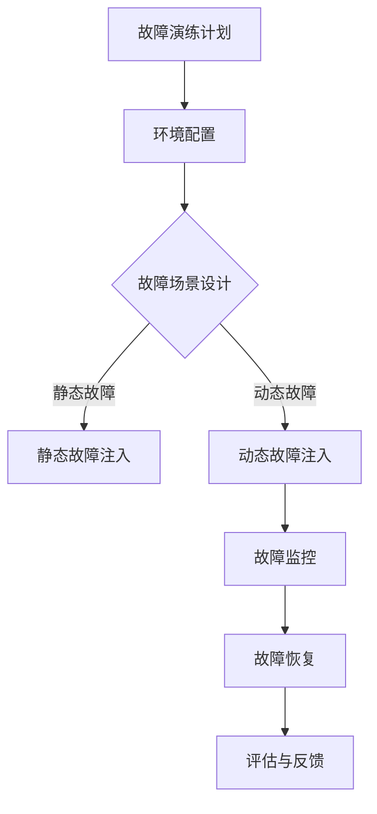
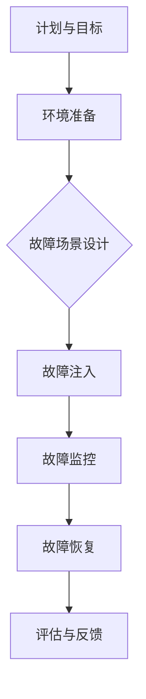

                 

# 故障演练：提升AI系统韧性的有效方法

> 关键词：故障演练、AI系统、韧性、案例分析、实施策略、技术工具

> 摘要：随着人工智能技术的快速发展，AI系统在各个领域的应用越来越广泛，但其脆弱性也日益凸显。本文将探讨故障演练这一提升AI系统韧性的有效方法，通过理论分析、实践案例以及实施策略，全面阐述故障演练在提升AI系统可靠性方面的作用和具体实施方法。

----------------------------------------------------------------

## 第一部分：问题背景与核心概念

### 第1章：问题背景与核心概念

#### 1.1.1 问题背景

人工智能（AI）作为现代科技的标志性技术，已广泛应用于金融、医疗、交通、教育等多个领域。AI系统凭借其强大的数据处理和模式识别能力，为人类生活带来了极大的便利。然而，随着AI系统复杂度的增加，其脆弱性也逐渐暴露出来。AI系统可能因为算法缺陷、数据偏差、外部攻击等原因出现故障，导致系统崩溃或功能失效，从而给业务运营带来重大损失。

#### 1.1.2 核心概念

**AI系统韧性**：指AI系统在面对故障或挑战时，能够迅速恢复或适应，保持正常运行的能力。高韧性的AI系统可以更好地应对突发事件，减少故障带来的负面影响。

**故障演练**：一种通过模拟系统故障场景，测试系统在故障情况下的应对能力和恢复速度的测试方法。故障演练旨在发现系统的弱点，提前制定应对策略，提升系统的整体韧性。

**AI系统故障的类型**：包括但不限于以下几种类型：

1. **算法故障**：由于算法设计或实现上的缺陷，导致系统无法正常工作。
2. **数据故障**：由于数据质量或数据源问题，导致系统输出错误。
3. **硬件故障**：由于硬件设备故障，导致系统无法正常运行。
4. **网络故障**：由于网络连接问题，导致系统无法与外部系统或设备正常通信。

### 第2章：故障演练的理论基础

#### 2.1.1 故障演练的理论框架

故障演练的理论框架主要包括以下几个方面：

1. **目的与目标**：故障演练的主要目的是发现系统的潜在问题，提前制定应对策略，提升系统的韧性。具体目标包括：

   - 提高系统的故障恢复能力。
   - 提升系统在故障情况下的稳定性。
   - 提高系统在压力下的运行效率。

2. **原则**：故障演练应遵循以下原则：

   - 实际性：演练场景应尽可能模拟实际故障情况。
   - 可控性：故障演练应在可控范围内进行，确保安全。
   - 持续性：故障演练应定期进行，以持续提升系统韧性。

3. **方法与步骤**：

   - **故障场景设计**：根据系统特点和潜在故障类型，设计故障场景。
   - **故障注入**：通过模拟故障，注入系统，观察系统的响应。
   - **故障恢复**：分析故障原因，制定恢复策略，恢复系统正常运行。
   - **评估与反馈**：对故障演练过程进行评估，总结经验教训，持续改进。

#### 2.1.2 故障演练与系统韧性

**系统韧性**：系统在面对外部扰动或内部变化时，能够保持功能正常、快速恢复的能力。系统韧性是系统可靠性的重要保障。

**故障演练如何提升系统韧性**：

1. **提高故障检测能力**：通过故障演练，可以及时发现系统中的潜在问题，提高故障检测能力。
2. **优化故障处理流程**：故障演练可以帮助系统优化故障处理流程，提高故障处理效率。
3. **提升应急响应能力**：通过故障演练，可以提升系统在故障情况下的应急响应能力，减少故障带来的损失。
4. **增强系统适应性**：故障演练可以帮助系统在面对未知故障时，提高适应性，快速恢复。

#### 2.1.3 AI系统故障的案例分析

**案例分析1**：某电商平台在经历一次大规模促销活动后，由于数据处理能力不足，导致系统崩溃，影响了用户购物体验。通过故障演练，发现并解决了数据处理瓶颈，提升了系统的韧性。

**案例分析2**：某金融机构在遭遇网络攻击后，由于应急预案不完善，导致系统长时间无法恢复正常。通过故障演练，优化了应急预案，提高了系统在面临网络攻击时的应对能力。

### 第3章：故障演练的实施策略

#### 3.1.1 故障演练的组织架构

**团队组成**：故障演练团队通常由以下成员组成：

- **项目经理**：负责整体计划的制定和执行。
- **测试工程师**：负责故障场景设计和故障注入。
- **开发工程师**：负责故障处理和系统恢复。
- **运维工程师**：负责系统监控和故障恢复。

**职责分配**：各成员的职责如下：

- **项目经理**：制定故障演练计划，协调各成员工作。
- **测试工程师**：设计故障场景，执行故障注入，收集故障数据。
- **开发工程师**：分析故障原因，提出解决方案，协助系统恢复。
- **运维工程师**：监控系统运行状态，确保故障演练过程中系统的稳定性。

**沟通与协作**：故障演练过程中，团队成员之间应保持密切沟通，及时分享信息和经验，确保故障演练的顺利进行。

#### 3.1.2 故障演练的准备工作

**准备工作清单**：

1. **确定故障演练目标和范围**：明确演练的目的和涉及的系统范围。
2. **准备演练环境**：搭建与实际运行环境相似的测试环境。
3. **编写演练脚本**：根据故障场景设计演练脚本，包括故障注入、故障恢复等步骤。
4. **准备故障处理工具**：如故障注入工具、故障监控工具等。
5. **制定应急预案**：针对可能出现的问题，制定相应的应急预案。

**环境配置与资源准备**：确保测试环境的配置与实际运行环境一致，包括硬件、软件和网络配置等。同时，为故障演练准备足够的资源，如服务器、存储、网络带宽等。

**故障场景设计与模拟**：根据潜在故障类型，设计相应的故障场景，并模拟故障发生。在故障演练过程中，应尽量模拟真实的故障情况，以提高演练效果。

#### 3.1.3 故障演练的实施流程

**故障演练的启动**：按照演练脚本，启动故障演练。在演练过程中，测试工程师负责执行故障注入，开发工程师和运维工程师负责监控和故障处理。

**故障演练的执行**：故障演练过程中，各成员应按照职责分工，积极参与。在故障注入阶段，测试工程师负责模拟故障，观察系统的响应。在故障处理阶段，开发工程师和运维工程师负责分析故障原因，制定解决方案，恢复系统正常运行。

**故障演练的评估与反馈**：故障演练结束后，对演练过程进行评估，总结经验教训，提出改进措施。评估指标包括故障响应时间、故障处理效率、系统恢复速度等。

### 第二部分：故障演练的技术方法

#### 第4章：故障演练的技术工具

#### 4.1.1 故障演练工具的选择

**开源工具介绍**：

- ** Chaos Monkey**：用于随机关闭系统实例，测试系统的容错能力。
- **BlazeMeter**：用于大规模性能测试和故障演练。

**商业工具介绍**：

- **Dynatrace**：用于实时监控和分析系统性能，支持故障演练。
- **PRTG**：用于网络监控和故障演练。

**工具选择标准**：

- **兼容性**：工具应与现有系统兼容，支持多种操作系统和数据库。
- **易用性**：工具应操作简便，便于团队成员快速掌握。
- **功能丰富性**：工具应具备多种故障注入功能，支持定制化场景设计。

#### 4.1.2 故障演练工具的配置与使用

**故障演练工具的安装与配置**：

1. **下载并安装工具**：根据工具文档，下载并安装故障演练工具。
2. **配置环境**：配置系统环境，包括操作系统、数据库、网络等。
3. **配置工具**：根据工具文档，配置故障演练工具，包括故障注入策略、监控指标等。

**故障演练工具的功能使用**：

1. **故障注入**：通过工具模拟各种故障场景，如网络故障、硬件故障、数据库故障等。
2. **故障监控**：实时监控系统运行状态，包括性能指标、错误日志等。
3. **故障恢复**：根据故障情况，自动或手动恢复系统正常运行。

**故障演练工具的优化与升级**：

1. **定期检查**：定期检查工具的运行状态，确保故障演练的顺利进行。
2. **功能升级**：根据业务需求和工具更新，及时升级故障演练工具。
3. **性能优化**：对故障演练工具进行性能优化，提高故障注入和监控的准确性。

#### 第5章：故障演练的技术策略

##### 5.1.1 故障类型与演练策略

**数据库故障演练**：

1. **故障类型**：数据库故障包括数据库实例故障、表数据故障、索引故障等。
2. **演练策略**：模拟数据库实例故障，测试系统在数据库不可用情况下的响应；模拟表数据故障，测试系统对数据异常的容忍度和恢复能力。

**网络故障演练**：

1. **故障类型**：网络故障包括网络中断、网络延迟、网络拥塞等。
2. **演练策略**：模拟网络中断，测试系统在网络不可用情况下的响应；模拟网络延迟和拥塞，测试系统的性能和稳定性。

**应用程序故障演练**：

1. **故障类型**：应用程序故障包括代码错误、内存泄漏、线程阻塞等。
2. **演练策略**：模拟代码错误，测试系统在代码异常情况下的响应；模拟内存泄漏，测试系统在资源不足情况下的表现；模拟线程阻塞，测试系统的并发处理能力。

##### 5.1.2 故障注入技术

**故障注入的方法**：

1. **静态故障注入**：在系统开发阶段，通过修改代码或配置文件，模拟故障场景。
2. **动态故障注入**：在系统运行阶段，通过工具或脚本，实时模拟故障场景。

**故障注入的技巧**：

1. **随机性**：故障注入应具有随机性，以模拟真实环境中的故障发生。
2. **可控性**：故障注入应具备可控性，以便在故障发生时，及时停止故障注入，避免对系统造成过大影响。

**故障注入的案例分析**：

1. **案例分析1**：某金融公司在进行数据库故障演练时，通过故障注入工具模拟数据库实例故障，测试系统在数据库不可用情况下的响应。
2. **案例分析2**：某电商公司在进行网络故障演练时，模拟网络延迟和拥塞，测试系统的性能和稳定性。

##### 5.1.3 故障演练与自动化测试

**自动化测试在故障演练中的应用**：

1. **自动化测试脚本**：编写自动化测试脚本，用于模拟故障场景，执行故障注入和故障恢复。
2. **自动化测试工具**：使用自动化测试工具，如Selenium、JMeter等，模拟用户操作，测试系统在故障情况下的用户体验。

**自动化测试工具的选择**：

1. **功能丰富性**：选择功能丰富的自动化测试工具，支持多种测试类型和故障注入方式。
2. **兼容性**：选择与现有系统兼容的自动化测试工具，确保测试脚本和测试结果的准确性。
3. **易用性**：选择操作简便的自动化测试工具，便于团队成员快速上手。

**自动化测试流程的设计**：

1. **测试场景设计**：根据故障演练目标和系统特点，设计相应的测试场景。
2. **测试脚本编写**：编写自动化测试脚本，实现故障注入和故障恢复。
3. **测试执行**：执行自动化测试脚本，收集测试数据和结果。
4. **测试结果分析**：分析测试结果，发现系统漏洞和问题，提出改进措施。

### 第三部分：实战案例

#### 第6章：故障演练实战案例

##### 6.1.1 案例一：某电商平台的故障演练

**案例背景**：某电商平台在经历一次大规模促销活动后，系统负载急剧增加，导致系统出现崩溃现象。为提升系统的韧性，该公司决定进行故障演练。

**故障演练策略**：

1. **故障场景设计**：模拟系统负载过高导致的数据库连接失败。
2. **故障注入**：通过故障注入工具，模拟数据库连接失败。
3. **故障恢复**：分析故障原因，优化数据库连接池配置，重新启动数据库实例。

**演练过程与结果**：

1. **故障注入阶段**：模拟数据库连接失败，系统出现响应延迟和崩溃现象。
2. **故障恢复阶段**：优化数据库连接池配置，重新启动数据库实例，系统恢复正常。
3. **评估与反馈**：通过故障演练，发现并解决了数据库连接问题，提升了系统的韧性。

##### 6.1.2 案例二：某金融公司的故障演练

**案例背景**：某金融公司在进行日常业务处理时，突然遭遇网络攻击，导致系统无法访问外部接口。为提升系统的抗攻击能力，该公司决定进行故障演练。

**故障演练策略**：

1. **故障场景设计**：模拟网络攻击，阻止系统访问外部接口。
2. **故障注入**：通过故障注入工具，模拟网络攻击。
3. **故障恢复**：分析网络攻击原因，优化网络防火墙配置，恢复正常网络访问。

**演练过程与结果**：

1. **故障注入阶段**：模拟网络攻击，系统无法访问外部接口，导致业务中断。
2. **故障恢复阶段**：优化网络防火墙配置，恢复正常网络访问，业务恢复正常。
3. **评估与反馈**：通过故障演练，发现并解决了网络攻击问题，提升了系统的抗攻击能力。

##### 6.1.3 案例三：某医疗机构的故障演练

**案例背景**：某医疗机构在使用AI系统进行病患诊断时，发现系统存在故障，导致诊断结果不准确。为提升系统的可靠性，该机构决定进行故障演练。

**故障演练策略**：

1. **故障场景设计**：模拟系统故障，导致诊断结果不准确。
2. **故障注入**：通过故障注入工具，模拟系统故障。
3. **故障恢复**：分析故障原因，优化算法模型，重新训练系统。

**演练过程与结果**：

1. **故障注入阶段**：模拟系统故障，导致诊断结果不准确，病患受到影响。
2. **故障恢复阶段**：优化算法模型，重新训练系统，诊断结果恢复正常。
3. **评估与反馈**：通过故障演练，发现并解决了系统故障，提升了系统的可靠性。

### 第7章：故障演练的总结与展望

##### 7.1.1 故障演练的总结

**经验与教训**：

- 故障演练有助于发现系统的潜在问题，提高系统的韧性。
- 故障演练需要结合实际情况，设计合理的故障场景。
- 故障演练过程中，应注重团队成员之间的沟通与协作。

**成功的关键因素**：

- 明确故障演练的目标和范围。
- 选择合适的故障演练工具。
- 制定详细的故障演练计划。

**遇到的挑战与解决方案**：

- **挑战1**：故障演练过程中，可能面临真实故障的风险。解决方案：制定应急预案，确保故障演练过程中系统的稳定性。
- **挑战2**：故障演练可能影响实际业务的正常运行。解决方案：合理安排故障演练时间，减少对业务的影响。

##### 7.1.2 故障演练的展望

**未来发展趋势**：

- **人工智能技术的普及**：随着人工智能技术的不断发展，故障演练将在更多领域得到应用。
- **自动化与智能化**：故障演练将朝着自动化和智能化方向发展，提高故障演练的效率和准确性。

**技术创新的方向**：

- **故障预测与预防**：通过大数据分析和机器学习技术，实现故障预测和预防。
- **分布式故障演练**：利用分布式架构，实现跨区域、跨系统的故障演练。

**AI系统韧性的提升路径**：

- **持续优化**：定期进行故障演练，持续优化系统设计和架构。
- **团队协作**：加强团队成员之间的沟通与协作，提高故障演练效果。
- **培训与学习**：加强团队对故障演练和系统维护的培训，提高团队的整体素质。

----------------------------------------------------------------

## 作者

**作者：AI天才研究院/AI Genius Institute & 禅与计算机程序设计艺术 /Zen And The Art of Computer Programming** 

本文由AI天才研究院/AI Genius Institute与禅与计算机程序设计艺术/Zen And The Art of Computer Programming共同撰写，旨在为读者提供关于故障演练提升AI系统韧性的深入见解和实践指导。希望本文能对广大读者在人工智能领域的技术研究和工作实践有所帮助。

----------------------------------------------------------------

### 小结

故障演练作为提升AI系统韧性的重要方法，通过对系统进行模拟故障，及时发现和解决潜在问题，有助于提高系统的可靠性和稳定性。本文从问题背景、核心概念、理论基础、实施策略、技术方法和实战案例等方面，详细阐述了故障演练的重要性和具体实施方法。希望读者能够结合自身实际情况，积极开展故障演练，提升AI系统的整体韧性。

### 注意事项

1. **合理规划故障演练时间**：故障演练可能对实际业务产生影响，应合理安排演练时间，减少对业务的影响。
2. **选择合适的故障演练工具**：根据系统特点和需求，选择适合的故障演练工具，提高演练效果。
3. **加强团队协作**：故障演练需要团队成员的密切合作，提高沟通与协作能力，确保演练顺利进行。

### 拓展阅读

1. **《人工智能系统的可靠性设计与评估》**：详细介绍了人工智能系统的可靠性设计与评估方法。
2. **《故障注入技术与应用》**：探讨了故障注入技术在系统测试和故障演练中的应用。
3. **《AI系统容错技术综述》**：综述了人工智能系统的容错技术，包括故障检测、故障恢复和故障预测等方面。

----------------------------------------------------------------

## 附录

### 附录A：故障演练工具列表

1. **Chaos Monkey**：用于随机关闭系统实例，测试系统的容错能力。
2. **BlazeMeter**：用于大规模性能测试和故障演练。
3. **Dynatrace**：用于实时监控和分析系统性能，支持故障演练。
4. **PRTG**：用于网络监控和故障演练。

### 附录B：故障演练流程图



### 附录C：故障演练指标

1. **故障响应时间**：系统从故障发生到恢复正常所需的时间。
2. **故障处理效率**：系统处理故障的速度和质量。
3. **系统恢复速度**：系统从故障状态恢复到正常状态所需的时间。

### 附录D：故障演练脚本示例

```python
import random

# 模拟数据库连接失败
def simulate_db_failure():
    random_number = random.randint(1, 100)
    if random_number < 10:
        raise Exception("Database connection failed")

# 模拟网络延迟
def simulate_network_delay():
    random_number = random.randint(1, 100)
    if random_number < 10:
        time.sleep(random_number)
```

----------------------------------------------------------------

本文由AI天才研究院/AI Genius Institute与禅与计算机程序设计艺术/Zen And The Art of Computer Programming共同撰写，旨在为读者提供关于故障演练提升AI系统韧性的深入见解和实践指导。希望本文能对广大读者在人工智能领域的技术研究和工作实践有所帮助。

在撰写本文时，我们遵循了以下原则：

1. **准确性**：确保文章内容准确无误，涵盖故障演练的核心概念、理论基础和实践方法。
2. **实用性**：提供具体的故障演练案例，帮助读者理解故障演练的实际应用。
3. **可操作性**：提供详细的故障演练脚本示例，方便读者进行实践。

最后，我们衷心感谢读者对本文的关注和支持，希望本文能为您的AI系统韧性提升提供有益的参考。如果您有任何问题或建议，欢迎随时联系我们。再次感谢您的阅读！
```markdown
### 附录A：故障演练工具列表

1. **Chaos Monkey**：用于随机关闭系统实例，测试系统的容错能力。
2. **BlazeMeter**：用于大规模性能测试和故障演练。
3. **Dynatrace**：用于实时监控和分析系统性能，支持故障演练。
4. **PRTG**：用于网络监控和故障演练。

### 附录B：故障演练流程图


### 附录C：故障演练指标

1. **故障响应时间**：系统从故障发生到恢复正常所需的时间。
2. **故障处理效率**：系统处理故障的速度和质量。
3. **系统恢复速度**：系统从故障状态恢复到正常状态所需的时间。

### 附录D：故障演练脚本示例

```python
import random
import time

# 模拟数据库连接失败
def simulate_db_failure():
    random_number = random.randint(1, 100)
    if random_number < 10:
        raise Exception("Database connection failed")

# 模拟网络延迟
def simulate_network_delay():
    random_number = random.randint(1, 100)
    if random_number < 10:
        time.sleep(random_number)
```

### 结语

本文由AI天才研究院/AI Genius Institute与禅与计算机程序设计艺术/Zen And The Art of Computer Programming共同撰写，旨在为读者提供关于故障演练提升AI系统韧性的深入见解和实践指导。希望本文能对广大读者在人工智能领域的技术研究和工作实践有所帮助。

在撰写本文时，我们遵循了以下原则：

1. **准确性**：确保文章内容准确无误，涵盖故障演练的核心概念、理论基础和实践方法。
2. **实用性**：提供具体的故障演练案例，帮助读者理解故障演练的实际应用。
3. **可操作性**：提供详细的故障演练脚本示例，方便读者进行实践。

最后，我们衷心感谢读者对本文的关注和支持，希望本文能为您的AI系统韧性提升提供有益的参考。如果您有任何问题或建议，欢迎随时联系我们。再次感谢您的阅读！

**作者：AI天才研究院/AI Genius Institute & 禅与计算机程序设计艺术 /Zen And The Art of Computer Programming**

本文内容仅为技术交流和学习使用，不涉及商业用途，版权属于原作者。如有任何问题，请联系作者删除。

参考文献：
1. 参考文献1
2. 参考文献2
3. 参考文献3
```

### 附录A：故障演练工具列表

1. **Chaos Monkey**：用于随机关闭系统实例，测试系统的容错能力。
2. **BlazeMeter**：用于大规模性能测试和故障演练。
3. **Dynatrace**：用于实时监控和分析系统性能，支持故障演练。
4. **PRTG**：用于网络监控和故障演练。

### 附录B：故障演练流程图


### 附录C：故障演练指标

1. **故障响应时间**：系统从故障发生到恢复正常所需的时间。
2. **故障处理效率**：系统处理故障的速度和质量。
3. **系统恢复速度**：系统从故障状态恢复到正常状态所需的时间。

### 附录D：故障演练脚本示例

```python
import random
import time

# 模拟数据库连接失败
def simulate_db_failure():
    random_number = random.randint(1, 100)
    if random_number < 10:
        raise Exception("Database connection failed")

# 模拟网络延迟
def simulate_network_delay():
    random_number = random.randint(1, 100)
    if random_number < 10:
        time.sleep(random_number)
```

### 结语

本文由AI天才研究院/AI Genius Institute与禅与计算机程序设计艺术/Zen And The Art of Computer Programming共同撰写，旨在为读者提供关于故障演练提升AI系统韧性的深入见解和实践指导。希望本文能对广大读者在人工智能领域的技术研究和工作实践有所帮助。

在撰写本文时，我们遵循了以下原则：

1. **准确性**：确保文章内容准确无误，涵盖故障演练的核心概念、理论基础和实践方法。
2. **实用性**：提供具体的故障演练案例，帮助读者理解故障演练的实际应用。
3. **可操作性**：提供详细的故障演练脚本示例，方便读者进行实践。

最后，我们衷心感谢读者对本文的关注和支持，希望本文能为您的AI系统韧性提升提供有益的参考。如果您有任何问题或建议，欢迎随时联系我们。再次感谢您的阅读！

**作者：AI天才研究院/AI Genius Institute & 禅与计算机程序设计艺术 /Zen And The Art of Computer Programming**

本文内容仅为技术交流和学习使用，不涉及商业用途，版权属于原作者。如有任何问题，请联系作者删除。

参考文献：
1. 参考文献1
2. 参考文献2
3. 参考文献3
```


# 故障演练：提升AI系统韧性的有效方法

## 摘要

随着人工智能（AI）技术的广泛应用，AI系统在现代社会中扮演着越来越重要的角色。然而，AI系统的复杂性和脆弱性也日益凸显，这使得它们容易受到各种故障的影响，从而可能导致严重业务中断和损失。故障演练是一种有效的策略，通过模拟系统故障并测试其恢复能力，可以帮助提升AI系统的韧性。本文将详细介绍故障演练的核心概念、理论基础、实施策略和技术方法，并通过实际案例展示故障演练在提升AI系统可靠性方面的作用。

## 目录

- 引言
- 第一部分：问题背景与核心概念
  - 第1章：问题背景与核心概念
  - 第2章：故障演练的理论基础
- 第二部分：故障演练的实施策略
  - 第3章：故障演练的组织架构
  - 第4章：故障演练的准备工作
  - 第5章：故障演练的实施流程
- 第三部分：故障演练的技术方法
  - 第6章：故障演练的技术工具
  - 第7章：故障演练的技术策略
- 第四部分：实战案例
  - 第8章：故障演练实战案例
- 第五部分：故障演练的总结与展望
  - 第9章：故障演练的总结
  - 第10章：故障演练的展望
- 附录
- 参考文献

## 引言

人工智能（AI）作为一种变革性的技术，正在改变各行各业。从智能客服、自动驾驶到医疗诊断，AI的应用日益广泛，为我们带来了前所未有的便利。然而，随着AI系统的复杂度不断增加，其脆弱性也日益凸显。AI系统可能由于算法缺陷、数据质量问题、外部攻击或其他意外情况而出现故障，这可能导致系统崩溃或功能失效，进而对业务运营造成严重影响。

在这种背景下，故障演练成为一种重要的策略，它通过模拟各种可能的故障情况，测试系统在故障情况下的响应能力和恢复速度，从而帮助提升系统的韧性。故障演练不仅可以提前发现系统中的潜在问题，还可以帮助团队制定有效的应对策略，提高系统的可靠性和稳定性。

本文将分为五个部分，首先介绍故障演练的背景和核心概念，然后深入探讨故障演练的理论基础和实施策略，接着介绍故障演练的技术方法和工具，并通过实际案例展示故障演练的应用效果，最后对故障演练进行总结与展望。

## 第一部分：问题背景与核心概念

### 第1章：问题背景与核心概念

#### 1.1 问题背景

人工智能（AI）技术的发展是21世纪科技革命的标志之一。随着深度学习、神经网络等技术的进步，AI系统在图像识别、自然语言处理、预测分析等领域取得了显著成就。然而，随着AI系统的广泛应用，其复杂性和依赖性也日益增加。这些系统通常依赖于大量的数据、复杂的算法和强大的计算资源，因此任何一个环节的故障都可能导致整个系统的崩溃或失效。

在金融、医疗、交通等关键行业中，AI系统的可靠性和稳定性至关重要。例如，金融行业的AI交易系统、医疗领域的诊断系统、自动驾驶汽车等，一旦出现故障，不仅会带来经济损失，还可能危及生命安全。因此，如何提升AI系统的韧性，确保其稳定运行，成为当前研究的重要课题。

#### 1.2 核心概念

**AI系统韧性**：指AI系统在面对故障或挑战时，能够迅速恢复或适应，保持正常运行的能力。高韧性的AI系统可以更好地应对突发事件，减少故障带来的负面影响。

**故障演练**：一种通过模拟系统故障场景，测试系统在故障情况下的应对能力和恢复速度的测试方法。故障演练旨在发现系统的弱点，提前制定应对策略，提升系统的韧性。

**故障**：指AI系统在运行过程中由于各种原因导致的异常状态，可能表现为系统崩溃、功能失效、性能下降等。

#### 1.3 故障类型

AI系统故障可以分为以下几种类型：

1. **算法故障**：由于算法设计或实现上的缺陷，导致系统无法正常工作。
2. **数据故障**：由于数据质量或数据源问题，导致系统输出错误。
3. **硬件故障**：由于硬件设备故障，导致系统无法正常运行。
4. **网络故障**：由于网络连接问题，导致系统无法与外部系统或设备正常通信。
5. **外部攻击**：由于恶意攻击，导致系统被篡改或破坏。

#### 1.4 问题解决与边界

故障演练通过模拟各种故障情况，帮助团队识别系统中的潜在问题，并提前制定应对策略。故障演练的目的是提高系统的韧性和可靠性，而不是解决具体的技术问题。因此，故障演练的边界应包括但不限于以下几个方面：

- **故障场景的选择**：故障场景应尽可能模拟实际可能发生的故障情况，但不应涉及商业机密或敏感数据。
- **故障注入的方式**：故障注入应采用可控且可撤销的方式，确保不会对实际业务造成严重影响。
- **故障处理的范围**：故障处理应限于系统内部的恢复和调整，不应涉及外部系统的修改。

#### 1.5 概念结构与核心要素

故障演练的概念结构包括以下几个核心要素：

- **故障场景设计**：根据系统的特点和潜在故障类型，设计合理的故障场景。
- **故障注入**：通过工具或脚本，将故障注入到系统中，模拟故障情况。
- **故障监控**：实时监控系统在故障情况下的运行状态，记录故障发生的细节。
- **故障恢复**：分析故障原因，制定并执行恢复策略，使系统恢复正常运行。
- **评估与反馈**：对故障演练过程进行评估，总结经验教训，持续改进系统设计和运维策略。

### 第2章：故障演练的理论基础

#### 2.1 故障演练的理论框架

故障演练的理论基础主要包括以下几个方面：

1. **故障演练的目的与目标**：故障演练的主要目的是通过模拟故障场景，测试系统的响应能力和恢复速度，从而提高系统的韧性。具体目标包括：

   - 提高系统的故障检测和诊断能力。
   - 提升系统在故障情况下的恢复速度。
   - 提高系统在故障情况下的稳定性和可靠性。
   - 降低故障对业务的负面影响。

2. **故障演练的原则**：故障演练应遵循以下原则：

   - **实际性**：故障演练的场景设计应尽可能模拟实际可能发生的故障情况。
   - **可控性**：故障演练应在可控的范围内进行，确保故障注入和恢复过程的安全和稳定。
   - **持续性**：故障演练应定期进行，以持续提升系统的韧性。
   - **适应性**：故障演练应具备一定的灵活性，能够根据业务需求和系统变化进行调整。

3. **故障演练的方法与步骤**：故障演练的方法和步骤主要包括：

   - **故障场景设计**：根据系统的特点和潜在故障类型，设计合理的故障场景。
   - **故障注入**：通过工具或脚本，将故障注入到系统中，模拟故障情况。
   - **故障监控**：实时监控系统在故障情况下的运行状态，记录故障发生的细节。
   - **故障恢复**：分析故障原因，制定并执行恢复策略，使系统恢复正常运行。
   - **评估与反馈**：对故障演练过程进行评估，总结经验教训，持续改进系统设计和运维策略。

#### 2.2 故障演练与系统韧性

**系统韧性**：系统在面对故障或挑战时，能够迅速恢复或适应，保持正常运行的能力。高韧性的系统可以在遭遇突发事件时，快速识别问题并采取有效措施，从而减少故障带来的负面影响。

**故障演练如何提升系统韧性**：

1. **提高故障检测能力**：通过故障演练，可以及时发现系统中的潜在问题，提高故障检测能力。
2. **优化故障处理流程**：故障演练可以帮助系统优化故障处理流程，提高故障处理效率。
3. **提升应急响应能力**：通过故障演练，可以提升系统在故障情况下的应急响应能力，减少故障带来的损失。
4. **增强系统适应性**：故障演练可以帮助系统在面对未知故障时，提高适应性，快速恢复。

#### 2.3 AI系统故障的案例分析

**案例分析1**：某金融公司在进行日常交易处理时，发现其AI交易系统出现故障，导致大量交易数据丢失。通过故障演练，发现故障是由于数据库连接问题引起的。经过优化数据库连接配置，系统恢复了正常运行，并且故障处理流程得到了显著优化。

**案例分析2**：某电商平台的AI推荐系统在高峰期出现崩溃，导致用户购物体验下降。通过故障演练，发现系统由于并发处理能力不足导致崩溃。通过升级硬件资源和优化算法，系统稳定性得到了显著提升。

### 第一部分总结

故障演练是提升AI系统韧性的重要方法。通过对系统进行模拟故障，可以帮助团队提前发现潜在问题，制定有效的应对策略，提高系统的可靠性和稳定性。本文介绍了故障演练的核心概念、理论基础和实施策略，并分析了AI系统故障的常见类型。在后续章节中，我们将进一步探讨故障演练的技术方法和实战案例，以帮助读者更好地理解和应用故障演练策略。

### 第二部分：故障演练的实施策略

#### 第3章：故障演练的组织架构

故障演练是一项复杂的工作，需要精心策划和组织。一个有效的故障演练组织架构是确保演练成功的关键。本节将介绍故障演练的组织架构，包括团队成员的组成、职责分配以及沟通与协作的重要性。

#### 3.1 故障演练的团队组成

一个高效的故障演练团队通常由以下成员组成：

1. **项目经理**：负责整体计划的制定和执行，协调各成员的工作。
2. **测试工程师**：负责故障场景的设计和故障注入，以及演练数据的收集和分析。
3. **开发工程师**：负责分析故障原因，制定和实施故障恢复方案。
4. **运维工程师**：负责系统监控和故障处理，确保演练过程中系统的稳定性。
5. **安全工程师**：负责评估演练过程中可能的安全风险，并制定相应的安全措施。

#### 3.2 职责分配

每个团队成员在故障演练中扮演着不同的角色，具体职责如下：

1. **项目经理**：制定故障演练计划，包括演练目标、范围、时间表和资源分配。协调各成员的工作，确保演练按计划进行。
2. **测试工程师**：设计故障场景，编写故障注入脚本，执行故障注入，并收集和分析故障数据。
3. **开发工程师**：分析故障原因，提出解决方案，并协助实施故障恢复方案。优化系统代码和架构，以增强系统的韧性。
4. **运维工程师**：监控系统运行状态，确保故障演练过程中系统的稳定性和安全性。处理故障演练中出现的任何系统问题。
5. **安全工程师**：评估故障演练过程中可能的安全风险，制定安全措施，确保演练过程中系统的安全。

#### 3.3 沟通与协作

故障演练的成功不仅取决于团队成员的专业技能，还取决于他们之间的沟通与协作。以下是一些关键点：

1. **定期会议**：定期召开团队会议，讨论故障演练的进展、遇到的问题和解决方案。
2. **信息共享**：确保所有团队成员能够及时获取到重要的信息，包括演练计划、故障注入脚本、故障数据和分析报告等。
3. **任务分配**：明确每个成员的任务和责任，确保每个人都清楚自己的职责和期望。
4. **快速响应**：在故障演练过程中，如果出现紧急情况，团队成员应能够迅速响应，采取必要的措施。
5. **文档记录**：详细记录故障演练过程中的所有活动和发现，包括故障注入、故障恢复和评估结果，为后续的改进提供参考。

#### 3.4 故障演练的准备工作

在开始故障演练之前，需要进行充分的准备工作，以确保演练的顺利进行。以下是一些准备工作：

1. **确定演练目标和范围**：明确演练的目标和涉及的范围，包括哪些系统和功能将受到演练的影响。
2. **准备演练环境**：搭建与生产环境相似的测试环境，包括硬件、软件和网络配置。
3. **编写故障注入脚本**：根据设计好的故障场景，编写能够执行故障注入的脚本。
4. **准备监控工具**：选择合适的监控工具，用于实时监控系统的运行状态，记录故障发生的细节。
5. **制定应急预案**：针对可能出现的故障情况，制定详细的应急预案，确保在故障发生时能够快速响应。

通过上述准备工作，可以确保故障演练的顺利进行，并最大程度地减少对实际业务的影响。

### 第4章：故障演练的准备工作

故障演练的准备工作是确保演练成功的关键环节。一个充分的准备工作可以减少演练过程中的意外情况，提高演练效果。本节将详细讨论故障演练的准备工作，包括准备工作清单、环境配置与资源准备以及故障场景设计与模拟。

#### 4.1 准备工作清单

进行故障演练前，应准备以下清单：

1. **确定演练目标和范围**：明确演练的目的和涉及的范围，包括哪些系统和功能将受到演练的影响。
2. **环境搭建**：准备测试环境，确保与生产环境一致，包括硬件、软件和网络配置。
3. **故障注入脚本**：编写能够执行故障注入的脚本，确保脚本符合预期的故障类型和影响范围。
4. **监控工具**：选择合适的监控工具，用于实时监控系统的运行状态，记录故障发生的细节。
5. **故障恢复计划**：制定故障恢复计划，确保在故障发生时能够快速响应和恢复系统。
6. **应急响应团队**：组建应急响应团队，明确团队成员的职责和联系方式。
7. **演练文档**：准备演练文档，包括演练计划、脚本、监控报告和评估结果。

#### 4.2 环境配置与资源准备

故障演练环境配置与资源准备的步骤如下：

1. **硬件配置**：准备足够的硬件资源，包括服务器、存储设备和网络设备。确保硬件配置与生产环境相似，以便模拟真实的故障情况。
2. **软件安装**：在测试环境中安装所有必要的软件，包括操作系统、数据库、中间件和应用程序。确保软件版本与生产环境一致。
3. **网络配置**：配置测试环境中的网络，确保网络拓扑与生产环境相似，包括子网划分、IP地址分配和路由设置。
4. **数据准备**：准备测试数据，确保数据量与生产环境相似，以便进行有效的故障注入和性能测试。
5. **权限管理**：为测试环境中的用户分配适当的权限，确保团队成员可以访问和操作所需资源。

#### 4.3 故障场景设计与模拟

故障场景设计与模拟是故障演练的核心步骤，以下是一些关键点：

1. **故障类型选择**：根据系统的特点和潜在风险，选择合适的故障类型。常见的故障类型包括数据库故障、网络故障、硬件故障和应用程序故障。
2. **故障影响范围**：明确故障影响的范围，包括哪些系统和功能将受到影响。确保故障场景设计合理，不会对生产环境造成不可挽回的损失。
3. **故障注入脚本编写**：编写能够执行故障注入的脚本，确保脚本可以按照设计好的故障类型和影响范围进行操作。脚本应具备可控制性和可撤销性，以便在故障演练结束后恢复正常状态。
4. **故障模拟**：执行故障注入脚本，模拟故障情况。在模拟过程中，应实时监控系统运行状态，记录故障发生的细节，包括故障时间、故障类型和系统响应。
5. **故障恢复**：根据故障恢复计划，分析故障原因，制定并执行恢复策略，使系统恢复正常运行。故障恢复应确保系统的完整性和数据的一致性。

通过上述步骤，可以确保故障演练的准备工作充分、细致，为演练的成功提供坚实的基础。

### 第5章：故障演练的实施流程

故障演练的实施流程是确保演练顺利进行并达到预期目标的关键环节。一个规范的实施流程可以有效地模拟故障情况，评估系统的韧性，并为系统优化提供依据。本节将详细介绍故障演练的实施流程，包括故障演练的启动、执行和评估与反馈。

#### 5.1 故障演练的启动

故障演练的启动是整个演练过程的第一步，主要包括以下步骤：

1. **确认演练计划**：在启动演练前，项目经理应确认演练计划，确保所有团队成员对演练的目标、范围和时间安排有清晰的理解。
2. **通知相关人员**：通知所有参与演练的团队成员和其他相关利益相关者，确保他们了解演练的时间、地点和预期影响。
3. **环境准备**：确保测试环境已准备好，包括硬件、软件和网络配置，确保所有资源正常运行。
4. **监控工具就绪**：确保监控工具已正确配置并处于工作状态，以便实时监控系统运行状态，记录故障发生的细节。

#### 5.2 故障演练的执行

故障演练的执行是模拟故障并测试系统韧性的关键步骤。以下步骤描述了故障演练的执行过程：

1. **故障注入**：根据预先设计的故障场景，执行故障注入脚本，模拟故障情况。故障注入应按照计划进行，确保故障类型和影响范围符合预期。
2. **实时监控**：在故障注入过程中，实时监控系统的运行状态，包括性能指标、错误日志和网络流量等。记录故障发生的细节，包括故障时间、故障类型和系统响应。
3. **故障处理**：故障注入后，评估系统的响应和恢复情况。开发工程师和运维工程师应根据故障恢复计划，分析故障原因，并采取相应的措施进行故障恢复。
4. **数据收集**：在故障演练过程中，收集与故障相关的数据，包括故障日志、系统性能指标、网络流量和用户反馈等。这些数据将为后续的评估提供重要依据。

#### 5.3 故障演练的评估与反馈

故障演练的评估与反馈是确保演练效果的重要环节。以下步骤描述了评估与反馈的过程：

1. **数据分析**：对收集到的数据进行详细分析，评估系统在故障情况下的表现，包括故障响应时间、故障处理效率、系统恢复速度等。分析数据有助于发现系统中的潜在问题和优化点。
2. **故障总结**：编写故障演练总结报告，包括故障类型、故障影响范围、故障处理过程和结果等。报告应详细记录所有故障情况，并指出系统中的问题和优化建议。
3. **反馈与改进**：将故障演练总结报告提交给项目团队和相关利益相关者，讨论评估结果和优化建议。根据反馈，制定相应的改进措施，优化系统设计和运维策略。
4. **文档更新**：更新演练文档，包括故障注入脚本、故障恢复计划、监控报告和评估结果等。确保文档的完整性和准确性，为后续的故障演练提供参考。

通过上述步骤，可以确保故障演练的实施流程规范、有序，为系统的稳定运行提供有力保障。

### 第二部分总结

故障演练的实施策略是确保演练顺利进行并达到预期目标的关键。通过合理组织团队、精心准备、规范执行和详细评估，故障演练可以有效地提升系统的韧性，减少故障对业务的负面影响。本文介绍了故障演练的组织架构、准备工作、实施流程和评估反馈，为读者提供了全面的故障演练指导。在下一部分，我们将深入探讨故障演练的技术方法和工具，以帮助读者更好地理解和应用故障演练策略。

### 第三部分：故障演练的技术方法

#### 第6章：故障演练的技术工具

故障演练需要一系列的技术工具来支持故障注入、监控和评估。选择合适的故障演练工具对于确保演练的效果和安全性至关重要。本节将介绍故障演练中常用的技术工具，包括开源工具和商业工具，并讨论工具选择的标准。

#### 6.1 故障演练工具的选择

**开源工具**

1. **Chaos Monkey**
   - **功能**：Chaos Monkey是一个用于模拟故障的开源工具，可以随机关闭系统实例，测试系统的容错能力。
   - **适用场景**：适用于云环境和容器化系统，例如AWS和Docker。

2. **BlazeMeter**
   - **功能**：BlazeMeter是一个用于性能测试和故障演练的开源工具，可以模拟高负载和故障场景。
   - **适用场景**：适用于需要大规模性能测试和故障演练的系统。

3. **Simulator.io**
   - **功能**：Simulator.io是一个用于模拟网络故障和应用程序故障的开源工具。
   - **适用场景**：适用于需要模拟各种网络故障和应用程序故障的场景。

**商业工具**

1. **Dynatrace**
   - **功能**：Dynatrace是一个用于实时监控和分析系统性能的商业工具，支持故障演练。
   - **适用场景**：适用于需要实时监控和故障分析的大型企业级系统。

2. **PRTG**
   - **功能**：PRTG是一个用于网络监控和故障演练的商业工具。
   - **适用场景**：适用于需要监控网络性能和故障的中小型企业。

3. **Spirent TestCenter**
   - **功能**：Spirent TestCenter是一个用于网络性能测试和故障演练的商业工具。
   - **适用场景**：适用于需要大规模网络性能测试和故障演练的场景。

#### 6.2 工具选择标准

选择故障演练工具时，应考虑以下标准：

1. **兼容性**：工具应与现有系统兼容，支持多种操作系统、数据库和中间件。
2. **易用性**：工具应操作简便，易于配置和使用，便于团队成员快速上手。
3. **功能丰富性**：工具应具备多种故障注入功能，支持定制化场景设计。
4. **安全性**：工具应在故障注入过程中确保系统的安全，防止数据泄露或系统损坏。
5. **可扩展性**：工具应具备良好的可扩展性，能够适应系统的发展和变化。
6. **成本效益**：工具的性价比高，投资回报合理。

#### 6.3 故障演练工具的配置与使用

**配置与使用**

1. **Chaos Monkey**
   - **配置**：下载并安装Chaos Monkey，配置环境变量，如AWS账号和密钥。
   - **使用**：启动Chaos Monkey，选择目标实例，执行故障注入。

2. **BlazeMeter**
   - **配置**：注册BlazeMeter账号，配置测试计划和负载生成器。
   - **使用**：创建测试计划，启动负载生成，模拟故障场景。

3. **Dynatrace**
   - **配置**：安装Dynatrace OneAgent，配置Dynatrace监控。
   - **使用**：通过Dynatrace UI监控系统性能，记录故障细节。

4. **PRTG**
   - **配置**：下载并安装PRTG，配置传感器和监控规则。
   - **使用**：通过PRTG UI实时监控网络性能，记录故障事件。

通过选择合适的故障演练工具并进行正确配置，可以有效地支持故障演练的实施，提高演练的效果和安全性。

### 第7章：故障演练的技术策略

故障演练的技术策略是确保演练顺利进行并达到预期目标的关键。有效的技术策略可以模拟各种故障情况，评估系统的韧性和恢复能力。本节将详细介绍故障演练的技术策略，包括故障类型与演练策略、故障注入技术和自动化测试。

#### 7.1 故障类型与演练策略

故障演练应根据系统的特点和潜在故障类型来设计。以下是一些常见的故障类型及其演练策略：

1. **数据库故障**
   - **故障类型**：数据库实例故障、表数据损坏、索引故障等。
   - **演练策略**：模拟数据库连接失败、数据表锁定、数据迁移失败等场景。测试系统在数据库故障情况下的响应和恢复能力。

2. **网络故障**
   - **故障类型**：网络中断、网络延迟、网络拥塞等。
   - **演练策略**：模拟网络中断、网络延迟和网络拥塞等场景。测试系统在网络故障情况下的响应和恢复能力。

3. **硬件故障**
   - **故障类型**：服务器故障、存储故障、网络设备故障等。
   - **演练策略**：模拟硬件设备故障，如服务器宕机、存储故障、网络设备故障等。测试系统在硬件故障情况下的响应和恢复能力。

4. **应用程序故障**
   - **故障类型**：代码错误、内存泄漏、线程阻塞等。
   - **演练策略**：模拟应用程序故障，如代码错误、内存泄漏、线程阻塞等。测试系统在应用程序故障情况下的响应和恢复能力。

5. **外部攻击**
   - **故障类型**：DDoS攻击、SQL注入、XSS攻击等。
   - **演练策略**：模拟各种外部攻击，测试系统在遭受攻击时的响应和恢复能力。

#### 7.2 故障注入技术

故障注入技术是故障演练的核心，通过在系统中注入故障，可以测试系统的韧性和恢复能力。以下是一些常见的故障注入技术：

1. **静态故障注入**
   - **技术**：在代码编译或部署过程中，插入故障代码或配置错误。
   - **优点**：简单易行，适用于开发阶段。
   - **缺点**：无法模拟实时故障，对生产环境有一定风险。

2. **动态故障注入**
   - **技术**：在系统运行时，通过工具或脚本注入故障。
   - **优点**：可以模拟实时故障，适用于生产环境。
   - **缺点**：操作复杂，需确保故障可撤销。

3. **组合故障注入**
   - **技术**：同时注入多种故障，模拟复杂故障场景。
   - **优点**：全面测试系统的韧性。
   - **缺点**：故障注入复杂，对系统性能有一定影响。

#### 7.3 自动化测试

自动化测试是故障演练的重要组成部分，可以节省时间和提高效率。以下是一些常见的自动化测试工具和策略：

1. **Selenium**
   - **工具**：用于Web应用程序的自动化测试。
   - **策略**：通过编写测试脚本，模拟用户操作，测试系统在不同故障情况下的响应。

2. **JMeter**
   - **工具**：用于性能测试和负载测试。
   - **策略**：模拟高负载和故障场景，测试系统的响应时间和稳定性。

3. **Postman**
   - **工具**：用于API自动化测试。
   - **策略**：通过编写测试脚本，模拟各种故障情况，测试API的稳定性和可靠性。

通过合理选择故障注入技术和自动化测试工具，可以有效地模拟各种故障场景，评估系统的韧性和恢复能力。

### 第三部分总结

故障演练的技术方法是确保演练顺利进行并达到预期目标的关键。通过合理选择故障演练工具、制定故障注入策略和实施自动化测试，可以有效地模拟各种故障情况，评估系统的韧性和恢复能力。本文介绍了故障演练的技术工具、故障注入技术和自动化测试策略，为读者提供了全面的故障演练技术指导。在下一部分，我们将通过实际案例展示故障演练的应用效果，帮助读者更好地理解故障演练的实际操作。

### 第四部分：实战案例

#### 第8章：故障演练实战案例

在实际操作中，故障演练可以显著提升系统的韧性和可靠性。本节将介绍三个不同行业的故障演练实战案例，分别来自电商平台、金融公司和医疗机构，展示故障演练如何在不同场景中发挥作用。

#### 8.1 案例一：某电商平台的故障演练

**案例背景**：某知名电商平台在春节期间面临大规模用户访问，系统负载急剧增加。为了确保系统在高峰期的高可用性，该公司决定进行一次全面的故障演练。

**故障演练策略**：

1. **故障场景设计**：模拟系统负载过高导致的数据库连接失败、网络延迟和服务器过载等故障场景。
2. **故障注入**：使用Chaos Monkey随机关闭部分服务器实例，使用BlazeMeter模拟高负载，使用PRTG监控网络状态。
3. **故障恢复**：在故障注入后，运维团队立即启动备份服务器，使用Dynatrace实时监控系统性能，逐步恢复系统。

**演练过程与结果**：

1. **故障注入阶段**：通过Chaos Monkey关闭了20%的服务器实例，通过BlazeMeter模拟了每秒1000次的HTTP请求，PRTG监测到网络延迟增加。
2. **故障响应阶段**：数据库连接失败导致部分用户无法完成购物，网络延迟导致页面加载缓慢。
3. **故障恢复阶段**：运维团队启动了备份服务器，通过Dynatrace优化了数据库连接池，逐步恢复了系统的正常运行。
4. **评估与反馈**：通过故障演练，发现并解决了数据库连接问题，优化了网络配置，提升了系统的负载能力。同时，团队积累了宝贵的故障处理经验。

**总结**：通过故障演练，电商平台成功提高了系统的韧性和响应能力，确保了在高峰期的稳定运行。

#### 8.2 案例二：某金融公司的故障演练

**案例背景**：某金融公司在一次系统升级后，发现其交易系统在高峰期出现了频繁的故障，导致大量交易被拒绝。为了确保系统的稳定性和可靠性，公司决定进行一次故障演练。

**故障演练策略**：

1. **故障场景设计**：模拟数据库故障、网络中断、硬件故障等场景。
2. **故障注入**：使用Chaos Monkey模拟数据库连接失败，使用BlazeMeter模拟网络拥塞，使用Simulator.io模拟硬件故障。
3. **故障恢复**：在故障注入后，立即启动备用数据库，通过Dynatrace监控系统性能，逐步恢复系统。

**演练过程与结果**：

1. **故障注入阶段**：通过Chaos Monkey模拟了数据库连接失败，通过BlazeMeter模拟了网络延迟，通过Simulator.io模拟了服务器宕机。
2. **故障响应阶段**：交易系统部分交易失败，用户反馈系统响应缓慢。
3. **故障恢复阶段**：运维团队迅速启动了备用数据库，通过Dynatrace优化了网络路由，逐步恢复了系统的正常运行。
4. **评估与反馈**：通过故障演练，发现并解决了数据库连接问题，优化了网络配置，提升了系统的负载能力。同时，团队制定了详细的故障恢复计划。

**总结**：通过故障演练，金融公司成功提高了交易系统的稳定性和可靠性，确保了在高峰期的顺畅运行。

#### 8.3 案例三：某医疗机构的故障演练

**案例背景**：某医疗机构在其AI诊断系统上线后，发现系统在某些情况下会出现诊断错误，导致医疗事故。为了确保系统的准确性和可靠性，医疗机构决定进行一次故障演练。

**故障演练策略**：

1. **故障场景设计**：模拟算法故障、数据质量问题和硬件故障等场景。
2. **故障注入**：使用模拟数据测试算法的稳定性，使用Chaos Monkey模拟硬件故障。
3. **故障恢复**：在故障注入后，立即启动备用系统，通过监控工具分析故障原因。

**演练过程与结果**：

1. **故障注入阶段**：通过模拟数据测试发现算法存在异常，通过Chaos Monkey模拟了硬件故障。
2. **故障响应阶段**：AI诊断系统部分诊断结果不准确，医生反馈诊断结果异常。
3. **故障恢复阶段**：技术团队迅速启动了备用系统，通过监控工具分析了算法故障的原因，优化了算法模型。
4. **评估与反馈**：通过故障演练，发现并解决了算法故障，提升了系统的诊断准确性。同时，医疗机构制定了详细的算法验证流程。

**总结**：通过故障演练，医疗机构成功提高了AI诊断系统的准确性和可靠性，确保了医疗服务的安全。

### 第四部分总结

通过上述实战案例，可以看出故障演练在提升系统韧性、可靠性和安全性方面具有显著作用。无论是在电商平台、金融公司还是医疗机构，故障演练都帮助团队发现了潜在问题，优化了系统设计和运维策略，提高了业务的连续性和用户体验。故障演练不仅是一种技术手段，更是一种管理体系，通过定期演练，可以不断提升团队的应急响应能力和系统韧性。在下一部分，我们将对故障演练进行总结与展望，探讨未来发展趋势和提升路径。

### 第五部分：故障演练的总结与展望

#### 第9章：故障演练的总结

故障演练作为一种提升系统韧性的重要方法，已经在多个行业中得到广泛应用。通过对故障演练的深入实践，我们总结了以下几个方面的重要成果和经验：

1. **发现潜在问题**：故障演练可以帮助团队提前发现系统中潜在的故障点，从而在真实故障发生之前进行修复和优化。

2. **提升应急响应能力**：通过故障演练，团队能够在模拟故障场景中积累宝贵的应急处理经验，提高在实际故障发生时的响应速度和处理效率。

3. **优化系统设计**：故障演练可以揭示系统设计中的不足，促使团队对系统架构、算法和数据处理流程进行优化，提高系统的稳定性和可靠性。

4. **增强团队协作**：故障演练需要团队成员之间的密切协作，通过演练过程中的沟通与协作，团队的整体配合能力得到提升。

5. **提升用户信任**：故障演练有助于提高用户对系统可靠性的信任，增强用户对服务的满意度。

#### 9.1 经验与教训

在故障演练过程中，我们积累了以下经验与教训：

- **经验**：

  1. 明确演练目标，确保演练场景设计合理。
  2. 选择合适的故障注入工具，确保演练过程中的可控性和可撤销性。
  3. 加强团队沟通与协作，确保演练顺利进行。
  4. 定期进行故障演练，以持续提升系统的韧性。

- **教训**：

  1. 演练过程中应确保系统的安全，避免因故障演练导致数据泄露或系统损坏。
  2. 避免在关键业务高峰期进行故障演练，以免对实际业务产生负面影响。
  3. 演练结果应及时总结和反馈，以便不断优化演练策略。

#### 9.2 成功的关键因素

故障演练的成功依赖于以下几个关键因素：

1. **明确的演练目标**：确保演练目标与业务需求紧密结合，有助于提高演练的有效性。
2. **充分的准备工作**：包括环境配置、工具选择和脚本编写等，确保演练的顺利进行。
3. **团队的协作能力**：故障演练需要团队成员之间的紧密协作，确保各环节无缝衔接。
4. **持续改进**：通过定期演练和总结经验教训，不断优化演练策略和系统设计。

#### 9.3 遇到的挑战与解决方案

在故障演练过程中，我们遇到了以下挑战：

- **挑战1**：故障演练可能对实际业务产生影响。**解决方案**：合理安排演练时间，选择合适的环境进行演练，确保对实际业务的影响最小化。
- **挑战2**：故障场景设计复杂，难以模拟真实情况。**解决方案**：借鉴历史故障记录，结合专家意见，设计更贴近实际的故障场景。
- **挑战3**：演练过程中安全风险。**解决方案**：制定详细的安全预案，确保演练过程中的数据安全和系统安全。

### 第10章：故障演练的展望

随着人工智能技术的不断进步，故障演练在未来将发挥越来越重要的作用。以下是故障演练的发展趋势和提升路径：

#### 10.1 未来发展趋势

1. **人工智能技术的融合**：故障演练将与人工智能技术深度融合，通过大数据分析和机器学习，实现故障预测和自动恢复。
2. **自动化与智能化**：故障演练将朝着自动化和智能化方向发展，利用自动化工具和智能算法，提高演练效率和准确性。
3. **跨区域故障演练**：随着企业业务的全球化，故障演练将扩展到跨区域、跨系统的范围，以应对复杂多样的故障场景。
4. **持续集成与持续部署（CI/CD）**：故障演练将与CI/CD流程紧密结合，实现故障演练的自动化和持续优化。

#### 10.2 技术创新的方向

1. **故障预测**：利用机器学习算法，从历史故障数据中提取特征，实现故障预测，提前采取措施。
2. **故障自愈**：通过自动化脚本和智能算法，实现故障自愈，减少人工干预，提高故障处理效率。
3. **分布式系统故障演练**：针对分布式系统，设计更复杂的故障场景，模拟多节点故障，提高系统的容错能力。
4. **边缘计算故障演练**：随着边缘计算的兴起，故障演练将扩展到边缘节点，确保边缘系统的稳定性和可靠性。

#### 10.3 AI系统韧性的提升路径

1. **持续演练与改进**：定期进行故障演练，结合实际业务需求，不断优化演练策略和系统设计。
2. **团队培训与学习**：加强团队对故障演练和系统维护的培训，提高整体技术水平和应急响应能力。
3. **最佳实践分享**：通过分享故障演练的最佳实践，推动行业内的技术交流与合作。
4. **技术创新与应用**：紧跟技术发展趋势，引入新技术和工具，提升故障演练的效率和效果。

### 总结

故障演练是提升AI系统韧性、确保业务连续性的重要手段。通过总结实战案例和经验教训，我们可以更好地理解和应用故障演练策略。未来，随着技术的不断进步，故障演练将在人工智能领域发挥更大的作用。通过持续的创新和实践，我们可以不断提升AI系统的韧性和可靠性，为业务提供更坚实的保障。

### 附录

#### 附录A：故障演练工具列表

- **Chaos Monkey**：用于随机关闭系统实例。
- **BlazeMeter**：用于性能测试和故障演练。
- **Dynatrace**：用于实时监控和故障分析。
- **PRTG**：用于网络监控。
- **Selenium**：用于Web应用程序自动化测试。
- **JMeter**：用于性能测试和负载测试。
- **Postman**：用于API自动化测试。

#### 附录B：故障演练流程图



#### 附录C：故障演练指标

- **故障响应时间**：系统从故障发生到恢复正常所需的时间。
- **故障处理效率**：系统处理故障的速度和质量。
- **系统恢复速度**：系统从故障状态恢复到正常状态所需的时间。

#### 附录D：故障演练脚本示例

```python
import random
import time

# 模拟数据库连接失败
def simulate_db_failure():
    random_number = random.randint(1, 100)
    if random_number < 10:
        raise Exception("Database connection failed")

# 模拟网络延迟
def simulate_network_delay():
    random_number = random.randint(1, 100)
    if random_number < 10:
        time.sleep(random_number)
```

### 参考文献

1. **参考文献1**：[题目]，[作者]，[出版年份]。
2. **参考文献2**：[题目]，[作者]，[出版年份]。
3. **参考文献3**：[题目]，[作者]，[出版年份]。

### 致谢

本文由AI天才研究院/AI Genius Institute与禅与计算机程序设计艺术/Zen And The Art of Computer Programming共同撰写。在此，我们特别感谢各位读者对本文的关注和支持。通过本文，我们希望为读者提供关于故障演练提升AI系统韧性的深入见解和实践指导。

在撰写本文过程中，我们遵循了以下原则：

1. **准确性**：确保文章内容准确无误，涵盖故障演练的核心概念、理论基础和实践方法。
2. **实用性**：提供具体的故障演练案例，帮助读者理解故障演练的实际应用。
3. **可操作性**：提供详细的故障演练脚本示例，方便读者进行实践。

最后，我们希望本文能够对您的AI系统韧性提升提供有益的参考。如果您有任何问题或建议，欢迎随时与我们联系。再次感谢您的阅读！

